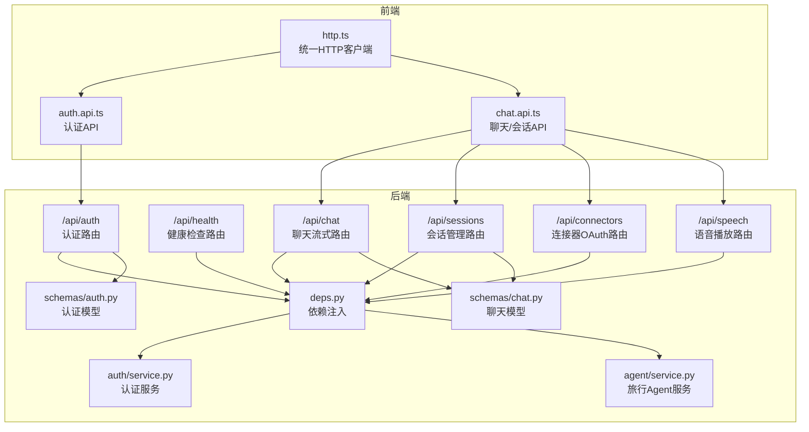
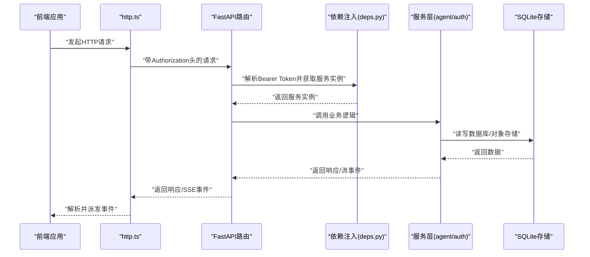
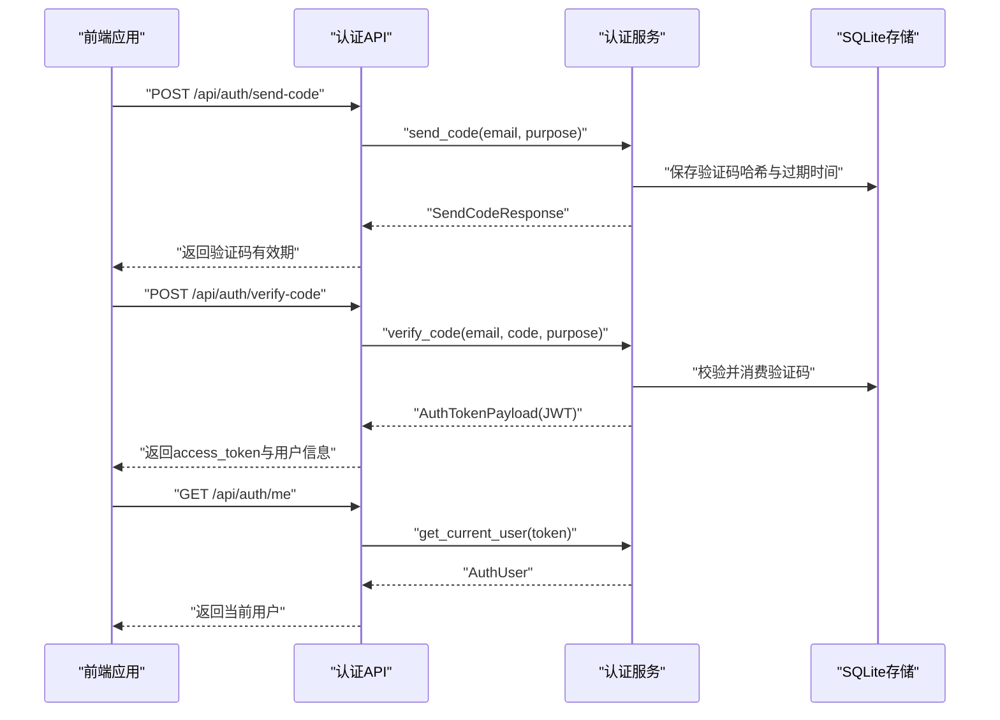
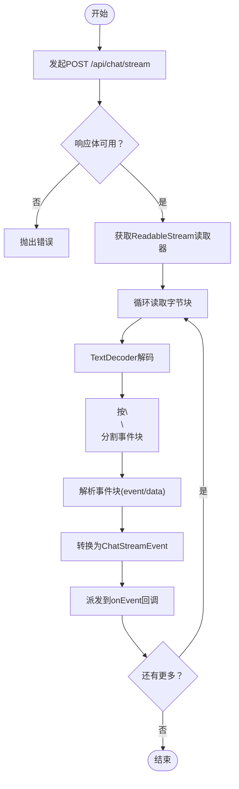
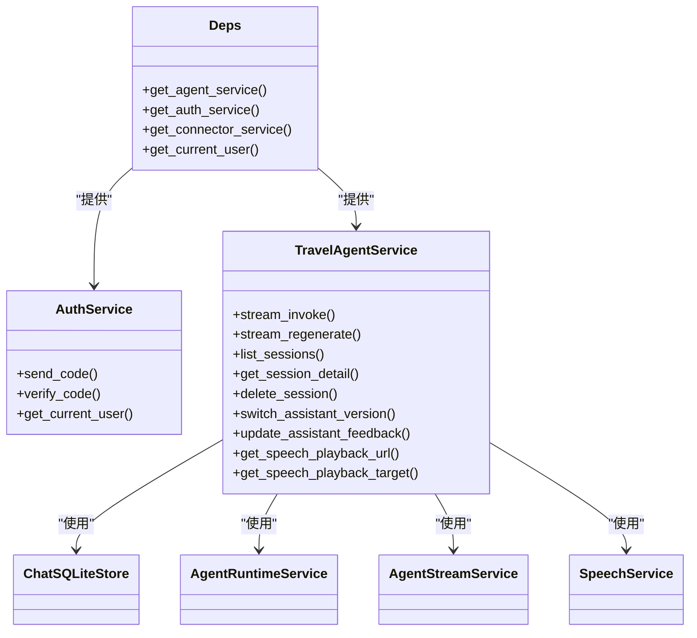

# API接口文档

<cite>
**本文档引用的文件**
- [backend/app/api/health.py](file://backend/app/api/health.py)
- [backend/app/api/chat.py](file://backend/app/api/chat.py)
- [backend/app/api/auth.py](file://backend/app/api/auth.py)
- [backend/app/api/sessions.py](file://backend/app/api/sessions.py)
- [backend/app/api/connectors.py](file://backend/app/api/connectors.py)
- [backend/app/api/speech.py](file://backend/app/api/speech.py)
- [backend/app/api/deps.py](file://backend/app/api/deps.py)
- [backend/app/auth/service.py](file://backend/app/auth/service.py)
- [backend/app/agent/service.py](file://backend/app/agent/service.py)
- [backend/app/schemas/auth.py](file://backend/app/schemas/auth.py)
- [backend/app/schemas/chat.py](file://backend/app/schemas/chat.py)
- [frontend/src/features/auth/api/auth.api.ts](file://frontend/src/features/auth/api/auth.api.ts)
- [frontend/src/features/chat/api/chat.api.ts](file://frontend/src/features/chat/api/chat.api.ts)
- [frontend/src/shared/lib/http.ts](file://frontend/src/shared/lib/http.ts)
- [backend/pyproject.toml](file://backend/pyproject.toml)
</cite>

## 目录
1. [简介](#简介)
2. [项目结构](#项目结构)
3. [核心组件](#核心组件)
4. [架构总览](#架构总览)
5. [详细组件分析](#详细组件分析)
6. [依赖关系分析](#依赖关系分析)
7. [性能考量](#性能考量)
8. [故障排除指南](#故障排除指南)
9. [结论](#结论)
10. [附录](#附录)

## 简介
本文件为 AI 旅行助手后端的完整 API 接口文档，覆盖健康检查、认证授权、聊天流式传输、会话管理、连接器 OAuth、语音播放等公共接口。文档详细说明每个端点的 HTTP 方法、URL 模式、请求参数、响应格式、错误码以及 SSE 事件格式与实时通信机制。同时提供认证授权机制、安全考虑、速率限制建议、SDK 使用指南与集成最佳实践，并说明 API 版本管理、向后兼容性与迁移指南。

## 项目结构
后端采用 FastAPI 构建，API 路由按功能模块划分：
- 认证模块：/api/auth
- 健康检查：/api/health
- 聊天流式：/api/chat
- 会话管理：/api/sessions
- 连接器 OAuth：/api/connectors
- 语音播放：/api/speech

前端 SDK 通过统一的 http 客户端封装，自动携带访问令牌并处理 SSE 流式事件。

**图表来源**
- [backend/app/api/auth.py:1-36](file://backend/app/api/auth.py#L1-L36)
- [backend/app/api/health.py:1-18](file://backend/app/api/health.py#L1-L18)
- [backend/app/api/chat.py:1-72](file://backend/app/api/chat.py#L1-L72)
- [backend/app/api/sessions.py:1-197](file://backend/app/api/sessions.py#L1-L197)
- [backend/app/api/connectors.py:1-103](file://backend/app/api/connectors.py#L1-L103)
- [backend/app/api/speech.py:1-35](file://backend/app/api/speech.py#L1-L35)
- [backend/app/api/deps.py:1-60](file://backend/app/api/deps.py#L1-L60)
- [backend/app/auth/service.py:1-312](file://backend/app/auth/service.py#L1-L312)
- [backend/app/agent/service.py:1-529](file://backend/app/agent/service.py#L1-L529)
- [backend/app/schemas/auth.py:1-51](file://backend/app/schemas/auth.py#L1-L51)
- [backend/app/schemas/chat.py:1-274](file://backend/app/schemas/chat.py#L1-L274)
- [frontend/src/shared/lib/http.ts:1-75](file://frontend/src/shared/lib/http.ts#L1-L75)
- [frontend/src/features/auth/api/auth.api.ts:1-21](file://frontend/src/features/auth/api/auth.api.ts#L1-L21)
- [frontend/src/features/chat/api/chat.api.ts:1-252](file://frontend/src/features/chat/api/chat.api.ts#L1-L252)

**章节来源**
- [backend/app/api/auth.py:1-36](file://backend/app/api/auth.py#L1-L36)
- [backend/app/api/health.py:1-18](file://backend/app/api/health.py#L1-L18)
- [backend/app/api/chat.py:1-72](file://backend/app/api/chat.py#L1-L72)
- [backend/app/api/sessions.py:1-197](file://backend/app/api/sessions.py#L1-L197)
- [backend/app/api/connectors.py:1-103](file://backend/app/api/connectors.py#L1-L103)
- [backend/app/api/speech.py:1-35](file://backend/app/api/speech.py#L1-L35)
- [backend/app/api/deps.py:1-60](file://backend/app/api/deps.py#L1-L60)
- [frontend/src/shared/lib/http.ts:1-75](file://frontend/src/shared/lib/http.ts#L1-L75)
- [frontend/src/features/auth/api/auth.api.ts:1-21](file://frontend/src/features/auth/api/auth.api.ts#L1-L21)
- [frontend/src/features/chat/api/chat.api.ts:1-252](file://frontend/src/features/chat/api/chat.api.ts#L1-L252)

## 核心组件
- 依赖注入与认证中间件：提供 Bearer Token 解析、用户鉴权与服务实例缓存。
- 认证服务：邮箱验证码发送与校验、JWT 签发与校验。
- 旅行 Agent 服务：聊天流式执行、会话管理、语音合成与播放。
- 数据模型：统一的认证与聊天领域模型，确保前后端一致性。

**章节来源**
- [backend/app/api/deps.py:1-60](file://backend/app/api/deps.py#L1-L60)
- [backend/app/auth/service.py:1-312](file://backend/app/auth/service.py#L1-L312)
- [backend/app/agent/service.py:1-529](file://backend/app/agent/service.py#L1-L529)
- [backend/app/schemas/auth.py:1-51](file://backend/app/schemas/auth.py#L1-L51)
- [backend/app/schemas/chat.py:1-274](file://backend/app/schemas/chat.py#L1-L274)

## 架构总览
后端基于 FastAPI 提供 RESTful 与 SSE 接口，前端通过统一 HTTP 客户端与 SSE 解析器消费接口。认证采用 Bearer Token，JWT 用于用户身份校验。聊天与会话接口通过 Agent 服务驱动 LangGraph 流式事件，结合 SQLite 存储与语音服务实现端到端能力。

**图表来源**
- [frontend/src/shared/lib/http.ts:1-75](file://frontend/src/shared/lib/http.ts#L1-L75)
- [backend/app/api/deps.py:1-60](file://backend/app/api/deps.py#L1-L60)
- [backend/app/agent/service.py:1-529](file://backend/app/agent/service.py#L1-L529)
- [backend/app/auth/service.py:1-312](file://backend/app/auth/service.py#L1-L312)

## 详细组件分析

### 健康检查接口
- 端点：GET /api/health
- 功能：返回服务健康状态与 Agent 运行时快照
- 请求：无
- 响应：包含状态与运行时快照的 JSON 对象
- 错误码：无特定错误码，成功返回 200

**章节来源**
- [backend/app/api/health.py:1-18](file://backend/app/api/health.py#L1-L18)

### 认证授权接口
- 端点：POST /api/auth/send-code
  - 功能：发送邮箱验证码
  - 请求体：SendCodeRequest
  - 响应体：SendCodeResponse
  - 错误码：400（验证码未发送/已失效）、404（登录场景未注册）、409（注册场景已注册）
- 端点：POST /api/auth/verify-code
  - 功能：校验验证码并完成登录/注册，返回访问令牌
  - 请求体：VerifyCodeRequest
  - 响应体：AuthTokenPayload
  - 错误码：400（未发送验证码/已失效/验证码过期/验证码错误）、404（登录场景未注册）、409（注册场景已注册）
- 端点：GET /api/auth/me
  - 功能：返回当前登录用户信息
  - 请求：Authorization: Bearer <token>
  - 响应体：AuthUser
  - 错误码：401（未登录/令牌无效）

认证流程序列图：

**图表来源**
- [backend/app/api/auth.py:1-36](file://backend/app/api/auth.py#L1-L36)
- [backend/app/auth/service.py:1-312](file://backend/app/auth/service.py#L1-L312)
- [backend/app/schemas/auth.py:1-51](file://backend/app/schemas/auth.py#L1-L51)

**章节来源**
- [backend/app/api/auth.py:1-36](file://backend/app/api/auth.py#L1-L36)
- [backend/app/auth/service.py:1-312](file://backend/app/auth/service.py#L1-L312)
- [backend/app/schemas/auth.py:1-51](file://backend/app/schemas/auth.py#L1-L51)

### 聊天流式接口
- 端点：GET /api/chat/model-profiles
  - 功能：返回前端可见的模型档位列表及默认档位键
  - 响应体：ListChatModelProfilesResponse
- 端点：POST /api/chat/stream
  - 功能：以 SSE 方式返回 LangGraph 原生流事件
  - 请求体：ChatInvokeRequest
  - 响应：text/event-stream，事件包括 turn.start、part.delta、tool.start、tool.done、message.completed、turn.done、error
  - 错误码：400（参数错误）、500（内部异常）

SSE 事件格式：
- 事件名称：字符串
- 数据：JSON 字符串，包含对应事件负载
- 编码：UTF-8
- 兼容性：设置 Cache-Control/no-cache、Connection/keep-alive、X-Accel-Buffering/no

前端 SSE 解析流程：

**图表来源**
- [frontend/src/features/chat/api/chat.api.ts:107-180](file://frontend/src/features/chat/api/chat.api.ts#L107-L180)
- [backend/app/api/chat.py:41-72](file://backend/app/api/chat.py#L41-L72)
- [backend/app/schemas/chat.py:1-274](file://backend/app/schemas/chat.py#L1-L274)

**章节来源**
- [backend/app/api/chat.py:1-72](file://backend/app/api/chat.py#L1-L72)
- [backend/app/schemas/chat.py:1-274](file://backend/app/schemas/chat.py#L1-L274)
- [frontend/src/features/chat/api/chat.api.ts:1-252](file://frontend/src/features/chat/api/chat.api.ts#L1-L252)

### 会话管理接口
- 端点：GET /api/sessions
  - 功能：返回会话摘要列表（按最近活跃时间倒序）
  - 响应体：SessionSummary[]
- 端点：GET /api/sessions/{thread_id}
  - 功能：返回指定会话详情
  - 响应体：SessionDetail
  - 错误码：404（会话不存在）
- 端点：PATCH /api/sessions/{thread_id}
  - 功能：重命名会话
  - 请求体：RenameSessionRequest
  - 响应体：SessionSummary
  - 错误码：404（会话不存在或标题非法）
- 端点：PATCH /api/sessions/{thread_id}/model-profile
  - 功能：更新线程当前模型档位
  - 请求体：UpdateSessionModelProfileRequest
  - 响应体：SessionModelProfileState
  - 错误码：400（模型档位无效）、404（会话不存在）
- 端点：DELETE /api/sessions/{thread_id}
  - 功能：删除会话及其全部消息
  - 响应体：{"deleted": true}
  - 错误码：404（会话不存在）
- 端点：POST /api/sessions/{thread_id}/messages/{message_id}/regenerate/stream
  - 功能：重新生成最新一条 assistant 回复（SSE）
  - 响应：text/event-stream，事件同聊天流式接口
  - 错误码：404（助手消息或版本不存在）
- 端点：PATCH /api/sessions/{thread_id}/messages/{message_id}/current-version
  - 功能：切换 assistant 当前展示版本
  - 请求体：SwitchAssistantVersionRequest
  - 响应体：PersistedChatMessage
  - 错误码：404（助手消息或版本不存在）
- 端点：PATCH /api/sessions/{thread_id}/messages/{message_id}/versions/{version_id}/feedback
  - 功能：更新 assistant 版本点赞/点踩
  - 请求体：UpdateAssistantFeedbackRequest
  - 响应体：PersistedChatMessage
  - 错误码：404（助手版本不存在）
- 端点：GET /api/sessions/{thread_id}/messages/{message_id}/versions/{version_id}/speech/playback-url
  - 功能：返回 assistant 版本的语音播放地址
  - 响应体：SpeechPlaybackUrlResponse
  - 错误码：404（文件未找到）、409（状态冲突）

**章节来源**
- [backend/app/api/sessions.py:1-197](file://backend/app/api/sessions.py#L1-L197)
- [backend/app/schemas/chat.py:1-274](file://backend/app/schemas/chat.py#L1-L274)

### 连接器 OAuth 接口
- 端点：GET /api/connectors
  - 功能：返回当前用户视角下可授权的应用列表
  - 响应体：ListConnectorsResponse
- 端点：POST /api/connectors/{connector_id}/authorize
  - 功能：生成浏览器需要打开的授权 URL
  - 响应体：StartAuthorizationResponse
  - 错误码：400（授权参数错误）
- 端点：DELETE /api/connectors/{connector_id}
  - 功能：断开当前用户对该应用的授权
  - 响应体：ConnectorState
  - 错误码：404（未找到授权状态）
- 端点：GET /api/connectors/oauth/callback
  - 功能：OAuth 授权回调，成功/失败均重定向回前端 connectors 页面
  - 查询参数：state、code、error、error_description
  - 响应：RedirectResponse，携带结果参数

**章节来源**
- [backend/app/api/connectors.py:1-103](file://backend/app/api/connectors.py#L1-L103)

### 语音播放接口
- 端点：GET /api/speech/play/{token}
  - 功能：根据短时 token 返回可直接播放的音频流
  - 响应：StreamingResponse（媒体类型由服务决定）
  - 错误码：401（令牌无效）、404（文件未找到）、409（状态冲突）

**章节来源**
- [backend/app/api/speech.py:1-35](file://backend/app/api/speech.py#L1-L35)

## 依赖关系分析
- 依赖注入：通过 LRU 缓存的工厂函数提供 TravelAgentService、AuthService、ConnectorService 单例，确保进程内共享运行时与连接状态。
- 认证中间件：HTTPBearer 解析 Bearer Token，调用 AuthService.get_current_user 获取当前用户。
- 服务层：TravelAgentService 封装聊天、会话、语音、检查点等能力；AuthService 封装 JWT、验证码、SMTP。
- 数据模型：pydantic 模型统一定义请求/响应结构，保证前后端一致性。

**图表来源**
- [backend/app/api/deps.py:1-60](file://backend/app/api/deps.py#L1-L60)
- [backend/app/auth/service.py:1-312](file://backend/app/auth/service.py#L1-L312)
- [backend/app/agent/service.py:1-529](file://backend/app/agent/service.py#L1-L529)

**章节来源**
- [backend/app/api/deps.py:1-60](file://backend/app/api/deps.py#L1-L60)
- [backend/app/auth/service.py:1-312](file://backend/app/auth/service.py#L1-L312)
- [backend/app/agent/service.py:1-529](file://backend/app/agent/service.py#L1-L529)

## 性能考量
- SSE 流式传输：设置 no-cache、keep-alive 与 X-Accel-Buffering/no，避免代理层缓冲导致延迟。
- 事件聚合：前端在 tool.start 时进行下一帧绘制机会的等待，平衡渲染与性能。
- 数据库与对象存储：会话删除时先查询语音对象键，再删除数据库记录，避免级联删除导致的查询为空。
- 语音合成：在流式文本增量时同步推进语音生成，完成后统一落盘与状态更新。

[本节为通用性能指导，不直接分析具体文件]

## 故障排除指南
- 认证相关
  - 401 未登录/令牌无效：检查 Authorization 头是否为 Bearer Token，确认 JWT 未过期。
  - 400 验证码问题：确认验证码是否已发送、是否过期、是否正确。
  - SMTP 失败：检查 SMTP_HOST、端口、TLS/SSL 模式与凭据配置。
- 聊天与会话
  - 404 会话/消息不存在：确认 thread_id/message_id 是否正确。
  - SSE 事件缺失：检查浏览器对 text/event-stream 的支持与网络代理配置。
- 语音播放
  - 401/404/409：确认 token 有效、文件存在且状态正常。

**章节来源**
- [backend/app/auth/service.py:1-312](file://backend/app/auth/service.py#L1-L312)
- [backend/app/api/sessions.py:1-197](file://backend/app/api/sessions.py#L1-L197)
- [backend/app/api/speech.py:1-35](file://backend/app/api/speech.py#L1-L35)

## 结论
本 API 文档系统性地梳理了健康检查、认证授权、聊天流式、会话管理、连接器 OAuth 与语音播放等核心接口，明确了请求/响应结构、SSE 事件格式与实时通信机制，并提供了前端 SDK 使用指南与集成最佳实践。建议在生产环境中配合速率限制、CORS、HTTPS 与日志审计等安全措施，确保系统的稳定性与安全性。

[本节为总结性内容，不直接分析具体文件]

## 附录

### API 端点一览表
- 认证
  - POST /api/auth/send-code → SendCodeResponse
  - POST /api/auth/verify-code → AuthTokenPayload
  - GET /api/auth/me → AuthUser
- 健康检查
  - GET /api/health → 健康状态+运行时快照
- 聊天
  - GET /api/chat/model-profiles → ListChatModelProfilesResponse
  - POST /api/chat/stream → text/event-stream
- 会话
  - GET /api/sessions → SessionSummary[]
  - GET /api/sessions/{thread_id} → SessionDetail
  - PATCH /api/sessions/{thread_id} → SessionSummary
  - PATCH /api/sessions/{thread_id}/model-profile → SessionModelProfileState
  - DELETE /api/sessions/{thread_id} → {"deleted": true}
  - POST /api/sessions/{thread_id}/messages/{message_id}/regenerate/stream → text/event-stream
  - PATCH /api/sessions/{thread_id}/messages/{message_id}/current-version → PersistedChatMessage
  - PATCH /api/sessions/{thread_id}/messages/{message_id}/versions/{version_id}/feedback → PersistedChatMessage
  - GET /api/sessions/{thread_id}/messages/{message_id}/versions/{version_id}/speech/playback-url → SpeechPlaybackUrlResponse
- 连接器 OAuth
  - GET /api/connectors → ListConnectorsResponse
  - POST /api/connectors/{connector_id}/authorize → StartAuthorizationResponse
  - DELETE /api/connectors/{connector_id} → ConnectorState
  - GET /api/connectors/oauth/callback → RedirectResponse
- 语音播放
  - GET /api/speech/play/{token} → audio/* 流

**章节来源**
- [backend/app/api/auth.py:1-36](file://backend/app/api/auth.py#L1-L36)
- [backend/app/api/health.py:1-18](file://backend/app/api/health.py#L1-L18)
- [backend/app/api/chat.py:1-72](file://backend/app/api/chat.py#L1-L72)
- [backend/app/api/sessions.py:1-197](file://backend/app/api/sessions.py#L1-L197)
- [backend/app/api/connectors.py:1-103](file://backend/app/api/connectors.py#L1-L103)
- [backend/app/api/speech.py:1-35](file://backend/app/api/speech.py#L1-L35)

### SSE 事件定义
- turn.start：一次聊天回合开始，包含 thread_id、user_message、assistant_message
- part.delta：文本/思考片段增量，包含 message_id、version_id、part_id、part_type、text_delta、annotations、status
- tool.start/tool.done：工具调用生命周期事件，包含 message_id、version_id、part（含 tool_call_id、tool_name、input、output、sources、cards、status）
- message.completed：助手消息完成后的稳定展示态，包含 message
- turn.done：一次聊天回合结束，包含 thread_id
- error：错误事件，包含 message

**章节来源**
- [backend/app/schemas/chat.py:1-274](file://backend/app/schemas/chat.py#L1-L274)
- [frontend/src/features/chat/api/chat.api.ts:33-86](file://frontend/src/features/chat/api/chat.api.ts#L33-L86)

### SDK 使用指南与集成最佳实践
- 统一 HTTP 客户端：使用 http.ts 自动添加 Content-Type 与 Authorization 头，处理非 2xx 响应与空响应。
- SSE 流解析：chat.api.ts 提供完整的 SSE 解析与事件派发逻辑，建议直接复用。
- 令牌管理：通过 auth.storage 存储与读取访问令牌，确保每次请求携带 Authorization: Bearer。
- 错误处理：捕获 HttpError 并根据 status 与 message 进行 UI 反馈与重试策略。

**章节来源**
- [frontend/src/shared/lib/http.ts:1-75](file://frontend/src/shared/lib/http.ts#L1-L75)
- [frontend/src/features/chat/api/chat.api.ts:1-252](file://frontend/src/features/chat/api/chat.api.ts#L1-L252)
- [frontend/src/features/auth/api/auth.api.ts:1-21](file://frontend/src/features/auth/api/auth.api.ts#L1-L21)

### 认证授权机制与安全考虑
- Bearer Token：所有受保护接口要求 Authorization: Bearer <token>
- JWT：HS256 算法签发，包含 sub、email、iat、exp；过期天数可通过环境变量配置
- 验证码：SHA-256 哈希 + JWT 密钥混入，HMAC 校验防止篡改
- SMTP：支持 STARTTLS/SSL 模式，错误分类提示便于定位配置问题
- 速率限制：建议在网关或反向代理层实施基于 IP/令牌的限流策略

**章节来源**
- [backend/app/api/deps.py:1-60](file://backend/app/api/deps.py#L1-L60)
- [backend/app/auth/service.py:1-312](file://backend/app/auth/service.py#L1-L312)

### API 版本管理、向后兼容性与迁移指南
- 版本策略：当前后端版本为 0.1.0，建议在 URL 中引入版本前缀（如 /v1/...）以便未来演进
- 向后兼容：pydantic 模型字段变更遵循“新增可选字段、不删除已有字段”的原则
- 迁移指南：当模型字段发生破坏性变更时，提供双版本并设置弃用时间窗，前端逐步迁移

**章节来源**
- [backend/pyproject.toml:1-42](file://backend/pyproject.toml#L1-L42)