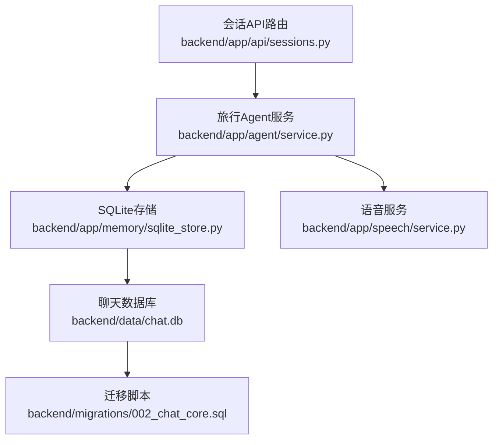
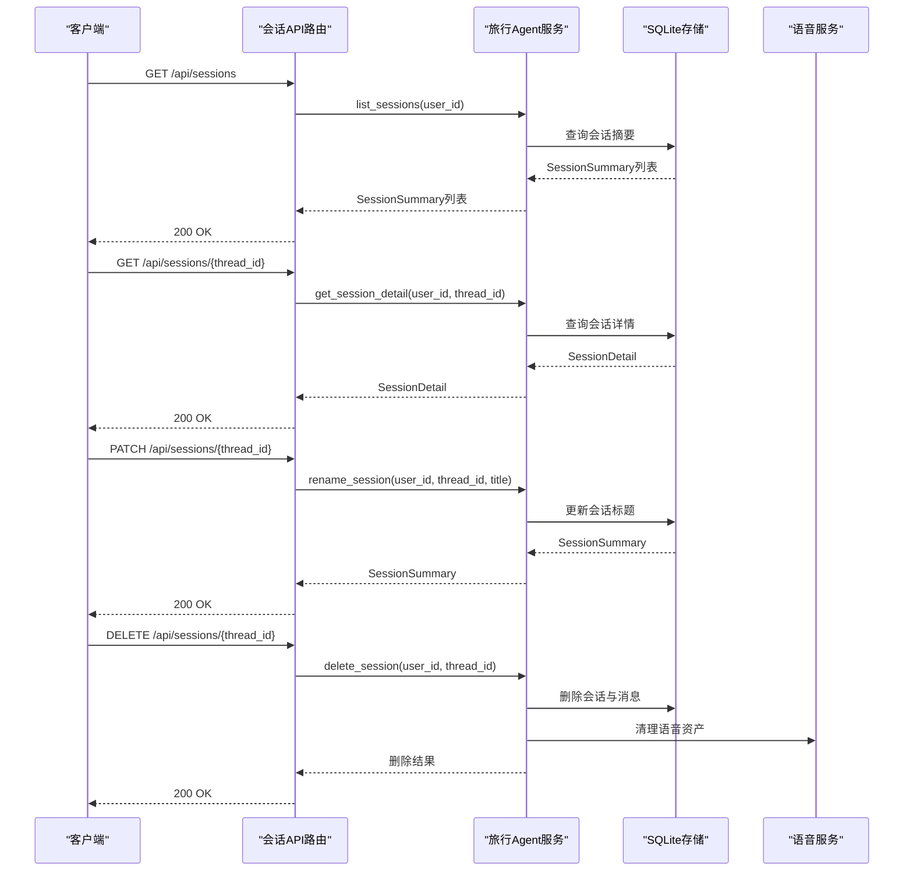
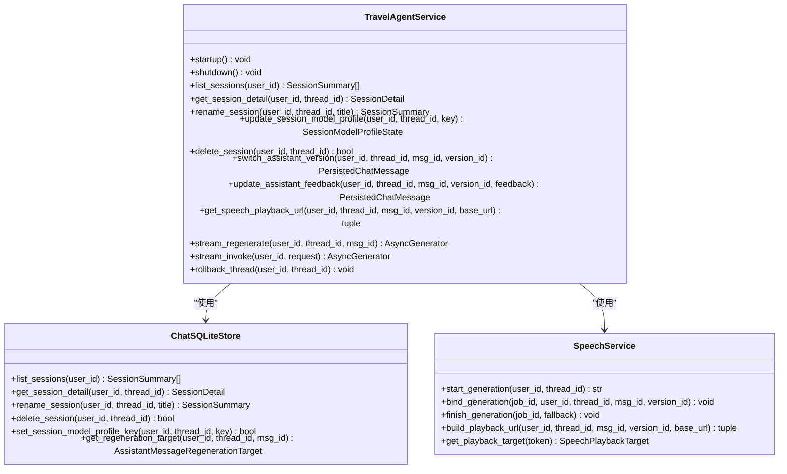
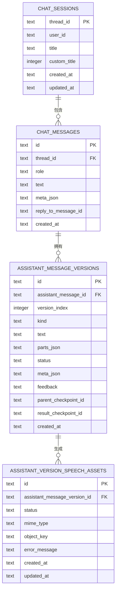
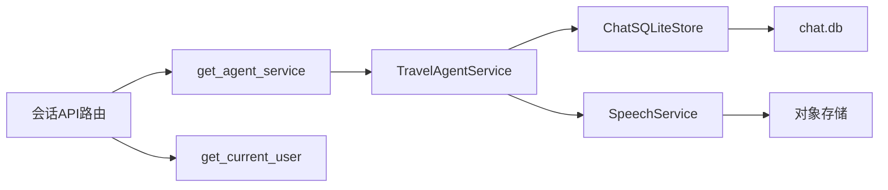

# 会话管理API

<cite>
**本文档引用的文件**
- [sessions.py](file://backend/app/api/sessions.py)
- [service.py](file://backend/app/agent/service.py)
- [sqlite_store.py](file://backend/app/memory/sqlite_store.py)
- [chat.py](file://backend/app/schemas/chat.py)
- [bootstrap.py](file://backend/app/db/bootstrap.py)
- [deps.py](file://backend/app/api/deps.py)
- [002_chat_core.sql](file://backend/migrations/002_chat_core.sql)
- [service.py](file://backend/app/speech/service.py)
</cite>

## 目录
1. [简介](#简介)
2. [项目结构](#项目结构)
3. [核心组件](#核心组件)
4. [架构概览](#架构概览)
5. [详细组件分析](#详细组件分析)
6. [依赖分析](#依赖分析)
7. [性能考虑](#性能考虑)
8. [故障排除指南](#故障排除指南)
9. [结论](#结论)

## 简介
本文件系统性阐述旅行Agent会话管理API的完整生命周期管理，覆盖会话列表获取、会话详情查询、会话重命名、会话删除等核心操作。文档同时解释会话状态管理、消息历史保存与会话持久化机制，明确会话ID生成规则、权限控制与数据隔离策略，并提供会话搜索、过滤与排序的API使用方法。最后给出性能优化建议、并发处理与错误恢复机制说明。

## 项目结构
会话管理API位于后端FastAPI路由层，通过依赖注入获取TravelAgentService，后者协调SQLite存储、运行时与语音服务，形成完整的会话生命周期管理闭环。

**图表来源**
- [sessions.py:1-197](file://backend/app/api/sessions.py#L1-L197)
- [service.py:1-529](file://backend/app/agent/service.py#L1-L529)
- [sqlite_store.py:123-800](file://backend/app/memory/sqlite_store.py#L123-L800)
- [service.py:90-114](file://backend/app/speech/service.py#L90-L114)
- [002_chat_core.sql:1-28](file://backend/migrations/002_chat_core.sql#L1-L28)

**章节来源**
- [sessions.py:1-197](file://backend/app/api/sessions.py#L1-L197)
- [service.py:97-124](file://backend/app/agent/service.py#L97-L124)
- [sqlite_store.py:123-150](file://backend/app/memory/sqlite_store.py#L123-L150)
- [service.py:90-114](file://backend/app/speech/service.py#L90-L114)
- [bootstrap.py:38-41](file://backend/app/db/bootstrap.py#L38-L41)
- [002_chat_core.sql:1-28](file://backend/migrations/002_chat_core.sql#L1-L28)

## 核心组件
- 会话API路由层：提供会话列表、详情、重命名、删除、消息版本切换、反馈更新、语音播放URL等REST接口。
- 旅行Agent服务层：封装业务逻辑，协调运行时、检查点、流式处理与语音服务。
- SQLite存储层：负责会话与消息的持久化、版本管理与预览刷新。
- 语音服务：负责语音生成、持久化与播放令牌签发。
- 数据库与迁移：定义会话与消息表结构及索引，确保数据一致性与性能。

**章节来源**
- [sessions.py:28-197](file://backend/app/api/sessions.py#L28-L197)
- [service.py:97-124](file://backend/app/agent/service.py#L97-L124)
- [sqlite_store.py:123-150](file://backend/app/memory/sqlite_store.py#L123-L150)
- [service.py:90-114](file://backend/app/speech/service.py#L90-L114)
- [bootstrap.py:38-41](file://backend/app/db/bootstrap.py#L38-L41)

## 架构概览
会话管理API采用分层架构：路由层负责HTTP协议与参数校验，服务层承载业务编排，存储层保证数据持久化，语音服务独立处理多媒体能力。权限控制通过Bearer Token认证，数据隔离基于user_id与thread_id双维度。

**图表来源**
- [sessions.py:37-100](file://backend/app/api/sessions.py#L37-L100)
- [service.py:129-176](file://backend/app/agent/service.py#L129-L176)
- [sqlite_store.py:593-779](file://backend/app/memory/sqlite_store.py#L593-L779)
- [service.py:168-176](file://backend/app/agent/service.py#L168-L176)

## 详细组件分析

### 会话API路由与接口定义
- 会话列表：GET /api/sessions，按最近活跃时间倒序返回SessionSummary列表。
- 会话详情：GET /api/sessions/{thread_id}，返回SessionDetail，包含消息历史与版本信息。
- 重命名会话：PATCH /api/sessions/{thread_id}，请求体为RenameSessionRequest，响应为SessionSummary。
- 更新会话模型档位：PATCH /api/sessions/{thread_id}/model-profile，请求体为UpdateSessionModelProfileRequest，响应为SessionModelProfileState。
- 删除会话：DELETE /api/sessions/{thread_id}，成功返回{"deleted": true}。
- 重新生成消息（流式）：POST /api/sessions/{thread_id}/messages/{message_id}/regenerate/stream，SSE流事件。
- 切换助手版本：PATCH /api/sessions/{thread_id}/messages/{message_id}/current-version，请求体为SwitchAssistantVersionRequest，响应为PersistedChatMessage。
- 更新助手反馈：PATCH /api/sessions/{thread_id}/messages/{message_id}/versions/{version_id}/feedback，请求体为UpdateAssistantFeedbackRequest，响应为PersistedChatMessage。
- 获取语音播放URL：GET /api/sessions/{thread_id}/messages/{message_id}/versions/{version_id}/speech/playback-url，响应为SpeechPlaybackUrlResponse。

权限与认证：所有接口均依赖依赖注入的get_current_user，要求有效的Bearer Token。

**章节来源**
- [sessions.py:37-197](file://backend/app/api/sessions.py#L37-L197)
- [deps.py:52-59](file://backend/app/api/deps.py#L52-L59)

### 旅行Agent服务层（业务编排）
- 会话查询：list_sessions、get_session_detail委托ChatSQLiteStore。
- 会话重命名：rename_session，支持自定义标题标记与更新时间。
- 会话删除：delete_session，级联删除会话、消息、版本与语音资产。
- 模型档位：update_session_model_profile，解析并设置当前线程模型档位。
- 流式重生成：stream_regenerate，构建再生目标、开启语音生成、流式代理运行时并完成消息稳定态。
- 语音播放URL：get_speech_playback_url，签发播放令牌并返回URL与状态。

**图表来源**
- [service.py:97-529](file://backend/app/agent/service.py#L97-L529)
- [sqlite_store.py:123-800](file://backend/app/memory/sqlite_store.py#L123-L800)
- [service.py:90-477](file://backend/app/speech/service.py#L90-L477)

**章节来源**
- [service.py:129-176](file://backend/app/agent/service.py#L129-L176)
- [service.py:269-371](file://backend/app/agent/service.py#L269-L371)
- [service.py:190-211](file://backend/app/agent/service.py#L190-L211)

### SQLite存储层（会话与消息持久化）
- 会话表：chat_sessions，包含thread_id、user_id、title、custom_title、created_at、updated_at等字段，按user_id+updated_at建立索引。
- 消息表：chat_messages，包含id、thread_id、role、text、meta_json、reply_to_message_id、created_at等字段，外键约束保证级联删除。
- 版本表：assistant_message_versions，记录助手消息的多个版本，支持original与regenerated类型。
- 语音资产表：assistant_version_speech_assets，关联版本与语音对象存储键值。
- 关键操作：
  - 列表查询：按updated_at降序返回摘要。
  - 详情查询：加载消息与版本，计算can_regenerate标志。
  - 重命名：更新title并标记custom_title=1。
  - 删除：删除会话与消息，自动回刷会话预览。
  - 再生目标：验证是否为最新助手消息且存在可再生original版本。

**图表来源**
- [002_chat_core.sql:1-28](file://backend/migrations/002_chat_core.sql#L1-L28)
- [sqlite_store.py:593-695](file://backend/app/memory/sqlite_store.py#L593-L695)

**章节来源**
- [sqlite_store.py:593-779](file://backend/app/memory/sqlite_store.py#L593-L779)
- [sqlite_store.py:781-800](file://backend/app/memory/sqlite_store.py#L781-L800)

### 会话ID生成规则与数据隔离
- 会话ID（thread_id）由客户端在首次发起聊天时通过ChatInvokeRequest的thread_id字段提供，默认使用UUID生成。
- 数据隔离：会话与消息均通过user_id与thread_id进行双重约束，确保不同用户间的数据隔离与同一用户下多会话的独立性。
- 标题生成：若未提供自定义标题，系统根据首条消息内容生成默认标题与预览文本。

**章节来源**
- [chat.py:18-29](file://backend/app/schemas/chat.py#L18-L29)
- [sqlite_store.py:182-222](file://backend/app/memory/sqlite_store.py#L182-L222)
- [sqlite_store.py:733-769](file://backend/app/memory/sqlite_store.py#L733-L769)

### 会话状态管理与消息历史保存
- 状态流转：消息状态包括streaming、completed、stopped、failed；版本状态包括generating、ready、failed。
- 历史保存：每次助手回复生成多个版本，支持original与regenerated；仅completed版本可作为再生目标。
- 版本切换：通过current_version_id指向当前展示版本，支持在original与regenerated之间切换。
- 反馈机制：支持对特定版本点赞/点踩，记录在versions.feedback字段。

**章节来源**
- [chat.py:116-130](file://backend/app/schemas/chat.py#L116-L130)
- [sqlite_store.py:617-695](file://backend/app/memory/sqlite_store.py#L617-L695)
- [service.py:178-188](file://backend/app/agent/service.py#L178-L188)

### 会话持久化机制与并发处理
- 持久化：所有写操作在单连接事务内执行，失败自动回滚，确保一致性。
- 并发处理：语音生成采用异步线程池与事件循环协作，避免阻塞主线程；流式事件通过SSE推送，支持取消与错误恢复。
- 错误恢复：流式过程中捕获异常，记录日志并清理临时资源，回滚到最近有效检查点。

**章节来源**
- [sqlite_store.py:138-148](file://backend/app/memory/sqlite_store.py#L138-L148)
- [service.py:328-346](file://backend/app/agent/service.py#L328-L346)
- [service.py:444-482](file://backend/app/agent/service.py#L444-L482)

### 会话搜索、过滤与排序
- 排序：会话列表按updated_at降序排列，体现最近活跃优先。
- 过滤：当前实现未提供额外过滤条件；可通过客户端缓存与本地筛选实现。
- 搜索：消息层面支持按角色与时间范围检索，但API未暴露专门的搜索接口。

**章节来源**
- [sqlite_store.py:593-615](file://backend/app/memory/sqlite_store.py#L593-L615)
- [sqlite_store.py:631-639](file://backend/app/memory/sqlite_store.py#L631-L639)

### 具体使用示例（接口路径）
- 创建新会话：POST /api/chat（参考ChatInvokeRequest），首次发送消息即创建会话并生成thread_id。
- 恢复历史会话：GET /api/sessions/{thread_id}，获取SessionDetail后在前端渲染消息历史。
- 管理会会话元数据：PATCH /api/sessions/{thread_id}/model-profile更新模型档位；PATCH /api/sessions/{thread_id}重命名会话。
- 重新生成消息：POST /api/sessions/{thread_id}/messages/{message_id}/regenerate/stream，监听SSE事件turn.start、message.completed、turn.done。
- 切换版本与反馈：PATCH /api/sessions/{thread_id}/messages/{message_id}/current-version与PATCH /api/sessions/{thread_id}/messages/{message_id}/versions/{version_id}/feedback。
- 语音播放：GET /api/sessions/{thread_id}/messages/{message_id}/versions/{version_id}/speech/playback-url，获得播放URL后访问/api/speech/play/{token}。

**章节来源**
- [sessions.py:37-197](file://backend/app/api/sessions.py#L37-L197)
- [chat.py:18-29](file://backend/app/schemas/chat.py#L18-L29)

## 依赖分析
- 路由依赖：API路由依赖依赖注入函数get_agent_service与get_current_user，前者提供TravelAgentService单例，后者解析Bearer Token并返回AuthUser。
- 服务依赖：TravelAgentService依赖ChatSQLiteStore（持久化）、AgentRuntimeService（运行时）、AgentStreamService（流式）、SpeechService（语音）。
- 存储依赖：ChatSQLiteStore依赖SQLite数据库，迁移脚本确保表结构与索引一致。
- 语音依赖：SpeechService依赖对象存储与DashScope TTS服务，提供生成、持久化与播放能力。

**图表来源**
- [deps.py:18-32](file://backend/app/api/deps.py#L18-L32)
- [service.py:97-114](file://backend/app/agent/service.py#L97-L114)
- [bootstrap.py:38-41](file://backend/app/db/bootstrap.py#L38-L41)

**章节来源**
- [deps.py:18-32](file://backend/app/api/deps.py#L18-L32)
- [service.py:97-114](file://backend/app/agent/service.py#L97-L114)
- [bootstrap.py:181-225](file://backend/app/db/bootstrap.py#L181-L225)

## 性能考虑
- 数据库索引：chat_sessions按(user_id, updated_at)索引，chat_messages按(thread_id, created_at)索引，提升查询效率。
- 流式处理：SSE事件与异步生成避免阻塞，结合语音生成的异步队列降低延迟。
- 缓存策略：前端可缓存会话列表与详情，减少重复请求；语音播放URL带短期令牌，避免长期暴露。
- 批量操作：删除会话时先查询语音对象键，再删除数据库记录，避免级联删除导致的查询空集。

**章节来源**
- [bootstrap.py:100-110](file://backend/app/db/bootstrap.py#L100-L110)
- [sqlite_store.py:25-28](file://backend/app/memory/sqlite_store.py#L25-L28)
- [service.py:168-176](file://backend/app/agent/service.py#L168-L176)

## 故障排除指南
- 404错误：会话不存在或消息版本不存在，检查thread_id与message_id是否正确。
- 400错误：模型档位无效或请求体不合法，确认UpdateSessionModelProfileRequest与RenameSessionRequest格式。
- 409冲突：语音资产状态不可用，等待生成完成或检查TTS服务可用性。
- 流式错误：SSE事件error包含错误消息，前端应提示用户重试或检查网络。
- 日志定位：服务层在异常时记录详细上下文，便于排查运行时与检查点问题。

**章节来源**
- [sessions.py:67-87](file://backend/app/api/sessions.py#L67-L87)
- [sessions.py:118-121](file://backend/app/api/sessions.py#L118-L121)
- [service.py:250-267](file://backend/app/agent/service.py#L250-L267)

## 结论
会话管理API通过清晰的分层设计与完善的持久化机制，实现了旅行Agent会话的全生命周期管理。权限控制与数据隔离确保安全性，流式处理与语音服务提供良好的用户体验。建议在生产环境中关注数据库索引、流式错误恢复与语音服务可用性，持续优化并发与缓存策略以提升整体性能。