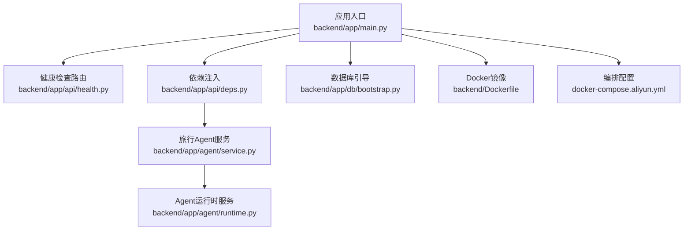
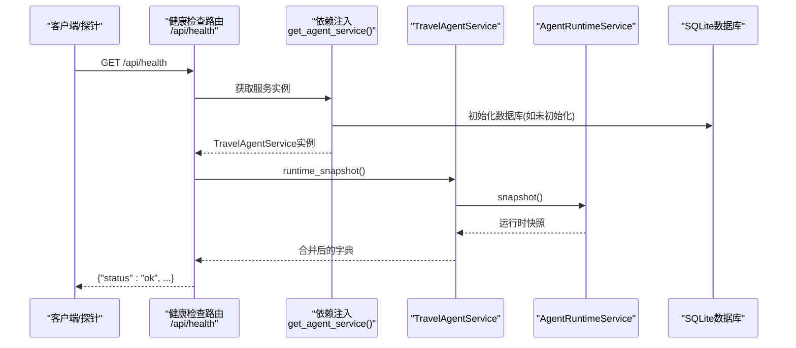
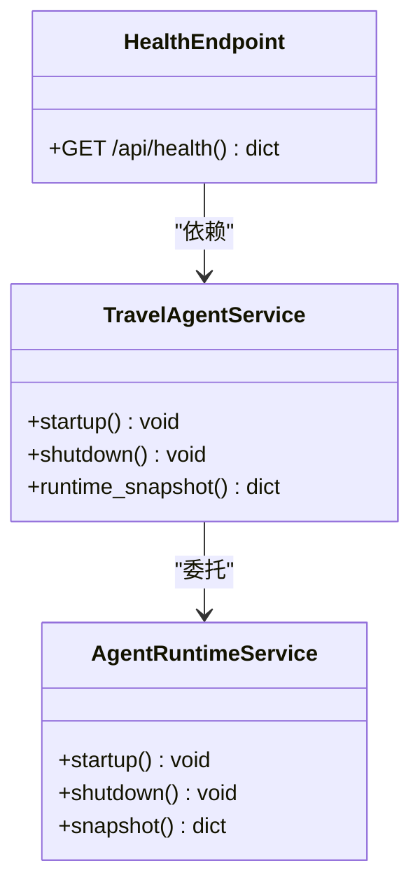
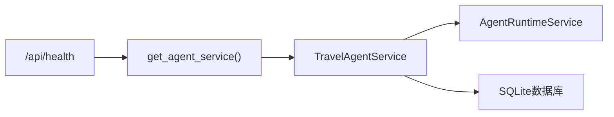

# 健康检查API

<cite>
**本文档引用的文件**
- [backend/app/api/health.py](file://backend/app/api/health.py)
- [backend/app/main.py](file://backend/app/main.py)
- [backend/app/api/deps.py](file://backend/app/api/deps.py)
- [backend/app/agent/service.py](file://backend/app/agent/service.py)
- [backend/app/agent/runtime.py](file://backend/app/agent/runtime.py)
- [backend/app/db/bootstrap.py](file://backend/app/db/bootstrap.py)
- [backend/Dockerfile](file://backend/Dockerfile)
- [docker-compose.aliyun.yml](file://docker-compose.aliyun.yml)
- [.agents/skills/aliyun-1panel-app-deploy/references/workflow.md](file://.agents/skills/aliyun-1panel-app-deploy/references/workflow.md)
- [backend/tests/test_api.py](file://backend/tests/test_api.py)
</cite>

## 目录
1. [简介](#简介)
2. [项目结构](#项目结构)
3. [核心组件](#核心组件)
4. [架构总览](#架构总览)
5. [详细组件分析](#详细组件分析)
6. [依赖关系分析](#依赖关系分析)
7. [性能考量](#性能考量)
8. [故障排查指南](#故障排查指南)
9. [结论](#结论)
10. [附录](#附录)

## 简介
本文件系统化地文档化了系统的健康检查API，重点覆盖以下方面：
- /health端点的响应格式与健康状态判断标准
- 数据库连接状态、外部服务可用性检查与系统资源监控
- 健康检查的最佳实践、告警配置与故障诊断方法
- 负载均衡器健康检查、容器编排健康探针与自动化运维集成
- CI/CD流水线与运维平台的集成示例
- 健康检查API的性能影响、缓存策略与安全考虑

## 项目结构
健康检查API位于后端FastAPI应用中，通过路由注册到主应用生命周期中。其核心实现依赖于Agent运行时快照，从而将服务健康状态与外部工具连接状态、本地工具集等运行时信息统一呈现。

**图表来源**
- [backend/app/main.py:31-54](file://backend/app/main.py#L31-L54)
- [backend/app/api/health.py:13-17](file://backend/app/api/health.py#L13-L17)
- [backend/app/api/deps.py:18-32](file://backend/app/api/deps.py#L18-L32)
- [backend/app/agent/service.py:97-127](file://backend/app/agent/service.py#L97-L127)
- [backend/app/agent/runtime.py:156-173](file://backend/app/agent/runtime.py#L156-L173)
- [backend/app/db/bootstrap.py:213-225](file://backend/app/db/bootstrap.py#L213-L225)
- [backend/Dockerfile:18-20](file://backend/Dockerfile#L18-L20)
- [docker-compose.aliyun.yml:1-14](file://docker-compose.aliyun.yml#L1-L14)

**章节来源**
- [backend/app/main.py:31-54](file://backend/app/main.py#L31-L54)
- [backend/app/api/health.py:13-17](file://backend/app/api/health.py#L13-L17)
- [backend/app/api/deps.py:18-32](file://backend/app/api/deps.py#L18-L32)
- [backend/app/agent/service.py:97-127](file://backend/app/agent/service.py#L97-L127)
- [backend/app/agent/runtime.py:156-173](file://backend/app/agent/runtime.py#L156-L173)
- [backend/app/db/bootstrap.py:213-225](file://backend/app/db/bootstrap.py#L213-L225)
- [backend/Dockerfile:18-20](file://backend/Dockerfile#L18-L20)
- [docker-compose.aliyun.yml:1-14](file://docker-compose.aliyun.yml#L1-L14)

## 核心组件
- 健康检查路由：提供GET /api/health端点，返回服务健康状态与Agent运行时快照。
- 依赖注入：通过缓存的工厂函数获取全局唯一的TravelAgentService实例。
- Agent运行时快照：聚合运行时状态、MCP连接状态、工具列表与错误信息，作为健康状态的依据。
- 数据库引导：在应用启动时初始化SQLite数据库，确保健康检查可访问数据库。

**章节来源**
- [backend/app/api/health.py:13-17](file://backend/app/api/health.py#L13-L17)
- [backend/app/api/deps.py:18-32](file://backend/app/api/deps.py#L18-L32)
- [backend/app/agent/runtime.py:156-173](file://backend/app/agent/runtime.py#L156-L173)
- [backend/app/db/bootstrap.py:213-225](file://backend/app/db/bootstrap.py#L213-L225)

## 架构总览
健康检查API的调用链路如下：

**图表来源**
- [backend/app/api/health.py:13-17](file://backend/app/api/health.py#L13-L17)
- [backend/app/api/deps.py:18-32](file://backend/app/api/deps.py#L18-L32)
- [backend/app/agent/service.py:125-127](file://backend/app/agent/service.py#L125-L127)
- [backend/app/agent/runtime.py:156-173](file://backend/app/agent/runtime.py#L156-L173)
- [backend/app/db/bootstrap.py:213-225](file://backend/app/db/bootstrap.py#L213-L225)

## 详细组件分析

### 健康检查端点与响应格式
- 端点：GET /api/health
- 响应：固定包含键"status"，值为"ok"；其余字段来自Agent运行时快照。
- 快照字段（来自运行时服务）：
  - ready：布尔值，表示Agent运行时是否已就绪
  - mcp_connected_servers：字符串数组，表示已连接的MCP服务器URL列表
  - mcp_errors：字符串数组，表示运行时遇到的错误信息
  - local_tools：字符串数组，表示本地可用工具名称列表
  - mcp_tools：字符串数组，表示通过MCP可用的工具名称列表

健康状态判断标准：
- 服务整体健康：HTTP 200，且响应体包含"status":"ok"
- 运行时健康：ready为true
- 外部服务健康：mcp_connected_servers非空且mcp_errors为空
- 工具可用性：local_tools与mcp_tools均非空（视业务需求）

**章节来源**
- [backend/app/api/health.py:13-17](file://backend/app/api/health.py#L13-L17)
- [backend/app/agent/runtime.py:156-173](file://backend/app/agent/runtime.py#L156-L173)

### 依赖注入与服务实例
- 通过LRU缓存的工厂函数提供全局单例TravelAgentService，确保同一进程内复用运行时与MCP连接状态。
- 该服务在应用启动时初始化，健康检查无需额外初始化成本。

**章节来源**
- [backend/app/api/deps.py:18-32](file://backend/app/api/deps.py#L18-L32)

### Agent运行时快照
- 当运行时未就绪时，返回默认快照（ready=false，空列表）
- 当运行时就绪时，返回包含连接服务器、错误列表、本地工具与MCP工具的快照

**图表来源**
- [backend/app/agent/service.py:97-127](file://backend/app/agent/service.py#L97-L127)
- [backend/app/agent/runtime.py:156-173](file://backend/app/agent/runtime.py#L156-L173)
- [backend/app/api/health.py:13-17](file://backend/app/api/health.py#L13-L17)

### 数据库连接状态
- 应用启动时通过数据库引导函数初始化SQLite数据库，确保健康检查可访问数据库。
- 健康检查响应中的数据库状态可通过运行时快照间接反映（若运行时依赖数据库则会体现为ready与错误列表）。

**章节来源**
- [backend/app/db/bootstrap.py:213-225](file://backend/app/db/bootstrap.py#L213-L225)

### 外部服务可用性检查
- 健康检查通过MCP连接状态与工具列表反映外部服务可用性。
- 若存在连接错误或工具列表为空，应在告警与监控中进行标记。

**章节来源**
- [backend/app/agent/runtime.py:156-173](file://backend/app/agent/runtime.py#L156-L173)

### 系统资源监控
- 健康检查API本身为轻量级接口，不直接暴露系统资源指标（CPU、内存、磁盘等）。
- 建议结合容器编排与探针机制，配合独立的资源监控系统进行综合评估。

## 依赖关系分析
健康检查API的依赖关系如下：

**图表来源**
- [backend/app/api/health.py:13-17](file://backend/app/api/health.py#L13-L17)
- [backend/app/api/deps.py:18-32](file://backend/app/api/deps.py#L18-L32)
- [backend/app/agent/service.py:97-127](file://backend/app/agent/service.py#L97-L127)
- [backend/app/db/bootstrap.py:213-225](file://backend/app/db/bootstrap.py#L213-L225)

**章节来源**
- [backend/app/api/health.py:13-17](file://backend/app/api/health.py#L13-L17)
- [backend/app/api/deps.py:18-32](file://backend/app/api/deps.py#L18-L32)
- [backend/app/agent/service.py:97-127](file://backend/app/agent/service.py#L97-L127)
- [backend/app/db/bootstrap.py:213-225](file://backend/app/db/bootstrap.py#L213-L225)

## 性能考量
- 响应时间：健康检查为轻量级接口，主要开销来自运行时快照生成与数据库连接初始化（仅在首次访问时发生）。
- 缓存策略：依赖注入层使用LRU缓存，同一进程内复用服务实例，避免重复初始化。
- 并发与压力：建议在高并发场景下结合探针与限流策略，避免健康检查成为瓶颈。
- 资源占用：健康检查不引入额外的IO或计算密集操作，对系统资源影响极小。

**章节来源**
- [backend/app/api/deps.py:18-32](file://backend/app/api/deps.py#L18-L32)
- [backend/app/agent/runtime.py:156-173](file://backend/app/agent/runtime.py#L156-L173)

## 故障排查指南
- 健康检查返回非200或status不为"ok"：检查Agent运行时是否已启动，查看mcp_errors与mcp_connected_servers。
- 连接外部服务失败：核对MCP服务器配置与网络连通性，关注mcp_errors中的具体错误。
- 数据库异常：确认数据库引导流程是否成功，检查SQLite文件权限与路径。
- 探针误报：结合日志与监控系统定位瞬时波动，避免将偶发性错误误判为持续故障。

**章节来源**
- [backend/app/agent/runtime.py:156-173](file://backend/app/agent/runtime.py#L156-L173)
- [backend/app/db/bootstrap.py:213-225](file://backend/app/db/bootstrap.py#L213-L225)

## 结论
健康检查API通过运行时快照将服务健康状态、外部服务连接状态与工具可用性统一呈现，为运维与自动化提供了可靠的健康度量。结合容器编排探针与独立监控系统，可实现全面的健康保障与快速故障定位。

## 附录

### 负载均衡器健康检查
- 健康检查URL：https://{DOMAIN}/api/health
- 响应码：200
- 响应体：包含"status":"ok"与运行时快照

**章节来源**
- [.agents/skills/aliyun-1panel-app-deploy/references/workflow.md:275](file://.agents/skills/aliyun-1panel-app-deploy/references/workflow.md#L275)

### 容器编排健康探针
- 容器端口：8000
- 探针路径：/api/health
- 建议：结合启动延迟与超时参数，避免冷启动期间误判

**章节来源**
- [backend/Dockerfile:18-20](file://backend/Dockerfile#L18-L20)
- [docker-compose.aliyun.yml:9-10](file://docker-compose.aliyun.yml#L9-L10)

### 自动化运维集成
- CI/CD流水线：在部署后执行curl或HTTP请求验证/health端点
- 运维平台：将/health端点纳入SLA监控与告警规则

**章节来源**
- [.agents/skills/aliyun-1panel-app-deploy/references/workflow.md:275](file://.agents/skills/aliyun-1panel-app-deploy/references/workflow.md#L275)

### 安全考虑
- 本端点未要求认证，建议在生产环境中通过网关或反向代理限制访问范围
- 若需增强安全，可在上游添加鉴权或白名单策略

**章节来源**
- [backend/app/api/health.py:13-17](file://backend/app/api/health.py#L13-L17)

### 测试参考
- 单元测试中对/health端点的调用与状态码断言

**章节来源**
- [backend/tests/test_api.py:335-336](file://backend/tests/test_api.py#L335-L336)