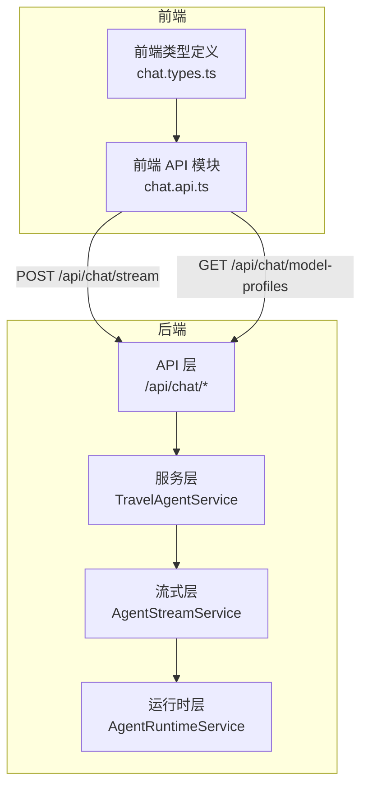
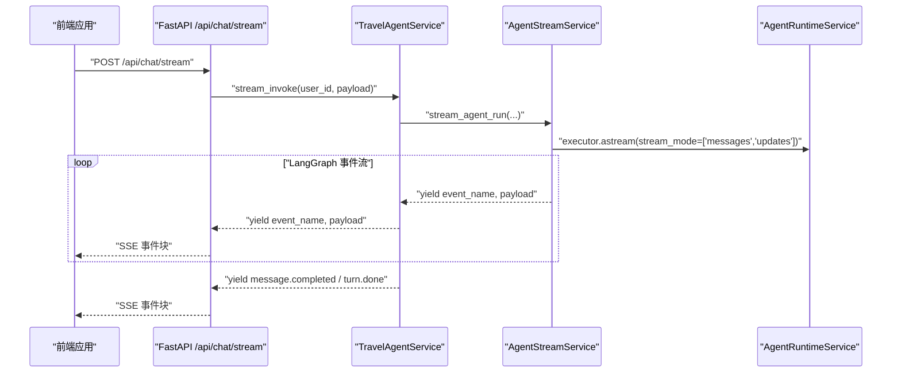
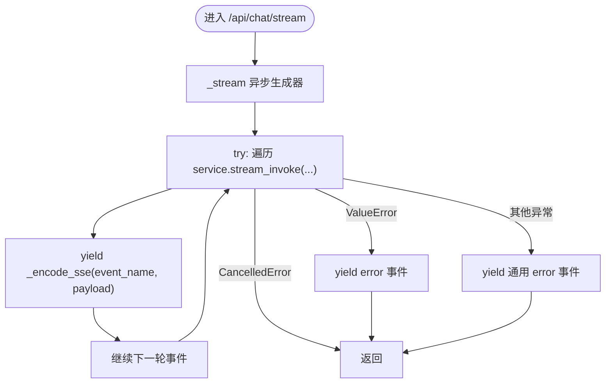
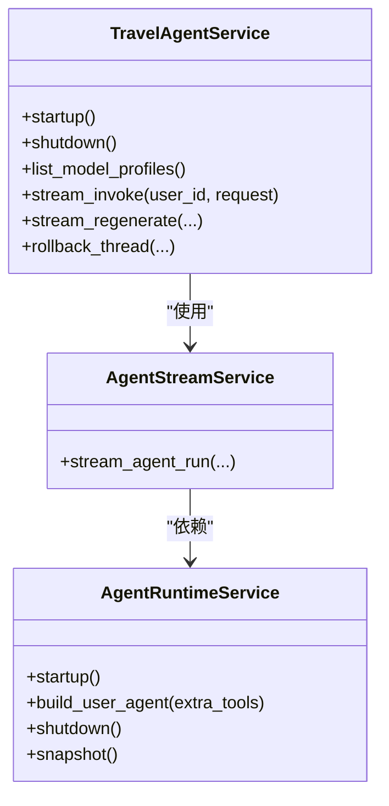
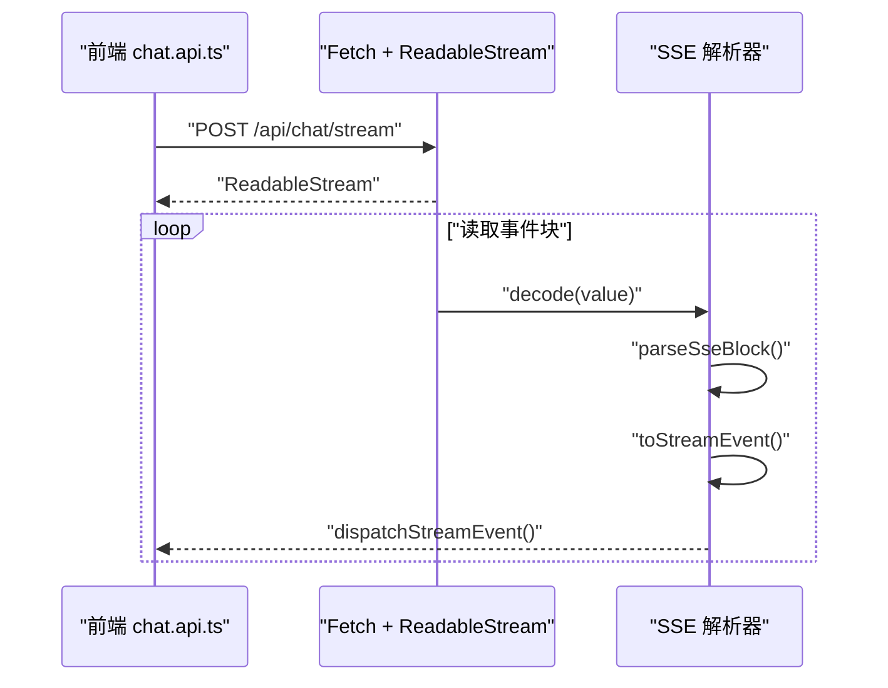
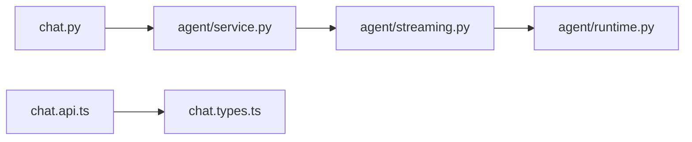

# 聊天API

<cite>
**本文引用的文件**
- [backend/app/api/chat.py](file://backend/app/api/chat.py)
- [backend/app/schemas/chat.py](file://backend/app/schemas/chat.py)
- [backend/app/agent/service.py](file://backend/app/agent/service.py)
- [backend/app/agent/streaming.py](file://backend/app/agent/streaming.py)
- [backend/app/agent/runtime.py](file://backend/app/agent/runtime.py)
- [backend/tests/test_agent_streaming.py](file://backend/tests/test_agent_streaming.py)
- [frontend/src/features/chat/api/chat.api.ts](file://frontend/src/features/chat/api/chat.api.ts)
- [frontend/src/features/chat/model/chat.types.ts](file://frontend/src/features/chat/model/chat.types.ts)
</cite>

## 目录
1. [简介](#简介)
2. [项目结构](#项目结构)
3. [核心组件](#核心组件)
4. [架构总览](#架构总览)
5. [详细组件分析](#详细组件分析)
6. [依赖关系分析](#依赖关系分析)
7. [性能考量](#性能考量)
8. [故障排查指南](#故障排查指南)
9. [结论](#结论)
10. [附录](#附录)

## 简介
本文件系统化梳理聊天API的流式设计与实现，重点覆盖：
- SSE（Server-Sent Events）流式传输机制与事件类型
- /api/chat/stream 端点的实时流式响应
- /api/chat/model-profiles 端点用于获取模型档位列表
- 请求参数、响应格式、错误处理与断线重连策略
- 客户端集成最佳实践与性能优化建议

## 项目结构
后端采用 FastAPI + LangGraph 的分层架构：API 层负责路由与SSE封装，服务层协调运行时、工具与持久化，流式层将 LangGraph 的“messages/updates”两类事件映射为前端可消费的SSE事件。前端通过标准 Fetch + ReadableStream 解析SSE，按事件类型驱动UI更新。

图表来源
- [backend/app/api/chat.py:1-72](file://backend/app/api/chat.py#L1-L72)
- [backend/app/agent/service.py:373-507](file://backend/app/agent/service.py#L373-L507)
- [backend/app/agent/streaming.py:80-147](file://backend/app/agent/streaming.py#L80-L147)
- [backend/app/agent/runtime.py:61-174](file://backend/app/agent/runtime.py#L61-L174)
- [frontend/src/features/chat/api/chat.api.ts:107-180](file://frontend/src/features/chat/api/chat.api.ts#L107-L180)
- [frontend/src/features/chat/model/chat.types.ts:76-130](file://frontend/src/features/chat/model/chat.types.ts#L76-L130)

章节来源
- [backend/app/api/chat.py:1-72](file://backend/app/api/chat.py#L1-L72)
- [frontend/src/features/chat/api/chat.api.ts:107-180](file://frontend/src/features/chat/api/chat.api.ts#L107-L180)

## 核心组件
- API 层（FastAPI）
  - /api/chat/stream：SSE 流式端点，将服务层产生的事件转为SSE事件块
  - /api/chat/model-profiles：返回前端可见的模型档位列表
- 服务层（TravelAgentService）
  - 统一编排：启动运行时、解析模型档位、调用流式执行、持久化消息与版本、语音合成绑定
  - 流式入口：stream_invoke 返回异步事件迭代器
- 流式层（AgentStreamService）
  - 将 LangGraph 的 messages/updates 两类事件映射为前端事件：part.delta、tool.start、tool.done、message.completed、turn.done、turn.start
- 运行时层（AgentRuntimeService）
  - 构建 Agent、加载 MCP 工具、管理检查点与内存存储
- 前端（chat.api.ts + chat.types.ts）
  - 建立SSE连接、解析事件、派发到UI回调、处理断线重连

章节来源
- [backend/app/api/chat.py:31-72](file://backend/app/api/chat.py#L31-L72)
- [backend/app/agent/service.py:373-507](file://backend/app/agent/service.py#L373-L507)
- [backend/app/agent/streaming.py:74-147](file://backend/app/agent/streaming.py#L74-L147)
- [backend/app/agent/runtime.py:61-174](file://backend/app/agent/runtime.py#L61-L174)
- [frontend/src/features/chat/api/chat.api.ts:107-180](file://frontend/src/features/chat/api/chat.api.ts#L107-L180)
- [frontend/src/features/chat/model/chat.types.ts:76-130](file://frontend/src/features/chat/model/chat.types.ts#L76-L130)

## 架构总览
SSE事件类型与数据格式
- 事件类型
  - turn.start：一次聊天回合开始，携带 thread_id、user_message（可选）、assistant_message
  - part.delta：文本/思考片段增量，携带 message_id、version_id、part_id、part_type、text_delta、annotations、status
  - tool.start/tool.done：工具调用生命周期事件，携带 message_id、version_id、part（工具片段）
  - message.completed：助手消息完成后的稳定展示态，携带完整 PersistedChatMessage
  - turn.done：一次聊天回合结束，携带 thread_id
  - error：错误事件，携带 message 字符串
- 数据格式
  - 所有事件均以 JSON 字符串形式随 data: 发送
  - 事件名称通过 event: 指定
  - 前端解析后以 ChatStreamEvent 类型分发

图表来源
- [backend/app/api/chat.py:41-72](file://backend/app/api/chat.py#L41-L72)
- [backend/app/agent/service.py:373-507](file://backend/app/agent/service.py#L373-L507)
- [backend/app/agent/streaming.py:80-147](file://backend/app/agent/streaming.py#L80-L147)

## 详细组件分析

### /api/chat/stream 流式端点
- 功能
  - 接收 ChatInvokeRequest，调用服务层 stream_invoke
  - 将事件名称与负载封装为SSE事件块（event: 与 data:）
  - 设置合适的响应头（Cache-Control、Connection、X-Accel-Buffering）
- 错误处理
  - 捕获 ValueError：向客户端发送 error 事件
  - 捕获其他异常：发送通用错误事件
  - 取消任务：优雅退出
- SSE 编码
  - 使用 _encode_sse 将事件名与JSON负载拼接为UTF-8字节块

图表来源
- [backend/app/api/chat.py:41-72](file://backend/app/api/chat.py#L41-L72)
- [backend/app/api/chat.py:25-28](file://backend/app/api/chat.py#L25-L28)

章节来源
- [backend/app/api/chat.py:41-72](file://backend/app/api/chat.py#L41-L72)

### /api/chat/model-profiles 端点
- 功能
  - 返回前端可见的模型档位列表，包含默认档位 key 与 profiles
- 实现
  - 调用服务层 list_model_profiles，解析默认档位并返回 ListChatModelProfilesResponse

章节来源
- [backend/app/api/chat.py:31-38](file://backend/app/api/chat.py#L31-L38)
- [backend/app/agent/service.py:141-152](file://backend/app/agent/service.py#L141-L152)
- [backend/app/schemas/chat.py:231-235](file://backend/app/schemas/chat.py#L231-L235)

### 服务层：TravelAgentService
- 关键职责
  - 解析线程当前使用的模型档位
  - 追加用户消息、创建助手占位消息、启动语音生成
  - 调用 AgentStreamService 执行 LangGraph 流式执行
  - 汇总最终响应、完成消息持久化、设置稳定检查点
  - 异常时回滚线程、标记消息状态为 stopped/failed
- 事件产出
  - turn.start：回合开始
  - part.delta：文本/思考增量
  - tool.start/tool.done：工具调用生命周期
  - message.completed：消息完成
  - turn.done：回合结束
  - error：异常时的错误事件

图表来源
- [backend/app/agent/service.py:97-529](file://backend/app/agent/service.py#L97-L529)
- [backend/app/agent/streaming.py:74-147](file://backend/app/agent/streaming.py#L74-L147)
- [backend/app/agent/runtime.py:61-174](file://backend/app/agent/runtime.py#L61-L174)

章节来源
- [backend/app/agent/service.py:373-507](file://backend/app/agent/service.py#L373-L507)
- [backend/app/agent/streaming.py:80-147](file://backend/app/agent/streaming.py#L80-L147)
- [backend/app/agent/runtime.py:80-154](file://backend/app/agent/runtime.py#L80-L154)

### 流式层：AgentStreamService
- LangGraph 事件映射
  - messages：仅消费 AIMessageChunk，产出 part.delta
  - updates：节点结束快照，AIMessage.tool_calls 触发 tool.start；ToolMessage 触发 tool.done
- 状态管理
  - StreamRunState 累积 AIMessageChunk、工具轨迹、UI parts、引用来源等
- 输出事件
  - part.delta：文本/思考增量与状态
  - tool.start/tool.done：工具片段的输入/输出、状态、引用与结构化卡片

章节来源
- [backend/app/agent/streaming.py:74-147](file://backend/app/agent/streaming.py#L74-L147)
- [backend/app/agent/streaming.py:151-228](file://backend/app/agent/streaming.py#L151-L228)
- [backend/app/agent/streaming.py:58-72](file://backend/app/agent/streaming.py#L58-L72)

### 前端：SSE 连接与事件处理
- 建立连接
  - POST /api/chat/stream，Accept: text/event-stream
  - 使用 ReadableStream Reader 逐块读取
- 事件解析
  - parseSseBlock：按 event:/data: 解析事件块
  - toStreamEvent：校验事件名并解析JSON负载
- 事件派发
  - dispatchStreamEvent：在 tool.start 时等待下一帧绘制机会，保证UI流畅
- 断线重连
  - 前端未内置自动重连逻辑；建议在调用方实现指数退避与最大重试次数

图表来源
- [frontend/src/features/chat/api/chat.api.ts:115-180](file://frontend/src/features/chat/api/chat.api.ts#L115-L180)
- [frontend/src/features/chat/api/chat.api.ts:47-86](file://frontend/src/features/chat/api/chat.api.ts#L47-L86)

章节来源
- [frontend/src/features/chat/api/chat.api.ts:107-180](file://frontend/src/features/chat/api/chat.api.ts#L107-L180)
- [frontend/src/features/chat/model/chat.types.ts:84-130](file://frontend/src/features/chat/model/chat.types.ts#L84-L130)

## 依赖关系分析
- 后端
  - API 层依赖服务层与SSE编码函数
  - 服务层依赖运行时层、流式层与持久化/语音服务
  - 流式层依赖运行时层与 LangGraph 的 astream 接口
- 前端
  - chat.api.ts 依赖 chat.types.ts 的事件类型定义
  - 通过 http 工具与环境配置 resolveApiUrl

图表来源
- [backend/app/api/chat.py:13-21](file://backend/app/api/chat.py#L13-L21)
- [backend/app/agent/service.py:100-114](file://backend/app/agent/service.py#L100-L114)
- [backend/app/agent/streaming.py:77-80](file://backend/app/agent/streaming.py#L77-L80)
- [backend/app/agent/runtime.py:64-67](file://backend/app/agent/runtime.py#L64-L67)
- [frontend/src/features/chat/api/chat.api.ts:1-17](file://frontend/src/features/chat/api/chat.api.ts#L1-L17)
- [frontend/src/features/chat/model/chat.types.ts:1-13](file://frontend/src/features/chat/model/chat.types.ts#L1-L13)

章节来源
- [backend/app/api/chat.py:13-21](file://backend/app/api/chat.py#L13-L21)
- [backend/app/agent/service.py:100-114](file://backend/app/agent/service.py#L100-L114)
- [frontend/src/features/chat/api/chat.api.ts:1-17](file://frontend/src/features/chat/api/chat.api.ts#L1-L17)

## 性能考量
- SSE 与缓冲
  - 设置 X-Accel-Buffering: no，避免代理层缓存导致延迟
  - 使用 keep-alive 与 no-cache，确保事件及时到达
- 事件粒度
  - messages 仅传递 token 增量，updates 传递节点快照，避免重复事件与状态抖动
- UI 更新
  - tool.start 时等待下一帧绘制，减少频繁重绘
- 语音合成
  - 在收到文本增量时同步喂入语音合成，降低端到端延迟
- 错误与回滚
  - 异常时回滚线程并标记消息状态，避免脏状态传播

[本节为通用性能建议，不直接分析具体文件]

## 故障排查指南
- 常见错误事件
  - error：当服务层捕获 ValueError 或其他异常时，API 层会发送 error 事件
  - message.completed + turn.done：在正常完成时发送
  - turn.start：回合开始时发送
- 客户端侧
  - 若浏览器不支持 ReadableStream，将抛出错误
  - 对于非 2xx 响应，前端会读取响应体文本并抛出错误
- 服务端侧
  - 取消任务不会上报错误事件，而是直接返回
  - 服务层在异常时会记录日志并回滚线程，同时标记消息为 stopped/failed

章节来源
- [backend/app/api/chat.py:53-61](file://backend/app/api/chat.py#L53-L61)
- [backend/app/agent/service.py:444-482](file://backend/app/agent/service.py#L444-L482)
- [frontend/src/features/chat/api/chat.api.ts:128-131](file://frontend/src/features/chat/api/chat.api.ts#L128-L131)

## 结论
本聊天API通过清晰的三层架构实现了稳定的SSE流式交互：API层负责协议封装，服务层负责业务编排，流式层负责LangGraph事件到SSE事件的映射。前端以事件驱动的方式渲染文本、思考与工具调用，具备良好的可扩展性与可维护性。建议在生产环境中结合断线重连、超时控制与可观测性埋点，进一步提升稳定性与用户体验。

[本节为总结性内容，不直接分析具体文件]

## 附录

### 请求与响应规范

- /api/chat/stream
  - 方法：POST
  - 请求体：ChatInvokeRequest
    - thread_id: string（默认自动生成UUID）
    - user_message: string（长度限制1..4000）
    - locale: string（默认"zh-CN"）
    - model_profile_key: string | null
    - session_meta: Record<string, unknown>
  - 响应：text/event-stream
  - 事件：
    - turn.start：包含 thread_id、user_message（可选）、assistant_message
    - part.delta：包含 message_id、version_id、part_id、part_type、text_delta、annotations、status
    - tool.start/tool.done：包含 message_id、version_id、part（工具片段）
    - message.completed：包含 PersistedChatMessage
    - turn.done：包含 thread_id
    - error：包含 message

- /api/chat/model-profiles
  - 方法：GET
  - 响应：ListChatModelProfilesResponse
    - default_profile_key: string
    - profiles: ChatModelProfile[]
      - key: string
      - label: string
      - kind: "standard" | "thinking"
      - is_default: boolean

章节来源
- [backend/app/schemas/chat.py:18-28](file://backend/app/schemas/chat.py#L18-L28)
- [backend/app/schemas/chat.py:161-166](file://backend/app/schemas/chat.py#L161-L166)
- [backend/app/schemas/chat.py:169-178](file://backend/app/schemas/chat.py#L169-L178)
- [backend/app/schemas/chat.py:181-186](file://backend/app/schemas/chat.py#L181-L186)
- [backend/app/schemas/chat.py:189-192](file://backend/app/schemas/chat.py#L189-L192)
- [backend/app/schemas/chat.py:195-198](file://backend/app/schemas/chat.py#L195-L198)
- [backend/app/schemas/chat.py:139-142](file://backend/app/schemas/chat.py#L139-L142)
- [backend/app/schemas/chat.py:231-235](file://backend/app/schemas/chat.py#L231-L235)
- [backend/app/schemas/chat.py:222-228](file://backend/app/schemas/chat.py#L222-L228)
- [frontend/src/features/chat/model/chat.types.ts:76-82](file://frontend/src/features/chat/model/chat.types.ts#L76-L82)
- [frontend/src/features/chat/model/chat.types.ts:84-130](file://frontend/src/features/chat/model/chat.types.ts#L84-L130)
- [frontend/src/features/chat/model/chat.types.ts:186-189](file://frontend/src/features/chat/model/chat.types.ts#L186-L189)

### 代码示例（路径）
- 建立SSE连接与事件解析
  - [frontend/src/features/chat/api/chat.api.ts:115-180](file://frontend/src/features/chat/api/chat.api.ts#L115-L180)
- 处理流式事件（前端）
  - [frontend/src/features/chat/model/chat.types.ts:84-130](file://frontend/src/features/chat/model/chat.types.ts#L84-L130)
- 服务层流式执行（后端）
  - [backend/app/agent/service.py:373-507](file://backend/app/agent/service.py#L373-L507)
- 流式事件映射（后端）
  - [backend/app/agent/streaming.py:80-147](file://backend/app/agent/streaming.py#L80-L147)
- API 层SSE封装（后端）
  - [backend/app/api/chat.py:41-72](file://backend/app/api/chat.py#L41-L72)

### 断线重连与最佳实践
- 建议策略
  - 指数退避与最大重试次数
  - 在 tool.start 事件后等待下一帧绘制，避免UI卡顿
  - 对于网络错误与HTTP非2xx响应，统一转换为 error 事件并提示用户
- 参考实现位置
  - [frontend/src/features/chat/api/chat.api.ts:107-180](file://frontend/src/features/chat/api/chat.api.ts#L107-L180)

### 测试参考
- LangGraph 事件映射与工具事件去重
  - [backend/tests/test_agent_streaming.py:147-226](file://backend/tests/test_agent_streaming.py#L147-L226)
- 结构化卡片与工具事件
  - [backend/tests/test_agent_streaming.py:326-371](file://backend/tests/test_agent_streaming.py#L326-L371)