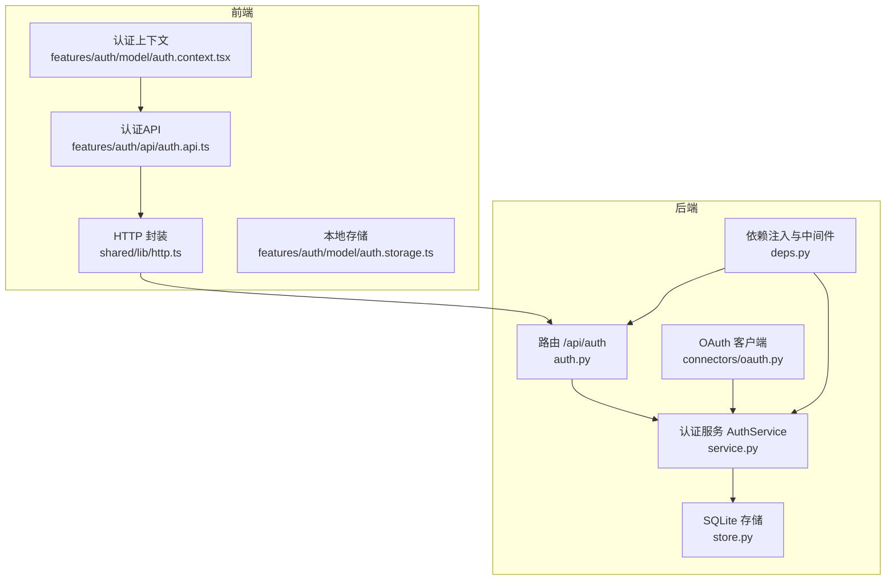
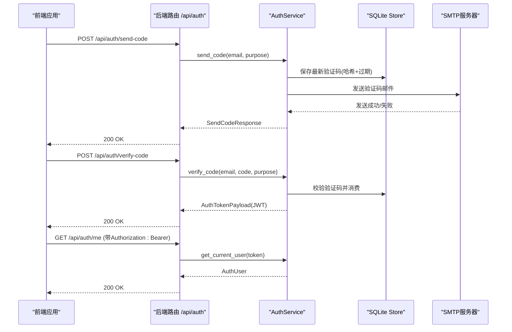
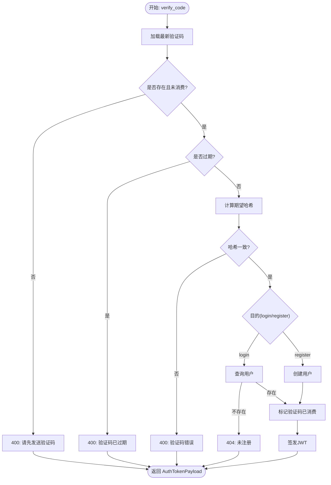
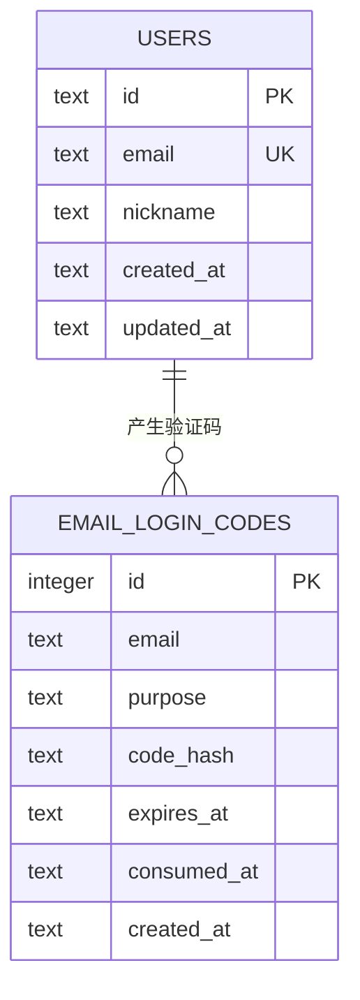
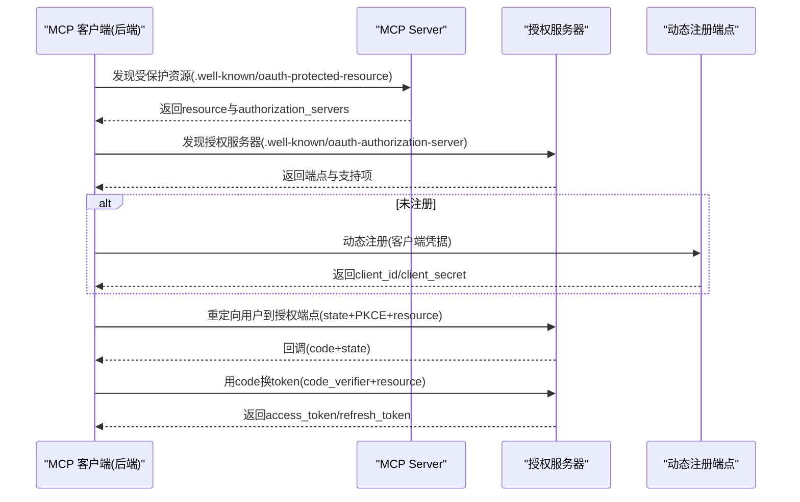
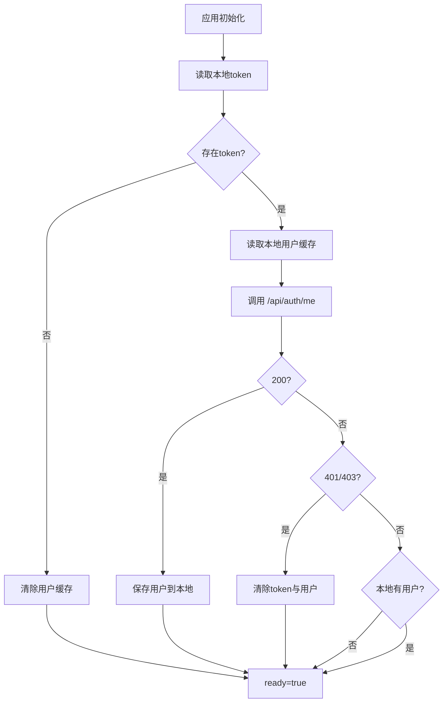
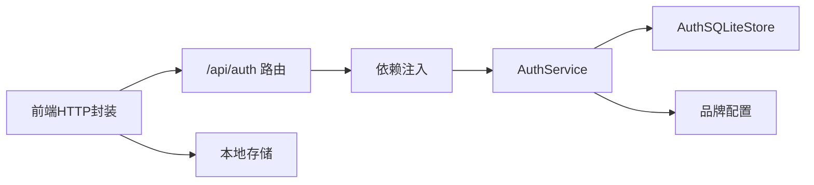

# 认证API

<cite>
**本文引用的文件**
- [backend/app/api/auth.py](file://backend/app/api/auth.py)
- [backend/app/auth/service.py](file://backend/app/auth/service.py)
- [backend/app/schemas/auth.py](file://backend/app/schemas/auth.py)
- [backend/app/api/deps.py](file://backend/app/api/deps.py)
- [backend/app/auth/store.py](file://backend/app/auth/store.py)
- [backend/migrations/001_auth_tables.sql](file://backend/migrations/001_auth_tables.sql)
- [backend/connectors/oauth.py](file://backend/connectors/oauth.py)
- [frontend/src/features/auth/api/auth.api.ts](file://frontend/src/features/auth/api/auth.api.ts)
- [frontend/src/features/auth/model/auth.types.ts](file://frontend/src/features/auth/model/auth.types.ts)
- [frontend/src/features/auth/model/auth.context.tsx](file://frontend/src/features/auth/model/auth.context.tsx)
- [frontend/src/shared/lib/http.ts](file://frontend/src/shared/lib/http.ts)
- [frontend/src/features/auth/model/auth.storage.ts](file://frontend/src/features/auth/model/auth.storage.ts)
- [backend/tests/test_auth_api.py](file://backend/tests/test_auth_api.py)
- [docs/oauth流程调研.md](file://docs/oauth流程调研.md)
</cite>

## 目录
1. [简介](#简介)
2. [项目结构](#项目结构)
3. [核心组件](#核心组件)
4. [架构总览](#架构总览)
5. [详细组件分析](#详细组件分析)
6. [依赖关系分析](#依赖关系分析)
7. [性能考量](#性能考量)
8. [故障排查指南](#故障排查指南)
9. [结论](#结论)
10. [附录](#附录)

## 简介
本文件系统性地文档化了本项目的认证API，涵盖邮箱验证码登录/注册、JWT令牌管理、用户信息获取、OAuth 2.1授权流程以及前端集成方案。文档面向开发者与产品/运维人员，提供接口定义、数据模型、流程图、错误处理与安全最佳实践，帮助快速理解与集成认证能力。

## 项目结构
认证相关代码主要分布在后端FastAPI路由层、认证服务层、数据存储层与前端HTTP封装与上下文层：
- 后端
  - 路由：/api/auth 下的验证码发送、验证码校验、当前用户信息获取
  - 服务：AuthService负责JWT签发、验证码生成与校验、SMTP邮件发送、用户查询与创建
  - 存储：SQLite持久化用户与验证码记录
  - 依赖注入：提供AuthService单例与Bearer Token解析中间件
  - OAuth：MCP OAuth 2.1客户端实现（发现、动态注册、授权码与刷新）
- 前端
  - HTTP封装：统一添加Authorization头、错误处理
  - 认证API：封装发送验证码、校验验证码、获取当前用户
  - 认证上下文：登录/登出、令牌与用户缓存、鉴权门控
  - 本地存储：令牌与用户信息的本地持久化

图表来源
- [backend/app/api/auth.py:1-36](file://backend/app/api/auth.py#L1-L36)
- [backend/app/auth/service.py:1-312](file://backend/app/auth/service.py#L1-L312)
- [backend/app/auth/store.py:1-152](file://backend/app/auth/store.py#L1-L152)
- [backend/app/api/deps.py:1-60](file://backend/app/api/deps.py#L1-L60)
- [backend/connectors/oauth.py:1-419](file://backend/connectors/oauth.py#L1-L419)
- [frontend/src/features/auth/api/auth.api.ts:1-21](file://frontend/src/features/auth/api/auth.api.ts#L1-L21)
- [frontend/src/shared/lib/http.ts:1-75](file://frontend/src/shared/lib/http.ts#L1-L75)
- [frontend/src/features/auth/model/auth.context.tsx:1-155](file://frontend/src/features/auth/model/auth.context.tsx#L1-L155)
- [frontend/src/features/auth/model/auth.storage.ts:1-87](file://frontend/src/features/auth/model/auth.storage.ts#L1-L87)

章节来源
- [backend/app/api/auth.py:1-36](file://backend/app/api/auth.py#L1-L36)
- [backend/app/auth/service.py:1-312](file://backend/app/auth/service.py#L1-L312)
- [backend/app/auth/store.py:1-152](file://backend/app/auth/store.py#L1-L152)
- [backend/app/api/deps.py:1-60](file://backend/app/api/deps.py#L1-L60)
- [backend/connectors/oauth.py:1-419](file://backend/connectors/oauth.py#L1-L419)
- [frontend/src/features/auth/api/auth.api.ts:1-21](file://frontend/src/features/auth/api/auth.api.ts#L1-L21)
- [frontend/src/shared/lib/http.ts:1-75](file://frontend/src/shared/lib/http.ts#L1-L75)
- [frontend/src/features/auth/model/auth.context.tsx:1-155](file://frontend/src/features/auth/model/auth.context.tsx#L1-L155)
- [frontend/src/features/auth/model/auth.storage.ts:1-87](file://frontend/src/features/auth/model/auth.storage.ts#L1-L87)

## 核心组件
- 认证路由层
  - /api/auth/send-code：发送邮箱验证码
  - /api/auth/verify-code：校验验证码并换取JWT访问令牌
  - /api/auth/me：获取当前登录用户信息
- 认证服务层
  - JWT签发与校验、SMTP邮件发送、验证码哈希与过期控制、用户创建与查询
- 数据存储层
  - users表、email_login_codes表及索引
- 依赖注入与中间件
  - get_auth_service单例、get_current_user Bearer Token解析
- OAuth客户端
  - MCP OAuth 2.1：发现、动态注册、授权码交换、刷新令牌、PKCE与资源指示

章节来源
- [backend/app/api/auth.py:14-35](file://backend/app/api/auth.py#L14-L35)
- [backend/app/auth/service.py:49-312](file://backend/app/auth/service.py#L49-L312)
- [backend/app/auth/store.py:20-152](file://backend/app/auth/store.py#L20-L152)
- [backend/app/api/deps.py:35-60](file://backend/app/api/deps.py#L35-L60)
- [backend/connectors/oauth.py:123-419](file://backend/connectors/oauth.py#L123-L419)

## 架构总览
认证API采用“路由-服务-存储”的分层设计，并通过依赖注入提供单例服务与中间件。前端通过HTTP封装统一携带Authorization头，认证上下文负责令牌与用户信息的本地持久化与鉴权门控。

图表来源
- [backend/app/api/auth.py:14-35](file://backend/app/api/auth.py#L14-L35)
- [backend/app/auth/service.py:251-312](file://backend/app/auth/service.py#L251-L312)
- [backend/app/auth/store.py:99-152](file://backend/app/auth/store.py#L99-L152)
- [frontend/src/shared/lib/http.ts:20-65](file://frontend/src/shared/lib/http.ts#L20-L65)

## 详细组件分析

### 认证路由与接口定义
- /api/auth/send-code
  - 方法：POST
  - 请求体：SendCodeRequest
    - email: 邮箱地址
    - purpose: "login" 或 "register"
  - 响应体：SendCodeResponse
    - sent: 布尔，表示是否发送成功
    - expires_in: 整数，验证码有效期（秒）
  - 状态码：200 成功；400 需先发送验证码/验证码已过期；404 登录场景未注册；409 注册场景已注册；422 邮箱格式不正确
- /api/auth/verify-code
  - 方法：POST
  - 请求体：VerifyCodeRequest
    - email: 邮箱地址
    - code: 6位数字验证码
    - purpose: "login" 或 "register"
  - 响应体：AuthTokenPayload
    - access_token: JWT访问令牌
    - token_type: "bearer"
    - user: AuthUser
  - 状态码：200 成功；400 验证码错误/已失效/未发送；404 未注册；409 已注册
- /api/auth/me
  - 方法：GET
  - 请求头：Authorization: Bearer <access_token>
  - 响应体：AuthUser
  - 状态码：200 成功；401 未登录/令牌无效；403 无权限

章节来源
- [backend/app/api/auth.py:14-35](file://backend/app/api/auth.py#L14-L35)
- [backend/app/schemas/auth.py:23-51](file://backend/app/schemas/auth.py#L23-L51)
- [backend/app/api/deps.py:52-60](file://backend/app/api/deps.py#L52-L60)

### 认证服务与JWT令牌管理
- JWT配置
  - HS256算法，密钥来自环境变量JWT_SECRET
  - 默认过期天数可通过JWT_EXPIRE_DAYS配置，默认7天
- 令牌签发
  - 载荷包含sub(用户ID)、email、iat、exp
  - 通过jwt.encode生成access_token
- 令牌校验
  - get_current_user接收Authorization: Bearer token
  - 使用jwt.decode校验令牌有效性与签名
  - 从数据库查询用户并返回
- 验证码流程
  - 生成6位随机验证码
  - 保存哈希值与过期时间，发送邮件
  - 校验时使用HMAC比较摘要，防止时序攻击
  - 登录/注册场景分别进行存在性校验
- SMTP配置
  - 支持SSL直连(465/994)与STARTTLS
  - 提供详细的SMTP错误映射与诊断提示

图表来源
- [backend/app/auth/service.py:271-296](file://backend/app/auth/service.py#L271-L296)

章节来源
- [backend/app/auth/service.py:59-82](file://backend/app/auth/service.py#L59-L82)
- [backend/app/auth/service.py:132-143](file://backend/app/auth/service.py#L132-L143)
- [backend/app/auth/service.py:298-312](file://backend/app/auth/service.py#L298-L312)
- [backend/app/auth/service.py:251-296](file://backend/app/auth/service.py#L251-L296)

### 数据模型与存储
- 数据模型
  - AuthUser：用户标识与基本信息
  - SendCodeRequest/SendCodeResponse：验证码发送请求与响应
  - VerifyCodeRequest：验证码校验请求
  - AuthTokenPayload：认证结果载体
- 存储结构
  - users：主键id、唯一email、昵称、创建/更新时间
  - email_login_codes：邮箱、用途、哈希、过期时间、消费时间、创建时间
  - 索引：email+purpose+created_at，便于查询最新验证码

图表来源
- [backend/migrations/001_auth_tables.sql:1-21](file://backend/migrations/001_auth_tables.sql#L1-L21)
- [backend/app/auth/store.py:45-97](file://backend/app/auth/store.py#L45-L97)
- [backend/app/auth/store.py:99-152](file://backend/app/auth/store.py#L99-L152)

章节来源
- [backend/app/schemas/auth.py:13-51](file://backend/app/schemas/auth.py#L13-L51)
- [backend/migrations/001_auth_tables.sql:1-21](file://backend/migrations/001_auth_tables.sql#L1-L21)
- [backend/app/auth/store.py:45-152](file://backend/app/auth/store.py#L45-L152)

### OAuth 2.1 授权流程（MCP）
- 流程概述
  - 发现MCP Server的授权服务器与端点
  - 动态注册客户端（若未注册）
  - 生成PKCE与state，重定向用户到授权端点
  - 回调后用授权码交换令牌，支持刷新
- 关键实现
  - 发现：Protected Resource Metadata与Authorization Server Metadata
  - 注册：Dynamic Client Registration
  - 授权：Authorization Code + PKCE + Resource Indicator
  - 令牌：Access/Refresh Token与过期时间计算
- 安全要点
  - PKCE使用S256，state用于CSRF防护
  - 令牌过期前60秒安全边界，避免临界过期
  - Basic Auth用于token端点鉴权

图表来源
- [backend/connectors/oauth.py:123-419](file://backend/connectors/oauth.py#L123-L419)
- [docs/oauth流程调研.md:1-360](file://docs/oauth流程调研.md#L1-L360)

章节来源
- [backend/connectors/oauth.py:123-419](file://backend/connectors/oauth.py#L123-L419)
- [docs/oauth流程调研.md:1-360](file://docs/oauth流程调研.md#L1-L360)

### 前端集成与会话状态维护
- HTTP封装
  - 自动在请求头添加Authorization: Bearer <token>
  - 统一错误处理，抛出HttpError
- 认证API
  - sendAuthCode、verifyAuthCode、getCurrentUser
- 认证上下文
  - 登录：保存token与用户，识别用户，触发事件
  - 登出：清除本地存储，重置Analytics
  - 刷新：读取本地token，调用/me，处理401/403
  - 鉴权门控：未登录时打开认证模态
- 本地存储
  - localStorage存储access_token与用户信息
  - sessionStorage存储待处理消息

图表来源
- [frontend/src/features/auth/model/auth.context.tsx:81-110](file://frontend/src/features/auth/model/auth.context.tsx#L81-L110)
- [frontend/src/shared/lib/http.ts:20-65](file://frontend/src/shared/lib/http.ts#L20-L65)
- [frontend/src/features/auth/model/auth.storage.ts:7-60](file://frontend/src/features/auth/model/auth.storage.ts#L7-L60)

章节来源
- [frontend/src/shared/lib/http.ts:1-75](file://frontend/src/shared/lib/http.ts#L1-L75)
- [frontend/src/features/auth/api/auth.api.ts:1-21](file://frontend/src/features/auth/api/auth.api.ts#L1-L21)
- [frontend/src/features/auth/model/auth.context.tsx:1-155](file://frontend/src/features/auth/model/auth.context.tsx#L1-L155)
- [frontend/src/features/auth/model/auth.storage.ts:1-87](file://frontend/src/features/auth/model/auth.storage.ts#L1-L87)

## 依赖关系分析
- 组件耦合
  - 路由依赖AuthService与依赖注入函数
  - AuthService依赖SQLite存储与品牌配置
  - 前端HTTP封装依赖认证存储与环境配置
- 外部依赖
  - FastAPI、Pydantic、SQLite、JWT、SMTP
  - OAuth 2.1相关RFC实现（RFC 8414、7591、7636、8707、9728）

图表来源
- [backend/app/api/auth.py:7-11](file://backend/app/api/auth.py#L7-L11)
- [backend/app/api/deps.py:35-60](file://backend/app/api/deps.py#L35-L60)
- [backend/app/auth/service.py:52-58](file://backend/app/auth/service.py#L52-L58)
- [frontend/src/shared/lib/http.ts:1-75](file://frontend/src/shared/lib/http.ts#L1-L75)
- [frontend/src/features/auth/model/auth.storage.ts:1-87](file://frontend/src/features/auth/model/auth.storage.ts#L1-L87)

章节来源
- [backend/app/api/auth.py:1-36](file://backend/app/api/auth.py#L1-L36)
- [backend/app/api/deps.py:1-60](file://backend/app/api/deps.py#L1-L60)
- [backend/app/auth/service.py:1-312](file://backend/app/auth/service.py#L1-L312)
- [frontend/src/shared/lib/http.ts:1-75](file://frontend/src/shared/lib/http.ts#L1-L75)
- [frontend/src/features/auth/model/auth.storage.ts:1-87](file://frontend/src/features/auth/model/auth.storage.ts#L1-L87)

## 性能考量
- JWT过期策略
  - 默认7天，可通过环境变量调整，平衡安全性与用户体验
- 验证码过期
  - 默认10分钟，过期后需重新获取，减少暴力破解机会
- 数据库事务
  - 使用上下文管理器确保提交/回滚一致性
- 网络超时
  - OAuth发现与令牌端点设置合理超时，避免阻塞
- 前端缓存
  - 本地存储token与用户信息，减少重复请求

## 故障排查指南
- SMTP发送失败
  - 常见原因：域名解析失败、认证失败、连接断开、超时
  - 建议：检查SMTP_HOST/PORT/USERNAME/PASSWORD/FROM、TLS模式与网络策略
- 401/403未登录/令牌无效
  - 前端：检查本地token是否存在与是否过期，必要时触发登出清理
  - 后端：确认JWT_SECRET配置正确，令牌未被篡改
- 验证码问题
  - 400：验证码错误/已失效/未发送/过期
  - 404/409：登录/注册场景与实际账户状态不符
- CORS限制
  - 仅允许特定源(如开发环境localhost)，生产环境需正确配置CORS白名单

章节来源
- [backend/app/auth/service.py:102-121](file://backend/app/auth/service.py#L102-L121)
- [backend/tests/test_auth_api.py:22-57](file://backend/tests/test_auth_api.py#L22-L57)
- [backend/tests/test_auth_api.py:59-119](file://backend/tests/test_auth_api.py#L59-L119)
- [frontend/src/features/auth/model/auth.context.tsx:81-110](file://frontend/src/features/auth/model/auth.context.tsx#L81-L110)

## 结论
本认证体系以邮箱验证码登录为核心，结合JWT令牌管理与SQLite存储，提供简洁可靠的用户身份验证与授权能力。同时，后端实现了完整的MCP OAuth 2.1客户端流程，支持发现、动态注册、授权码与刷新令牌，满足现代多服务授权需求。前端通过统一HTTP封装与认证上下文，实现会话状态的本地持久化与鉴权门控，整体架构清晰、安全可控、易于扩展。

## 附录

### 接口清单与示例

- 发送验证码
  - 请求：POST /api/auth/send-code
  - 请求体：{
      "email": "string",
      "purpose": "login|register"
    }
  - 响应：{
      "sent": true,
      "expires_in": 600
    }
- 校验验证码并登录
  - 请求：POST /api/auth/verify-code
  - 请求体：{
      "email": "string",
      "code": "123456",
      "purpose": "login|register"
    }
  - 响应：{
      "access_token": "string",
      "token_type": "bearer",
      "user": {
        "id": "string",
        "email": "string",
        "nickname": "string",
        "created_at": "string",
        "updated_at": "string"
      }
    }
- 获取当前用户
  - 请求：GET /api/auth/me
  - 请求头：Authorization: Bearer <access_token>
  - 响应：AuthUser对象

章节来源
- [backend/app/api/auth.py:14-35](file://backend/app/api/auth.py#L14-L35)
- [backend/app/schemas/auth.py:23-51](file://backend/app/schemas/auth.py#L23-L51)
- [frontend/src/features/auth/api/auth.api.ts:10-20](file://frontend/src/features/auth/api/auth.api.ts#L10-L20)

### 安全最佳实践
- 强制HTTPS传输，避免令牌在明文网络中泄露
- 严格控制CORS白名单，避免跨域劫持
- JWT密钥妥善保管，定期轮换
- 验证码使用HMAC摘要，防止时序攻击
- OAuth使用PKCE(S256)与CSRF state，防止授权码拦截
- 令牌过期前60秒安全边界，避免临界过期导致的短暂失效
- 前端仅在localStorage存储必要信息，避免敏感数据泄漏

### 调试技巧
- 后端：启用DEBUG日志，关注SMTP错误映射与OAuth发现/注册/交换过程
- 前端：利用HttpError.status与message定位问题，结合浏览器Network面板查看请求头与响应
- 验证码：通过测试用例模拟不同场景，覆盖边界条件