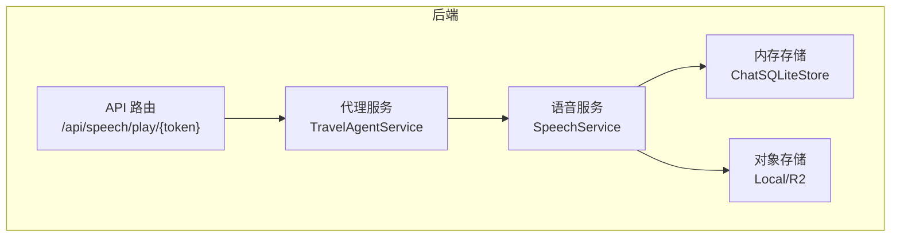
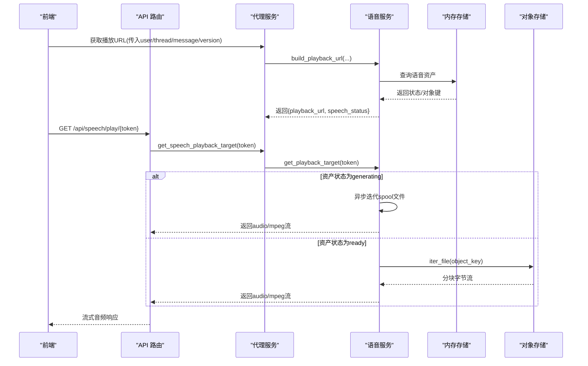
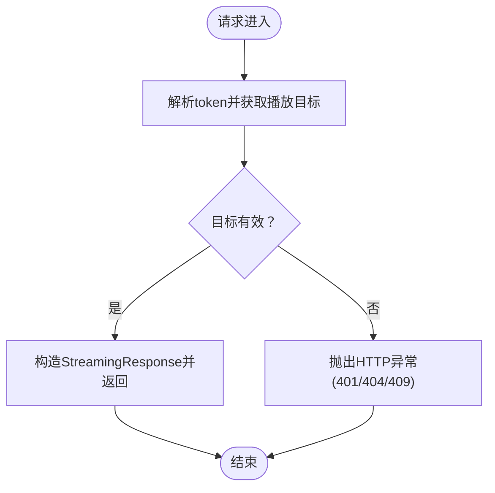
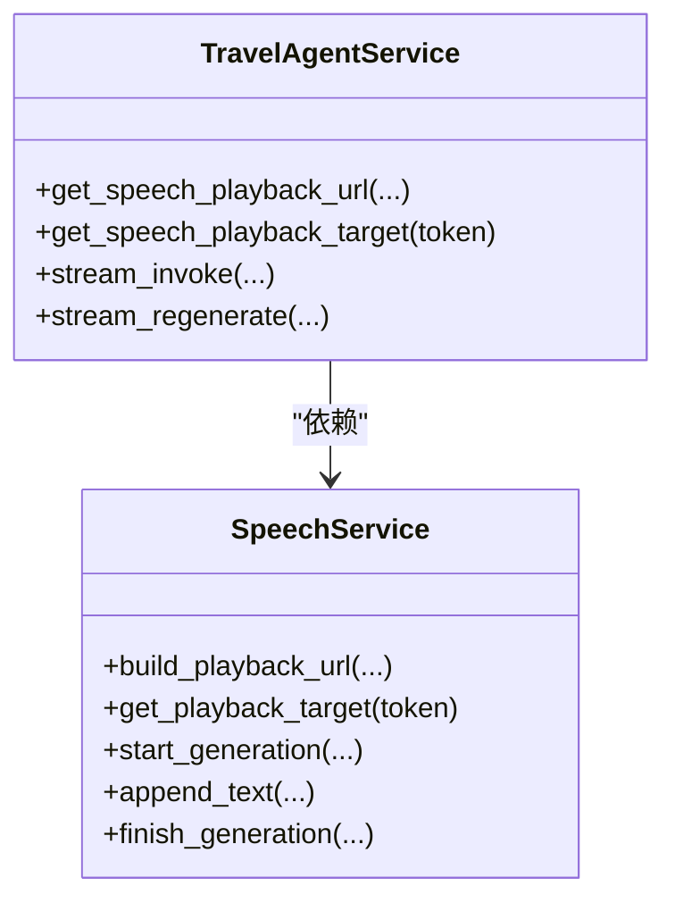
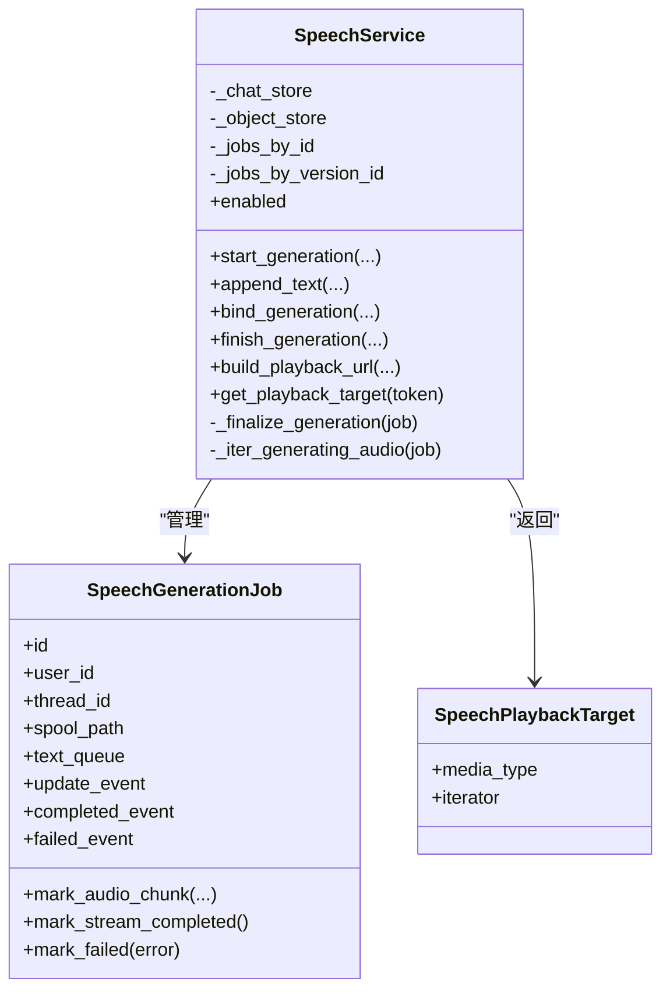
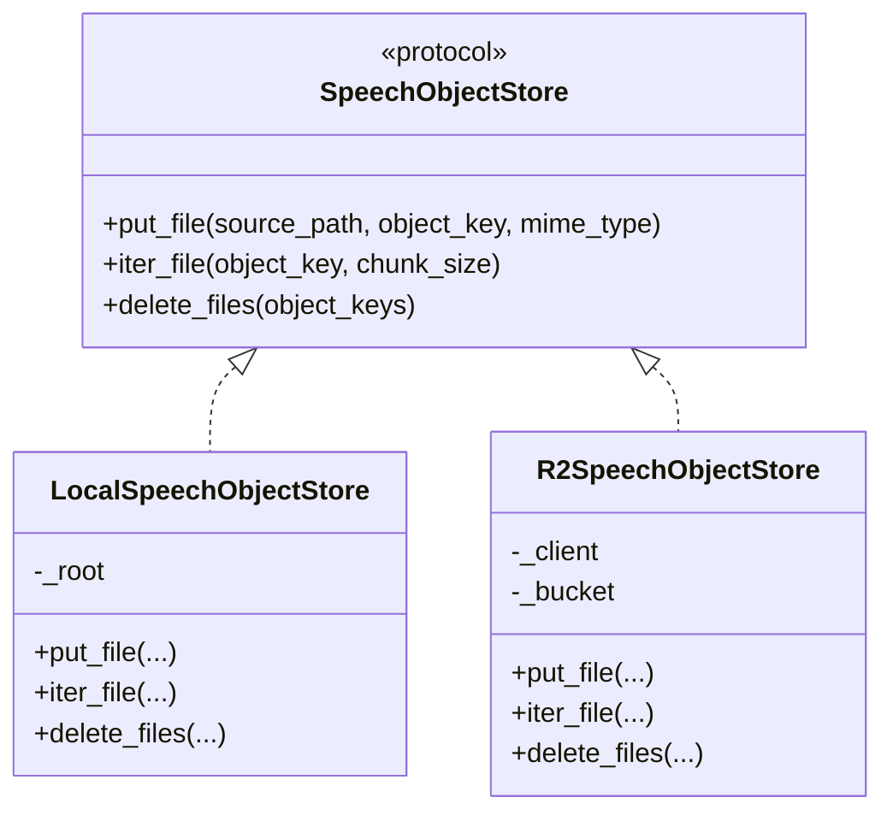
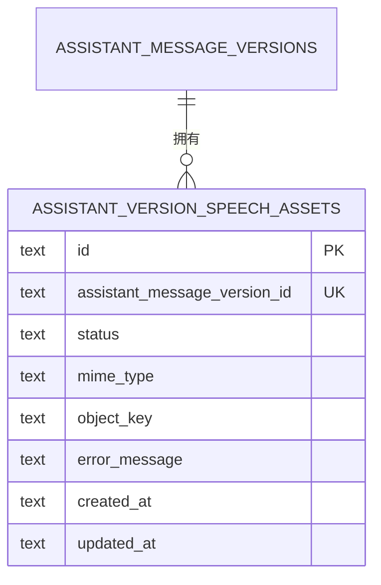
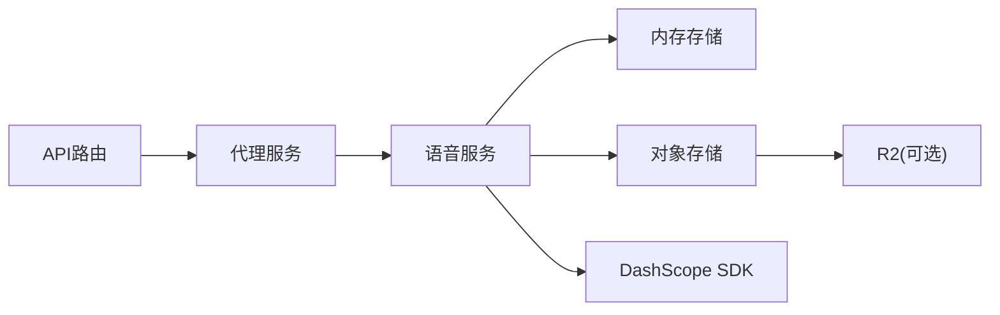

# 语音服务API

<cite>
**本文引用的文件**   
- [backend/app/api/speech.py](file://backend/app/api/speech.py)
- [backend/app/agent/service.py](file://backend/app/agent/service.py)
- [backend/app/speech/service.py](file://backend/app/speech/service.py)
- [backend/app/speech/object_store.py](file://backend/app/speech/object_store.py)
- [backend/app/memory/sqlite_store.py](file://backend/app/memory/sqlite_store.py)
- [backend/migrations/004_chat_speech_assets.sql](file://backend/migrations/004_chat_speech_assets.sql)
- [backend/tests/test_speech_service.py](file://backend/tests/test_speech_service.py)
- [backend/tests/test_api.py](file://backend/tests/test_api.py)
</cite>

## 目录
1. [简介](#简介)
2. [项目结构](#项目结构)
3. [核心组件](#核心组件)
4. [架构总览](#架构总览)
5. [详细组件分析](#详细组件分析)
6. [依赖分析](#依赖分析)
7. [性能考量](#性能考量)
8. [故障排查指南](#故障排查指南)
9. [结论](#结论)
10. [附录](#附录)

## 简介
本文件面向语音服务API，系统性说明语音合成与音频管理能力，包括：
- 语音生成：基于阿里云DashScope TTS的流式合成，支持实时追加文本、完成标记与失败回退。
- 音频播放：通过短期JWT令牌签发播放URL，支持“生成中”与“已就绪”两种状态的音频流直连。
- 语音缓存：本地磁盘或Cloudflare R2对象存储，生成完成后持久化MP3文件，支持按会话清理。
- 配置项：语言、音色、模型、WebSocket接入点、JWT密钥等通过环境变量配置。
- 性能与带宽：生成过程采用分块读写与异步迭代，播放端以流式响应避免大体积内存占用。
- 错误处理与调试：统一的状态检查、HTTP异常映射、日志记录与测试用例覆盖。

## 项目结构
语音服务位于后端Python模块中，核心文件如下：
- API路由：提供播放接口，负责令牌校验与流式响应。
- 代理服务：对外暴露语音播放URL与令牌解析，串联生成与存储。
- 语音服务：协调生成、持久化、播放与清理，维护作业生命周期。
- 对象存储：抽象本地与R2两种后端，统一put/iter/delete接口。
- 内存存储：SQLite存储会话、消息与语音资产元数据，迁移脚本定义语音资产表。
- 测试：验证服务启用条件、API行为与播放响应。

**图表来源**
- [backend/app/api/speech.py:15-34](file://backend/app/api/speech.py#L15-L34)
- [backend/app/agent/service.py:190-210](file://backend/app/agent/service.py#L190-L210)
- [backend/app/speech/service.py:90-127](file://backend/app/speech/service.py#L90-L127)
- [backend/app/speech/object_store.py:122-138](file://backend/app/speech/object_store.py#L122-L138)
- [backend/app/memory/sqlite_store.py:509-541](file://backend/app/memory/sqlite_store.py#L509-L541)

**章节来源**
- [backend/app/api/speech.py:1-35](file://backend/app/api/speech.py#L1-L35)
- [backend/app/agent/service.py:97-210](file://backend/app/agent/service.py#L97-L210)
- [backend/app/speech/service.py:90-127](file://backend/app/speech/service.py#L90-L127)
- [backend/app/speech/object_store.py:122-138](file://backend/app/speech/object_store.py#L122-L138)
- [backend/app/memory/sqlite_store.py:509-541](file://backend/app/memory/sqlite_store.py#L509-L541)

## 核心组件
- API路由
  - 提供GET /api/speech/play/{token}，接收短期JWT令牌，返回audio/mpeg流。
  - 统一异常映射：无效令牌401、资源不存在404、冲突状态409。
- 代理服务
  - 对外提供build_playback_url与get_speech_playback_target，封装语音播放URL生成与令牌解析。
  - 在聊天流式过程中，将文本片段注入语音生成作业。
- 语音服务
  - 生成：创建作业、后台线程驱动DashScope TTS回调，写入spool临时文件。
  - 持久化：生成完成后上传至对象存储，更新资产状态为ready。
  - 播放：若资产处于generating，返回spool文件的异步迭代器；若ready则从对象存储迭代。
  - 清理：作业完成后按需清理spool文件。
- 对象存储
  - 本地：复制文件到目标路径，按需分块读取。
  - R2：基于boto3上传/下载，支持Content-Type设置。
- 内存存储
  - 定义assistant_version_speech_assets表，记录每个消息版本的语音资产状态、MIME类型、对象键与错误信息。
  - 提供按thread_id查询语音对象键、按版本查询资产等接口。

**章节来源**
- [backend/app/api/speech.py:15-34](file://backend/app/api/speech.py#L15-L34)
- [backend/app/agent/service.py:190-210](file://backend/app/agent/service.py#L190-L210)
- [backend/app/speech/service.py:145-296](file://backend/app/speech/service.py#L145-L296)
- [backend/app/speech/object_store.py:23-138](file://backend/app/speech/object_store.py#L23-L138)
- [backend/app/memory/sqlite_store.py:509-541](file://backend/app/memory/sqlite_store.py#L509-L541)
- [backend/migrations/004_chat_speech_assets.sql:1-15](file://backend/migrations/004_chat_speech_assets.sql#L1-L15)

## 架构总览
语音服务整体流程：前端触发聊天生成，代理服务在流式回调中向语音服务追加文本；生成完成后持久化并更新状态；前端通过build_playback_url获得播放URL，再调用播放接口获取音频流。

**图表来源**
- [backend/app/agent/service.py:190-210](file://backend/app/agent/service.py#L190-L210)
- [backend/app/speech/service.py:238-296](file://backend/app/speech/service.py#L238-L296)
- [backend/app/speech/object_store.py:35-109](file://backend/app/speech/object_store.py#L35-L109)
- [backend/app/api/speech.py:15-34](file://backend/app/api/speech.py#L15-L34)

## 详细组件分析

### API路由组件
- 接口：GET /api/speech/play/{token}
- 处理逻辑：
  - 调用代理服务解析令牌并获取播放目标。
  - 将目标的媒体类型与异步迭代器包装为StreamingResponse返回。
  - 对令牌无效、资源不存在、状态冲突分别抛出401/404/409。
- 关键点：
  - 使用Cache-Control:no-cache避免代理层缓存。
  - 迭代器由语音服务提供，确保边生成边播放。

**图表来源**
- [backend/app/api/speech.py:15-34](file://backend/app/api/speech.py#L15-L34)

**章节来源**
- [backend/app/api/speech.py:15-34](file://backend/app/api/speech.py#L15-L34)

### 代理服务组件
- 能力：
  - build_playback_url：根据user_id/thread_id/assistant_message_id/version_id与基础URL生成播放URL，并返回当前语音状态。
  - get_speech_playback_target：解析token并委托语音服务返回播放目标。
- 集成点：
  - 在聊天流式回调中，将文本片段注入语音生成作业，完成时调用finish_generation。
  - 会话删除时，先收集语音对象键，再删除数据库记录与对象存储文件。

**图表来源**
- [backend/app/agent/service.py:190-210](file://backend/app/agent/service.py#L190-L210)
- [backend/app/speech/service.py:238-296](file://backend/app/speech/service.py#L238-L296)

**章节来源**
- [backend/app/agent/service.py:190-210](file://backend/app/agent/service.py#L190-L210)

### 语音服务组件
- 数据结构：
  - SpeechGenerationJob：描述单次生成任务，含队列、事件、计数、锁与spool路径。
  - SpeechPlaybackTarget：封装媒体类型与异步迭代器。
- 关键流程：
  - 启动生成：创建作业并启动后台线程，DashScope回调写入spool。
  - 绑定版本：将作业与消息版本关联，写入初始状态。
  - 完成/失败：触发完成事件或失败事件，必要时上传对象存储并更新状态。
  - 播放目标：根据资产状态返回spool迭代器或对象存储迭代器。
  - 清理：作业完成后删除spool文件，或在无读者时延迟清理。
- 配置项（环境变量）：
  - ALIYUN_TTS_API_KEY：TTS API密钥
  - ALIYUN_TTS_WS_URL：WebSocket推理地址
  - ALIYUN_TTS_MODEL：模型名称
  - ALIYUN_TTS_VOICE：音色名称
  - JWT_SECRET：播放令牌签名密钥

**图表来源**
- [backend/app/speech/service.py:33-87](file://backend/app/speech/service.py#L33-L87)
- [backend/app/speech/service.py:90-127](file://backend/app/speech/service.py#L90-L127)
- [backend/app/speech/service.py:238-296](file://backend/app/speech/service.py#L238-L296)

**章节来源**
- [backend/app/speech/service.py:90-127](file://backend/app/speech/service.py#L90-L127)
- [backend/app/speech/service.py:145-296](file://backend/app/speech/service.py#L145-L296)

### 对象存储组件
- 抽象协议：put_file、iter_file、delete_files。
- 本地实现：创建目录、复制文件、分块读取。
- R2实现：基于boto3上传/下载，设置Content-Type，批量删除。
- 自动选择：当R2账号信息齐全时优先使用R2，否则回退本地。

**图表来源**
- [backend/app/speech/object_store.py:12-21](file://backend/app/speech/object_store.py#L12-L21)
- [backend/app/speech/object_store.py:23-62](file://backend/app/speech/object_store.py#L23-L62)
- [backend/app/speech/object_store.py:64-119](file://backend/app/speech/object_store.py#L64-L119)
- [backend/app/speech/object_store.py:122-138](file://backend/app/speech/object_store.py#L122-L138)

**章节来源**
- [backend/app/speech/object_store.py:12-138](file://backend/app/speech/object_store.py#L12-L138)

### 内存存储与迁移
- 表结构：assistant_version_speech_assets，记录每个消息版本的语音资产状态、MIME类型、对象键与错误信息。
- 查询接口：按thread_id查询对象键、按版本查询资产等。
- 迁移：004_chat_speech_assets.sql定义表与索引。

**图表来源**
- [backend/migrations/004_chat_speech_assets.sql:1-15](file://backend/migrations/004_chat_speech_assets.sql#L1-L15)
- [backend/app/memory/sqlite_store.py:509-541](file://backend/app/memory/sqlite_store.py#L509-L541)

**章节来源**
- [backend/migrations/004_chat_speech_assets.sql:1-15](file://backend/migrations/004_chat_speech_assets.sql#L1-L15)
- [backend/app/memory/sqlite_store.py:509-541](file://backend/app/memory/sqlite_store.py#L509-L541)

## 依赖分析
- 组件耦合：
  - API路由仅依赖代理服务；代理服务依赖语音服务；语音服务依赖内存存储与对象存储。
  - 低耦合高内聚：各模块职责清晰，接口稳定。
- 外部依赖：
  - DashScope TTS SDK（WebSocket推理与回调）
  - Cloudflare R2（可选）
  - JWT（令牌签发与校验）

**图表来源**
- [backend/app/api/speech.py:15-34](file://backend/app/api/speech.py#L15-L34)
- [backend/app/agent/service.py:190-210](file://backend/app/agent/service.py#L190-L210)
- [backend/app/speech/service.py:298-371](file://backend/app/speech/service.py#L298-L371)
- [backend/app/speech/object_store.py:64-84](file://backend/app/speech/object_store.py#L64-L84)

**章节来源**
- [backend/app/api/speech.py:15-34](file://backend/app/api/speech.py#L15-L34)
- [backend/app/agent/service.py:190-210](file://backend/app/agent/service.py#L190-L210)
- [backend/app/speech/service.py:298-371](file://backend/app/speech/service.py#L298-L371)
- [backend/app/speech/object_store.py:64-84](file://backend/app/speech/object_store.py#L64-L84)

## 性能考量
- 生成阶段
  - 使用队列与事件通知，避免阻塞主线程；回调写入spool文件并刷新，保证边写边播。
  - 生成完成后异步上传对象存储，避免阻塞播放。
- 播放阶段
  - StreamingResponse按块返回，降低内存峰值；播放端可边下载边播放。
  - “生成中”状态通过异步迭代spool文件实现，避免等待完整文件。
- 缓存与清理
  - 本地或R2持久化MP3，减少重复生成成本。
  - 无读者时清理spool文件，释放磁盘空间。
- 带宽与并发
  - 对象存储支持分块读取，适合大文件播放。
  - 令牌有效期较短（默认10分钟），降低长期缓存带来的一致性风险。

[本节为通用性能建议，不直接分析具体文件]

## 故障排查指南
- 常见错误与处理
  - 无效播放令牌：401 Unauthorized。检查JWT_SECRET是否正确配置，以及token是否被篡改或过期。
  - 资源不存在：404 Not Found。确认消息版本是否存在，对象键是否正确。
  - 状态冲突：409 Conflict。资产状态非generating或ready时拒绝播放。
- 服务启用条件
  - 若未配置ALIYUN_TTS_API_KEY，则语音服务disabled，不会生成语音。
- 日志与追踪
  - 代理服务在异常时记录详细上下文，便于定位问题。
- 测试参考
  - API测试覆盖播放URL生成、播放响应与无效令牌场景。
  - 语音服务测试验证服务启用条件。

**章节来源**
- [backend/app/api/speech.py:21-28](file://backend/app/api/speech.py#L21-L28)
- [backend/app/speech/service.py:107-109](file://backend/app/speech/service.py#L107-L109)
- [backend/tests/test_api.py:410-437](file://backend/tests/test_api.py#L410-L437)
- [backend/tests/test_speech_service.py:7-18](file://backend/tests/test_speech_service.py#L7-L18)

## 结论
该语音服务API以“生成-持久化-播放”为主线，结合短期令牌与对象存储，实现了高效、可扩展的语音播放能力。通过环境变量灵活配置TTS参数与存储后端，配合流式播放与异步迭代，兼顾性能与用户体验。建议在生产环境中：
- 明确配置JWT_SECRET与TTS密钥，确保服务可用。
- 优先使用R2作为对象存储后端，提升跨地域访问性能。
- 在前端实现播放事件监听与错误提示，增强交互体验。
- 结合日志与测试用例持续监控服务健康度。

[本节为总结性内容，不直接分析具体文件]

## 附录

### API使用方法与示例路径
- 生成播放URL
  - 调用代理服务的build_playback_url，传入user_id、thread_id、assistant_message_id、version_id与base_url，返回{playback_url, speech_status}。
  - 示例路径：[backend/app/agent/service.py:190-206](file://backend/app/agent/service.py#L190-L206)
- 播放音频
  - 请求GET /api/speech/play/{token}，返回audio/mpeg流。
  - 示例路径：[backend/app/api/speech.py:15-34](file://backend/app/api/speech.py#L15-L34)
- 生成中状态的播放
  - 当speech_status为generating时，播放接口返回spool文件的异步迭代器。
  - 示例路径：[backend/app/speech/service.py:422-453](file://backend/app/speech/service.py#L422-L453)
- 会话删除与清理
  - 先查询thread的语音对象键，再删除数据库记录与对象存储文件。
  - 示例路径：[backend/app/agent/service.py:169-176](file://backend/app/agent/service.py#L169-L176)

**章节来源**
- [backend/app/agent/service.py:169-206](file://backend/app/agent/service.py#L169-L206)
- [backend/app/api/speech.py:15-34](file://backend/app/api/speech.py#L15-L34)
- [backend/app/speech/service.py:422-453](file://backend/app/speech/service.py#L422-L453)

### 配置项与环境变量
- 语音合成
  - ALIYUN_TTS_API_KEY：TTS API密钥
  - ALIYUN_TTS_WS_URL：WebSocket推理地址
  - ALIYUN_TTS_MODEL：模型名称
  - ALIYUN_TTS_VOICE：音色名称
- 播放安全
  - JWT_SECRET：播放令牌签名密钥
- 对象存储（R2）
  - R2_ACCOUNT_ID、R2_ACCESS_KEY_ID、R2_SECRET_ACCESS_KEY、R2_BUCKET

**章节来源**
- [backend/app/speech/service.py:111-126](file://backend/app/speech/service.py#L111-L126)
- [backend/app/speech/object_store.py:125-128](file://backend/app/speech/object_store.py#L125-L128)