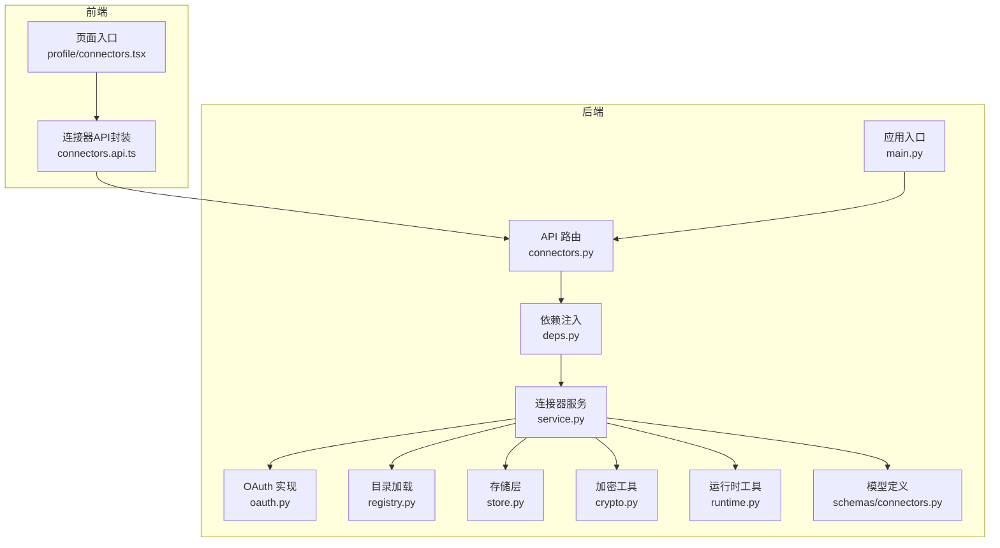
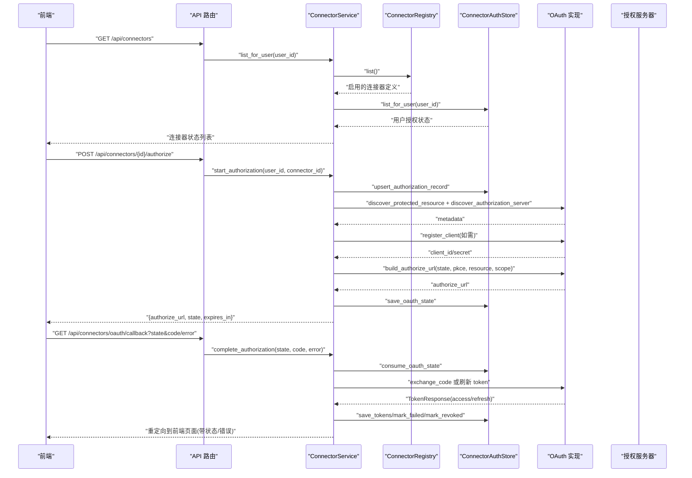
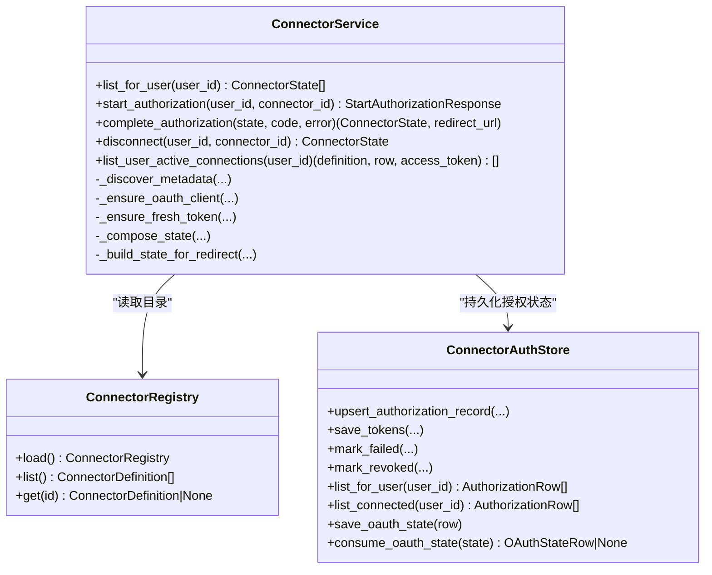
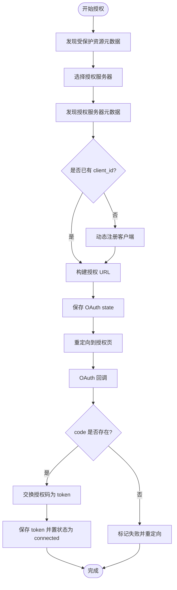
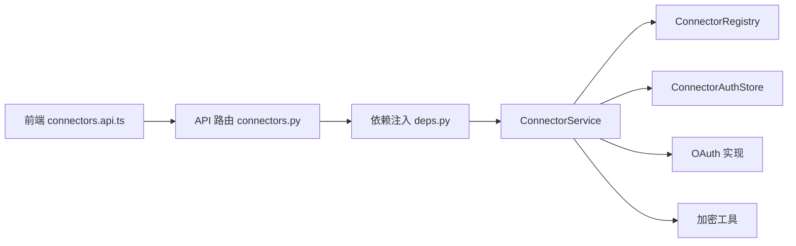

# 连接器API

<cite>
**本文引用的文件**
- [backend/app/api/connectors.py](file://backend/app/api/connectors.py)
- [backend/app/connectors/service.py](file://backend/app/connectors/service.py)
- [backend/app/connectors/oauth.py](file://backend/app/connectors/oauth.py)
- [backend/app/connectors/registry.py](file://backend/app/connectors/registry.py)
- [backend/app/connectors/store.py](file://backend/app/connectors/store.py)
- [backend/app/connectors/crypto.py](file://backend/app/connectors/crypto.py)
- [backend/app/connectors/runtime.py](file://backend/app/connectors/runtime.py)
- [backend/app/schemas/connectors.py](file://backend/app/schemas/connectors.py)
- [backend/app/main.py](file://backend/app/main.py)
- [backend/app/api/deps.py](file://backend/app/api/deps.py)
- [backend/config/connectors.example.json](file://backend/config/connectors.example.json)
- [backend/pyproject.toml](file://backend/pyproject.toml)
- [frontend/src/features/connectors/api/connectors.api.ts](file://frontend/src/features/connectors/api/connectors.api.ts)
- [frontend/src/pages/profile/connectors.tsx](file://frontend/src/pages/profile/connectors.tsx)
- [backend/tests/test_connectors_oauth.py](file://backend/tests/test_connectors_oauth.py)
- [backend/tests/test_connectors_crypto.py](file://backend/tests/test_connectors_crypto.py)
</cite>

## 目录
1. [简介](#简介)
2. [项目结构](#项目结构)
3. [核心组件](#核心组件)
4. [架构总览](#架构总览)
5. [详细组件分析](#详细组件分析)
6. [依赖分析](#依赖分析)
7. [性能考虑](#性能考虑)
8. [故障排查指南](#故障排查指南)
9. [结论](#结论)
10. [附录](#附录)

## 简介
本文件系统性地文档化“外部服务连接器”API，覆盖以下能力：
- 连接器列表获取与状态呈现
- OAuth 授权流程（发现、动态注册、授权码交换、刷新）
- 连接器配置与目录管理
- 连接状态监控与错误诊断
- 动态加载、热更新与版本管理机制
- 安全考虑、性能优化与监控指标
- 集成示例：新增连接器、配置参数、异常处理

## 项目结构
后端采用 FastAPI 路由 + 业务服务层 + 数据存储 + 模型定义的分层设计；前端通过 HTTP 客户端调用后端 API。

图表来源
- [backend/app/api/connectors.py:1-103](file://backend/app/api/connectors.py#L1-L103)
- [backend/app/api/deps.py:1-60](file://backend/app/api/deps.py#L1-L60)
- [backend/app/connectors/service.py:1-407](file://backend/app/connectors/service.py#L1-L407)
- [backend/app/connectors/oauth.py:1-419](file://backend/app/connectors/oauth.py#L1-L419)
- [backend/app/connectors/registry.py:1-62](file://backend/app/connectors/registry.py#L1-L62)
- [backend/app/connectors/store.py:1-349](file://backend/app/connectors/store.py#L1-L349)
- [backend/app/connectors/crypto.py:1-55](file://backend/app/connectors/crypto.py#L1-L55)
- [backend/app/connectors/runtime.py:1-88](file://backend/app/connectors/runtime.py#L1-L88)
- [backend/app/schemas/connectors.py:1-51](file://backend/app/schemas/connectors.py#L1-L51)
- [backend/app/main.py:1-54](file://backend/app/main.py#L1-L54)
- [frontend/src/features/connectors/api/connectors.api.ts:1-40](file://frontend/src/features/connectors/api/connectors.api.ts#L1-L40)
- [frontend/src/pages/profile/connectors.tsx:1-6](file://frontend/src/pages/profile/connectors.tsx#L1-L6)

章节来源
- [backend/app/main.py:31-54](file://backend/app/main.py#L31-L54)
- [backend/app/api/connectors.py:21-103](file://backend/app/api/connectors.py#L21-L103)

## 核心组件
- API 路由层：提供连接器列表、发起授权、断开连接、OAuth 回调等接口。
- 业务服务层：编排连接器目录、OAuth 授权、令牌刷新、状态构建与返回。
- OAuth 实现：遵循 MCP/OAuth 规范，完成发现、动态注册、授权码交换、刷新等。
- 目录加载：从 JSON 文件加载管理员维护的连接器清单。
- 存储层：SQLite 持久化授权记录与 OAuth state，支持查询、更新、清理。
- 加密工具：基于对称加密保护敏感凭据（客户端密钥、访问令牌、刷新令牌）。
- 运行时工具：按用户聚合可用连接器，动态拼装 MCP 工具集。
- 模型定义：统一前后端的数据结构与状态枚举。

章节来源
- [backend/app/api/connectors.py:24-103](file://backend/app/api/connectors.py#L24-L103)
- [backend/app/connectors/service.py:74-407](file://backend/app/connectors/service.py#L74-L407)
- [backend/app/connectors/oauth.py:32-419](file://backend/app/connectors/oauth.py#L32-L419)
- [backend/app/connectors/registry.py:23-62](file://backend/app/connectors/registry.py#L23-L62)
- [backend/app/connectors/store.py:78-349](file://backend/app/connectors/store.py#L78-L349)
- [backend/app/connectors/crypto.py:13-55](file://backend/app/connectors/crypto.py#L13-L55)
- [backend/app/connectors/runtime.py:18-88](file://backend/app/connectors/runtime.py#L18-L88)
- [backend/app/schemas/connectors.py:10-51](file://backend/app/schemas/connectors.py#L10-L51)

## 架构总览
连接器子系统围绕“用户级 OAuth 授权 + MCP 工具集拼装”展开，整体流程如下：

图表来源
- [backend/app/api/connectors.py:24-103](file://backend/app/api/connectors.py#L24-L103)
- [backend/app/connectors/service.py:87-230](file://backend/app/connectors/service.py#L87-L230)
- [backend/app/connectors/oauth.py:123-382](file://backend/app/connectors/oauth.py#L123-L382)
- [backend/app/connectors/store.py:105-349](file://backend/app/connectors/store.py#L105-L349)

## 详细组件分析

### API 层：连接器管理接口
- GET /api/connectors
  - 返回当前用户视角下的连接器状态列表（启用、已连接、失败、过期、撤销、待授权等）。
- POST /api/connectors/{connector_id}/authorize
  - 开始授权流程，返回浏览器需要跳转的授权 URL、state 及过期秒数。
- DELETE /api/connectors/{connector_id}
  - 断开当前用户对该连接器的授权（撤销授权、清空 token）。
- GET /api/connectors/oauth/callback
  - OAuth 回调端点，处理授权码或错误，重定向回前端并附带结果参数。

章节来源
- [backend/app/api/connectors.py:24-103](file://backend/app/api/connectors.py#L24-L103)

### 业务服务层：ConnectorService
职责与关键方法：
- list_for_user(user_id): 汇总管理员目录与用户授权状态，返回 ConnectorState 列表。
- start_authorization(user_id, connector_id): 发现元数据、动态注册客户端、生成 state/pkce、构建授权 URL、保存 OAuth state。
- complete_authorization(state, code, error): 校验 state、交换授权码为 token、保存 token、构建最终状态并重定向。
- disconnect(user_id, connector_id): 标记撤销并返回最新状态。
- list_user_active_connections(user_id): 获取可用连接器三元组（定义、授权行、访问令牌），必要时刷新 token。

图表来源
- [backend/app/connectors/service.py:74-407](file://backend/app/connectors/service.py#L74-L407)
- [backend/app/connectors/registry.py:23-62](file://backend/app/connectors/registry.py#L23-L62)
- [backend/app/connectors/store.py:78-349](file://backend/app/connectors/store.py#L78-L349)

章节来源
- [backend/app/connectors/service.py:87-272](file://backend/app/connectors/service.py#L87-L272)

### OAuth 实现：授权流程与规范遵循
- 元数据发现：Protected Resource Metadata（RFC 9728）、Authorization Server Metadata（RFC 8414）。
- 动态客户端注册：DCR（RFC 7591），支持 client_name、client_uri、logo_uri、scope 等。
- 授权码交换与刷新：PKCE（RFC 7636）、资源指示（RFC 8707）、刷新令牌续期。
- URL 规范化与参数拼装：授权 URL 包含 response_type、client_id、redirect_uri、state、code_challenge、resource、scope 等。

图表来源
- [backend/app/connectors/oauth.py:123-382](file://backend/app/connectors/oauth.py#L123-L382)
- [backend/app/connectors/service.py:108-230](file://backend/app/connectors/service.py#L108-L230)

章节来源
- [backend/app/connectors/oauth.py:32-419](file://backend/app/connectors/oauth.py#L32-L419)

### 目录加载：管理员维护的连接器清单
- 支持通过环境变量覆盖默认路径。
- 仅启用项参与列表展示与授权。
- 以 connector_id 为键，校验结构合法性并反序列化为模型对象。

章节来源
- [backend/app/connectors/registry.py:15-62](file://backend/app/connectors/registry.py#L15-L62)
- [backend/config/connectors.example.json:1-25](file://backend/config/connectors.example.json#L1-L25)

### 存储层：授权记录与 OAuth state
- user_mcp_authorizations：用户对连接器的授权记录，含 client 凭证、令牌、过期时间、状态、错误信息等。
- connector_oauth_states：一次性 OAuth state，防止重放攻击，含 code_verifier、redirect_after、过期时间。
- 提供 upsert、查询、更新、清理过期 state 等操作。

章节来源
- [backend/app/connectors/store.py:19-349](file://backend/app/connectors/store.py#L19-L349)

### 加密工具：凭据安全
- 基于 AES-256-GCM 对称加密，密钥派生自 MCP_TOKEN_ENC_KEY 或 JWT_SECRET。
- 加密输出包含 12 字节随机 nonce，便于解密。
- 缓存密钥材料以降低重复派生成本。

章节来源
- [backend/app/connectors/crypto.py:13-55](file://backend/app/connectors/crypto.py#L13-L55)

### 运行时工具：按用户拼装 MCP 工具集
- 依据用户已连接的连接器，推断传输类型（SSE 或 streamable_http），构造连接参数。
- 通过 MultiServerMCPClient 获取工具集，聚合到用户级工具包。
- 异常记录并继续其他连接器的加载。

章节来源
- [backend/app/connectors/runtime.py:18-88](file://backend/app/connectors/runtime.py#L18-L88)

### 模型定义：状态与响应
- ConnectorAuthStatus：pending、connected、expired、revoked、failed。
- ConnectorDefinition：连接器元数据（id、名称、描述、图标、MCP 地址、默认 scope、启用标志）。
- ConnectorState：用户视角下的状态视图（含连接时间、最后错误）。
- StartAuthorizationResponse：授权 URL、state、过期秒数。

章节来源
- [backend/app/schemas/connectors.py:10-51](file://backend/app/schemas/connectors.py#L10-L51)

## 依赖分析
- FastAPI 路由注册于应用入口，依赖注入提供 ConnectorService 单例。
- ConnectorService 依赖 ConnectorRegistry、ConnectorAuthStore、OAuth 实现与加密工具。
- 前端通过 HTTP 客户端调用后端 API，使用统一的响应模型。

图表来源
- [backend/app/main.py:31-54](file://backend/app/main.py#L31-L54)
- [backend/app/api/deps.py:42-60](file://backend/app/api/deps.py#L42-L60)
- [backend/app/api/connectors.py:11-21](file://backend/app/api/connectors.py#L11-L21)

章节来源
- [backend/app/main.py:31-54](file://backend/app/main.py#L31-L54)
- [backend/app/api/deps.py:18-60](file://backend/app/api/deps.py#L18-L60)

## 性能考虑
- 连接器状态查询与授权记录读取：使用 SQLite 索引与最小化查询字段，避免 N+1 查询。
- OAuth state 清理：定期清理过期 state，降低表膨胀。
- Token 刷新策略：在过期前 30 秒触发刷新，减少临界过期带来的失败。
- 运行时工具集：按需加载，失败连接不影响其他连接器工具集的加载。
- 超时控制：发现与 token 请求设置合理超时，避免阻塞。

[本节为通用性能建议，无需特定文件引用]

## 故障排查指南
常见问题与定位要点：
- 授权失败
  - 检查 CONNECTOR_REDIRECT_URL 与 CONNECTOR_FRONTEND_RETURN_URL 是否正确配置。
  - 查看 OAuth state 是否过期或被消费。
  - 核对授权服务器元数据发现是否成功。
- 无法交换 token
  - 校验 client_id/client_secret 是否已保存。
  - 确认授权码与 code_verifier 是否匹配。
  - 检查资源指示（resource）与 scope 是否正确。
- 连接器不可用
  - 确认连接器在目录中启用且默认 scope 配置正确。
  - 检查用户授权状态是否为 connected/expired/failed。
- 前端重定向参数
  - 回调端点会附加 connector_id、connector_status、connector_error 等参数，便于前端展示。

章节来源
- [backend/app/connectors/service.py:108-230](file://backend/app/connectors/service.py#L108-L230)
- [backend/app/connectors/store.py:222-251](file://backend/app/connectors/store.py#L222-L251)
- [backend/app/api/connectors.py:60-96](file://backend/app/api/connectors.py#L60-L96)

## 结论
该连接器子系统以清晰的分层设计实现了“目录管理 + OAuth 授权 + 运行时工具拼装”的闭环，具备良好的扩展性与安全性。通过统一的 API、严格的加密与完善的错误处理，能够支撑多连接器场景下的稳定运行。

[本节为总结性内容，无需特定文件引用]

## 附录

### API 定义概览
- GET /api/connectors
  - 认证：Bearer Token
  - 响应：ListConnectorsResponse
- POST /api/connectors/{connector_id}/authorize
  - 认证：Bearer Token
  - 响应：StartAuthorizationResponse
- DELETE /api/connectors/{connector_id}
  - 认证：Bearer Token
  - 响应：ConnectorState
- GET /api/connectors/oauth/callback
  - 查询参数：state、code、error、error_description
  - 响应：重定向到前端页面（附带 connector_id、connector_status、connector_error）

章节来源
- [backend/app/api/connectors.py:24-103](file://backend/app/api/connectors.py#L24-L103)

### 连接器配置参数说明
- 目录文件（connectors.json）
  - 关键字段：display_name、description、icon_url、mcp_server_url、default_scopes、enabled
  - 示例参考：[backend/config/connectors.example.json:1-25](file://backend/config/connectors.example.json#L1-L25)
- 环境变量
  - CONNECTORS_CONFIG_PATH：覆盖目录文件路径
  - CONNECTOR_REDIRECT_URL：OAuth 重定向地址（必须与 MCP 服务器注册一致）
  - CONNECTOR_FRONTEND_RETURN_URL：授权完成后前端跳转地址
  - CONNECTOR_CLIENT_URI、CONNECTOR_CLIENT_LOGO_URI：动态注册时的客户端元信息
  - MCP_TOKEN_ENC_KEY 或 JWT_SECRET：令牌加密密钥
- OAuth state TTL：默认 600 秒，过期自动清理

章节来源
- [backend/app/connectors/registry.py:15-21](file://backend/app/connectors/registry.py#L15-L21)
- [backend/app/connectors/service.py:77-84](file://backend/app/connectors/service.py#L77-L84)
- [backend/app/connectors/store.py:343-349](file://backend/app/connectors/store.py#L343-L349)
- [backend/app/connectors/crypto.py:18-33](file://backend/app/connectors/crypto.py#L18-L33)

### 连接状态检查与故障诊断
- 状态枚举：disconnected、pending、connected、expired、revoked、failed
- 最后错误：当状态为 failed/expired 时，last_error 字段记录失败原因
- 运行时工具集：按用户聚合，失败连接会记录错误但不影响其他连接器

章节来源
- [backend/app/schemas/connectors.py:10-51](file://backend/app/schemas/connectors.py#L10-L51)
- [backend/app/connectors/runtime.py:18-88](file://backend/app/connectors/runtime.py#L18-L88)

### 动态加载、热更新与版本管理
- 目录加载：ConnectorRegistry.load() 从文件系统加载，支持通过环境变量覆盖路径
- 运行时更新：重启后读取最新目录配置；OAuth state 与授权记录持久化于 SQLite
- 版本管理：通过目录文件版本与依赖版本（langchain-mcp-adapters 等）共同保证兼容性

章节来源
- [backend/app/connectors/registry.py:29-47](file://backend/app/connectors/registry.py#L29-L47)
- [backend/pyproject.toml:19](file://backend/pyproject.toml#L19)

### 集成示例：添加新连接器
- 步骤
  1) 在目录文件中新增连接器条目（设置 mcp_server_url、default_scopes、enabled 等）
  2) 启动应用后，管理员可在后台启用该连接器
  3) 用户在前端访问连接器页面，点击“授权”
  4) 浏览器跳转至授权页，完成授权后回调后端，状态更新为 connected
  5) 运行时工具集按用户自动拼装该连接器的工具
- 参考
  - 目录示例：[backend/config/connectors.example.json:1-25](file://backend/config/connectors.example.json#L1-L25)
  - 前端调用：[frontend/src/features/connectors/api/connectors.api.ts:33-39](file://frontend/src/features/connectors/api/connectors.api.ts#L33-L39)
  - 页面入口：[frontend/src/pages/profile/connectors.tsx:1-6](file://frontend/src/pages/profile/connectors.tsx#L1-L6)

章节来源
- [backend/config/connectors.example.json:1-25](file://backend/config/connectors.example.json#L1-L25)
- [frontend/src/features/connectors/api/connectors.api.ts:33-39](file://frontend/src/features/connectors/api/connectors.api.ts#L33-L39)
- [frontend/src/pages/profile/connectors.tsx:1-6](file://frontend/src/pages/profile/connectors.tsx#L1-L6)

### 安全考虑
- OAuth state 防重放：state 一次性消费并带过期时间
- 凭证加密：client_secret、access_token、refresh_token 均加密存储
- URL 规范化：授权资源 URI 规范化，避免歧义
- 动态注册：仅在授权服务器支持 DCR 时进行，避免泄露静态密钥
- CORS 与认证：后端启用 CORS，API 依赖 Bearer Token 认证

章节来源
- [backend/app/connectors/store.py:300-349](file://backend/app/connectors/store.py#L300-L349)
- [backend/app/connectors/crypto.py:35-55](file://backend/app/connectors/crypto.py#L35-L55)
- [backend/app/connectors/oauth.py:95-108](file://backend/app/connectors/oauth.py#L95-L108)
- [backend/app/api/connectors.py:8-18](file://backend/app/api/connectors.py#L8-L18)
- [backend/app/main.py:37-44](file://backend/app/main.py#L37-L44)

### 性能优化与监控指标（建议）
- 性能优化
  - 缓存目录与授权记录热点数据
  - 异步并发刷新 token，避免串行阻塞
  - 连接池与超时参数调优
- 监控指标（建议采集）
  - 授权成功率、失败率、平均耗时
  - token 刷新命中率与失败次数
  - 连接器工具集加载耗时与失败数
  - OAuth state 过期率与清理频率

[本节为通用建议，无需特定文件引用]

### 测试参考
- OAuth 辅助函数单元测试：PKCE、URL 规范化、scope 合并等
- 加密工具单元测试：密钥回退、格式校验、异常处理

章节来源
- [backend/tests/test_connectors_oauth.py:20-88](file://backend/tests/test_connectors_oauth.py#L20-L88)
- [backend/tests/test_connectors_crypto.py:17-47](file://backend/tests/test_connectors_crypto.py#L17-L47)