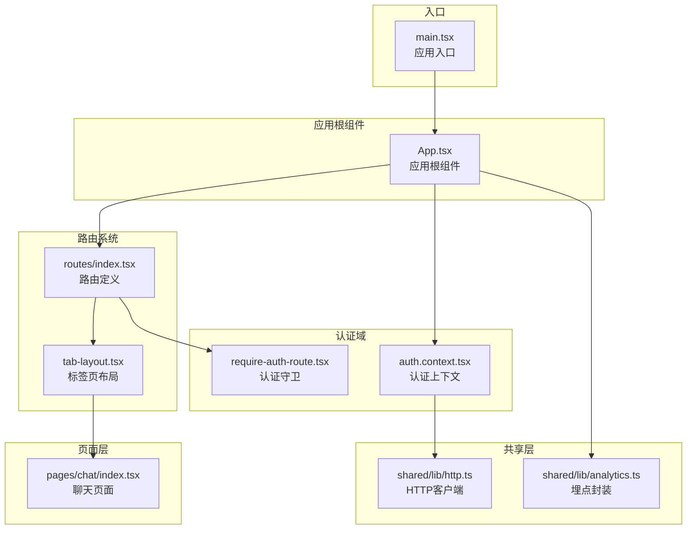
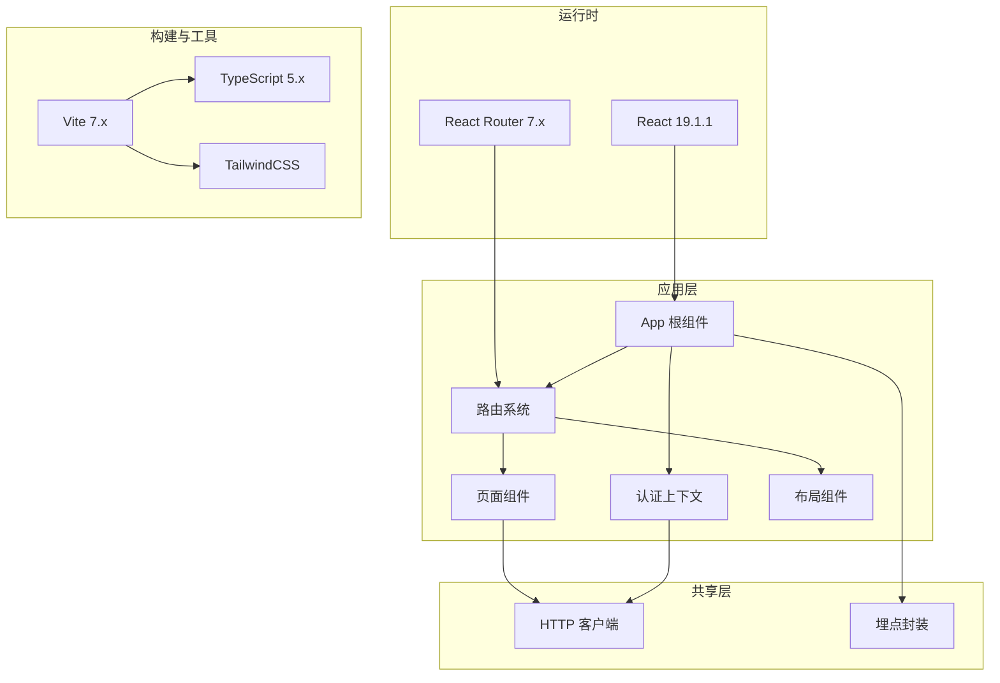
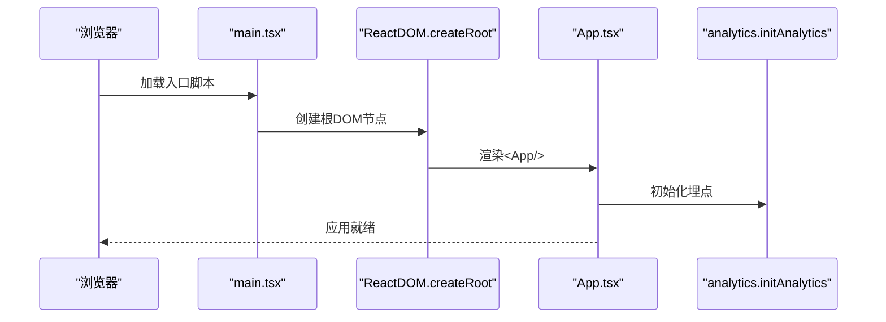
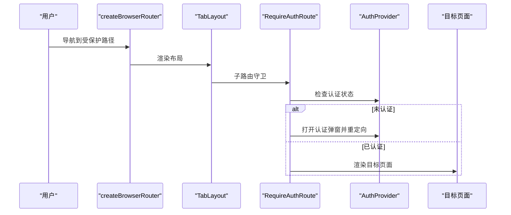
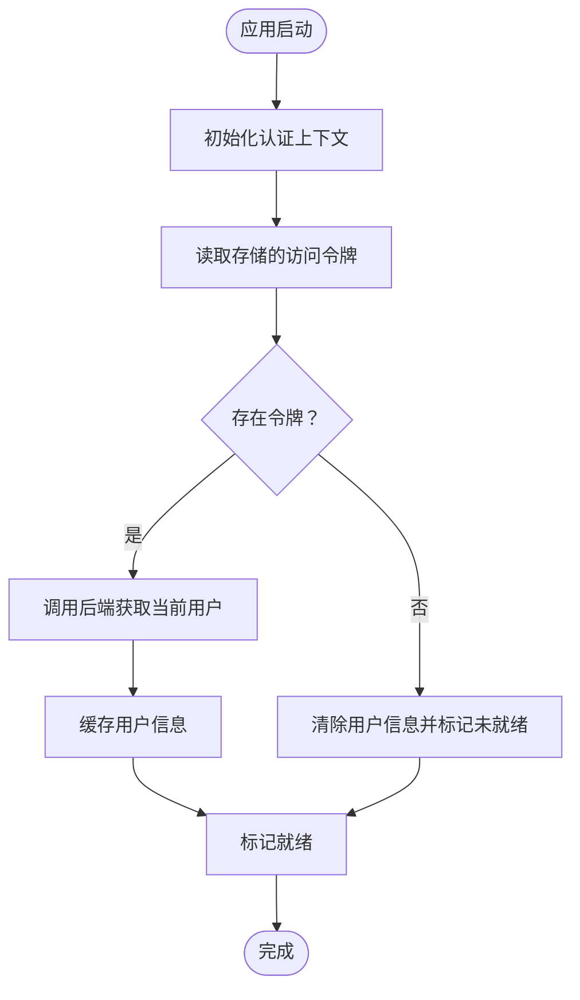
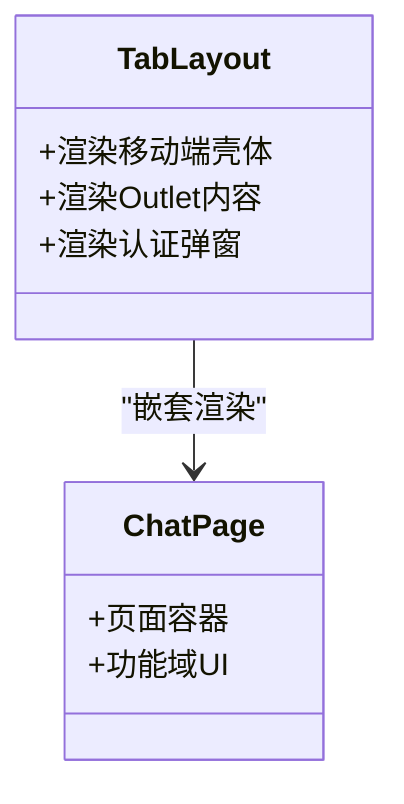
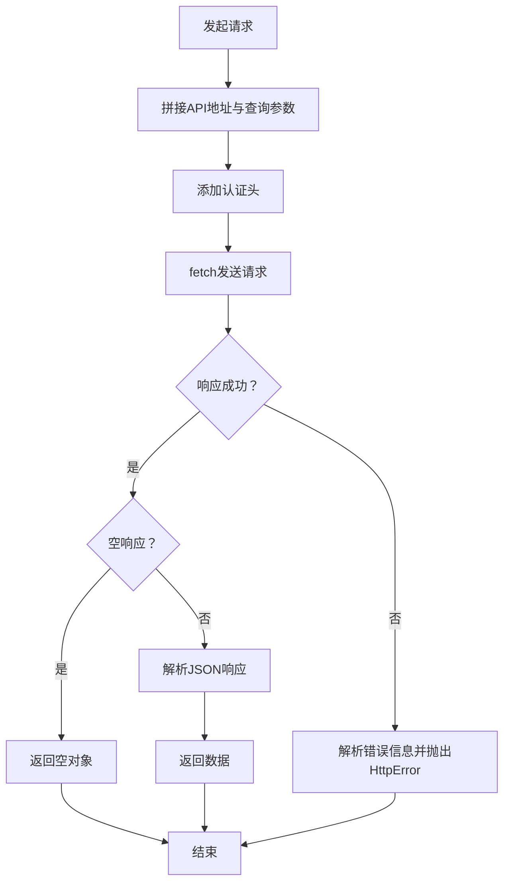
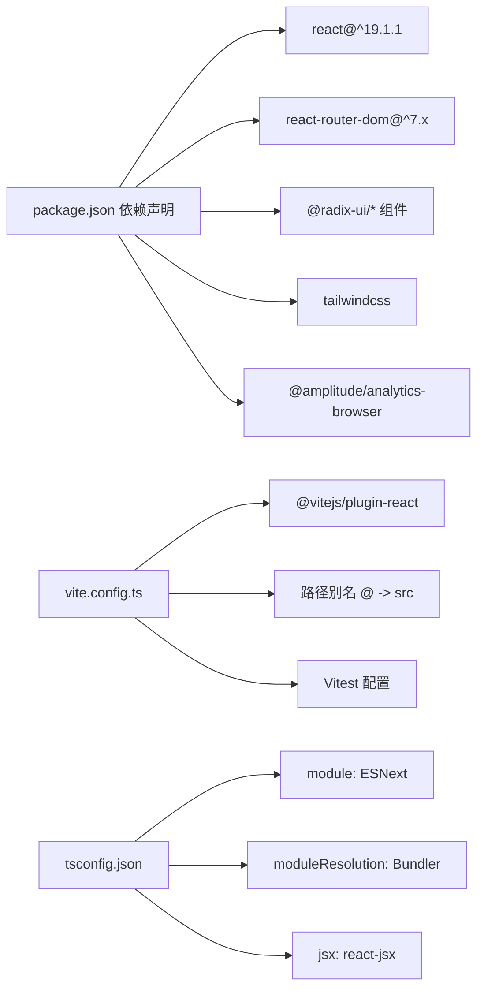

# React应用架构

<cite>
**本文档引用的文件**
- [main.tsx](file://frontend/src/main.tsx)
- [App.tsx](file://frontend/src/app/App.tsx)
- [routes/index.tsx](file://frontend/src/app/routes/index.tsx)
- [auth.context.tsx](file://frontend/src/features/auth/model/auth.context.tsx)
- [require-auth-route.tsx](file://frontend/src/features/auth/ui/require-auth-route.tsx)
- [tab-layout.tsx](file://frontend/src/shared/layouts/tab-layout.tsx)
- [chat/index.tsx](file://frontend/src/pages/chat/index.tsx)
- [vite.config.ts](file://frontend/vite.config.ts)
- [tsconfig.json](file://frontend/tsconfig.json)
- [package.json](file://frontend/package.json)
- [tailwind.config.ts](file://frontend/tailwind.config.ts)
- [postcss.config.js](file://frontend/postcss.config.js)
- [analytics.ts](file://frontend/src/shared/lib/analytics.ts)
- [http.ts](file://frontend/src/shared/lib/http.ts)
</cite>

## 目录
1. [简介](#简介)
2. [项目结构](#项目结构)
3. [核心组件](#核心组件)
4. [架构总览](#架构总览)
5. [详细组件分析](#详细组件分析)
6. [依赖关系分析](#依赖关系分析)
7. [性能考虑](#性能考虑)
8. [故障排除指南](#故障排除指南)
9. [结论](#结论)
10. [附录](#附录)

## 简介
本文件面向React 19.1.1应用的架构与实现，重点阐述应用入口点、路由系统、应用初始化流程、Vite构建配置、TypeScript配置与开发环境设置、模块化组织结构、组件层次设计原则、代码分割策略、生命周期管理、错误边界处理以及性能优化策略。文档同时提供应用启动流程图与组件树结构说明，帮助开发者快速理解并维护该前端工程。

## 项目结构
前端采用按功能域(feature)划分的模块化组织方式，结合共享层(shared)复用通用能力，页面(pages)作为路由出口，应用入口(main.tsx)负责挂载根组件(App)，路由系统(routes)集中定义导航与权限控制。

**图表来源**
- [main.tsx:1-12](file://frontend/src/main.tsx#L1-L12)
- [App.tsx:1-17](file://frontend/src/app/App.tsx#L1-L17)
- [routes/index.tsx:1-56](file://frontend/src/app/routes/index.tsx#L1-L56)
- [tab-layout.tsx:1-15](file://frontend/src/shared/layouts/tab-layout.tsx#L1-L15)
- [auth.context.tsx:1-155](file://frontend/src/features/auth/model/auth.context.tsx#L1-L155)
- [require-auth-route.tsx:1-35](file://frontend/src/features/auth/ui/require-auth-route.tsx#L1-L35)
- [chat/index.tsx:1-6](file://frontend/src/pages/chat/index.tsx#L1-L6)
- [http.ts:1-75](file://frontend/src/shared/lib/http.ts#L1-L75)
- [analytics.ts:1-57](file://frontend/src/shared/lib/analytics.ts#L1-L57)

**章节来源**
- [main.tsx:1-12](file://frontend/src/main.tsx#L1-L12)
- [App.tsx:1-17](file://frontend/src/app/App.tsx#L1-L17)
- [routes/index.tsx:1-56](file://frontend/src/app/routes/index.tsx#L1-L56)
- [tab-layout.tsx:1-15](file://frontend/src/shared/layouts/tab-layout.tsx#L1-L15)
- [auth.context.tsx:1-155](file://frontend/src/features/auth/model/auth.context.tsx#L1-L155)
- [require-auth-route.tsx:1-35](file://frontend/src/features/auth/ui/require-auth-route.tsx#L1-L35)
- [chat/index.tsx:1-6](file://frontend/src/pages/chat/index.tsx#L1-L6)
- [http.ts:1-75](file://frontend/src/shared/lib/http.ts#L1-L75)
- [analytics.ts:1-57](file://frontend/src/shared/lib/analytics.ts#L1-L57)

## 核心组件
- 应用入口：负责创建根DOM节点并渲染根组件，启用严格模式以提升开发期质量。
- 应用根组件：集中注入认证上下文、路由提供者、全局通知组件，并在启动时初始化埋点。
- 路由系统：使用React Router v7的createBrowserRouter定义路径、嵌套路由与权限守卫。
- 认证上下文：提供登录、登出、用户信息刷新、认证弹窗控制等能力，并与埋点集成。
- 页面与布局：页面组件作为功能域UI出口，布局组件承载通用容器与权限弹窗。
- HTTP与埋点：统一的HTTP客户端封装错误处理，埋点模块封装Amplitude初始化与事件追踪。

**章节来源**
- [main.tsx:1-12](file://frontend/src/main.tsx#L1-L12)
- [App.tsx:1-17](file://frontend/src/app/App.tsx#L1-L17)
- [routes/index.tsx:1-56](file://frontend/src/app/routes/index.tsx#L1-L56)
- [auth.context.tsx:1-155](file://frontend/src/features/auth/model/auth.context.tsx#L1-L155)
- [tab-layout.tsx:1-15](file://frontend/src/shared/layouts/tab-layout.tsx#L1-L15)
- [chat/index.tsx:1-6](file://frontend/src/pages/chat/index.tsx#L1-L6)
- [http.ts:1-75](file://frontend/src/shared/lib/http.ts#L1-L75)
- [analytics.ts:1-57](file://frontend/src/shared/lib/analytics.ts#L1-L57)

## 架构总览
应用采用“入口 -> 根组件 -> 路由 -> 功能域”的分层架构。认证上下文贯穿全局，路由系统负责导航与权限控制，页面与布局组件承载具体功能，共享层提供HTTP与埋点等横切能力。

**图表来源**
- [main.tsx:1-12](file://frontend/src/main.tsx#L1-L12)
- [App.tsx:1-17](file://frontend/src/app/App.tsx#L1-L17)
- [routes/index.tsx:1-56](file://frontend/src/app/routes/index.tsx#L1-L56)
- [auth.context.tsx:1-155](file://frontend/src/features/auth/model/auth.context.tsx#L1-L155)
- [http.ts:1-75](file://frontend/src/shared/lib/http.ts#L1-L75)
- [analytics.ts:1-57](file://frontend/src/shared/lib/analytics.ts#L1-L57)
- [vite.config.ts:1-28](file://frontend/vite.config.ts#L1-L28)
- [tsconfig.json:1-23](file://frontend/tsconfig.json#L1-L23)
- [tailwind.config.ts:1-99](file://frontend/tailwind.config.ts#L1-L99)

## 详细组件分析

### 应用入口与初始化流程
应用入口负责创建根DOM节点并渲染根组件，启用严格模式以提升开发期质量；根组件负责初始化埋点、注入认证上下文与路由提供者，并挂载全局通知组件。

**图表来源**
- [main.tsx:1-12](file://frontend/src/main.tsx#L1-L12)
- [App.tsx:1-17](file://frontend/src/app/App.tsx#L1-L17)
- [analytics.ts:1-57](file://frontend/src/shared/lib/analytics.ts#L1-L57)

**章节来源**
- [main.tsx:1-12](file://frontend/src/main.tsx#L1-L12)
- [App.tsx:1-17](file://frontend/src/app/App.tsx#L1-L17)
- [analytics.ts:1-57](file://frontend/src/shared/lib/analytics.ts#L1-L57)

### 路由系统与权限控制
路由系统使用React Router v7的createBrowserRouter定义路径与嵌套路由，主路由为标签页布局，子路由包含聊天、个人资料及其子页面；认证守卫对受保护路由进行拦截并触发认证弹窗。

**图表来源**
- [routes/index.tsx:1-56](file://frontend/src/app/routes/index.tsx#L1-L56)
- [tab-layout.tsx:1-15](file://frontend/src/shared/layouts/tab-layout.tsx#L1-L15)
- [require-auth-route.tsx:1-35](file://frontend/src/features/auth/ui/require-auth-route.tsx#L1-L35)
- [auth.context.tsx:1-155](file://frontend/src/features/auth/model/auth.context.tsx#L1-L155)

**章节来源**
- [routes/index.tsx:1-56](file://frontend/src/app/routes/index.tsx#L1-L56)
- [tab-layout.tsx:1-15](file://frontend/src/shared/layouts/tab-layout.tsx#L1-L15)
- [require-auth-route.tsx:1-35](file://frontend/src/features/auth/ui/require-auth-route.tsx#L1-L35)
- [auth.context.tsx:1-155](file://frontend/src/features/auth/model/auth.context.tsx#L1-L155)

### 认证上下文与生命周期
认证上下文负责用户状态管理、登录/登出、令牌与用户信息缓存、认证弹窗控制，并在应用启动时尝试刷新用户信息。其生命周期包括初始化、状态更新与清理。

**图表来源**
- [auth.context.tsx:1-155](file://frontend/src/features/auth/model/auth.context.tsx#L1-L155)

**章节来源**
- [auth.context.tsx:1-155](file://frontend/src/features/auth/model/auth.context.tsx#L1-L155)

### 页面与布局组件
页面组件作为功能域UI出口，布局组件承载通用容器与权限弹窗，共同构成可复用的UI基础设施。

**图表来源**
- [tab-layout.tsx:1-15](file://frontend/src/shared/layouts/tab-layout.tsx#L1-L15)
- [chat/index.tsx:1-6](file://frontend/src/pages/chat/index.tsx#L1-L6)

**章节来源**
- [tab-layout.tsx:1-15](file://frontend/src/shared/layouts/tab-layout.tsx#L1-L15)
- [chat/index.tsx:1-6](file://frontend/src/pages/chat/index.tsx#L1-L6)

### HTTP客户端与错误处理
HTTP客户端封装请求参数、认证头、响应解析与错误处理，统一抛出自定义HttpError以便上层捕获与处理。

**图表来源**
- [http.ts:1-75](file://frontend/src/shared/lib/http.ts#L1-L75)

**章节来源**
- [http.ts:1-75](file://frontend/src/shared/lib/http.ts#L1-L75)

## 依赖关系分析
- 应用依赖：React 19.1.1、React Router DOM 7.x、Radix UI组件库、TailwindCSS、Amplitude分析等。
- 构建工具：Vite 7.x、@vitejs/plugin-react、TypeScript 5.x、TailwindCSS、PostCSS。
- 开发脚本：dev、build、preview、test、test:watch等。

**图表来源**
- [package.json:1-52](file://frontend/package.json#L1-L52)
- [vite.config.ts:1-28](file://frontend/vite.config.ts#L1-L28)
- [tsconfig.json:1-23](file://frontend/tsconfig.json#L1-L23)

**章节来源**
- [package.json:1-52](file://frontend/package.json#L1-L52)
- [vite.config.ts:1-28](file://frontend/vite.config.ts#L1-L28)
- [tsconfig.json:1-23](file://frontend/tsconfig.json#L1-L23)

## 性能考虑
- 代码分割：建议使用React.lazy与Suspense对非首屏功能进行懒加载，减少初始包体积。
- 资源压缩：Vite默认启用生产构建压缩与Tree-shaking，确保仅打包实际使用的代码。
- 样式优化：TailwindCSS按需生成样式，建议配合purge配置移除未使用类名。
- 请求优化：HTTP客户端已内置认证头与错误处理，避免重复逻辑；可引入缓存策略减少重复请求。
- 埋点优化：初始化仅执行一次，避免重复初始化导致的性能损耗。

[本节为通用指导，不涉及特定文件分析]

## 故障排除指南
- 认证失败或401/403：认证上下文会清除本地令牌与用户信息并标记未就绪，检查后端接口与令牌有效性。
- 路由跳转异常：确认路由配置与嵌套层级正确，认证守卫是否正确打开弹窗并重定向。
- HTTP请求失败：查看HttpError的status与message，定位后端错误或网络问题。
- 埋点未生效：确认环境变量VITE_AMPLITUDE_API_KEY已配置且初始化函数在应用启动时被调用。

**章节来源**
- [auth.context.tsx:1-155](file://frontend/src/features/auth/model/auth.context.tsx#L1-L155)
- [require-auth-route.tsx:1-35](file://frontend/src/features/auth/ui/require-auth-route.tsx#L1-L35)
- [http.ts:1-75](file://frontend/src/shared/lib/http.ts#L1-L75)
- [analytics.ts:1-57](file://frontend/src/shared/lib/analytics.ts#L1-L57)

## 结论
该React应用采用清晰的分层架构与功能域驱动的模块化组织，结合React Router v7的现代路由能力与认证上下文，实现了良好的可维护性与扩展性。通过Vite与TypeScript的现代化工具链，开发体验与构建效率得到保障。建议在后续迭代中进一步完善代码分割与性能监控，持续优化用户体验。

[本节为总结性内容，不涉及特定文件分析]

## 附录

### 开发环境与构建配置要点
- Vite配置：启用React插件、路径别名、测试环境(jsdom)、开发服务器端口与严格端口。
- TypeScript配置：ESNext模块、Bundler解析器、React JSX、严格模式、路径映射、类型声明。
- TailwindCSS：内容扫描范围、主题扩展、动画与阴影、字体族、颜色变量。
- PostCSS：自动前缀与Tailwind集成。

**章节来源**
- [vite.config.ts:1-28](file://frontend/vite.config.ts#L1-L28)
- [tsconfig.json:1-23](file://frontend/tsconfig.json#L1-L23)
- [tailwind.config.ts:1-99](file://frontend/tailwind.config.ts#L1-L99)
- [postcss.config.js:1-7](file://frontend/postcss.config.js#L1-L7)