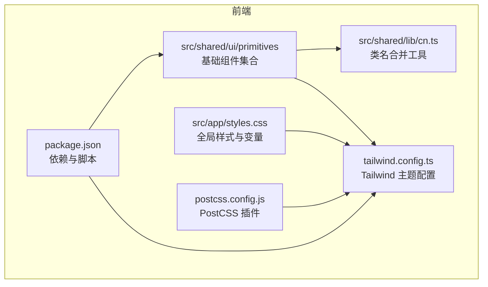
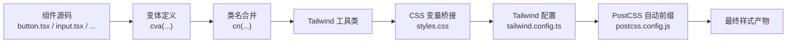
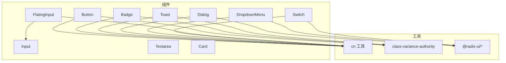

# UI组件库

<cite>
**本文引用的文件**
- [frontend/src/shared/ui/primitives/index.ts](file://frontend/src/shared/ui/primitives/index.ts)
- [frontend/src/shared/ui/primitives/button.tsx](file://frontend/src/shared/ui/primitives/button.tsx)
- [frontend/src/shared/ui/primitives/input.tsx](file://frontend/src/shared/ui/primitives/input.tsx)
- [frontend/src/shared/ui/primitives/card.tsx](file://frontend/src/shared/ui/primitives/card.tsx)
- [frontend/src/shared/ui/primitives/dialog.tsx](file://frontend/src/shared/ui/primitives/dialog.tsx)
- [frontend/src/shared/ui/primitives/badge.tsx](file://frontend/src/shared/ui/primitives/badge.tsx)
- [frontend/src/shared/ui/primitives/dropdown-menu.tsx](file://frontend/src/shared/ui/primitives/dropdown-menu.tsx)
- [frontend/src/shared/ui/primitives/switch.tsx](file://frontend/src/shared/ui/primitives/switch.tsx)
- [frontend/src/shared/ui/primitives/textarea.tsx](file://frontend/src/shared/ui/primitives/textarea.tsx)
- [frontend/src/shared/ui/primitives/flating-input.tsx](file://frontend/src/shared/ui/primitives/flating-input.tsx)
- [frontend/src/shared/ui/primitives/toast.tsx](file://frontend/src/shared/ui/primitives/toast.tsx)
- [frontend/src/shared/lib/cn.ts](file://frontend/src/shared/lib/cn.ts)
- [frontend/src/app/styles.css](file://frontend/src/app/styles.css)
- [frontend/tailwind.config.ts](file://frontend/tailwind.config.ts)
- [frontend/postcss.config.js](file://frontend/postcss.config.js)
- [frontend/package.json](file://frontend/package.json)
</cite>

## 目录
1. [简介](#简介)
2. [项目结构](#项目结构)
3. [核心组件](#核心组件)
4. [架构总览](#架构总览)
5. [组件详解](#组件详解)
6. [依赖关系分析](#依赖关系分析)
7. [性能与可访问性](#性能与可访问性)
8. [故障排查](#故障排查)
9. [结论](#结论)
10. [附录：使用示例与最佳实践](#附录使用示例与最佳实践)

## 简介
本文件系统化梳理了本项目的UI设计系统，基于 shadcn/ui 的设计语言与原子化变体系统，并结合品牌色值与自定义组件，形成统一、可扩展且具备良好可访问性的前端组件库。内容覆盖基础组件（Button、Input、Card、Dialog 等）、Tailwind 配置与主题定制、响应式设计原则、组件属性与事件、样式定制选项、可访问性与跨浏览器兼容性建议，以及使用示例与扩展指南。

## 项目结构
UI 组件集中于共享层的 primitives 模块，通过统一出口导出，便于在应用中按需引入；样式通过 Tailwind 与 CSS 变量桥接，配合 PostCSS 自动前缀与构建管线完成样式生成。

图表来源
- [frontend/src/shared/ui/primitives/index.ts:1-32](file://frontend/src/shared/ui/primitives/index.ts#L1-L32)
- [frontend/src/shared/lib/cn.ts:1-7](file://frontend/src/shared/lib/cn.ts#L1-L7)
- [frontend/src/app/styles.css:1-170](file://frontend/src/app/styles.css#L1-L170)
- [frontend/tailwind.config.ts:1-99](file://frontend/tailwind.config.ts#L1-L99)
- [frontend/postcss.config.js:1-7](file://frontend/postcss.config.js#L1-L7)
- [frontend/package.json:1-52](file://frontend/package.json#L1-L52)

章节来源
- [frontend/src/shared/ui/primitives/index.ts:1-32](file://frontend/src/shared/ui/primitives/index.ts#L1-L32)
- [frontend/src/shared/lib/cn.ts:1-7](file://frontend/src/shared/lib/cn.ts#L1-L7)
- [frontend/src/app/styles.css:1-170](file://frontend/src/app/styles.css#L1-L170)
- [frontend/tailwind.config.ts:1-99](file://frontend/tailwind.config.ts#L1-L99)
- [frontend/postcss.config.js:1-7](file://frontend/postcss.config.js#L1-L7)
- [frontend/package.json:1-52](file://frontend/package.json#L1-L52)

## 核心组件
本设计系统的核心组件包括：
- 品牌按钮 Button（支持多种变体与尺寸）
- 输入 Input、Textarea
- 卡片 Card（含 Header/Content/Footer/Title/Description）
- 对话框 Dialog（含 Overlay/Content/Header/Footer/Title/Description）
- 徽章 Badge、下拉菜单 DropdownMenu、开关 Switch
- 浮动标签输入 FlatingInput
- 提示 Toast（含 Provider、Viewport、Root、Title、Description、Close、Action）

这些组件均通过统一出口导出，便于集中管理与版本升级。

章节来源
- [frontend/src/shared/ui/primitives/index.ts:1-32](file://frontend/src/shared/ui/primitives/index.ts#L1-L32)
- [frontend/src/shared/ui/primitives/button.tsx:1-55](file://frontend/src/shared/ui/primitives/button.tsx#L1-L55)
- [frontend/src/shared/ui/primitives/input.tsx:1-27](file://frontend/src/shared/ui/primitives/input.tsx#L1-L27)
- [frontend/src/shared/ui/primitives/textarea.tsx:1-25](file://frontend/src/shared/ui/primitives/textarea.tsx#L1-L25)
- [frontend/src/shared/ui/primitives/card.tsx:1-56](file://frontend/src/shared/ui/primitives/card.tsx#L1-L56)
- [frontend/src/shared/ui/primitives/dialog.tsx:1-121](file://frontend/src/shared/ui/primitives/dialog.tsx#L1-L121)
- [frontend/src/shared/ui/primitives/badge.tsx:1-36](file://frontend/src/shared/ui/primitives/badge.tsx#L1-L36)
- [frontend/src/shared/ui/primitives/dropdown-menu.tsx:1-199](file://frontend/src/shared/ui/primitives/dropdown-menu.tsx#L1-L199)
- [frontend/src/shared/ui/primitives/switch.tsx:1-24](file://frontend/src/shared/ui/primitives/switch.tsx#L1-L24)
- [frontend/src/shared/ui/primitives/flating-input.tsx:1-127](file://frontend/src/shared/ui/primitives/flating-input.tsx#L1-L127)
- [frontend/src/shared/ui/primitives/toast.tsx:1-127](file://frontend/src/shared/ui/primitives/toast.tsx#L1-L127)

## 架构总览
组件库采用“变体 + 类名合并”的组合模式：
- 使用 class-variance-authority 定义变体（variant/size），以最小样板生成复杂样式。
- 使用 tailwind-merge 与 clsx 合并类名，避免冲突与重复。
- Tailwind 主题通过 CSS 变量桥接品牌色与语义色，确保全局一致性与可定制性。
- PostCSS 自动前缀保证跨浏览器兼容。

图表来源
- [frontend/src/shared/ui/primitives/button.tsx:6-33](file://frontend/src/shared/ui/primitives/button.tsx#L6-L33)
- [frontend/src/shared/lib/cn.ts:4-6](file://frontend/src/shared/lib/cn.ts#L4-L6)
- [frontend/src/app/styles.css:7-46](file://frontend/src/app/styles.css#L7-L46)
- [frontend/tailwind.config.ts:5-93](file://frontend/tailwind.config.ts#L5-L93)
- [frontend/postcss.config.js:1-7](file://frontend/postcss.config.js#L1-L7)

## 组件详解

### Button（品牌按钮）
- 设计要点
  - 支持默认、破坏性、描边、次级、幽灵、链接、品牌 primary 等变体。
  - 支持默认、小、大、超大、图标等尺寸。
  - 通过 focus-visible ring 与过渡动画提升交互反馈。
- 关键属性
  - 变体 variant: 默认 default，可选 destructive、outline、secondary、ghost、link、primary
  - 尺寸 size: 默认 default，可选 sm、lg、hero、icon
  - 其他原生 button 属性透传
  - asChild（用于集成到非 button 元素）
- 样式定制
  - 通过 variant/size 控制背景、边框、文字颜色与悬停态。
  - 支持 className 覆盖与 tailwind 工具类叠加。
- 可访问性
  - 内置 focus-visible ring 与禁用态样式，符合 WCAG 基本要求。
- 使用示例
  - 建议参考组件导出路径进行导入与使用。

章节来源
- [frontend/src/shared/ui/primitives/button.tsx:6-33](file://frontend/src/shared/ui/primitives/button.tsx#L6-L33)
- [frontend/src/shared/ui/primitives/button.tsx:35-39](file://frontend/src/shared/ui/primitives/button.tsx#L35-L39)
- [frontend/src/shared/ui/primitives/button.tsx:41-51](file://frontend/src/shared/ui/primitives/button.tsx#L41-L51)

### Input（输入框）
- 设计要点
  - 统一圆角、边框、内边距与占位符样式。
  - 聚焦态带 ring 与偏移，禁用态半透明。
- 关键属性
  - type: 原生 input type
  - className: 自定义样式
  - 其他原生 input 属性透传
- 样式定制
  - 通过 className 与 tailwind 工具类叠加。
- 使用示例
  - 建议参考组件导出路径进行导入与使用。

章节来源
- [frontend/src/shared/ui/primitives/input.tsx:5-24](file://frontend/src/shared/ui/primitives/input.tsx#L5-L24)

### Textarea（多行文本）
- 设计要点
  - 最小高度、圆角、边框、聚焦态 ring。
- 关键属性
  - className 与原生 textarea 属性透传
- 样式定制
  - 通过 className 与 tailwind 工具类叠加。
- 使用示例
  - 建议参考组件导出路径进行导入与使用。

章节来源
- [frontend/src/shared/ui/primitives/textarea.tsx:5-22](file://frontend/src/shared/ui/primitives/textarea.tsx#L5-L22)

### Card（卡片）
- 设计要点
  - 统一圆角、阴影、背景与前景色。
  - 分离 Header/Content/Footer/Title/Description，便于灵活组合。
- 关键属性
  - className 透传
- 使用示例
  - 建议参考组件导出路径进行导入与使用。

章节来源
- [frontend/src/shared/ui/primitives/card.tsx:5-53](file://frontend/src/shared/ui/primitives/card.tsx#L5-L53)

### Dialog（对话框）
- 设计要点
  - 基于 Radix UI，内置 Portal、Overlay、Content、Header/Footer、Title/Description。
  - 开关动画与淡入淡出，移动端友好。
- 关键属性
  - Root/Trigger/Portal/Overlay/Close 等组件各自支持 className 与原生属性透传
- 使用示例
  - 建议参考组件导出路径进行导入与使用。

章节来源
- [frontend/src/shared/ui/primitives/dialog.tsx:7-52](file://frontend/src/shared/ui/primitives/dialog.tsx#L7-L52)
- [frontend/src/shared/ui/primitives/dialog.tsx:54-80](file://frontend/src/shared/ui/primitives/dialog.tsx#L54-L80)
- [frontend/src/shared/ui/primitives/dialog.tsx:82-107](file://frontend/src/shared/ui/primitives/dialog.tsx#L82-L107)

### Badge（徽章）
- 设计要点
  - 支持默认、次级、破坏性、描边与品牌 subtle 变体。
- 关键属性
  - variant: 默认 subtle
  - className 透传
- 使用示例
  - 建议参考组件导出路径进行导入与使用。

章节来源
- [frontend/src/shared/ui/primitives/badge.tsx:6-23](file://frontend/src/shared/ui/primitives/badge.tsx#L6-L23)
- [frontend/src/shared/ui/primitives/badge.tsx:25-27](file://frontend/src/shared/ui/primitives/badge.tsx#L25-L27)
- [frontend/src/shared/ui/primitives/badge.tsx:29-33](file://frontend/src/shared/ui/primitives/badge.tsx#L29-L33)

### DropdownMenu（下拉菜单）
- 设计要点
  - 支持 Trigger、Group、Portal、Sub、RadioGroup、Content、Item、CheckboxItem、RadioItem、Label、Separator、Shortcut 等子组件。
  - 动画与定位基于 Radix UI。
- 关键属性
  - Content 支持 sideOffset，默认 4
  - SubTrigger 支持 inset 嵌套缩进
- 使用示例
  - 建议参考组件导出路径进行导入与使用。

章节来源
- [frontend/src/shared/ui/primitives/dropdown-menu.tsx:57-73](file://frontend/src/shared/ui/primitives/dropdown-menu.tsx#L57-L73)
- [frontend/src/shared/ui/primitives/dropdown-menu.tsx:19-37](file://frontend/src/shared/ui/primitives/dropdown-menu.tsx#L19-L37)
- [frontend/src/shared/ui/primitives/dropdown-menu.tsx:117-137](file://frontend/src/shared/ui/primitives/dropdown-menu.tsx#L117-L137)

### Switch（开关）
- 设计要点
  - 基于 Radix UI Switch，内置聚焦态 ring 与平滑过渡。
- 关键属性
  - className 透传
- 使用示例
  - 建议参考组件导出路径进行导入与使用。

章节来源
- [frontend/src/shared/ui/primitives/switch.tsx:6-21](file://frontend/src/shared/ui/primitives/switch.tsx#L6-L21)

### FlatingInput（浮动标签输入）
- 设计要点
  - 基于 Input 实现浮动标签效果，支持受控/非受控两种模式。
  - 通过数据属性控制浮层状态与聚焦态。
- 关键属性
  - label: 标签文本
  - containerClassName / labelPositionerClassName / labelClassName: 容器与标签层样式
  - className 透传至底层 Input
- 事件处理
  - onFocus/onBlur/onChange 事件透传并内置状态更新逻辑
- 使用示例
  - 建议参考组件导出路径进行导入与使用。

章节来源
- [frontend/src/shared/ui/primitives/flating-input.tsx:7-12](file://frontend/src/shared/ui/primitives/flating-input.tsx#L7-L12)
- [frontend/src/shared/ui/primitives/flating-input.tsx:26-71](file://frontend/src/shared/ui/primitives/flating-input.tsx#L26-L71)
- [frontend/src/shared/ui/primitives/flating-input.tsx:72-122](file://frontend/src/shared/ui/primitives/flating-input.tsx#L72-L122)

### Toast（提示）
- 设计要点
  - Provider/Viewport/Root/Title/Description/Close/Action 组合。
  - 支持默认与破坏性变体，内置滑入滑出与淡入淡出动画。
- 关键属性
  - Root 支持 variant 与 className 透传
  - Viewport 支持 className 透传
- 使用示例
  - 建议参考组件导出路径进行导入与使用。

章节来源
- [frontend/src/shared/ui/primitives/toast.tsx:8-23](file://frontend/src/shared/ui/primitives/toast.tsx#L8-L23)
- [frontend/src/shared/ui/primitives/toast.tsx:25-39](file://frontend/src/shared/ui/primitives/toast.tsx#L25-L39)
- [frontend/src/shared/ui/primitives/toast.tsx:41-54](file://frontend/src/shared/ui/primitives/toast.tsx#L41-L54)

## 依赖关系分析
- 组件依赖
  - 所有组件依赖 cn 工具进行类名合并，确保样式冲突最小化。
  - Button、Badge、Toast 等使用 class-variance-authority 定义变体。
  - Dialog、DropdownMenu、Switch 等基于 Radix UI。
- 样式依赖
  - Tailwind 配置通过 CSS 变量桥接品牌色与语义色，styles.css 定义 :root 变量。
  - PostCSS 自动前缀保证跨浏览器兼容。
- 依赖清单
  - React、Lucide React、Radix UI 生态、class-variance-authority、clsx、tailwind-merge。

图表来源
- [frontend/src/shared/lib/cn.ts:4-6](file://frontend/src/shared/lib/cn.ts#L4-L6)
- [frontend/src/shared/ui/primitives/button.tsx:2-4](file://frontend/src/shared/ui/primitives/button.tsx#L2-L4)
- [frontend/src/shared/ui/primitives/badge.tsx:2-4](file://frontend/src/shared/ui/primitives/badge.tsx#L2-L4)
- [frontend/src/shared/ui/primitives/toast.tsx:3-6](file://frontend/src/shared/ui/primitives/toast.tsx#L3-L6)
- [frontend/src/shared/ui/primitives/dialog.tsx:2-5](file://frontend/src/shared/ui/primitives/dialog.tsx#L2-L5)
- [frontend/src/shared/ui/primitives/dropdown-menu.tsx:1-5](file://frontend/src/shared/ui/primitives/dropdown-menu.tsx#L1-L5)
- [frontend/src/shared/ui/primitives/switch.tsx:2-4](file://frontend/src/shared/ui/primitives/switch.tsx#L2-L4)
- [frontend/src/shared/ui/primitives/flating-input.tsx:3-5](file://frontend/src/shared/ui/primitives/flating-input.tsx#L3-L5)

章节来源
- [frontend/src/shared/lib/cn.ts:1-7](file://frontend/src/shared/lib/cn.ts#L1-L7)
- [frontend/src/shared/ui/primitives/button.tsx:1-55](file://frontend/src/shared/ui/primitives/button.tsx#L1-L55)
- [frontend/src/shared/ui/primitives/badge.tsx:1-36](file://frontend/src/shared/ui/primitives/badge.tsx#L1-L36)
- [frontend/src/shared/ui/primitives/toast.tsx:1-127](file://frontend/src/shared/ui/primitives/toast.tsx#L1-L127)
- [frontend/src/shared/ui/primitives/dialog.tsx:1-121](file://frontend/src/shared/ui/primitives/dialog.tsx#L1-L121)
- [frontend/src/shared/ui/primitives/dropdown-menu.tsx:1-199](file://frontend/src/shared/ui/primitives/dropdown-menu.tsx#L1-L199)
- [frontend/src/shared/ui/primitives/switch.tsx:1-24](file://frontend/src/shared/ui/primitives/switch.tsx#L1-L24)
- [frontend/src/shared/ui/primitives/flating-input.tsx:1-127](file://frontend/src/shared/ui/primitives/flating-input.tsx#L1-L127)

## 性能与可访问性
- 性能
  - 使用 tailwind-merge 合并类名，减少无效样式与重排。
  - 变体定义集中，避免重复计算与冗余样式。
  - 动画使用 CSS keyframes 与 Radix UI，保持流畅体验。
- 可访问性
  - Button、Input、Textarea、Switch、Toast、Dialog、DropdownMenu 等组件均内置焦点可见环与禁用态样式，遵循 WCAG 基本要求。
  - Dialog 内部包含关闭按钮的 sr-only 文本，辅助读屏器识别。
- 跨浏览器兼容性
  - PostCSS 自动前缀确保主流浏览器兼容。
  - CSS 变量桥接语义色，避免硬编码颜色导致的兼容问题。

章节来源
- [frontend/src/app/styles.css:7-46](file://frontend/src/app/styles.css#L7-L46)
- [frontend/postcss.config.js:1-7](file://frontend/postcss.config.js#L1-L7)
- [frontend/src/shared/ui/primitives/dialog.tsx:45-48](file://frontend/src/shared/ui/primitives/dialog.tsx#L45-L48)
- [frontend/src/shared/ui/primitives/button.tsx:7-8](file://frontend/src/shared/ui/primitives/button.tsx#L7-L8)
- [frontend/src/shared/ui/primitives/switch.tsx:12-13](file://frontend/src/shared/ui/primitives/switch.tsx#L12-L13)

## 故障排查
- 样式不生效或冲突
  - 检查是否正确引入 cn 工具与 tailwind 工具类。
  - 确认 Tailwind 配置 content 路径包含当前文件。
- 颜色显示异常
  - 检查 :root 中品牌色与语义色变量是否正确设置。
  - 确认 tailwind.config.ts 中颜色映射是否一致。
- 动画或交互异常
  - 检查 Radix UI 组件是否正确包裹在 Portal 中。
  - 确认动画 keyframes 是否在 tailwind.config.ts 中定义。
- 焦点与键盘导航问题
  - 确保组件包含 focus-visible ring 并未被覆盖。
  - Dialog/下拉菜单等需保证关闭按钮可聚焦。

章节来源
- [frontend/src/shared/lib/cn.ts:4-6](file://frontend/src/shared/lib/cn.ts#L4-L6)
- [frontend/tailwind.config.ts:4-93](file://frontend/tailwind.config.ts#L4-L93)
- [frontend/src/app/styles.css:7-46](file://frontend/src/app/styles.css#L7-L46)
- [frontend/src/shared/ui/primitives/dialog.tsx:34-51](file://frontend/src/shared/ui/primitives/dialog.tsx#L34-L51)
- [frontend/src/shared/ui/primitives/dropdown-menu.tsx:61-72](file://frontend/src/shared/ui/primitives/dropdown-menu.tsx#L61-L72)

## 结论
本 UI 组件库以 shadcn/ui 的设计语言为基础，结合品牌色与自定义组件，形成了一套统一、可扩展、可维护的前端组件体系。通过变体系统与类名合并工具，组件在功能与样式上保持高内聚低耦合；通过 Tailwind 与 CSS 变量桥接，主题定制与响应式设计得以简化；通过 Radix UI 与可访问性内置规则，交互体验与无障碍能力得到保障。建议在实际开发中遵循本文档的属性与样式约定，并结合最佳实践进行扩展与二次封装。

## 附录：使用示例与最佳实践
- 导入与使用
  - 通过统一出口集中导入组件，便于版本管理与迁移。
  - 示例路径参考：[frontend/src/shared/ui/primitives/index.ts:1-32](file://frontend/src/shared/ui/primitives/index.ts#L1-L32)
- 属性与事件
  - 组件属性均支持 className 透传与原生属性透传，便于样式与行为扩展。
  - 事件如 onFocus/onBlur/onChange 等在相关组件中已内置处理逻辑。
- 样式定制
  - 优先使用 variant/size 等变体参数；必要时通过 className 与 tailwind 工具类叠加。
  - 避免直接覆盖 CSS 变量，优先通过 tailwind.config.ts 进行主题扩展。
- 响应式与布局
  - 使用 Tailwind 响应式断点与布局工具类，配合移动端壳容器适配。
  - 参考移动端壳样式与断点：[frontend/src/app/styles.css:118-122](file://frontend/src/app/styles.css#L118-L122)
- 可访问性
  - 确保所有交互元素具备可聚焦状态与键盘可达性。
  - 对需要读屏器识别的隐藏文本（如 Dialog 关闭按钮的 sr-only 文本）保持存在。
- 扩展指南
  - 新增组件时，优先复用 cn 工具与变体系统。
  - 与 Radix UI 集成时，确保使用 Portal 包裹并正确设置动画与定位。
  - 在 tailwind.config.ts 中新增动画或阴影等扩展，保持全局一致性。