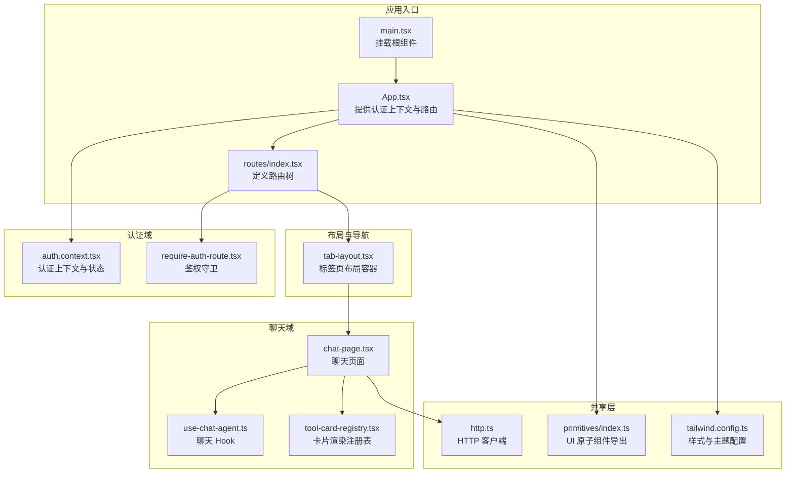
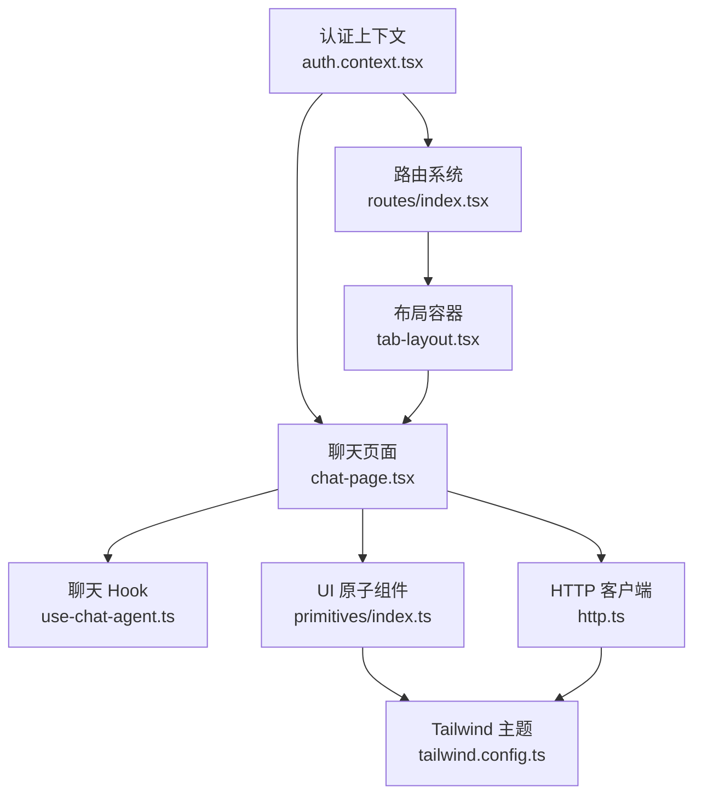
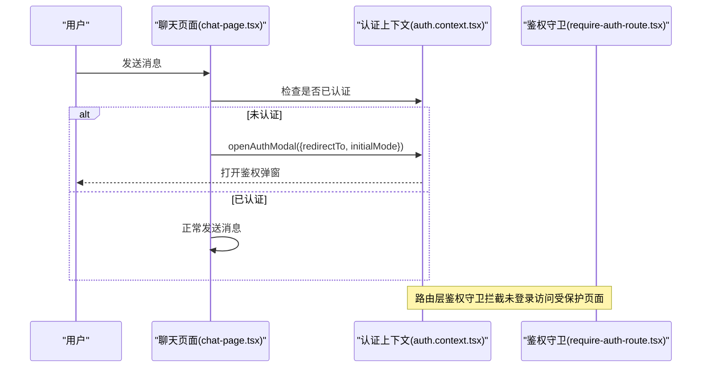
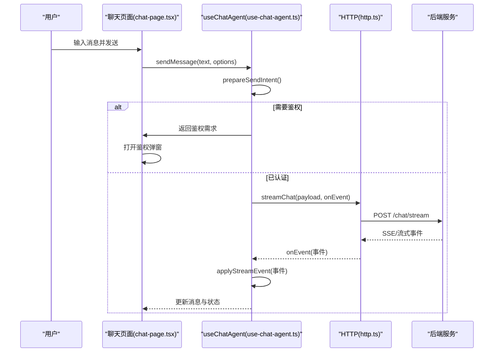
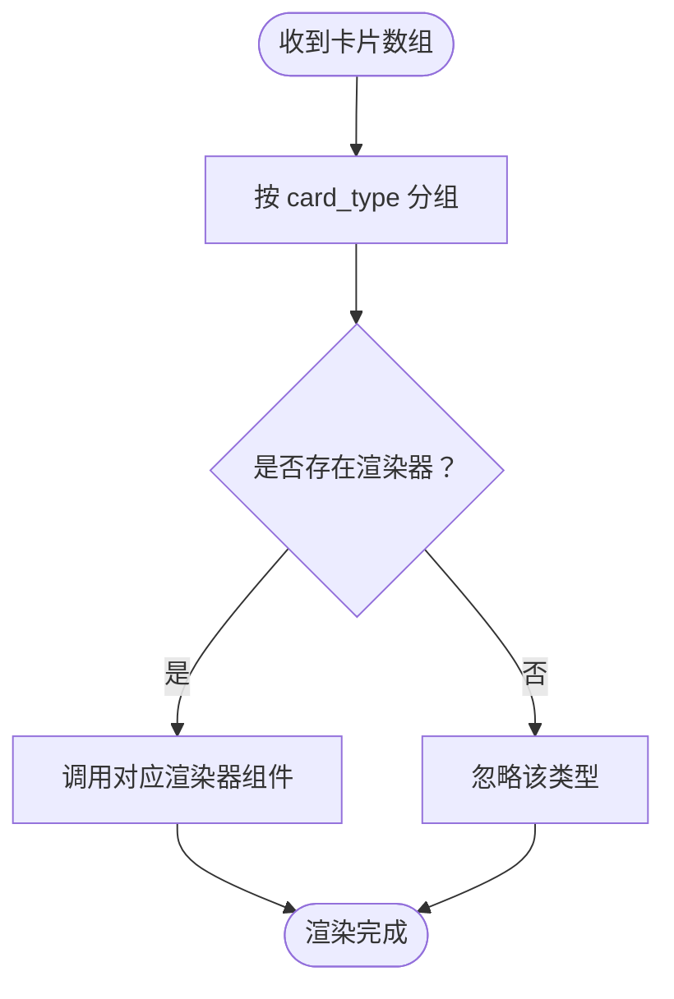
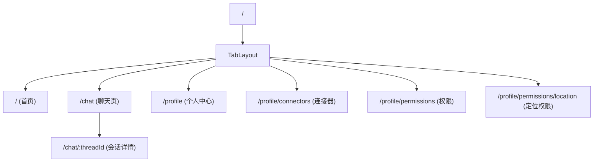
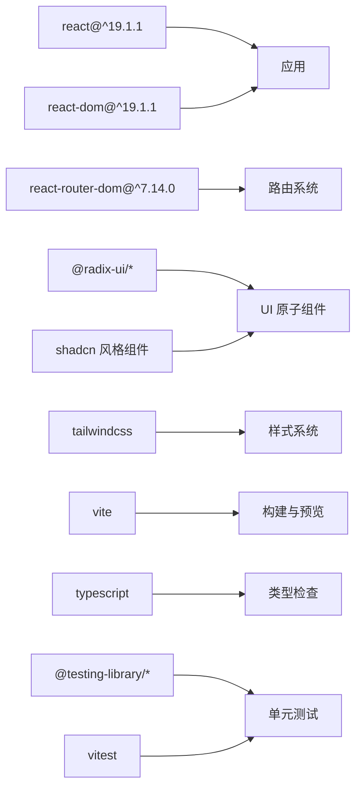

# 前端应用

<cite>
**本文引用的文件**
- [main.tsx](file://frontend/src/main.tsx)
- [App.tsx](file://frontend/src/app/App.tsx)
- [routes/index.tsx](file://frontend/src/app/routes/index.tsx)
- [tab-layout.tsx](file://frontend/src/shared/layouts/tab-layout.tsx)
- [auth.context.tsx](file://frontend/src/features/auth/model/auth.context.tsx)
- [require-auth-route.tsx](file://frontend/src/features/auth/ui/require-auth-route.tsx)
- [chat-page.tsx](file://frontend/src/features/chat/ui/chat-page.tsx)
- [use-chat-agent.ts](file://frontend/src/features/chat/hooks/use-chat-agent.ts)
- [tool-card-registry.tsx](file://frontend/src/features/chat/model/tool-card-registry.tsx)
- [http.ts](file://frontend/src/shared/lib/http.ts)
- [primitives/index.ts](file://frontend/src/shared/ui/primitives/index.ts)
- [tailwind.config.ts](file://frontend/tailwind.config.ts)
- [package.json](file://frontend/package.json)
- [vite.config.ts](file://frontend/vite.config.ts)
- [tsconfig.json](file://frontend/tsconfig.json)
</cite>

## 目录
1. [简介](#简介)
2. [项目结构](#项目结构)
3. [核心组件](#核心组件)
4. [架构总览](#架构总览)
5. [详细组件分析](#详细组件分析)
6. [依赖分析](#依赖分析)
7. [性能考虑](#性能考虑)
8. [故障排查指南](#故障排查指南)
9. [结论](#结论)
10. [附录](#附录)

## 简介
本项目是一个基于 React 19.1.1 的单页应用（SPA），采用 React Router v7 进行路由与导航，结合自研 Hook 体系与上下文（Context）实现状态管理与认证控制。应用围绕“旅行智能助手”场景构建，核心功能包括：
- 聊天界面与实时消息流式渲染
- 工具卡片渲染机制（如酒店卡片）
- 认证系统与用户态管理
- 响应式布局与 UI 组件库集成
- 可扩展的模型配置与版本切换

## 项目结构
前端代码位于 frontend/src，采用按功能域分层的组织方式：
- app：应用入口与路由定义
- features：业务特性模块（auth、chat、connectors、profile）
- shared：共享能力（lib、ui、layouts、config）
- pages：页面级路由组件（auth、chat、profile）

**图表来源**
- [main.tsx:1-12](file://frontend/src/main.tsx#L1-L12)
- [App.tsx:1-17](file://frontend/src/app/App.tsx#L1-L17)
- [routes/index.tsx:1-56](file://frontend/src/app/routes/index.tsx#L1-L56)
- [tab-layout.tsx:1-15](file://frontend/src/shared/layouts/tab-layout.tsx#L1-L15)
- [auth.context.tsx:1-155](file://frontend/src/features/auth/model/auth.context.tsx#L1-L155)
- [require-auth-route.tsx:1-35](file://frontend/src/features/auth/ui/require-auth-route.tsx#L1-L35)
- [chat-page.tsx:1-741](file://frontend/src/features/chat/ui/chat-page.tsx#L1-L741)
- [use-chat-agent.ts:1-596](file://frontend/src/features/chat/hooks/use-chat-agent.ts#L1-L596)
- [tool-card-registry.tsx:1-99](file://frontend/src/features/chat/model/tool-card-registry.tsx#L1-L99)
- [http.ts:1-75](file://frontend/src/shared/lib/http.ts#L1-L75)
- [primitives/index.ts:1-32](file://frontend/src/shared/ui/primitives/index.ts#L1-L32)
- [tailwind.config.ts:1-99](file://frontend/tailwind.config.ts#L1-L99)

**章节来源**
- [main.tsx:1-12](file://frontend/src/main.tsx#L1-L12)
- [App.tsx:1-17](file://frontend/src/app/App.tsx#L1-L17)
- [routes/index.tsx:1-56](file://frontend/src/app/routes/index.tsx#L1-L56)
- [tab-layout.tsx:1-15](file://frontend/src/shared/layouts/tab-layout.tsx#L1-L15)

## 核心组件
- 应用根组件与挂载：通过根组件挂载并启用严格模式，初始化全局分析埋点。
- 路由系统：使用 createBrowserRouter 定义嵌套路由，支持首页与聊天页为主，个人中心相关页面受鉴权守卫保护。
- 认证上下文：提供用户态、登录/登出、鉴权弹窗开关、刷新用户信息等能力。
- 聊天页面：负责消息渲染、会话管理、语音播放、快捷提示、模型配置等。
- 聊天 Hook：封装消息流式处理、会话列表、模型配置、版本切换、反馈与停止生成等。
- 工具卡片注册表：将后端结构化卡片映射到前端渲染器，支持按类型聚合渲染。

**章节来源**
- [App.tsx:1-17](file://frontend/src/app/App.tsx#L1-L17)
- [routes/index.tsx:1-56](file://frontend/src/app/routes/index.tsx#L1-L56)
- [auth.context.tsx:1-155](file://frontend/src/features/auth/model/auth.context.tsx#L1-L155)
- [chat-page.tsx:1-741](file://frontend/src/features/chat/ui/chat-page.tsx#L1-L741)
- [use-chat-agent.ts:1-596](file://frontend/src/features/chat/hooks/use-chat-agent.ts#L1-L596)
- [tool-card-registry.tsx:1-99](file://frontend/src/features/chat/model/tool-card-registry.tsx#L1-L99)

## 架构总览
应用采用“上下文 + Hook + 路由”的组合架构：
- 上下文层：认证上下文提供全局用户态与鉴权弹窗控制。
- Hook 层：useChatAgent 将网络请求、事件流、状态合并为可复用的聊天能力。
- 视图层：聊天页面、布局组件与路由共同构成交互界面。
- 共享层：HTTP 客户端、UI 原子组件与 Tailwind 主题配置统一风格与行为。

**图表来源**
- [auth.context.tsx:1-155](file://frontend/src/features/auth/model/auth.context.tsx#L1-L155)
- [routes/index.tsx:1-56](file://frontend/src/app/routes/index.tsx#L1-L56)
- [tab-layout.tsx:1-15](file://frontend/src/shared/layouts/tab-layout.tsx#L1-L15)
- [chat-page.tsx:1-741](file://frontend/src/features/chat/ui/chat-page.tsx#L1-L741)
- [use-chat-agent.ts:1-596](file://frontend/src/features/chat/hooks/use-chat-agent.ts#L1-L596)
- [http.ts:1-75](file://frontend/src/shared/lib/http.ts#L1-L75)
- [primitives/index.ts:1-32](file://frontend/src/shared/ui/primitives/index.ts#L1-L32)
- [tailwind.config.ts:1-99](file://frontend/tailwind.config.ts#L1-L99)

## 详细组件分析

### 认证系统与权限控制
- 认证上下文提供用户信息、登录/登出、鉴权弹窗控制与刷新逻辑；支持本地存储令牌与用户信息，初始化分析埋点。
- 鉴权守卫在路由层对受保护路径进行拦截，未登录时打开鉴权弹窗并重定向至目标页。
- 聊天页面在需要认证时通过上下文打开鉴权弹窗，并在认证完成后自动发送之前待处理的消息。

**图表来源**
- [chat-page.tsx:150-174](file://frontend/src/features/chat/ui/chat-page.tsx#L150-L174)
- [auth.context.tsx:56-66](file://frontend/src/features/auth/model/auth.context.tsx#L56-L66)
- [require-auth-route.tsx:21-34](file://frontend/src/features/auth/ui/require-auth-route.tsx#L21-L34)

**章节来源**
- [auth.context.tsx:1-155](file://frontend/src/features/auth/model/auth.context.tsx#L1-L155)
- [require-auth-route.tsx:1-35](file://frontend/src/features/auth/ui/require-auth-route.tsx#L1-L35)
- [chat-page.tsx:150-174](file://frontend/src/features/chat/ui/chat-page.tsx#L150-L174)

### 聊天界面与实时消息处理
- 聊天页面负责消息列表渲染、快捷提示、会话历史、模型配置弹窗、语音播放与错误处理。
- useChatAgent 提供消息流式处理、会话列表拉取、模型配置切换、版本切换与反馈、停止生成等能力。
- 流式事件处理包含“开始轮次”、“文本增量”、“工具开始/完成”、“消息完成”、“错误”等事件，确保 UI 与后端事件同步。

**图表来源**
- [chat-page.tsx:648-655](file://frontend/src/features/chat/ui/chat-page.tsx#L648-L655)
- [use-chat-agent.ts:460-476](file://frontend/src/features/chat/hooks/use-chat-agent.ts#L460-L476)
- [use-chat-agent.ts:288-382](file://frontend/src/features/chat/hooks/use-chat-agent.ts#L288-L382)
- [http.ts:20-65](file://frontend/src/shared/lib/http.ts#L20-L65)

**章节来源**
- [chat-page.tsx:1-741](file://frontend/src/features/chat/ui/chat-page.tsx#L1-L741)
- [use-chat-agent.ts:1-596](file://frontend/src/features/chat/hooks/use-chat-agent.ts#L1-L596)

### 工具卡片渲染机制
- 注册表将后端返回的结构化卡片按类型映射到前端渲染器，支持按类型分组一次性渲染。
- 当前已内置酒店卡片列表渲染器，新增卡片类型只需在注册表中添加映射。

**图表来源**
- [tool-card-registry.tsx:84-98](file://frontend/src/features/chat/model/tool-card-registry.tsx#L84-L98)
- [tool-card-registry.tsx:75-77](file://frontend/src/features/chat/model/tool-card-registry.tsx#L75-L77)

**章节来源**
- [tool-card-registry.tsx:1-99](file://frontend/src/features/chat/model/tool-card-registry.tsx#L1-L99)

### 路由系统与导航策略
- 根路由指向标签页布局，首页与聊天页为主视图；个人中心相关页面受鉴权守卫保护。
- 首页与聊天页支持带会话 ID 的路由，聊天页面在首次进入时自动跳转到实际会话 ID 并打开对应会话。

**图表来源**
- [routes/index.tsx:11-55](file://frontend/src/app/routes/index.tsx#L11-L55)
- [tab-layout.tsx:5-14](file://frontend/src/shared/layouts/tab-layout.tsx#L5-L14)

**章节来源**
- [routes/index.tsx:1-56](file://frontend/src/app/routes/index.tsx#L1-L56)
- [tab-layout.tsx:1-15](file://frontend/src/shared/layouts/tab-layout.tsx#L1-L15)

### UI 组件库与样式系统
- UI 原子组件统一从 primitives 导出，便于集中维护与替换。
- Tailwind 主题通过 CSS 变量与 keyframes 实现品牌色、圆角、阴影与动画，保证视觉一致性。
- 响应式设计通过安全区变量与断点配合，适配移动端与桌面端。

**章节来源**
- [primitives/index.ts:1-32](file://frontend/src/shared/ui/primitives/index.ts#L1-L32)
- [tailwind.config.ts:1-99](file://frontend/tailwind.config.ts#L1-L99)

## 依赖分析
- React 与 Router：React 19.1.1 与 react-router-dom v7 提供现代 SPA 能力。
- UI 组件：Radix UI 与 shadcn 风格原子组件，结合 Tailwind 实现一致的 UI 体验。
- 工具库：clsx、tailwind-merge、lucide-react 等提升开发效率与样式一致性。
- 构建与测试：Vite、TypeScript、TailwindCSS、React Testing Library 与 Vitest。

**图表来源**
- [package.json:14-50](file://frontend/package.json#L14-L50)
- [vite.config.ts:1-28](file://frontend/vite.config.ts#L1-L28)
- [tsconfig.json:1-23](file://frontend/tsconfig.json#L1-L23)

**章节来源**
- [package.json:1-52](file://frontend/package.json#L1-L52)
- [vite.config.ts:1-28](file://frontend/vite.config.ts#L1-L28)
- [tsconfig.json:1-23](file://frontend/tsconfig.json#L1-L23)

## 性能考虑
- 懒加载与按需渲染：聊天页面在无消息时显示快捷提示占位，减少首屏压力。
- 事件驱动更新：useChatAgent 仅在流式事件到达时局部更新消息与状态，避免全量重渲染。
- 语音播放优化：同一时刻仅允许一个音频播放，播放结束或错误时清理资源。
- 会话持久化：登录后会话列表与消息持久化，减少重复请求与数据丢失风险。
- 构建优化：Vite 与 TypeScript 配置提升开发体验与打包效率。

## 故障排查指南
- HTTP 错误处理：统一的 HttpError 包装，包含状态码与后端返回数据，便于定位问题。
- 鉴权失败：当后端返回 401/403 时，清除本地缓存并重置用户态。
- 流式事件异常：捕获流式事件错误并回退到失败状态，同时保留已有内容。
- 语音播放异常：遇到 409 冲突时刷新当前线程，避免播放链接失效。

**章节来源**
- [http.ts:8-18](file://frontend/src/shared/lib/http.ts#L8-L18)
- [auth.context.tsx:99-109](file://frontend/src/features/auth/model/auth.context.tsx#L99-L109)
- [use-chat-agent.ts:358-382](file://frontend/src/features/chat/hooks/use-chat-agent.ts#L358-L382)
- [chat-page.tsx:365-369](file://frontend/src/features/chat/ui/chat-page.tsx#L365-L369)

## 结论
本项目以 React 19.1.1 为基础，结合上下文与 Hook 实现了清晰的状态与认证管理，配合路由系统与布局容器构建了完整的单页应用。聊天域通过流式事件与卡片注册表实现了高扩展性的消息与工具卡片渲染能力；UI 与样式系统通过原子组件与 Tailwind 主题保障了一致性与可维护性。整体架构具备良好的可扩展性与可测试性，适合进一步扩展新的功能页面与 UI 组件。

## 附录

### 组件开发指南与最佳实践
- 使用 Hook 封装副作用与状态：将网络请求、事件监听与状态合并到单一 Hook 中，便于复用与测试。
- 事件驱动更新：在 Hook 中集中处理后端事件，避免在多个组件中分散处理。
- 条件渲染与空状态：在无数据时提供明确的占位与引导，提升用户体验。
- 无障碍与可访问性：为按钮与菜单提供合适的 aria-label 与键盘交互。
- 样式一致性：统一使用 primitives 导出的组件与 Tailwind 类名，避免直接写死样式。

### 如何扩展新的功能页面
- 在路由层添加新页面路由与嵌套关系。
- 创建页面组件并在需要时引入认证上下文与聊天 Hook。
- 若涉及工具卡片，可在注册表中添加新的卡片类型映射。
- 使用统一的 UI 原子组件与主题变量，确保视觉一致性。

### 如何扩展新的 UI 组件
- 在 primitives 中新增组件并统一导出，保持接口稳定。
- 使用 Tailwind 主题变量与动画，避免硬编码颜色与尺寸。
- 为组件编写最小可用的测试用例，确保可测试性。