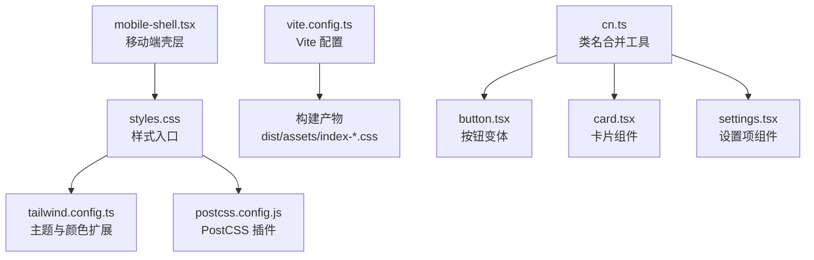
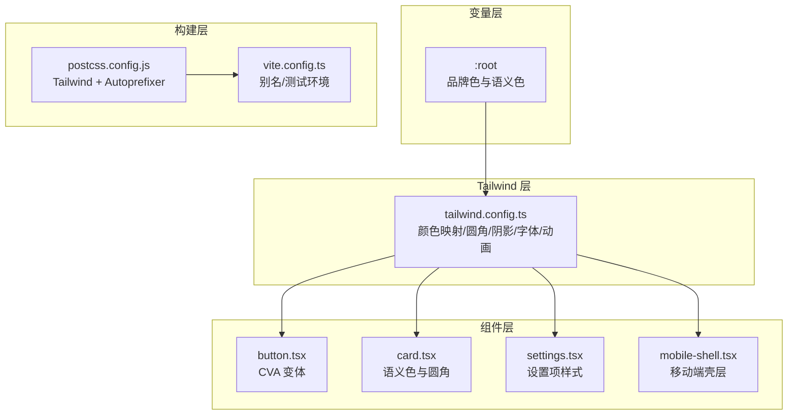
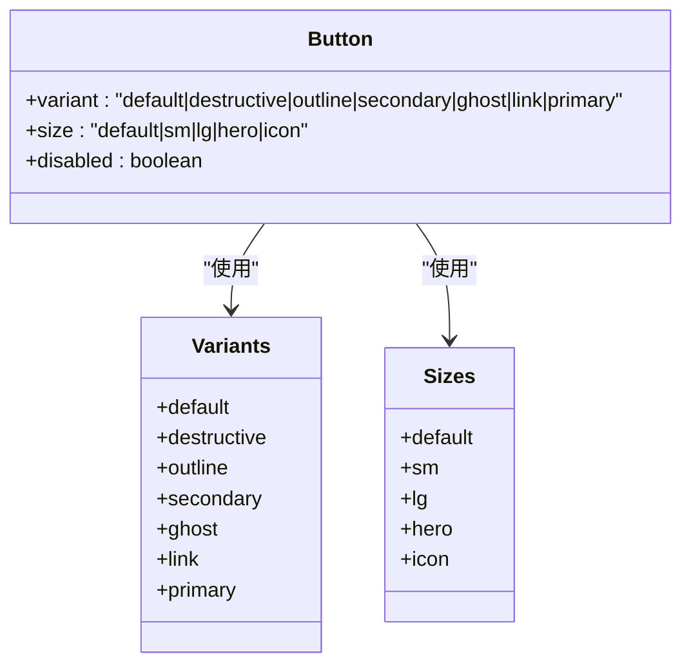
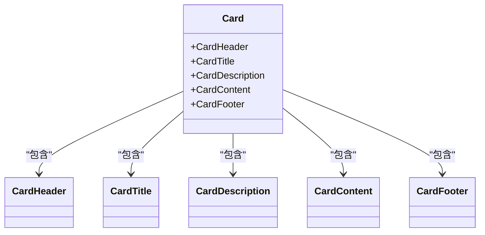
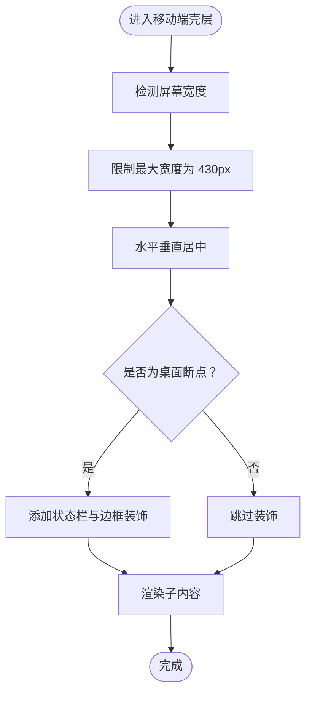
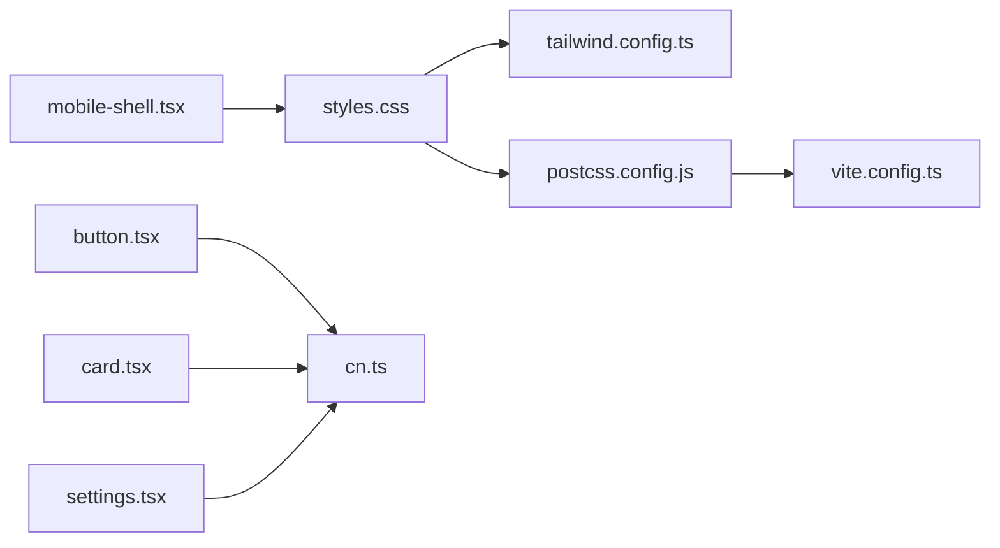

# 样式与主题

<cite>
**本文引用的文件**
- [tailwind.config.ts](file://frontend/tailwind.config.ts)
- [postcss.config.js](file://frontend/postcss.config.js)
- [styles.css](file://frontend/src/app/styles.css)
- [package.json](file://frontend/package.json)
- [vite.config.ts](file://frontend/vite.config.ts)
- [cn.ts](file://frontend/src/shared/lib/cn.ts)
- [button.tsx](file://frontend/src/shared/ui/primitives/button.tsx)
- [card.tsx](file://frontend/src/shared/ui/primitives/card.tsx)
- [settings.tsx](file://frontend/src/shared/ui/settings.tsx)
- [mobile-shell.tsx](file://frontend/src/shared/layouts/mobile-shell.tsx)
</cite>

## 目录
1. [简介](#简介)
2. [项目结构](#项目结构)
3. [核心组件](#核心组件)
4. [架构总览](#架构总览)
5. [详细组件分析](#详细组件分析)
6. [依赖关系分析](#依赖关系分析)
7. [性能考量](#性能考量)
8. [故障排查指南](#故障排查指南)
9. [结论](#结论)
10. [附录](#附录)

## 简介
本文件系统性阐述前端样式与主题体系，覆盖 Tailwind CSS 配置与使用、PostCSS 处理流程、CSS 模块化策略、主题定制与颜色系统、响应式设计、CSS 变量与暗色模式支持、组件样式隔离、样式优化与打包配置以及浏览器兼容性处理。目标是帮助开发者快速理解并高效扩展样式系统。

## 项目结构
前端样式相关的关键文件分布如下：
- 样式入口：styles.css（引入 Tailwind 指令、定义 CSS 变量与基础样式）
- 构建工具链：postcss.config.js（启用 Tailwind 与 Autoprefixer）、vite.config.ts（Vite 配置）
- 主题与原子类：tailwind.config.ts（主题扩展、颜色映射、动画与字体）
- 组件样式：button.tsx、card.tsx、settings.tsx、mobile-shell.tsx 等
- 工具函数：cn.ts（clsx + tailwind-merge 合并类名）

图表来源
- [styles.css:1-170](file://frontend/src/app/styles.css#L1-L170)
- [tailwind.config.ts:1-99](file://frontend/tailwind.config.ts#L1-L99)
- [postcss.config.js:1-7](file://frontend/postcss.config.js#L1-L7)
- [vite.config.ts:1-28](file://frontend/vite.config.ts#L1-L28)
- [cn.ts:1-7](file://frontend/src/shared/lib/cn.ts#L1-L7)
- [button.tsx:1-55](file://frontend/src/shared/ui/primitives/button.tsx#L1-L55)
- [card.tsx:1-56](file://frontend/src/shared/ui/primitives/card.tsx#L1-L56)
- [settings.tsx:1-120](file://frontend/src/shared/ui/settings.tsx#L1-L120)
- [mobile-shell.tsx:1-79](file://frontend/src/shared/layouts/mobile-shell.tsx#L1-L79)

章节来源
- [styles.css:1-170](file://frontend/src/app/styles.css#L1-L170)
- [tailwind.config.ts:1-99](file://frontend/tailwind.config.ts#L1-L99)
- [postcss.config.js:1-7](file://frontend/postcss.config.js#L1-L7)
- [vite.config.ts:1-28](file://frontend/vite.config.ts#L1-L28)

## 核心组件
- 样式入口与变量
  - 在样式入口中定义了品牌色与语义色的 CSS 变量，并通过 Tailwind 的颜色映射桥接到这些变量，确保主题一致性与可替换性。
  - 定义了基础排版、滚动条隐藏、移动端壳层等通用样式。
- 主题与颜色系统
  - Tailwind 配置将品牌色与语义色映射为 CSS 变量，同时扩展圆角半径、阴影、字体族与动画。
  - 使用圆角 card 值与语义色常量，保证组件风格统一。
- 组件样式隔离与变体
  - 通过 class-variance-authority（CVA）为按钮等组件提供变体与尺寸控制；使用 cn 工具进行类名合并与冲突修复。
  - 卡片组件以语义色与圆角常量封装，避免重复样式。
- 移动端适配
  - 移动壳层组件强制宽度上限并在小屏下自适应，结合媒体查询与 CSS 变量实现一致的视觉体验。

章节来源
- [styles.css:1-170](file://frontend/src/app/styles.css#L1-L170)
- [tailwind.config.ts:1-99](file://frontend/tailwind.config.ts#L1-L99)
- [cn.ts:1-7](file://frontend/src/shared/lib/cn.ts#L1-L7)
- [button.tsx:1-55](file://frontend/src/shared/ui/primitives/button.tsx#L1-L55)
- [card.tsx:1-56](file://frontend/src/shared/ui/primitives/card.tsx#L1-L56)
- [mobile-shell.tsx:1-79](file://frontend/src/shared/layouts/mobile-shell.tsx#L1-L79)

## 架构总览
样式系统采用“CSS 变量 + Tailwind 扩展 + PostCSS 处理 + Vite 打包”的分层架构：
- CSS 变量层：集中定义品牌色与语义色，作为主题的唯一真相源。
- Tailwind 层：将变量映射为原子类，扩展圆角、阴影、字体与动画，提供一致的设计令牌。
- 组件层：使用 CVA 与 cn 工具组合出稳定、可维护的组件样式。
- 构建层：PostCSS 自动前缀与 Tailwind 生成最终 CSS；Vite 负责打包与预览。

图表来源
- [styles.css:1-170](file://frontend/src/app/styles.css#L1-L170)
- [tailwind.config.ts:1-99](file://frontend/tailwind.config.ts#L1-L99)
- [postcss.config.js:1-7](file://frontend/postcss.config.js#L1-L7)
- [vite.config.ts:1-28](file://frontend/vite.config.ts#L1-L28)
- [button.tsx:1-55](file://frontend/src/shared/ui/primitives/button.tsx#L1-L55)
- [card.tsx:1-56](file://frontend/src/shared/ui/primitives/card.tsx#L1-L56)
- [settings.tsx:1-120](file://frontend/src/shared/ui/settings.tsx#L1-L120)
- [mobile-shell.tsx:1-79](file://frontend/src/shared/layouts/mobile-shell.tsx#L1-L79)

## 详细组件分析

### 样式入口与 CSS 变量
- 变量定义：在根作用域集中声明品牌色与语义色，形成主题的单一事实来源。
- Tailwind 指令：通过 @tailwind base/components/utilities 引入基础、组件与工具类。
- 基础样式：重置盒模型、设定视口高度、统一字体与颜色基线。
- 移动端壳层：固定宽度与背景，配合媒体查询在小屏下自适应。
- 动画与装饰：定义淡入、滑入等关键帧与噪声纹理等装饰性样式。

章节来源
- [styles.css:1-170](file://frontend/src/app/styles.css#L1-L170)

### Tailwind 配置与主题扩展
- 内容扫描：仅扫描 HTML 与 TS/TSX 文件，减少无关文件的构建开销。
- 颜色映射：将品牌色与语义色映射为 CSS 变量，使原子类与主题变量解耦。
- 圆角与阴影：扩展圆角常量与软阴影，满足卡片与交互元素的视觉需求。
- 字体族：指定展示与正文字体，确保跨平台一致性。
- 动画：定义 Accordion、Fade、Slide 等动画，便于组件状态切换与过渡。

章节来源
- [tailwind.config.ts:1-99](file://frontend/tailwind.config.ts#L1-L99)

### PostCSS 处理流程
- 插件链：先执行 Tailwind 生成所需原子类，再由 Autoprefixer 添加浏览器前缀，确保兼容性。
- 与构建集成：Vite 通过插件加载 PostCSS 配置，无需额外的构建脚本。

章节来源
- [postcss.config.js:1-7](file://frontend/postcss.config.js#L1-L7)
- [vite.config.ts:1-28](file://frontend/vite.config.ts#L1-L28)

### 类名合并工具 cn
- 组合策略：使用 clsx 进行条件类名拼接，使用 tailwind-merge 解决冲突，避免重复或覆盖问题。
- 应用范围：贯穿所有组件，确保样式叠加与变体组合的稳定性。

章节来源
- [cn.ts:1-7](file://frontend/src/shared/lib/cn.ts#L1-L7)

### 按钮组件与变体系统
- 变体与尺寸：通过 CVA 定义默认、破坏性、描边、次级、Ghost、链接与业务主色等变体，以及默认、小、大、超大、图标等尺寸。
- 语义色绑定：变体与尺寸均基于 Tailwind 语义色与圆角常量，保持全局一致性。
- 可访问性：内置焦点环与禁用态处理，提升可用性。

图表来源
- [button.tsx:1-55](file://frontend/src/shared/ui/primitives/button.tsx#L1-L55)

章节来源
- [button.tsx:1-55](file://frontend/src/shared/ui/primitives/button.tsx#L1-L55)

### 卡片组件与语义色
- 结构：卡片容器、头部、标题、描述、内容与底部，均使用语义色与圆角常量。
- 风格：统一的阴影与背景，适合信息区块与对话气泡等场景。

图表来源
- [card.tsx:1-56](file://frontend/src/shared/ui/primitives/card.tsx#L1-L56)

章节来源
- [card.tsx:1-56](file://frontend/src/shared/ui/primitives/card.tsx#L1-L56)

### 设置项组件与交互样式
- 设计：设置组容器与设置行，支持图标、标题、描述、尾部操作与边框、对齐方式等属性。
- 交互：悬停态与可点击态，提升可发现性与反馈。

章节来源
- [settings.tsx:1-120](file://frontend/src/shared/ui/settings.tsx#L1-L120)

### 移动端壳层与响应式
- 强制宽度：最大宽度限制在 430px，居中显示，适配移动端。
- 状态栏模拟：在桌面断点下模拟状态栏、WiFi 与电量图标。
- 视口与滚动：使用动态视口单位与隐藏滚动条，优化移动端体验。

图表来源
- [mobile-shell.tsx:1-79](file://frontend/src/shared/layouts/mobile-shell.tsx#L1-L79)

章节来源
- [mobile-shell.tsx:1-79](file://frontend/src/shared/layouts/mobile-shell.tsx#L1-L79)

## 依赖关系分析
- 样式入口依赖 Tailwind 主题配置与 PostCSS 插件链。
- 组件依赖 cn 工具与 Tailwind 语义色常量。
- 构建依赖 Vite 与 PostCSS 配置，确保 CSS 生成与打包。

图表来源
- [styles.css:1-170](file://frontend/src/app/styles.css#L1-L170)
- [tailwind.config.ts:1-99](file://frontend/tailwind.config.ts#L1-L99)
- [postcss.config.js:1-7](file://frontend/postcss.config.js#L1-L7)
- [vite.config.ts:1-28](file://frontend/vite.config.ts#L1-L28)
- [cn.ts:1-7](file://frontend/src/shared/lib/cn.ts#L1-L7)
- [button.tsx:1-55](file://frontend/src/shared/ui/primitives/button.tsx#L1-L55)
- [card.tsx:1-56](file://frontend/src/shared/ui/primitives/card.tsx#L1-L56)
- [settings.tsx:1-120](file://frontend/src/shared/ui/settings.tsx#L1-L120)
- [mobile-shell.tsx:1-79](file://frontend/src/shared/layouts/mobile-shell.tsx#L1-L79)

章节来源
- [package.json:1-52](file://frontend/package.json#L1-L52)

## 性能考量
- 构建体积
  - Tailwind 内容扫描限定在 HTML 与 TS/TSX，避免扫描无用资源，降低构建体积。
  - 使用 Autoprefixer 仅添加必要前缀，减少冗余。
- 运行时性能
  - cn 工具在运行时合并类名，建议在组件外部缓存不变的类名组合，减少重复计算。
  - 尽量复用语义色与圆角常量，避免内联硬编码值导致的样式碎片化。
- 打包与缓存
  - Vite 默认开启静态资源优化与持久化缓存，建议启用长缓存策略与资源压缩。
- 浏览器兼容性
  - Autoprefixer 自动处理前缀，建议在 package.json 中明确目标浏览器范围，以最小化前缀数量。

章节来源
- [tailwind.config.ts:1-99](file://frontend/tailwind.config.ts#L1-L99)
- [postcss.config.js:1-7](file://frontend/postcss.config.js#L1-L7)
- [vite.config.ts:1-28](file://frontend/vite.config.ts#L1-L28)
- [package.json:1-52](file://frontend/package.json#L1-L52)

## 故障排查指南
- 样式未生效
  - 检查 Tailwind 是否正确引入指令与变量，确认样式入口文件被构建。
  - 确认 tailwind.config.ts 的 content 路径包含当前组件文件。
- 类名冲突
  - 使用 cn 工具合并类名，避免重复或顺序错误导致的覆盖。
- 动画不生效
  - 检查 keyframes 与 animation 名称是否一致，确认 Tailwind 动画扩展已启用。
- 移动端显示异常
  - 检查媒体查询与最大宽度限制，确认断点与设备宽度匹配。
- 构建报错
  - 确认 PostCSS 插件安装与版本兼容，检查 Vite 插件链顺序。

章节来源
- [styles.css:1-170](file://frontend/src/app/styles.css#L1-L170)
- [tailwind.config.ts:1-99](file://frontend/tailwind.config.ts#L1-L99)
- [postcss.config.js:1-7](file://frontend/postcss.config.js#L1-L7)
- [cn.ts:1-7](file://frontend/src/shared/lib/cn.ts#L1-L7)

## 结论
该样式与主题体系通过 CSS 变量与 Tailwind 扩展实现了高内聚、低耦合的主题管理；借助 PostCSS 与 Vite 实现了高效的构建与良好的浏览器兼容性；组件层通过 CVA 与 cn 工具保障了样式的一致性与可维护性。遵循本文的最佳实践，可在不破坏整体风格的前提下快速扩展主题与组件。

## 附录
- 主题扩展建议
  - 新增品牌色时，同步在 :root 与 tailwind.config.ts 中注册，避免遗漏。
  - 使用语义色常量而非硬编码值，确保组件间风格一致。
- 最佳实践清单
  - 统一使用 cn 合并类名，避免重复与冲突。
  - 优先使用 Tailwind 语义色与扩展常量，减少自定义样式。
  - 在组件内部封装样式细节，对外暴露清晰的 props 与变体。
  - 对关键动画与过渡使用统一命名与时序，提升交互一致性。
- 浏览器兼容性
  - 明确目标浏览器范围，利用 Autoprefixer 自动生成必要前缀。
  - 避免使用过时或实验性特性，确保在主流浏览器稳定运行。