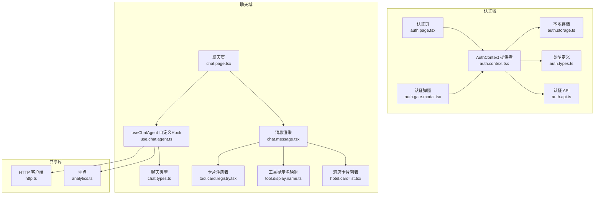
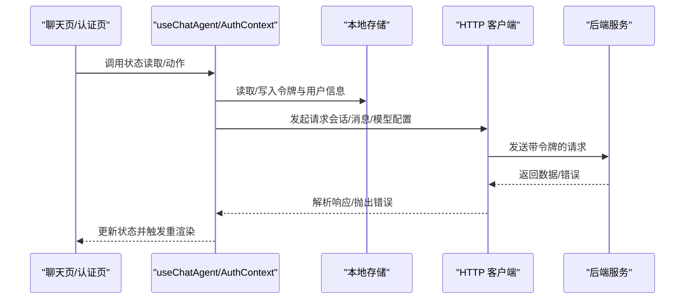
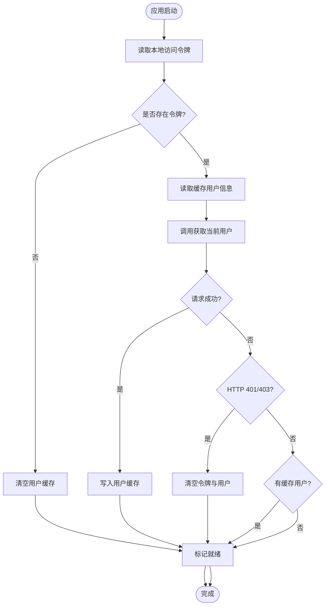
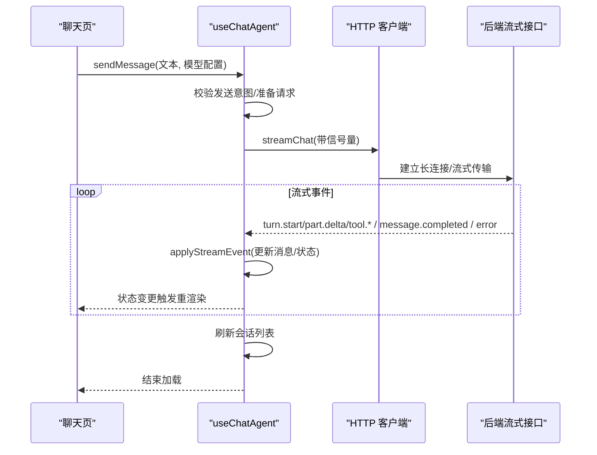
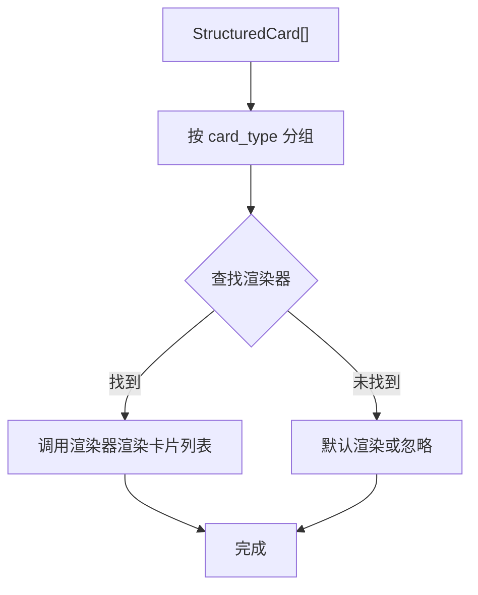
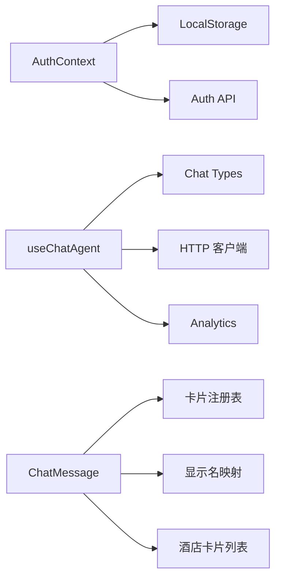

# 状态管理

<cite>
**本文引用的文件**
- [auth.context.tsx](file://frontend/src/features/auth/model/auth.context.tsx)
- [auth.storage.ts](file://frontend/src/features/auth/model/auth.storage.ts)
- [auth.types.ts](file://frontend/src/features/auth/model/auth.types.ts)
- [auth.api.ts](file://frontend/src/features/auth/api/auth.api.ts)
- [auth.page.tsx](file://frontend/src/features/auth/ui/auth-page.tsx)
- [auth.gate.modal.tsx](file://frontend/src/features/auth/ui/auth-gate-modal.tsx)
- [use.chat.agent.ts](file://frontend/src/features/chat/hooks/use-chat-agent.ts)
- [chat.types.ts](file://frontend/src/features/chat/model/chat.types.ts)
- [tool.card.registry.tsx](file://frontend/src/features/chat/model/tool-card-registry.tsx)
- [tool.display.name.ts](file://frontend/src/features/chat/model/tool-display-name.ts)
- [chat.message.tsx](file://frontend/src/features/chat/ui/chat-message.tsx)
- [chat.page.tsx](file://frontend/src/features/chat/ui/chat-page.tsx)
- [hotel.card.list.tsx](file://frontend/src/features/chat/ui/hotel-card-list.tsx)
- [http.ts](file://frontend/src/shared/lib/http.ts)
- [analytics.ts](file://frontend/src/shared/lib/analytics.ts)
</cite>

## 目录
1. [简介](#简介)
2. [项目结构](#项目结构)
3. [核心组件](#核心组件)
4. [架构总览](#架构总览)
5. [详细组件分析](#详细组件分析)
6. [依赖关系分析](#依赖关系分析)
7. [性能考量](#性能考量)
8. [故障排查指南](#故障排查指南)
9. [结论](#结论)
10. [附录](#附录)

## 简介
本文件系统性梳理前端应用的状态管理模式，覆盖 React Hooks、Context API 与自定义 Hook 的使用方式，重点阐述三类状态管理场景：
- 认证状态管理：登录态、用户信息、鉴权弹窗、登录态刷新与持久化。
- 聊天状态管理：消息流式渲染、会话列表与打开、模型配置切换、版本回溯与反馈、语音播放控制。
- 工具卡片注册与渲染：卡片类型分组、渲染器注册与适配、显示名称映射。

同时解释状态更新机制、副作用处理、性能优化策略，以及状态持久化、状态同步与错误恢复机制，并给出最佳实践与常见问题解决方案。

## 项目结构
前端采用“特性域”划分，认证与聊天两大领域分别包含：
- 模型层（model）：状态结构、类型定义、存储与注册表。
- 钩子层（hooks）：封装复杂状态逻辑与副作用。
- UI 层（ui）：视图组件与交互。
- API 层（api）：与后端通信的接口封装。
- 共享库（shared）：通用工具，如 HTTP、埋点等。

图表来源
- [auth.context.tsx:43-146](file://frontend/src/features/auth/model/auth.context.tsx#L43-L146)
- [auth.storage.ts:1-87](file://frontend/src/features/auth/model/auth.storage.ts#L1-L87)
- [auth.types.ts:1-36](file://frontend/src/features/auth/model/auth.types.ts#L1-L36)
- [auth.api.ts](file://frontend/src/features/auth/api/auth.api.ts)
- [auth.page.tsx:1-233](file://frontend/src/features/auth/ui/auth-page.tsx#L1-L233)
- [auth.gate.modal.tsx:1-66](file://frontend/src/features/auth/ui/auth-gate-modal.tsx#L1-L66)
- [use.chat.agent.ts:125-595](file://frontend/src/features/chat/hooks/use-chat-agent.ts#L125-L595)
- [chat.types.ts:1-226](file://frontend/src/features/chat/model/chat.types.ts#L1-L226)
- [tool.card.registry.tsx:1-99](file://frontend/src/features/chat/model/tool-card-registry.tsx#L1-L99)
- [tool.display.name.ts:1-72](file://frontend/src/features/chat/model/tool-display-name.ts#L1-L72)
- [chat.message.tsx:1-679](file://frontend/src/features/chat/ui/chat-message.tsx#L1-L679)
- [chat.page.tsx:1-741](file://frontend/src/features/chat/ui/chat-page.tsx#L1-L741)
- [hotel.card.list.tsx:1-198](file://frontend/src/features/chat/ui/hotel-card-list.tsx#L1-L198)
- [http.ts:1-75](file://frontend/src/shared/lib/http.ts#L1-L75)
- [analytics.ts:1-57](file://frontend/src/shared/lib/analytics.ts#L1-L57)

章节来源
- [auth.context.tsx:1-155](file://frontend/src/features/auth/model/auth.context.tsx#L1-L155)
- [use.chat.agent.ts:1-596](file://frontend/src/features/chat/hooks/use-chat-agent.ts#L1-L596)
- [chat.types.ts:1-226](file://frontend/src/features/chat/model/chat.types.ts#L1-L226)

## 核心组件
- 认证上下文与存储
  - 使用 Context API 暴露认证状态与方法，结合本地存储实现持久化与刷新。
  - 关键状态：用户、是否已就绪、鉴权弹窗状态。
  - 关键方法：登录、登出、刷新、打开/关闭鉴权弹窗。
- 聊天自定义 Hook
  - 封装消息流式事件处理、会话列表与打开、模型配置切换、版本回溯与反馈、语音播放控制、停止生成与重试。
  - 关键状态：线程 ID、消息列表、会话列表、模型配置、加载与错误状态。
- 工具卡片注册与渲染
  - 注册表将 card_type 映射到渲染器，按类型分组批量渲染。
  - 工具显示名映射支持本地工具与 MCP 服务器工具的本地化展示。

章节来源
- [auth.context.tsx:29-146](file://frontend/src/features/auth/model/auth.context.tsx#L29-L146)
- [auth.storage.ts:1-87](file://frontend/src/features/auth/model/auth.storage.ts#L1-L87)
- [use.chat.agent.ts:125-595](file://frontend/src/features/chat/hooks/use-chat-agent.ts#L125-L595)
- [tool.card.registry.tsx:60-99](file://frontend/src/features/chat/model/tool-card-registry.tsx#L60-L99)
- [tool.display.name.ts:51-72](file://frontend/src/features/chat/model/tool-display-name.ts#L51-L72)

## 架构总览
认证与聊天状态通过 Context Provider 向下传递，UI 组件通过自定义 Hook 获取状态与动作。HTTP 客户端负责网络请求与错误包装，埋点模块统一上报事件。

图表来源
- [auth.context.tsx:81-124](file://frontend/src/features/auth/model/auth.context.tsx#L81-L124)
- [use.chat.agent.ts:396-458](file://frontend/src/features/chat/hooks/use-chat-agent.ts#L396-L458)
- [http.ts:20-65](file://frontend/src/shared/lib/http.ts#L20-L65)

## 详细组件分析

### 认证状态管理
- 状态结构
  - 用户信息、是否认证、是否就绪、鉴权弹窗状态（打开、跳转地址、初始模式）。
- 生命周期与刷新
  - 应用启动时读取本地令牌，若存在则尝试拉取用户信息；若 401/403 则清空缓存并置空用户。
  - 登录成功后写入令牌与用户信息，触发就绪与弹窗关闭。
- 弹窗与路由
  - 打开鉴权弹窗时可设置跳转目标与初始模式；认证页根据路由状态决定步骤与文案。
- 存储策略
  - 令牌与用户信息分别持久化；待处理消息通过 sessionStorage 临时透传。

图表来源
- [auth.context.tsx:81-124](file://frontend/src/features/auth/model/auth.context.tsx#L81-L124)
- [auth.storage.ts:28-60](file://frontend/src/features/auth/model/auth.storage.ts#L28-L60)

章节来源
- [auth.context.tsx:43-146](file://frontend/src/features/auth/model/auth.context.tsx#L43-L146)
- [auth.storage.ts:1-87](file://frontend/src/features/auth/model/auth.storage.ts#L1-L87)
- [auth.page.tsx:13-233](file://frontend/src/features/auth/ui/auth-page.tsx#L13-L233)
- [auth.gate.modal.tsx:13-66](file://frontend/src/features/auth/ui/auth-gate-modal.tsx#L13-L66)

### 聊天状态管理
- 线程与消息
  - 线程 ID 由 Hook 创建或从路由读取；消息列表按流式事件增量更新，支持文本增量、工具块插入与最终完成。
- 会话管理
  - 列出会话、打开指定会话、重命名、删除；非持久化线程在打开时拉取历史。
- 模型配置
  - 列出可用模型配置，支持切换当前配置；持久化线程在切换时同步至后端。
- 版本与反馈
  - 支持对助手回复的不同版本进行切换、评价反馈；失败时回退到持久化版本。
- 语音播放
  - 按消息与版本组合生成唯一键，播放完成后清理；409 冲突时自动刷新当前线程。
- 流式事件处理
  - turn.start：创建/替换助手消息与用户消息；part.delta：文本增量合并；tool.start/done：工具块插入与状态更新；message.completed：最终完成；error：错误上报与降级。

图表来源
- [use.chat.agent.ts:396-458](file://frontend/src/features/chat/hooks/use-chat-agent.ts#L396-L458)
- [use.chat.agent.ts:288-382](file://frontend/src/features/chat/hooks/use-chat-agent.ts#L288-L382)
- [chat.types.ts:84-130](file://frontend/src/features/chat/model/chat.types.ts#L84-L130)

章节来源
- [use.chat.agent.ts:125-595](file://frontend/src/features/chat/hooks/use-chat-agent.ts#L125-L595)
- [chat.types.ts:134-226](file://frontend/src/features/chat/model/chat.types.ts#L134-L226)
- [chat.page.tsx:148-741](file://frontend/src/features/chat/ui/chat-page.tsx#L148-L741)

### 工具卡片注册与渲染
- 注册表
  - 以 card_type 为键，映射到列表型渲染器；未注册时返回 null，调用方按未知类型处理。
  - 提供按类型分组的工具函数，便于一次渲染一组同类卡片。
- 适配器
  - 将后端结构化卡片数据适配为具体渲染器的 items 形状。
- 显示名映射
  - 本地工具与 MCP 服务器工具均提供本地化显示名，未知名称回退为格式化名称。
- 渲染流程
  - 工具组完成后渲染对应类型的卡片列表；酒店卡片列表支持图片懒加载与错误兜底。

图表来源
- [tool.card.registry.tsx:84-99](file://frontend/src/features/chat/model/tool-card-registry.tsx#L84-L99)
- [tool.card.registry.tsx:75-77](file://frontend/src/features/chat/model/tool-card-registry.tsx#L75-L77)
- [tool.display.name.ts:51-72](file://frontend/src/features/chat/model/tool.display.name.ts#L51-L72)
- [chat.message.tsx:426-470](file://frontend/src/features/chat/ui/chat-message.tsx#L426-L470)

章节来源
- [tool.card.registry.tsx:1-99](file://frontend/src/features/chat/model/tool-card-registry.tsx#L1-L99)
- [tool.display.name.ts:1-72](file://frontend/src/features/chat/model/tool-display-name.ts#L1-L72)
- [chat.message.tsx:426-470](file://frontend/src/features/chat/ui/chat-message.tsx#L426-L470)
- [hotel.card.list.tsx:180-198](file://frontend/src/features/chat/ui/hotel.card.list.tsx#L180-L198)

## 依赖关系分析
- 认证域
  - AuthContext 依赖本地存储与 HTTP 客户端；认证页与弹窗依赖上下文提供的动作。
- 聊天域
  - useChatAgent 依赖认证上下文、HTTP 客户端、埋点模块；消息渲染依赖卡片注册表与显示名映射。
- 共享库
  - HTTP 客户端统一注入令牌头并包装错误；埋点模块统一封装初始化与事件上报。

图表来源
- [auth.context.tsx:1-155](file://frontend/src/features/auth/model/auth.context.tsx#L1-L155)
- [use.chat.agent.ts:1-596](file://frontend/src/features/chat/hooks/use-chat-agent.ts#L1-L596)
- [chat.message.tsx:1-679](file://frontend/src/features/chat/ui/chat-message.tsx#L1-L679)
- [http.ts:1-75](file://frontend/src/shared/lib/http.ts#L1-L75)
- [analytics.ts:1-57](file://frontend/src/shared/lib/analytics.ts#L1-L57)

章节来源
- [auth.context.tsx:1-155](file://frontend/src/features/auth/model/auth.context.tsx#L1-L155)
- [use.chat.agent.ts:1-596](file://frontend/src/features/chat/hooks/use-chat-agent.ts#L1-L596)
- [chat.message.tsx:1-679](file://frontend/src/features/chat/ui/chat-message.tsx#L1-L679)

## 性能考量
- 状态粒度与更新频率
  - 使用局部状态与 useMemo 缓存派生值，减少不必要的重渲染。
  - 流式事件中仅更新受影响的消息项，避免全量替换。
- 事件处理与并发
  - 使用 AbortController 控制请求中断，防止竞态与过期更新。
  - 通过引用持有当前线程 ID 与活跃消息 ID，确保事件回调与当前上下文一致。
- 渲染优化
  - 工具卡片按类型分组渲染，避免重复计算；酒店卡片列表横向滚动，降低纵向占用。
- 存储与网络
  - 令牌与用户信息本地持久化，减少重复登录成本；HTTP 客户端统一注入令牌头，避免重复设置。

章节来源
- [use.chat.agent.ts:142-156](file://frontend/src/features/chat/hooks/use-chat-agent.ts#L142-L156)
- [use.chat.agent.ts:400-458](file://frontend/src/features/chat/hooks/use-chat-agent.ts#L400-L458)
- [chat.message.tsx:426-470](file://frontend/src/features/chat/ui/chat-message.tsx#L426-L470)

## 故障排查指南
- 认证相关
  - 401/403：自动清空本地令牌与用户信息，回到未认证状态；检查后端令牌有效性与权限。
  - 本地存储异常：JSON 解析失败会清理对应键；检查存储格式与浏览器兼容性。
- 聊天相关
  - 流式错误：捕获 error 事件并降级显示；必要时回退到持久化版本。
  - 语音播放 409：自动刷新当前线程后重试。
  - 请求中断：AbortError 时将进行状态清理与提示。
- 网络与错误包装
  - HTTP 客户端统一包装错误，包含状态码与可选数据；UI 层根据错误类型展示不同提示。

章节来源
- [auth.context.tsx:95-110](file://frontend/src/features/auth/model/auth.context.tsx#L95-L110)
- [auth.storage.ts:38-43](file://frontend/src/features/auth/model/auth.storage.ts#L38-L43)
- [use.chat.agent.ts:436-457](file://frontend/src/features/chat/hooks/use-chat-agent.ts#L436-L457)
- [use.chat.agent.ts:358-381](file://frontend/src/features/chat/hooks/use-chat-agent.ts#L358-L381)
- [chat.page.tsx:363-369](file://frontend/src/features/chat/ui/chat-page.tsx#L363-L369)
- [http.ts:8-18](file://frontend/src/shared/lib/http.ts#L8-L18)

## 结论
该前端状态管理以 Context API 为核心，结合自定义 Hook 将复杂业务状态与副作用封装，形成清晰的认证与聊天状态流。通过本地存储与 HTTP 客户端的协作实现状态持久化与同步，借助卡片注册表与显示名映射实现工具卡片的可扩展渲染。整体设计在保证可维护性的同时兼顾性能与用户体验。

## 附录
- 最佳实践
  - 将副作用集中在自定义 Hook 中，UI 保持纯函数式。
  - 使用 useMemo/useCallback 缓存派生状态与回调，避免重复渲染。
  - 对流式事件与并发请求使用 AbortController 与引用持有，确保一致性。
  - 错误处理统一包装并在 UI 层分级提示。
- 常见问题
  - 登录后仍显示未认证：检查本地存储写入与刷新逻辑。
  - 消息流式渲染卡顿：检查事件处理与局部更新策略。
  - 工具卡片不显示：确认 card_type 是否已在注册表中注册。