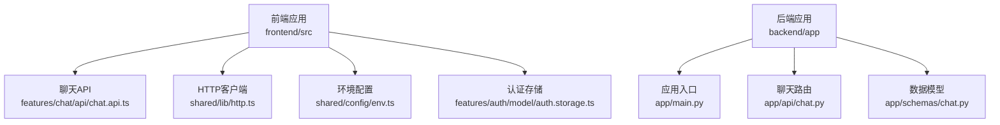
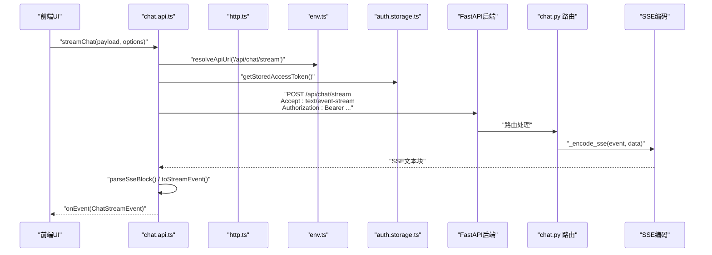
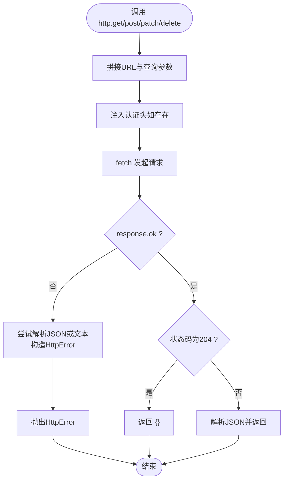
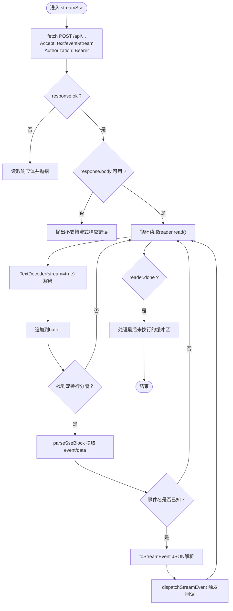
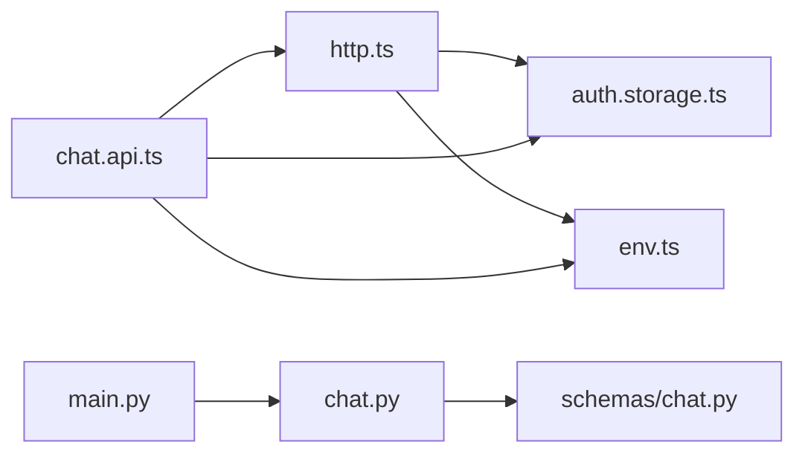

# API集成

<cite>
**本文引用的文件**
- [chat.api.ts](file://frontend/src/features/chat/api/chat.api.ts)
- [http.ts](file://frontend/src/shared/lib/http.ts)
- [chat.types.ts](file://frontend/src/features/chat/model/chat.types.ts)
- [env.ts](file://frontend/src/shared/config/env.ts)
- [auth.storage.ts](file://frontend/src/features/auth/model/auth.storage.ts)
- [chat.py](file://backend/app/api/chat.py)
- [chat.py（后端模型）](file://backend/app/schemas/chat.py)
- [main.py](file://backend/app/main.py)
- [pyproject.toml](file://backend/pyproject.toml)
</cite>

## 目录
1. [简介](#简介)
2. [项目结构](#项目结构)
3. [核心组件](#核心组件)
4. [架构总览](#架构总览)
5. [详细组件分析](#详细组件分析)
6. [依赖分析](#依赖分析)
7. [性能考虑](#性能考虑)
8. [故障排查指南](#故障排查指南)
9. [结论](#结论)
10. [附录](#附录)

## 简介
本文件面向前端与后端工程师，系统性梳理聊天API集成方案，重点覆盖以下方面：
- 前端HTTP客户端封装与请求/响应拦截
- SSE流式连接建立、事件监听与数据解析
- 错误处理机制、重连策略与超时控制建议
- 认证头管理、请求拦截与响应拦截器实现
- API调用示例、错误处理模式与性能监控方案

## 项目结构
前端采用“功能域 + 分层”的组织方式，聊天API位于 features/chat/api；通用HTTP客户端位于 shared/lib；环境变量解析位于 shared/config；认证令牌存储位于 features/auth/model。

图表来源
- [chat.api.ts:1-252](file://frontend/src/features/chat/api/chat.api.ts#L1-L252)
- [http.ts:1-75](file://frontend/src/shared/lib/http.ts#L1-L75)
- [env.ts:1-48](file://frontend/src/shared/config/env.ts#L1-L48)
- [auth.storage.ts:1-87](file://frontend/src/features/auth/model/auth.storage.ts#L1-L87)
- [chat.py:1-72](file://backend/app/api/chat.py#L1-L72)
- [chat.py（后端模型）:1-274](file://backend/app/schemas/chat.py#L1-L274)
- [main.py:1-54](file://backend/app/main.py#L1-L54)

章节来源
- [chat.api.ts:1-252](file://frontend/src/features/chat/api/chat.api.ts#L1-L252)
- [http.ts:1-75](file://frontend/src/shared/lib/http.ts#L1-L75)
- [env.ts:1-48](file://frontend/src/shared/config/env.ts#L1-L48)
- [auth.storage.ts:1-87](file://frontend/src/features/auth/model/auth.storage.ts#L1-L87)
- [chat.py:1-72](file://backend/app/api/chat.py#L1-L72)
- [chat.py（后端模型）:1-274](file://backend/app/schemas/chat.py#L1-L274)
- [main.py:1-54](file://backend/app/main.py#L1-L54)

## 核心组件
- 前端HTTP客户端：统一处理URL拼接、查询参数、认证头注入、错误包装与JSON解析。
- 聊天SSE流：封装fetch读取ReadableStream，逐块解析SSE事件，派发到上层回调。
- 数据模型：前后端共享聊天事件、消息、会话等类型定义，确保一致性。
- 后端SSE路由：将LangGraph流事件编码为SSE文本块，设置合适的响应头与异常兜底。

章节来源
- [http.ts:1-75](file://frontend/src/shared/lib/http.ts#L1-L75)
- [chat.api.ts:107-180](file://frontend/src/features/chat/api/chat.api.ts#L107-L180)
- [chat.types.ts:76-130](file://frontend/src/features/chat/model/chat.types.ts#L76-L130)
- [chat.py:41-71](file://backend/app/api/chat.py#L41-L71)
- [chat.py（后端模型）:139-200](file://backend/app/schemas/chat.py#L139-L200)

## 架构总览
下图展示了从前端发起聊天请求到后端LangGraph流式输出的关键交互路径，以及SSE事件的解析与分发。

图表来源
- [chat.api.ts:107-180](file://frontend/src/features/chat/api/chat.api.ts#L107-L180)
- [http.ts:20-65](file://frontend/src/shared/lib/http.ts#L20-L65)
- [env.ts:29-47](file://frontend/src/shared/config/env.ts#L29-L47)
- [auth.storage.ts:7-12](file://frontend/src/features/auth/model/auth.storage.ts#L7-L12)
- [chat.py:41-71](file://backend/app/api/chat.py#L41-L71)

## 详细组件分析

### 前端HTTP客户端与拦截器
- 统一入口：通过http.get/post/patch/delete封装fetch，自动注入Content-Type与认证头。
- 查询参数：支持params对象自动拼接到URL。
- 错误处理：非2xx响应抛出HttpError，包含status与可选data，便于上层统一处理。
- 空响应：204返回空对象，避免上层重复判断。

图表来源
- [http.ts:20-65](file://frontend/src/shared/lib/http.ts#L20-L65)

章节来源
- [http.ts:1-75](file://frontend/src/shared/lib/http.ts#L1-L75)

### SSE流式连接与事件解析
- 连接建立：使用fetch发起POST请求，设置Accept为text/event-stream，并携带Authorization头。
- 流读取：通过ReadableStream.getReader()增量读取字节，TextDecoder解码为字符串。
- 分块解析：按双换行符分割SSE块，提取event与data字段。
- 类型校验：仅接受已知事件名，JSON解析失败则丢弃该块。
- 派发策略：对特定事件（如tool.start）插入微任务等待下一帧绘制，保证UI流畅。

图表来源
- [chat.api.ts:115-180](file://frontend/src/features/chat/api/chat.api.ts#L115-L180)

章节来源
- [chat.api.ts:107-180](file://frontend/src/features/chat/api/chat.api.ts#L107-L180)

### 认证头管理与请求拦截
- 认证头注入：在http.ts与chat.api.ts中均从本地存储读取访问令牌并注入到Authorization头。
- 请求拦截：统一在http.ts中完成，避免在每个API函数中重复逻辑。
- 存储策略：使用localStorage存储访问令牌，支持SSR安全检查。

章节来源
- [http.ts:33-41](file://frontend/src/shared/lib/http.ts#L33-L41)
- [chat.api.ts:116-126](file://frontend/src/features/chat/api/chat.api.ts#L116-L126)
- [auth.storage.ts:7-12](file://frontend/src/features/auth/model/auth.storage.ts#L7-L12)

### 响应拦截与错误处理
- 前端错误：http.ts对非2xx响应统一抛出HttpError，优先使用后端JSON中的message/detail，否则回退到响应体文本。
- 流式错误：chat.api.ts在SSE解析过程中，若事件名未知或JSON解析失败则丢弃该块；后端路由在捕获异常时发送“error”事件，前端收到后可据此更新UI状态。
- 后端兜底：路由层对ValueError与未预期异常分别返回“error”事件，保障客户端稳定性。

章节来源
- [http.ts:45-56](file://frontend/src/shared/lib/http.ts#L45-L56)
- [chat.api.ts:71-86](file://frontend/src/features/chat/api/chat.api.ts#L71-L86)
- [chat.py:55-61](file://backend/app/api/chat.py#L55-L61)

### 数据模型与事件契约
- 前端类型：定义ChatInvokeRequest、ChatStreamEvent、PersistedChatMessage、Session相关等类型，确保与后端一致。
- 后端模型：定义流式事件负载（TurnStartPayload、PartDeltaPayload、ToolPartPayload、MessageCompletedPayload、TurnDonePayload、StreamErrorPayload）与会话/消息结构。
- 兼容性：前后端通过类型保持一致性，减少字段漂移带来的联调成本。

章节来源
- [chat.types.ts:76-130](file://frontend/src/features/chat/model/chat.types.ts#L76-L130)
- [chat.py（后端模型）:139-200](file://backend/app/schemas/chat.py#L139-L200)

### 后端SSE路由与中间件
- 路由：/api/chat/stream以StreamingResponse返回SSE，设置缓存控制与X-Accel-Buffering头。
- 编码：_encode_sse将事件名与数据序列化为SSE文本块。
- 异常：捕获取消与值错误，发送“error”事件；其他异常返回通用错误消息。

章节来源
- [chat.py:41-71](file://backend/app/api/chat.py#L41-L71)

## 依赖分析
- 前端依赖：基于原生fetch与ReadableStream实现SSE；通过shared/lib/http.ts集中处理认证与错误。
- 后端依赖：FastAPI + StreamingResponse；LangGraph流事件经路由编码为SSE。
- CORS：后端在应用入口启用CORS中间件，允许跨域访问。

图表来源
- [http.ts:1-75](file://frontend/src/shared/lib/http.ts#L1-L75)
- [auth.storage.ts:1-87](file://frontend/src/features/auth/model/auth.storage.ts#L1-L87)
- [env.ts:1-48](file://frontend/src/shared/config/env.ts#L1-L48)
- [chat.api.ts:1-252](file://frontend/src/features/chat/api/chat.api.ts#L1-L252)
- [main.py:31-52](file://backend/app/main.py#L31-L52)
- [chat.py:1-72](file://backend/app/api/chat.py#L1-L72)
- [chat.py（后端模型）:1-274](file://backend/app/schemas/chat.py#L1-L274)

章节来源
- [pyproject.toml:6-24](file://backend/pyproject.toml#L6-L24)
- [main.py:38-44](file://backend/app/main.py#L38-L44)

## 性能考虑
- UI渲染优化：在tool.start事件后等待下一帧绘制，降低大块工具输出导致的UI卡顿。
- 流式读取：使用TextDecoder(stream=true)增量解码，避免一次性解码大块数据。
- 错误快速失败：SSE解析阶段遇到未知事件或JSON解析失败立即跳过，减少无效处理。
- 后端头部：设置Cache-Control与X-Accel-Buffering，提升代理/网关下的流式体验。
- 建议：在前端增加超时控制与重试策略（见“故障排查指南”），并在UI层对高频事件进行节流/去抖。

## 故障排查指南
- 无法建立SSE连接
  - 检查后端路由是否正确返回text/event-stream与必要的响应头。
  - 确认前端fetch的Accept头与URL是否正确。
  - 参考：[chat.api.ts:115-135](file://frontend/src/features/chat/api/chat.api.ts#L115-L135)、[chat.py:63-71](file://backend/app/api/chat.py#L63-L71)
- 浏览器不支持ReadableStream
  - 前端在SSE读取前检查response.body可用性，不可用时抛错。
  - 参考：[chat.api.ts:133-135](file://frontend/src/features/chat/api/chat.api.ts#L133-L135)
- 事件解析失败
  - 未知事件名或JSON解析异常会被丢弃；检查后端事件名与负载结构。
  - 参考：[chat.api.ts:47-86](file://frontend/src/features/chat/api/chat.api.ts#L47-L86)
- 认证失败
  - 确认本地存储中存在有效访问令牌，且后端鉴权中间件正常工作。
  - 参考：[auth.storage.ts:7-12](file://frontend/src/features/auth/model/auth.storage.ts#L7-L12)、[http.ts:33-41](file://frontend/src/shared/lib/http.ts#L33-L41)
- 204/空响应
  - 前端对204返回空对象，避免上层重复判断。
  - 参考：[http.ts:59-62](file://frontend/src/shared/lib/http.ts#L59-L62)
- 后端异常
  - 后端捕获异常并发送“error”事件；前端收到后更新UI提示。
  - 参考：[chat.py:55-61](file://backend/app/api/chat.py#L55-L61)

章节来源
- [chat.api.ts:115-180](file://frontend/src/features/chat/api/chat.api.ts#L115-L180)
- [http.ts:45-62](file://frontend/src/shared/lib/http.ts#L45-L62)
- [chat.py:55-61](file://backend/app/api/chat.py#L55-L61)
- [auth.storage.ts:7-12](file://frontend/src/features/auth/model/auth.storage.ts#L7-L12)

## 结论
本方案通过统一的HTTP客户端与SSE流式解析，实现了前后端一致的聊天交互体验。前端负责认证头注入、事件解析与UI派发，后端负责LangGraph流事件编码与异常兜底。建议在生产环境中补充超时与重试策略、性能监控埋点与更细粒度的错误分类，以进一步提升稳定性与可观测性。

## 附录

### API调用示例（步骤说明）
- 发送聊天请求并监听流式事件
  - 步骤：准备ChatInvokeRequest，调用streamChat，传入onEvent回调与AbortSignal（可选）。
  - 参考：[chat.api.ts:107-109](file://frontend/src/features/chat/api/chat.api.ts#L107-L109)
- 获取模型档位列表
  - 步骤：调用listChatModelProfiles，使用http.get。
  - 参考：[chat.api.ts:111-113](file://frontend/src/features/chat/api/chat.api.ts#L111-L113)、[http.ts:67-68](file://frontend/src/shared/lib/http.ts#L67-L68)
- 会话管理
  - 列表：listSessions
  - 详情：getSession
  - 重命名：renameSession
  - 删除：deleteSession
  - 更新模型档位：updateSessionModelProfile
  - 参考：[chat.api.ts:194-218](file://frontend/src/features/chat/api/chat.api.ts#L194-L218)

### 错误处理模式
- 前端统一捕获HttpError，根据status与message决定UI提示与用户引导。
- 流式场景：收到“error”事件时停止渲染并显示错误提示。
- 参考：[http.ts:8-18](file://frontend/src/shared/lib/http.ts#L8-L18)、[chat.api.ts:71-86](file://frontend/src/features/chat/api/chat.api.ts#L71-L86)、[chat.py:55-61](file://backend/app/api/chat.py#L55-L61)

### 性能监控方案（建议）
- 关键指标：首包时间、事件到达延迟、事件吞吐量、错误率。
- 埋点位置：请求发起、SSE连接建立、首个事件、事件派发、错误事件。
- 可视化：结合后端日志与前端埋点，形成端到端链路图。
- 参考：[chat.api.ts:107-180](file://frontend/src/features/chat/api/chat.api.ts#L107-L180)、[chat.py:49-61](file://backend/app/api/chat.py#L49-L61)