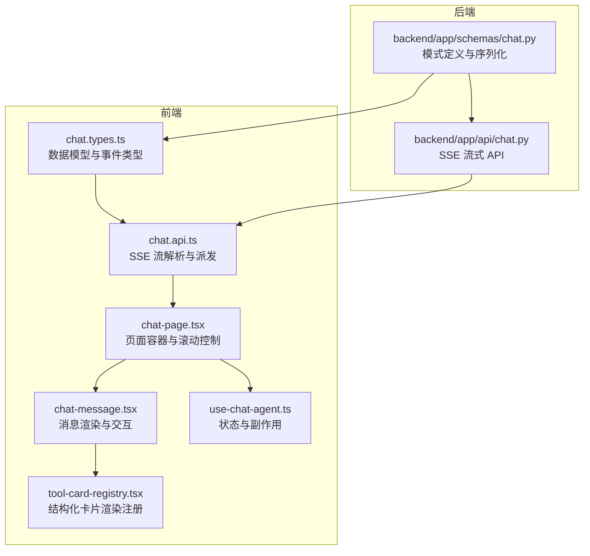
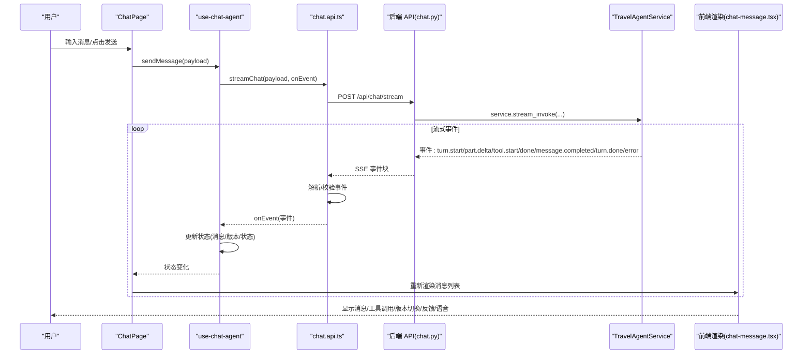
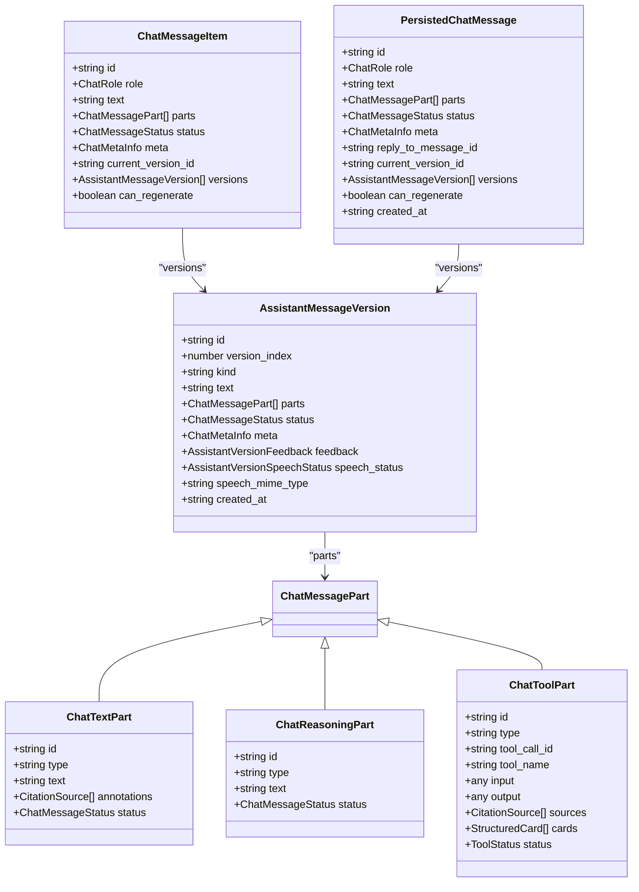
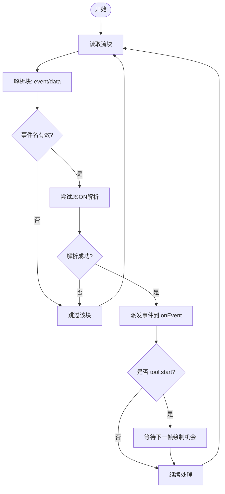
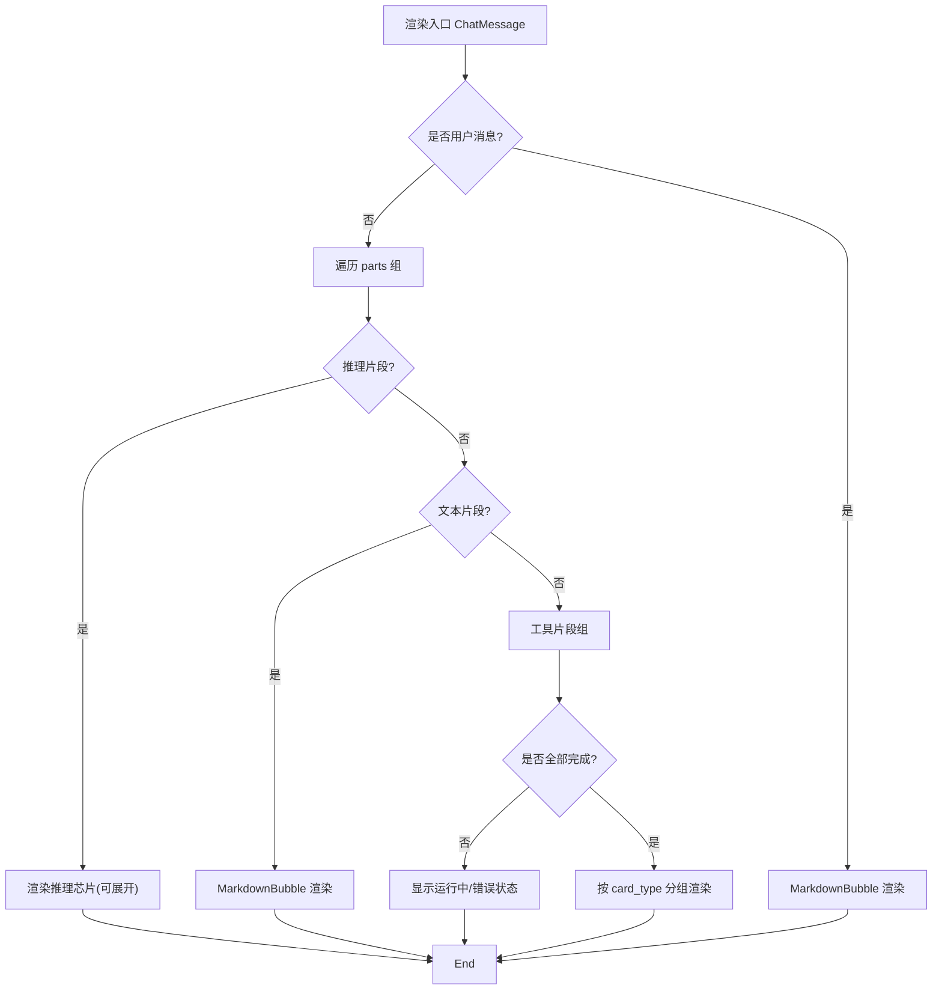
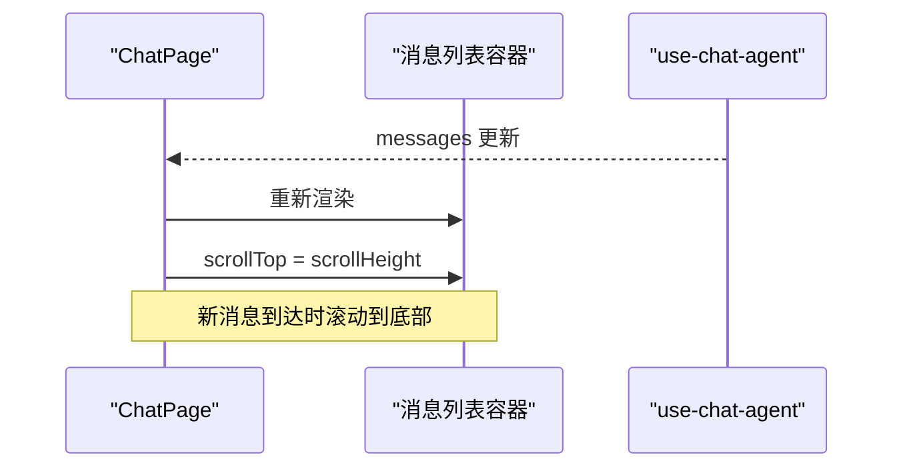
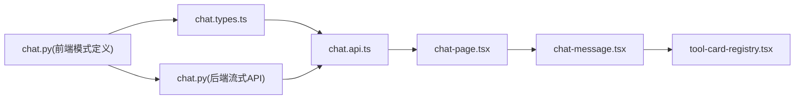

# 消息处理

<cite>
**本文引用的文件**
- [chat.types.ts](file://frontend/src/features/chat/model/chat.types.ts)
- [chat-message.tsx](file://frontend/src/features/chat/ui/chat-message.tsx)
- [chat-page.tsx](file://frontend/src/features/chat/ui/chat-page.tsx)
- [chat.api.ts](file://frontend/src/features/chat/api/chat.api.ts)
- [chat.py（前端模式定义）](file://backend/app/schemas/chat.py)
- [chat.py（后端流式 API）](file://backend/app/api/chat.py)
- [use-chat-agent.ts](file://frontend/src/features/chat/hooks/use-chat-agent.ts)
- [tool-card-registry.tsx](file://frontend/src/features/chat/model/tool-card-registry.tsx)
</cite>

## 目录
1. [简介](#简介)
2. [项目结构](#项目结构)
3. [核心组件](#核心组件)
4. [架构总览](#架构总览)
5. [详细组件分析](#详细组件分析)
6. [依赖关系分析](#依赖关系分析)
7. [性能考量](#性能考量)
8. [故障排查指南](#故障排查指南)
9. [结论](#结论)
10. [附录](#附录)

## 简介
本文件围绕“消息处理”主题，系统性梳理前端消息数据模型、状态管理、渲染逻辑与后端流式协议之间的协作关系。重点覆盖：
- 聊天消息的数据模型与状态机
- 不同类型消息（文本、推理、工具调用）的处理策略与格式化规则
- 流式事件的解析与派发、顺序保证与去重机制
- 消息历史管理、滚动控制与虚拟化渲染思路
- 扩展点、自定义消息类型与渲染器实现指南

## 项目结构
消息处理涉及前后端协同：前端负责渲染、交互与历史管理；后端通过 SSE 将 LangGraph 的原生事件流式传输给前端。

**图示来源**
- [chat.types.ts:1-226](file://frontend/src/features/chat/model/chat.types.ts#L1-L226)
- [chat.api.ts:1-252](file://frontend/src/features/chat/api/chat.api.ts#L1-L252)
- [chat-page.tsx:140-741](file://frontend/src/features/chat/ui/chat-page.tsx#L140-L741)
- [chat-message.tsx:269-679](file://frontend/src/features/chat/ui/chat-message.tsx#L269-L679)
- [use-chat-agent.ts](file://frontend/src/features/chat/hooks/use-chat-agent.ts)
- [tool-card-registry.tsx](file://frontend/src/features/chat/model/tool-card-registry.tsx)
- [chat.py（前端模式定义）:1-274](file://backend/app/schemas/chat.py#L1-L274)
- [chat.py（后端流式 API）:1-72](file://backend/app/api/chat.py#L1-L72)

**章节来源**
- [chat.types.ts:1-226](file://frontend/src/features/chat/model/chat.types.ts#L1-L226)
- [chat.api.ts:1-252](file://frontend/src/features/chat/api/chat.api.ts#L1-L252)
- [chat-page.tsx:140-741](file://frontend/src/features/chat/ui/chat-page.tsx#L140-L741)
- [chat-message.tsx:269-679](file://frontend/src/features/chat/ui/chat-message.tsx#L269-L679)
- [chat.py（前端模式定义）:1-274](file://backend/app/schemas/chat.py#L1-L274)
- [chat.py（后端流式 API）:1-72](file://backend/app/api/chat.py#L1-L72)

## 核心组件
- 数据模型与事件类型
  - 前端统一定义消息角色、状态、版本、引用源、结构化卡片等类型，并描述流式事件结构。
  - 后端模式定义与前端类型保持一致，确保序列化/反序列化正确性。
- 流式事件解析与派发
  - 前端解析 SSE 文本块，识别事件名与数据体，派发到上层状态管理。
- 页面容器与滚动控制
  - 负责消息列表渲染、历史会话管理、滚动到底部、语音播放控制等。
- 消息渲染与交互
  - 用户消息与助手消息差异化渲染；支持 Markdown、引用标注、工具调用折叠、版本切换、反馈、语音播放等。
- 结构化卡片渲染
  - 通过注册表按 card_type 动态渲染不同类型的卡片（如酒店、行程、POI 等）。

**章节来源**
- [chat.types.ts:62-158](file://frontend/src/features/chat/model/chat.types.ts#L62-L158)
- [chat.types.ts:84-130](file://frontend/src/features/chat/model/chat.types.ts#L84-L130)
- [chat.py（前端模式定义）:79-159](file://backend/app/schemas/chat.py#L79-L159)
- [chat.py（前端模式定义）:169-200](file://backend/app/schemas/chat.py#L169-L200)
- [chat.api.ts:47-105](file://frontend/src/features/chat/api/chat.api.ts#L47-L105)
- [chat-page.tsx:198-204](file://frontend/src/features/chat/ui/chat-page.tsx#L198-L204)
- [chat-message.tsx:375-476](file://frontend/src/features/chat/ui/chat-message.tsx#L375-L476)
- [tool-card-registry.tsx](file://frontend/src/features/chat/model/tool-card-registry.tsx)

## 架构总览
下图展示了从用户发送消息到消息渲染与交互的完整链路，以及后端以 SSE 形式推送事件的流程。

**图示来源**
- [chat-page.tsx:634-644](file://frontend/src/features/chat/ui/chat-page.tsx#L634-L644)
- [chat.api.ts:107-180](file://frontend/src/features/chat/api/chat.api.ts#L107-L180)
- [chat.py（后端流式 API）:41-71](file://backend/app/api/chat.py#L41-L71)
- [chat-message.tsx:269-679](file://frontend/src/features/chat/ui/chat-message.tsx#L269-L679)

## 详细组件分析

### 数据模型与状态管理
- 角色与状态
  - 角色：用户/助手
  - 状态：流式中、已完成、已停止、失败
  - 版本：最多保留 N 个版本，支持向前/向后切换
- 消息体结构
  - 文本片段：包含文本与引用标注
  - 推理片段：可展开查看思考过程
  - 工具片段：运行中/成功/错误，支持入参与结果展示
- 事件类型
  - turn.start：回合开始，分配稳定的消息身份
  - part.delta：文本/推理增量
  - tool.start/done：工具调用生命周期
  - message.completed：消息完成，进入稳定展示态
  - turn.done：回合结束
  - error：错误事件

**图示来源**
- [chat.types.ts:134-158](file://frontend/src/features/chat/model/chat.types.ts#L134-L158)
- [chat.types.ts:62-74](file://frontend/src/features/chat/model/chat.types.ts#L62-L74)
- [chat.types.ts:36-60](file://frontend/src/features/chat/model/chat.types.ts#L36-L60)
- [chat.py（前端模式定义）:145-159](file://backend/app/schemas/chat.py#L145-L159)
- [chat.py（前端模式定义）:116-130](file://backend/app/schemas/chat.py#L116-L130)
- [chat.py（前端模式定义）:79-110](file://backend/app/schemas/chat.py#L79-L110)

**章节来源**
- [chat.types.ts:8-158](file://frontend/src/features/chat/model/chat.types.ts#L8-L158)
- [chat.py（前端模式定义）:79-159](file://backend/app/schemas/chat.py#L79-L159)

### 流式事件解析与派发
- SSE 块解析
  - 逐行解析 event 与 data 字段，拼接多行数据
- 事件过滤与校验
  - 仅接受已知事件名，JSON 反序列化失败则丢弃
- 事件派发节奏
  - 对 tool.start 事件等待下一帧绘制机会，避免阻塞 UI
- 错误处理
  - 非 2xx 响应抛出异常；SSE 流中断时清理资源

**图示来源**
- [chat.api.ts:47-105](file://frontend/src/features/chat/api/chat.api.ts#L47-L105)
- [chat.api.ts:115-180](file://frontend/src/features/chat/api/chat.api.ts#L115-L180)

**章节来源**
- [chat.api.ts:47-105](file://frontend/src/features/chat/api/chat.api.ts#L47-L105)
- [chat.api.ts:115-180](file://frontend/src/features/chat/api/chat.api.ts#L115-L180)

### 渲染逻辑与交互
- 用户消息
  - 使用 Markdown 渲染，支持表格、代码块、链接等
- 助手消息
  - 文本片段：Markdown 渲染，支持引用标注替换为上标链接
  - 推理片段：可展开查看完整思考过程
  - 工具片段：按组折叠，运行中/成功/错误状态可视化；完成后渲染结构化卡片
- 版本管理
  - 最多保留 N 个版本，支持左右切换与重新生成
- 反馈与语音
  - 点赞/点踩反馈；语音播放/停止
- 复制消息
  - 成功复制提示，自动回收

**图示来源**
- [chat-message.tsx:375-476](file://frontend/src/features/chat/ui/chat-message.tsx#L375-L476)
- [chat-message.tsx:71-102](file://frontend/src/features/chat/ui/chat-message.tsx#L71-L102)
- [chat-message.tsx:226-267](file://frontend/src/features/chat/ui/chat-message.tsx#L226-L267)
- [tool-card-registry.tsx](file://frontend/src/features/chat/model/tool-card-registry.tsx)

**章节来源**
- [chat-message.tsx:269-679](file://frontend/src/features/chat/ui/chat-message.tsx#L269-L679)

### 历史管理、滚动控制与虚拟化思路
- 历史管理
  - 会话列表按时间分组（今日/7日/30日/更早）
  - 支持新建、重命名、删除会话；未登录时引导登录
- 滚动控制
  - 新消息到达时自动滚动到底部
- 虚拟化渲染
  - 建议采用固定高度容器 + 列表项高度缓存 + 可视窗口计算的方式，减少 DOM 节点数量，提升长列表性能

**图示来源**
- [chat-page.tsx:198-204](file://frontend/src/features/chat/ui/chat-page.tsx#L198-L204)
- [chat-page.tsx:404-563](file://frontend/src/features/chat/ui/chat-page.tsx#L404-L563)

**章节来源**
- [chat-page.tsx:105-138](file://frontend/src/features/chat/ui/chat-page.tsx#L105-L138)
- [chat-page.tsx:198-204](file://frontend/src/features/chat/ui/chat-page.tsx#L198-L204)

### 扩展点与自定义消息类型
- 自定义消息类型
  - 在前端类型定义中扩展 ChatMessagePart 类型联合
  - 在后端模式定义中增加对应子类型，并在服务层生成相应事件
- 渲染器实现
  - 在前端注册表中为新类型添加渲染组件，保持 UI 与业务解耦
- 工具卡片
  - 新增卡片类型只需在后端提取器与前端渲染器注册表中各加一处实现，无需改动流式管线与消息渲染

**章节来源**
- [chat.types.ts:36-60](file://frontend/src/features/chat/model/chat.types.ts#L36-L60)
- [chat.py（前端模式定义）:63-77](file://backend/app/schemas/chat.py#L63-L77)
- [tool-card-registry.tsx](file://frontend/src/features/chat/model/tool-card-registry.tsx)

## 依赖关系分析
- 前端依赖
  - chat.types.ts 提供强类型约束
  - chat.api.ts 依赖 http 工具与认证存储
  - chat-page.tsx 依赖 use-chat-agent 管理状态与副作用
  - chat-message.tsx 依赖渲染插件与工具/卡片注册表
- 后端依赖
  - chat.py（后端流式 API）依赖 TravelAgentService 产生事件
  - chat.py（前端模式定义）作为共享模式定义，被前端与后端共同使用

**图示来源**
- [chat.types.ts:1-226](file://frontend/src/features/chat/model/chat.types.ts#L1-L226)
- [chat.api.ts:1-252](file://frontend/src/features/chat/api/chat.api.ts#L1-L252)
- [chat-page.tsx:140-741](file://frontend/src/features/chat/ui/chat-page.tsx#L140-L741)
- [chat-message.tsx:269-679](file://frontend/src/features/chat/ui/chat-message.tsx#L269-L679)
- [chat.py（前端模式定义）:1-274](file://backend/app/schemas/chat.py#L1-L274)
- [chat.py（后端流式 API）:1-72](file://backend/app/api/chat.py#L1-L72)

**章节来源**
- [chat.types.ts:1-226](file://frontend/src/features/chat/model/chat.types.ts#L1-L226)
- [chat.api.ts:1-252](file://frontend/src/features/chat/api/chat.api.ts#L1-L252)
- [chat-page.tsx:140-741](file://frontend/src/features/chat/ui/chat-page.tsx#L140-L741)
- [chat-message.tsx:269-679](file://frontend/src/features/chat/ui/chat-message.tsx#L269-L679)
- [chat.py（前端模式定义）:1-274](file://backend/app/schemas/chat.py#L1-L274)
- [chat.py（后端流式 API）:1-72](file://backend/app/api/chat.py#L1-L72)

## 性能考量
- 流式渲染节流
  - 对 tool.start 事件等待下一帧绘制机会，避免频繁重排
- 渲染优化
  - 使用稳定的 key 渲染消息列表，减少不必要的重渲染
  - 工具片段按组折叠，降低 DOM 层级复杂度
- 长列表优化
  - 建议引入虚拟化：固定容器高度、缓存行高、可视窗口计算
- 资源释放
  - 语音播放结束后及时清理音频对象与事件监听

[本节为通用指导，不直接分析具体文件]

## 故障排查指南
- 流式连接失败
  - 检查网络与认证头；确认后端 SSE 端点可达
- 事件解析错误
  - 确认事件名在白名单内；检查 JSON 结构是否符合类型定义
- 语音播放异常
  - 检查 playback_url 获取是否成功；遇到 409 时刷新线程状态
- 消息未滚动到底部
  - 确认消息列表容器存在且 scrollTop 设置逻辑生效

**章节来源**
- [chat.api.ts:115-180](file://frontend/src/features/chat/api/chat.api.ts#L115-L180)
- [chat-page.tsx:337-369](file://frontend/src/features/chat/ui/chat-page.tsx#L337-L369)
- [chat-page.tsx:198-204](file://frontend/src/features/chat/ui/chat-page.tsx#L198-L204)

## 结论
该消息处理系统通过前后端一致的类型定义与 SSE 事件协议，实现了可靠的流式渲染与交互体验。前端在渲染层面提供了丰富的消息类型与交互能力，后端以最小封装将 LangGraph 事件暴露为标准流式接口。通过合理的扩展点设计与渲染优化策略，系统具备良好的可维护性与可扩展性。

[本节为总结性内容，不直接分析具体文件]

## 附录
- 关键实现路径参考
  - 数据模型与事件类型：[chat.types.ts:1-226](file://frontend/src/features/chat/model/chat.types.ts#L1-L226)
  - 流式事件解析：[chat.api.ts:47-180](file://frontend/src/features/chat/api/chat.api.ts#L47-L180)
  - 页面容器与滚动控制：[chat-page.tsx:198-204](file://frontend/src/features/chat/ui/chat-page.tsx#L198-L204)
  - 消息渲染与交互：[chat-message.tsx:269-679](file://frontend/src/features/chat/ui/chat-message.tsx#L269-L679)
  - 后端流式 API：[chat.py（后端流式 API）:41-71](file://backend/app/api/chat.py#L41-L71)
  - 模式定义（前后端共享）：[chat.py（前端模式定义）:1-274](file://backend/app/schemas/chat.py#L1-L274)