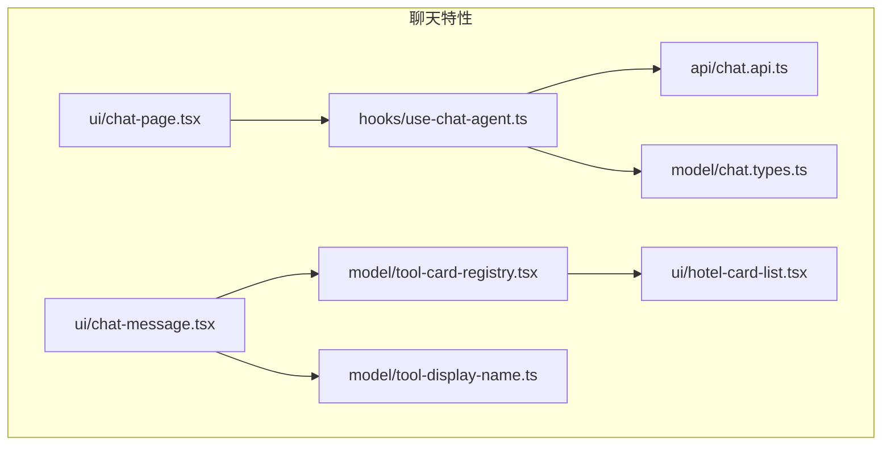
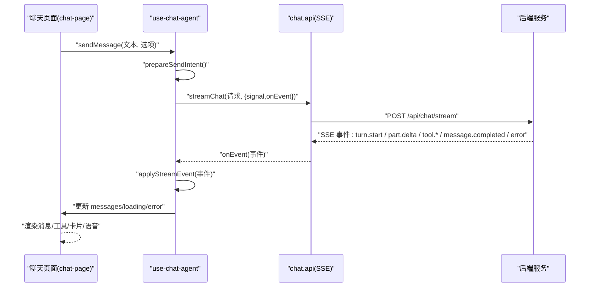
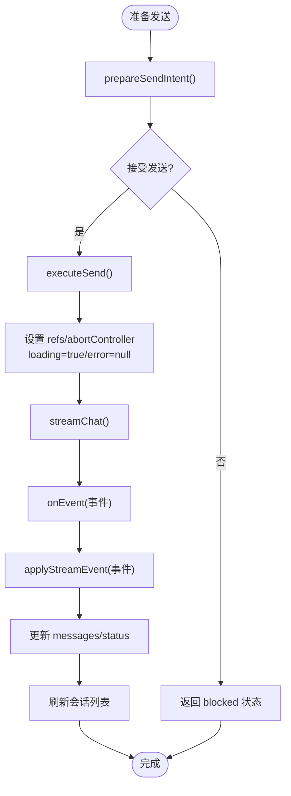
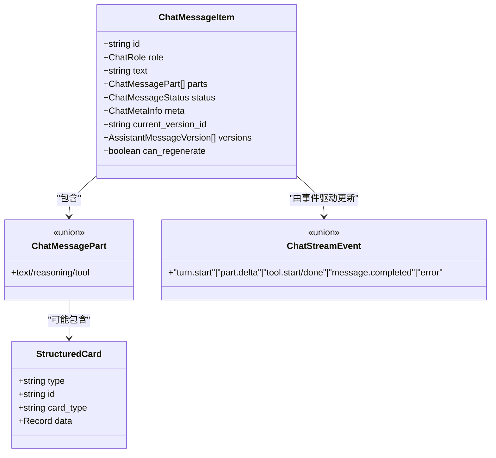
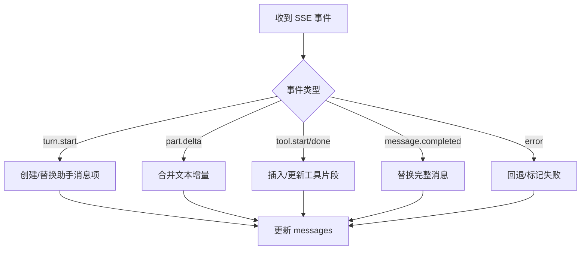
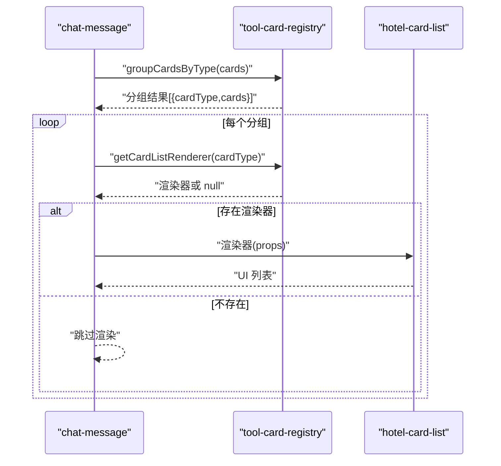
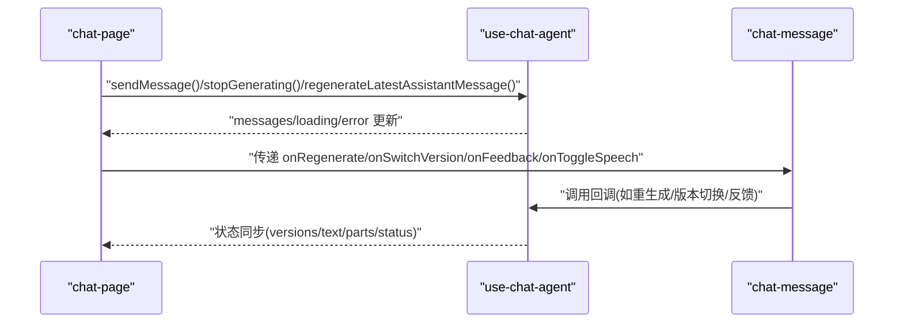
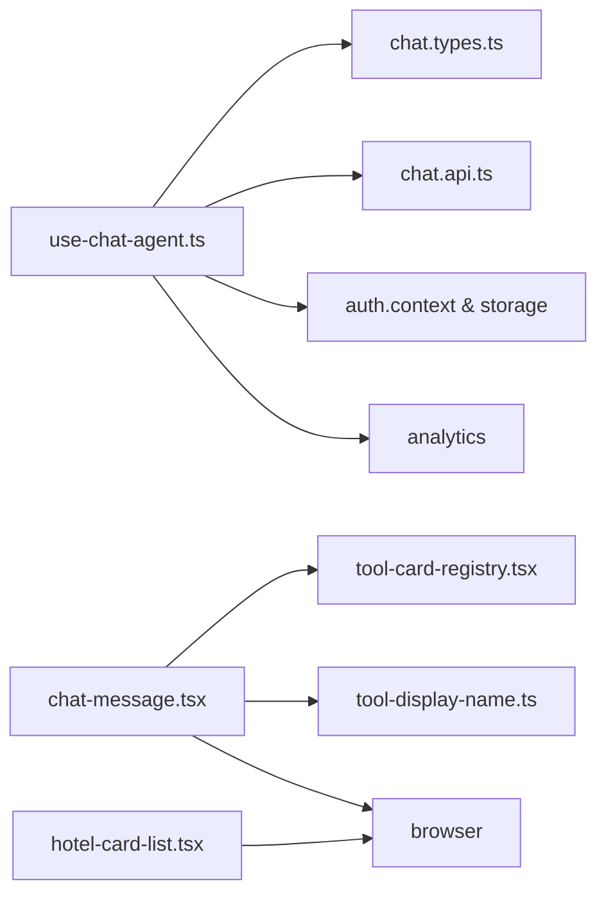

# 状态管理

<cite>
**本文引用的文件**
- [use-chat-agent.ts](file://frontend/src/features/chat/hooks/use-chat-agent.ts)
- [chat.types.ts](file://frontend/src/features/chat/model/chat.types.ts)
- [tool-card-registry.tsx](file://frontend/src/features/chat/model/tool-card-registry.tsx)
- [chat-page.tsx](file://frontend/src/features/chat/ui/chat-page.tsx)
- [chat-message.tsx](file://frontend/src/features/chat/ui/chat-message.tsx)
- [hotel-card-list.tsx](file://frontend/src/features/chat/ui/hotel-card-list.tsx)
- [tool-display-name.ts](file://frontend/src/features/chat/model/tool-display-name.ts)
- [chat.api.ts](file://frontend/src/features/chat/api/chat.api.ts)
- [tool-card-registry.test.ts](file://frontend/src/features/chat/model/tool-card-registry.test.ts)
</cite>

## 目录
1. [简介](#简介)
2. [项目结构](#项目结构)
3. [核心组件](#核心组件)
4. [架构总览](#架构总览)
5. [详细组件分析](#详细组件分析)
6. [依赖关系分析](#依赖关系分析)
7. [性能考量](#性能考量)
8. [故障排查指南](#故障排查指南)
9. [结论](#结论)
10. [附录](#附录)

## 简介
本文件聚焦于前端聊天状态管理，系统性梳理 use-chat-agent Hook 的状态逻辑、消息队列与 Agent 生命周期控制，详解数据结构、状态转换与副作用处理，并阐述工具卡片注册机制、动态组件渲染与状态同步策略。同时覆盖错误与加载状态管理、用户交互反馈以及最佳实践与性能优化建议。

## 项目结构
围绕聊天功能的前端目录采用“特性驱动”的组织方式：
- hooks：封装聊天状态与生命周期控制的自定义 Hook
- model：定义类型、注册表与显示名映射
- ui：聊天页面与消息渲染组件
- api：与后端 SSE 流式接口通信

图表来源
- [use-chat-agent.ts:125-596](file://frontend/src/features/chat/hooks/use-chat-agent.ts#L125-L596)
- [chat.types.ts:1-226](file://frontend/src/features/chat/model/chat.types.ts#L1-L226)
- [tool-card-registry.tsx:1-99](file://frontend/src/features/chat/model/tool-card-registry.tsx#L1-L99)
- [chat-page.tsx:140-741](file://frontend/src/features/chat/ui/chat-page.tsx#L140-L741)
- [chat-message.tsx:1-679](file://frontend/src/features/chat/ui/chat-message.tsx#L1-L679)
- [hotel-card-list.tsx:1-198](file://frontend/src/features/chat/ui/hotel-card-list.tsx#L1-L198)
- [tool-display-name.ts:1-72](file://frontend/src/features/chat/model/tool-display-name.ts#L1-L72)
- [chat.api.ts:1-252](file://frontend/src/features/chat/api/chat.api.ts#L1-L252)

章节来源
- [use-chat-agent.ts:125-596](file://frontend/src/features/chat/hooks/use-chat-agent.ts#L125-L596)
- [chat.types.ts:1-226](file://frontend/src/features/chat/model/chat.types.ts#L1-L226)

## 核心组件
- use-chat-agent：聊天状态中枢，负责线程管理、消息队列、会话持久化、模型配置、流式事件处理、错误与加载状态管理、生命周期控制（开始/停止/重试/重生成）
- chat.types：定义消息、版本、卡片、模型配置、SSE 事件等类型
- tool-card-registry：卡片渲染器注册表与分组工具
- chat-page：页面容器，调度会话、模型配置、语音播放、快捷提示
- chat-message：消息渲染组件，含工具组展开、卡片渲染、反馈与版本切换
- hotel-card-list：酒店卡片列表渲染
- tool-display-name：工具展示名映射
- chat.api：SSE 流式接口封装与事件解析

章节来源
- [use-chat-agent.ts:125-596](file://frontend/src/features/chat/hooks/use-chat-agent.ts#L125-L596)
- [chat.types.ts:1-226](file://frontend/src/features/chat/model/chat.types.ts#L1-L226)
- [tool-card-registry.tsx:1-99](file://frontend/src/features/chat/model/tool-card-registry.tsx#L1-L99)
- [chat-page.tsx:140-741](file://frontend/src/features/chat/ui/chat-page.tsx#L140-L741)
- [chat-message.tsx:1-679](file://frontend/src/features/chat/ui/chat-message.tsx#L1-L679)
- [hotel-card-list.tsx:1-198](file://frontend/src/features/chat/ui/hotel-card-list.tsx#L1-L198)
- [tool-display-name.ts:1-72](file://frontend/src/features/chat/model/tool-display-name.ts#L1-L72)
- [chat.api.ts:1-252](file://frontend/src/features/chat/api/chat.api.ts#L1-L252)

## 架构总览
use-chat-agent 将“线程/会话”、“消息队列”、“模型配置”、“错误与加载”四类状态集中管理，并通过 SSE 事件驱动状态更新。UI 层通过 Hook 暴露的方法进行交互，如发送消息、停止生成、重试、重生成、版本切换与反馈。

图表来源
- [chat-page.tsx:148-741](file://frontend/src/features/chat/ui/chat-page.tsx#L148-L741)
- [use-chat-agent.ts:384-476](file://frontend/src/features/chat/hooks/use-chat-agent.ts#L384-L476)
- [chat.api.ts:107-180](file://frontend/src/features/chat/api/chat.api.ts#L107-L180)

## 详细组件分析

### use-chat-agent：状态与生命周期
- 状态域
  - 线程与会话：threadId、sessions、sessionsReady、currentThreadIsPersisted
  - 消息队列：messages（ChatMessageItem[]）
  - 模型配置：modelProfiles、defaultModelProfileKey、selectedModelProfileKey、selectedModelProfile
  - 加载与错误：loading、error
  - 引用与标志：activeThreadIdRef、abortControllerRef、requestInFlightRef、lastSubmittedMessageRef
- 关键能力
  - 会话管理：startNewSession、openSession、renameSessionTitle、removeSession、refreshCurrentThread
  - 模型配置：updateCurrentModelProfile
  - 发送与重试：sendMessage、retryLastSubmittedMessage、stopGenerating
  - 重生成与版本：regenerateLatestAssistantMessage、selectAssistantVersion、setAssistantFeedback
  - 流式事件处理：applyStreamEvent（turn.start/part.delta/tool.* / message.completed/error）
  - 辅助函数：mergeTextDelta、upsertToolPart、visibleTextFromParts、toChatMessageItem
- 生命周期控制
  - 通过 AbortController 控制流中断
  - 通过 requestInFlightRef 与 loading 防止并发请求
  - 通过 activeThreadIdRef 保证事件目标线程一致性
- 错误与加载
  - 统一 setError 并在 UI 层展示
  - 在异常（含 AbortError）时回滚状态或恢复到稳定态
- 状态同步
  - 通过 patchMessage 与 setMessages 原子更新单条消息
  - hydrateThreadMessages 与 refreshSessions 保持 UI 与后端一致

图表来源
- [use-chat-agent.ts:384-476](file://frontend/src/features/chat/hooks/use-chat-agent.ts#L384-L476)
- [use-chat-agent.ts:388-458](file://frontend/src/features/chat/hooks/use-chat-agent.ts#L388-L458)
- [use-chat-agent.ts:287-382](file://frontend/src/features/chat/hooks/use-chat-agent.ts#L287-L382)

章节来源
- [use-chat-agent.ts:125-596](file://frontend/src/features/chat/hooks/use-chat-agent.ts#L125-L596)

### 数据结构与状态转换
- ChatMessageItem/PersistedChatMessage：消息体、状态、版本、元信息
- ChatMessagePart：text/reasoning/tool 三类片段，支持增量拼接与工具片段插入
- ChatStreamEvent：turn.start、part.delta、tool.start/done、message.completed、error、turn.done
- AssistantVersion/Feedback/SpeechStatus：版本管理与语音状态
- 结构化卡片：StructuredCard，按 card_type 注册渲染器

图表来源
- [chat.types.ts:134-158](file://frontend/src/features/chat/model/chat.types.ts#L134-L158)
- [chat.types.ts:36-60](file://frontend/src/features/chat/model/chat.types.ts#L36-L60)
- [chat.types.ts:84-130](file://frontend/src/features/chat/model/chat.types.ts#L84-L130)
- [chat.types.ts:28-34](file://frontend/src/features/chat/model/chat.types.ts#L28-L34)

章节来源
- [chat.types.ts:1-226](file://frontend/src/features/chat/model/chat.types.ts#L1-L226)

### 流式事件处理与消息队列
- turn.start：创建/替换助手消息项，注入 user/assistant 消息 ID
- part.delta：合并文本增量，维护可见文本与状态
- tool.start/done：插入/更新工具片段，触发 UI 即时反馈
- message.completed：完整消息落盘，替换内存态
- error：回退到 fallback 或标记失败，设置错误信息

图表来源
- [use-chat-agent.ts:287-382](file://frontend/src/features/chat/hooks/use-chat-agent.ts#L287-L382)
- [use-chat-agent.ts:50-105](file://frontend/src/features/chat/hooks/use-chat-agent.ts#L50-L105)

章节来源
- [use-chat-agent.ts:287-382](file://frontend/src/features/chat/hooks/use-chat-agent.ts#L287-L382)

### 工具卡片注册机制与动态渲染
- 注册表：cardListRenderers 以 card_type -> 渲染器映射
- 分组：groupCardsByType 按连续相同类型分组，保持顺序
- 渲染：chat-message 读取分组并调用对应渲染器；未注册时返回 null
- 适配器：HotelCardListAdapter 将后端数据适配为 HotelCardList 所需的 items

图表来源
- [chat-message.tsx:426-470](file://frontend/src/features/chat/ui/chat-message.tsx#L426-L470)
- [tool-card-registry.tsx:84-98](file://frontend/src/features/chat/model/tool-card-registry.tsx#L84-L98)
- [tool-card-registry.tsx:75-77](file://frontend/src/features/chat/model/tool-card-registry.tsx#L75-L77)
- [hotel-card-list.tsx:180-197](file://frontend/src/features/chat/ui/hotel-card-list.tsx#L180-L197)

章节来源
- [tool-card-registry.tsx:1-99](file://frontend/src/features/chat/model/tool-card-registry.tsx#L1-L99)
- [chat-message.tsx:426-470](file://frontend/src/features/chat/ui/chat-message.tsx#L426-L470)
- [hotel-card-list.tsx:1-198](file://frontend/src/features/chat/ui/hotel-card-list.tsx#L1-L198)

### 页面与交互反馈
- chat-page：路由参数驱动会话打开、历史面板、模型配置弹层、快捷提示、语音播放
- chat-message：工具组展开、卡片渲染、复制、语音播放、重生成、版本切换、反馈
- 语音播放：通过 getAssistantSpeechPlaybackUrl 获取播放地址，播放完成后清理状态

图表来源
- [chat-page.tsx:148-741](file://frontend/src/features/chat/ui/chat-page.tsx#L148-L741)
- [chat-message.tsx:269-679](file://frontend/src/features/chat/ui/chat-message.tsx#L269-L679)
- [use-chat-agent.ts:478-546](file://frontend/src/features/chat/hooks/use-chat-agent.ts#L478-L546)

章节来源
- [chat-page.tsx:148-741](file://frontend/src/features/chat/ui/chat-page.tsx#L148-L741)
- [chat-message.tsx:269-679](file://frontend/src/features/chat/ui/chat-message.tsx#L269-L679)

## 依赖关系分析
- use-chat-agent 依赖
  - chat.types：类型与事件定义
  - chat.api：SSE 流式接口与事件解析
  - auth 上下文与存储：鉴权状态与待处理消息
  - analytics：事件埋点
- chat-message 依赖
  - tool-card-registry：卡片渲染器
  - tool-display-name：工具展示名
  - browser：外链打开
- hotel-card-list 依赖
  - browser：外链打开
  - currency 符号映射与星评组件

图表来源
- [use-chat-agent.ts:1-27](file://frontend/src/features/chat/hooks/use-chat-agent.ts#L1-L27)
- [chat.types.ts:1-226](file://frontend/src/features/chat/model/chat.types.ts#L1-L226)
- [chat.api.ts:1-252](file://frontend/src/features/chat/api/chat.api.ts#L1-L252)
- [chat-message.tsx:31-36](file://frontend/src/features/chat/ui/chat-message.tsx#L31-L36)
- [tool-card-registry.tsx:21-24](file://frontend/src/features/chat/model/tool-card-registry.tsx#L21-L24)
- [hotel-card-list.tsx:10-11](file://frontend/src/features/chat/ui/hotel-card-list.tsx#L10-L11)

章节来源
- [use-chat-agent.ts:1-27](file://frontend/src/features/chat/hooks/use-chat-agent.ts#L1-L27)
- [chat-message.tsx:31-36](file://frontend/src/features/chat/ui/chat-message.tsx#L31-L36)
- [tool-card-registry.tsx:21-24](file://frontend/src/features/chat/model/tool-card-registry.tsx#L21-L24)
- [hotel-card-list.tsx:10-11](file://frontend/src/features/chat/ui/hotel-card-list.tsx#L10-L11)

## 性能考量
- 流式渲染优化
  - tool.start 后等待下一帧绘制机会，降低首屏抖动
  - 使用不可变更新策略（map/filter/concat）减少不必要的重渲染
- 状态最小化
  - 仅在必要时更新 messages，避免全量替换
  - 使用 refs 存储活跃线程与控制器，避免闭包捕获导致的无效重渲染
- 事件处理
  - 严格区分事件目标线程，防止跨线程状态污染
  - 在错误与中断场景及时清理状态与资源
- 渲染解耦
  - 工具卡片渲染器注册与消息渲染解耦，新增卡片无需改动消息渲染逻辑
- 语音播放
  - 播放完成后清理音频实例与 playing 状态，避免内存泄漏

章节来源
- [chat.api.ts:88-105](file://frontend/src/features/chat/api/chat.api.ts#L88-L105)
- [use-chat-agent.ts:400-458](file://frontend/src/features/chat/hooks/use-chat-agent.ts#L400-L458)
- [chat-message.tsx:426-470](file://frontend/src/features/chat/ui/chat-message.tsx#L426-L470)

## 故障排查指南
- 常见错误与处理
  - 流中断：AbortError 时将 active assistant 的 text/reasoning 片段标记为 stopped
  - 会话加载失败：setError 并提示用户
  - 模型切换失败：回滚到上一个配置并提示
  - 重生成失败：回退到持久化消息或提示
- 用户反馈
  - loading/error 状态在 UI 中显式呈现
  - 快捷提示与模型配置弹层提供明确的可用性提示
- 调试建议
  - 检查 SSE 事件是否正确到达 onEvent
  - 确认 activeThreadIdRef 与 targetThreadId 一致
  - 核对工具片段与卡片是否正确分组与注册

章节来源
- [use-chat-agent.ts:358-381](file://frontend/src/features/chat/hooks/use-chat-agent.ts#L358-L381)
- [use-chat-agent.ts:436-457](file://frontend/src/features/chat/hooks/use-chat-agent.ts#L436-L457)
- [use-chat-agent.ts:517-532](file://frontend/src/features/chat/hooks/use-chat-agent.ts#L517-L532)
- [chat-page.tsx:363-369](file://frontend/src/features/chat/ui/chat-page.tsx#L363-L369)

## 结论
use-chat-agent 将聊天状态、消息队列、Agent 生命周期与 UI 交互紧密耦合，通过 SSE 事件驱动实时更新，结合工具卡片注册机制实现高度可扩展的消息渲染。其设计强调状态最小化、事件隔离与渲染解耦，既保证了良好的用户体验，也为后续扩展（如新增卡片类型、工具与版本管理）提供了清晰的边界。

## 附录
- 最佳实践
  - 事件处理中始终校验线程一致性
  - 使用不可变更新与局部状态提升渲染性能
  - 将渲染逻辑下沉至注册表，避免消息组件膨胀
  - 对工具与卡片的展示名与渲染器进行单元测试
- 性能优化建议
  - 在高频事件（如 part.delta）中减少重排与重绘
  - 对工具组展开与卡片渲染采用懒加载策略
  - 语音播放结束后及时释放资源