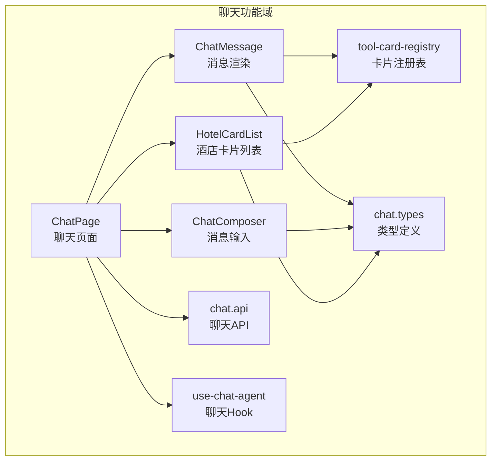
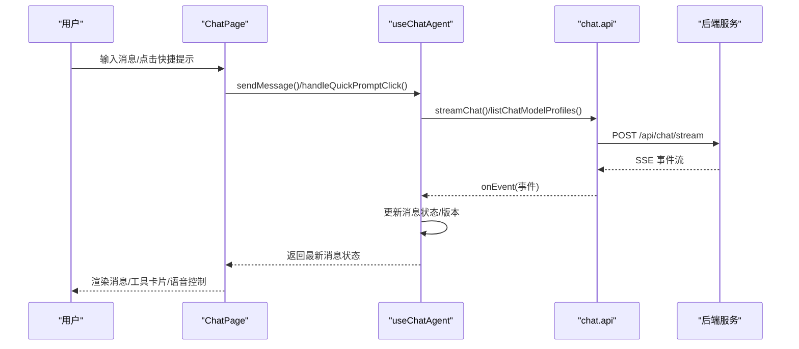
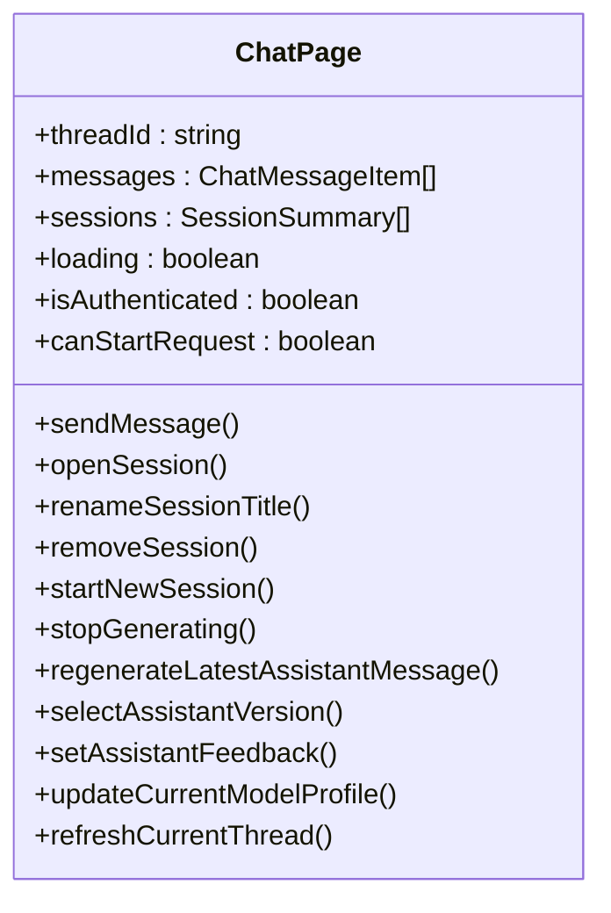
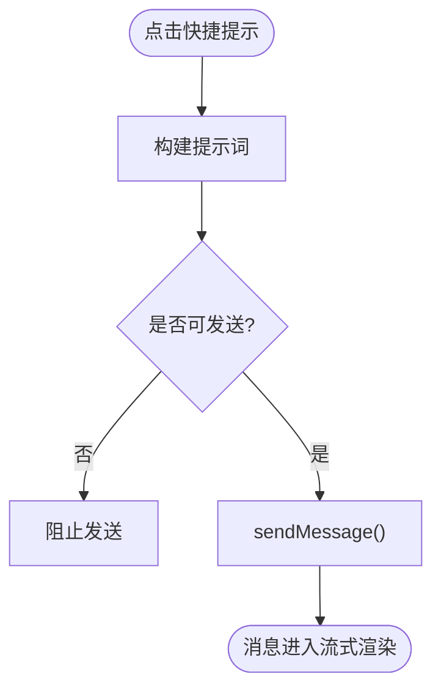
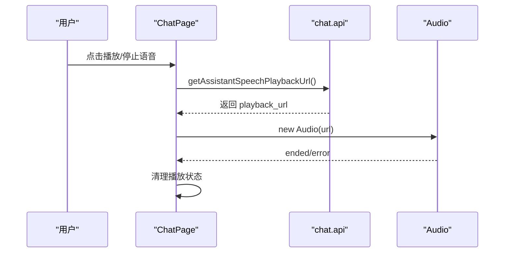
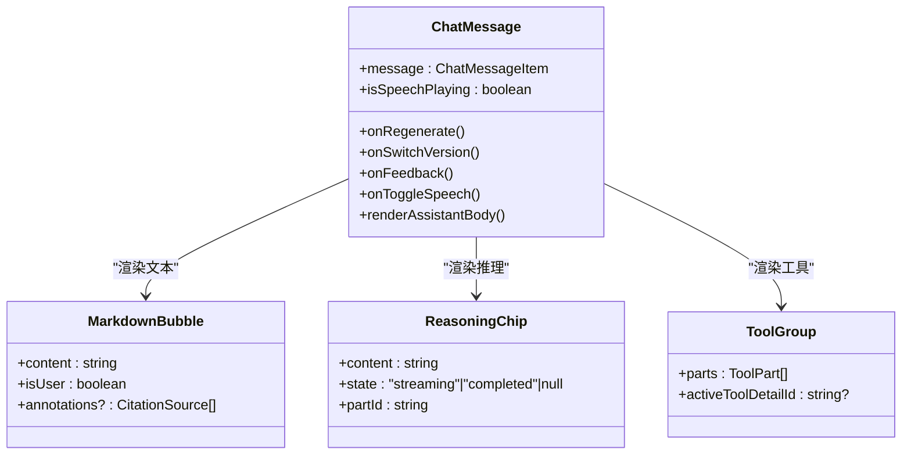
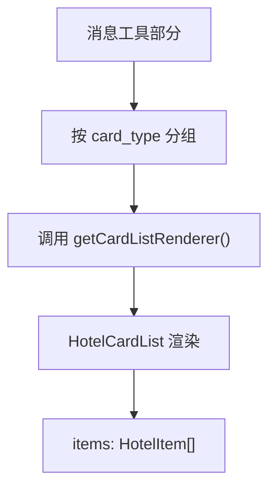
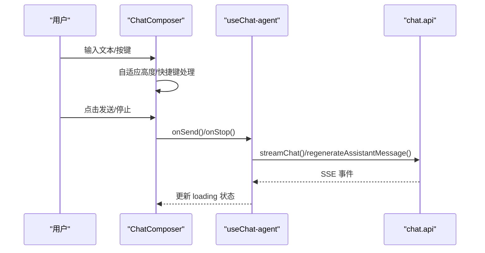
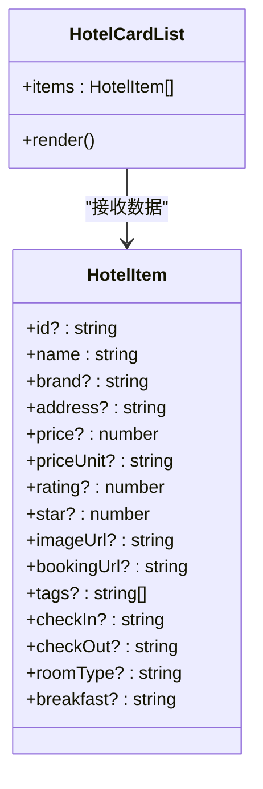
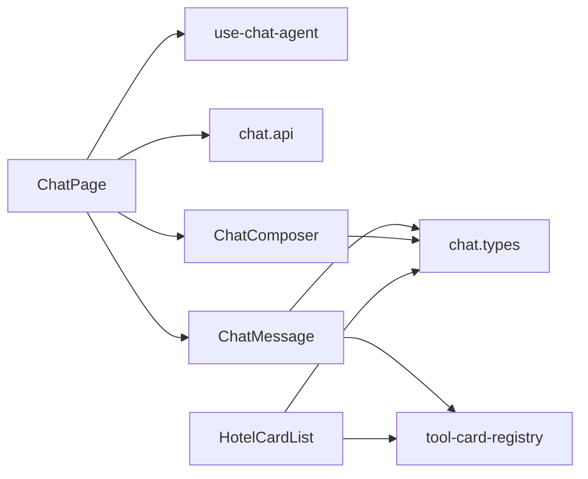

# 聊天界面实现

<cite>
**本文档引用的文件**
- [chat-page.tsx](file://frontend/src/features/chat/ui/chat-page.tsx)
- [chat-message.tsx](file://frontend/src/features/chat/ui/chat-message.tsx)
- [chat-composer.tsx](file://frontend/src/features/chat/ui/chat-composer.tsx)
- [hotel-card-list.tsx](file://frontend/src/features/chat/ui/hotel-card-list.tsx)
- [chat.types.ts](file://frontend/src/features/chat/model/chat.types.ts)
- [tool-card-registry.tsx](file://frontend/src/features/chat/model/tool-card-registry.tsx)
- [chat.api.ts](file://frontend/src/features/chat/api/chat.api.ts)
- [use-chat-agent.ts](file://frontend/src/features/chat/hooks/use-chat-agent.ts)
- [styles.css](file://frontend/src/app/styles.css)
- [button.tsx](file://frontend/src/shared/ui/primitives/button.tsx)
- [dialog.tsx](file://frontend/src/shared/ui/primitives/dialog.tsx)
</cite>

## 目录
1. [简介](#简介)
2. [项目结构](#项目结构)
3. [核心组件](#核心组件)
4. [架构总览](#架构总览)
5. [详细组件分析](#详细组件分析)
6. [依赖关系分析](#依赖关系分析)
7. [性能考虑](#性能考虑)
8. [故障排除指南](#故障排除指南)
9. [结论](#结论)
10. [附录](#附录)

## 简介
本文件全面解析聊天界面的实现，重点覆盖 ChatPage 组件的整体架构、布局设计与组件层次结构，深入说明消息渲染机制、消息气泡样式与交互行为，阐述消息输入组件的实现、快捷提示功能与键盘事件处理，并包含酒店卡片列表的渲染逻辑、点击交互与数据绑定。同时提供界面组件的使用示例、样式定制与响应式设计实现，帮助开发者快速理解与扩展该聊天界面。

## 项目结构
聊天界面位于前端项目的 `frontend/src/features/chat` 目录下，采用“功能域”组织方式：
- ui 层：页面与组件实现（ChatPage、ChatMessage、ChatComposer、HotelCardList）
- model 层：类型定义与工具卡片注册（chat.types.ts、tool-card-registry.ts）
- api 层：聊天接口封装（chat.api.ts）
- hooks 层：聊天状态与业务逻辑（use-chat-agent.ts）

**图表来源**
- [chat-page.tsx:140-741](file://frontend/src/features/chat/ui/chat-page.tsx#L140-L741)
- [chat-message.tsx:269-679](file://frontend/src/features/chat/ui/chat-message.tsx#L269-L679)
- [chat-composer.tsx:17-156](file://frontend/src/features/chat/ui/chat-composer.tsx#L17-L156)
- [hotel-card-list.tsx:180-198](file://frontend/src/features/chat/ui/hotel-card-list.tsx#L180-L198)
- [tool-card-registry.tsx:75-99](file://frontend/src/features/chat/model/tool-card-registry.tsx#L75-L99)
- [chat.types.ts:134-226](file://frontend/src/features/chat/model/chat.types.ts#L134-L226)
- [chat.api.ts:107-252](file://frontend/src/features/chat/api/chat.api.ts#L107-L252)
- [use-chat-agent.ts:125-596](file://frontend/src/features/chat/hooks/use-chat-agent.ts#L125-L596)

**章节来源**
- [chat-page.tsx:140-741](file://frontend/src/features/chat/ui/chat-page.tsx#L140-L741)
- [chat-message.tsx:269-679](file://frontend/src/features/chat/ui/chat-message.tsx#L269-L679)
- [chat-composer.tsx:17-156](file://frontend/src/features/chat/ui/chat-composer.tsx#L17-L156)
- [hotel-card-list.tsx:180-198](file://frontend/src/features/chat/ui/hotel-card-list.tsx#L180-L198)
- [tool-card-registry.tsx:75-99](file://frontend/src/features/chat/model/tool-card-registry.tsx#L75-L99)
- [chat.types.ts:134-226](file://frontend/src/features/chat/model/chat.types.ts#L134-L226)
- [chat.api.ts:107-252](file://frontend/src/features/chat/api/chat.api.ts#L107-L252)
- [use-chat-agent.ts:125-596](file://frontend/src/features/chat/hooks/use-chat-agent.ts#L125-L596)

## 核心组件
- ChatPage：聊天主页面，负责会话管理、消息列表渲染、快捷提示、输入框、模型配置弹层、历史会话抽屉等。
- ChatMessage：单条消息渲染组件，支持文本、推理、工具调用、结构化卡片、语音播放、复制、重新生成、反馈等。
- ChatComposer：消息输入组件，支持文本输入、多行自适应、快捷键发送、语音模式切换、模型配置选择等。
- HotelCardList：酒店卡片列表，横向滚动展示酒店信息，支持图片加载失败回退与预订跳转。
- tool-card-registry：卡片渲染器注册表，按 card_type 将结构化卡片路由到对应渲染器。
- use-chat-agent：聊天状态与业务逻辑钩子，封装 SSE 流式通信、消息状态管理、版本切换、反馈、语音播放等。
- chat.api：聊天 API 封装，包括流式聊天、会话管理、版本切换、反馈、语音播放 URL 获取等。

**章节来源**
- [chat-page.tsx:140-741](file://frontend/src/features/chat/ui/chat-page.tsx#L140-L741)
- [chat-message.tsx:269-679](file://frontend/src/features/chat/ui/chat-message.tsx#L269-L679)
- [chat-composer.tsx:17-156](file://frontend/src/features/chat/ui/chat-composer.tsx#L17-L156)
- [hotel-card-list.tsx:180-198](file://frontend/src/features/chat/ui/hotel-card-list.tsx#L180-L198)
- [tool-card-registry.tsx:75-99](file://frontend/src/features/chat/model/tool-card-registry.tsx#L75-L99)
- [use-chat-agent.ts:125-596](file://frontend/src/features/chat/hooks/use-chat-agent.ts#L125-L596)
- [chat.api.ts:107-252](file://frontend/src/features/chat/api/chat.api.ts#L107-L252)

## 架构总览
聊天界面采用“页面 + 组件 + Hook + API”的分层架构：
- 页面层：ChatPage 负责路由参数解析、认证状态、会话管理、消息列表渲染、快捷提示、输入框与模型配置弹层。
- 组件层：ChatMessage、ChatComposer、HotelCardList 提供独立可复用的 UI 能力。
- Hook 层：use-chat-agent 封装聊天状态、SSE 事件处理、消息生命周期管理。
- API 层：chat.api 提供统一的聊天接口，支持流式事件、版本切换、反馈、语音播放等。

**图表来源**
- [chat-page.tsx:329-335](file://frontend/src/features/chat/ui/chat-page.tsx#L329-L335)
- [use-chat-agent.ts:460-476](file://frontend/src/features/chat/hooks/use-chat-agent.ts#L460-L476)
- [chat.api.ts:107-113](file://frontend/src/features/chat/api/chat.api.ts#L107-L113)

**章节来源**
- [chat-page.tsx:329-335](file://frontend/src/features/chat/ui/chat-page.tsx#L329-L335)
- [use-chat-agent.ts:460-476](file://frontend/src/features/chat/hooks/use-chat-agent.ts#L460-L476)
- [chat.api.ts:107-113](file://frontend/src/features/chat/api/chat.api.ts#L107-L113)

## 详细组件分析

### ChatPage 组件分析
ChatPage 是聊天界面的核心容器，承担以下职责：
- 认证与路由：根据认证状态与路由参数打开会话，处理新建会话与历史会话抽屉。
- 消息渲染：在消息为空时显示快捷提示，否则渲染消息列表。
- 快捷提示：提供“规划行程”“查询天气”“推荐景点”“规划路线”四类快捷提示。
- 输入与模型：集成 ChatComposer，支持模型配置弹层与停止生成。
- 语音播放：管理语音播放状态，支持同一时刻仅播放一个消息的语音。
- 会话管理：支持重命名、删除、新建会话与导航。

**图表来源**
- [chat-page.tsx:140-741](file://frontend/src/features/chat/ui/chat-page.tsx#L140-L741)
- [use-chat-agent.ts:569-596](file://frontend/src/features/chat/hooks/use-chat-agent.ts#L569-L596)

**章节来源**
- [chat-page.tsx:140-741](file://frontend/src/features/chat/ui/chat-page.tsx#L140-L741)
- [use-chat-agent.ts:569-596](file://frontend/src/features/chat/hooks/use-chat-agent.ts#L569-L596)

#### 快捷提示与消息输入
- 快捷提示：通过 quickPromptItems 定义四类提示，点击后构建对应提示词并通过 sendMessage 发送。
- 快捷提示构建：buildQuickPrompt 根据 kind 返回预设提示词。
- 模型配置：通过 AppSurfaceSheet 展示模型配置选项，支持“快速响应/深度推理”。

**图表来源**
- [chat-page.tsx:36-76](file://frontend/src/features/chat/ui/chat-page.tsx#L36-L76)
- [chat-page.tsx:329-335](file://frontend/src/features/chat/ui/chat-page.tsx#L329-L335)

**章节来源**
- [chat-page.tsx:36-76](file://frontend/src/features/chat/ui/chat-page.tsx#L36-L76)
- [chat-page.tsx:329-335](file://frontend/src/features/chat/ui/chat-page.tsx#L329-L335)

#### 语音播放与状态管理
- 语音播放：handleToggleSpeech 根据 messageId:versionId 生成唯一 key，管理当前播放音频实例。
- 并发控制：同一时刻仅允许一个语音播放，自动停止上一个音频。
- 错误处理：当语音状态为 409 时刷新当前线程。

**图表来源**
- [chat-page.tsx:337-369](file://frontend/src/features/chat/ui/chat-page.tsx#L337-L369)
- [chat.api.ts:243-251](file://frontend/src/features/chat/api/chat.api.ts#L243-L251)

**章节来源**
- [chat-page.tsx:337-369](file://frontend/src/features/chat/ui/chat-page.tsx#L337-L369)
- [chat.api.ts:243-251](file://frontend/src/features/chat/api/chat.api.ts#L243-L251)

### ChatMessage 组件分析
ChatMessage 负责单条消息的完整渲染与交互：
- 消息类型：区分用户与助手消息，助手消息支持文本、推理、工具三类部分。
- 文本渲染：使用 ReactMarkdown 渲染，支持 GFM、CJK 友好、内联代码块、表格等。
- 推理部分：支持“思考中/思考过程”折叠展开。
- 工具部分：合并连续工具调用，展示工具组入口，点击后弹出 AppSurfaceSheet 展示工具详情。
- 结构化卡片：通过 tool-card-registry 按 card_type 渲染，如酒店卡片列表。
- 助手动作：复制、语音播放、重新生成、反馈、版本切换。
- 语音播放状态：isSpeechPlaying 控制播放/停止图标。

**图表来源**
- [chat-message.tsx:269-679](file://frontend/src/features/chat/ui/chat-message.tsx#L269-L679)
- [chat.types.ts:36-61](file://frontend/src/features/chat/model/chat.types.ts#L36-L61)

**章节来源**
- [chat-message.tsx:269-679](file://frontend/src/features/chat/ui/chat-message.tsx#L269-L679)
- [chat.types.ts:36-61](file://frontend/src/features/chat/model/chat.types.ts#L36-L61)

#### 工具卡片渲染与数据绑定
- 卡片注册：tool-card-registry 提供 getCardListRenderer 与 groupCardsByType。
- 酒店卡片：HotelCardList 接收 items 数组，逐项渲染酒店信息，支持预订跳转。
- 数据绑定：后端工具返回 StructuredCard，前端按 card_type 路由到对应渲染器。

**图表来源**
- [tool-card-registry.tsx:84-98](file://frontend/src/features/chat/model/tool-card-registry.tsx#L84-L98)
- [hotel-card-list.tsx:180-198](file://frontend/src/features/chat/ui/hotel-card-list.tsx#L180-L198)

**章节来源**
- [tool-card-registry.tsx:84-98](file://frontend/src/features/chat/model/tool-card-registry.tsx#L84-L98)
- [hotel-card-list.tsx:180-198](file://frontend/src/features/chat/ui/hotel-card-list.tsx#L180-L198)

### ChatComposer 组件分析
ChatComposer 实现消息输入与交互：
- 文本输入：多行自适应高度，支持 Shift+Enter 快速发送。
- 发送控制：loading 与 ready 状态控制按钮可用性。
- 模型配置：点击模型选择器打开 AppSurfaceSheet。
- 停止生成：loading 时显示停止按钮。
- 语音模式：支持文本与语音模式切换（当前文件未实现语音录制逻辑）。

**图表来源**
- [chat-composer.tsx:37-48](file://frontend/src/features/chat/ui/chat-composer.tsx#L37-L48)
- [chat-composer.tsx:79-91](file://frontend/src/features/chat/ui/chat-composer.tsx#L79-L91)
- [use-chat-agent.ts:460-476](file://frontend/src/features/chat/hooks/use-chat-agent.ts#L460-L476)

**章节来源**
- [chat-composer.tsx:37-48](file://frontend/src/features/chat/ui/chat-composer.tsx#L37-L48)
- [chat-composer.tsx:79-91](file://frontend/src/features/chat/ui/chat-composer.tsx#L79-L91)
- [use-chat-agent.ts:460-476](file://frontend/src/features/chat/hooks/use-chat-agent.ts#L460-L476)

### 酒店卡片列表渲染
HotelCardList 提供移动端友好的横向滚动酒店卡片：
- 字段支持：名称、评分、星级、价格、标签、地址、预订链接等。
- 图片加载：支持懒加载与失败回退（尝试移除 crossOrigin 后重试）。
- 价格格式化：根据币种符号格式化价格。
- 交互：点击“预订/查看”按钮在应用内浏览器中打开链接。

**图表来源**
- [hotel-card-list.tsx:180-198](file://frontend/src/features/chat/ui/hotel-card-list.tsx#L180-L198)
- [hotel-card-list.tsx:19-39](file://frontend/src/features/chat/ui/hotel-card-list.tsx#L19-L39)

**章节来源**
- [hotel-card-list.tsx:180-198](file://frontend/src/features/chat/ui/hotel-card-list.tsx#L180-L198)
- [hotel-card-list.tsx:19-39](file://frontend/src/features/chat/ui/hotel-card-list.tsx#L19-L39)

## 依赖关系分析
聊天界面的依赖关系清晰，遵循“页面依赖 Hook，Hook 依赖 API，组件依赖类型与注册表”的原则：

**图表来源**
- [chat-page.tsx:140-741](file://frontend/src/features/chat/ui/chat-page.tsx#L140-L741)
- [use-chat-agent.ts:125-596](file://frontend/src/features/chat/hooks/use-chat-agent.ts#L125-L596)
- [chat.api.ts:107-252](file://frontend/src/features/chat/api/chat.api.ts#L107-L252)
- [chat-message.tsx:269-679](file://frontend/src/features/chat/ui/chat-message.tsx#L269-L679)
- [hotel-card-list.tsx:180-198](file://frontend/src/features/chat/ui/hotel-card-list.tsx#L180-L198)
- [tool-card-registry.tsx:75-99](file://frontend/src/features/chat/model/tool-card-registry.tsx#L75-L99)
- [chat.types.ts:134-226](file://frontend/src/features/chat/model/chat.types.ts#L134-L226)

**章节来源**
- [chat-page.tsx:140-741](file://frontend/src/features/chat/ui/chat-page.tsx#L140-L741)
- [use-chat-agent.ts:125-596](file://frontend/src/features/chat/hooks/use-chat-agent.ts#L125-L596)
- [chat.api.ts:107-252](file://frontend/src/features/chat/api/chat.api.ts#L107-L252)
- [chat-message.tsx:269-679](file://frontend/src/features/chat/ui/chat-message.tsx#L269-L679)
- [hotel-card-list.tsx:180-198](file://frontend/src/features/chat/ui/hotel-card-list.tsx#L180-L198)
- [tool-card-registry.tsx:75-99](file://frontend/src/features/chat/model/tool-card-registry.tsx#L75-L99)
- [chat.types.ts:134-226](file://frontend/src/features/chat/model/chat.types.ts#L134-L226)

## 性能考虑
- 流式渲染：SSE 事件按序到达，use-chat-agent 通过 applyStreamEvent 逐步更新消息状态，避免一次性渲染大量 DOM。
- 滚动优化：ChatPage 在消息变化时自动滚动到底部，配合样式类 .scrollbar-hidden 减少滚动条闪烁。
- 语音并发：同一时刻仅允许一个语音播放，避免资源竞争与内存泄漏。
- 组件记忆化：useMemo 用于会话分组与模型描述，减少不必要的重渲染。
- 图片加载：HotelCardList 对图片加载失败进行回退处理，提升稳定性。

[本节为通用指导，无需特定文件引用]

## 故障排除指南
- 语音播放失败（409）：ChatPage 在捕获 HttpError 且状态为 409 时调用 refreshCurrentThread 刷新线程状态。
- 发送被阻止：use-chat-agent 的 prepareSendIntent 返回 blocked 状态时，ChatPage 会根据原因提示用户（空消息、加载中、未就绪）。
- 重新生成限制：ChatMessage 对助手版本数量限制为 3，超过后禁用重新生成按钮并显示提示。
- 工具执行错误：ChatMessage 在工具状态为 error 时展示错误标识，工具详情面板显示错误状态。

**章节来源**
- [chat-page.tsx:363-369](file://frontend/src/features/chat/ui/chat-page.tsx#L363-L369)
- [use-chat-agent.ts:384-394](file://frontend/src/features/chat/hooks/use-chat-agent.ts#L384-L394)
- [chat-message.tsx:299-302](file://frontend/src/features/chat/ui/chat-message.tsx#L299-L302)
- [chat-message.tsx:445-447](file://frontend/src/features/chat/ui/chat-message.tsx#L445-L447)

## 结论
该聊天界面实现采用清晰的分层架构与模块化设计，通过 ChatPage 统一协调页面逻辑，ChatMessage 与 ChatComposer 提供高内聚的渲染与输入能力，use-chat-agent 封装复杂的流式通信与状态管理，tool-card-registry 与类型系统确保结构化卡片的可扩展性。整体设计兼顾易用性、可维护性与可扩展性，为后续功能迭代提供了良好的基础。

[本节为总结性内容，无需特定文件引用]

## 附录

### 使用示例与最佳实践
- 快捷提示使用：通过 ChatPage 的 handleQuickPromptClick 触发，确保 canStartRequest 为真后再发送。
- 模型配置：通过 AppSurfaceSheet 选择模型，useChat-agent 会在发送时携带 model_profile_key。
- 语音播放：在 ChatMessage 中传入 isSpeechPlaying 控制播放/停止图标，ChatPage 统一管理播放状态。
- 工具卡片：后端返回 StructuredCard，前端通过 tool-card-registry 自动路由渲染，无需改动 ChatMessage。

**章节来源**
- [chat-page.tsx:329-335](file://frontend/src/features/chat/ui/chat-page.tsx#L329-L335)
- [use-chat-agent.ts:569-596](file://frontend/src/features/chat/hooks/use-chat-agent.ts#L569-L596)
- [chat-message.tsx:295-299](file://frontend/src/features/chat/ui/chat-message.tsx#L295-L299)
- [tool-card-registry.tsx:75-99](file://frontend/src/features/chat/model/tool-card-registry.tsx#L75-L99)

### 样式定制与响应式设计
- 主题变量：styles.css 定义品牌色与语义色，支持深浅主题切换。
- 动画与交互：fade-up 动画、typing-dot 打字动画、滚动条隐藏样式。
- 移动端适配：媒体查询与 .mobile-shell 保证在 430px 以下宽度下的良好体验。
- 组件样式：Button 与 Dialog 等共享 UI 组件通过 cva 与 cn 组合实现一致的视觉与交互。

**章节来源**
- [styles.css:7-46](file://frontend/src/app/styles.css#L7-L46)
- [styles.css:94-170](file://frontend/src/app/styles.css#L94-L170)
- [button.tsx:6-33](file://frontend/src/shared/ui/primitives/button.tsx#L6-L33)
- [dialog.tsx:15-52](file://frontend/src/shared/ui/primitives/dialog.tsx#L15-L52)