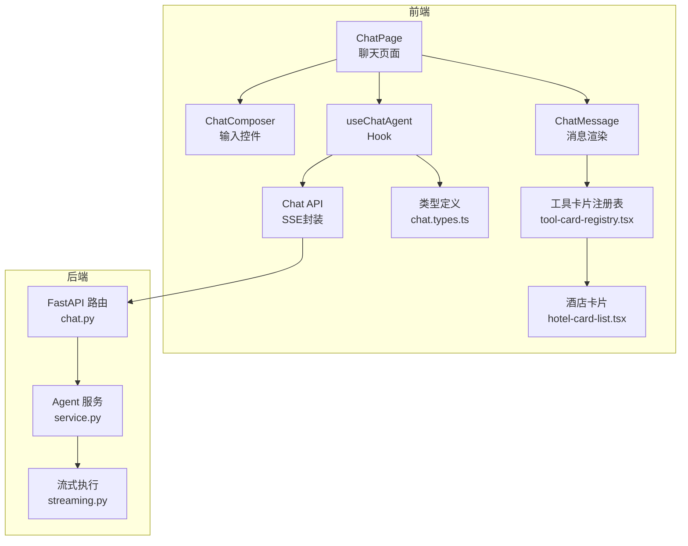
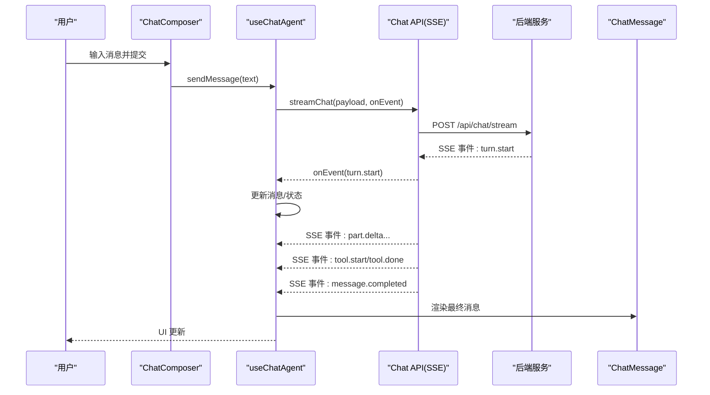
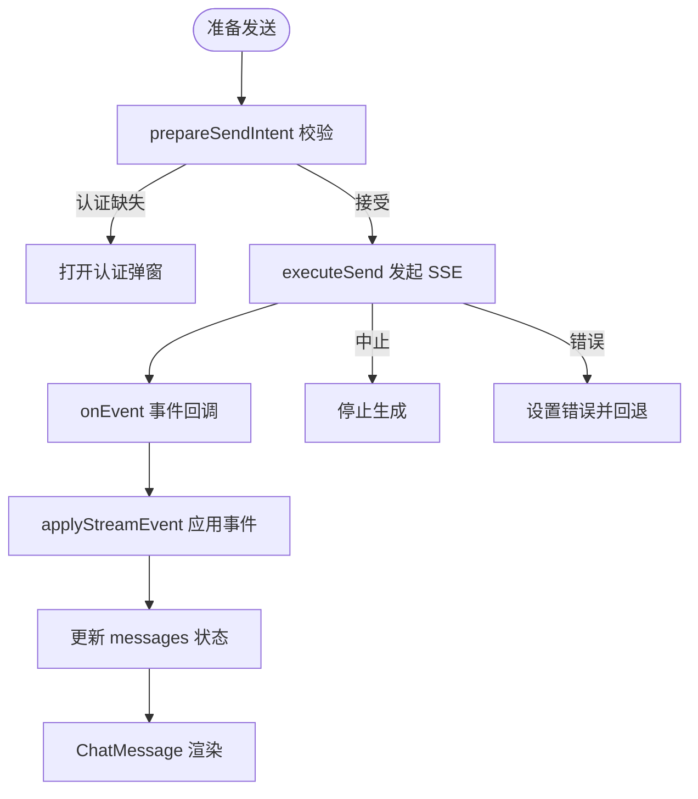
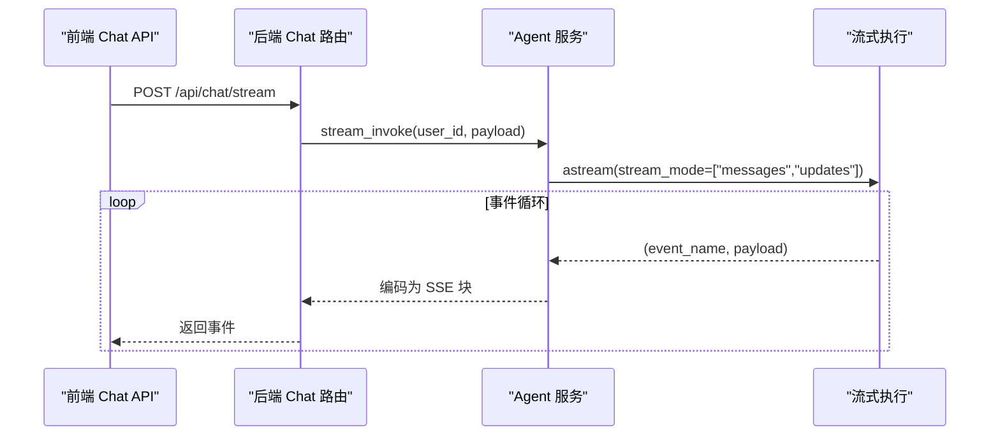
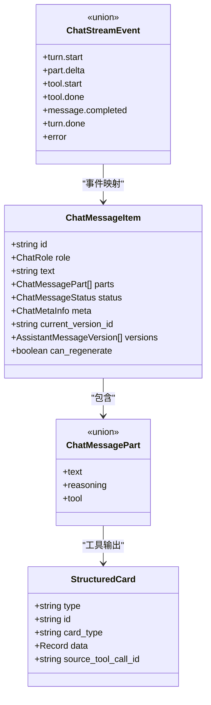
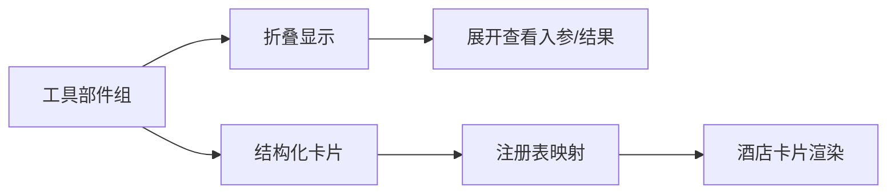
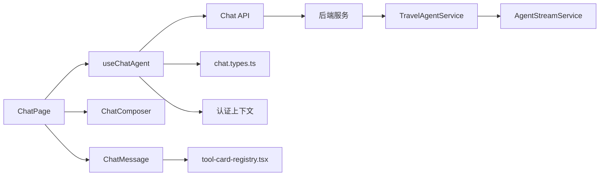

# 聊天系统

<cite>
**本文引用的文件**
- [use-chat-agent.ts](file://frontend/src/features/chat/hooks/use-chat-agent.ts)
- [chat.types.ts](file://frontend/src/features/chat/model/chat.types.ts)
- [chat-page.tsx](file://frontend/src/features/chat/ui/chat-page.tsx)
- [chat-message.tsx](file://frontend/src/features/chat/ui/chat-message.tsx)
- [chat.api.ts](file://frontend/src/features/chat/api/chat.api.ts)
- [chat-composer.tsx](file://frontend/src/features/chat/ui/chat-composer.tsx)
- [tool-card-registry.tsx](file://frontend/src/features/chat/model/tool-card-registry.tsx)
- [tool-display-name.ts](file://frontend/src/features/chat/model/tool-display-name.ts)
- [hotel-card-list.tsx](file://frontend/src/features/chat/ui/hotel-card-list.tsx)
- [chat.py](file://backend/app/api/chat.py)
- [service.py](file://backend/app/agent/service.py)
- [streaming.py](file://backend/app/agent/streaming.py)
- [index.tsx](file://frontend/src/pages/chat/index.tsx)
</cite>

## 目录
1. [简介](#简介)
2. [项目结构](#项目结构)
3. [核心组件](#核心组件)
4. [架构总览](#架构总览)
5. [详细组件分析](#详细组件分析)
6. [依赖关系分析](#依赖关系分析)
7. [性能考量](#性能考量)
8. [故障排查指南](#故障排查指南)
9. [结论](#结论)
10. [附录](#附录)

## 简介
本文件面向“聊天系统”的前端与后端实现，系统性梳理聊天界面的架构设计、实时消息处理机制（SSE 事件流）、use-chat-agent Hook 的状态管理与消息队列处理、工具调用可视化、消息数据结构与 UI 渲染策略、快速提示与语音播放控制、以及会话历史管理。同时提供组件使用示例与扩展指南，帮助开发者快速理解与二次开发。

## 项目结构
前端采用特性域划分，聊天功能位于 features/chat，包含 Hooks、Model、UI 三层：
- Hooks：use-chat-agent 负责状态管理、SSE 事件应用、消息发送与重试、会话管理等
- Model：chat.types.ts 定义消息、事件、会话、模型档位等类型
- UI：chat-page.tsx、chat-message.tsx、chat-composer.tsx 实现页面、消息渲染与输入控件
- API：chat.api.ts 封装 SSE 流式请求与工具方法
- 工具卡片：tool-card-registry.tsx、hotel-card-list.tsx 实现结构化卡片渲染
- 后端：FastAPI 路由 chat.py，Agent 服务 service.py，流式执行 streaming.py

图表来源
- [chat-page.tsx:140-741](file://frontend/src/features/chat/ui/chat-page.tsx#L140-L741)
- [chat-composer.tsx:17-156](file://frontend/src/features/chat/ui/chat-composer.tsx#L17-L156)
- [chat-message.tsx:269-679](file://frontend/src/features/chat/ui/chat-message.tsx#L269-L679)
- [use-chat-agent.ts:125-596](file://frontend/src/features/chat/hooks/use-chat-agent.ts#L125-L596)
- [chat.api.ts:107-252](file://frontend/src/features/chat/api/chat.api.ts#L107-L252)
- [chat.types.ts:134-226](file://frontend/src/features/chat/model/chat.types.ts#L134-L226)
- [tool-card-registry.tsx:60-99](file://frontend/src/features/chat/model/tool-card-registry.tsx#L60-L99)
- [hotel-card-list.tsx:180-198](file://frontend/src/features/chat/ui/hotel-card-list.tsx#L180-L198)
- [chat.py:41-72](file://backend/app/api/chat.py#L41-L72)
- [service.py:373-507](file://backend/app/agent/service.py#L373-L507)
- [streaming.py:80-200](file://backend/app/agent/streaming.py#L80-L200)

章节来源
- [chat-page.tsx:140-741](file://frontend/src/features/chat/ui/chat-page.tsx#L140-L741)
- [use-chat-agent.ts:125-596](file://frontend/src/features/chat/hooks/use-chat-agent.ts#L125-L596)
- [chat.api.ts:107-252](file://frontend/src/features/chat/api/chat.api.ts#L107-L252)
- [chat.types.ts:134-226](file://frontend/src/features/chat/model/chat.types.ts#L134-L226)
- [chat.py:41-72](file://backend/app/api/chat.py#L41-L72)
- [service.py:373-507](file://backend/app/agent/service.py#L373-L507)
- [streaming.py:80-200](file://backend/app/agent/streaming.py#L80-L200)

## 核心组件
- useChatAgent Hook：集中管理线程 ID、消息列表、会话列表、模型档位、加载与错误状态；负责发送消息、停止生成、重试上次消息、重新生成助手回复、切换助手版本、设置反馈、更新当前模型档位、打开/新建/重命名/删除会话等
- Chat API：封装 SSE 请求，解析服务端事件，调度到 onEvent 回调
- ChatPage 页面：承载历史会话面板、快速提示、模型档位选择、消息列表、输入控件与语音播放控制
- ChatMessage 渲染：按消息角色渲染用户/助手消息，支持 Markdown、引用注解、工具调用折叠、结构化卡片、复制、语音播放、重新生成、版本切换与反馈
- 类型系统：定义消息项、事件、会话、模型档位、语音播放等强类型
- 工具卡片：通过注册表将 card_type 映射到渲染器，按类型分组渲染

章节来源
- [use-chat-agent.ts:125-596](file://frontend/src/features/chat/hooks/use-chat-agent.ts#L125-L596)
- [chat.api.ts:107-252](file://frontend/src/features/chat/api/chat.api.ts#L107-L252)
- [chat-page.tsx:140-741](file://frontend/src/features/chat/ui/chat-page.tsx#L140-L741)
- [chat-message.tsx:269-679](file://frontend/src/features/chat/ui/chat-message.tsx#L269-L679)
- [chat.types.ts:134-226](file://frontend/src/features/chat/model/chat.types.ts#L134-L226)
- [tool-card-registry.tsx:60-99](file://frontend/src/features/chat/model/tool-card-registry.tsx#L60-L99)

## 架构总览
前端通过 SSE 与后端交互，后端以 LangGraph 原生事件流为基础，向前端推送 turn.start、part.delta、tool.start/done、message.completed、turn.done、error 等事件。前端 Hook 将事件转换为 UI 状态，驱动 ChatMessage 渲染与工具卡片展示。

图表来源
- [chat-composer.tsx:37-48](file://frontend/src/features/chat/ui/chat-composer.tsx#L37-L48)
- [use-chat-agent.ts:460-476](file://frontend/src/features/chat/hooks/use-chat-agent.ts#L460-L476)
- [chat.api.ts:107-180](file://frontend/src/features/chat/api/chat.api.ts#L107-L180)
- [chat.py:41-72](file://backend/app/api/chat.py#L41-L72)
- [service.py:373-507](file://backend/app/agent/service.py#L373-L507)
- [streaming.py:80-200](file://backend/app/agent/streaming.py#L80-L200)

## 详细组件分析

### useChatAgent Hook：状态管理与消息队列
- 状态与引用
  - threadId：当前线程标识，支持新建与打开会话
  - messages：消息列表，ChatMessageItem[]
  - sessions/sessionsReady：会话列表与加载状态
  - modelProfiles/defaultModelProfileKey/selectedModelProfileKey：模型档位列表与当前选择
  - loading/error：请求状态与错误信息
  - abortControllerRef/requestInFlightRef/lastSubmittedMessageRef：请求生命周期与重试控制
- 会话管理
  - startNewSession/openSession/hydrateThreadMessages：新建/打开/拉取会话详情
  - renameSession/removeSession：重命名/删除会话
  - refreshSessions/refreshCurrentThread：刷新会话列表与当前线程
  - updateCurrentModelProfile：切换当前线程模型档位
- 发送与重试
  - prepareSendIntent：发送意图校验（空消息、加载中、未就绪、认证）
  - executeSend：发起 SSE 请求，设置 AbortController，派发 applyStreamEvent
  - sendMessage：对外暴露的发送接口，处理认证弹窗与意图结果
  - retryLastSubmittedMessage：重试上次提交的消息
- 事件应用与消息队列
  - applyStreamEvent：根据事件类型更新消息状态与内容
    - turn.start：插入/替换助手消息，同步用户消息
    - part.delta：合并文本增量，更新可见文本与状态
    - tool.start/done：插入/更新工具部件，附带状态与卡片
    - message.completed：替换为持久化消息
    - error：设置错误状态与回退消息
- 重新生成与版本切换
  - regenerateLatestAssistantMessage：重新生成最新助手回复，支持 turn.start 即时反馈
  - selectAssistantVersion：切换助手版本
  - setAssistantFeedback：设置版本反馈
- 停止生成与鉴权
  - stopGenerating：中止当前请求
  - 认证：未登录时打开认证弹窗，消费待处理消息

图表来源
- [use-chat-agent.ts:384-476](file://frontend/src/features/chat/hooks/use-chat-agent.ts#L384-L476)
- [use-chat-agent.ts:288-382](file://frontend/src/features/chat/hooks/use-chat-agent.ts#L288-L382)
- [chat.api.ts:107-180](file://frontend/src/features/chat/api/chat.api.ts#L107-L180)

章节来源
- [use-chat-agent.ts:125-596](file://frontend/src/features/chat/hooks/use-chat-agent.ts#L125-L596)

### SSE 事件流与后端实现
- 前端解析
  - streamSse：读取 Response.body，按 \n\n 分割块，解析 event/data，构造 ChatStreamEvent，调用 onEvent
  - dispatchStreamEvent：在 tool.start 后等待下一帧绘制机会，确保 UI 即时反馈
- 后端编码
  - chat.py：将 LangGraph 原生事件序列化为 SSE 块，错误时返回 error 事件
  - service.py：stream_invoke/stream_regenerate 产出 turn.start/part.delta/tool.start/done/message.completed/turn.done/error
  - streaming.py：基于 astream(messages, updates) 分支，messages 仅消费 LLM token，updates 触发工具事件

图表来源
- [chat.api.ts:115-180](file://frontend/src/features/chat/api/chat.api.ts#L115-L180)
- [chat.py:41-72](file://backend/app/api/chat.py#L41-L72)
- [service.py:373-507](file://backend/app/agent/service.py#L373-L507)
- [streaming.py:80-200](file://backend/app/agent/streaming.py#L80-L200)

章节来源
- [chat.api.ts:107-252](file://frontend/src/features/chat/api/chat.api.ts#L107-L252)
- [chat.py:41-72](file://backend/app/api/chat.py#L41-L72)
- [service.py:373-507](file://backend/app/agent/service.py#L373-L507)
- [streaming.py:80-200](file://backend/app/agent/streaming.py#L80-L200)

### 消息数据结构与 UI 渲染策略
- 数据结构
  - ChatMessageItem/PersistedChatMessage：包含 role/text/parts/status/meta/current_version_id/versions/can_regenerate 等
  - ChatMessagePart：text/reasoning/tool 三类，tool 包含 input/output/sources/cards/status
  - StructuredCard：按 card_type 分组渲染
  - ChatStreamEvent：turn.start/part.delta/tool.start/done/message.completed/turn.done/error
- 渲染策略
  - 用户消息：Markdown 渲染
  - 助手消息：按 partGroups 合并 text/reasoning/tool，reasoning 折叠展开，tool 折叠显示，完成后渲染结构化卡片
  - 引用注解：将 [src-N] 替换为带标题的链接
  - 语音播放：根据版本 speech_status 控制播放/停止按钮
  - 反馈与版本：点赞/点踩、版本切换与重新生成限制

图表来源
- [chat.types.ts:134-226](file://frontend/src/features/chat/model/chat.types.ts#L134-L226)

章节来源
- [chat.types.ts:134-226](file://frontend/src/features/chat/model/chat.types.ts#L134-L226)
- [chat-message.tsx:269-679](file://frontend/src/features/chat/ui/chat-message.tsx#L269-L679)

### 工具调用可视化与卡片渲染
- 工具调用折叠
  - ChatMessage 将连续的 tool parts 合并为一组，显示工具名称与状态（运行/成功/错误），点击展开查看入参与结果
- 结构化卡片
  - tool-card-registry.tsx：按 card_type 注册渲染器，groupCardsByType 按类型分组
  - hotel-card-list.tsx：酒店卡片列表，展示图片、名称、评分、价格、标签、预订入口等
- 工具展示名称
  - tool-display-name.ts：本地工具与 MCP 服务器工具的展示名映射

图表来源
- [chat-message.tsx:420-476](file://frontend/src/features/chat/ui/chat-message.tsx#L420-L476)
- [tool-card-registry.tsx:60-99](file://frontend/src/features/chat/model/tool-card-registry.tsx#L60-L99)
- [hotel-card-list.tsx:180-198](file://frontend/src/features/chat/ui/hotel-card-list.tsx#L180-L198)
- [tool-display-name.ts:51-72](file://frontend/src/features/chat/model/tool-display-name.ts#L51-L72)

章节来源
- [chat-message.tsx:269-679](file://frontend/src/features/chat/ui/chat-message.tsx#L269-L679)
- [tool-card-registry.tsx:60-99](file://frontend/src/features/chat/model/tool-card-registry.tsx#L60-L99)
- [hotel-card-list.tsx:180-198](file://frontend/src/features/chat/ui/hotel-card-list.tsx#L180-L198)
- [tool-display-name.ts:51-72](file://frontend/src/features/chat/model/tool-display-name.ts#L51-L72)

### 快速提示、语音播放与会话历史
- 快速提示
  - ChatPage 定义 quickPromptItems，点击构建预设提示并发送
- 语音播放
  - handleToggleSpeech：获取播放 URL 并控制 HTMLAudioElement，支持停止与错误处理（409 时刷新当前线程）
  - 语音状态来源于 AssistantMessageVersion.speech_status
- 会话历史
  - 历史面板按日期分组（今日/7日/30日/更早），支持新建、重命名、删除、打开
  - 未登录时引导登录，登录后可查看与管理历史

章节来源
- [chat-page.tsx:36-76](file://frontend/src/features/chat/ui/chat-page.tsx#L36-L76)
- [chat-page.tsx:337-369](file://frontend/src/features/chat/ui/chat-page.tsx#L337-L369)
- [chat-page.tsx:105-138](file://frontend/src/features/chat/ui/chat-page.tsx#L105-L138)

### 组件使用示例与扩展指南
- 使用示例
  - 页面入口：pages/chat/index.tsx 导出 ChatPage
  - 页面容器：features/chat/ui/chat-page.tsx
  - 输入控件：features/chat/ui/chat-composer.tsx
  - 消息渲染：features/chat/ui/chat-message.tsx
  - Hook：features/chat/hooks/use-chat-agent.ts
  - 类型：features/chat/model/chat.types.ts
  - API：features/chat/api/chat.api.ts
  - 工具卡片：features/chat/model/tool-card-registry.tsx、features/chat/ui/hotel-card-list.tsx
- 扩展指南
  - 新增模型档位：在后端 service.list_model_profiles 返回新档位，前端自动选择默认值
  - 新增卡片类型：在 tool-card-registry.tsx 注册渲染器，前端无需改动 chat-message.tsx
  - 新增工具展示名：在 tool-display-name.ts 添加映射
  - 新增路由：pages/chat/index.tsx 保持与 feature 页面一致

章节来源
- [index.tsx:1-6](file://frontend/src/pages/chat/index.tsx#L1-L6)
- [chat-page.tsx:140-741](file://frontend/src/features/chat/ui/chat-page.tsx#L140-L741)
- [chat-composer.tsx:17-156](file://frontend/src/features/chat/ui/chat-composer.tsx#L17-L156)
- [chat-message.tsx:269-679](file://frontend/src/features/chat/ui/chat-message.tsx#L269-L679)
- [use-chat-agent.ts:125-596](file://frontend/src/features/chat/hooks/use-chat-agent.ts#L125-L596)
- [chat.types.ts:134-226](file://frontend/src/features/chat/model/chat.types.ts#L134-L226)
- [chat.api.ts:107-252](file://frontend/src/features/chat/api/chat.api.ts#L107-L252)
- [tool-card-registry.tsx:60-99](file://frontend/src/features/chat/model/tool-card-registry.tsx#L60-L99)
- [hotel-card-list.tsx:180-198](file://frontend/src/features/chat/ui/hotel-card-list.tsx#L180-L198)
- [tool-display-name.ts:51-72](file://frontend/src/features/chat/model/tool-display-name.ts#L51-L72)

## 依赖关系分析
- 前端依赖
  - useChatAgent 依赖 Chat API（SSE）、类型系统、认证上下文
  - ChatPage 依赖 useChatAgent、ChatComposer、ChatMessage、工具卡片
  - ChatMessage 依赖工具显示名、卡片注册表、浏览器打开能力
- 后端依赖
  - chat.py 依赖 TravelAgentService
  - service.py 依赖 AgentStreamService、AgentRuntimeService、SpeechService、ConnectorService
  - streaming.py 依赖 LangGraph astream 与工具追踪

图表来源
- [use-chat-agent.ts:125-596](file://frontend/src/features/chat/hooks/use-chat-agent.ts#L125-L596)
- [chat.api.ts:107-252](file://frontend/src/features/chat/api/chat.api.ts#L107-L252)
- [chat.types.ts:134-226](file://frontend/src/features/chat/model/chat.types.ts#L134-L226)
- [chat-page.tsx:140-741](file://frontend/src/features/chat/ui/chat-page.tsx#L140-L741)
- [chat-message.tsx:269-679](file://frontend/src/features/chat/ui/chat-message.tsx#L269-L679)
- [tool-card-registry.tsx:60-99](file://frontend/src/features/chat/model/tool-card-registry.tsx#L60-L99)
- [service.py:97-128](file://backend/app/agent/service.py#L97-L128)
- [streaming.py:74-93](file://backend/app/agent/streaming.py#L74-L93)

章节来源
- [use-chat-agent.ts:125-596](file://frontend/src/features/chat/hooks/use-chat-agent.ts#L125-L596)
- [chat.api.ts:107-252](file://frontend/src/features/chat/api/chat.api.ts#L107-L252)
- [chat.types.ts:134-226](file://frontend/src/features/chat/model/chat.types.ts#L134-L226)
- [chat-page.tsx:140-741](file://frontend/src/features/chat/ui/chat-page.tsx#L140-L741)
- [chat-message.tsx:269-679](file://frontend/src/features/chat/ui/chat-message.tsx#L269-L679)
- [tool-card-registry.tsx:60-99](file://frontend/src/features/chat/model/tool-card-registry.tsx#L60-L99)
- [service.py:97-128](file://backend/app/agent/service.py#L97-L128)
- [streaming.py:74-93](file://backend/app/agent/streaming.py#L74-L93)

## 性能考量
- SSE 解析与事件派发
  - dispatchStreamEvent 在 tool.start 后等待下一帧绘制，避免 UI 频繁抖动
  - parseSseBlock 与 toStreamEvent 严格校验事件名与 JSON，减少无效事件处理
- 消息渲染优化
  - ChatMessage 将连续 tool parts 合并为组，减少 DOM 节点数量
  - 结构化卡片按类型分组渲染，避免重复查找
- 语音播放
  - 仅允许一个音频实例播放，播放前停止旧实例，避免资源浪费
- 会话与模型档位
  - 会话列表与模型档位异步加载，不影响主聊天体验

[本节为通用指导，不直接分析具体文件]

## 故障排查指南
- SSE 连接失败
  - 检查后端是否返回 text/event-stream，确认 headers 设置
  - 前端 streamSse 是否正确读取 Response.body
- 事件解析异常
  - 确认事件名在 knownEventNames 列表中，JSON 解析成功
- 语音播放 409 冲突
  - ChatPage.handleToggleSpeech 捕获 409 错误并刷新当前线程
- 重新生成失败
  - useChatAgent.regenerateLatestAssistantMessage 捕获 AbortError 与其它错误，设置回退消息与错误状态
- 会话管理
  - 未登录时无法打开历史会话，需先登录；删除会话后自动新建新线程

章节来源
- [chat.api.ts:115-180](file://frontend/src/features/chat/api/chat.api.ts#L115-L180)
- [chat-page.tsx:337-369](file://frontend/src/features/chat/ui/chat-page.tsx#L337-L369)
- [use-chat-agent.ts:478-533](file://frontend/src/features/chat/hooks/use-chat-agent.ts#L478-L533)

## 结论
该聊天系统通过清晰的前端 Hook 与后端 LangGraph 事件流，实现了可靠的实时消息处理与工具调用可视化。useChatAgent 将复杂的事件流转换为直观的消息状态，配合 ChatMessage 的多形态渲染与工具卡片扩展，满足旅行场景下的多样化需求。SSE 与语音播放控制进一步提升了用户体验。通过类型系统与注册表机制，系统具备良好的可扩展性与维护性。

[本节为总结，不直接分析具体文件]

## 附录
- 关键文件路径
  - 前端：features/chat/*、pages/chat/index.tsx
  - 后端：backend/app/api/chat.py、backend/app/agent/service.py、backend/app/agent/streaming.py

[本节为补充信息，不直接分析具体文件]