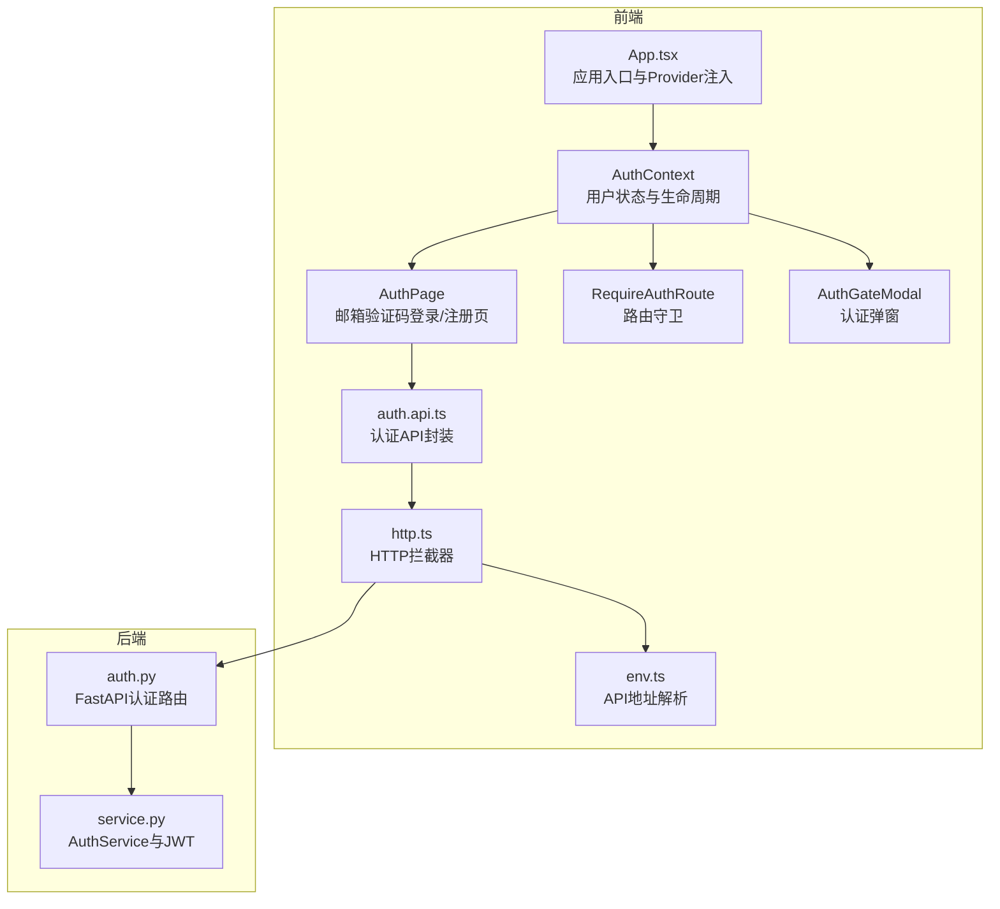
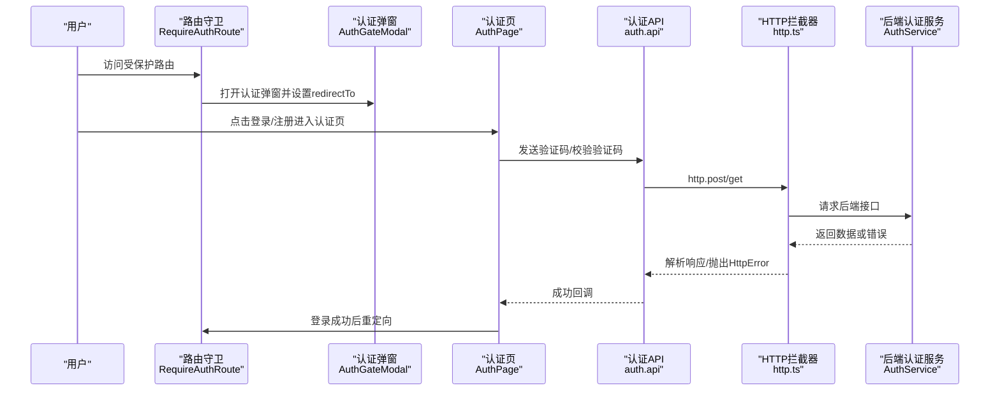
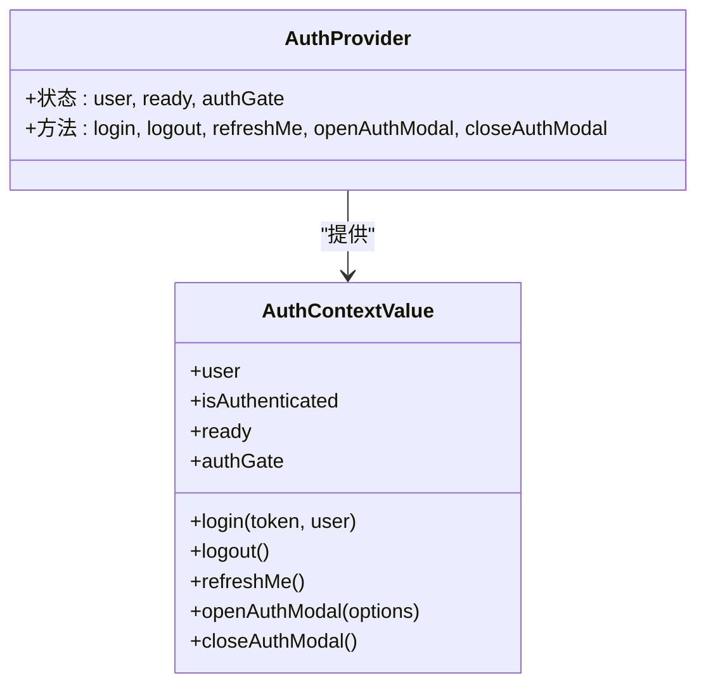
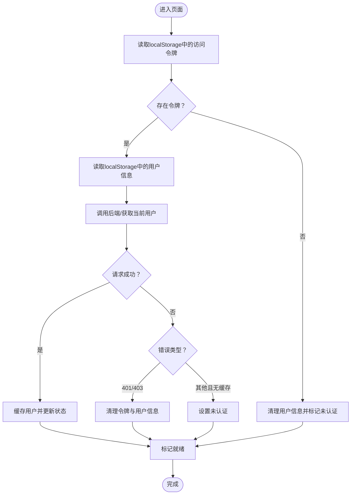
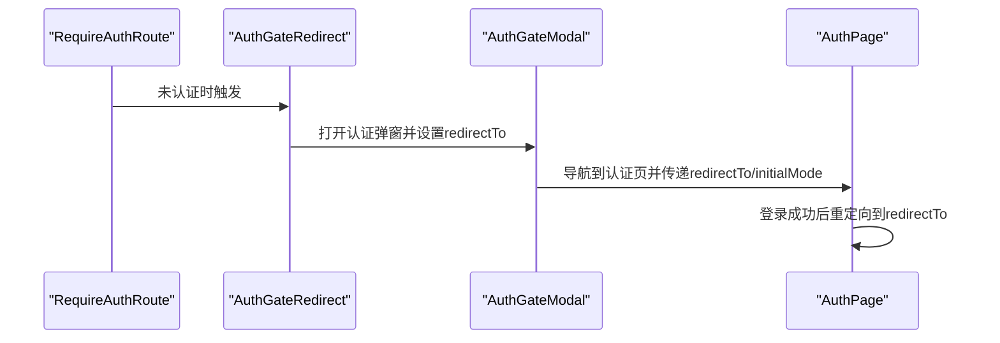
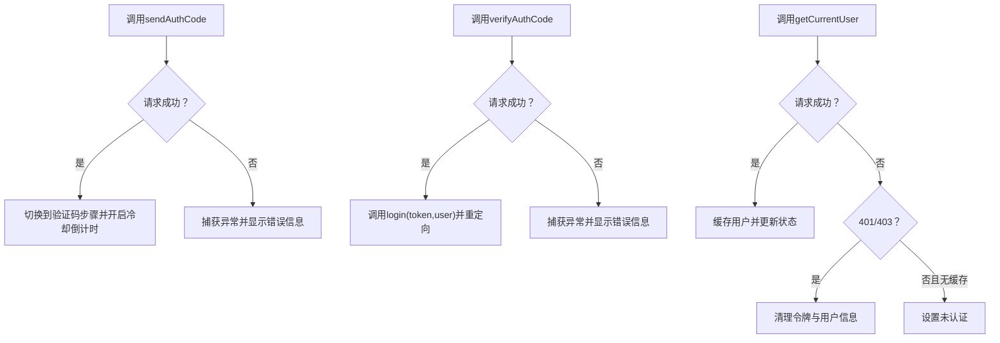
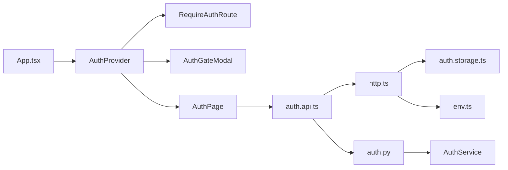

# 认证系统

<cite>
**本文引用的文件**
- [frontend/src/features/auth/model/auth.context.tsx](file://frontend/src/features/auth/model/auth.context.tsx)
- [frontend/src/features/auth/model/auth.types.ts](file://frontend/src/features/auth/model/auth.types.ts)
- [frontend/src/features/auth/model/auth.storage.ts](file://frontend/src/features/auth/model/auth.storage.ts)
- [frontend/src/features/auth/api/auth.api.ts](file://frontend/src/features/auth/api/auth.api.ts)
- [frontend/src/features/auth/ui/require-auth-route.tsx](file://frontend/src/features/auth/ui/require-auth-route.tsx)
- [frontend/src/features/auth/ui/auth-gate-modal.tsx](file://frontend/src/features/auth/ui/auth-gate-modal.tsx)
- [frontend/src/features/auth/ui/auth-page.tsx](file://frontend/src/features/auth/ui/auth-page.tsx)
- [frontend/src/shared/lib/http.ts](file://frontend/src/shared/lib/http.ts)
- [frontend/src/shared/config/env.ts](file://frontend/src/shared/config/env.ts)
- [frontend/src/shared/lib/analytics.ts](file://frontend/src/shared/lib/analytics.ts)
- [frontend/src/app/App.tsx](file://frontend/src/app/App.tsx)
- [frontend/src/main.tsx](file://frontend/src/main.tsx)
- [backend/app/api/auth.py](file://backend/app/api/auth.py)
- [backend/app/auth/service.py](file://backend/app/auth/service.py)
</cite>

## 目录
1. [简介](#简介)
2. [项目结构](#项目结构)
3. [核心组件](#核心组件)
4. [架构总览](#架构总览)
5. [详细组件分析](#详细组件分析)
6. [依赖关系分析](#依赖关系分析)
7. [性能考量](#性能考量)
8. [故障排查指南](#故障排查指南)
9. [结论](#结论)
10. [附录](#附录)

## 简介
本文件系统性梳理了前端认证体系的设计与实现，覆盖 OAuth 流程的前端对接思路、用户状态管理、权限控制、登录状态持久化与路由保护策略。文档同时解释认证 API 的调用方式、错误处理与重定向逻辑，并给出认证组件的使用方法、权限验证与安全注意事项。最后提供认证流程图与状态转换说明，帮助开发者快速理解与扩展。

## 项目结构
认证系统由“前端上下文与UI组件 + 共享HTTP与环境配置 + 后端认证API与服务”构成，采用分层设计：
- 前端层：认证上下文负责全局状态与生命周期；UI组件负责交互与路由保护；API封装负责与后端通信；共享模块负责HTTP拦截与环境解析。
- 后端层：FastAPI提供认证接口；AuthService实现邮箱验证码登录/注册与JWT签发；SQLite存储用户与验证码。

**图表来源**
- [frontend/src/app/App.tsx:1-17](file://frontend/src/app/App.tsx#L1-L17)
- [frontend/src/features/auth/model/auth.context.tsx:1-155](file://frontend/src/features/auth/model/auth.context.tsx#L1-L155)
- [frontend/src/features/auth/ui/auth-page.tsx:1-233](file://frontend/src/features/auth/ui/auth-page.tsx#L1-L233)
- [frontend/src/features/auth/ui/require-auth-route.tsx:1-35](file://frontend/src/features/auth/ui/require-auth-route.tsx#L1-L35)
- [frontend/src/features/auth/ui/auth-gate-modal.tsx:1-66](file://frontend/src/features/auth/ui/auth-gate-modal.tsx#L1-L66)
- [frontend/src/features/auth/api/auth.api.ts:1-21](file://frontend/src/features/auth/api/auth.api.ts#L1-L21)
- [frontend/src/shared/lib/http.ts:1-75](file://frontend/src/shared/lib/http.ts#L1-L75)
- [frontend/src/shared/config/env.ts:1-48](file://frontend/src/shared/config/env.ts#L1-L48)
- [backend/app/api/auth.py:1-36](file://backend/app/api/auth.py#L1-L36)
- [backend/app/auth/service.py:1-312](file://backend/app/auth/service.py#L1-L312)

**章节来源**
- [frontend/src/app/App.tsx:1-17](file://frontend/src/app/App.tsx#L1-L17)
- [frontend/src/main.tsx:1-12](file://frontend/src/main.tsx#L1-L12)

## 核心组件
- 认证上下文（AuthContext）
  - 负责用户状态、认证就绪态、认证弹窗状态、登录/登出、刷新用户信息等。
  - 提供useAuth钩子，确保在AuthProvider内使用。
- 认证存储（auth.storage）
  - 使用localStorage存储访问令牌与用户信息；使用sessionStorage存储待处理消息。
- 认证API（auth.api）
  - 封装发送验证码、校验验证码、获取当前用户信息三个接口。
- HTTP拦截器（http.ts）
  - 自动从localStorage读取令牌并附加到Authorization头；统一抛出HttpError异常。
- 路由保护（require-auth-route）
  - 在未认证且未就绪时显示加载态；未认证时通过AuthGateRedirect触发认证弹窗并重定向。
- 认证弹窗（auth-gate-modal）
  - 弹窗引导用户选择登录/注册，并跳转到认证页。
- 认证页（auth-page）
  - 实现邮箱输入、验证码输入、发送/验证流程、冷却时间与离开确认。
- 后端认证服务（auth.py, service.py）
  - 提供发送/校验验证码、获取当前用户接口；使用JWT签发访问令牌；SMTP发送邮件。

**章节来源**
- [frontend/src/features/auth/model/auth.context.tsx:1-155](file://frontend/src/features/auth/model/auth.context.tsx#L1-L155)
- [frontend/src/features/auth/model/auth.storage.ts:1-87](file://frontend/src/features/auth/model/auth.storage.ts#L1-L87)
- [frontend/src/features/auth/api/auth.api.ts:1-21](file://frontend/src/features/auth/api/auth.api.ts#L1-L21)
- [frontend/src/shared/lib/http.ts:1-75](file://frontend/src/shared/lib/http.ts#L1-L75)
- [frontend/src/features/auth/ui/require-auth-route.tsx:1-35](file://frontend/src/features/auth/ui/require-auth-route.tsx#L1-L35)
- [frontend/src/features/auth/ui/auth-gate-modal.tsx:1-66](file://frontend/src/features/auth/ui/auth-gate-modal.tsx#L1-L66)
- [frontend/src/features/auth/ui/auth-page.tsx:1-233](file://frontend/src/features/auth/ui/auth-page.tsx#L1-L233)
- [backend/app/api/auth.py:1-36](file://backend/app/api/auth.py#L1-L36)
- [backend/app/auth/service.py:1-312](file://backend/app/auth/service.py#L1-L312)

## 架构总览
认证系统采用“前端上下文 + UI组件 + API封装 + 后端服务”的分层架构。前端通过HTTP拦截器自动携带令牌访问后端；后端基于JWT进行鉴权与会话管理；前端在未认证时通过路由守卫与弹窗引导用户完成认证。

**图表来源**
- [frontend/src/features/auth/ui/require-auth-route.tsx:21-35](file://frontend/src/features/auth/ui/require-auth-route.tsx#L21-L35)
- [frontend/src/features/auth/ui/auth-gate-modal.tsx:13-66](file://frontend/src/features/auth/ui/auth-gate-modal.tsx#L13-L66)
- [frontend/src/features/auth/ui/auth-page.tsx:55-104](file://frontend/src/features/auth/ui/auth-page.tsx#L55-L104)
- [frontend/src/features/auth/api/auth.api.ts:10-20](file://frontend/src/features/auth/api/auth.api.ts#L10-L20)
- [frontend/src/shared/lib/http.ts:20-65](file://frontend/src/shared/lib/http.ts#L20-L65)
- [backend/app/auth/service.py:251-296](file://backend/app/auth/service.py#L251-L296)

## 详细组件分析

### 认证上下文（AuthContext）状态管理模式
- 状态字段
  - user：当前用户对象或空
  - isAuthenticated：根据user是否存在判定
  - ready：认证初始化完成标志
  - authGate：弹窗状态（open、redirectTo、initialMode）
- 关键方法
  - login(token, user)：写入本地存储、设置用户、埋点、标记就绪、关闭弹窗
  - logout()：清理本地存储、清空用户、重置埋点、重置弹窗状态
  - refreshMe()：读取本地token，若存在则调用后端“获取当前用户”，缓存用户并更新状态；对401/403做清理
  - openAuthModal(options)：设置弹窗打开、重定向路径与初始模式，必要时写入待处理消息
  - closeAuthModal()：关闭弹窗
- 生命周期
  - 应用启动时执行refreshMe，保证首次渲染即有正确的认证状态
  - 通过useMemo稳定导出上下文值，避免无谓重渲染

**图表来源**
- [frontend/src/features/auth/model/auth.context.tsx:29-146](file://frontend/src/features/auth/model/auth.context.tsx#L29-L146)

**章节来源**
- [frontend/src/features/auth/model/auth.context.tsx:43-146](file://frontend/src/features/auth/model/auth.context.tsx#L43-L146)

### 登录状态持久化与令牌管理
- 本地存储键
  - 访问令牌：ai-travel-access-token（localStorage）
  - 用户信息：ai-travel-auth-user（localStorage）
  - 待处理消息：ai-travel-pending-message（sessionStorage）
- 读取/写入/清理
  - get/set/clear对应键值，JSON序列化用户信息
  - 对异常JSON进行清理，避免脏数据导致崩溃
- HTTP拦截器
  - 自动从localStorage读取令牌并附加到Authorization头
  - 统一捕获非2xx响应，抛出HttpError，包含状态码与可选错误体

**图表来源**
- [frontend/src/features/auth/model/auth.storage.ts:1-87](file://frontend/src/features/auth/model/auth.storage.ts#L1-L87)
- [frontend/src/shared/lib/http.ts:20-65](file://frontend/src/shared/lib/http.ts#L20-L65)
- [frontend/src/features/auth/model/auth.context.tsx:81-110](file://frontend/src/features/auth/model/auth.context.tsx#L81-L110)

**章节来源**
- [frontend/src/features/auth/model/auth.storage.ts:1-87](file://frontend/src/features/auth/model/auth.storage.ts#L1-L87)
- [frontend/src/shared/lib/http.ts:1-75](file://frontend/src/shared/lib/http.ts#L1-L75)
- [frontend/src/features/auth/model/auth.context.tsx:81-110](file://frontend/src/features/auth/model/auth.context.tsx#L81-L110)

### 路由保护策略与重定向逻辑
- RequireAuthRoute
  - 未就绪：显示加载态
  - 未认证：通过AuthGateRedirect打开认证弹窗，设置redirectTo为当前路径，随后重定向到首页
- AuthGateRedirect
  - 触发openAuthModal，传入redirectTo与initialMode，然后导航到默认路径
- AuthGateModal
  - 展示登录/注册按钮，点击后关闭弹窗并导航到认证页，携带redirectTo与initialMode
- AuthPage
  - 根据路由state决定初始模式与重定向路径；登录成功后立即重定向

**图表来源**
- [frontend/src/features/auth/ui/require-auth-route.tsx:21-35](file://frontend/src/features/auth/ui/require-auth-route.tsx#L21-L35)
- [frontend/src/features/auth/ui/auth-gate-modal.tsx:13-66](file://frontend/src/features/auth/ui/auth-gate-modal.tsx#L13-L66)
- [frontend/src/features/auth/ui/auth-page.tsx:13-53](file://frontend/src/features/auth/ui/auth-page.tsx#L13-L53)

**章节来源**
- [frontend/src/features/auth/ui/require-auth-route.tsx:1-35](file://frontend/src/features/auth/ui/require-auth-route.tsx#L1-L35)
- [frontend/src/features/auth/ui/auth-gate-modal.tsx:1-66](file://frontend/src/features/auth/ui/auth-gate-modal.tsx#L1-L66)
- [frontend/src/features/auth/ui/auth-page.tsx:1-233](file://frontend/src/features/auth/ui/auth-page.tsx#L1-L233)

### 认证API调用方式、错误处理与重定向
- 发送验证码
  - 参数：邮箱、用途（登录/注册）
  - 成功：返回有效期秒数
  - 失败：捕获异常并提示
- 校验验证码
  - 参数：邮箱、验证码、用途
  - 成功：返回访问令牌与用户信息，调用login并重定向
  - 失败：捕获异常并提示
- 获取当前用户
  - 用于刷新用户信息，失败时按401/403清理本地状态
- 错误处理
  - 前端：统一抛出HttpError，包含状态码与可选错误体
  - 后端：针对邮箱格式、验证码状态、用户状态返回相应HTTP状态码

**图表来源**
- [frontend/src/features/auth/api/auth.api.ts:10-20](file://frontend/src/features/auth/api/auth.api.ts#L10-L20)
- [frontend/src/features/auth/ui/auth-page.tsx:55-104](file://frontend/src/features/auth/ui/auth-page.tsx#L55-L104)
- [frontend/src/features/auth/model/auth.context.tsx:81-110](file://frontend/src/features/auth/model/auth.context.tsx#L81-L110)
- [backend/app/auth/service.py:251-296](file://backend/app/auth/service.py#L251-L296)

**章节来源**
- [frontend/src/features/auth/api/auth.api.ts:1-21](file://frontend/src/features/auth/api/auth.api.ts#L1-L21)
- [frontend/src/features/auth/ui/auth-page.tsx:55-104](file://frontend/src/features/auth/ui/auth-page.tsx#L55-L104)
- [frontend/src/features/auth/model/auth.context.tsx:81-110](file://frontend/src/features/auth/model/auth.context.tsx#L81-L110)
- [backend/app/auth/service.py:251-296](file://backend/app/auth/service.py#L251-L296)

### 认证组件使用方法与权限验证
- 在应用根节点注入AuthProvider，确保全应用可用useAuth
- 对受保护路由包裹RequireAuthRoute，未认证时自动弹窗并重定向
- 在需要认证的页面或功能中调用useAuth获取用户状态与登录/登出能力
- 权限验证建议
  - 基于isAuthenticated进行UI显隐与功能启用
  - 对敏感操作增加二次确认与错误提示
  - 结合后端接口返回的用户角色/权限字段进行细粒度控制（如需）

**章节来源**
- [frontend/src/app/App.tsx:9-16](file://frontend/src/app/App.tsx#L9-L16)
- [frontend/src/features/auth/ui/require-auth-route.tsx:21-35](file://frontend/src/features/auth/ui/require-auth-route.tsx#L21-L35)
- [frontend/src/features/auth/model/auth.context.tsx:148-155](file://frontend/src/features/auth/model/auth.context.tsx#L148-L155)

### 安全考虑
- 令牌存储
  - 使用localStorage存储访问令牌，注意XSS风险；建议配合HttpOnly Cookie（后端实现）与CSP策略
- 传输安全
  - 通过HTTPS部署，避免令牌在传输中泄露
- 验证码安全
  - 后端对验证码进行哈希比较，防止时序攻击；限制过期时间与重试次数
- 埋点与隐私
  - 登出时重置埋点，避免跨用户数据污染
- OAuth扩展
  - 当前实现为邮箱验证码登录；如需OAuth，可在认证页增加第三方登录入口，后端新增OAuth路由与服务，前端在认证上下文中接入第三方回调与令牌交换

**章节来源**
- [frontend/src/features/auth/model/auth.storage.ts:14-26](file://frontend/src/features/auth/model/auth.storage.ts#L14-L26)
- [frontend/src/shared/lib/analytics.ts:45-48](file://frontend/src/shared/lib/analytics.ts#L45-L48)
- [backend/app/auth/service.py:128-143](file://backend/app/auth/service.py#L128-L143)

## 依赖关系分析
- 前端依赖链
  - App.tsx -> AuthProvider -> 各UI组件与路由守卫
  - UI组件 -> auth.api -> http.ts -> env.ts
  - http.ts -> auth.storage
- 后端依赖链
  - auth.py -> AuthService -> AuthSQLiteStore/JWT/SMTP
- 耦合与内聚
  - 前端各模块通过上下文解耦，UI组件仅依赖useAuth与路由参数
  - HTTP拦截器集中处理令牌与错误，提升一致性

**图表来源**
- [frontend/src/app/App.tsx:1-17](file://frontend/src/app/App.tsx#L1-L17)
- [frontend/src/features/auth/model/auth.context.tsx:1-155](file://frontend/src/features/auth/model/auth.context.tsx#L1-L155)
- [frontend/src/features/auth/ui/require-auth-route.tsx:1-35](file://frontend/src/features/auth/ui/require-auth-route.tsx#L1-L35)
- [frontend/src/features/auth/ui/auth-gate-modal.tsx:1-66](file://frontend/src/features/auth/ui/auth-gate-modal.tsx#L1-L66)
- [frontend/src/features/auth/ui/auth-page.tsx:1-233](file://frontend/src/features/auth/ui/auth-page.tsx#L1-L233)
- [frontend/src/features/auth/api/auth.api.ts:1-21](file://frontend/src/features/auth/api/auth.api.ts#L1-L21)
- [frontend/src/shared/lib/http.ts:1-75](file://frontend/src/shared/lib/http.ts#L1-L75)
- [frontend/src/features/auth/model/auth.storage.ts:1-87](file://frontend/src/features/auth/model/auth.storage.ts#L1-L87)
- [frontend/src/shared/config/env.ts:1-48](file://frontend/src/shared/config/env.ts#L1-L48)
- [backend/app/api/auth.py:1-36](file://backend/app/api/auth.py#L1-L36)
- [backend/app/auth/service.py:1-312](file://backend/app/auth/service.py#L1-L312)

**章节来源**
- [frontend/src/app/App.tsx:1-17](file://frontend/src/app/App.tsx#L1-L17)
- [frontend/src/features/auth/model/auth.context.tsx:1-155](file://frontend/src/features/auth/model/auth.context.tsx#L1-L155)
- [frontend/src/features/auth/api/auth.api.ts:1-21](file://frontend/src/features/auth/api/auth.api.ts#L1-L21)
- [frontend/src/shared/lib/http.ts:1-75](file://frontend/src/shared/lib/http.ts#L1-L75)
- [backend/app/api/auth.py:1-36](file://backend/app/api/auth.py#L1-L36)
- [backend/app/auth/service.py:1-312](file://backend/app/auth/service.py#L1-L312)

## 性能考量
- 状态缓存
  - 初次加载优先使用localStorage缓存的用户信息，减少不必要的后端请求
- 并发优化
  - login/refreshMe内部已去重与幂等处理，避免重复请求
- UI渲染
  - 使用useMemo稳定上下文值，降低子组件重渲染频率
- 网络请求
  - http.ts统一处理参数拼接与错误，减少重复逻辑

**章节来源**
- [frontend/src/features/auth/model/auth.context.tsx:90-99](file://frontend/src/features/auth/model/auth.context.tsx#L90-L99)
- [frontend/src/shared/lib/http.ts:20-65](file://frontend/src/shared/lib/http.ts#L20-L65)

## 故障排查指南
- 常见问题
  - 无法获取当前用户：检查令牌是否过期或被清理；确认后端JWT密钥配置
  - 验证码发送失败：检查SMTP配置与网络；查看后端日志
  - 登录后仍提示未认证：确认login调用是否成功、localStorage写入是否生效
  - 路由守卫未生效：确认RequireAuthRoute包裹范围与路由层级
- 排查步骤
  - 检查浏览器localStorage中令牌与用户信息
  - 查看Network面板中认证相关请求与响应
  - 在控制台打印useAuth状态与错误堆栈
  - 后端查看AuthService日志与SMTP错误信息

**章节来源**
- [frontend/src/features/auth/model/auth.storage.ts:1-87](file://frontend/src/features/auth/model/auth.storage.ts#L1-L87)
- [frontend/src/shared/lib/http.ts:8-18](file://frontend/src/shared/lib/http.ts#L8-L18)
- [backend/app/auth/service.py:102-120](file://backend/app/auth/service.py#L102-L120)

## 结论
该认证系统通过上下文集中管理用户状态、UI组件实现路由保护与交互引导、API封装与HTTP拦截器统一处理令牌与错误，形成清晰的前后端协作模式。系统具备良好的可扩展性，可在此基础上接入OAuth等其他认证方式，并进一步完善权限模型与安全策略。

## 附录
- OAuth扩展建议
  - 前端：在认证页增加第三方登录入口，处理回调并调用后端交换令牌
  - 后端：新增OAuth路由与服务，支持多种提供商与用户映射
- 环境变量
  - VITE_API_BASE_URL：API基础地址
  - VITE_AMPLITUDE_API_KEY：埋点SDK密钥
  - JWT_SECRET：JWT签名密钥
  - SMTP_*：SMTP发信配置

**章节来源**
- [frontend/src/shared/config/env.ts:1-48](file://frontend/src/shared/config/env.ts#L1-L48)
- [backend/app/auth/service.py:59-82](file://backend/app/auth/service.py#L59-L82)