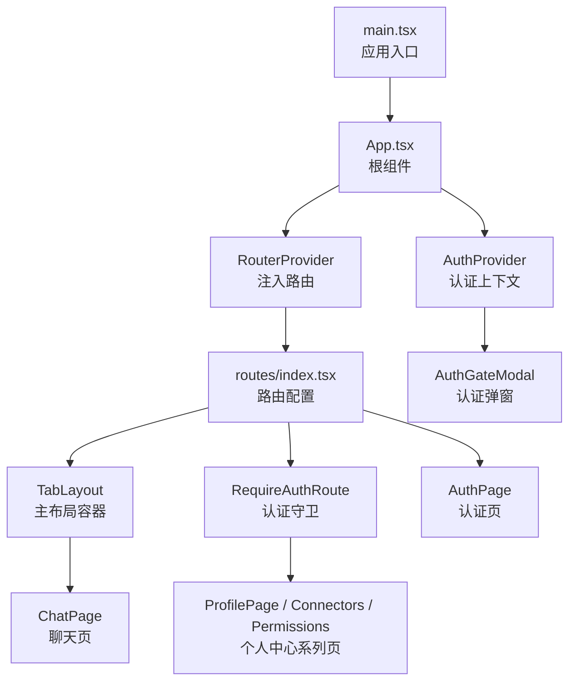
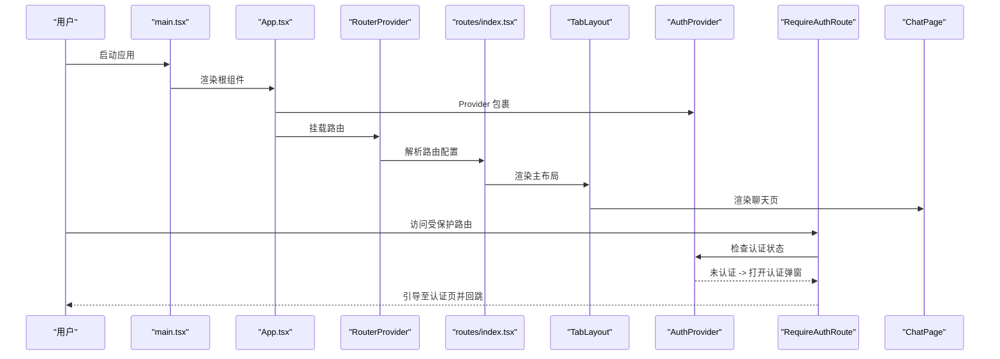
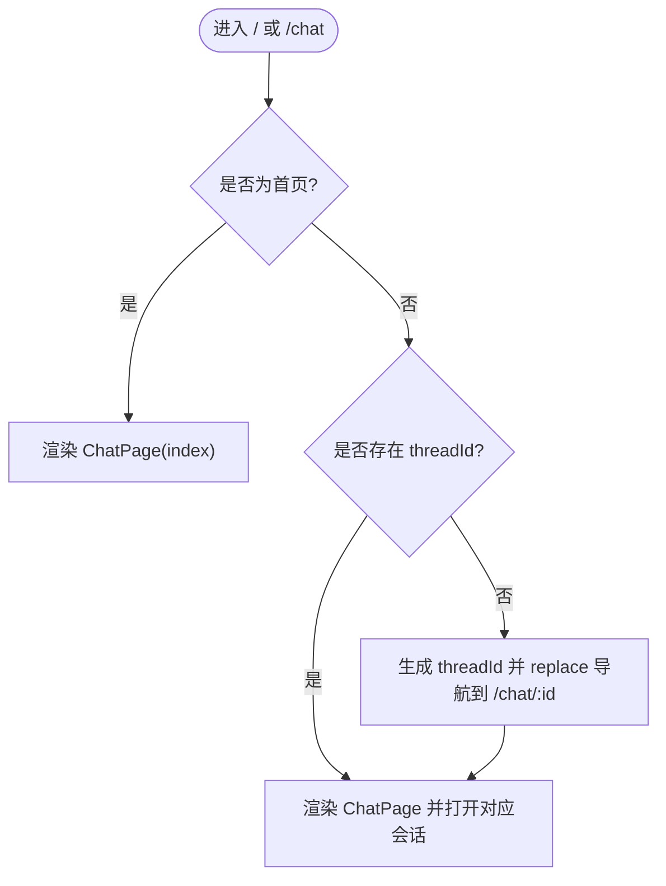
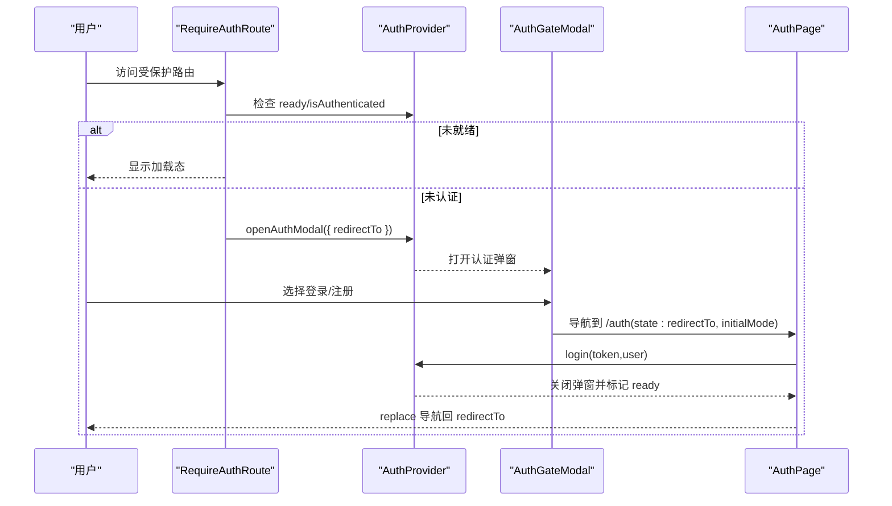
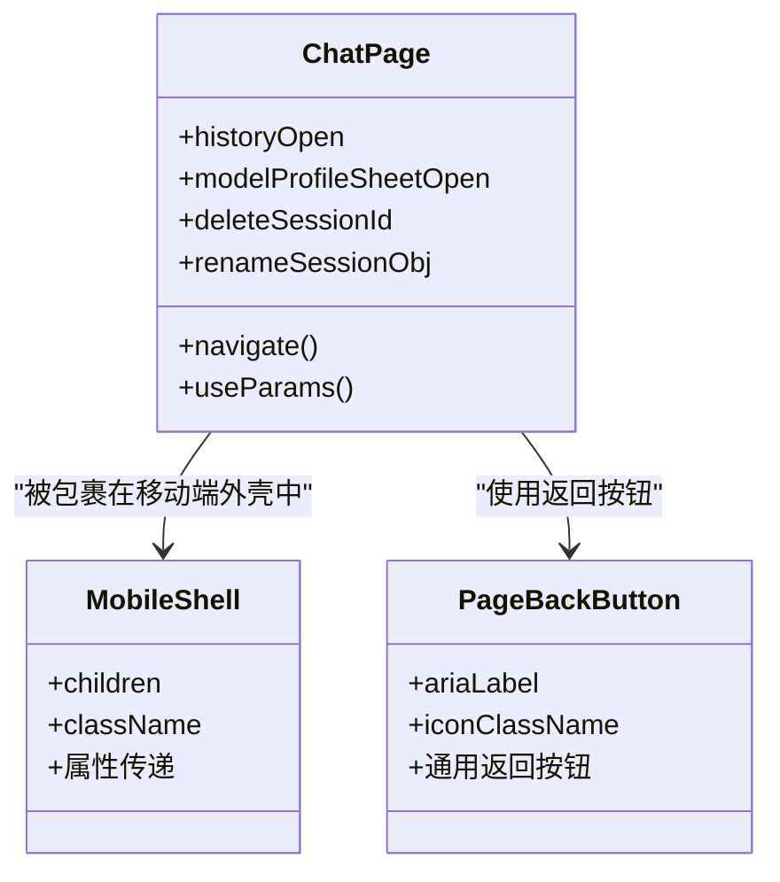
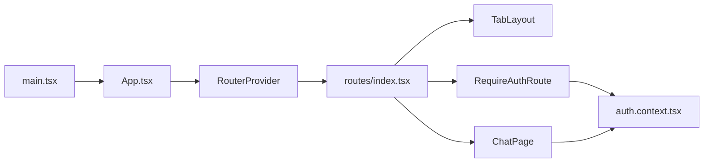

# 路由与导航

<cite>
**本文引用的文件**
- [frontend/src/app/routes/index.tsx](file://frontend/src/app/routes/index.tsx)
- [frontend/src/app/App.tsx](file://frontend/src/app/App.tsx)
- [frontend/src/main.tsx](file://frontend/src/main.tsx)
- [frontend/src/features/auth/ui/require-auth-route.tsx](file://frontend/src/features/auth/ui/require-auth-route.tsx)
- [frontend/src/shared/layouts/tab-layout.tsx](file://frontend/src/shared/layouts/tab-layout.tsx)
- [frontend/src/features/auth/model/auth.context.tsx](file://frontend/src/features/auth/model/auth.context.tsx)
- [frontend/src/features/chat/ui/chat-page.tsx](file://frontend/src/features/chat/ui/chat-page.tsx)
- [frontend/src/shared/layouts/mobile-shell.tsx](file://frontend/src/shared/layouts/mobile-shell.tsx)
- [frontend/src/features/auth/ui/auth-gate-modal.tsx](file://frontend/src/features/auth/ui/auth-gate-modal.tsx)
- [frontend/src/features/auth/ui/auth-page.tsx](file://frontend/src/features/auth/ui/auth-page.tsx)
- [frontend/src/shared/ui/page-back-button.tsx](file://frontend/src/shared/ui/page-back-button.tsx)
- [frontend/package.json](file://frontend/package.json)
- [frontend/src/app/styles.css](file://frontend/src/app/styles.css)
- [frontend/tailwind.config.ts](file://frontend/tailwind.config.ts)
</cite>

## 目录
1. [简介](#简介)
2. [项目结构](#项目结构)
3. [核心组件](#核心组件)
4. [架构总览](#架构总览)
5. [详细组件分析](#详细组件分析)
6. [依赖关系分析](#依赖关系分析)
7. [性能考量](#性能考量)
8. [故障排查指南](#故障排查指南)
9. [结论](#结论)
10. [附录](#附录)

## 简介
本文件系统性阐述基于 React Router 7.14.0 的前端路由与导航体系，覆盖页面路由定义、嵌套路由与动态路由参数处理、路由守卫与权限验证、导航拦截机制、移动端适配、页面切换动画与导航状态管理。文档同时提供路由配置示例、导航组件使用方法与最佳实践，帮助开发者快速理解并扩展该应用的路由能力。

## 项目结构
前端采用“按特性分层 + 路由集中配置”的组织方式：
- 路由入口与配置集中在 app/routes/index.tsx，统一创建浏览器路由并定义顶层与嵌套路由。
- 应用根组件 App.tsx 注入认证上下文与 RouterProvider，完成路由挂载。
- 页面级路由通过 pages/* 映射到 features/* 中的业务组件，实现“页面壳”与“功能页”的解耦。
- 移动端适配通过 shared/layouts 下的布局组件强制约束移动端尺寸与状态栏等视觉元素。
- 导航拦截与权限验证通过 require-auth-route.tsx 与 auth.context.tsx 协作实现。

图表来源
- [frontend/src/main.tsx:1-12](file://frontend/src/main.tsx#L1-L12)
- [frontend/src/app/App.tsx:1-17](file://frontend/src/app/App.tsx#L1-L17)
- [frontend/src/app/routes/index.tsx:1-56](file://frontend/src/app/routes/index.tsx#L1-L56)
- [frontend/src/shared/layouts/tab-layout.tsx:1-15](file://frontend/src/shared/layouts/tab-layout.tsx#L1-L15)
- [frontend/src/features/auth/ui/require-auth-route.tsx:1-35](file://frontend/src/features/auth/ui/require-auth-route.tsx#L1-L35)
- [frontend/src/features/auth/model/auth.context.tsx:1-155](file://frontend/src/features/auth/model/auth.context.tsx#L1-L155)

章节来源
- [frontend/src/main.tsx:1-12](file://frontend/src/main.tsx#L1-L12)
- [frontend/src/app/App.tsx:1-17](file://frontend/src/app/App.tsx#L1-L17)
- [frontend/src/app/routes/index.tsx:1-56](file://frontend/src/app/routes/index.tsx#L1-L56)

## 核心组件
- 浏览器路由创建：使用 createBrowserRouter 定义路由表，支持嵌套路由与索引路由。
- 主布局容器：TabLayout 包裹 Outlet 并内嵌移动端外壳与认证弹窗。
- 认证守卫：RequireAuthRoute 在子路由层拦截未登录用户，引导至认证页。
- 认证上下文：AuthProvider 提供登录、登出、刷新用户信息与认证弹窗控制。
- 移动端外壳：MobileShell 强制约束最大宽度、圆角边框与顶部状态栏占位，适配移动端体验。
- 动态路由参数：聊天页通过 useParams 获取 threadId，结合 useNavigate 实现动态跳转与同步。
- 导航拦截：AuthGateModal 与 AuthPage 共同实现“访问受保护资源时的拦截与回跳”。

章节来源
- [frontend/src/app/routes/index.tsx:11-55](file://frontend/src/app/routes/index.tsx#L11-L55)
- [frontend/src/shared/layouts/tab-layout.tsx:5-14](file://frontend/src/shared/layouts/tab-layout.tsx#L5-L14)
- [frontend/src/features/auth/ui/require-auth-route.tsx:21-34](file://frontend/src/features/auth/ui/require-auth-route.tsx#L21-L34)
- [frontend/src/features/auth/model/auth.context.tsx:43-146](file://frontend/src/features/auth/model/auth.context.tsx#L43-L146)
- [frontend/src/shared/layouts/mobile-shell.tsx:45-78](file://frontend/src/shared/layouts/mobile-shell.tsx#L45-L78)
- [frontend/src/features/chat/ui/chat-page.tsx:148-234](file://frontend/src/features/chat/ui/chat-page.tsx#L148-L234)
- [frontend/src/features/auth/ui/auth-gate-modal.tsx:13-65](file://frontend/src/features/auth/ui/auth-gate-modal.tsx#L13-L65)
- [frontend/src/features/auth/ui/auth-page.tsx:13-45](file://frontend/src/features/auth/ui/auth-page.tsx#L13-L45)

## 架构总览
下图展示从应用启动到路由渲染、认证拦截与页面导航的关键交互：

图表来源
- [frontend/src/main.tsx:7-11](file://frontend/src/main.tsx#L7-L11)
- [frontend/src/app/App.tsx:9-16](file://frontend/src/app/App.tsx#L9-L16)
- [frontend/src/app/routes/index.tsx:11-55](file://frontend/src/app/routes/index.tsx#L11-L55)
- [frontend/src/shared/layouts/tab-layout.tsx:5-14](file://frontend/src/shared/layouts/tab-layout.tsx#L5-L14)
- [frontend/src/features/auth/ui/require-auth-route.tsx:21-34](file://frontend/src/features/auth/ui/require-auth-route.tsx#L21-L34)
- [frontend/src/features/auth/model/auth.context.tsx:43-146](file://frontend/src/features/auth/model/auth.context.tsx#L43-L146)

## 详细组件分析

### 路由配置与嵌套路由
- 顶层路由
  - “/auth”：认证页。
  - “/”：主布局 TabLayout，作为嵌套路由的父容器。
- 嵌套路由
  - 首页与聊天页：index 与 /chat；动态路由参数 /chat/:threadId。
  - 受保护路由：以 RequireAuthRoute 为父，包含 profile、connectors、permissions 等子路由。
- 动态路由参数处理
  - ChatPage 使用 useParams 获取 threadId，并在 threadId 变化时通过 useNavigate 同步更新 URL，确保 URL 与当前会话一致。

图表来源
- [frontend/src/app/routes/index.tsx:19-31](file://frontend/src/app/routes/index.tsx#L19-L31)
- [frontend/src/features/chat/ui/chat-page.tsx:148-234](file://frontend/src/features/chat/ui/chat-page.tsx#L148-L234)

章节来源
- [frontend/src/app/routes/index.tsx:11-55](file://frontend/src/app/routes/index.tsx#L11-L55)
- [frontend/src/features/chat/ui/chat-page.tsx:148-234](file://frontend/src/features/chat/ui/chat-page.tsx#L148-L234)

### 路由守卫与权限验证
- RequireAuthRoute
  - 在路由层级拦截未认证用户，显示 AuthGateRedirect 并调用 openAuthModal 打开认证弹窗，随后 replace 导航回聊天页。
  - 若认证未就绪，显示加载态。
- AuthGateModal
  - 基于 AuthProvider 的 authGate 状态控制弹窗显示与回跳地址，点击“登录/注册”后导航到 /auth 并携带 redirectTo 与初始模式。
- AuthProvider
  - 维护用户状态、ready 标志与认证弹窗状态；提供 login/logout/refreshMe/openAuthModal/closeAuthModal。
  - 刷新用户信息时处理 401/403 场景并清理本地存储。
- AuthPage
  - 读取 location.state 中的 redirectTo 与 initialMode，完成邮箱验证码登录/注册后，replace 导航回 redirectTo。

图表来源
- [frontend/src/features/auth/ui/require-auth-route.tsx:21-34](file://frontend/src/features/auth/ui/require-auth-route.tsx#L21-L34)
- [frontend/src/features/auth/model/auth.context.tsx:56-66](file://frontend/src/features/auth/model/auth.context.tsx#L56-L66)
- [frontend/src/features/auth/ui/auth-gate-modal.tsx:13-25](file://frontend/src/features/auth/ui/auth-gate-modal.tsx#L13-L25)
- [frontend/src/features/auth/ui/auth-page.tsx:13-45](file://frontend/src/features/auth/ui/auth-page.tsx#L13-L45)

章节来源
- [frontend/src/features/auth/ui/require-auth-route.tsx:1-35](file://frontend/src/features/auth/ui/require-auth-route.tsx#L1-L35)
- [frontend/src/features/auth/model/auth.context.tsx:43-146](file://frontend/src/features/auth/model/auth.context.tsx#L43-L146)
- [frontend/src/features/auth/ui/auth-gate-modal.tsx:1-66](file://frontend/src/features/auth/ui/auth-gate-modal.tsx#L1-L66)
- [frontend/src/features/auth/ui/auth-page.tsx:1-233](file://frontend/src/features/auth/ui/auth-page.tsx#L1-L233)

### 移动端适配与导航状态管理
- 移动端外壳
  - MobileShell 强制最大宽度、圆角边框与顶部状态栏占位，保证在桌面端与移动端的一致体验。
- 导航状态
  - ChatPage 内部维护历史抽屉、模型配置面板、删除/重命名会话对话框等状态，配合 useNavigate 进行页面级导航。
  - PageBackButton 提供通用的返回按钮组件，便于在各页面复用。

图表来源
- [frontend/src/shared/layouts/mobile-shell.tsx:45-78](file://frontend/src/shared/layouts/mobile-shell.tsx#L45-L78)
- [frontend/src/features/chat/ui/chat-page.tsx:148-234](file://frontend/src/features/chat/ui/chat-page.tsx#L148-L234)
- [frontend/src/shared/ui/page-back-button.tsx:12-31](file://frontend/src/shared/ui/page-back-button.tsx#L12-L31)

章节来源
- [frontend/src/shared/layouts/mobile-shell.tsx:1-79](file://frontend/src/shared/layouts/mobile-shell.tsx#L1-L79)
- [frontend/src/features/chat/ui/chat-page.tsx:148-234](file://frontend/src/features/chat/ui/chat-page.tsx#L148-L234)
- [frontend/src/shared/ui/page-back-button.tsx:1-32](file://frontend/src/shared/ui/page-back-button.tsx#L1-L32)

### 页面切换动画与导航状态管理
- 动画与过渡
  - Tailwind 配置提供 slide-in-from-right、fade-in 等动画类，可用于抽屉、弹窗等组件的入场/出场过渡。
  - 样式文件中定义了淡入、打字点等动画，可结合页面切换场景使用。
- 导航状态
  - ChatPage 内部通过多个 useState 管理历史抽屉、模型配置面板、删除/重命名会话等 UI 状态，配合 useNavigate 实现页面级导航与回退。

章节来源
- [frontend/tailwind.config.ts:83-98](file://frontend/tailwind.config.ts#L83-L98)
- [frontend/src/app/styles.css:94-140](file://frontend/src/app/styles.css#L94-L140)
- [frontend/src/features/chat/ui/chat-page.tsx:176-181](file://frontend/src/features/chat/ui/chat-page.tsx#L176-L181)

## 依赖关系分析
- 路由与组件依赖
  - main.tsx 依赖 App.tsx；App.tsx 依赖 RouterProvider 与 AuthProvider；RouterProvider 依赖 routes/index.tsx。
  - routes/index.tsx 依赖 TabLayout、RequireAuthRoute、各页面组件。
  - RequireAuthRoute 依赖 AuthProvider 与 useLocation/useNavigate。
  - ChatPage 依赖 useNavigate/useParams 与认证上下文。
- 外部依赖
  - React Router 版本 7.14.0，提供 createBrowserRouter、Outlet、useNavigate、useParams 等能力。

图表来源
- [frontend/src/main.tsx:7-11](file://frontend/src/main.tsx#L7-L11)
- [frontend/src/app/App.tsx:9-16](file://frontend/src/app/App.tsx#L9-L16)
- [frontend/src/app/routes/index.tsx:11-55](file://frontend/src/app/routes/index.tsx#L11-L55)
- [frontend/src/features/auth/ui/require-auth-route.tsx:21-34](file://frontend/src/features/auth/ui/require-auth-route.tsx#L21-L34)
- [frontend/src/features/auth/model/auth.context.tsx:43-146](file://frontend/src/features/auth/model/auth.context.tsx#L43-L146)
- [frontend/src/features/chat/ui/chat-page.tsx:148-234](file://frontend/src/features/chat/ui/chat-page.tsx#L148-L234)

章节来源
- [frontend/package.json:28](file://frontend/package.json#L28)
- [frontend/src/app/routes/index.tsx:11-55](file://frontend/src/app/routes/index.tsx#L11-L55)

## 性能考量
- 路由懒加载与代码分割
  - 建议将大型页面组件通过动态导入实现懒加载，减少首屏体积。
- 嵌套路由渲染优化
  - 将不常变化的布局组件（如 TabLayout）稳定化，避免不必要的重渲染。
- 认证状态缓存
  - AuthProvider 已具备本地存储与刷新逻辑，建议在高频导航场景下避免重复请求。
- 动态路由参数同步
  - ChatPage 对 threadId 的同步更新应避免在短时间内频繁触发导航，必要时使用防抖或引用变量进行去抖。

## 故障排查指南
- 未登录访问受保护路由
  - 现象：RequireAuthRoute 显示加载态或弹出认证弹窗。
  - 排查：检查 AuthProvider 的 ready 与 isAuthenticated 状态；确认 openAuthModal 是否正确传入 redirectTo。
- 认证弹窗无法关闭或回跳异常
  - 现象：认证弹窗不消失或回跳地址错误。
  - 排查：确认 AuthGateModal 的 state 传递与 AuthPage 的 replace 导航逻辑。
- 动态路由参数不同步
  - 现象：URL 与当前会话不一致。
  - 排查：检查 ChatPage 中 useParams 与 useNavigate 的使用，确保在 threadId 更新时及时 replace 导航。
- 移动端显示异常
  - 现象：页面超出最大宽度或边框不生效。
  - 排查：确认 MobileShell 的样式类与 Tailwind 配置，检查媒体查询断点。

章节来源
- [frontend/src/features/auth/ui/require-auth-route.tsx:21-34](file://frontend/src/features/auth/ui/require-auth-route.tsx#L21-L34)
- [frontend/src/features/auth/ui/auth-gate-modal.tsx:13-25](file://frontend/src/features/auth/ui/auth-gate-modal.tsx#L13-L25)
- [frontend/src/features/auth/ui/auth-page.tsx:13-45](file://frontend/src/features/auth/ui/auth-page.tsx#L13-L45)
- [frontend/src/features/chat/ui/chat-page.tsx:148-234](file://frontend/src/features/chat/ui/chat-page.tsx#L148-L234)
- [frontend/src/shared/layouts/mobile-shell.tsx:45-78](file://frontend/src/shared/layouts/mobile-shell.tsx#L45-L78)

## 结论
该路由与导航体系以 React Router 7.14.0 为核心，结合自定义认证守卫与移动端外壳，实现了清晰的页面路由、嵌套与动态参数处理、权限拦截与回跳、以及移动端适配。通过将路由配置集中管理、认证状态与 UI 弹窗解耦，系统具备良好的可维护性与扩展性。建议后续引入懒加载与更细粒度的状态管理，进一步提升性能与开发效率。

## 附录
- 路由配置示例路径
  - [路由配置:11-55](file://frontend/src/app/routes/index.tsx#L11-L55)
- 导航组件使用示例路径
  - [认证守卫:21-34](file://frontend/src/features/auth/ui/require-auth-route.tsx#L21-L34)
  - [认证弹窗:13-65](file://frontend/src/features/auth/ui/auth-gate-modal.tsx#L13-L65)
  - [认证页:13-45](file://frontend/src/features/auth/ui/auth-page.tsx#L13-L45)
  - [聊天页导航与动态参数:148-234](file://frontend/src/features/chat/ui/chat-page.tsx#L148-L234)
  - [移动端外壳:45-78](file://frontend/src/shared/layouts/mobile-shell.tsx#L45-L78)
  - [返回按钮:12-31](file://frontend/src/shared/ui/page-back-button.tsx#L12-L31)
- 最佳实践
  - 将大型页面组件动态导入，减少首屏体积。
  - 在嵌套路由中保持父容器稳定，避免不必要的重渲染。
  - 使用状态管理工具（如 Zustand 或 Redux Toolkit）集中管理导航与认证状态，提升可测试性与可维护性。
  - 为抽屉、弹窗等组件添加动画类，提升用户体验。