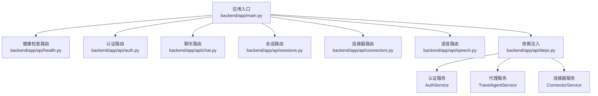
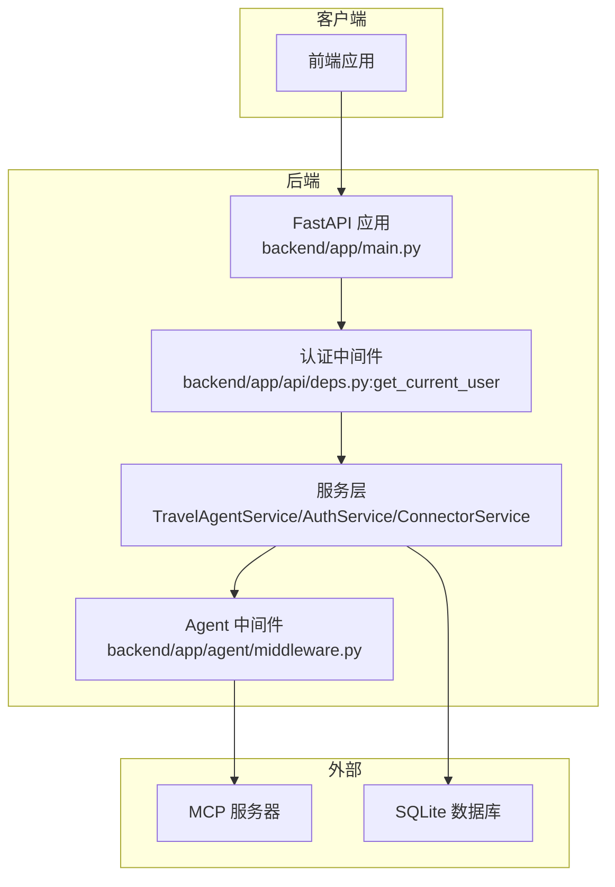
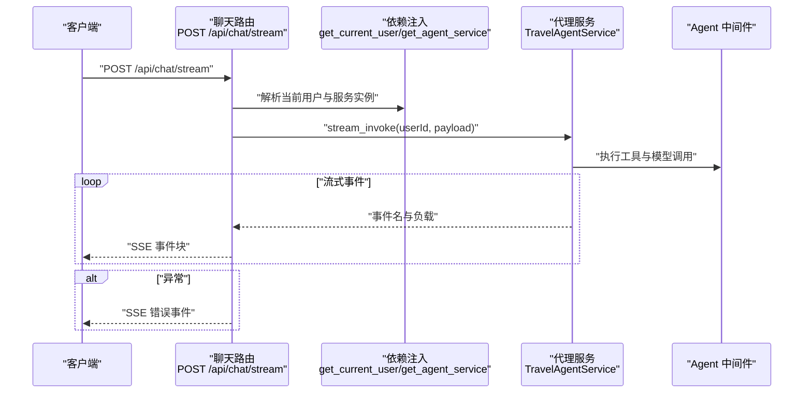
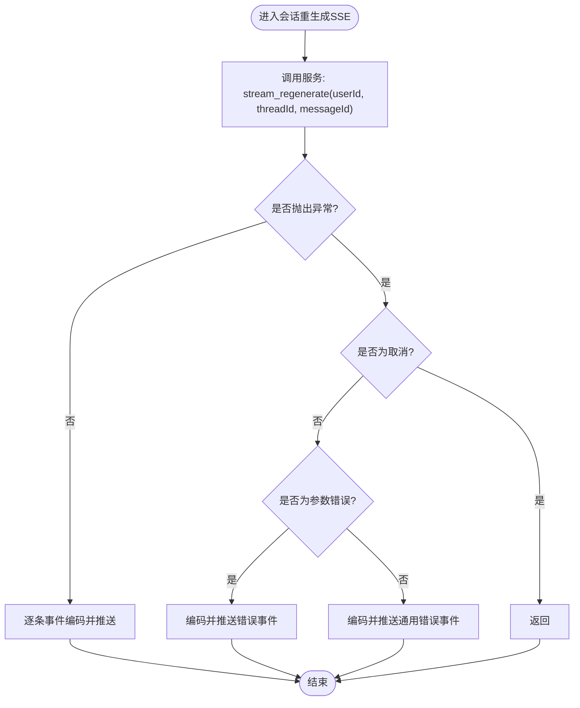
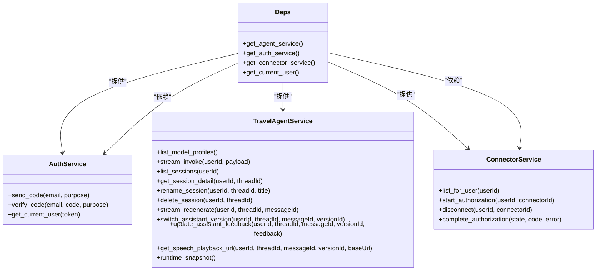
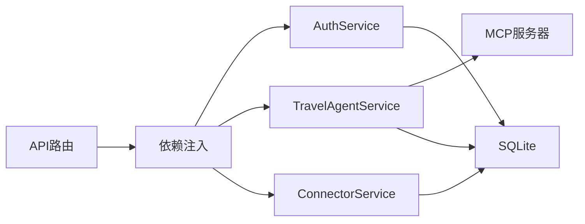

# API路由层

<cite>
**本文引用的文件**
- [backend/app/main.py](file://backend/app/main.py)
- [backend/app/api/deps.py](file://backend/app/api/deps.py)
- [backend/app/api/health.py](file://backend/app/api/health.py)
- [backend/app/api/auth.py](file://backend/app/api/auth.py)
- [backend/app/api/chat.py](file://backend/app/api/chat.py)
- [backend/app/api/sessions.py](file://backend/app/api/sessions.py)
- [backend/app/api/connectors.py](file://backend/app/api/connectors.py)
- [backend/app/api/speech.py](file://backend/app/api/speech.py)
- [backend/app/schemas/auth.py](file://backend/app/schemas/auth.py)
- [backend/app/schemas/chat.py](file://backend/app/schemas/chat.py)
- [backend/app/schemas/connectors.py](file://backend/app/schemas/connectors.py)
- [backend/app/agent/middleware.py](file://backend/app/agent/middleware.py)
</cite>

## 目录
1. [简介](#简介)
2. [项目结构](#项目结构)
3. [核心组件](#核心组件)
4. [架构总览](#架构总览)
5. [详细组件分析](#详细组件分析)
6. [依赖关系分析](#依赖关系分析)
7. [性能考量](#性能考量)
8. [故障排查指南](#故障排查指南)
9. [结论](#结论)
10. [附录](#附录)

## 简介
本文件聚焦于后端API路由层，系统性阐述RESTful设计原则、路由组织结构、请求响应处理流程，以及SSE流式API的实现细节。同时覆盖认证中间件、依赖注入机制、健康检查、聊天与会话管理、连接器授权、语音播放等具体API实现，并给出API版本控制、错误处理、速率限制的最佳实践建议，以及如何扩展新的API端点与中间件的方法。

## 项目结构
后端采用FastAPI应用入口集中注册各模块路由的方式，API层以功能域划分子包，每个子模块独立定义APIRouter并挂载在应用生命周期内。依赖注入通过缓存函数提供全局单例服务对象，确保Agent运行时与MCP连接状态在进程内共享。

图表来源
- [backend/app/main.py:31-54](file://backend/app/main.py#L31-L54)
- [backend/app/api/health.py:10-18](file://backend/app/api/health.py#L10-L18)
- [backend/app/api/auth.py:11-36](file://backend/app/api/auth.py#L11-L36)
- [backend/app/api/chat.py:21-72](file://backend/app/api/chat.py#L21-L72)
- [backend/app/api/sessions.py:28-197](file://backend/app/api/sessions.py#L28-L197)
- [backend/app/api/connectors.py:21-103](file://backend/app/api/connectors.py#L21-L103)
- [backend/app/api/speech.py:12-35](file://backend/app/api/speech.py#L12-L35)
- [backend/app/api/deps.py:18-60](file://backend/app/api/deps.py#L18-L60)

章节来源
- [backend/app/main.py:31-54](file://backend/app/main.py#L31-L54)

## 核心组件
- 应用入口与生命周期：应用在启动时初始化代理服务，在关闭时释放资源；注册所有API路由并启用CORS。
- 依赖注入：通过带缓存的工厂函数提供全局单例服务，减少重复初始化成本，共享Agent运行时与MCP连接状态。
- 认证中间件：基于Bearer Token解析当前用户，未携带或非Bearer将返回未授权。
- SSE流式API：聊天与会话重生成均以SSE方式推送事件，包含错误兜底与通用错误消息。
- 数据模型：认证、聊天、连接器等API的请求/响应模型统一在schemas目录下定义，确保前后端一致性。

章节来源
- [backend/app/main.py:23-54](file://backend/app/main.py#L23-L54)
- [backend/app/api/deps.py:18-60](file://backend/app/api/deps.py#L18-L60)
- [backend/app/api/chat.py:25-72](file://backend/app/api/chat.py#L25-L72)
- [backend/app/api/sessions.py:32-132](file://backend/app/api/sessions.py#L32-L132)
- [backend/app/schemas/auth.py:13-51](file://backend/app/schemas/auth.py#L13-L51)
- [backend/app/schemas/chat.py:18-274](file://backend/app/schemas/chat.py#L18-L274)
- [backend/app/schemas/connectors.py:13-51](file://backend/app/schemas/connectors.py#L13-L51)

## 架构总览
下图展示了API路由层与服务层、中间件及外部系统的交互关系，体现SSE事件流、认证与依赖注入的关键路径。

图表来源
- [backend/app/main.py:31-54](file://backend/app/main.py#L31-L54)
- [backend/app/api/deps.py:49-60](file://backend/app/api/deps.py#L49-L60)
- [backend/app/agent/middleware.py:193-211](file://backend/app/agent/middleware.py#L193-L211)

## 详细组件分析

### 健康检查API
- 路由：GET /api/health
- 功能：返回服务健康状态与Agent运行时快照，用于容器编排与监控。
- 认证：无需登录，直接访问。
- 响应：包含状态与运行时快照字段。

章节来源
- [backend/app/api/health.py:13-18](file://backend/app/api/health.py#L13-L18)

### 认证API
- 路由前缀：/api/auth
- 端点：
  - POST /send-code：发送邮箱验证码（需目的用途）。
  - POST /verify-code：校验验证码并返回访问令牌与用户信息。
  - GET /me：返回当前登录用户信息。
- 认证：使用Bearer Token；未提供或非Bearer将返回未授权。
- 数据模型：请求/响应模型在认证schema中定义。

章节来源
- [backend/app/api/auth.py:14-36](file://backend/app/api/auth.py#L14-L36)
- [backend/app/api/deps.py:52-60](file://backend/app/api/deps.py#L52-L60)
- [backend/app/schemas/auth.py:23-51](file://backend/app/schemas/auth.py#L23-L51)

### 聊天API（SSE）
- 路由前缀：/api/chat
- 端点：
  - GET /model-profiles：返回前端可见的模型档位列表与默认档位键。
  - POST /stream：以SSE流式返回LangGraph原生事件（start/token/tool_* / final/error/done）。
- SSE实现要点：
  - 编码函数将事件名与负载转为SSE文本块。
  - 设置Cache-Control=no-cache、Connection=keep-alive、X-Accel-Buffering=no。
  - 异常处理：取消任务、参数错误、其他异常分别返回相应错误事件或通用错误消息。
- 依赖：当前用户（认证中间件）、代理服务（依赖注入）。

图表来源
- [backend/app/api/chat.py:41-72](file://backend/app/api/chat.py#L41-L72)
- [backend/app/api/deps.py:18-32](file://backend/app/api/deps.py#L18-L32)
- [backend/app/agent/middleware.py:193-211](file://backend/app/agent/middleware.py#L193-L211)

章节来源
- [backend/app/api/chat.py:31-72](file://backend/app/api/chat.py#L31-L72)

### 会话管理API（SSE）
- 路由前缀：/api/sessions
- 端点：
  - GET /：列出会话摘要（按最近活跃排序）。
  - GET /{thread_id}：获取会话详情。
  - PATCH /{thread_id}：重命名会话。
  - PATCH /{thread_id}/model-profile：更新会话当前模型档位。
  - DELETE /{thread_id}：删除会话及其全部消息。
  - POST /{thread_id}/messages/{message_id}/regenerate/stream：重新生成最新一条assistant回复（SSE）。
  - PATCH /{thread_id}/messages/{message_id}/current-version：切换assistant当前展示版本。
  - PATCH /{thread_id}/messages/{message_id}/versions/{version_id}/feedback：更新assistant版本点赞/点踩。
  - GET /{thread_id}/messages/{message_id}/versions/{version_id}/speech/playback-url：返回语音播放地址。
- SSE实现要点：与聊天API一致，错误事件统一编码。
- 错误处理：针对不存在或非法输入返回404/400等状态码。

图表来源
- [backend/app/api/sessions.py:103-132](file://backend/app/api/sessions.py#L103-L132)

章节来源
- [backend/app/api/sessions.py:37-197](file://backend/app/api/sessions.py#L37-L197)

### 连接器API（OAuth）
- 路由前缀：/api/connectors
- 端点：
  - GET /：返回当前用户可授权的应用列表。
  - POST /{connector_id}/authorize：生成浏览器授权URL并返回state与过期时间。
  - DELETE /{connector_id}：断开当前用户的授权。
  - GET /oauth/callback：OAuth回调端点，成功/失败均重定向回前端并附带结果参数。
- 错误处理：授权异常返回400/404等状态码；回调参数拼接至重定向URL。
- 数据模型：连接器定义、状态、授权响应等。

章节来源
- [backend/app/api/connectors.py:24-103](file://backend/app/api/connectors.py#L24-L103)
- [backend/app/schemas/connectors.py:13-51](file://backend/app/schemas/connectors.py#L13-L51)

### 语音播放API
- 路由前缀：/api/speech
- 端点：
  - GET /play/{token}：根据短时token返回可直接播放的音频流。
- 错误处理：无效token/找不到文件/冲突状态分别返回401/404/409。

章节来源
- [backend/app/api/speech.py:15-35](file://backend/app/api/speech.py#L15-L35)

### 认证中间件与依赖注入
- 认证中间件：
  - Bearer Token解析，scheme非Bearer则401。
  - 通过AuthService解析用户，后续路由可直接依赖当前用户。
- 依赖注入：
  - 代理服务、认证服务、连接器服务均通过lru_cache缓存，进程内单例。
  - 服务构造时注入MCP配置路径、SQLite数据库路径与相互依赖的服务实例。
- Agent中间件：
  - 动态系统提示词注入“当前时间”与会话元信息。
  - 工具调用错误边界统一转换为ToolMessage并保留GraphInterrupt透传。
  - 档位模型选择中间件按运行时档位切换模型实例。

图表来源
- [backend/app/api/deps.py:18-60](file://backend/app/api/deps.py#L18-L60)
- [backend/app/schemas/auth.py:13-51](file://backend/app/schemas/auth.py#L13-L51)
- [backend/app/schemas/chat.py:222-274](file://backend/app/schemas/chat.py#L222-L274)
- [backend/app/schemas/connectors.py:13-51](file://backend/app/schemas/connectors.py#L13-L51)

章节来源
- [backend/app/api/deps.py:18-60](file://backend/app/api/deps.py#L18-L60)
- [backend/app/agent/middleware.py:66-131](file://backend/app/agent/middleware.py#L66-L131)
- [backend/app/agent/middleware.py:133-211](file://backend/app/agent/middleware.py#L133-L211)

## 依赖关系分析
- 组件耦合：
  - API路由对依赖注入函数强依赖，解耦了具体服务实现。
  - 服务层之间存在交叉依赖（如代理服务依赖连接器服务），通过依赖注入统一提供。
- 外部依赖：
  - MCP服务器：Agent中间件与工具调用依赖。
  - SQLite：认证、会话、连接器状态持久化。
- 潜在循环依赖：
  - 通过依赖注入避免直接导入导致的循环，保持低耦合高内聚。

图表来源
- [backend/app/api/deps.py:18-60](file://backend/app/api/deps.py#L18-L60)
- [backend/app/api/chat.py:16-18](file://backend/app/api/chat.py#L16-L18)
- [backend/app/api/sessions.py:12-26](file://backend/app/api/sessions.py#L12-L26)
- [backend/app/api/connectors.py:11-18](file://backend/app/api/connectors.py#L11-L18)

章节来源
- [backend/app/api/deps.py:18-60](file://backend/app/api/deps.py#L18-L60)

## 性能考量
- SSE长连接：
  - 设置no-cache与keep-alive，避免代理缓冲影响实时性。
  - 事件编码与异常分支尽量轻量，避免阻塞事件流。
- 依赖缓存：
  - lru_cache减少服务实例创建与数据库初始化次数，提升并发性能。
- 数据模型复用：
  - 统一schema降低序列化/反序列化开销与字段漂移风险。
- 中间件优化：
  - 动态提示词与模型选择中间件在请求链末端执行，避免不必要的包装副作用。

## 故障排查指南
- 401 未授权：
  - 检查请求头是否包含Bearer Token且scheme正确。
  - 确认AuthService能解析该token。
- SSE无事件或提前断开：
  - 查看服务端异常捕获逻辑，确认是否抛出取消或通用错误事件。
  - 检查客户端网络与代理设置（如X-Accel-Buffering=no）。
- 会话/消息操作404：
  - 确认thread_id/message_id是否存在且属于当前用户。
- 连接器授权失败：
  - 检查state参数长度与回调参数；查看服务端错误日志。
- 语音播放401/404/409：
  - 校验token有效性、资源是否存在、状态是否冲突。

章节来源
- [backend/app/api/deps.py:52-60](file://backend/app/api/deps.py#L52-L60)
- [backend/app/api/chat.py:55-61](file://backend/app/api/chat.py#L55-L61)
- [backend/app/api/sessions.py:54-56](file://backend/app/api/sessions.py#L54-L56)
- [backend/app/api/sessions.py:83-87](file://backend/app/api/sessions.py#L83-L87)
- [backend/app/api/connectors.py:43-44](file://backend/app/api/connectors.py#L43-L44)
- [backend/app/api/connectors.py:82-87](file://backend/app/api/connectors.py#L82-L87)
- [backend/app/api/speech.py:23-28](file://backend/app/api/speech.py#L23-L28)

## 结论
本API路由层以FastAPI为核心，结合统一的依赖注入与认证中间件，实现了清晰的REST与SSE接口。聊天与会话管理API通过SSE提供近实时的事件流体验；连接器API覆盖OAuth授权全流程；语音播放API支持安全的短时令牌访问。整体架构具备良好的扩展性与可维护性，适合进一步引入版本控制、速率限制与更细粒度的中间件。

## 附录

### API版本控制最佳实践
- URL版本策略：在路由前缀中加入版本号，如/api/v1/chat，便于平滑演进。
- 请求/响应兼容：保持向后兼容字段，新增字段默认可选；废弃字段保留但标注弃用。
- 文档同步：Swagger/OpenAPI随版本更新，明确变更说明与迁移指引。

### 错误处理最佳实践
- 明确HTTP状态码：4xx用于客户端错误，5xx用于服务端错误。
- 统一错误载荷：包含错误码、简要描述与可选追踪ID。
- SSE错误事件：使用统一的错误事件名与载荷结构，便于前端处理。

### 速率限制最佳实践
- 基于IP或用户维度限流，区分不同端点的配额。
- 使用中间件或装饰器实现限流，结合缓存统计请求频率。
- 对SSE长连接设置合理的超时与重连策略，避免资源泄漏。

### 扩展新API端点与中间件
- 新增API端点：
  - 在对应子模块新增APIRouter与路由函数，使用Depends注入所需服务。
  - 在应用入口include_router注册新路由。
- 新增中间件：
  - 在服务层或Agent中间件中添加自定义逻辑，注意保持与现有中间件的协作关系。
  - 对外暴露的中间件需考虑与LangGraph请求链的集成点。