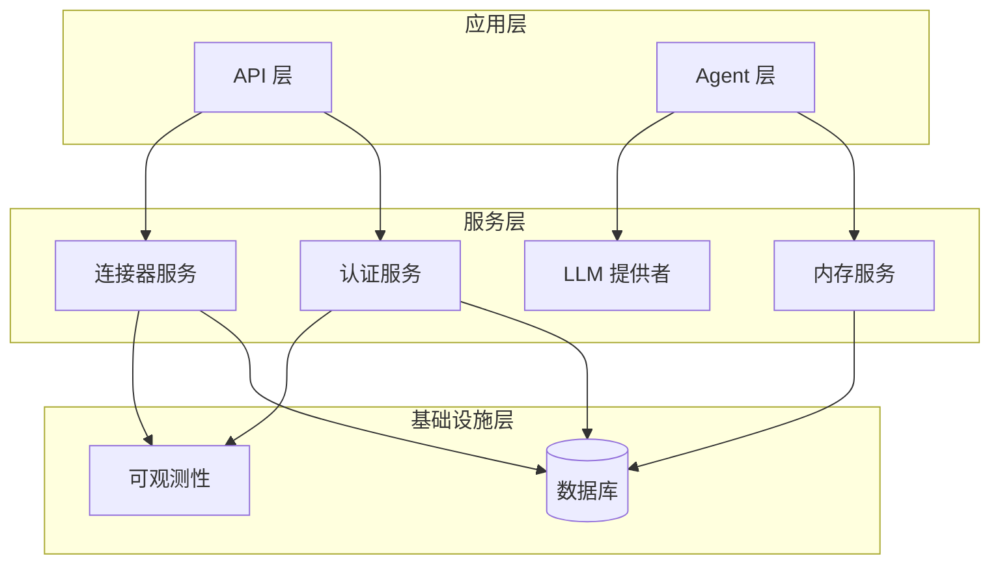
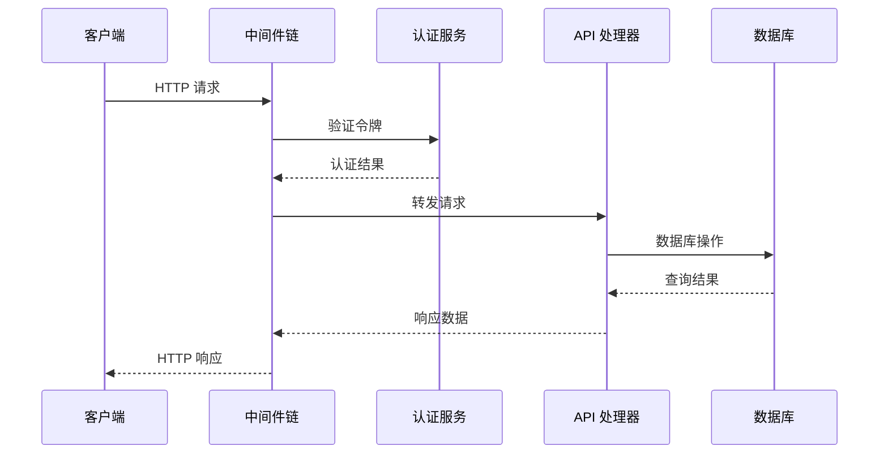
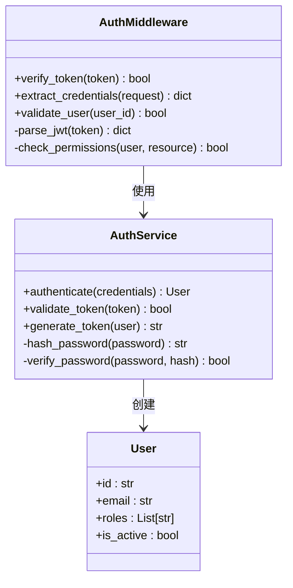
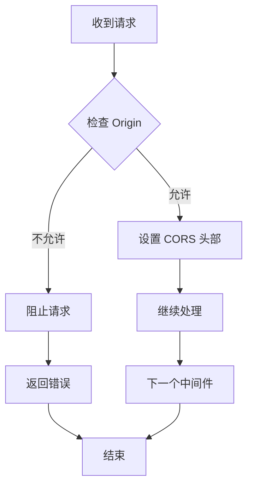
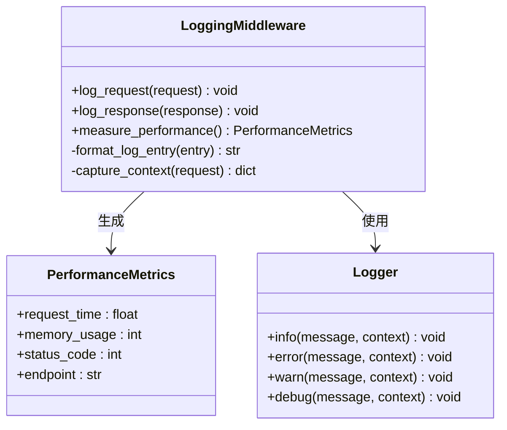
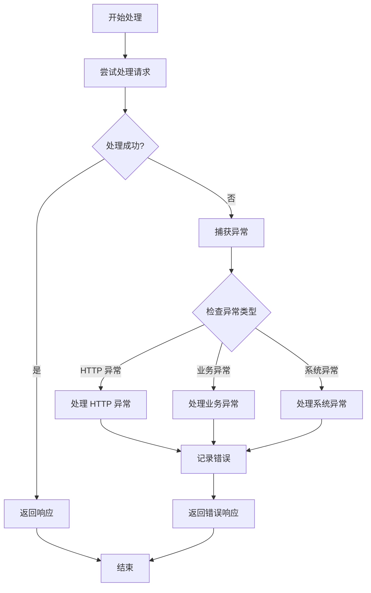
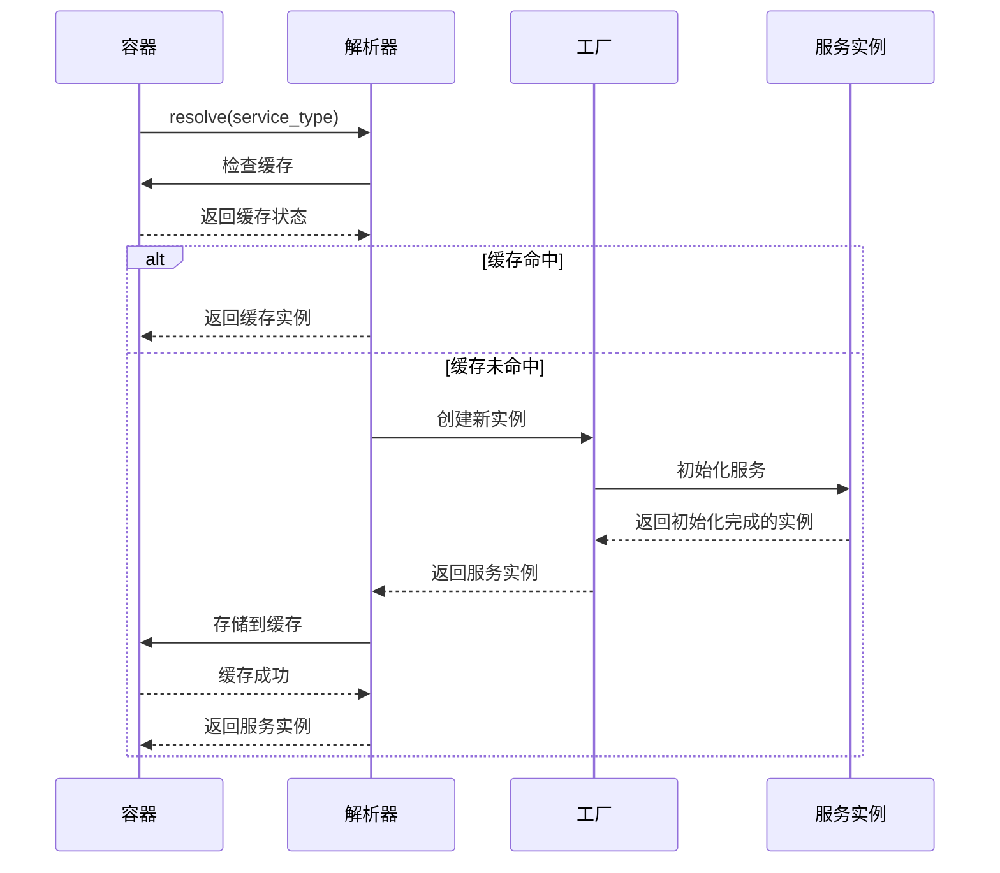
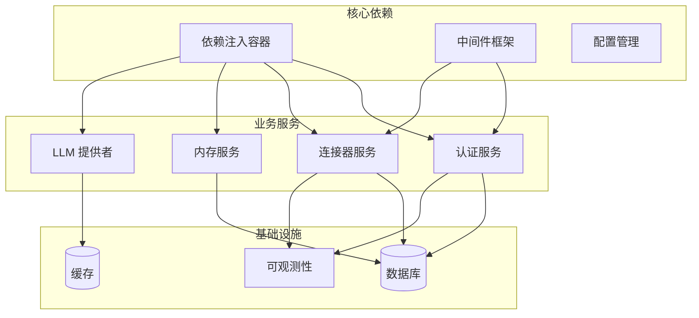

# 中间件与依赖注入

<cite>
**本文档引用的文件**
- [backend/app/agent/middleware.py](file://backend/app/agent/middleware.py)
- [backend/app/api/deps.py](file://backend/app/api/deps.py)
- [backend/app/main.py](file://backend/app/main.py)
- [backend/app/__init__.py](file://backend/app/__init__.py)
- [backend/app/api/__init__.py](file://backend/app/api/__init__.py)
- [backend/app/auth/service.py](file://backend/app/auth/service.py)
- [backend/app/connectors/service.py](file://backend/app/connectors/service.py)
- [backend/app/db/bootstrap.py](file://backend/app/db/bootstrap.py)
- [backend/app/memory/runtime.py](file://backend/app/memory/runtime.py)
- [backend/app/observability/langsmith.py](file://backend/app/observability/langsmith.py)
</cite>

## 目录
1. [简介](#简介)
2. [项目结构](#项目结构)
3. [核心组件](#核心组件)
4. [架构概览](#架构概览)
5. [详细组件分析](#详细组件分析)
6. [依赖关系分析](#依赖关系分析)
7. [性能考虑](#性能考虑)
8. [故障排除指南](#故障排除指南)
9. [结论](#结论)

## 简介

本项目采用基于依赖注入的中间件架构设计，通过服务容器统一管理应用中的各种服务实例，并提供可插拔的中间件机制来处理认证、CORS、日志等横切关注点。该系统支持灵活的服务注册和生命周期管理，为构建可扩展的企业级应用提供了坚实的基础。

## 项目结构

项目采用分层架构设计，主要分为以下几个层次：

**图表来源**
- [backend/app/main.py](file://backend/app/main.py)
- [backend/app/api/__init__.py](file://backend/app/api/__init__.py)
- [backend/app/agent/__init__.py](file://backend/app/agent/__init__.py)

**章节来源**
- [backend/app/main.py](file://backend/app/main.py)
- [backend/app/__init__.py](file://backend/app/__init__.py)

## 核心组件

### 依赖注入容器

系统实现了轻量级的依赖注入容器，负责服务实例的创建、管理和生命周期控制。容器支持以下核心功能：

- **服务注册**：通过装饰器模式注册不同类型的服务
- **依赖解析**：自动解析服务间的依赖关系
- **生命周期管理**：支持单例、瞬态等不同的生命周期策略
- **作用域控制**：支持请求级别的服务实例隔离

### 中间件架构

中间件系统采用链式调用模式，每个中间件负责特定的横切关注点：

- **认证中间件**：处理用户身份验证和授权
- **CORS 中间件**：管理跨域资源共享策略
- **日志中间件**：记录请求处理过程和性能指标
- **异常处理中间件**：统一处理系统异常和错误响应

**章节来源**
- [backend/app/agent/middleware.py](file://backend/app/agent/middleware.py)
- [backend/app/api/deps.py](file://backend/app/api/deps.py)

## 架构概览

系统采用模块化设计，各组件通过清晰的接口进行交互：

**图表来源**
- [backend/app/agent/middleware.py](file://backend/app/agent/middleware.py)
- [backend/app/auth/service.py](file://backend/app/auth/service.py)
- [backend/app/api/deps.py](file://backend/app/api/deps.py)

## 详细组件分析

### 认证中间件实现

认证中间件负责处理用户身份验证和授权逻辑：

**图表来源**
- [backend/app/agent/middleware.py](file://backend/app/agent/middleware.py)
- [backend/app/auth/service.py](file://backend/app/auth/service.py)

认证中间件的核心流程包括：

1. **令牌提取**：从请求头中提取 JWT 令牌
2. **令牌验证**：验证令牌的有效性和签名
3. **用户加载**：根据令牌中的用户信息加载用户数据
4. **权限检查**：验证用户对目标资源的访问权限
5. **上下文设置**：将用户信息注入到请求上下文中

**章节来源**
- [backend/app/agent/middleware.py](file://backend/app/agent/middleware.py)
- [backend/app/auth/service.py](file://backend/app/auth/service.py)

### CORS 中间件实现

CORS 中间件管理跨域资源共享策略：

**图表来源**
- [backend/app/agent/middleware.py](file://backend/app/agent/middleware.py)

CORS 中间件的关键特性：

- **动态配置**：支持运行时配置允许的源、方法和头部
- **预检请求处理**：正确处理 OPTIONS 预检请求
- **安全策略**：默认拒绝所有跨域请求，仅允许明确配置的来源

### 日志中间件实现

日志中间件提供完整的请求处理跟踪：

**图表来源**
- [backend/app/agent/middleware.py](file://backend/app/agent/middleware.py)

日志中间件的功能包括：

- **请求日志**：记录请求的基本信息和上下文
- **响应日志**：记录响应状态和处理时间
- **性能监控**：收集关键性能指标
- **错误追踪**：捕获和记录异常信息

**章节来源**
- [backend/app/agent/middleware.py](file://backend/app/agent/middleware.py)

### 异常处理中间件

异常处理中间件提供统一的错误处理机制：

**图表来源**
- [backend/app/agent/middleware.py](file://backend/app/agent/middleware.py)

异常处理中间件的策略：

- **HTTP 异常**：转换为标准的 HTTP 错误响应
- **业务异常**：返回业务相关的错误信息
- **系统异常**：记录详细错误信息并返回通用错误响应
- **异常日志**：确保所有异常都被正确记录和追踪

### 依赖解析机制

依赖注入容器的解析流程：

**图表来源**
- [backend/app/api/deps.py](file://backend/app/api/deps.py)
- [backend/app/main.py](file://backend/app/main.py)

**章节来源**
- [backend/app/api/deps.py](file://backend/app/api/deps.py)
- [backend/app/main.py](file://backend/app/main.py)

## 依赖关系分析

系统中各组件之间的依赖关系：

**图表来源**
- [backend/app/main.py](file://backend/app/main.py)
- [backend/app/api/deps.py](file://backend/app/api/deps.py)

**章节来源**
- [backend/app/main.py](file://backend/app/main.py)
- [backend/app/api/deps.py](file://backend/app/api/deps.py)

## 性能考虑

### 中间件链优化

为了优化请求处理性能，建议采取以下措施：

- **中间件排序**：将最常用的中间件放在链的前面
- **异步处理**：对于耗时操作使用异步中间件
- **缓存策略**：合理使用缓存减少重复计算
- **资源池化**：对数据库连接等资源使用连接池

### 依赖注入优化

- **延迟初始化**：只在需要时创建昂贵的服务实例
- **作用域管理**：合理设置服务的作用域避免内存泄漏
- **循环依赖检测**：防止服务间的循环依赖导致栈溢出
- **性能监控**：监控服务的创建和使用频率

## 故障排除指南

### 常见问题及解决方案

**中间件不生效**
- 检查中间件是否正确注册到应用配置中
- 验证中间件的执行顺序是否正确
- 确认中间件的优先级设置

**依赖注入失败**
- 检查服务的构造函数参数是否正确
- 验证依赖服务是否已正确注册
- 确认服务的作用域和生命周期设置

**性能问题**
- 分析中间件链的执行时间
- 检查是否有阻塞操作
- 监控内存使用情况

**异常处理问题**
- 确认异常中间件的位置正确
- 检查异常映射表的配置
- 验证错误响应格式

**章节来源**
- [backend/app/agent/middleware.py](file://backend/app/agent/middleware.py)
- [backend/app/api/deps.py](file://backend/app/api/deps.py)

## 结论

本项目实现了功能完善的中间件与依赖注入系统，通过模块化的架构设计和清晰的接口定义，为构建可扩展的企业级应用提供了坚实的技术基础。系统的主要优势包括：

- **灵活的中间件机制**：支持自定义中间件的开发和集成
- **强大的依赖注入**：提供完整的服务生命周期管理
- **完善的错误处理**：统一的异常处理和日志记录机制
- **良好的性能表现**：通过优化的中间件链和依赖解析提高系统效率

未来可以进一步扩展的方向包括：增加更多的内置中间件、提供更丰富的配置选项、增强性能监控能力等。