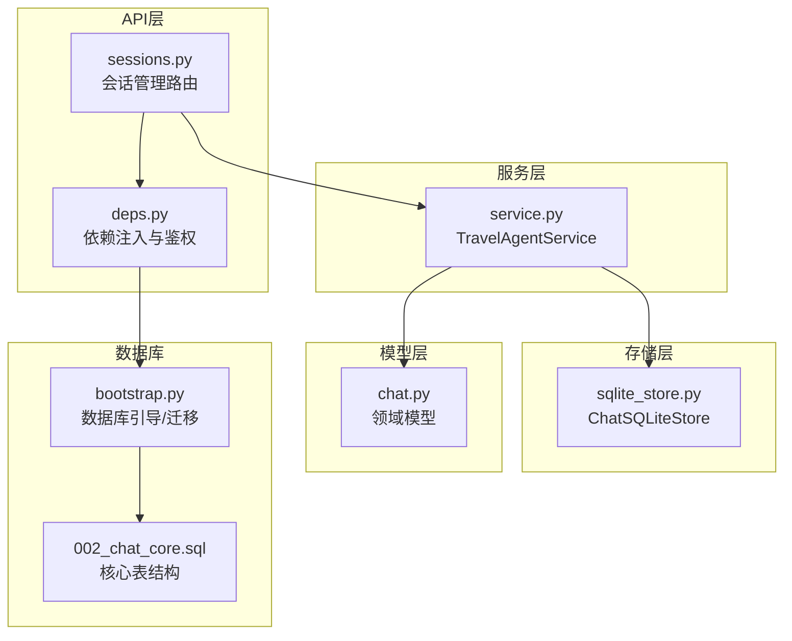
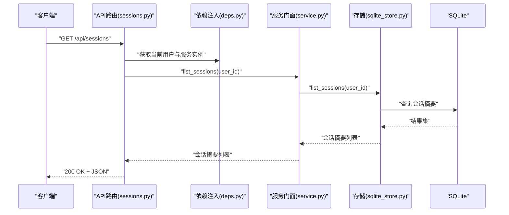
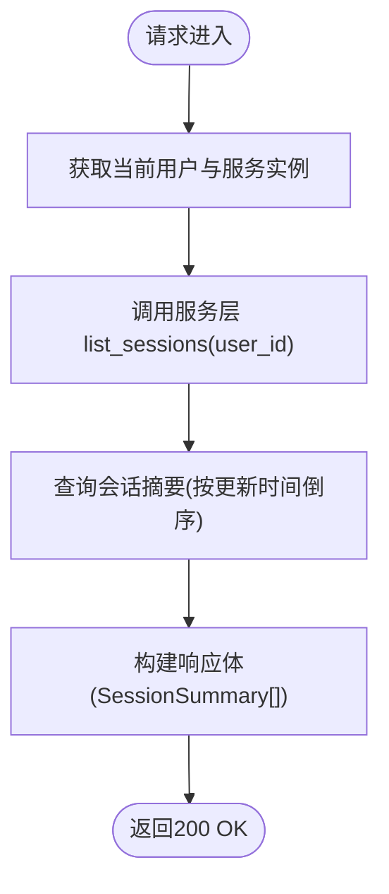
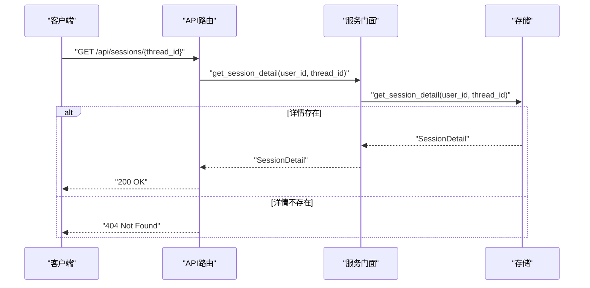
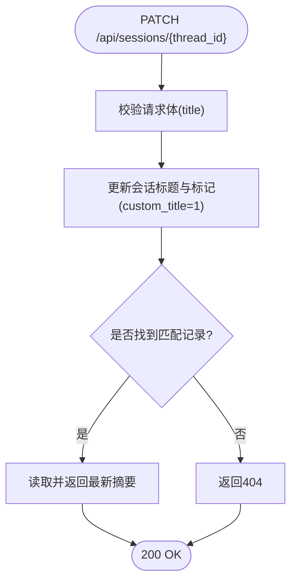
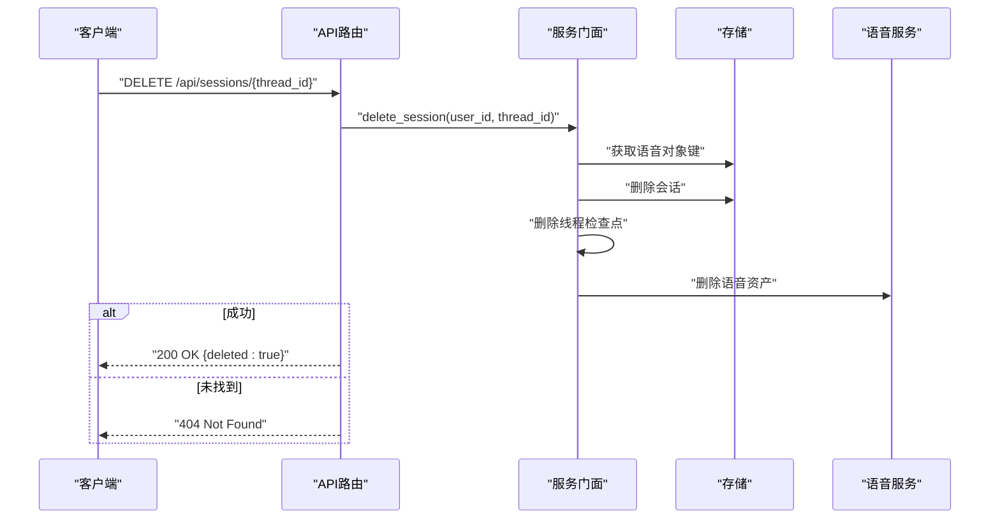
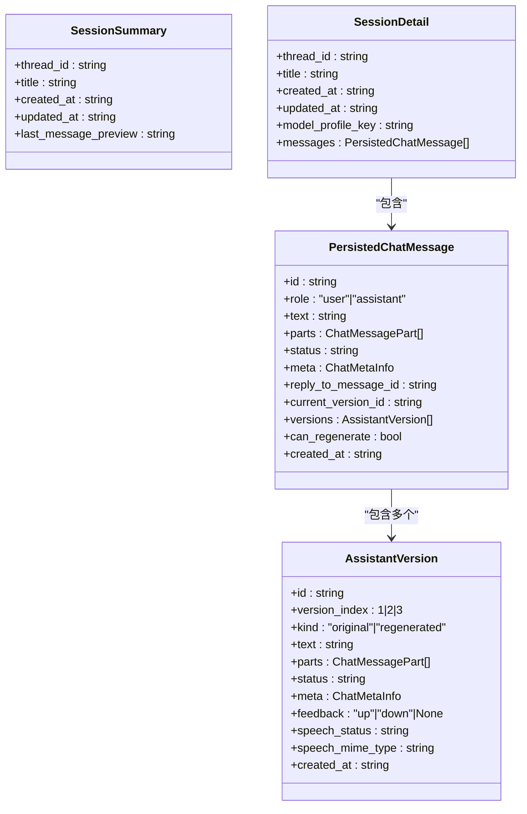
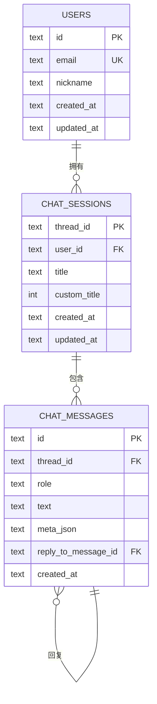
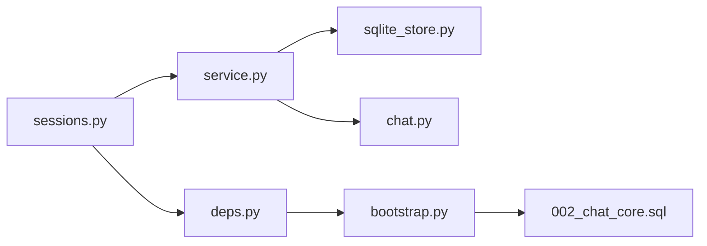

# 会话管理API

<cite>
**本文档引用的文件**
- [sessions.py](file://backend/app/api/sessions.py)
- [service.py](file://backend/app/agent/service.py)
- [sqlite_store.py](file://backend/app/memory/sqlite_store.py)
- [chat.py](file://backend/app/schemas/chat.py)
- [bootstrap.py](file://backend/app/db/bootstrap.py)
- [002_chat_core.sql](file://backend/migrations/002_chat_core.sql)
- [deps.py](file://backend/app/api/deps.py)
- [migrate.py](file://backend/app/db/migrate.py)
</cite>

## 目录
1. [简介](#简介)
2. [项目结构](#项目结构)
3. [核心组件](#核心组件)
4. [架构总览](#架构总览)
5. [详细组件分析](#详细组件分析)
6. [依赖分析](#依赖分析)
7. [性能考虑](#性能考虑)
8. [故障排除指南](#故障排除指南)
9. [结论](#结论)
10. [附录](#附录)

## 简介
本文件系统性梳理后端“会话管理API”的设计与实现，覆盖以下能力：
- 会话列表查询、会话详情获取
- 会话重命名、会话删除
- 会话状态管理、历史记录保存、会话持久化机制
- 会话数据结构、操作权限控制、并发访问处理
- 最佳实践、性能优化建议、数据一致性保证
- 扩展点：如何扩展会话功能、自定义会话属性、会话迁移策略

## 项目结构
围绕会话管理的关键文件组织如下：
- API层：定义REST接口与权限校验
- 服务层：封装业务逻辑与运行时交互
- 存储层：基于SQLite的持久化实现
- 模型层：统一的领域数据结构
- 数据库：迁移脚本与初始化

图表来源
- [sessions.py:1-197](file://backend/app/api/sessions.py#L1-L197)
- [service.py:1-529](file://backend/app/agent/service.py#L1-L529)
- [sqlite_store.py:1-800](file://backend/app/memory/sqlite_store.py#L1-L800)
- [chat.py:1-274](file://backend/app/schemas/chat.py#L1-L274)
- [bootstrap.py:1-226](file://backend/app/db/bootstrap.py#L1-L226)
- [002_chat_core.sql:1-28](file://backend/migrations/002_chat_core.sql#L1-L28)

章节来源
- [sessions.py:1-197](file://backend/app/api/sessions.py#L1-L197)
- [service.py:1-529](file://backend/app/agent/service.py#L1-L529)
- [sqlite_store.py:1-800](file://backend/app/memory/sqlite_store.py#L1-L800)
- [chat.py:1-274](file://backend/app/schemas/chat.py#L1-L274)
- [bootstrap.py:1-226](file://backend/app/db/bootstrap.py#L1-L226)
- [002_chat_core.sql:1-28](file://backend/migrations/002_chat_core.sql#L1-L28)

## 核心组件
- API路由与权限
  - 通过依赖注入获取当前用户与服务实例
  - 提供会话列表、详情、重命名、删除等接口
- 服务门面 TravelAgentService
  - 将API请求委派给存储层与运行时服务
  - 负责会话模型档位、版本切换、反馈更新、语音播放URL构建等
- 存储实现 ChatSQLiteStore
  - 会话与消息的增删改查、版本管理、预览刷新
  - 事务管理与外键约束保障一致性
- 领域模型
  - 定义会话摘要、详情、消息、版本、模型档位等结构
- 数据库引导与迁移
  - 自动发现并应用迁移脚本，确保表结构演进安全

章节来源
- [sessions.py:37-101](file://backend/app/api/sessions.py#L37-L101)
- [service.py:129-176](file://backend/app/agent/service.py#L129-L176)
- [sqlite_store.py:593-779](file://backend/app/memory/sqlite_store.py#L593-L779)
- [chat.py:201-274](file://backend/app/schemas/chat.py#L201-L274)
- [bootstrap.py:181-226](file://backend/app/db/bootstrap.py#L181-L226)

## 架构总览
会话管理API采用分层架构，职责清晰：
- API层负责HTTP协议与鉴权
- 服务层聚合业务规则与运行时
- 存储层负责数据持久化与一致性
- 模型层统一数据契约
- 数据库层负责结构演进与初始化

图表来源
- [sessions.py:37-43](file://backend/app/api/sessions.py#L37-L43)
- [deps.py:18-32](file://backend/app/api/deps.py#L18-L32)
- [service.py:129-131](file://backend/app/agent/service.py#L129-L131)
- [sqlite_store.py:593-615](file://backend/app/memory/sqlite_store.py#L593-L615)

## 详细组件分析

### 会话列表查询
- 接口：GET /api/sessions
- 实现要点：
  - 依赖注入获取当前用户与服务实例
  - 调用服务层列出当前用户的所有会话摘要
  - 按最近活跃时间倒序排列
- 数据来源：存储层从会话表读取摘要信息

图表来源
- [sessions.py:37-43](file://backend/app/api/sessions.py#L37-L43)
- [service.py:129-131](file://backend/app/agent/service.py#L129-L131)
- [sqlite_store.py:593-615](file://backend/app/memory/sqlite_store.py#L593-L615)

章节来源
- [sessions.py:37-43](file://backend/app/api/sessions.py#L37-L43)
- [service.py:129-131](file://backend/app/agent/service.py#L129-L131)
- [sqlite_store.py:593-615](file://backend/app/memory/sqlite_store.py#L593-L615)

### 会话详情获取
- 接口：GET /api/sessions/{thread_id}
- 实现要点：
  - 校验会话归属当前用户
  - 读取会话元信息与完整历史消息
  - 消息包含多版本与反馈信息
- 错误处理：未找到返回404

图表来源
- [sessions.py:46-56](file://backend/app/api/sessions.py#L46-L56)
- [service.py:133-139](file://backend/app/agent/service.py#L133-L139)
- [sqlite_store.py:617-695](file://backend/app/memory/sqlite_store.py#L617-L695)

章节来源
- [sessions.py:46-56](file://backend/app/api/sessions.py#L46-L56)
- [service.py:133-139](file://backend/app/agent/service.py#L133-L139)
- [sqlite_store.py:617-695](file://backend/app/memory/sqlite_store.py#L617-L695)

### 会话重命名
- 接口：PATCH /api/sessions/{thread_id}
- 请求体：RenameSessionRequest(title)
- 实现要点：
  - 标题去空白并校验长度
  - 标记为自定义标题
  - 更新会话标题与更新时间
- 返回：SessionSummary 或404

图表来源
- [sessions.py:59-70](file://backend/app/api/sessions.py#L59-L70)
- [service.py:164-166](file://backend/app/agent/service.py#L164-L166)
- [sqlite_store.py:733-769](file://backend/app/memory/sqlite_store.py#L733-L769)

章节来源
- [sessions.py:59-70](file://backend/app/api/sessions.py#L59-L70)
- [service.py:164-166](file://backend/app/agent/service.py#L164-L166)
- [sqlite_store.py:733-769](file://backend/app/memory/sqlite_store.py#L733-L769)

### 会话删除
- 接口：DELETE /api/sessions/{thread_id}
- 实现要点：
  - 删除会话记录
  - 删除关联检查点
  - 删除语音资产对象键
- 返回：{"deleted": true} 或404

图表来源
- [sessions.py:90-100](file://backend/app/api/sessions.py#L90-L100)
- [service.py:168-176](file://backend/app/agent/service.py#L168-L176)
- [sqlite_store.py:771-779](file://backend/app/memory/sqlite_store.py#L771-L779)

章节来源
- [sessions.py:90-100](file://backend/app/api/sessions.py#L90-L100)
- [service.py:168-176](file://backend/app/agent/service.py#L168-L176)
- [sqlite_store.py:771-779](file://backend/app/memory/sqlite_store.py#L771-L779)

### 会话状态管理与历史记录
- 会话状态
  - 会话摘要包含创建/更新时间与最后一条消息预览
  - 详情包含完整消息列表与版本信息
- 历史记录
  - 消息支持多版本（原始/重生成），并记录版本索引、状态、反馈、语音状态等
  - 支持版本切换与点赞/点踩
- 数据一致性
  - 存储层使用事务包裹写操作，失败自动回滚
  - 外键约束保证删除级联与引用完整性

图表来源
- [chat.py:201-274](file://backend/app/schemas/chat.py#L201-L274)

章节来源
- [chat.py:201-274](file://backend/app/schemas/chat.py#L201-L274)
- [sqlite_store.py:617-695](file://backend/app/memory/sqlite_store.py#L617-L695)

### 会话持久化机制
- 表结构
  - 会话表：thread_id、user_id、标题、是否自定义标题、时间戳
  - 消息表：id、thread_id、角色、文本、元信息、回复关系、时间戳
- 初始化与迁移
  - 引导函数解析数据库路径，必要时重置并应用迁移
  - 迁移脚本确保表结构与索引存在
- 并发与一致性
  - 写操作在连接作用域内开启事务，异常自动回滚
  - 外键级联删除保证会话删除时清理子记录

图表来源
- [002_chat_core.sql:1-28](file://backend/migrations/002_chat_core.sql#L1-L28)

章节来源
- [bootstrap.py:181-226](file://backend/app/db/bootstrap.py#L181-L226)
- [002_chat_core.sql:1-28](file://backend/migrations/002_chat_core.sql#L1-L28)
- [sqlite_store.py:132-148](file://backend/app/memory/sqlite_store.py#L132-L148)

### 权限控制与并发访问
- 权限控制
  - 通过Bearer Token鉴权，解析当前用户
  - 所有会话操作均以“用户+会话ID”双重校验所有权
- 并发访问
  - 服务层通过单例TravelAgentService共享运行时与连接状态
  - 存储层使用连接级事务，避免脏写
  - 语音资产删除与检查点清理在事务边界内进行

章节来源
- [deps.py:52-59](file://backend/app/api/deps.py#L52-L59)
- [service.py:18-32](file://backend/app/agent/service.py#L18-L32)
- [sqlite_store.py:138-148](file://backend/app/memory/sqlite_store.py#L138-L148)

### 扩展点与最佳实践
- 扩展会话功能
  - 新增会话元信息：在会话表添加列并在模型层扩展
  - 新增消息类型：在消息表与模型层增加枚举值与序列化规则
- 自定义会话属性
  - 通过会话详情的meta字段承载业务扩展
  - 保持向后兼容，避免破坏既有字段
- 会话迁移策略
  - 使用迁移脚本逐步演进表结构
  - 严格校验历史数据格式，必要时提供数据修复工具
- 性能优化
  - 列表查询使用复合索引(user_id, updated_at)
  - 详情查询按时间排序索引加速
  - 对大文本字段采用JSON存储，减少表膨胀
- 数据一致性
  - 写操作统一走事务，失败回滚
  - 外键约束与级联删除确保引用完整性
  - 语音资产与检查点清理在删除会话时一并处理

章节来源
- [bootstrap.py:48-65](file://backend/app/db/bootstrap.py#L48-L65)
- [002_chat_core.sql:11-12](file://backend/migrations/002_chat_core.sql#L11-L12)
- [002_chat_core.sql:26-27](file://backend/migrations/002_chat_core.sql#L26-L27)
- [sqlite_store.py:132-148](file://backend/app/memory/sqlite_store.py#L132-L148)

## 依赖分析
- 组件耦合
  - API层仅依赖服务层与依赖注入
  - 服务层聚合存储层与运行时服务
  - 存储层依赖SQLite与Pydantic模型
- 外部依赖
  - FastAPI用于路由与依赖注入
  - SQLite用于本地持久化
  - Pydantic用于数据验证与序列化

图表来源
- [sessions.py:12-26](file://backend/app/api/sessions.py#L12-L26)
- [deps.py:18-32](file://backend/app/api/deps.py#L18-L32)
- [service.py:106-114](file://backend/app/agent/service.py#L106-L114)
- [sqlite_store.py:15-22](file://backend/app/memory/sqlite_store.py#L15-L22)
- [chat.py:1-6](file://backend/app/schemas/chat.py#L1-L6)
- [bootstrap.py:38-40](file://backend/app/db/bootstrap.py#L38-L40)
- [002_chat_core.sql:1-28](file://backend/migrations/002_chat_core.sql#L1-L28)

章节来源
- [sessions.py:12-26](file://backend/app/api/sessions.py#L12-L26)
- [service.py:106-114](file://backend/app/agent/service.py#L106-L114)
- [sqlite_store.py:15-22](file://backend/app/memory/sqlite_store.py#L15-L22)
- [chat.py:1-6](file://backend/app/schemas/chat.py#L1-L6)
- [bootstrap.py:38-40](file://backend/app/db/bootstrap.py#L38-L40)

## 性能考虑
- 查询优化
  - 会话列表使用复合索引(user_id, updated_at)，按更新时间倒序
  - 消息查询按(thread_id, created_at)索引，提升详情加载速度
- 写入优化
  - 事务包裹批量写入，减少锁竞争
  - 大文本与结构化数据采用JSON存储，降低表结构复杂度
- 并发处理
  - 单例服务实例共享运行时，避免重复初始化
  - 语音生成与检查点写入异步化，减少阻塞

## 故障排除指南
- 常见错误与处理
  - 404 会话不存在：确认thread_id与当前用户匹配
  - 400 参数校验失败：检查请求体字段长度与格式
  - 409 语音冲突：检查语音生成状态与对象键
- 日志与追踪
  - 服务层在异常时记录流水线失败日志，便于定位问题
  - SSE流错误通过标准错误事件返回，前端可据此提示
- 数据库问题
  - 迁移失败：检查迁移文件命名与版本号，确保未重复
  - 历史schema不兼容：按引导逻辑重置或删除旧数据库后重启

章节来源
- [sessions.py:54-55](file://backend/app/api/sessions.py#L54-L55)
- [sessions.py:83-86](file://backend/app/api/sessions.py#L83-L86)
- [sessions.py:191-194](file://backend/app/api/sessions.py#L191-L194)
- [service.py:250-267](file://backend/app/agent/service.py#L250-L267)
- [bootstrap.py:112-131](file://backend/app/db/bootstrap.py#L112-L131)

## 结论
会话管理API通过清晰的分层设计与严格的数据库约束，提供了完整的会话生命周期管理能力。其核心优势在于：
- 易于扩展：模型与迁移机制支持平滑演进
- 可靠性高：事务与外键保障数据一致性
- 可维护性强：职责分离与依赖注入使代码结构清晰

## 附录
- 数据库迁移入口
  - 命令行入口：调用迁移脚本，支持重置选项
- 依赖注入与鉴权
  - 通过Bearer Token解析当前用户，确保每项操作的主体明确

章节来源
- [migrate.py:10-17](file://backend/app/db/migrate.py#L10-L17)
- [deps.py:52-59](file://backend/app/api/deps.py#L52-L59)