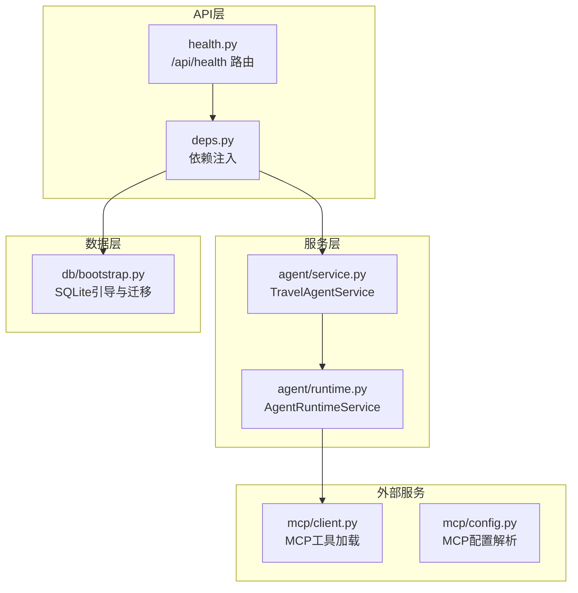
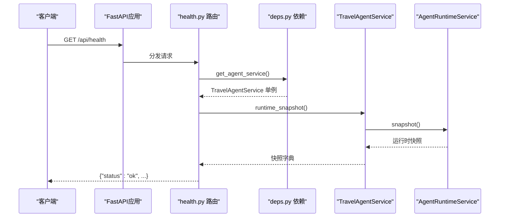
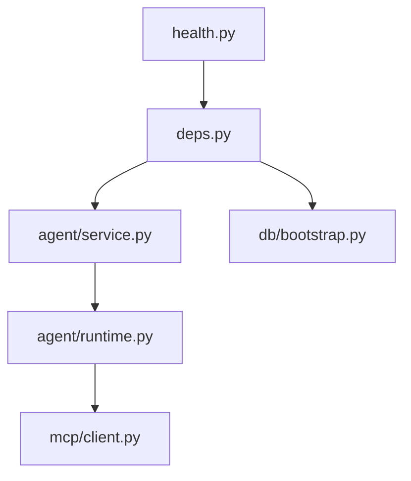
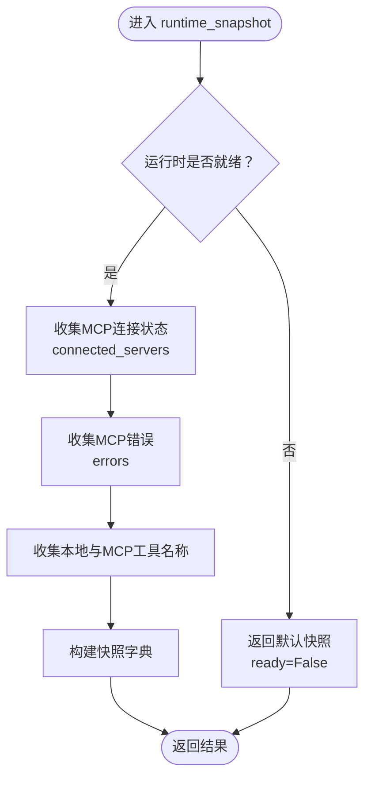

# 健康检查API

<cite>
**本文档引用的文件**
- [backend/app/api/health.py](file://backend/app/api/health.py)
- [backend/app/main.py](file://backend/app/main.py)
- [backend/app/api/deps.py](file://backend/app/api/deps.py)
- [backend/app/agent/service.py](file://backend/app/agent/service.py)
- [backend/app/agent/runtime.py](file://backend/app/agent/runtime.py)
- [backend/app/db/bootstrap.py](file://backend/app/db/bootstrap.py)
- [backend/app/mcp/client.py](file://backend/app/mcp/client.py)
- [backend/app/mcp/config.py](file://backend/app/mcp/config.py)
- [backend/docs/agent-implementation-retrospective.md](file://backend/docs/agent-implementation-retrospective.md)
</cite>

## 目录
1. [简介](#简介)
2. [项目结构](#项目结构)
3. [核心组件](#核心组件)
4. [架构总览](#架构总览)
5. [详细组件分析](#详细组件分析)
6. [依赖分析](#依赖分析)
7. [性能考虑](#性能考虑)
8. [故障排除指南](#故障排除指南)
9. [结论](#结论)
10. [附录](#附录)

## 简介
本文件系统性阐述健康检查API的设计与实现，覆盖以下要点：
- 健康检查的触发方式与响应格式
- 检查指标定义与来源（数据库连接、外部服务依赖、系统资源）
- 检查频率与告警机制的建议
- 自定义健康检查指标、扩展检查范围、集成监控系统的方法
- 故障诊断与最佳实践

## 项目结构
健康检查API位于后端FastAPI应用中，采用模块化组织：
- API层：定义健康检查路由与依赖注入
- 服务层：封装Agent运行时快照
- 运行时层：聚合MCP工具、本地工具、连接状态等
- 数据层：SQLite数据库初始化与迁移
- 外部服务：MCP客户端与配置解析

图表来源
- [backend/app/api/health.py:13-17](file://backend/app/api/health.py#L13-L17)
- [backend/app/api/deps.py:18-32](file://backend/app/api/deps.py#L18-L32)
- [backend/app/agent/service.py:125-127](file://backend/app/agent/service.py#L125-L127)
- [backend/app/agent/runtime.py:156-173](file://backend/app/agent/runtime.py#L156-L173)
- [backend/app/mcp/client.py:49-68](file://backend/app/mcp/client.py#L49-L68)
- [backend/app/mcp/config.py:63-83](file://backend/app/mcp/config.py#L63-L83)
- [backend/app/db/bootstrap.py:213-225](file://backend/app/db/bootstrap.py#L213-L225)

章节来源
- [backend/app/api/health.py:1-18](file://backend/app/api/health.py#L1-L18)
- [backend/app/main.py:31-54](file://backend/app/main.py#L31-L54)
- [backend/app/api/deps.py:18-32](file://backend/app/api/deps.py#L18-L32)

## 核心组件
- 健康检查路由：提供GET /api/health，返回服务健康状态与Agent运行时快照
- 依赖注入：通过缓存单例获取TravelAgentService，确保进程内共享运行时
- 运行时快照：汇总MCP连接状态、工具清单、本地工具、错误信息等

章节来源
- [backend/app/api/health.py:13-17](file://backend/app/api/health.py#L13-L17)
- [backend/app/api/deps.py:18-32](file://backend/app/api/deps.py#L18-L32)
- [backend/app/agent/service.py:125-127](file://backend/app/agent/service.py#L125-L127)
- [backend/app/agent/runtime.py:156-173](file://backend/app/agent/runtime.py#L156-L173)

## 架构总览
健康检查的调用链路如下：

图表来源
- [backend/app/api/health.py:13-17](file://backend/app/api/health.py#L13-L17)
- [backend/app/api/deps.py:18-32](file://backend/app/api/deps.py#L18-L32)
- [backend/app/agent/service.py:125-127](file://backend/app/agent/service.py#L125-L127)
- [backend/app/agent/runtime.py:156-173](file://backend/app/agent/runtime.py#L156-L173)

## 详细组件分析

### 健康检查API（/api/health）
- 路由定义：在独立的APIRouter中注册GET /api/health
- 依赖注入：使用Depends(get_agent_service)获取缓存的TravelAgentService实例
- 响应逻辑：调用service.runtime_snapshot()，合并基础状态字段返回

关键行为与复杂度
- 时间复杂度：O(1)，仅聚合运行时状态
- 错误处理：当前实现未显式抛出异常，若服务不可用，快照字段反映运行时状态

章节来源
- [backend/app/api/health.py:10-17](file://backend/app/api/health.py#L10-L17)
- [backend/app/api/deps.py:18-32](file://backend/app/api/deps.py#L18-L32)

### 依赖注入与服务单例
- get_agent_service：通过LRU缓存保证同一进程内唯一实例，共享Agent运行时与MCP连接状态
- 数据库初始化：在依赖解析时调用bootstrap_sqlite_database，确保SQLite可用

章节来源
- [backend/app/api/deps.py:18-32](file://backend/app/api/deps.py#L18-L32)
- [backend/app/db/bootstrap.py:213-225](file://backend/app/db/bootstrap.py#L213-L225)

### 运行时快照（runtime_snapshot）
- 快照字段：
  - ready：运行时是否就绪
  - mcp_connected_servers：已连接的MCP服务器列表
  - mcp_errors：MCP连接错误列表
  - local_tools：本地工具名称列表
  - mcp_tools：MCP工具名称列表
- 未就绪时返回空/默认字段，便于外部系统识别

章节来源
- [backend/app/agent/service.py:125-127](file://backend/app/agent/service.py#L125-L127)
- [backend/app/agent/runtime.py:156-173](file://backend/app/agent/runtime.py#L156-L173)

### 外部服务依赖（MCP）
- MCP工具加载：遍历配置连接，尝试获取工具列表，记录成功与失败
- 错误聚合：将每个失败服务器的错误信息追加到mcp_errors
- 连接状态：connected_servers记录成功连接的服务器

章节来源
- [backend/app/mcp/client.py:49-68](file://backend/app/mcp/client.py#L49-L68)
- [backend/app/mcp/config.py:63-83](file://backend/app/mcp/config.py#L63-L83)

### 数据库连接检查
- 初始化流程：resolve_chat_sqlite_path → bootstrap_sqlite_database → run_sqlite_migrations
- 连接建立：使用sqlite3.connect，启用外键约束
- 迁移保护：禁止未版本化或旧schema的历史数据库继续运行

章节来源
- [backend/app/db/bootstrap.py:38-86](file://backend/app/db/bootstrap.py#L38-L86)
- [backend/app/db/bootstrap.py:181-225](file://backend/app/db/bootstrap.py#L181-L225)

### 系统资源监控
- 进程内共享：通过lru_cache单例减少资源占用
- 生命周期：FastAPI lifespan在启动时初始化Agent，在关闭时释放资源
- 资源清理：运行时关闭时逐个关闭MCP客户端连接

章节来源
- [backend/app/api/deps.py:18-32](file://backend/app/api/deps.py#L18-L32)
- [backend/app/main.py:23-28](file://backend/app/main.py#L23-L28)
- [backend/app/agent/runtime.py:136-154](file://backend/app/agent/runtime.py#L136-L154)

### 健康检查指标定义与来源
- 基础状态：status字段固定为"ok"
- 运行时状态：ready字段指示Agent是否就绪
- MCP依赖：mcp_connected_servers与mcp_errors反映外部服务可用性
- 工具清单：local_tools与mcp_tools反映功能可用性
- 数据库状态：通过数据库初始化与迁移流程间接反映

章节来源
- [backend/app/api/health.py:16](file://backend/app/api/health.py#L16)
- [backend/app/agent/runtime.py:156-173](file://backend/app/agent/runtime.py#L156-L173)

### 响应格式规范
- 基本结构：{"status": "ok", ...}
- 运行时快照字段：ready、mcp_connected_servers、mcp_errors、local_tools、mcp_tools
- 建议扩展：可增加timestamp、uptime、版本信息等

章节来源
- [backend/app/api/health.py:16](file://backend/app/api/health.py#L16)
- [backend/app/agent/runtime.py:156-173](file://backend/app/agent/runtime.py#L156-L173)

### 触发条件与检查频率
- 触发条件：容器编排探针（liveness/readiness）、运维巡检、自动化监控
- 建议频率：
  - readiness：每10-30秒
  - liveness：每30-60秒
  - 周期性全量检查：每5-10分钟
- 建议超时：小于检查间隔的一半，避免误判

[本节为通用实践建议，不直接分析具体文件]

### 告警机制
- 告警维度：
  - status非"ok"
  - ready为False
  - mcp_errors非空
  - 连续N次失败触发
- 告警级别：info（准备中）、warning（部分依赖异常）、critical（完全不可用）

[本节为通用实践建议，不直接分析具体文件]

### 自定义健康检查指标与扩展
- 扩展点：
  - 添加数据库连接池健康检查
  - 添加外部HTTP服务可用性检查
  - 添加内存/CPU使用率阈值
- 实现方式：在runtime_snapshot中新增字段，或新增独立检查端点
- 集成监控：Prometheus指标、日志埋点、APM追踪

[本节为通用实践建议，不直接分析具体文件]

### 故障诊断方法
- 快速定位：
  - 检查mcp_connected_servers与mcp_errors
  - 确认MCP配置文件与环境变量
  - 查看数据库初始化日志
- 深入排查：
  - 逐步禁用MCP服务器验证问题
  - 检查网络连通性与证书
  - 核对SQLite权限与磁盘空间

章节来源
- [backend/app/mcp/client.py:49-68](file://backend/app/mcp/client.py#L49-L68)
- [backend/app/mcp/config.py:63-83](file://backend/app/mcp/config.py#L63-L83)
- [backend/app/db/bootstrap.py:112-130](file://backend/app/db/bootstrap.py#L112-L130)

## 依赖分析
健康检查API的依赖关系如下：

图表来源
- [backend/app/api/health.py:7-8](file://backend/app/api/health.py#L7-L8)
- [backend/app/api/deps.py:18-32](file://backend/app/api/deps.py#L18-L32)
- [backend/app/agent/service.py:125-127](file://backend/app/agent/service.py#L125-L127)
- [backend/app/agent/runtime.py:156-173](file://backend/app/agent/runtime.py#L156-L173)
- [backend/app/mcp/client.py:49-68](file://backend/app/mcp/client.py#L49-L68)
- [backend/app/db/bootstrap.py:213-225](file://backend/app/db/bootstrap.py#L213-L225)

## 性能考虑
- 健康检查应保持极低延迟，避免影响生产流量
- 使用缓存单例减少重复初始化开销
- 对外部服务检查应设置合理超时与并发限制
- 将昂贵检查（如数据库全表扫描）排除在健康检查之外

[本节为通用实践建议，不直接分析具体文件]

## 故障排除指南
- 常见问题与处理：
  - MCP配置错误：检查配置文件格式与环境变量替换
  - 数据库不可用：确认路径权限、磁盘空间、迁移脚本
  - 运行时未就绪：等待Agent初始化完成或查看日志
- 诊断步骤：
  - 读取mcp_errors定位具体失败服务器
  - 验证MCP服务器可达性与鉴权
  - 检查SQLite文件是否存在且可访问

章节来源
- [backend/app/mcp/config.py:63-83](file://backend/app/mcp/config.py#L63-L83)
- [backend/app/db/bootstrap.py:112-130](file://backend/app/db/bootstrap.py#L112-L130)
- [backend/app/agent/runtime.py:156-173](file://backend/app/agent/runtime.py#L156-L173)

## 结论
健康检查API通过简洁的接口与运行时快照，有效覆盖了数据库、外部服务与系统资源的关键健康指标。结合合理的触发频率与告警策略，可为生产环境提供可靠的可观测性保障。建议在现有基础上扩展指标与告警维度，并与监控系统深度集成。

## 附录

### API定义
- 路径：/api/health
- 方法：GET
- 认证：无需认证
- 响应示例：{"status":"ok","ready":true,"mcp_connected_servers":["amplitude-mcp"],"mcp_errors":[],"local_tools":[],"mcp_tools":["工具1","工具2"]}

章节来源
- [backend/app/api/health.py:13-17](file://backend/app/api/health.py#L13-L17)

### 关键流程图：运行时快照

图表来源
- [backend/app/agent/runtime.py:156-173](file://backend/app/agent/runtime.py#L156-L173)