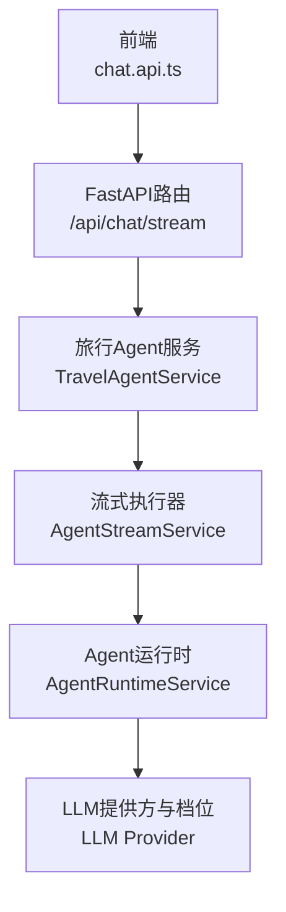
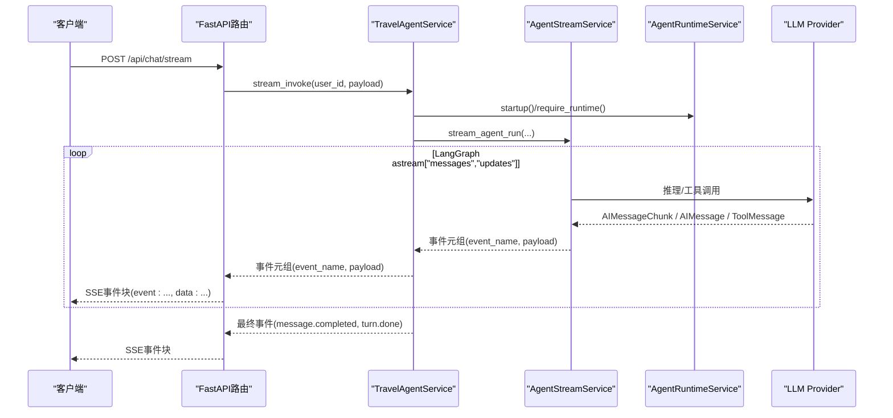
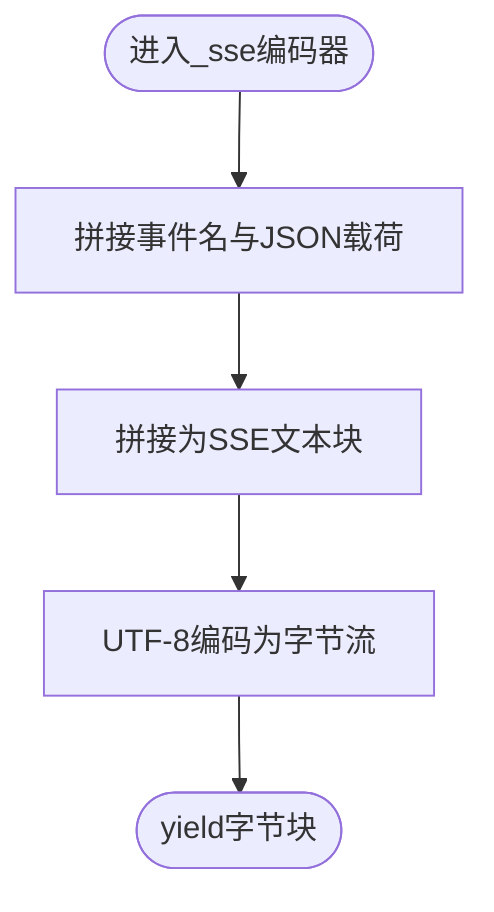
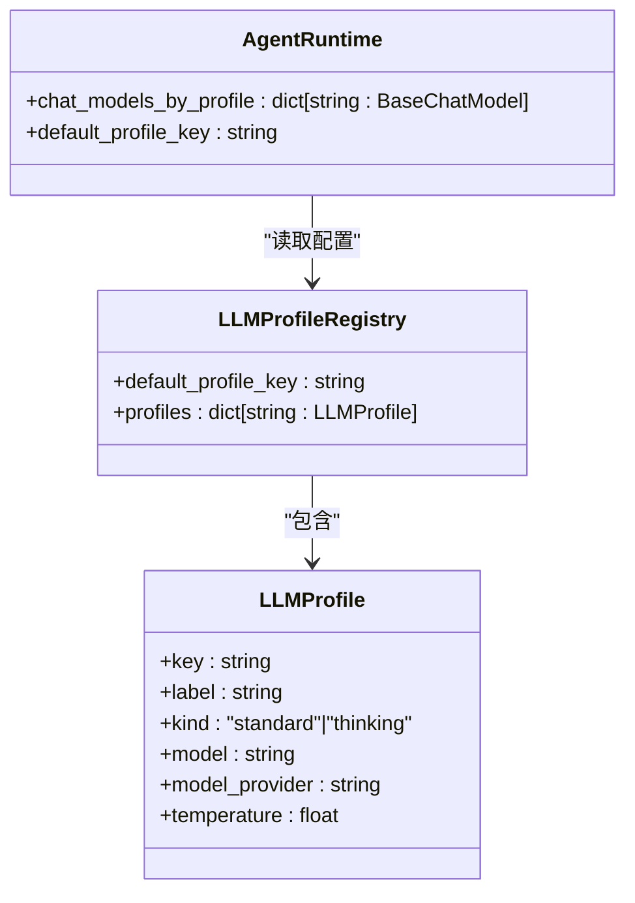
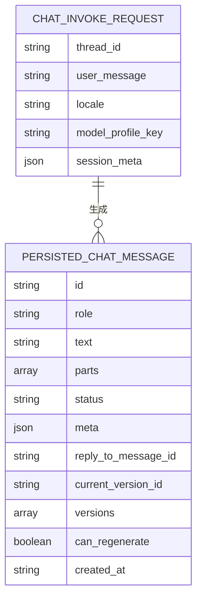
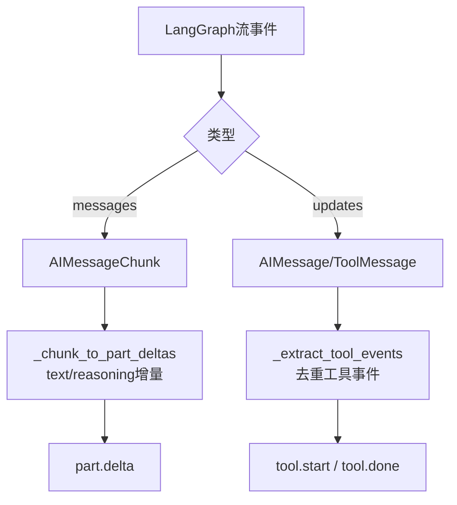
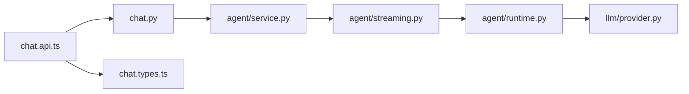

# 聊天流式API

<cite>
**本文引用的文件**
- [backend/app/api/chat.py](file://backend/app/api/chat.py)
- [backend/app/agent/service.py](file://backend/app/agent/service.py)
- [backend/app/agent/streaming.py](file://backend/app/agent/streaming.py)
- [backend/app/agent/runtime.py](file://backend/app/agent/runtime.py)
- [backend/app/llm/provider.py](file://backend/app/llm/provider.py)
- [frontend/src/features/chat/api/chat.api.ts](file://frontend/src/features/chat/api/chat.api.ts)
- [frontend/src/features/chat/model/chat.types.ts](file://frontend/src/features/chat/model/chat.types.ts)
</cite>

## 目录
1. [简介](#简介)
2. [项目结构](#项目结构)
3. [核心组件](#核心组件)
4. [架构总览](#架构总览)
5. [详细组件分析](#详细组件分析)
6. [依赖关系分析](#依赖关系分析)
7. [性能考虑](#性能考虑)
8. [故障排除指南](#故障排除指南)
9. [结论](#结论)
10. [附录](#附录)

## 简介
本文件面向后端与前端开发者，系统性阐述聊天流式API的设计与实现，重点包括：
- SSE（Server-Sent Events）流式传输的实现原理与事件编码机制
- 消息格式规范与事件类型（messages/updates/values）
- ChatInvokeRequest 请求参数与模型档位配置
- 流式响应数据结构、事件类型（turn.start/part.delta/tool.start/tool.done/message.completed/turn.done/error）
- 异常处理策略与错误码说明
- 完整API调用示例与最佳实践
- 断开连接处理与流式传输可靠性保障
- 性能优化建议

## 项目结构
聊天流式API由三层协作构成：
- 前端：负责建立SSE连接、解析事件、渲染UI
- 后端API层：暴露REST接口，封装SSE响应头，转发LangGraph原生流事件
- 业务与运行时层：执行Agent流式计算，产出统一事件序列

图表来源
- [backend/app/api/chat.py:41-72](file://backend/app/api/chat.py#L41-L72)
- [backend/app/agent/service.py:373-507](file://backend/app/agent/service.py#L373-L507)
- [backend/app/agent/streaming.py:80-147](file://backend/app/agent/streaming.py#L80-L147)
- [backend/app/agent/runtime.py:61-133](file://backend/app/agent/runtime.py#L61-L133)
- [backend/app/llm/provider.py:102-155](file://backend/app/llm/provider.py#L102-L155)

章节来源
- [backend/app/api/chat.py:1-72](file://backend/app/api/chat.py#L1-L72)
- [frontend/src/features/chat/api/chat.api.ts:107-180](file://frontend/src/features/chat/api/chat.api.ts#L107-L180)

## 核心组件
- SSE编码器：将事件名称与JSON数据打包为SSE文本块
- ChatInvokeRequest：前端请求体，包含thread_id、user_message、locale、model_profile_key、session_meta
- 模型档位：标准/思考两类，按环境变量注册，运行时按需选择
- 流式事件：turn.start、part.delta、tool.start、tool.done、message.completed、turn.done、error
- 错误处理：捕获取消、参数校验与通用异常，统一编码为error事件

章节来源
- [backend/app/api/chat.py:25-28](file://backend/app/api/chat.py#L25-L28)
- [frontend/src/features/chat/model/chat.types.ts:76-82](file://frontend/src/features/chat/model/chat.types.ts#L76-L82)
- [backend/app/llm/provider.py:102-155](file://backend/app/llm/provider.py#L102-L155)
- [backend/app/agent/streaming.py:96-102](file://backend/app/agent/streaming.py#L96-L102)
- [backend/app/api/chat.py:53-61](file://backend/app/api/chat.py#L53-L61)

## 架构总览
下图展示了从请求到事件流的全链路：

图表来源
- [backend/app/api/chat.py:41-72](file://backend/app/api/chat.py#L41-L72)
- [backend/app/agent/service.py:373-507](file://backend/app/agent/service.py#L373-L507)
- [backend/app/agent/streaming.py:80-147](file://backend/app/agent/streaming.py#L80-L147)
- [backend/app/agent/runtime.py:80-133](file://backend/app/agent/runtime.py#L80-L133)
- [backend/app/llm/provider.py:210-242](file://backend/app/llm/provider.py#L210-L242)

## 详细组件分析

### SSE事件编码与传输
- 编码规则：每条事件由“event: 事件名”和“data: JSON字符串”组成，末尾以两个换行符分隔
- 数据序列化：事件载荷经Pydantic模型dump为字典后JSON序列化
- 响应头：设置Cache-Control=no-cache、Connection=keep-alive、X-Accel-Buffering=no，确保实时推送
- 异常编码：捕获取消、参数错误与通用异常，统一编码为“error”事件，前端据此渲染错误UI

图表来源
- [backend/app/api/chat.py:25-28](file://backend/app/api/chat.py#L25-L28)
- [backend/app/api/chat.py:63-71](file://backend/app/api/chat.py#L63-L71)

章节来源
- [backend/app/api/chat.py:25-28](file://backend/app/api/chat.py#L25-L28)
- [backend/app/api/chat.py:53-61](file://backend/app/api/chat.py#L53-L61)
- [backend/app/api/chat.py:63-71](file://backend/app/api/chat.py#L63-L71)

### ChatInvokeRequest请求参数
- 字段说明
  - thread_id：会话线程标识
  - user_message：用户输入文本
  - locale：语言区域
  - model_profile_key：可选，请求的模型档位键；为空则使用会话存储或默认档位
  - session_meta：会话元信息，透传至运行时上下文
- 参数解析与落库：服务层解析档位、生成占位消息、开启TTS任务、记录检查点

章节来源
- [frontend/src/features/chat/model/chat.types.ts:76-82](file://frontend/src/features/chat/model/chat.types.ts#L76-L82)
- [backend/app/agent/service.py:378-395](file://backend/app/agent/service.py#L378-L395)

### 模型档位配置
- 档位定义：标准/思考两类，分别映射到不同的模型名、温度等参数
- 注册方式：从环境变量读取，启动时构建各档位的ChatModel实例
- 运行时选择：AgentRuntimeService按请求上下文动态选择对应模型实例
- 默认档位：可通过环境变量指定，默认为“standard”

图表来源
- [backend/app/llm/provider.py:40-58](file://backend/app/llm/provider.py#L40-L58)
- [backend/app/llm/provider.py:102-155](file://backend/app/llm/provider.py#L102-L155)
- [backend/app/agent/runtime.py:31-58](file://backend/app/agent/runtime.py#L31-L58)

章节来源
- [backend/app/llm/provider.py:102-155](file://backend/app/llm/provider.py#L102-L155)
- [backend/app/agent/runtime.py:80-133](file://backend/app/agent/runtime.py#L80-L133)

### 流式事件类型与数据结构
- 事件类型
  - turn.start：一轮对话开始，携带用户消息与占位助手消息
  - part.delta：text/reasoning片段增量，或text-like片段收尾（status=completed）
  - tool.start/tool.done：工具调用开始/结束，携带完整入参/结果、来源与结构化卡片
  - message.completed：助手消息完成，返回稳定态消息
  - turn.done：一轮对话结束
  - error：错误事件，包含错误消息
- 前端事件解析：按“event:”和"data:"行拆分，JSON反序列化为事件对象

图表来源
- [frontend/src/features/chat/model/chat.types.ts:76-82](file://frontend/src/features/chat/model/chat.types.ts#L76-L82)
- [frontend/src/features/chat/model/chat.types.ts:146-158](file://frontend/src/features/chat/model/chat.types.ts#L146-L158)

章节来源
- [frontend/src/features/chat/model/chat.types.ts:84-130](file://frontend/src/features/chat/model/chat.types.ts#L84-L130)
- [frontend/src/features/chat/api/chat.api.ts:33-41](file://frontend/src/features/chat/api/chat.api.ts#L33-L41)
- [frontend/src/features/chat/api/chat.api.ts:47-86](file://frontend/src/features/chat/api/chat.api.ts#L47-L86)

### LangGraph流式执行与事件聚合
- 执行模式：LangGraph以["messages","updates"]模式流式输出
  - messages：LLM token增量（AIMessageChunk），用于text/reasoning逐字流
  - updates：节点结束快照（完整AIMessage/ToolMessage），用于工具调用决策与结果
- 事件聚合策略
  - messages阶段仅消费AIMessageChunk，累积为完整上下文，触发text/reasoning增量与收尾
  - updates阶段提取工具调用与返回，去重后生成tool.start/tool.done事件
- UI状态维护：StreamRunState维护text-like片段、工具片段、引用来源等，确保前端可原地更新

图表来源
- [backend/app/agent/streaming.py:125-147](file://backend/app/agent/streaming.py#L125-L147)
- [backend/app/agent/streaming.py:332-368](file://backend/app/agent/streaming.py#L332-L368)
- [backend/app/agent/streaming.py:261-306](file://backend/app/agent/streaming.py#L261-L306)

章节来源
- [backend/app/agent/streaming.py:80-147](file://backend/app/agent/streaming.py#L80-L147)
- [backend/app/agent/streaming.py:151-183](file://backend/app/agent/streaming.py#L151-L183)
- [backend/app/agent/streaming.py:186-228](file://backend/app/agent/streaming.py#L186-L228)

### 异常处理策略
- 取消处理：捕获CancelledError，优雅退出，不向客户端发送额外事件
- 参数错误：捕获ValueError，编码为error事件，返回具体错误消息
- 通用异常：捕获其他异常，编码为error事件，返回通用提示
- 前端行为：收到error事件后停止渲染，显示错误提示；后端同时清理TTS与回滚线程

章节来源
- [backend/app/api/chat.py:53-61](file://backend/app/api/chat.py#L53-L61)
- [backend/app/agent/service.py:444-482](file://backend/app/agent/service.py#L444-L482)

### 客户端断开与可靠性保障
- 断开检测：后端捕获CancelledError，立即停止流式生成
- 状态落盘：无论成功或失败，均将最终状态写入数据库，确保消息稳定态
- 检查点：生成过程记录检查点，失败时回滚到最近有效检查点
- TTS保障：失败时取消TTS任务，避免资源泄露

章节来源
- [backend/app/api/chat.py:53-54](file://backend/app/api/chat.py#L53-L54)
- [backend/app/agent/service.py:454-482](file://backend/app/agent/service.py#L454-L482)

## 依赖关系分析
- API层依赖服务层提供的流式调用能力
- 服务层依赖运行时服务与流式执行器
- 运行时服务依赖LLM提供方，按档位构建模型实例
- 前端依赖API层提供的SSE接口与事件类型定义

图表来源
- [backend/app/api/chat.py:13-21](file://backend/app/api/chat.py#L13-L21)
- [backend/app/agent/service.py:13-45](file://backend/app/agent/service.py#L13-L45)
- [backend/app/agent/streaming.py:39-55](file://backend/app/agent/streaming.py#L39-L55)
- [backend/app/agent/runtime.py:12-21](file://backend/app/agent/runtime.py#L12-L21)
- [backend/app/llm/provider.py:13-18](file://backend/app/llm/provider.py#L13-L18)
- [frontend/src/features/chat/api/chat.api.ts:1-17](file://frontend/src/features/chat/api/chat.api.ts#L1-L17)
- [frontend/src/features/chat/model/chat.types.ts:1-18](file://frontend/src/features/chat/model/chat.types.ts#L1-L18)

章节来源
- [backend/app/api/chat.py:13-21](file://backend/app/api/chat.py#L13-L21)
- [backend/app/agent/service.py:13-45](file://backend/app/agent/service.py#L13-L45)
- [backend/app/agent/streaming.py:39-55](file://backend/app/agent/streaming.py#L39-L55)
- [backend/app/agent/runtime.py:12-21](file://backend/app/agent/runtime.py#L12-L21)
- [backend/app/llm/provider.py:13-18](file://backend/app/llm/provider.py#L13-L18)
- [frontend/src/features/chat/api/chat.api.ts:1-17](file://frontend/src/features/chat/api/chat.api.ts#L1-L17)
- [frontend/src/features/chat/model/chat.types.ts:1-18](file://frontend/src/features/chat/model/chat.types.ts#L1-L18)

## 性能考虑
- 流式输出：LangGraph以["messages","updates"]模式输出，降低首字延迟
- 事件合并：text/reasoning增量与片段收尾合并，减少事件数量
- 去重策略：工具事件按call_id去重，避免重复渲染
- 模型预热：按档位预构建ChatModel实例，运行时直接选择
- I/O分离：TTS与LLM推理并行，但通过回调串行写入，避免竞态

## 故障排除指南
- 常见错误
  - 400：无效的模型档位键（LLM配置错误）
  - 500：通用服务异常，后端会返回error事件
- 前端处理
  - SSE解析失败：检查event/data行格式与JSON有效性
  - 事件缺失：确认后端是否正确抛出error事件
- 后端排查
  - 查看日志：定位pipeline失败位置与checkpoint信息
  - 检查LLM配置：核对环境变量与默认档位

章节来源
- [backend/app/llm/provider.py:24-30](file://backend/app/llm/provider.py#L24-L30)
- [backend/app/api/chat.py:55-61](file://backend/app/api/chat.py#L55-L61)
- [frontend/src/features/chat/api/chat.api.ts:47-86](file://frontend/src/features/chat/api/chat.api.ts#L47-L86)

## 结论
本聊天流式API以SSE为载体，将LangGraph原生事件标准化为统一的前端事件流，结合模型档位与运行时选择，实现了低延迟、可扩展的对话体验。通过严格的事件去重、状态落盘与检查点回滚，系统在可靠性与一致性方面具备良好保障。

## 附录

### API调用示例（后端）
- 路径：POST /api/chat/stream
- 请求体：ChatInvokeRequest
- 响应：text/event-stream，事件类型参考“流式事件类型与数据结构”
- 认证：Bearer Token（可选）

章节来源
- [backend/app/api/chat.py:41-72](file://backend/app/api/chat.py#L41-L72)
- [frontend/src/features/chat/model/chat.types.ts:76-82](file://frontend/src/features/chat/model/chat.types.ts#L76-L82)

### 前端调用示例（TypeScript）
- 使用streamChat发起SSE流
- 使用parseSseBlock与toStreamEvent解析事件
- 使用dispatchStreamEvent在下一帧绘制，提升交互流畅度

章节来源
- [frontend/src/features/chat/api/chat.api.ts:107-180](file://frontend/src/features/chat/api/chat.api.ts#L107-L180)
- [frontend/src/features/chat/api/chat.api.ts:47-86](file://frontend/src/features/chat/api/chat.api.ts#L47-L86)