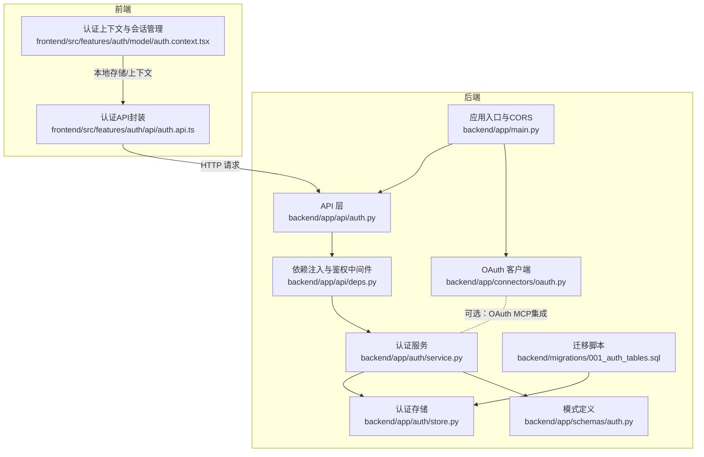
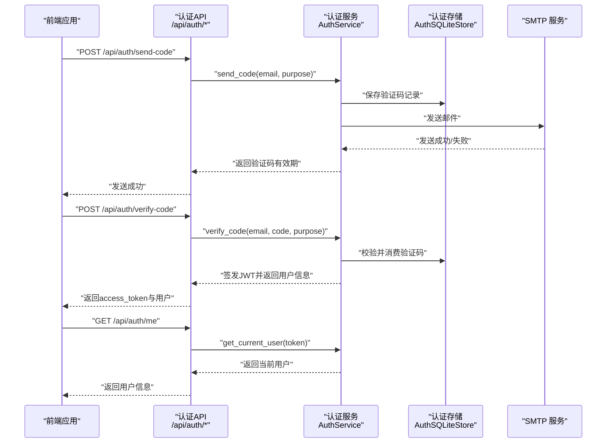
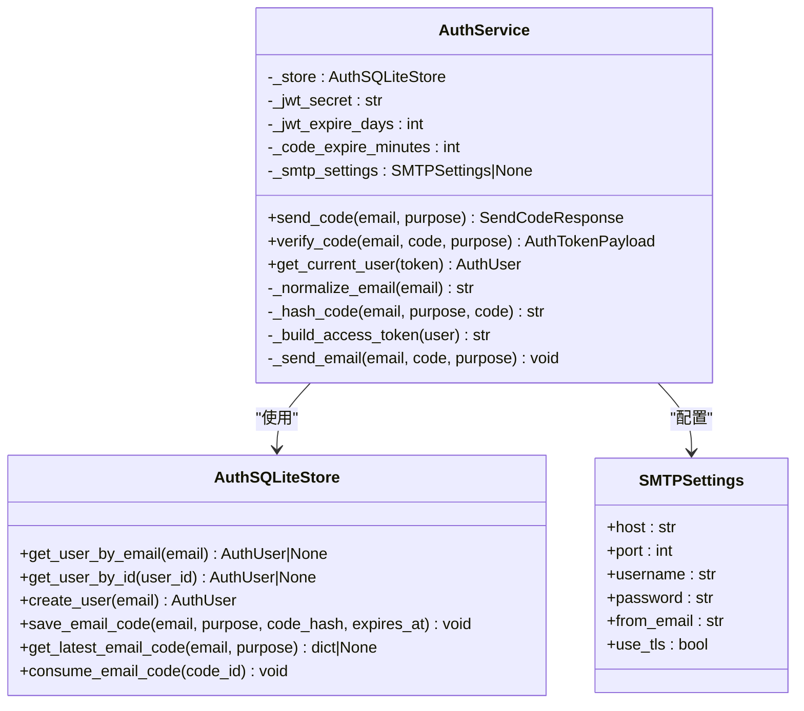
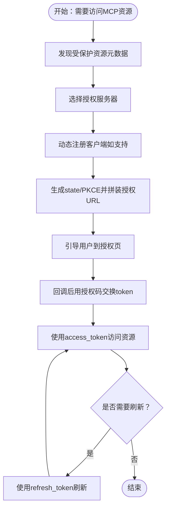
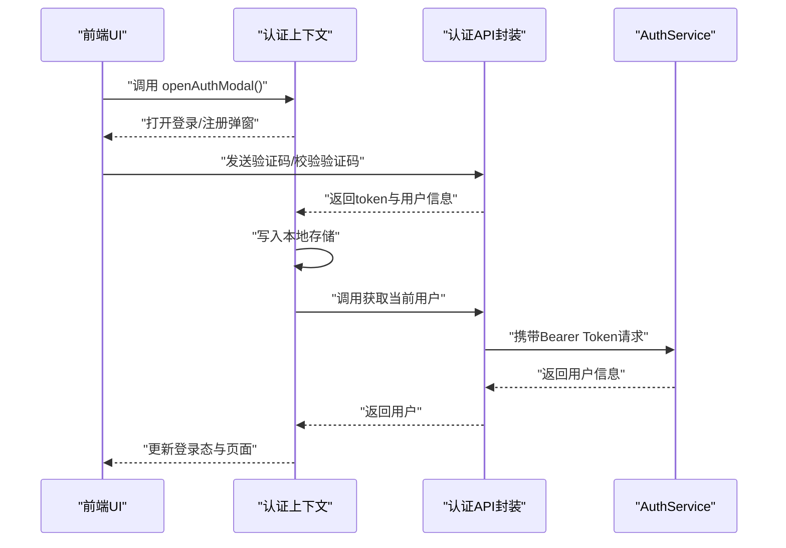
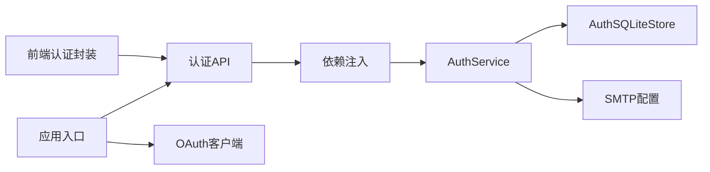

# 认证API

<cite>
**本文引用的文件**
- [backend/app/api/auth.py](file://backend/app/api/auth.py)
- [backend/app/api/deps.py](file://backend/app/api/deps.py)
- [backend/app/auth/service.py](file://backend/app/auth/service.py)
- [backend/app/auth/store.py](file://backend/app/auth/store.py)
- [backend/app/schemas/auth.py](file://backend/app/schemas/auth.py)
- [backend/app/connectors/oauth.py](file://backend/app/connectors/oauth.py)
- [backend/app/main.py](file://backend/app/main.py)
- [backend/migrations/001_auth_tables.sql](file://backend/migrations/001_auth_tables.sql)
- [backend/tests/test_auth_api.py](file://backend/tests/test_auth_api.py)
- [backend/tests/test_auth_service.py](file://backend/tests/test_auth_service.py)
- [frontend/src/features/auth/api/auth.api.ts](file://frontend/src/features/auth/api/auth.api.ts)
- [frontend/src/features/auth/model/auth.context.tsx](file://frontend/src/features/auth/model/auth.context.tsx)
</cite>

## 目录
1. [简介](#简介)
2. [项目结构](#项目结构)
3. [核心组件](#核心组件)
4. [架构总览](#架构总览)
5. [详细组件分析](#详细组件分析)
6. [依赖分析](#依赖分析)
7. [性能考虑](#性能考虑)
8. [故障排查指南](#故障排查指南)
9. [结论](#结论)
10. [附录](#附录)

## 简介
本文件面向后端与前端开发者，系统性阐述本项目的认证API设计与实现，包括：
- OAuth认证流程与MCP授权服务器对接
- JWT令牌管理与用户状态验证机制
- 登录接口、登出接口、用户信息获取接口的实现细节
- 认证中间件的工作原理与权限验证流程
- 安全策略与错误处理方案
- 如何扩展新的认证方式、令牌刷新机制与会话管理策略

## 项目结构
认证相关代码主要分布在后端的API层、服务层、存储层与模式定义，并配合前端的认证上下文与HTTP封装。

**图表来源**
- [backend/app/api/auth.py:1-36](file://backend/app/api/auth.py#L1-L36)
- [backend/app/api/deps.py:1-60](file://backend/app/api/deps.py#L1-L60)
- [backend/app/auth/service.py:1-312](file://backend/app/auth/service.py#L1-L312)
- [backend/app/auth/store.py:1-152](file://backend/app/auth/store.py#L1-L152)
- [backend/app/schemas/auth.py:1-51](file://backend/app/schemas/auth.py#L1-L51)
- [backend/app/connectors/oauth.py:1-419](file://backend/app/connectors/oauth.py#L1-L419)
- [backend/app/main.py:1-54](file://backend/app/main.py#L1-L54)
- [backend/migrations/001_auth_tables.sql:1-21](file://backend/migrations/001_auth_tables.sql#L1-L21)
- [frontend/src/features/auth/api/auth.api.ts:1-21](file://frontend/src/features/auth/api/auth.api.ts#L1-L21)
- [frontend/src/features/auth/model/auth.context.tsx:1-155](file://frontend/src/features/auth/model/auth.context.tsx#L1-L155)

**章节来源**
- [backend/app/api/auth.py:1-36](file://backend/app/api/auth.py#L1-L36)
- [backend/app/api/deps.py:1-60](file://backend/app/api/deps.py#L1-L60)
- [backend/app/auth/service.py:1-312](file://backend/app/auth/service.py#L1-L312)
- [backend/app/auth/store.py:1-152](file://backend/app/auth/store.py#L1-L152)
- [backend/app/schemas/auth.py:1-51](file://backend/app/schemas/auth.py#L1-L51)
- [backend/app/connectors/oauth.py:1-419](file://backend/app/connectors/oauth.py#L1-L419)
- [backend/app/main.py:1-54](file://backend/app/main.py#L1-L54)
- [backend/migrations/001_auth_tables.sql:1-21](file://backend/migrations/001_auth_tables.sql#L1-L21)
- [frontend/src/features/auth/api/auth.api.ts:1-21](file://frontend/src/features/auth/api/auth.api.ts#L1-L21)
- [frontend/src/features/auth/model/auth.context.tsx:1-155](file://frontend/src/features/auth/model/auth.context.tsx#L1-L155)

## 核心组件
- 认证API路由：提供发送验证码、校验验证码换取JWT、获取当前用户信息等接口。
- 认证服务：负责邮箱规范化、验证码哈希、JWT签发与解码、SMTP邮件发送、用户与验证码持久化。
- 认证存储：SQLite访问封装，提供用户查询/创建、验证码保存/消费等。
- 模式定义：Pydantic模型，约束请求/响应结构。
- OAuth客户端：实现MCP授权规范（RFC 8414/7591/7636/8707），支持动态注册、授权码交换与令牌刷新。
- 依赖注入与鉴权中间件：提供Bearer Token解析与当前用户解析。
- 前端认证封装：统一HTTP调用、本地存储与上下文管理。

**章节来源**
- [backend/app/api/auth.py:14-35](file://backend/app/api/auth.py#L14-L35)
- [backend/app/auth/service.py:49-312](file://backend/app/auth/service.py#L49-L312)
- [backend/app/auth/store.py:20-152](file://backend/app/auth/store.py#L20-L152)
- [backend/app/schemas/auth.py:10-51](file://backend/app/schemas/auth.py#L10-L51)
- [backend/app/connectors/oauth.py:1-419](file://backend/app/connectors/oauth.py#L1-L419)
- [backend/app/api/deps.py:49-59](file://backend/app/api/deps.py#L49-L59)
- [frontend/src/features/auth/api/auth.api.ts:10-20](file://frontend/src/features/auth/api/auth.api.ts#L10-L20)
- [frontend/src/features/auth/model/auth.context.tsx:68-124](file://frontend/src/features/auth/model/auth.context.tsx#L68-L124)

## 架构总览
认证体系采用“邮箱验证码+JWT”的轻量认证方案，结合可选的OAuth MCP授权流程，形成前后端协作的认证闭环。

**图表来源**
- [backend/app/api/auth.py:14-35](file://backend/app/api/auth.py#L14-L35)
- [backend/app/auth/service.py:251-312](file://backend/app/auth/service.py#L251-L312)
- [backend/app/auth/store.py:99-152](file://backend/app/auth/store.py#L99-L152)
- [backend/app/api/deps.py:52-59](file://backend/app/api/deps.py#L52-L59)
- [frontend/src/features/auth/api/auth.api.ts:10-20](file://frontend/src/features/auth/api/auth.api.ts#L10-L20)

## 详细组件分析

### 认证API路由
- /api/auth/send-code：发送邮箱验证码，区分登录与注册目的。
- /api/auth/verify-code：校验验证码并签发JWT，完成登录或注册。
- /api/auth/me：携带Bearer Token访问，返回当前登录用户信息。

这些接口均通过依赖注入获取AuthService实例，并在需要时解析当前用户。

**章节来源**
- [backend/app/api/auth.py:14-35](file://backend/app/api/auth.py#L14-L35)
- [backend/app/api/deps.py:35-39](file://backend/app/api/deps.py#L35-L39)
- [backend/app/api/deps.py:52-59](file://backend/app/api/deps.py#L52-L59)

### 认证服务（AuthService）
职责与要点：
- 配置加载：JWT密钥、验证码过期时间、SMTP配置（主机、端口、用户名、密码、发件人、TLS模式）。
- 邮箱规范化与格式校验。
- 验证码生成与哈希（使用JWT密钥参与哈希，防篡改）。
- JWT签发：包含sub、email、iat、exp等声明。
- 邮件发送：支持SSL直连（465/994）与STARTTLS（587），并针对常见异常进行语义化错误映射。
- 用户与验证码持久化：通过AuthSQLiteStore操作users与email_login_codes表。
- 当前用户解析：对Bearer Token进行HS256解码，校验用户存在性。

**图表来源**
- [backend/app/auth/service.py:49-312](file://backend/app/auth/service.py#L49-L312)
- [backend/app/auth/store.py:20-152](file://backend/app/auth/store.py#L20-L152)
- [backend/app/schemas/auth.py:37-51](file://backend/app/schemas/auth.py#L37-L51)

**章节来源**
- [backend/app/auth/service.py:49-312](file://backend/app/auth/service.py#L49-L312)
- [backend/app/auth/store.py:20-152](file://backend/app/auth/store.py#L20-L152)
- [backend/app/schemas/auth.py:10-51](file://backend/app/schemas/auth.py#L10-L51)

### 认证存储（AuthSQLiteStore）
- 用户表：id、email唯一、昵称、创建/更新时间。
- 邮箱验证码表：email、purpose、code_hash、expires_at、consumed_at、created_at。
- 提供用户查询/创建、验证码保存/消费、获取最新验证码等方法。
- 使用事务与连接池化封装，确保一致性与并发安全。

**章节来源**
- [backend/migrations/001_auth_tables.sql:1-21](file://backend/migrations/001_auth_tables.sql#L1-L21)
- [backend/app/auth/store.py:20-152](file://backend/app/auth/store.py#L20-L152)

### OAuth客户端（MCP授权）
- 支持RFC 8414（授权服务器元数据）、RFC 7591（动态客户端注册）、RFC 7636（PKCE）、RFC 8707（资源指示符）。
- 核心能力：受保护资源元数据发现、授权服务器元数据发现、动态注册、授权URL拼装、授权码交换、刷新令牌、合并scope策略。
- 适用于接入第三方MCP服务器，实现外部OAuth流程。

**图表来源**
- [backend/app/connectors/oauth.py:123-217](file://backend/app/connectors/oauth.py#L123-L217)
- [backend/app/connectors/oauth.py:220-268](file://backend/app/connectors/oauth.py#L220-L268)
- [backend/app/connectors/oauth.py:271-381](file://backend/app/connectors/oauth.py#L271-L381)

**章节来源**
- [backend/app/connectors/oauth.py:1-419](file://backend/app/connectors/oauth.py#L1-L419)

### 依赖注入与鉴权中间件
- get_auth_service/get_connector_service/get_agent_service/get_current_user等依赖函数。
- get_current_user使用HTTPBearer方案，解析Bearer Token并调用AuthService.get_current_user进行鉴权。
- 未提供有效Bearer或解码失败时返回401。

**章节来源**
- [backend/app/api/deps.py:18-59](file://backend/app/api/deps.py#L18-L59)

### 前端认证封装与会话管理
- auth.api.ts：封装发送验证码、校验验证码、获取当前用户三个接口。
- auth.context.tsx：负责登录态维护（本地存储token与用户信息）、登出清理、鉴权门禁弹窗控制、登录/登出事件埋点与用户识别。

**图表来源**
- [frontend/src/features/auth/api/auth.api.ts:10-20](file://frontend/src/features/auth/api/auth.api.ts#L10-L20)
- [frontend/src/features/auth/model/auth.context.tsx:68-124](file://frontend/src/features/auth/model/auth.context.tsx#L68-L124)

**章节来源**
- [frontend/src/features/auth/api/auth.api.ts:10-20](file://frontend/src/features/auth/api/auth.api.ts#L10-L20)
- [frontend/src/features/auth/model/auth.context.tsx:68-124](file://frontend/src/features/auth/model/auth.context.tsx#L68-L124)

## 依赖分析
- 认证API依赖依赖注入模块获取AuthService实例。
- AuthService依赖AuthSQLiteStore与SMTP配置。
- 应用入口注册CORS与认证路由，OAuth客户端可独立使用。
- 前端通过统一HTTP封装调用认证API。

**图表来源**
- [backend/app/api/auth.py:7-8](file://backend/app/api/auth.py#L7-L8)
- [backend/app/api/deps.py:35-39](file://backend/app/api/deps.py#L35-L39)
- [backend/app/auth/service.py:52-57](file://backend/app/auth/service.py#L52-L57)
- [backend/app/main.py:31-54](file://backend/app/main.py#L31-L54)
- [frontend/src/features/auth/api/auth.api.ts:8](file://frontend/src/features/auth/api/auth.api.ts#L8)

**章节来源**
- [backend/app/api/auth.py:7-8](file://backend/app/api/auth.py#L7-L8)
- [backend/app/api/deps.py:35-39](file://backend/app/api/deps.py#L35-L39)
- [backend/app/auth/service.py:52-57](file://backend/app/auth/service.py#L52-L57)
- [backend/app/main.py:31-54](file://backend/app/main.py#L31-L54)
- [frontend/src/features/auth/api/auth.api.ts:8](file://frontend/src/features/auth/api/auth.api.ts#L8)

## 性能考虑
- JWT签发与解码为轻量操作，性能瓶颈通常不在认证服务本身。
- 验证码发送依赖SMTP，建议合理配置超时与重试策略，避免阻塞请求。
- SQLite写入采用事务封装，保证一致性；在高并发场景下可考虑连接池优化与索引优化（现有idx_email_login_codes有助于查询最新验证码）。
- 前端在无token或鉴权失败时及时清理本地存储，减少无效请求。

[本节为通用指导，无需特定文件引用]

## 故障排查指南
常见问题与定位思路：
- SMTP发送失败
  - 现象：验证码发送接口报502，提示SMTP域名解析失败、认证失败、连接断开或超时。
  - 处理：检查SMTP_HOST/PORT/USERNAME/PASSWORD/FROM_EMAIL/USE_TLS配置，确认网络与DNS可达性。
- JWT密钥缺失
  - 现象：启动时报JWT_SECRET未配置。
  - 处理：设置JWT_SECRET环境变量。
- 验证码校验失败
  - 现象：验证码错误、已失效、过期或未发送。
  - 处理：确认验证码是否在有效期内且未被消费；检查purpose与email是否匹配。
- Bearer Token无效
  - 现象：/api/auth/me返回401。
  - 处理：确认请求头Authorization为Bearer Token，且未过期或被篡改。

**章节来源**
- [backend/app/auth/service.py:102-120](file://backend/app/auth/service.py#L102-L120)
- [backend/app/auth/service.py:59-64](file://backend/app/auth/service.py#L59-L64)
- [backend/app/auth/service.py:271-296](file://backend/app/auth/service.py#L271-L296)
- [backend/app/api/deps.py:57-59](file://backend/app/api/deps.py#L57-L59)
- [backend/tests/test_auth_service.py:140-147](file://backend/tests/test_auth_service.py#L140-L147)
- [backend/tests/test_auth_service.py:149-164](file://backend/tests/test_auth_service.py#L149-L164)
- [backend/tests/test_auth_service.py:167-192](file://backend/tests/test_auth_service.py#L167-L192)
- [backend/tests/test_auth_service.py:195-226](file://backend/tests/test_auth_service.py#L195-L226)

## 结论
本认证体系以“邮箱验证码+JWT”为核心，辅以OAuth MCP授权能力，前后端协同实现安全、易用的用户认证与会话管理。通过清晰的模块划分与严格的错误处理，系统具备良好的可维护性与扩展性。后续可在OAuth流程基础上扩展更多第三方认证方式，并完善令牌刷新与会话生命周期管理策略。

[本节为总结，无需特定文件引用]

## 附录

### 接口定义与调用示例

- 发送验证码
  - 方法与路径：POST /api/auth/send-code
  - 请求体字段：email（字符串，长度限制见模式定义）、purpose（"login"|"register"）
  - 响应体字段：sent（布尔，默认true）、expires_in（秒）
  - 示例（路径参考）：[发送验证码请求示例:78-80](file://backend/tests/test_auth_api.py#L78-L80)

- 校验验证码并登录/注册
  - 方法与路径：POST /api/auth/verify-code
  - 请求体字段：email、code（6位数字）、purpose
  - 响应体字段：access_token（JWT）、token_type（"bearer"）、user（AuthUser）
  - 示例（路径参考）：[注册与登录流程示例:82-111](file://backend/tests/test_auth_api.py#L82-L111)

- 获取当前用户
  - 方法与路径：GET /api/auth/me
  - 请求头：Authorization: Bearer <access_token>
  - 响应体字段：AuthUser（id、email、nickname、created_at、updated_at）
  - 示例（路径参考）：[获取当前用户示例:113-115](file://backend/tests/test_auth_api.py#L113-L115)

- OAuth授权流程（MCP）
  - 步骤概览：受保护资源元数据发现 → 授权服务器元数据发现 → 动态注册（可选） → 生成state/PKCE → 授权页 → 回调交换token → 刷新令牌（可选）
  - 关键函数参考：[发现与注册:123-268](file://backend/app/connectors/oauth.py#L123-L268)，[授权与交换:271-381](file://backend/app/connectors/oauth.py#L271-L381)

**章节来源**
- [backend/app/api/auth.py:14-35](file://backend/app/api/auth.py#L14-L35)
- [backend/app/schemas/auth.py:23-51](file://backend/app/schemas/auth.py#L23-L51)
- [backend/tests/test_auth_api.py:78-115](file://backend/tests/test_auth_api.py#L78-L115)
- [backend/app/connectors/oauth.py:123-381](file://backend/app/connectors/oauth.py#L123-L381)

### 安全策略与最佳实践
- JWT密钥管理：必须设置JWT_SECRET，避免硬编码，使用环境变量或密钥管理服务。
- 验证码安全：使用HMAC比较，防止时序攻击；设置合理过期时间；仅在有效期内允许消费。
- 传输安全：生产环境建议启用HTTPS；SMTP配置优先使用STARTTLS或SSL直连。
- 前端存储：仅在本地存储最小必要信息；登出时清理所有认证相关缓存。
- 权限控制：所有受保护接口均需Bearer Token，服务端严格校验token有效性与用户存在性。

**章节来源**
- [backend/app/auth/service.py:59-64](file://backend/app/auth/service.py#L59-L64)
- [backend/app/auth/service.py:271-296](file://backend/app/auth/service.py#L271-L296)
- [backend/app/api/deps.py:57-59](file://backend/app/api/deps.py#L57-L59)
- [frontend/src/features/auth/model/auth.context.tsx:68-79](file://frontend/src/features/auth/model/auth.context.tsx#L68-L79)

### 扩展与演进建议
- 扩展新的认证方式
  - 可在AuthService中新增认证策略（如手机号短信、第三方OAuth），并在API层增加相应路由与依赖。
  - 对接OAuth时可复用OAuth客户端模块，遵循MCP授权规范。
- 令牌刷新机制
  - 当前JWT为一次性签发；若需长期会话，可在OAuth流程中引入refresh_token并实现自动刷新。
- 会话管理策略
  - 前端可实现“静默刷新”：在token即将过期前主动刷新；后端可引入黑名单或短期刷新令牌以增强安全性。

**章节来源**
- [backend/app/connectors/oauth.py:320-339](file://backend/app/connectors/oauth.py#L320-L339)
- [frontend/src/features/auth/model/auth.context.tsx:81-110](file://frontend/src/features/auth/model/auth.context.tsx#L81-L110)