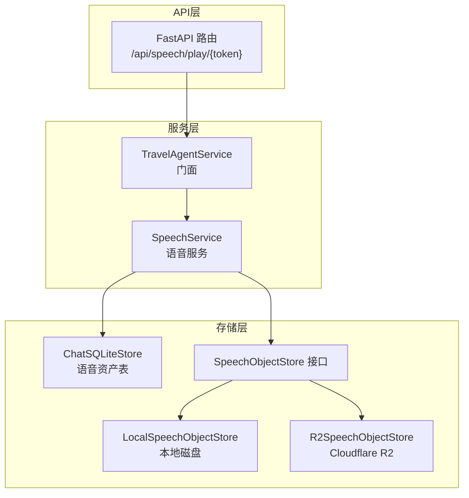
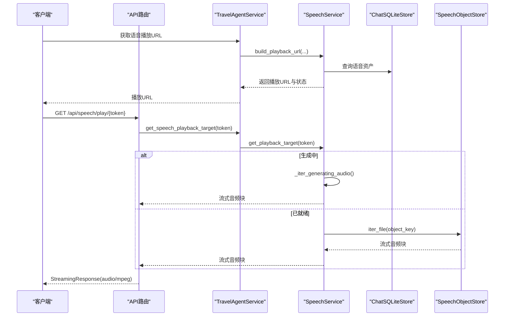
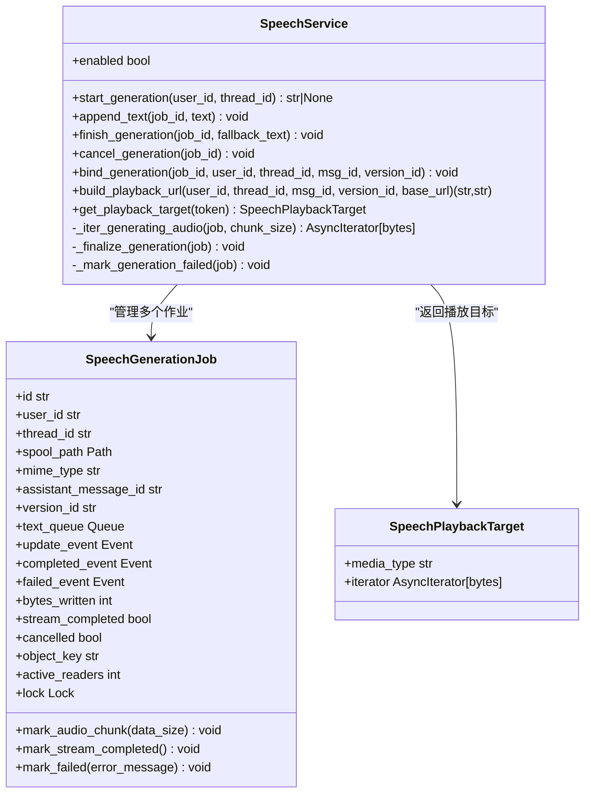
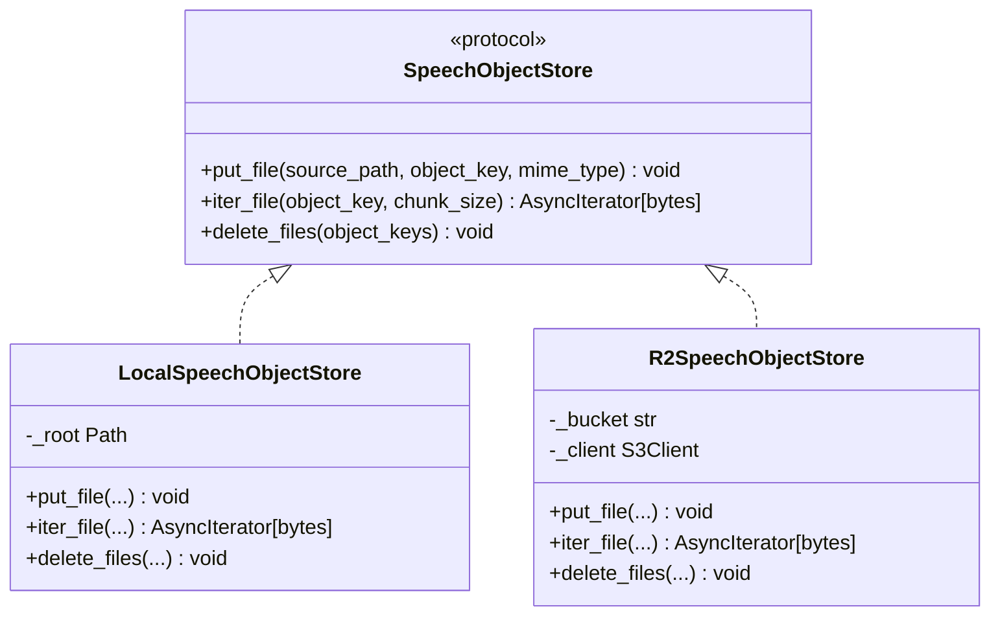
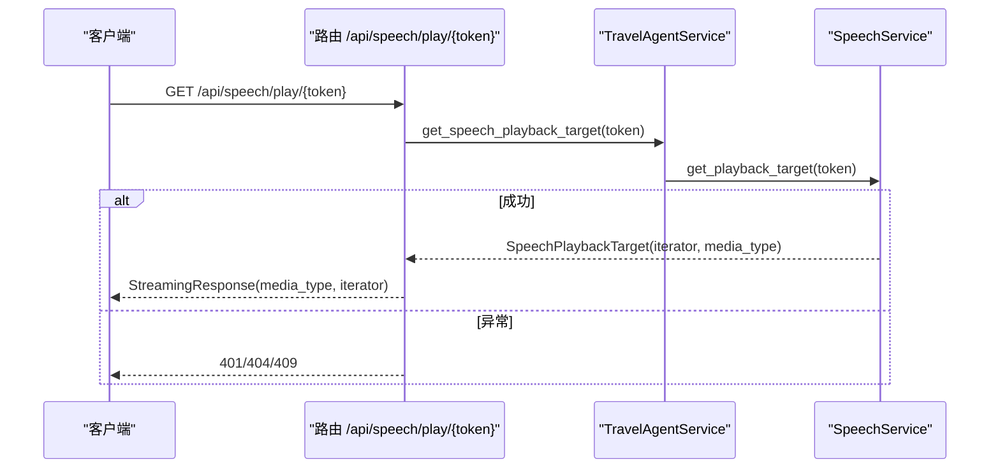
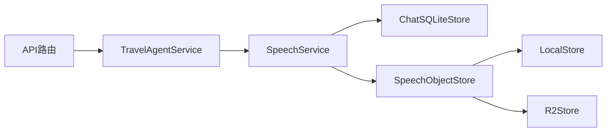

# 语音服务API

<cite>
**本文引用的文件**   
- [backend/app/speech/service.py](file://backend/app/speech/service.py)
- [backend/app/speech/object_store.py](file://backend/app/speech/object_store.py)
- [backend/app/api/speech.py](file://backend/app/api/speech.py)
- [backend/app/agent/service.py](file://backend/app/agent/service.py)
- [backend/app/memory/sqlite_store.py](file://backend/app/memory/sqlite_store.py)
- [backend/migrations/004_chat_speech_assets.sql](file://backend/migrations/004_chat_speech_assets.sql)
- [backend/tests/test_speech_service.py](file://backend/tests/test_speech_service.py)
</cite>

## 目录
1. [简介](#简介)
2. [项目结构](#项目结构)
3. [核心组件](#核心组件)
4. [架构总览](#架构总览)
5. [详细组件分析](#详细组件分析)
6. [依赖关系分析](#依赖关系分析)
7. [性能考量](#性能考量)
8. [故障排查指南](#故障排查指南)
9. [结论](#结论)
10. [附录](#附录)

## 简介
本文件系统性梳理语音服务API的设计与实现，覆盖以下主题：
- 语音合成接口与流式生成机制
- 音频文件生成、持久化与播放URL管理
- 语音参数配置、音频格式与质量控制
- 缓存策略与CDN集成（R2）
- 播放控制接口与安全令牌
- 配置示例、性能优化建议、错误处理方案
- 扩展语音提供商与自定义参数、音频质量优化策略

## 项目结构
语音服务位于后端Python应用中，采用分层设计：
- API层：对外暴露播放接口
- 服务层：协调生成、持久化与播放
- 存储层：SQLite持久化语音资产元数据；对象存储负责二进制音频
- 配置层：通过环境变量启用/禁用与参数化



图表来源
- [backend/app/api/speech.py:15-35](file://backend/app/api/speech.py#L15-L35)
- [backend/app/agent/service.py:190-211](file://backend/app/agent/service.py#L190-L211)
- [backend/app/speech/service.py:90-127](file://backend/app/speech/service.py#L90-L127)
- [backend/app/speech/object_store.py:12-21](file://backend/app/speech/object_store.py#L12-L21)

章节来源
- [backend/app/api/speech.py:1-35](file://backend/app/api/speech.py#L1-L35)
- [backend/app/agent/service.py:97-124](file://backend/app/agent/service.py#L97-L124)
- [backend/app/speech/service.py:90-127](file://backend/app/speech/service.py#L90-L127)
- [backend/app/speech/object_store.py:12-21](file://backend/app/speech/object_store.py#L12-L21)

## 核心组件
- 语音服务（SpeechService）
  - 负责启动/追加/完成/取消语音生成任务
  - 流式写入本地暂存文件，完成后上传对象存储
  - 生成播放URL并签发短期JWT令牌
  - 支持“生成中”与“已就绪”的播放路径
- 对象存储（SpeechObjectStore）
  - 协议抽象：put_file/iter_file/delete_files
  - 本地磁盘实现与R2实现，自动按环境变量选择
- API路由（/api/speech/play/{token}）
  - 校验令牌，返回StreamingResponse音频流
- 代理服务（TravelAgentService）
  - 作为门面，调用SpeechService生成播放URL与音频流
- SQLite存储（ChatSQLiteStore）
  - 维护assistant版本语音资产状态、MIME类型、对象键等

章节来源
- [backend/app/speech/service.py:90-127](file://backend/app/speech/service.py#L90-L127)
- [backend/app/speech/object_store.py:12-21](file://backend/app/speech/object_store.py#L12-L21)
- [backend/app/api/speech.py:15-35](file://backend/app/api/speech.py#L15-L35)
- [backend/app/agent/service.py:190-211](file://backend/app/agent/service.py#L190-L211)
- [backend/app/memory/sqlite_store.py:509-541](file://backend/app/memory/sqlite_store.py#L509-L541)

## 架构总览
语音服务整体流程：
- 客户端请求生成播放URL
- 服务端生成短期JWT令牌并返回播放地址
- 客户端访问播放接口
- 服务端根据令牌解析目标版本，返回“生成中”流或R2/本地文件流
- 生成完成后，资产状态更新为“就绪”，后续播放直接从对象存储读取



图表来源
- [backend/app/api/speech.py:15-35](file://backend/app/api/speech.py#L15-L35)
- [backend/app/agent/service.py:190-211](file://backend/app/agent/service.py#L190-L211)
- [backend/app/speech/service.py:238-296](file://backend/app/speech/service.py#L238-L296)
- [backend/app/speech/object_store.py:35-61](file://backend/app/speech/object_store.py#L35-L61)

## 详细组件分析

### 语音服务（SpeechService）
职责与关键点：
- 任务生命周期
  - 启动：start_generation 创建作业并后台线程运行
  - 追加：append_text 将文本片段写入队列
  - 完成：finish_generation 标记输入结束并触发收尾
  - 取消：cancel_generation 清理未落库任务
- 生成器
  - 使用DashScope TTS SDK进行流式合成
  - 写入本地spool文件，边写边通知播放器
  - 完成后异步上传至对象存储，更新资产状态为“就绪”
- 播放URL与令牌
  - build_playback_url 生成短期JWT令牌，包含用户、会话、消息、版本信息
  - get_playback_target 根据令牌解析目标，返回媒体类型与异步迭代器
- 生成中播放
  - _iter_generating_audio 以chunk方式读取spool文件，支持并发读者
  - 通过事件与锁保障并发安全与清理时机



图表来源
- [backend/app/speech/service.py:33-87](file://backend/app/speech/service.py#L33-L87)
- [backend/app/speech/service.py:90-127](file://backend/app/speech/service.py#L90-L127)
- [backend/app/speech/service.py:238-296](file://backend/app/speech/service.py#L238-L296)

章节来源
- [backend/app/speech/service.py:145-237](file://backend/app/speech/service.py#L145-L237)
- [backend/app/speech/service.py:298-477](file://backend/app/speech/service.py#L298-L477)

### 对象存储（SpeechObjectStore）
- 协议
  - put_file：上传本地文件到对象存储
  - iter_file：按chunk读取对象存储文件
  - delete_files：批量删除
- 实现
  - LocalSpeechObjectStore：本地磁盘复制
  - R2SpeechObjectStore：Cloudflare R2（S3兼容），自动从环境变量读取凭据
- 选择逻辑
  - 若R2环境变量齐全则优先使用R2，否则回退本地磁盘



图表来源
- [backend/app/speech/object_store.py:12-21](file://backend/app/speech/object_store.py#L12-L21)
- [backend/app/speech/object_store.py:23-62](file://backend/app/speech/object_store.py#L23-L62)
- [backend/app/speech/object_store.py:64-120](file://backend/app/speech/object_store.py#L64-L120)
- [backend/app/speech/object_store.py:122-139](file://backend/app/speech/object_store.py#L122-L139)

章节来源
- [backend/app/speech/object_store.py:12-139](file://backend/app/speech/object_store.py#L12-L139)

### API播放接口（/api/speech/play/{token}）
- 功能
  - 校验JWT令牌有效性与用途
  - 解析目标版本，返回StreamingResponse
  - 设置Cache-Control: no-cache
- 错误处理
  - 无效令牌：401
  - 资产不存在：404
  - 资产不可用：409



图表来源
- [backend/app/api/speech.py:15-35](file://backend/app/api/speech.py#L15-L35)
- [backend/app/agent/service.py:208-211](file://backend/app/agent/service.py#L208-L211)
- [backend/app/speech/service.py:270-296](file://backend/app/speech/service.py#L270-L296)

章节来源
- [backend/app/api/speech.py:15-35](file://backend/app/api/speech.py#L15-L35)

### 语音参数与质量控制
- 语音提供商与模型
  - 通过环境变量配置：ALIYUN_TTS_API_KEY、ALIYUN_TTS_WS_URL、ALIYUN_TTS_MODEL、ALIYUN_TTS_VOICE
  - 默认模型与声音可在代码中看到默认值
- 音频格式
  - 生成时使用MP3_22050HZ_MONO_256KBPS
  - 播放时媒体类型为audio/mpeg
- 质量控制
  - 通过调整采样率、声道与码率影响体积与清晰度
  - 生成完成后统一MIME类型，确保播放端一致

章节来源
- [backend/app/speech/service.py:112-126](file://backend/app/speech/service.py#L112-L126)
- [backend/app/speech/service.py:366-371](file://backend/app/speech/service.py#L366-L371)

### 播放控制与缓存策略
- 播放控制
  - 通过短期JWT令牌授权访问，令牌有效期固定
  - 生成中播放支持并发读者，内部计数与清理逻辑避免资源泄露
- 缓存策略
  - 生成中：spool文件增量读取，适合低延迟播放
  - 已就绪：对象存储直读，适合CDN加速
- CDN集成
  - R2作为对象存储，天然支持CDN边缘节点
  - 通过R2端点URL与S3兼容API实现上传与下载

章节来源
- [backend/app/speech/service.py:21-22](file://backend/app/speech/service.py#L21-L22)
- [backend/app/speech/service.py:422-454](file://backend/app/speech/service.py#L422-L454)
- [backend/app/speech/object_store.py:64-120](file://backend/app/speech/object_store.py#L64-L120)

### 数据模型与状态机
- 语音资产表
  - 关键字段：状态（generating/ready/failed）、MIME类型、对象键、错误信息
  - 与assistant_message_versions外键关联，随版本生命周期变化
- 状态流转
  - 生成中 → 就绪（成功）或失败（异常）
  - 播放接口根据状态返回不同数据源

```mermaid
erDiagram
ASSISTANT_MESSAGE_VERSIONS {
text id PK
text assistant_message_id FK
int version_index
text kind
text status
text meta_json
text feedback
text parent_checkpoint_id
text result_checkpoint_id
text created_at
}
ASSISTANT_VERSION_SPEECH_ASSETS {
text id PK
text assistant_message_version_id UK
text status CK
text mime_type
text object_key
text error_message
text created_at
text updated_at
}
ASSISTANT_MESSAGE_VERSIONS ||--|| ASSISTANT_VERSION_SPEECH_ASSETS : "关联"
```

图表来源
- [backend/migrations/004_chat_speech_assets.sql:1-15](file://backend/migrations/004_chat_speech_assets.sql#L1-L15)
- [backend/app/memory/sqlite_store.py:509-541](file://backend/app/memory/sqlite_store.py#L509-L541)

章节来源
- [backend/migrations/004_chat_speech_assets.sql:1-15](file://backend/migrations/004_chat_speech_assets.sql#L1-L15)
- [backend/app/memory/sqlite_store.py:509-541](file://backend/app/memory/sqlite_store.py#L509-L541)

## 依赖关系分析
- 组件耦合
  - API层仅依赖门面服务；门面服务依赖SpeechService；SpeechService依赖SQLite与对象存储
  - 对象存储通过协议抽象解耦具体实现
- 外部依赖
  - DashScope TTS SDK（阿里云）
  - Cloudflare R2（可选）
  - JWT令牌校验



图表来源
- [backend/app/api/speech.py:15-35](file://backend/app/api/speech.py#L15-L35)
- [backend/app/agent/service.py:190-211](file://backend/app/agent/service.py#L190-L211)
- [backend/app/speech/service.py:90-127](file://backend/app/speech/service.py#L90-L127)
- [backend/app/speech/object_store.py:12-21](file://backend/app/speech/object_store.py#L12-L21)

章节来源
- [backend/app/api/speech.py:15-35](file://backend/app/api/speech.py#L15-L35)
- [backend/app/agent/service.py:190-211](file://backend/app/agent/service.py#L190-L211)
- [backend/app/speech/service.py:90-127](file://backend/app/speech/service.py#L90-L127)
- [backend/app/speech/object_store.py:12-21](file://backend/app/speech/object_store.py#L12-L21)

## 性能考量
- 生成阶段
  - 使用队列+后台线程处理流式合成，避免阻塞主线程
  - spool文件边写边播，降低首包延迟
- 播放阶段
  - 生成中：按chunk读取spool文件，减少内存占用
  - 已就绪：对象存储直读，结合R2 CDN提升边缘命中率
- 并发与清理
  - active_readers计数与cleanup_requested避免提前删除spool文件
  - 事件驱动的通知机制降低轮询成本

章节来源
- [backend/app/speech/service.py:298-477](file://backend/app/speech/service.py#L298-L477)
- [backend/app/speech/service.py:422-454](file://backend/app/speech/service.py#L422-L454)

## 故障排查指南
- 服务未启用
  - 现象：enabled为False
  - 原因：缺少ALIYUN_TTS_API_KEY或JWT_SECRET
  - 验证：单元测试覆盖此场景
- 播放失败
  - 无效令牌：401
  - 资产不存在：404
  - 资产不可用：409（如状态非generating/ready）
- 生成失败
  - on_error回调会标记失败并更新状态
  - 对象存储上传异常也会回滚状态
- 清理问题
  - 生成中播放结束后，若无读者才会清理spool文件
  - 如出现磁盘占用，检查是否有长时间未释放的播放器

章节来源
- [backend/tests/test_speech_service.py:7-19](file://backend/tests/test_speech_service.py#L7-L19)
- [backend/app/api/speech.py:21-29](file://backend/app/api/speech.py#L21-L29)
- [backend/app/speech/service.py:373-385](file://backend/app/speech/service.py#L373-L385)
- [backend/app/speech/service.py:461-477](file://backend/app/speech/service.py#L461-L477)

## 结论
该语音服务API以“生成中流式播放+对象存储持久化+短期令牌鉴权”为核心设计，具备良好的并发控制与可扩展性。通过R2实现CDN加速与跨地域分发，配合可配置的语音参数与质量控制，满足多场景需求。建议在生产环境中：
- 明确配置ALIYUN_TTS_*与JWT_SECRET
- 使用R2并开启CDN边缘缓存
- 监控生成失败率与spool清理情况
- 根据业务需求调整音频格式与质量参数

## 附录

### 配置清单与示例
- 语音服务启用条件
  - ALIYUN_TTS_API_KEY：TTS提供商API Key
  - JWT_SECRET：播放令牌签名密钥
- 语音参数
  - ALIYUN_TTS_WS_URL：WebSocket推理地址（默认已内置）
  - ALIYUN_TTS_MODEL：模型名称（默认已内置）
  - ALIYUN_TTS_VOICE：声音名称（默认已内置）
- 对象存储
  - R2_ACCOUNT_ID、R2_ACCESS_KEY_ID、R2_SECRET_ACCESS_KEY、R2_BUCKET：R2凭据（全填则启用R2）
  - 否则回退本地磁盘对象存储

章节来源
- [backend/app/speech/service.py:107-126](file://backend/app/speech/service.py#L107-L126)
- [backend/app/speech/object_store.py:122-139](file://backend/app/speech/object_store.py#L122-L139)
- [backend/tests/test_speech_service.py:7-19](file://backend/tests/test_speech_service.py#L7-L19)

### 扩展与定制建议
- 扩展语音提供商
  - 在SpeechService中替换DashScope调用为新提供商SDK
  - 保持ResultCallback接口与文件写入逻辑一致
- 自定义语音参数
  - 通过环境变量或配置中心注入新的模型/声音
  - 注意音频格式与播放端兼容性
- 音频质量优化
  - 提升采样率/码率可改善音质但增大体积
  - 结合业务场景选择合适格式（如AAC/FLAC）
- CDN与缓存
  - 使用R2并开启边缘缓存
  - 控制播放URL的缓存策略（当前接口设置no-cache）