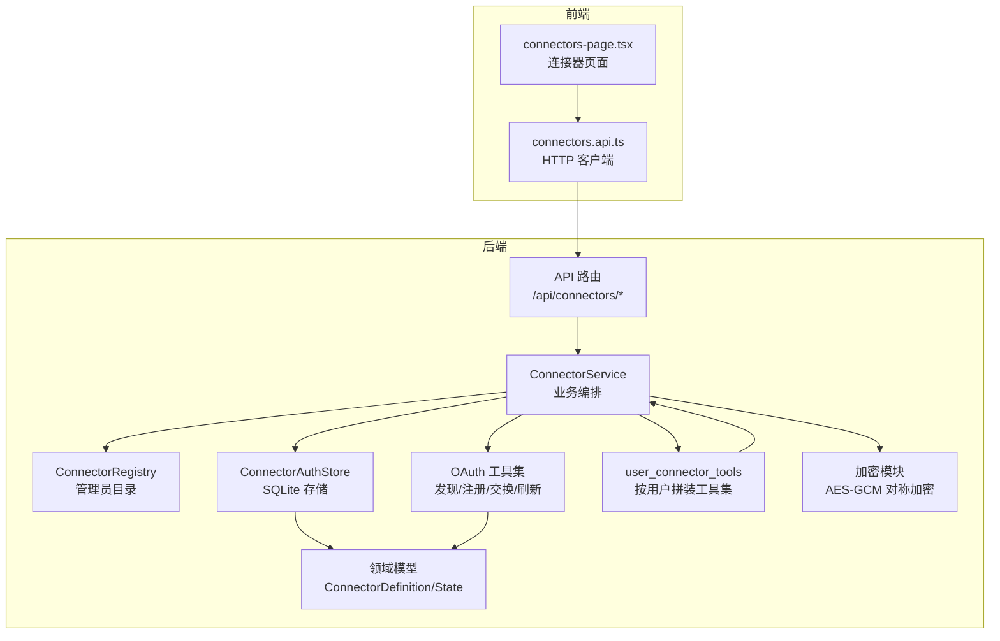
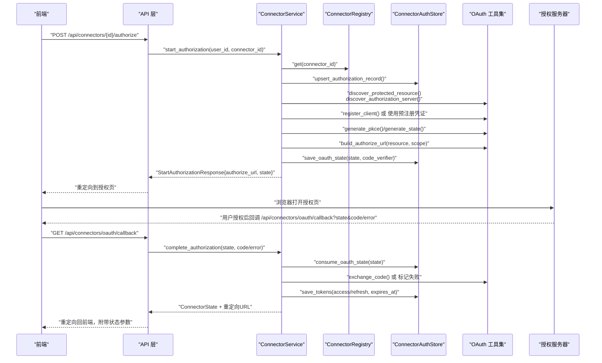
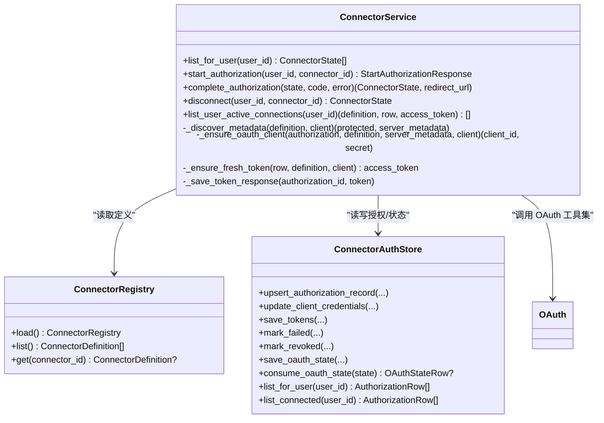
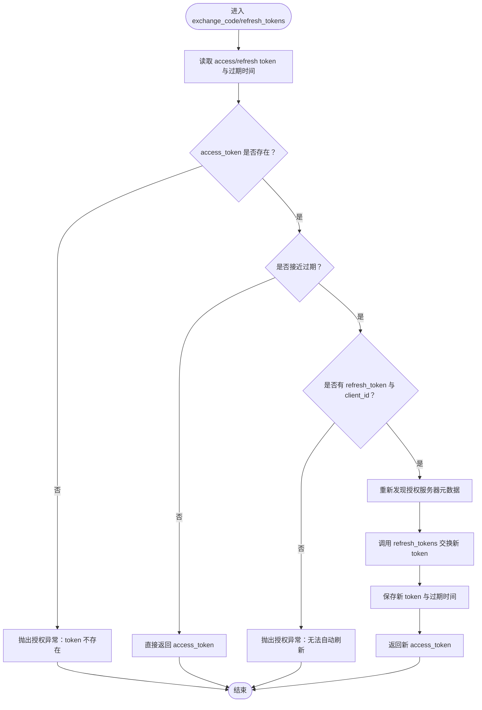
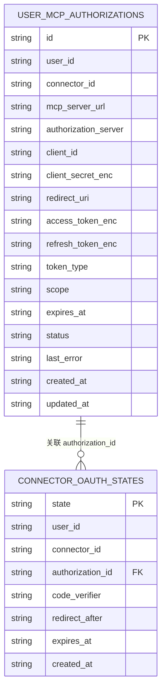
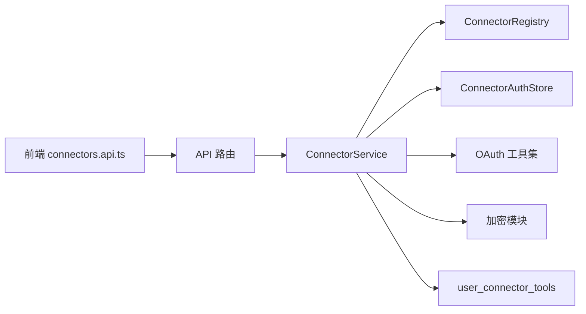
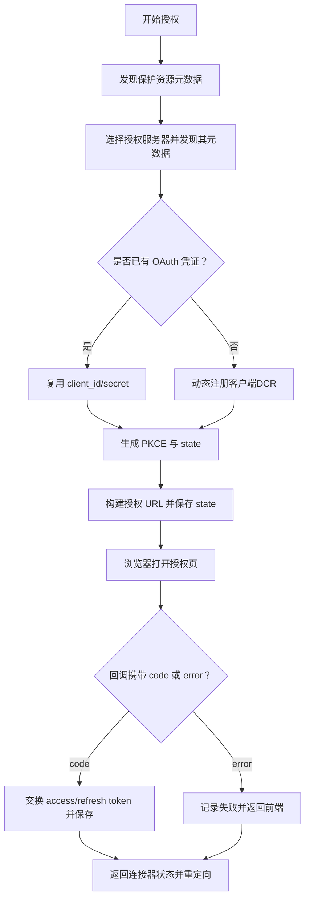

# 连接器API

<cite>
**本文引用的文件**
- [backend/app/connectors/__init__.py](file://backend/app/connectors/__init__.py)
- [backend/app/connectors/oauth.py](file://backend/app/connectors/oauth.py)
- [backend/app/connectors/service.py](file://backend/app/connectors/service.py)
- [backend/app/connectors/registry.py](file://backend/app/connectors/registry.py)
- [backend/app/connectors/store.py](file://backend/app/connectors/store.py)
- [backend/app/connectors/runtime.py](file://backend/app/connectors/runtime.py)
- [backend/app/connectors/crypto.py](file://backend/app/connectors/crypto.py)
- [backend/app/schemas/connectors.py](file://backend/app/schemas/connectors.py)
- [backend/app/api/connectors.py](file://backend/app/api/connectors.py)
- [backend/config/connectors.example.json](file://backend/config/connectors.example.json)
- [backend/tests/test_connectors_oauth.py](file://backend/tests/test_connectors_oauth.py)
- [backend/tests/test_connectors_crypto.py](file://backend/tests/test_connectors_crypto.py)
- [frontend/src/features/connectors/api/connectors.api.ts](file://frontend/src/features/connectors/api/connectors.api.ts)
- [frontend/src/features/connectors/ui/connectors-page.tsx](file://frontend/src/features/connectors/ui/connectors-page.tsx)
- [docs/oauth流程调研.md](file://docs/oauth流程调研.md)
</cite>

## 目录
1. [简介](#简介)
2. [项目结构](#项目结构)
3. [核心组件](#核心组件)
4. [架构总览](#架构总览)
5. [详细组件分析](#详细组件分析)
6. [依赖分析](#依赖分析)
7. [性能考量](#性能考量)
8. [故障排查指南](#故障排查指南)
9. [结论](#结论)
10. [附录](#附录)

## 简介
本文件面向“连接器API”的使用者与维护者，系统性说明基于 OAuth 2.1 的 MCP 连接器配置、授权流程、令牌管理与运行时工具装配机制。文档覆盖以下主题：
- 连接器注册与配置管理（管理员维护的目录、环境变量注入、默认范围合并策略）
- OAuth 授权流程（发现、动态注册、授权码交换、PKCE、令牌刷新）
- 令牌生命周期管理（加密存储、过期检测、自动刷新）
- 连接器状态监控与授权状态检查
- 连接器集成示例与错误处理方案
- 如何扩展新的连接器类型、自定义授权流程、连接器健康检查机制

## 项目结构
连接器子系统由“API层”“业务编排层”“OAuth协议实现层”“持久化层”“运行时工具装配层”“配置与模式定义”组成，前后端通过 REST API 对接。

图表来源
- [backend/app/api/connectors.py:1-103](file://backend/app/api/connectors.py#L1-L103)
- [backend/app/connectors/service.py:74-421](file://backend/app/connectors/service.py#L74-L421)
- [backend/app/connectors/registry.py:46-87](file://backend/app/connectors/registry.py#L46-L87)
- [backend/app/connectors/store.py:78-349](file://backend/app/connectors/store.py#L78-L349)
- [backend/app/connectors/oauth.py:1-419](file://backend/app/connectors/oauth.py#L1-L419)
- [backend/app/connectors/runtime.py:50-88](file://backend/app/connectors/runtime.py#L50-L88)
- [backend/app/connectors/crypto.py:1-44](file://backend/app/connectors/crypto.py#L1-L44)
- [backend/app/schemas/connectors.py:1-54](file://backend/app/schemas/connectors.py#L1-L54)

章节来源
- [backend/app/connectors/__init__.py:1-5](file://backend/app/connectors/__init__.py#L1-L5)
- [backend/app/api/connectors.py:1-103](file://backend/app/api/connectors.py#L1-L103)
- [backend/app/connectors/service.py:74-421](file://backend/app/connectors/service.py#L74-L421)
- [backend/app/connectors/registry.py:46-87](file://backend/app/connectors/registry.py#L46-L87)
- [backend/app/connectors/store.py:78-349](file://backend/app/connectors/store.py#L78-L349)
- [backend/app/connectors/oauth.py:1-419](file://backend/app/connectors/oauth.py#L1-L419)
- [backend/app/connectors/runtime.py:50-88](file://backend/app/connectors/runtime.py#L50-L88)
- [backend/app/connectors/crypto.py:1-44](file://backend/app/connectors/crypto.py#L1-L44)
- [backend/app/schemas/connectors.py:1-54](file://backend/app/schemas/connectors.py#L1-L54)

## 核心组件
- API 层：提供连接器列表、开始授权、断开连接、OAuth 回调等接口，统一错误映射为 HTTP 状态码。
- 业务编排层：负责发现授权服务器、动态注册客户端、生成授权 URL、处理回调、保存令牌、按需刷新、构建用户级工具集。
- OAuth 协议层：实现 RFC 9728、RFC 8414、RFC 7591、RFC 7636、RFC 8707、RFC 6749 等规范的子集。
- 存储层：以 SQLite 记录用户授权状态、OAuth state、OAuth 凭证与令牌。
- 配置与模式：管理员维护的连接器目录（JSON），前端对接的领域模型与响应结构。
- 运行时工具装配：按用户已连接的连接器，动态拼装 MCP 工具集供代理使用。

章节来源
- [backend/app/api/connectors.py:24-103](file://backend/app/api/connectors.py#L24-L103)
- [backend/app/connectors/service.py:74-421](file://backend/app/connectors/service.py#L74-L421)
- [backend/app/connectors/oauth.py:1-419](file://backend/app/connectors/oauth.py#L1-L419)
- [backend/app/connectors/store.py:78-349](file://backend/app/connectors/store.py#L78-L349)
- [backend/app/schemas/connectors.py:13-54](file://backend/app/schemas/connectors.py#L13-L54)
- [backend/app/connectors/runtime.py:50-88](file://backend/app/connectors/runtime.py#L50-L88)

## 架构总览
下面的序列图展示从“开始授权”到“完成授权”的完整流程，包括发现、注册、授权、回调与令牌保存。

图表来源
- [backend/app/api/connectors.py:34-95](file://backend/app/api/connectors.py#L34-L95)
- [backend/app/connectors/service.py:108-230](file://backend/app/connectors/service.py#L108-L230)
- [backend/app/connectors/oauth.py:123-217](file://backend/app/connectors/oauth.py#L123-L217)
- [backend/app/connectors/store.py:105-158](file://backend/app/connectors/store.py#L105-L158)

## 详细组件分析

### 组件一：API 层（REST 接口）
- GET /api/connectors：列出当前用户可授权的连接器状态
- POST /api/connectors/{connector_id}/authorize：开始授权流程，返回授权 URL 与 state
- DELETE /api/connectors/{connector_id}：断开授权（撤销）
- GET /api/connectors/oauth/callback：OAuth 回调，统一处理成功/失败并重定向

章节来源
- [backend/app/api/connectors.py:24-103](file://backend/app/api/connectors.py#L24-L103)

### 组件二：业务编排层（ConnectorService）
职责与关键流程：
- 列表聚合：结合管理员目录与用户授权记录，输出 ConnectorState
- 开始授权：发现元数据、动态注册客户端、生成 PKCE 与 state、构建授权 URL、落库 OAuth state
- 完成授权：消费 state、校验回调参数、交换令牌、保存令牌、返回状态与重定向 URL
- 断开授权：清理令牌并更新状态
- 按用户拼装工具集：拉取已连接连接器，自动刷新令牌，构造 MCP 工具集

图表来源
- [backend/app/connectors/service.py:74-421](file://backend/app/connectors/service.py#L74-L421)
- [backend/app/connectors/registry.py:46-87](file://backend/app/connectors/registry.py#L46-L87)
- [backend/app/connectors/store.py:78-349](file://backend/app/connectors/store.py#L78-L349)

章节来源
- [backend/app/connectors/service.py:74-421](file://backend/app/connectors/service.py#L74-L421)

### 组件三：OAuth 协议实现（OAuth 工具集）
- 元数据发现：RFC 9728 保护资源元数据、RFC 8414 授权服务器元数据
- 动态客户端注册：RFC 7591，支持 DCR 与预注册凭证
- 授权与令牌：RFC 6749 授权码 + PKCE（RFC 7636）、RFC 8707 资源指示
- 令牌刷新：按需刷新 access_token，失败则标记为 expired

图表来源
- [backend/app/connectors/oauth.py:297-381](file://backend/app/connectors/oauth.py#L297-L381)
- [backend/app/connectors/service.py:348-387](file://backend/app/connectors/service.py#L348-L387)

章节来源
- [backend/app/connectors/oauth.py:1-419](file://backend/app/connectors/oauth.py#L1-L419)

### 组件四：存储层（SQLite）
- 用户授权记录表：保存授权状态、授权服务器、OAuth 凭证、令牌、作用域、过期时间、最后错误
- OAuth state 表：保存 state、code_verifier、重定向地址、过期时间
- 提供 upsert、更新凭证、保存令牌、标记失败/撤销、查询、清理过期 state 等能力

图表来源
- [backend/app/connectors/store.py:19-75](file://backend/app/connectors/store.py#L19-L75)
- [backend/app/connectors/store.py:42-54](file://backend/app/connectors/store.py#L42-L54)
- [backend/app/connectors/store.py:105-158](file://backend/app/connectors/store.py#L105-L158)

章节来源
- [backend/app/connectors/store.py:78-349](file://backend/app/connectors/store.py#L78-L349)

### 组件五：配置与模式
- 管理员目录（connectors.json）：定义连接器显示名、描述、图标、MCP 服务器地址、默认作用域、是否启用、预注册凭证等
- 前端对接模型：ListConnectorsResponse、ConnectorState、StartAuthorizationResponse
- 运行时工具装配：按用户已连接连接器，推断传输方式，构造 MCP 客户端并加载工具

章节来源
- [backend/config/connectors.example.json:1-35](file://backend/config/connectors.example.json#L1-L35)
- [backend/app/schemas/connectors.py:13-54](file://backend/app/schemas/connectors.py#L13-L54)
- [backend/app/connectors/runtime.py:50-88](file://backend/app/connectors/runtime.py#L50-L88)

### 组件六：加密模块
- 使用 AES-GCM 对称加密存储敏感信息（client_secret、access_token、refresh_token）
- 密钥来源：优先 MCP_TOKEN_ENC_KEY，回退 JWT_SECRET；缺失时报错

章节来源
- [backend/app/connectors/crypto.py:1-44](file://backend/app/connectors/crypto.py#L1-L44)
- [backend/tests/test_connectors_crypto.py:1-47](file://backend/tests/test_connectors_crypto.py#L1-L47)

## 依赖分析
- API 层依赖业务编排层；业务编排层依赖注册表、存储、OAuth 工具集与加密模块；运行时工具装配依赖业务编排层与第三方 MCP 客户端库。
- 前端通过 HTTP 客户端调用后端 API，UI 根据回调参数更新连接器状态。

图表来源
- [frontend/src/features/connectors/api/connectors.api.ts:33-39](file://frontend/src/features/connectors/api/connectors.api.ts#L33-L39)
- [backend/app/api/connectors.py:21-21](file://backend/app/api/connectors.py#L21-L21)
- [backend/app/connectors/service.py:74-79](file://backend/app/connectors/service.py#L74-L79)

章节来源
- [frontend/src/features/connectors/api/connectors.api.ts:1-40](file://frontend/src/features/connectors/api/connectors.api.ts#L1-L40)
- [backend/app/api/connectors.py:1-103](file://backend/app/api/connectors.py#L1-L103)
- [backend/app/connectors/service.py:74-84](file://backend/app/connectors/service.py#L74-L84)

## 性能考量
- 异步网络调用：元数据发现、令牌交换均使用异步 HTTP 客户端，减少阻塞。
- 过期边界：令牌过期前 60 秒内进行刷新，避免临界过期导致的瞬时失败。
- 按需刷新：仅在即将过期时刷新，降低频繁刷新带来的延迟与成本。
- 缓存与 LRU：密钥材料使用 LRU 缓存，减少重复派生开销。
- SQLite 事务：批量写入采用事务提交，保证一致性与性能平衡。

## 故障排查指南
常见问题与处理建议：
- 授权失败或被拒绝
  - 检查回调参数是否包含 error/error_description
  - 查看存储中的 last_error 字段定位具体原因
  - 重新发起授权或检查授权服务器配置
- 无法连接授权服务器
  - 确认 MCP server 的 .well-known 端点可达
  - 检查授权服务器元数据是否正确发现
- 令牌过期或无法刷新
  - 确认是否存在 refresh_token 与 client_id
  - 检查授权服务器是否支持 refresh_token 授权类型
- 环境变量缺失
  - CONNECTOR_REDIRECT_URL、CONNECTOR_FRONTEND_RETURN_URL、MCP_TOKEN_ENC_KEY/JWT_SECRET
- 前端状态未更新
  - 回调重定向 URL 是否携带 connector_status/connector_id/connector_error 参数

章节来源
- [backend/app/api/connectors.py:60-95](file://backend/app/api/connectors.py#L60-L95)
- [backend/app/connectors/service.py:176-230](file://backend/app/connectors/service.py#L176-L230)
- [backend/app/connectors/store.py:222-250](file://backend/app/connectors/store.py#L222-L250)
- [backend/app/connectors/crypto.py:18-32](file://backend/app/connectors/crypto.py#L18-L32)

## 结论
该连接器API以清晰的分层设计实现了从“连接器注册与配置”到“OAuth 授权与令牌管理”的全链路能力。通过管理员目录、动态注册、PKCE、令牌刷新与按用户拼装工具集等机制，既满足了安全性与可扩展性，也兼顾了易用性与可观测性。建议在生产环境中：
- 显式配置 MCP_TOKEN_ENC_KEY，独立轮转密钥
- 严格校验 CONNECTOR_REDIRECT_URL 与授权服务器 redirect_uris
- 对授权失败与刷新失败进行告警与重试策略
- 定期清理过期 OAuth state，控制存储膨胀

## 附录

### 授权流程图（概念示意）

[此图为概念流程示意，不对应具体源码文件]

### 连接器集成步骤（示例：新增 Notion/Linear/RollingGo）
- 在管理员目录中添加连接器定义（名称、描述、图标、MCP 地址、默认作用域、是否启用）
- 若授权服务器支持 DCR，无需预注册凭证；否则在定义中提供 client_id/client_secret（将被加密存储）
- 前端调用“开始授权”，后端返回授权 URL 与 state
- 用户完成授权后，回调处理成功/失败并更新状态
- 代理运行时通过“按用户拼装工具集”自动使用已连接连接器

章节来源
- [backend/config/connectors.example.json:1-35](file://backend/config/connectors.example.json#L1-L35)
- [backend/app/connectors/service.py:108-174](file://backend/app/connectors/service.py#L108-L174)
- [backend/app/connectors/runtime.py:50-88](file://backend/app/connectors/runtime.py#L50-L88)

### 自定义授权流程与扩展点
- 自定义默认作用域：在连接器定义中设置 default_scopes，或由授权服务器公开的作用域集合合并
- 自定义客户端名称/URI/Logo：通过环境变量注入
- 自定义发现行为：可扩展元数据发现逻辑（例如支持额外的 .well-known 路径）
- 自定义刷新策略：可在业务层调整过期阈值与刷新重试策略

章节来源
- [backend/app/connectors/service.py:393-400](file://backend/app/connectors/service.py#L393-L400)
- [backend/app/connectors/oauth.py:393-400](file://backend/app/connectors/oauth.py#L393-L400)
- [docs/oauth流程调研.md:192-245](file://docs/oauth流程调研.md#L192-L245)

### 健康检查机制
- 当前健康检查针对 Agent 运行时，未直接暴露连接器子系统专用健康端点
- 建议在连接器子系统增加独立健康检查（如：DB 连通性、加密密钥可用性、典型授权服务器连通性）

章节来源
- [backend/app/api/health.py:1-17](file://backend/app/api/health.py#L1-L17)