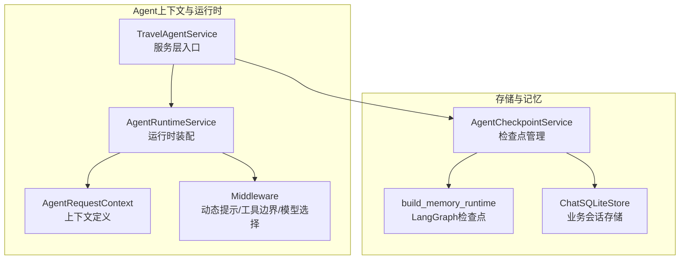
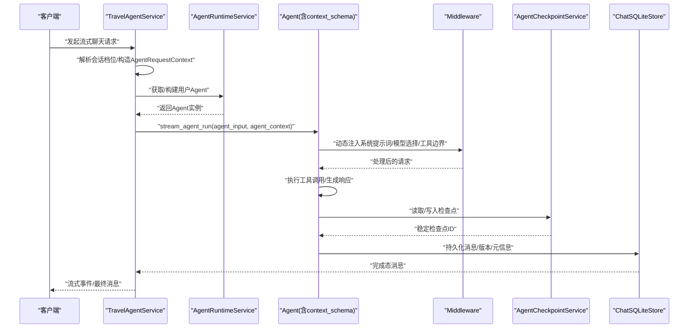
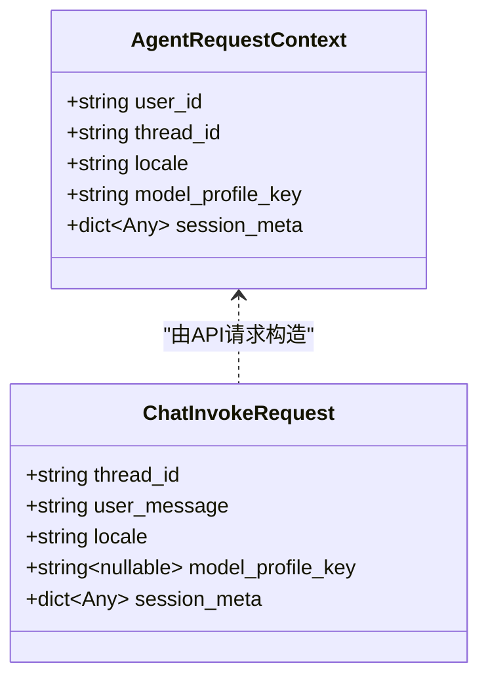
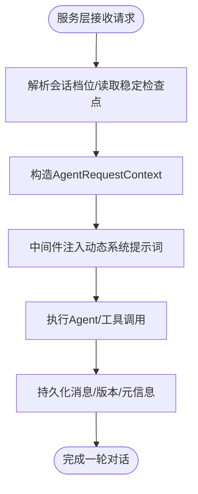
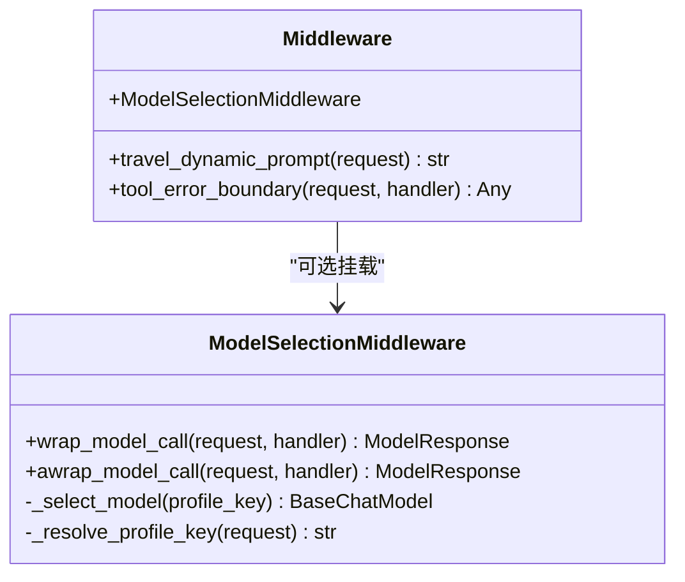
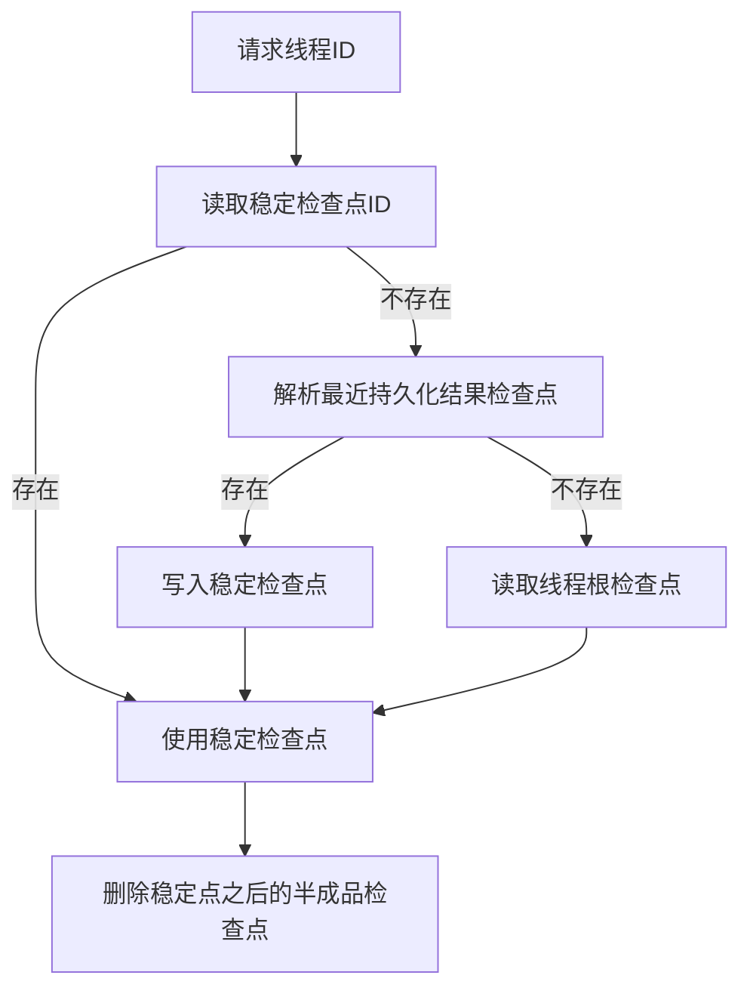
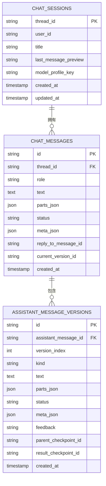
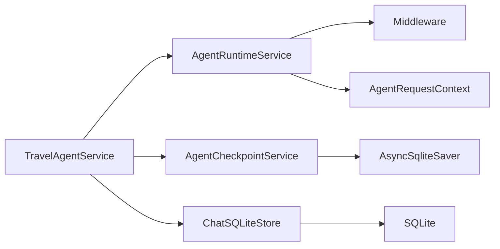

# Agent上下文管理

<cite>
**本文引用的文件**
- [backend/app/agent/context.py](file://backend/app/agent/context.py)
- [backend/app/agent/runtime.py](file://backend/app/agent/runtime.py)
- [backend/app/agent/service.py](file://backend/app/agent/service.py)
- [backend/app/agent/middleware.py](file://backend/app/agent/middleware.py)
- [backend/app/agent/checkpoints.py](file://backend/app/agent/checkpoints.py)
- [backend/app/memory/runtime.py](file://backend/app/memory/runtime.py)
- [backend/app/memory/sqlite_store.py](file://backend/app/memory/sqlite_store.py)
- [backend/app/schemas/chat.py](file://backend/app/schemas/chat.py)
- [backend/docs/agent-implementation-retrospective.md](file://backend/docs/agent-implementation-retrospective.md)
</cite>

## 目录
1. [简介](#简介)
2. [项目结构](#项目结构)
3. [核心组件](#核心组件)
4. [架构总览](#架构总览)
5. [详细组件分析](#详细组件分析)
6. [依赖分析](#依赖分析)
7. [性能考量](#性能考量)
8. [故障排查指南](#故障排查指南)
9. [结论](#结论)
10. [附录](#附录)

## 简介
本文件系统性阐述本项目的Agent上下文管理体系，重点围绕AgentRequestContext的设计与实现、上下文数据在运行时的传递机制、会话元数据的管理与注入、以及上下文如何影响Agent的决策过程、多轮对话状态保持、用户偏好与环境信息处理。文档同时覆盖上下文的序列化与反序列化注意事项、安全与性能优化建议、配置示例、扩展方法、调试技巧，以及如何自定义上下文处理器与集成新的上下文数据源。

## 项目结构
围绕Agent上下文管理的相关模块主要分布在后端Python代码中，核心文件包括：
- 上下文定义：AgentRequestContext
- 运行时装配：AgentRuntimeService、create_agent与中间件挂载
- 服务层入口：TravelAgentService的流式调用与上下文注入
- 中间件：动态系统提示词、工具错误边界、模型档位选择
- 记忆与检查点：LangGraph检查点与SQLite存储
- 会话存储：业务侧聊天记录与版本化管理

**图表来源**
- [backend/app/agent/context.py:10-21](file://backend/app/agent/context.py#L10-L21)
- [backend/app/agent/runtime.py:31-115](file://backend/app/agent/runtime.py#L31-L115)
- [backend/app/agent/middleware.py:94-210](file://backend/app/agent/middleware.py#L94-L210)
- [backend/app/agent/service.py:373-507](file://backend/app/agent/service.py#L373-L507)
- [backend/app/agent/checkpoints.py:9-106](file://backend/app/agent/checkpoints.py#L9-L106)
- [backend/app/memory/runtime.py:11-21](file://backend/app/memory/runtime.py#L11-L21)
- [backend/app/memory/sqlite_store.py:123-131](file://backend/app/memory/sqlite_store.py#L123-L131)

**章节来源**
- [backend/app/agent/context.py:1-22](file://backend/app/agent/context.py#L1-L22)
- [backend/app/agent/runtime.py:1-174](file://backend/app/agent/runtime.py#L1-L174)
- [backend/app/agent/service.py:1-529](file://backend/app/agent/service.py#L1-L529)
- [backend/app/agent/middleware.py:1-211](file://backend/app/agent/middleware.py#L1-L211)
- [backend/app/agent/checkpoints.py:1-106](file://backend/app/agent/checkpoints.py#L1-L106)
- [backend/app/memory/runtime.py:1-22](file://backend/app/memory/runtime.py#L1-L22)
- [backend/app/memory/sqlite_store.py:1-800](file://backend/app/memory/sqlite_store.py#L1-L800)
- [backend/app/schemas/chat.py:18-29](file://backend/app/schemas/chat.py#L18-L29)

## 核心组件
- AgentRequestContext：单轮Agent运行期间的上下文载体，承载user_id、thread_id、locale、model_profile_key、session_meta等关键字段，通过context_schema注入到LangChain runtime，供中间件、工具与后续拦截器使用。
- AgentRuntimeService：负责Agent运行时的装配、启动、关闭与状态快照，创建Agent时绑定AgentRequestContext与中间件，并复用LangGraph检查点与工具集。
- TravelAgentService：服务层门面，负责接收请求、解析会话档位、构造AgentRequestContext、驱动流式执行、完成消息持久化与版本管理。
- Middleware：动态系统提示词注入、工具调用异常边界、按上下文档位选择模型实例。
- AgentCheckpointService：管理稳定检查点的定位、缓存、回滚与清理，确保多轮对话状态可恢复。
- ChatSQLiteStore：业务侧会话存储，负责消息、版本、语音资产、会话元数据的持久化与查询。

**章节来源**
- [backend/app/agent/context.py:10-21](file://backend/app/agent/context.py#L10-L21)
- [backend/app/agent/runtime.py:61-115](file://backend/app/agent/runtime.py#L61-L115)
- [backend/app/agent/service.py:97-128](file://backend/app/agent/service.py#L97-L128)
- [backend/app/agent/middleware.py:94-210](file://backend/app/agent/middleware.py#L94-L210)
- [backend/app/agent/checkpoints.py:9-106](file://backend/app/agent/checkpoints.py#L9-L106)
- [backend/app/memory/sqlite_store.py:123-131](file://backend/app/memory/sqlite_store.py#L123-L131)

## 架构总览
下图展示了从请求进入服务层，到Agent运行时装配、中间件处理、工具调用、检查点恢复与业务存储的完整流程。

**图表来源**
- [backend/app/agent/service.py:373-507](file://backend/app/agent/service.py#L373-L507)
- [backend/app/agent/runtime.py:94-132](file://backend/app/agent/runtime.py#L94-L132)
- [backend/app/agent/middleware.py:94-210](file://backend/app/agent/middleware.py#L94-L210)
- [backend/app/agent/checkpoints.py:32-60](file://backend/app/agent/checkpoints.py#L32-L60)
- [backend/app/memory/sqlite_store.py:355-409](file://backend/app/memory/sqlite_store.py#L355-L409)

## 详细组件分析

### AgentRequestContext设计与实现
- 字段语义
  - user_id：用户标识，贯穿所有上下文与持久化逻辑
  - thread_id：会话线程标识，用于LangGraph检查点与业务会话隔离
  - locale：语言环境，默认zh-CN，支持动态注入
  - model_profile_key：模型档位键，用于中间件按上下文动态选择模型实例
  - session_meta：会话元信息字典，支持任意键值对，用于动态系统提示词注入
- 设计要点
  - 通过context_schema注入到LangChain runtime，确保中间件、工具与拦截器可访问
  - 与LangSmith追踪、工具轨迹、版本化消息等形成松耦合的数据通道
- 与Schema的关系
  - ChatInvokeRequest中包含thread_id、locale、model_profile_key、session_meta，用于从API层向上下文传递

**图表来源**
- [backend/app/agent/context.py:10-21](file://backend/app/agent/context.py#L10-L21)
- [backend/app/schemas/chat.py:18-29](file://backend/app/schemas/chat.py#L18-L29)

**章节来源**
- [backend/app/agent/context.py:10-21](file://backend/app/agent/context.py#L10-L21)
- [backend/app/schemas/chat.py:18-29](file://backend/app/schemas/chat.py#L18-L29)

### 上下文传递机制与会话元数据管理
- 传递路径
  - API层：ChatInvokeRequest携带thread_id、locale、model_profile_key、session_meta
  - 服务层：TravelAgentService解析会话档位，构造AgentRequestContext
  - 运行时：create_agent绑定context_schema与中间件
  - 中间件：动态系统提示词注入session_meta与时区/语言环境
- 会话元数据注入
  - 动态系统提示词：将locale、timezone、session_meta序列化后注入系统提示词
  - 工具边界：统一捕获工具异常并以标准化消息返回，避免中断机制失效
- 多轮对话状态保持
  - 通过LangGraph检查点与SQLite存储实现稳定恢复点
  - 业务侧会话与运行时状态分离，避免checkpoint污染业务表

**图表来源**
- [backend/app/agent/service.py:373-507](file://backend/app/agent/service.py#L373-L507)
- [backend/app/agent/middleware.py:66-108](file://backend/app/agent/middleware.py#L66-L108)
- [backend/app/agent/checkpoints.py:32-60](file://backend/app/agent/checkpoints.py#L32-L60)
- [backend/app/memory/sqlite_store.py:355-409](file://backend/app/memory/sqlite_store.py#L355-L409)

**章节来源**
- [backend/app/agent/service.py:373-507](file://backend/app/agent/service.py#L373-L507)
- [backend/app/agent/middleware.py:66-108](file://backend/app/agent/middleware.py#L66-L108)
- [backend/app/agent/checkpoints.py:32-60](file://backend/app/agent/checkpoints.py#L32-L60)
- [backend/app/memory/sqlite_store.py:355-409](file://backend/app/memory/sqlite_store.py#L355-L409)

### 中间件对上下文的影响
- 动态系统提示词
  - 从AgentRequestContext读取locale、session_meta、timezone，注入到系统提示词
  - 保证模型始终基于当前时间与会话上下文进行推理
- 工具错误边界
  - 统一捕获工具异常，避免GraphInterrupt被吞没，维持人类介入的中断机制
- 模型档位选择
  - 根据AgentRequestContext.model_profile_key动态选择对应ChatModel实例
  - 采用request.override模式，确保在bind_tools之后仍能生效

**图表来源**
- [backend/app/agent/middleware.py:94-210](file://backend/app/agent/middleware.py#L94-L210)

**章节来源**
- [backend/app/agent/middleware.py:94-210](file://backend/app/agent/middleware.py#L94-L210)

### 检查点与状态恢复
- 稳定检查点定位
  - 优先使用业务侧已稳定的checkpoint_id
  - 否则解析最近一次持久化的结果checkpoint
  - 最后回退到线程根checkpoint
- 回滚与清理
  - 回滚到稳定检查点后，删除该点之后的半成品checkpoint与writes
  - 通过异步SQLite检查点器实现并发安全

**图表来源**
- [backend/app/agent/checkpoints.py:32-106](file://backend/app/agent/checkpoints.py#L32-L106)
- [backend/app/memory/runtime.py:11-21](file://backend/app/memory/runtime.py#L11-L21)

**章节来源**
- [backend/app/agent/checkpoints.py:32-106](file://backend/app/agent/checkpoints.py#L32-L106)
- [backend/app/memory/runtime.py:11-21](file://backend/app/memory/runtime.py#L11-L21)

### 业务存储与版本化消息
- 存储分离
  - 业务消息表：chat_messages、chat_sessions，仅存用户消息与最终助手回复
  - 运行时状态：checkpoints、writes，仅存LangGraph恢复状态
- 版本化与元信息
  - 助手消息版本：original/regenerated，支持多版本对比与回滚
  - 元信息：tool_traces、reasoning_text、mcp连接状态等，以JSON形式附着在最终消息上
- 语音资产
  - 辅助语音生成与播放，与消息版本关联

**图表来源**
- [backend/app/memory/sqlite_store.py:123-131](file://backend/app/memory/sqlite_store.py#L123-L131)
- [backend/app/memory/sqlite_store.py:224-278](file://backend/app/memory/sqlite_store.py#L224-L278)
- [backend/app/memory/sqlite_store.py:355-409](file://backend/app/memory/sqlite_store.py#L355-L409)

**章节来源**
- [backend/app/memory/sqlite_store.py:123-131](file://backend/app/memory/sqlite_store.py#L123-L131)
- [backend/app/memory/sqlite_store.py:224-278](file://backend/app/memory/sqlite_store.py#L224-L278)
- [backend/app/memory/sqlite_store.py:355-409](file://backend/app/memory/sqlite_store.py#L355-L409)

## 依赖分析
- 组件耦合
  - TravelAgentService依赖AgentRuntimeService、AgentCheckpointService、ChatSQLiteStore
  - AgentRuntimeService依赖LangChain create_agent、LangGraph检查点器、中间件工厂
  - 中间件依赖AgentRequestContext与系统提示词模板
- 外部依赖
  - LangChain/LangGraph：Agent执行、中间件、检查点
  - aiosqlite：异步SQLite检查点器
  - Pydantic：上下文与Schema序列化/反序列化

**图表来源**
- [backend/app/agent/service.py:97-128](file://backend/app/agent/service.py#L97-L128)
- [backend/app/agent/runtime.py:61-115](file://backend/app/agent/runtime.py#L61-L115)
- [backend/app/agent/checkpoints.py:9-15](file://backend/app/agent/checkpoints.py#L9-L15)
- [backend/app/memory/runtime.py:11-21](file://backend/app/memory/runtime.py#L11-L21)

**章节来源**
- [backend/app/agent/service.py:97-128](file://backend/app/agent/service.py#L97-L128)
- [backend/app/agent/runtime.py:61-115](file://backend/app/agent/runtime.py#L61-L115)
- [backend/app/agent/checkpoints.py:9-15](file://backend/app/agent/checkpoints.py#L9-L15)
- [backend/app/memory/runtime.py:11-21](file://backend/app/memory/runtime.py#L11-L21)

## 性能考量
- 惰性初始化
  - 记忆运行时在首次需要时构建，避免模块加载阶段触发重依赖
- 异步检查点
  - 使用异步SQLite检查点器，减少阻塞
- 中间件顺序
  - 模型选择中间件置于末尾，确保override生效，避免重复包装带来的开销
- 会话存储
  - 业务表仅存最终消息与版本，降低checkpoint中自定义类型带来的序列化成本
- 流式输出
  - 将最终答案与中间过程分离，避免前端抖动与重复渲染

**章节来源**
- [backend/app/agent/runtime.py:24-28](file://backend/app/agent/runtime.py#L24-L28)
- [backend/app/agent/middleware.py:193-210](file://backend/app/agent/middleware.py#L193-L210)
- [backend/docs/agent-implementation-retrospective.md:323-349](file://backend/docs/agent-implementation-retrospective.md#L323-L349)

## 故障排查指南
- 中断机制失效
  - 确认中间件中未捕获GraphInterrupt，否则人类介入的中断将无法生效
- 工具异常
  - 检查tool_error_boundary是否正确包裹工具调用，确保异常被标准化为ToolMessage
- 档位选择无效
  - 确认AgentRequestContext.model_profile_key与中间件注册的模型档位一致
- 检查点恢复失败
  - 检查checkpoint中是否包含自定义类型，避免反序列化告警
- 会话状态不同步
  - 确认稳定检查点ID正确设置，回滚后清理了半成品检查点

**章节来源**
- [backend/app/agent/middleware.py:111-131](file://backend/app/agent/middleware.py#L111-L131)
- [backend/app/agent/middleware.py:172-191](file://backend/app/agent/middleware.py#L172-L191)
- [backend/app/agent/checkpoints.py:62-106](file://backend/app/agent/checkpoints.py#L62-L106)
- [backend/docs/agent-implementation-retrospective.md:323-349](file://backend/docs/agent-implementation-retrospective.md#L323-L349)

## 结论
本项目的Agent上下文管理通过AgentRequestContext将用户、会话、语言环境、模型档位与会话元数据统一注入到运行时，结合动态系统提示词、工具边界与模型档位选择中间件，实现了对Agent决策过程的可控影响。通过LangGraph检查点与业务存储的分离，既保证了多轮对话状态的可靠恢复，又简化了前端展示与排障。在安全与性能方面，严格的Schema与异步检查点降低了风险与开销。建议在扩展新上下文数据源时，遵循现有中间件与存储分离的设计原则，确保上下文注入与持久化的一致性。

## 附录

### 上下文序列化与反序列化
- 上下文序列化
  - AgentRequestContext为Pydantic模型，可直接序列化为JSON
  - 会话元数据通过中间件序列化为提示词文本，避免复杂类型进入checkpoint
- 反序列化注意
  - checkpoint中避免引入自定义类型，防止反序列化告警
  - 业务侧JSON字段使用TypeAdapter进行验证与解析

**章节来源**
- [backend/app/agent/context.py:10-21](file://backend/app/agent/context.py#L10-L21)
- [backend/app/agent/middleware.py:58-64](file://backend/app/agent/middleware.py#L58-L64)
- [backend/app/memory/sqlite_store.py:499-508](file://backend/app/memory/sqlite_store.py#L499-L508)
- [backend/docs/agent-implementation-retrospective.md:323-349](file://backend/docs/agent-implementation-retrospective.md#L323-L349)

### 安全考虑
- 会话元数据
  - 仅注入提示词可见字段，避免敏感信息泄露
  - 对timezone等输入进行容错与回退
- 工具调用
  - 统一异常边界，避免将内部错误细节暴露给前端
- 模型选择
  - 通过中间件强制选择受控模型实例，避免外部注入

**章节来源**
- [backend/app/agent/middleware.py:32-64](file://backend/app/agent/middleware.py#L32-L64)
- [backend/app/agent/middleware.py:111-131](file://backend/app/agent/middleware.py#L111-L131)
- [backend/app/agent/middleware.py:133-191](file://backend/app/agent/middleware.py#L133-L191)

### 性能优化建议
- 惰性初始化与异步操作
  - 延迟构建记忆运行时，使用异步SQLite检查点器
- 中间件优化
  - 将模型选择中间件置于末尾，减少包装次数
- 存储优化
  - 业务表仅存最终消息与版本，checkpoint仅存运行时状态

**章节来源**
- [backend/app/agent/runtime.py:24-28](file://backend/app/agent/runtime.py#L24-L28)
- [backend/app/agent/middleware.py:193-210](file://backend/app/agent/middleware.py#L193-L210)
- [backend/app/memory/runtime.py:11-21](file://backend/app/memory/runtime.py#L11-L21)

### 上下文配置示例
- API请求
  - 包含thread_id、user_message、locale、model_profile_key、session_meta
- 服务层构造
  - 解析会话档位，构造AgentRequestContext并注入到Agent运行
- 中间件注入
  - 动态系统提示词注入locale、timezone、session_meta

**章节来源**
- [backend/app/schemas/chat.py:18-29](file://backend/app/schemas/chat.py#L18-L29)
- [backend/app/agent/service.py:425-442](file://backend/app/agent/service.py#L425-L442)
- [backend/app/agent/middleware.py:66-108](file://backend/app/agent/middleware.py#L66-L108)

### 扩展方法与自定义上下文处理器
- 自定义上下文处理器
  - 在中间件中扩展动态提示词逻辑，读取AgentRequestContext中的新字段
- 集成新的上下文数据源
  - 将新数据源注入session_meta，确保序列化为提示词可读文本
  - 在服务层或中间件中读取并应用新上下文

**章节来源**
- [backend/app/agent/middleware.py:58-91](file://backend/app/agent/middleware.py#L58-L91)
- [backend/app/agent/service.py:425-442](file://backend/app/agent/service.py#L425-L442)

### 调试技巧
- 追踪中间件行为
  - 在动态提示词中打印注入的上下文字段，确认locale、timezone、session_meta正确注入
- 检查模型档位选择
  - 断言中间件按model_profile_key选择了正确的模型实例
- 回滚与清理
  - 发生异常时回滚到稳定检查点并清理半成品检查点，确保后续恢复稳定

**章节来源**
- [backend/tests/test_agent_runtime_features.py:83-94](file://backend/tests/test_agent_runtime_features.py#L83-L94)
- [backend/tests/test_agent_service.py:418-463](file://backend/tests/test_agent_service.py#L418-L463)
- [backend/app/agent/checkpoints.py:23-31](file://backend/app/agent/checkpoints.py#L23-L31)