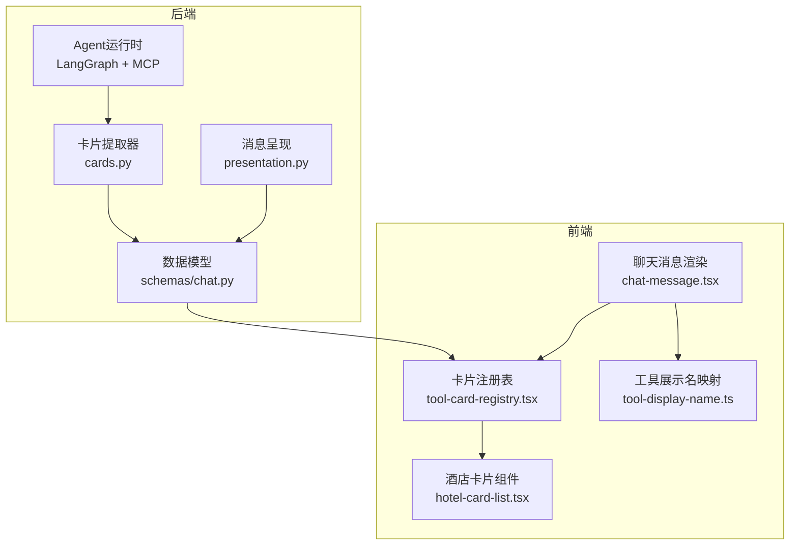
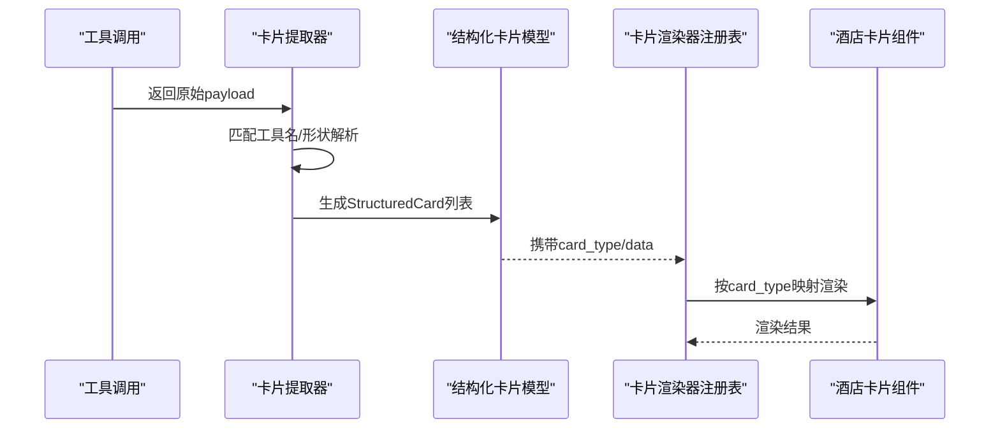
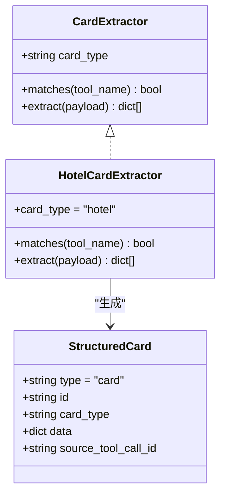
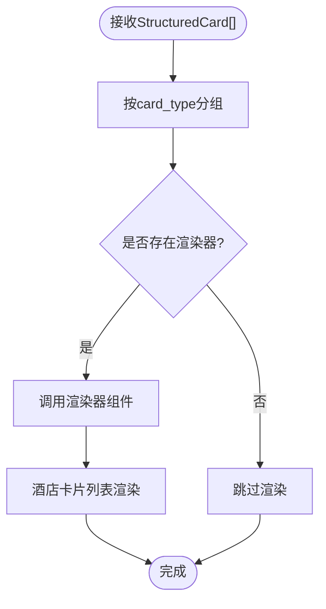
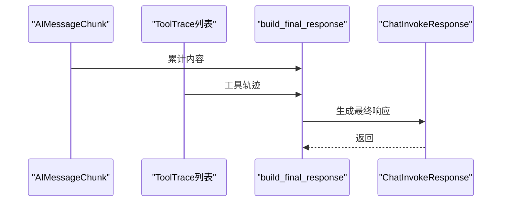
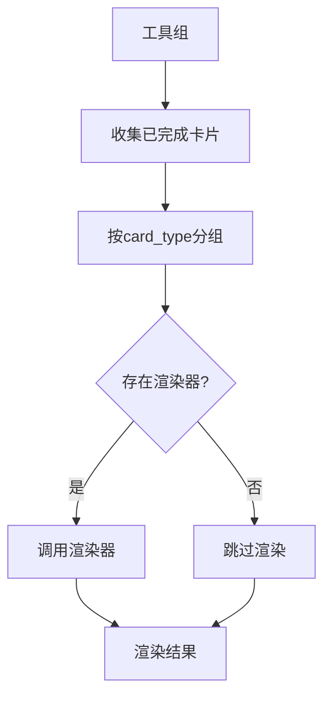
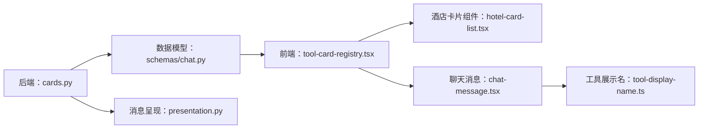

# Agent卡片系统

<cite>
**本文档引用的文件**
- [backend/app/agent/cards.py](file://backend/app/agent/cards.py)
- [backend/app/schemas/chat.py](file://backend/app/schemas/chat.py)
- [backend/app/agent/presentation.py](file://backend/app/agent/presentation.py)
- [frontend/src/features/chat/model/tool-card-registry.tsx](file://frontend/src/features/chat/model/tool-card-registry.tsx)
- [frontend/src/features/chat/ui/hotel-card-list.tsx](file://frontend/src/features/chat/ui/hotel-card-list.tsx)
- [frontend/src/features/chat/ui/chat-message.tsx](file://frontend/src/features/chat/ui/chat-message.tsx)
- [frontend/src/features/chat/model/tool-display-name.ts](file://frontend/src/features/chat/model/tool-display-name.ts)
- [backend/tests/test_agent_cards.py](file://backend/tests/test_agent_cards.py)
- [README.md](file://README.md)
- [docs/agent-implementation-retrospective.md](file://docs/agent-implementation-retrospective.md)
</cite>

## 目录
1. [简介](#简介)
2. [项目结构](#项目结构)
3. [核心组件](#核心组件)
4. [架构总览](#架构总览)
5. [详细组件分析](#详细组件分析)
6. [依赖分析](#依赖分析)
7. [性能考虑](#性能考虑)
8. [故障排查指南](#故障排查指南)
9. [结论](#结论)
10. [附录](#附录)

## 简介
本项目是一个移动优先的旅行Agent应用，核心亮点之一是“Agent卡片系统”。该系统将MCP/本地工具返回的原始数据结构化为统一的卡片格式，前端通过卡片类型注册表进行渲染，实现了“LLM自由文本与结构化卡片渲染完全解耦”的设计。系统支持酒店、景点、交通等多种旅行卡片类型，具备良好的扩展性与性能表现。

## 项目结构
- 后端使用FastAPI + LangChain + LangGraph，Agent运行时通过LangGraph检查点进行状态恢复，工具调用通过MCP或本地工具完成。
- 前端使用React + Vite + TypeScript，卡片渲染通过注册表按类型映射到具体组件，支持横向滚动的酒店卡片列表等UI。

图表来源
- [backend/app/agent/cards.py:1-342](file://backend/app/agent/cards.py#L1-L342)
- [backend/app/schemas/chat.py:63-109](file://backend/app/schemas/chat.py#L63-L109)
- [backend/app/agent/presentation.py:17-36](file://backend/app/agent/presentation.py#L17-L36)
- [frontend/src/features/chat/model/tool-card-registry.tsx:60-99](file://frontend/src/features/chat/model/tool-card-registry.tsx#L60-L99)
- [frontend/src/features/chat/ui/hotel-card-list.tsx:172-190](file://frontend/src/features/chat/ui/hotel-card-list.tsx#L172-L190)
- [frontend/src/features/chat/ui/chat-message.tsx:420-475](file://frontend/src/features/chat/ui/chat-message.tsx#L420-L475)
- [frontend/src/features/chat/model/tool-display-name.ts:51-72](file://frontend/src/features/chat/model/tool-display-name.ts#L51-L72)

章节来源
- [README.md:19-48](file://README.md#L19-L48)
- [docs/agent-implementation-retrospective.md:25-52](file://docs/agent-implementation-retrospective.md#L25-L52)

## 核心组件
- 结构化卡片模型：后端将工具返回的原始payload解析为统一的结构化卡片，前端按card_type进行渲染。
- 卡片提取器：后端实现CardExtractor协议，匹配工具名并从payload中抽取卡片数据。
- 卡片渲染器注册表：前端将card_type映射到具体渲染组件，支持酒店卡片列表等。
- 工具展示名映射：将后端工具名映射为前端可读的展示名称。
- 消息呈现：将流式内容与工具轨迹整合为最终响应对象。

章节来源
- [backend/app/schemas/chat.py:63-109](file://backend/app/schemas/chat.py#L63-L109)
- [backend/app/agent/cards.py:34-46](file://backend/app/agent/cards.py#L34-L46)
- [frontend/src/features/chat/model/tool-card-registry.tsx:60-99](file://frontend/src/features/chat/model/tool-card-registry.tsx#L60-L99)
- [frontend/src/features/chat/model/tool-display-name.ts:51-72](file://frontend/src/features/chat/model/tool-display-name.ts#L51-L72)
- [backend/app/agent/presentation.py:17-36](file://backend/app/agent/presentation.py#L17-L36)

## 架构总览
Agent卡片系统采用“后端提取 + 前端渲染”的双层解耦架构：
- 后端：从工具调用返回的payload中提取结构化卡片，统一为StructuredCard格式。
- 前端：通过注册表按card_type渲染对应组件，支持横向滚动的酒店卡片列表等。

图表来源
- [backend/app/agent/cards.py:315-342](file://backend/app/agent/cards.py#L315-L342)
- [backend/app/schemas/chat.py:63-77](file://backend/app/schemas/chat.py#L63-L77)
- [frontend/src/features/chat/model/tool-card-registry.tsx:75-99](file://frontend/src/features/chat/model/tool-card-registry.tsx#L75-L99)
- [frontend/src/features/chat/ui/hotel-card-list.tsx:172-190](file://frontend/src/features/chat/ui/hotel-card-list.tsx#L172-L190)

## 详细组件分析

### 后端：卡片提取器与结构化卡片
- 卡片提取器协议：定义card_type、matches与extract方法，确保单一payload只被首个匹配的extractor接管，避免重复渲染。
- 酒店提取器：支持JSON字符串、MCP TextContent包装层解包、嵌套结构遍历，将原始酒店字段归一化为前端期望的HotelItem字典。
- 结构化卡片模型：包含id、card_type、data与source_tool_call_id，前端按card_type注册渲染器。

图表来源
- [backend/app/agent/cards.py:34-46](file://backend/app/agent/cards.py#L34-L46)
- [backend/app/agent/cards.py:247-299](file://backend/app/agent/cards.py#L247-L299)
- [backend/app/schemas/chat.py:63-77](file://backend/app/schemas/chat.py#L63-L77)

章节来源
- [backend/app/agent/cards.py:14-18](file://backend/app/agent/cards.py#L14-L18)
- [backend/app/agent/cards.py:315-342](file://backend/app/agent/cards.py#L315-L342)
- [backend/app/schemas/chat.py:63-77](file://backend/app/schemas/chat.py#L63-L77)

### 前端：卡片渲染器注册表与酒店卡片组件
- 渲染器注册表：将card_type映射到列表型渲染器，组件自行处理空数组场景（通常返回null）。
- 酒店卡片组件：横向可滚动的卡片列表，展示关键信息（名称、评分、星级、价格、标签），支持图片懒加载与错误降级。
- 工具展示名映射：将后端工具名映射为前端可读名称，支持本地工具与MCP服务器维度的展示名注册。

图表来源
- [frontend/src/features/chat/model/tool-card-registry.tsx:84-99](file://frontend/src/features/chat/model/tool-card-registry.tsx#L84-L99)
- [frontend/src/features/chat/model/tool-card-registry.tsx:75-77](file://frontend/src/features/chat/model/tool-card-registry.tsx#L75-L77)
- [frontend/src/features/chat/ui/hotel-card-list.tsx:172-190](file://frontend/src/features/chat/ui/hotel-card-list.tsx#L172-L190)

章节来源
- [frontend/src/features/chat/model/tool-card-registry.tsx:60-99](file://frontend/src/features/chat/model/tool-card-registry.tsx#L60-L99)
- [frontend/src/features/chat/ui/hotel-card-list.tsx:19-39](file://frontend/src/features/chat/ui/hotel-card-list.tsx#L19-L39)
- [frontend/src/features/chat/model/tool-display-name.ts:51-72](file://frontend/src/features/chat/model/tool-display-name.ts#L51-L72)

### 消息呈现与工具轨迹
- 最终响应构建：从流式累计内容与工具轨迹中提取assistant_message与reasoning文本，封装为ChatInvokeResponse。
- 工具消息载荷：支持artifact与content两种形式，统一转换为文本以便前端展示。

图表来源
- [backend/app/agent/presentation.py:17-36](file://backend/app/agent/presentation.py#L17-L36)
- [backend/app/agent/presentation.py:113-118](file://backend/app/agent/presentation.py#L113-L118)

章节来源
- [backend/app/agent/presentation.py:17-36](file://backend/app/agent/presentation.py#L17-L36)
- [backend/app/agent/presentation.py:113-118](file://backend/app/agent/presentation.py#L113-L118)

### 聊天消息渲染中的卡片展示
- 工具组折叠：将连续的工具部分合并为组，支持展开查看工具输入/输出。
- 卡片分组与渲染：收集已完成的工具返回卡片，按card_type分组后调用对应渲染器。
- 工具展示名：使用工具展示名映射，增强可读性。

图表来源
- [frontend/src/features/chat/ui/chat-message.tsx:420-475](file://frontend/src/features/chat/ui/chat-message.tsx#L420-L475)
- [frontend/src/features/chat/model/tool-card-registry.tsx:84-99](file://frontend/src/features/chat/model/tool-card-registry.tsx#L84-L99)

章节来源
- [frontend/src/features/chat/ui/chat-message.tsx:420-475](file://frontend/src/features/chat/ui/chat-message.tsx#L420-L475)

## 依赖分析
- 后端依赖：LangChain/LangGraph用于Agent运行时与状态恢复，MCP用于接入外部工具。
- 前端依赖：React + Vite + TypeScript + Tailwind，组件风格采用shadcn/ui。
- 卡片系统耦合点：后端cards.py与前端tool-card-registry.tsx通过StructuredCard的card_type进行松耦合关联。

图表来源
- [backend/app/agent/cards.py:307-312](file://backend/app/agent/cards.py#L307-L312)
- [backend/app/schemas/chat.py:63-77](file://backend/app/schemas/chat.py#L63-L77)
- [frontend/src/features/chat/model/tool-card-registry.tsx:60-66](file://frontend/src/features/chat/model/tool-card-registry.tsx#L60-L66)
- [frontend/src/features/chat/ui/hotel-card-list.tsx:172-190](file://frontend/src/features/chat/ui/hotel-card-list.tsx#L172-L190)
- [frontend/src/features/chat/ui/chat-message.tsx:420-475](file://frontend/src/features/chat/ui/chat-message.tsx#L420-L475)
- [frontend/src/features/chat/model/tool-display-name.ts:51-72](file://frontend/src/features/chat/model/tool-display-name.ts#L51-L72)

章节来源
- [README.md:7-8](file://README.md#L7-L8)
- [docs/agent-implementation-retrospective.md:13-19](file://docs/agent-implementation-retrospective.md#L13-L19)

## 性能考虑
- 提取器健壮性：不抛异常、遇到不识别形状返回空列表，避免阻断主流程。
- 前端渲染优化：酒店卡片组件支持图片懒加载与错误降级，减少首屏阻塞。
- 数据最小化：StructuredCard.data为plain dict，避免业务模型在schema边界泄漏类型。
- 分组渲染：前端按card_type分组渲染，减少重复查找与映射开销。

章节来源
- [backend/app/agent/cards.py:14-18](file://backend/app/agent/cards.py#L14-L18)
- [frontend/src/features/chat/ui/hotel-card-list.tsx:88-91](file://frontend/src/features/chat/ui/hotel-card-list.tsx#L88-L91)
- [backend/app/schemas/chat.py:63-77](file://backend/app/schemas/chat.py#L63-L77)

## 故障排查指南
- 卡片未显示：检查后端extractor是否匹配工具名、payload是否为有效结构；确认前端渲染器是否注册。
- 工具展示名异常：检查工具展示名映射表，确认工具名前缀与服务器前缀匹配。
- 流式展示抖动：确认前端未将中间过程与最终答案混合渲染，按产品策略采用单气泡流式输出。
- MCP配置错误：检查配置文件格式与transport字段，确保启动阶段即通过Pydantic校验。

章节来源
- [backend/tests/test_agent_cards.py:25-100](file://backend/tests/test_agent_cards.py#L25-L100)
- [frontend/src/features/chat/model/tool-display-name.ts:51-72](file://frontend/src/features/chat/model/tool-display-name.ts#L51-L72)
- [docs/agent-implementation-retrospective.md:358-402](file://docs/agent-implementation-retrospective.md#L358-L402)
- [README.md:68-77](file://README.md#L68-L77)

## 结论
Agent卡片系统通过“后端提取 + 前端渲染”的解耦设计，实现了旅行信息的结构化卡片化展示。系统具备良好的扩展性（新增卡片类型只需后端实现extractor、前端注册渲染器）、稳定性（健壮的提取器与错误处理）与性能（最小化数据与懒加载优化）。该架构为集成新卡片类型与第三方数据源提供了清晰路径。

## 附录

### 卡片类型扩展指南
- 后端新增卡片类型步骤：
  1) 实现CardExtractor子类，定义card_type与匹配规则。
  2) 在CARD_EXTRACTORS列表中注册。
  3) 保持extract方法返回plain dict，避免业务模型泄漏。
- 前端新增卡片渲染步骤：
  1) 在cardListRenderers中注册对应渲染器。
  2) 组件自行处理空数组场景（通常返回null）。
  3) 保持与后端data字段的兼容性。

章节来源
- [backend/app/agent/cards.py:6-12](file://backend/app/agent/cards.py#L6-L12)
- [frontend/src/features/chat/model/tool-card-registry.tsx:8-13](file://frontend/src/features/chat/model/tool-card-registry.tsx#L8-L13)

### 酒店卡片数据绑定与交互
- 数据绑定：后端将原始酒店字段归一化为HotelItem字典，前端按存在性渲染。
- 交互行为：点击预订按钮打开外部URL，支持售罄/无价场景的提示与入口。
- 样式定制：通过Tailwind类名与主题色变量控制外观，支持货币符号映射与星评渲染。

章节来源
- [frontend/src/features/chat/ui/hotel-card-list.tsx:19-39](file://frontend/src/features/chat/ui/hotel-card-list.tsx#L19-L39)
- [frontend/src/features/chat/ui/hotel-card-list.tsx:144-166](file://frontend/src/features/chat/ui/hotel-card-list.tsx#L144-L166)
- [frontend/src/features/chat/ui/hotel-card-list.tsx:45-56](file://frontend/src/features/chat/ui/hotel-card-list.tsx#L45-L56)

### 测试与验证
- 后端测试覆盖：酒店提取器对列表payload、嵌套结构、JSON字符串、MCP TextContent包装层、售罄场景等的正确性验证。
- 前端测试覆盖：卡片分组与渲染器查找的正确性验证。

章节来源
- [backend/tests/test_agent_cards.py:25-186](file://backend/tests/test_agent_cards.py#L25-L186)
- [frontend/src/features/chat/model/tool-card-registry.test.ts:19-60](file://frontend/src/features/chat/model/tool-card-registry.test.ts#L19-L60)