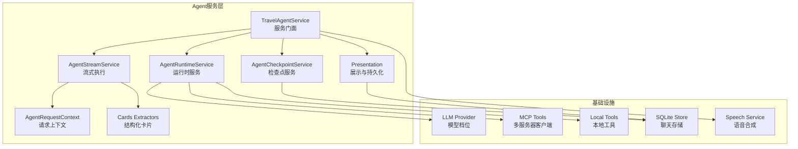
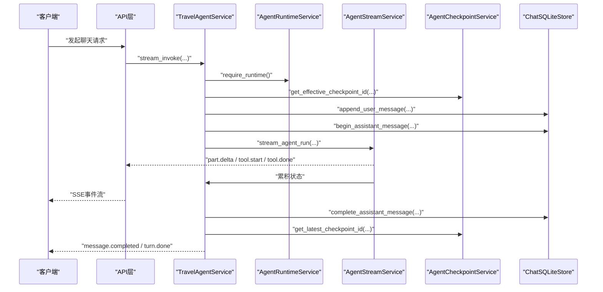
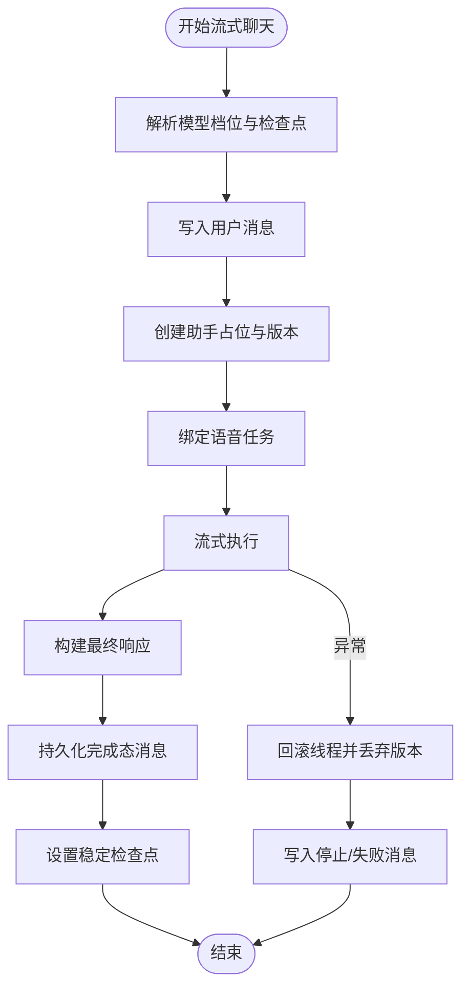
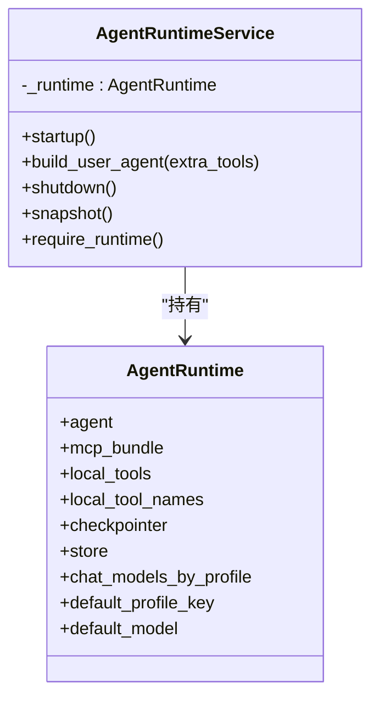
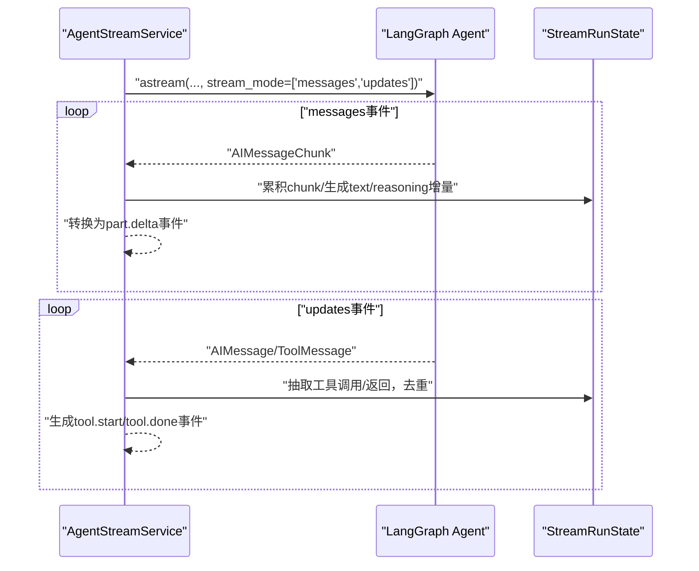
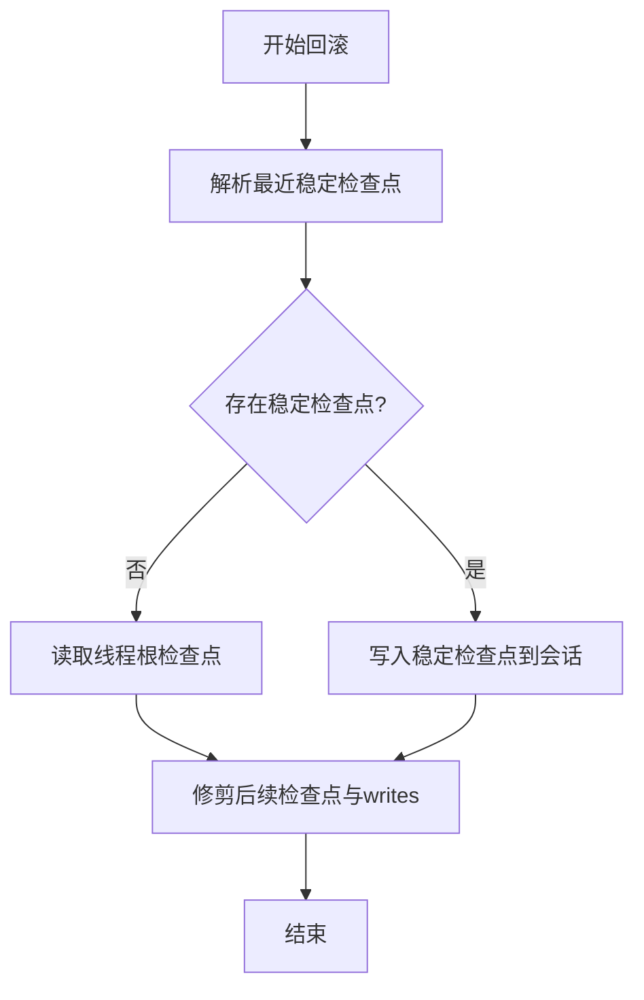
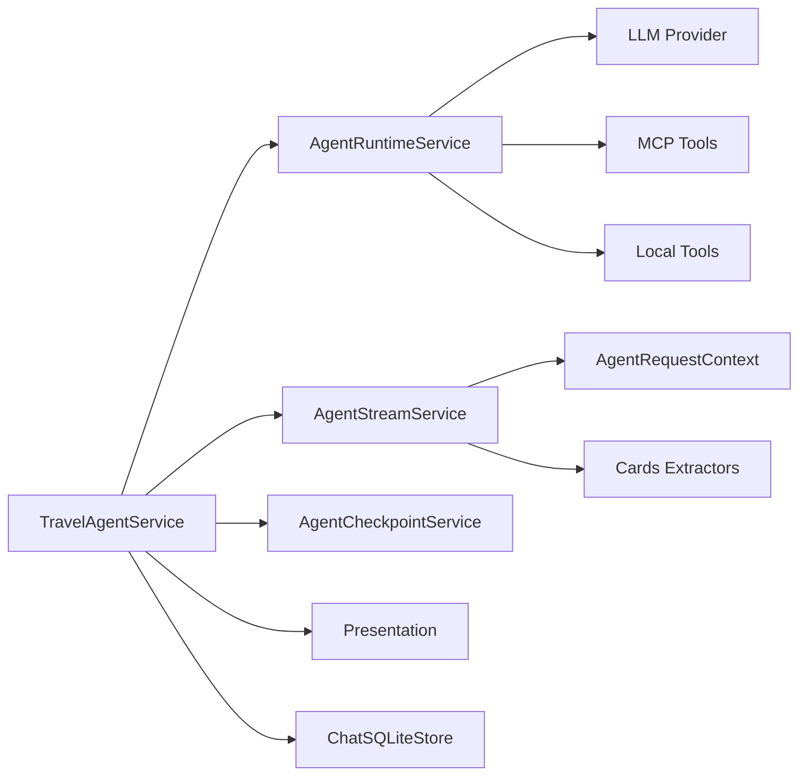

# Agent服务层

<cite>
**本文档引用的文件**
- [service.py](file://backend/app/agent/service.py)
- [runtime.py](file://backend/app/agent/runtime.py)
- [checkpoints.py](file://backend/app/agent/checkpoints.py)
- [context.py](file://backend/app/agent/context.py)
- [presentation.py](file://backend/app/agent/presentation.py)
- [streaming.py](file://backend/app/agent/streaming.py)
- [middleware.py](file://backend/app/agent/middleware.py)
- [sqlite_store.py](file://backend/app/memory/sqlite_store.py)
- [local_tools.py](file://backend/app/tool/local_tools.py)
- [client.py](file://backend/app/mcp/client.py)
- [cards.py](file://backend/app/agent/cards.py)
- [chat.py](file://backend/app/schemas/chat.py)
- [runtime.py](file://backend/app/connectors/runtime.py)
- [main.py](file://backend/app/main.py)
</cite>

## 目录
1. [引言](#引言)
2. [项目结构](#项目结构)
3. [核心组件](#核心组件)
4. [架构总览](#架构总览)
5. [详细组件分析](#详细组件分析)
6. [依赖关系分析](#依赖关系分析)
7. [性能考虑](#性能考虑)
8. [故障排除指南](#故障排除指南)
9. [结论](#结论)
10. [附录](#附录)

## 引言
本文件面向旅行Agent服务层，系统化阐述其整体架构、LangGraph状态机实现、运行时管理机制，以及检查点系统的持久化策略、上下文管理与消息呈现逻辑。文档同时解释Agent编排器的工作原理、状态转换规则与错误恢复机制，并提供Agent配置示例与扩展方法，指导如何添加新的Agent功能与工具集成。

## 项目结构
Agent服务层位于后端应用的agent子目录，围绕“服务门面 + 运行时 + 流式执行 + 检查点 + 上下文 + 展示”六大维度组织，配合内存存储、本地工具、MCP工具与中间件，形成完整的端到端Agent流水线。

**图表来源**
- [service.py:97-120](file://backend/app/agent/service.py#L97-L120)
- [runtime.py:61-116](file://backend/app/agent/runtime.py#L61-L116)
- [streaming.py:74-118](file://backend/app/agent/streaming.py#L74-L118)
- [checkpoints.py:9-44](file://backend/app/agent/checkpoints.py#L9-L44)
- [context.py:10-22](file://backend/app/agent/context.py#L10-L22)
- [presentation.py:17-36](file://backend/app/agent/presentation.py#L17-L36)
- [cards.py:315-342](file://backend/app/agent/cards.py#L315-L342)

**章节来源**
- [service.py:97-120](file://backend/app/agent/service.py#L97-L120)
- [runtime.py:61-116](file://backend/app/agent/runtime.py#L61-L116)
- [streaming.py:74-118](file://backend/app/agent/streaming.py#L74-L118)
- [checkpoints.py:9-44](file://backend/app/agent/checkpoints.py#L9-L44)
- [context.py:10-22](file://backend/app/agent/context.py#L10-L22)
- [presentation.py:17-36](file://backend/app/agent/presentation.py#L17-L36)
- [cards.py:315-342](file://backend/app/agent/cards.py#L315-L342)

## 核心组件
- 服务门面（TravelAgentService）
  - 聚合运行时、流式执行、检查点、语音与存储能力，对外提供会话管理、模型档位切换、消息完成与版本控制等接口。
- 运行时服务（AgentRuntimeService）
  - 负责Agent运行时装配、按需构建用户级Agent、生命周期管理与快照。
- 流式执行（AgentStreamService）
  - 基于LangGraph的astream接口，分发messages与updates两类事件，累计状态并转换为前端可消费的UI片段与工具事件。
- 检查点服务（AgentCheckpointService）
  - 管理稳定检查点的定位、缓存与回滚，清理半成品检查点，保障会话一致性。
- 上下文（AgentRequestContext）
  - 单轮运行的上下文载体，包含用户ID、线程ID、语言环境、模型档位与会话元信息。
- 展示与持久化（Presentation）
  - 将流式累积结果汇总为最终响应，抽取reasoning文本与工具轨迹，构建UI parts并解析引用注解。
- 结构化卡片（Cards Extractors）
  - 从工具返回中抽取结构化卡片，支持酒店等卡片类型，前端按card_type注册渲染器。

**章节来源**
- [service.py:97-120](file://backend/app/agent/service.py#L97-L120)
- [runtime.py:61-116](file://backend/app/agent/runtime.py#L61-L116)
- [streaming.py:74-118](file://backend/app/agent/streaming.py#L74-L118)
- [checkpoints.py:9-44](file://backend/app/agent/checkpoints.py#L9-L44)
- [context.py:10-22](file://backend/app/agent/context.py#L10-L22)
- [presentation.py:17-36](file://backend/app/agent/presentation.py#L17-L36)
- [cards.py:315-342](file://backend/app/agent/cards.py#L315-L342)

## 架构总览
Agent服务层采用“门面+运行时+流式执行+检查点+上下文+展示”的分层设计，结合LangGraph的检查点机制与LangChain中间件，实现可插拔的工具体系与可恢复的对话状态。

**图表来源**
- [service.py:373-507](file://backend/app/agent/service.py#L373-L507)
- [streaming.py:80-148](file://backend/app/agent/streaming.py#L80-L148)
- [checkpoints.py:32-60](file://backend/app/agent/checkpoints.py#L32-L60)
- [sqlite_store.py:182-278](file://backend/app/memory/sqlite_store.py#L182-L278)

**章节来源**
- [service.py:373-507](file://backend/app/agent/service.py#L373-L507)
- [streaming.py:80-148](file://backend/app/agent/streaming.py#L80-L148)
- [checkpoints.py:32-60](file://backend/app/agent/checkpoints.py#L32-L60)
- [sqlite_store.py:182-278](file://backend/app/memory/sqlite_store.py#L182-L278)

## 详细组件分析

### 服务门面（TravelAgentService）
- 职责
  - 初始化与关闭运行时、会话管理、模型档位切换、消息完成与版本控制、语音合成绑定与播放、错误日志与回滚。
- 关键流程
  - 流式聊天：解析线程档位、定位有效检查点、写入用户消息、创建助手占位、启动语音任务、流式执行、最终响应构建、持久化完成态消息、设置稳定检查点。
  - 重新生成：定位目标版本、开启新版本、绑定语音、流式执行、回滚与丢弃新版本、完成消息持久化。
- 错误恢复
  - 捕获异常并记录流水线失败日志，取消语音生成，回滚线程，丢弃新版本，必要时返回“已停止/失败”状态的消息。

**图表来源**
- [service.py:373-507](file://backend/app/agent/service.py#L373-L507)
- [service.py:269-372](file://backend/app/agent/service.py#L269-L372)

**章节来源**
- [service.py:116-127](file://backend/app/agent/service.py#L116-L127)
- [service.py:129-167](file://backend/app/agent/service.py#L129-L167)
- [service.py:269-372](file://backend/app/agent/service.py#L269-L372)
- [service.py:373-507](file://backend/app/agent/service.py#L373-L507)

### 运行时服务（AgentRuntimeService）
- 职责
  - 装配全局Agent（本地工具 + MCP工具）、按需构建用户级Agent（额外用户级MCP工具）、模型档位选择中间件、生命周期管理与运行时快照。
- 关键点
  - 惰性导入内存运行时，避免模块加载阶段触发重依赖。
  - 模型档位中间件根据请求上下文动态选择模型实例，保证工具绑定不受影响。
  - 关闭时统一释放MCP客户端与SQLite检查点连接。

**图表来源**
- [runtime.py:31-59](file://backend/app/agent/runtime.py#L31-L59)
- [runtime.py:61-155](file://backend/app/agent/runtime.py#L61-L155)

**章节来源**
- [runtime.py:80-116](file://backend/app/agent/runtime.py#L80-L116)
- [runtime.py:117-133](file://backend/app/agent/runtime.py#L117-L133)
- [runtime.py:134-155](file://backend/app/agent/runtime.py#L134-L155)
- [runtime.py:156-174](file://backend/app/agent/runtime.py#L156-L174)

### 流式执行（AgentStreamService）
- 职责
  - 基于LangGraph的astream(stream_mode=["messages","updates"])，分别处理LLM token增量与节点快照，累计状态并转换为前端事件。
- 事件处理
  - messages：AIMessageChunk → part.delta（text/reasoning），并驱动TTS等下游。
  - updates：AIMessage.tool_calls → tool.start；ToolMessage → tool.done，抽取引用来源与结构化卡片。
- 状态管理
  - StreamRunState：累积AIMessageChunk、工具轨迹、UI parts、去重集合、引用来源等。
- 去重与幂等
  - 基于call_id去重，确保同一次调用不会重复触发事件。

**图表来源**
- [streaming.py:80-148](file://backend/app/agent/streaming.py#L80-L148)
- [streaming.py:151-229](file://backend/app/agent/streaming.py#L151-L229)

**章节来源**
- [streaming.py:58-72](file://backend/app/agent/streaming.py#L58-L72)
- [streaming.py:151-229](file://backend/app/agent/streaming.py#L151-L229)
- [streaming.py:261-307](file://backend/app/agent/streaming.py#L261-L307)

### 检查点系统（AgentCheckpointService）
- 职责
  - 定位有效检查点、回滚到最近稳定点、删除线程检查点、清理半成品检查点与writes。
- 持久化策略
  - 通过SQLite检查点存储，按thread_id隔离；在消息完成态后设置稳定检查点，后续清理仅保留稳定点及之前的快照。
- 回滚机制
  - 读取业务上已完成的最新稳定检查点，回滚至该点并修剪后续半成品。

**图表来源**
- [checkpoints.py:23-44](file://backend/app/agent/checkpoints.py#L23-L44)
- [checkpoints.py:62-106](file://backend/app/agent/checkpoints.py#L62-L106)

**章节来源**
- [checkpoints.py:16-22](file://backend/app/agent/checkpoints.py#L16-L22)
- [checkpoints.py:23-44](file://backend/app/agent/checkpoints.py#L23-L44)
- [checkpoints.py:49-60](file://backend/app/agent/checkpoints.py#L49-L60)
- [checkpoints.py:62-106](file://backend/app/agent/checkpoints.py#L62-L106)

### 上下文管理（AgentRequestContext）
- 职责
  - 单轮运行上下文，包含user_id、thread_id、locale、model_profile_key、session_meta，注入到LangChain runtime供中间件与工具使用。
- 作用
  - 动态系统提示词、模型档位选择、时区与会话元信息注入。

**章节来源**
- [context.py:10-22](file://backend/app/agent/context.py#L10-L22)
- [middleware.py:66-91](file://backend/app/agent/middleware.py#L66-L91)
- [middleware.py:172-175](file://backend/app/agent/middleware.py#L172-L175)

### 展示与持久化（Presentation）
- 职责
  - 将AIMessageChunk与工具轨迹汇总为最终响应，抽取reasoning文本，构建ChatMetaInfo，解析引用注解，补齐UI parts。
- 引用注解
  - 从文本中的[src-N]标记解析为CitationSource注解，携带位置信息以便前端高亮。

**章节来源**
- [presentation.py:17-36](file://backend/app/agent/presentation.py#L17-L36)
- [presentation.py:39-89](file://backend/app/agent/presentation.py#L39-L89)
- [presentation.py:91-111](file://backend/app/agent/presentation.py#L91-L111)
- [service.py:48-94](file://backend/app/agent/service.py#L48-L94)

### 结构化卡片（Cards Extractors）
- 职责
  - 从工具返回中抽取结构化卡片（如酒店），前端按card_type注册渲染器，无需改动流式管线。
- 扩展方式
  - 实现CardExtractor协议，注册到CARD_EXTRACTORS列表，即可自动参与抽取。

**章节来源**
- [cards.py:34-46](file://backend/app/agent/cards.py#L34-L46)
- [cards.py:315-342](file://backend/app/agent/cards.py#L315-L342)

### 工具与中间件
- 本地工具
  - 当前包含获取当前时间、高级搜索与内容抓取等工具，统一注册到Agent。
- MCP工具
  - 通过MCP客户端批量加载，支持多服务器与错误聚合。
- 中间件
  - 动态系统提示词、工具异常边界包裹、模型档位选择。

**章节来源**
- [local_tools.py:49-56](file://backend/app/tool/local_tools.py#L49-L56)
- [client.py:32-69](file://backend/app/mcp/client.py#L32-L69)
- [middleware.py:94-109](file://backend/app/agent/middleware.py#L94-L109)
- [middleware.py:111-131](file://backend/app/agent/middleware.py#L111-L131)
- [middleware.py:193-211](file://backend/app/agent/middleware.py#L193-L211)

## 依赖关系分析
- 组件耦合
  - TravelAgentService高度聚合，依赖运行时、流式、检查点、存储与语音服务；通过接口清晰隔离。
  - AgentStreamService与AgentRuntimeService松耦合，通过runtime.agent与context交互。
- 外部依赖
  - LangGraph检查点与astream接口、LangChain中间件、SQLite存储、MCP客户端。
- 潜在循环依赖
  - 通过服务门面聚合，避免模块间直接循环导入。

**图表来源**
- [service.py:97-120](file://backend/app/agent/service.py#L97-L120)
- [runtime.py:61-116](file://backend/app/agent/runtime.py#L61-L116)
- [streaming.py:74-118](file://backend/app/agent/streaming.py#L74-L118)
- [checkpoints.py:9-44](file://backend/app/agent/checkpoints.py#L9-L44)
- [context.py:10-22](file://backend/app/agent/context.py#L10-L22)
- [presentation.py:17-36](file://backend/app/agent/presentation.py#L17-L36)
- [cards.py:315-342](file://backend/app/agent/cards.py#L315-L342)

**章节来源**
- [service.py:97-120](file://backend/app/agent/service.py#L97-L120)
- [runtime.py:61-116](file://backend/app/agent/runtime.py#L61-L116)
- [streaming.py:74-118](file://backend/app/agent/streaming.py#L74-L118)
- [checkpoints.py:9-44](file://backend/app/agent/checkpoints.py#L9-L44)
- [context.py:10-22](file://backend/app/agent/context.py#L10-L22)
- [presentation.py:17-36](file://backend/app/agent/presentation.py#L17-L36)
- [cards.py:315-342](file://backend/app/agent/cards.py#L315-L342)

## 性能考虑
- 流式事件分离
  - messages与updates分离，避免事件源竞争，提升前端渲染稳定性与可推理性。
- 去重与幂等
  - 基于call_id去重，减少重复事件与状态抖动。
- 惰性初始化
  - 运行时与内存运行时惰性导入，降低启动开销。
- 检查点修剪
  - 回滚后修剪半成品检查点，避免存储膨胀。

[本节为通用性能讨论，无需特定文件来源]

## 故障排除指南
- 常见问题
  - 无法完成助手消息：检查消息完成态写入与异常分支是否正确执行。
  - 语音生成失败：确认语音任务绑定与取消逻辑，确保异常时及时清理。
  - 会话回滚无效：确认稳定检查点解析与修剪逻辑。
- 日志与追踪
  - 服务门面提供流水线失败日志记录，便于定位问题。
- 恢复步骤
  - 取消语音任务、回滚线程、丢弃新版本、必要时重建助手占位。

**章节来源**
- [service.py:250-268](file://backend/app/agent/service.py#L250-L268)
- [service.py:444-482](file://backend/app/agent/service.py#L444-L482)
- [checkpoints.py:23-44](file://backend/app/agent/checkpoints.py#L23-L44)

## 结论
旅行Agent服务层通过门面模式整合运行时、流式执行、检查点与展示，结合LangGraph检查点与中间件，实现了可插拔工具、可恢复状态与稳定的前端事件流。其设计兼顾扩展性与可靠性，支持用户级MCP工具接入、结构化卡片抽取与语音合成集成，为旅行场景的智能对话提供了坚实基础。

## 附录

### Agent配置示例与扩展方法
- 添加本地工具
  - 在本地工具模块中定义工具函数，加入工具列表，重启服务后即可在Agent中调用。
  - 参考路径：[local_tools.py:49-56](file://backend/app/tool/local_tools.py#L49-L56)
- 配置MCP服务器
  - 在MCP配置文件中添加服务器连接，服务启动时自动加载工具并记录连接状态与错误。
  - 参考路径：[client.py:32-69](file://backend/app/mcp/client.py#L32-L69)
- 自定义系统提示词
  - 修改动态提示词生成逻辑，注入时区、语言环境与会话元信息。
  - 参考路径：[middleware.py:66-91](file://backend/app/agent/middleware.py#L66-L91)
- 新增结构化卡片类型
  - 实现CardExtractor协议，注册到提取器列表，前端按card_type渲染。
  - 参考路径：[cards.py:34-46](file://backend/app/agent/cards.py#L34-L46)，[cards.py:315-342](file://backend/app/agent/cards.py#L315-L342)
- 用户级MCP工具
  - 通过连接器服务按用户动态拼装工具集合，退出时自动关闭客户端。
  - 参考路径：[runtime.py:50-88](file://backend/app/connectors/runtime.py#L50-L88)

### 数据模型与事件
- 会话与消息
  - 会话摘要、详情、消息与版本结构，支持多版本展示与反馈。
  - 参考路径：[chat.py:201-274](file://backend/app/schemas/chat.py#L201-L274)
- 流式事件
  - part.delta、tool.start、tool.done、message.completed、turn.done等事件负载。
  - 参考路径：[chat.py:169-200](file://backend/app/schemas/chat.py#L169-L200)