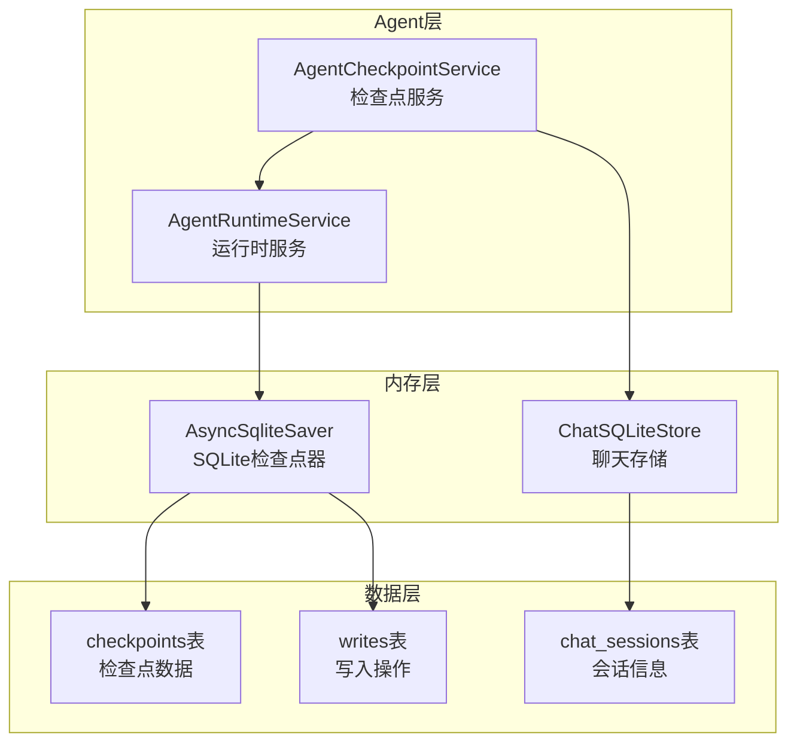
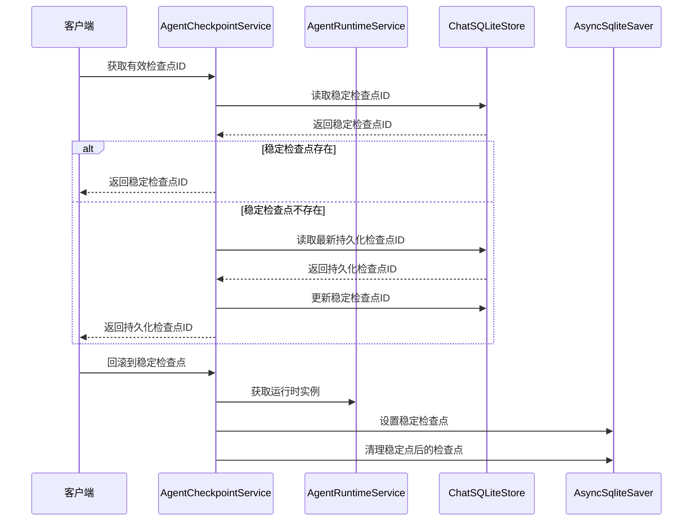
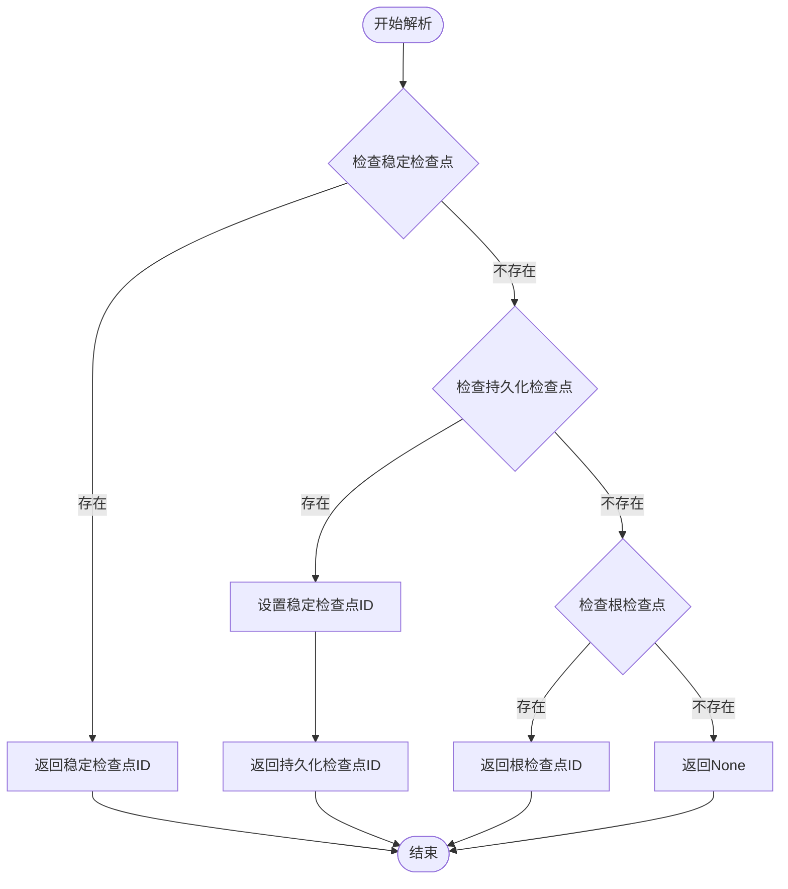
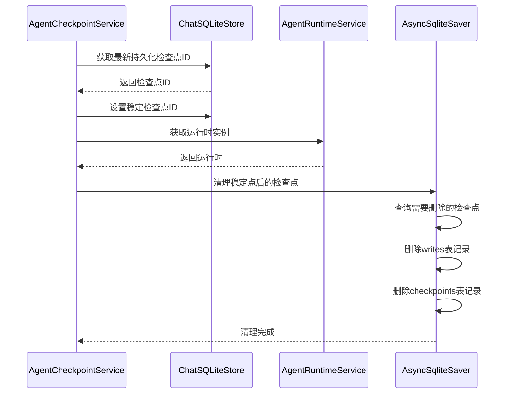
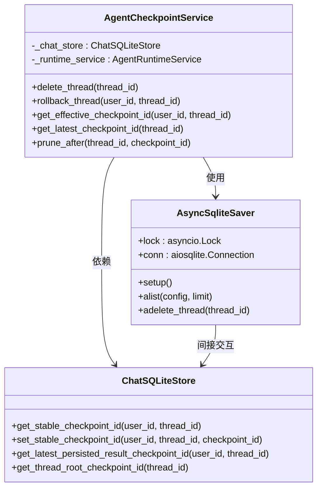
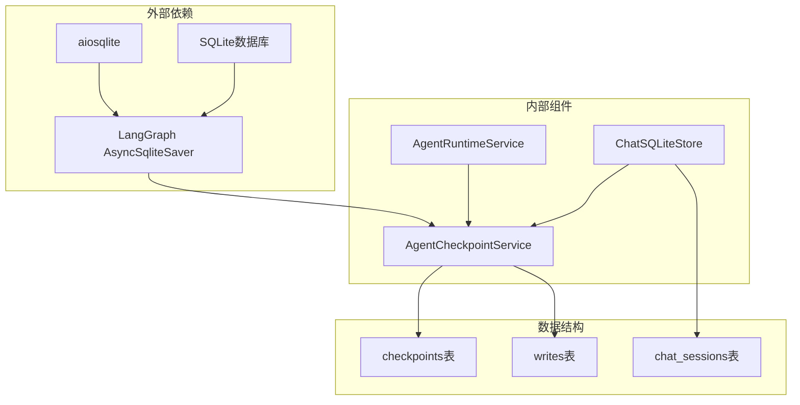

# Agent检查点系统

<cite>
**本文档引用的文件**
- [checkpoints.py](file://backend/app/agent/checkpoints.py)
- [runtime.py](file://backend/app/agent/runtime.py)
- [sqlite_store.py](file://backend/app/memory/sqlite_store.py)
- [runtime.py](file://backend/app/memory/runtime.py)
- [test_agent_checkpoints.py](file://backend/tests/test_agent_checkpoints.py)
- [agent-implementation-retrospective.md](file://docs/agent-implementation-retrospective.md)
</cite>

## 目录
1. [简介](#简介)
2. [项目结构](#项目结构)
3. [核心组件](#核心组件)
4. [架构概览](#架构概览)
5. [详细组件分析](#详细组件分析)
6. [依赖关系分析](#依赖关系分析)
7. [性能考虑](#性能考虑)
8. [故障排除指南](#故障排除指南)
9. [结论](#结论)
10. [附录](#附录)

## 简介

Agent检查点系统是AI旅行项目中LangGraph状态机的核心持久化机制。该系统负责管理会话状态的创建、恢复和清理，确保在复杂的多轮对话和工具调用场景中保持数据一致性和系统可靠性。

检查点系统采用分层设计，将业务层面的消息持久化与LangGraph运行时状态分离，实现了清晰的职责划分和高效的内存管理。系统支持多种检查点类型，包括稳定检查点、持久化检查点和根检查点，每种类型都有特定的用途和生命周期管理策略。

## 项目结构

检查点系统主要分布在以下模块中：

**图表来源**
- [checkpoints.py:1-106](file://backend/app/agent/checkpoints.py#L1-L106)
- [runtime.py:61-174](file://backend/app/agent/runtime.py#L61-L174)
- [sqlite_store.py:123-1308](file://backend/app/memory/sqlite_store.py#L123-L1308)

**章节来源**
- [checkpoints.py:1-106](file://backend/app/agent/checkpoints.py#L1-L106)
- [runtime.py:61-174](file://backend/app/agent/runtime.py#L61-L174)
- [sqlite_store.py:123-1308](file://backend/app/memory/sqlite_store.py#L123-L1308)

## 核心组件

### AgentCheckpointService

检查点服务是整个系统的核心协调器，负责：

- **检查点解析**：确定会话应该从哪个检查点开始
- **回滚操作**：将会话状态回滚到稳定点
- **清理策略**：删除过期的半成品检查点
- **查询接口**：提供检查点ID的查询能力

### AgentRuntimeService

运行时服务负责：

- **运行时装配**：构建和配置Agent运行环境
- **检查点器集成**：管理LangGraph检查点器的生命周期
- **资源管理**：确保检查点器正确初始化和关闭

### ChatSQLiteStore

聊天存储提供：

- **业务数据持久化**：用户消息和助手回复的存储
- **检查点元数据管理**：稳定检查点ID的跟踪
- **版本控制**：支持助手消息的多版本管理

**章节来源**
- [checkpoints.py:9-106](file://backend/app/agent/checkpoints.py#L9-L106)
- [runtime.py:61-174](file://backend/app/agent/runtime.py#L61-L174)
- [sqlite_store.py:123-1308](file://backend/app/memory/sqlite_store.py#L123-L1308)

## 架构概览

检查点系统采用三层架构设计，实现了业务逻辑与运行时状态的分离：

**图表来源**
- [checkpoints.py:32-44](file://backend/app/agent/checkpoints.py#L32-L44)
- [checkpoints.py:23-31](file://backend/app/agent/checkpoints.py#L23-L31)
- [runtime.py:80-116](file://backend/app/agent/runtime.py#L80-L116)

## 详细组件分析

### 检查点解析机制

检查点解析遵循优先级策略：

**图表来源**
- [checkpoints.py:32-44](file://backend/app/agent/checkpoints.py#L32-L44)
- [sqlite_store.py:1257-1271](file://backend/app/memory/sqlite_store.py#L1257-L1271)

### 回滚操作流程

回滚操作确保会话状态的一致性：

**图表来源**
- [checkpoints.py:23-31](file://backend/app/agent/checkpoints.py#L23-L31)
- [checkpoints.py:62-106](file://backend/app/agent/checkpoints.py#L62-L106)

### 并发访问控制

系统通过双重锁机制确保并发安全：

**图表来源**
- [checkpoints.py:9-106](file://backend/app/agent/checkpoints.py#L9-L106)
- [runtime.py:11-21](file://backend/app/memory/runtime.py#L11-L21)
- [sqlite_store.py:1257-1308](file://backend/app/memory/sqlite_store.py#L1257-L1308)

**章节来源**
- [checkpoints.py:9-106](file://backend/app/agent/checkpoints.py#L9-L106)
- [runtime.py:11-21](file://backend/app/memory/runtime.py#L11-L21)
- [sqlite_store.py:1257-1308](file://backend/app/memory/sqlite_store.py#L1257-L1308)

## 依赖关系分析

检查点系统的关键依赖关系如下：

**图表来源**
- [runtime.py:89](file://backend/app/agent/runtime.py#L89)
- [runtime.py:11](file://backend/app/memory/runtime.py#L11)
- [sqlite_store.py:1257-1308](file://backend/app/memory/sqlite_store.py#L1257-L1308)

**章节来源**
- [runtime.py:89](file://backend/app/agent/runtime.py#L89)
- [runtime.py:11](file://backend/app/memory/runtime.py#L11)
- [sqlite_store.py:1257-1308](file://backend/app/memory/sqlite_store.py#L1257-L1308)

## 性能考虑

### 内存优化策略

1. **惰性加载**：检查点器仅在需要时初始化
2. **连接池管理**：合理管理数据库连接生命周期
3. **批量操作**：合并多个检查点清理操作

### 查询优化

1. **索引策略**：在checkpoints表上建立适当的索引
2. **限制查询**：使用LIMIT参数限制结果集大小
3. **条件过滤**：精确的WHERE条件减少扫描范围

### 并发性能

1. **锁粒度**：使用细粒度锁减少竞争
2. **异步操作**：充分利用async/await提升吞吐量
3. **连接复用**：避免频繁创建和销毁连接

## 故障排除指南

### 常见问题及解决方案

#### 检查点丢失问题
- **症状**：会话状态无法恢复
- **原因**：检查点被意外清理
- **解决**：检查清理策略配置，确保重要检查点不被删除

#### 并发冲突问题
- **症状**：数据库锁超时或死锁
- **原因**：多个进程同时修改检查点
- **解决**：检查锁机制配置，优化事务粒度

#### 内存泄漏问题
- **症状**：内存使用持续增长
- **原因**：连接未正确关闭
- **解决**：确保在shutdown时正确关闭连接

**章节来源**
- [checkpoints.py:62-106](file://backend/app/agent/checkpoints.py#L62-L106)
- [runtime.py:134-154](file://backend/app/agent/runtime.py#L134-L154)

## 结论

Agent检查点系统通过精心设计的分层架构和严格的并发控制，成功实现了复杂AI应用中会话状态的可靠持久化。系统的主要优势包括：

1. **清晰的职责分离**：业务数据与运行时状态完全分离
2. **灵活的检查点策略**：支持多种检查点类型的组合使用
3. **强大的并发控制**：通过双重锁机制确保数据一致性
4. **高效的清理机制**：自动清理过期的半成品检查点

该系统为AI旅行项目提供了坚实的基础设施，支持复杂的多轮对话和工具调用场景，为未来的功能扩展奠定了良好的基础。

## 附录

### 配置示例

检查点系统的典型配置包括：

1. **运行时配置**：检查点器路径和连接参数
2. **清理策略**：过期检查点的清理阈值
3. **并发设置**：锁超时和重试策略

### 扩展指南

系统支持以下扩展方式：

1. **自定义存储后端**：实现新的检查点存储接口
2. **检查点格式**：支持不同的检查点序列化格式
3. **清理策略**：自定义过期检查点的判断逻辑

### 最佳实践

1. **定期备份**：重要会话状态的定期备份策略
2. **监控告警**：检查点系统的健康监控
3. **性能调优**：根据实际负载调整系统参数