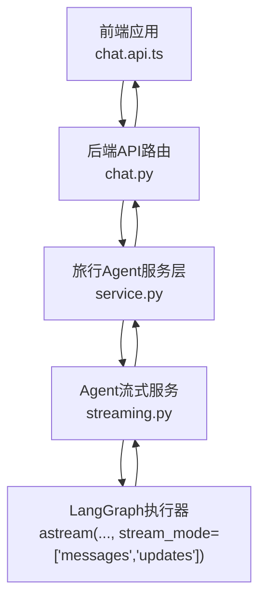
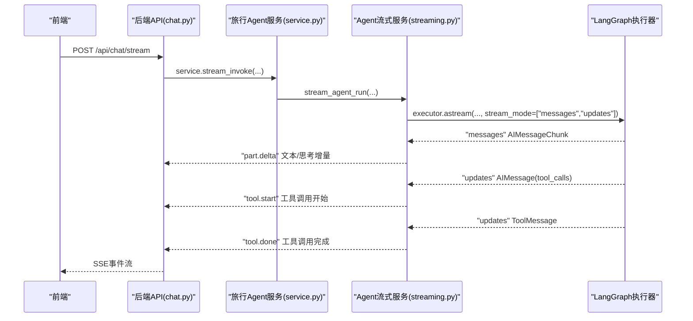
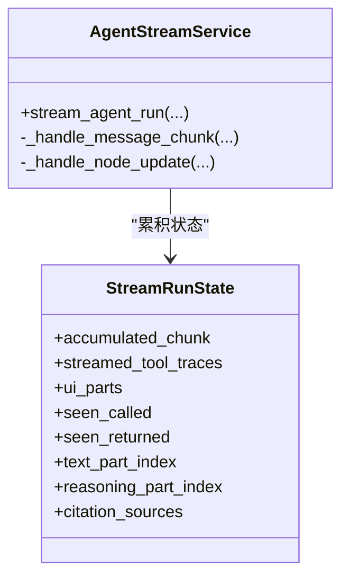
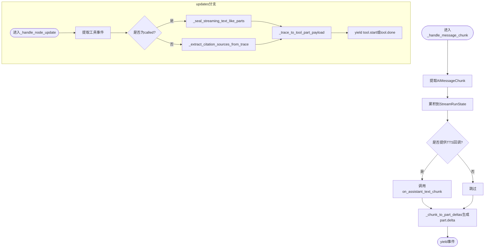
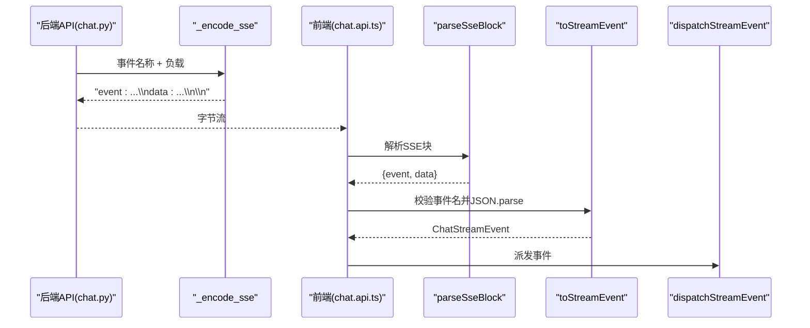
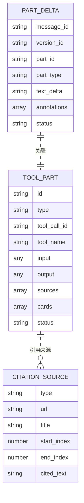
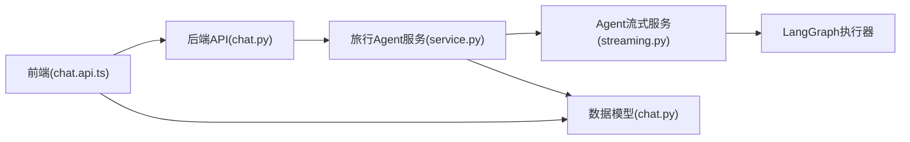

# Agent流式服务

<cite>
**本文档引用的文件**
- [streaming.py](file://backend/app/agent/streaming.py)
- [chat.py](file://backend/app/api/chat.py)
- [chat.api.ts](file://frontend/src/features/chat/api/chat.api.ts)
- [chat.ts](file://frontend/src/features/chat/hooks/use-chat-agent.ts)
- [chat.types.ts](file://frontend/src/features/chat/model/chat.types.ts)
- [chat.py](file://backend/app/schemas/chat.py)
- [test_agent_streaming.py](file://backend/tests/test_agent_streaming.py)
- [test_agent_service.py](file://backend/tests/test_agent_service.py)
- [service.py](file://backend/app/agent/service.py)
</cite>

## 目录
1. [简介](#简介)
2. [项目结构](#项目结构)
3. [核心组件](#核心组件)
4. [架构总览](#架构总览)
5. [详细组件分析](#详细组件分析)
6. [依赖关系分析](#依赖关系分析)
7. [性能考虑](#性能考虑)
8. [故障排查指南](#故障排查指南)
9. [结论](#结论)
10. [附录](#附录)

## 简介
本文件系统性阐述Agent流式服务的设计与实现，重点覆盖以下方面：
- AgentStreamService的实现原理与事件处理机制
- SSE事件流的生成与传输
- 流式响应的构建过程、事件类型与数据格式规范
- 流式处理的性能优化、内存管理与错误处理策略
- 流式API使用示例、事件监听器配置与调试方法
- 如何扩展流式功能与自定义事件类型

## 项目结构
后端采用FastAPI提供SSE流式接口，前端通过浏览器原生ReadableStream与SSE解析器消费事件流。核心交互路径如下：
- 前端发起POST /api/chat/stream请求，期望接收text/event-stream响应
- 后端API层将上游服务产生的事件逐条编码为SSE块并推送
- 前端解析SSE块，将事件分发给UI渲染与工具调用监听器

图表来源
- [chat.py:41-71](file://backend/app/api/chat.py#L41-L71)
- [service.py:415-439](file://backend/app/agent/service.py#L415-L439)
- [streaming.py:80-148](file://backend/app/agent/streaming.py#L80-L148)

章节来源
- [chat.py:1-72](file://backend/app/api/chat.py#L1-L72)
- [chat.api.ts:107-133](file://frontend/src/features/chat/api/chat.api.ts#L107-L133)

## 核心组件
- AgentStreamService：负责协调LangGraph的流式执行，聚合messages与updates两类事件，生成统一的SSE事件流
- SSE编码器：将事件名称与负载序列化为SSE文本块
- 前端SSE解析器：将SSE块解析为事件对象，并进行事件过滤与派发
- 数据模型：定义事件负载结构（PartDelta、ToolPart、CitationSource等）

章节来源
- [streaming.py:74-229](file://backend/app/agent/streaming.py#L74-L229)
- [chat.py:25-28](file://backend/app/api/chat.py#L25-L28)
- [chat.api.ts:47-86](file://frontend/src/features/chat/api/chat.api.ts#L47-L86)
- [chat.py:169-187](file://backend/app/schemas/chat.py#L169-L187)

## 架构总览
Agent流式服务采用“双通道”事件模型：
- messages通道：仅承载LLM token增量，用于文本与思考内容的逐字流
- updates通道：承载节点结束快照，驱动工具生命周期事件（tool.start/tool.done）

图表来源
- [chat.py:41-71](file://backend/app/api/chat.py#L41-L71)
- [service.py:415-439](file://backend/app/agent/service.py#L415-L439)
- [streaming.py:80-148](file://backend/app/agent/streaming.py#L80-L148)

## 详细组件分析

### AgentStreamService实现原理
- 统一入口：stream_agent_run根据LangGraph的stream_mode分别处理messages与updates
- 状态聚合：StreamRunState在messages阶段累积AIMessageChunk，在updates阶段解析工具调用与返回
- 事件生成：将LLM增量转为part.delta；将工具调用与返回转为tool.start与tool.done
- 去重与幂等：基于call_id与稳定键对工具事件进行去重，避免重复触发
- 引用与卡片：从工具返回中抽取CitationSource并注入到对应工具part；结构化卡片由领域提取器注入

图表来源
- [streaming.py:74-229](file://backend/app/agent/streaming.py#L74-L229)
- [streaming.py:58-72](file://backend/app/agent/streaming.py#L58-L72)

章节来源
- [streaming.py:80-148](file://backend/app/agent/streaming.py#L80-L148)
- [streaming.py:151-229](file://backend/app/agent/streaming.py#L151-L229)

### 流式事件处理机制
- messages处理：仅消费AIMessageChunk，累积到StreamRunState并生成text/reasoning的part.delta
- updates处理：从AIMessage提取tool_calls生成tool.start；从ToolMessage提取payload生成tool.done
- 状态封口：在切换不同类型的part时，自动将仍在streaming的text/reasoning封口为completed
- TTS回调：可选回调on_assistant_text_chunk接收逐字文本，便于下游TTS等服务

图表来源
- [streaming.py:151-184](file://backend/app/agent/streaming.py#L151-L184)
- [streaming.py:186-229](file://backend/app/agent/streaming.py#L186-L229)
- [streaming.py:332-433](file://backend/app/agent/streaming.py#L332-L433)
- [streaming.py:435-499](file://backend/app/agent/streaming.py#L435-L499)

章节来源
- [streaming.py:151-229](file://backend/app/agent/streaming.py#L151-L229)
- [streaming.py:332-499](file://backend/app/agent/streaming.py#L332-L499)

### SSE事件流的生成与传输
- 后端编码：_encode_sse将事件名称与JSON负载组合为SSE文本块
- 错误边界：捕获ValueError与通用异常，统一发送error事件
- 前端解析：parseSseBlock按行解析event与data；toStreamEvent校验事件名并反序列化
- 事件派发：dispatchStreamEvent在tool.start后等待下一帧绘制机会，保证UI一致性

图表来源
- [chat.py:25-28](file://backend/app/api/chat.py#L25-L28)
- [chat.py:49-61](file://backend/app/api/chat.py#L49-L61)
- [chat.api.ts:47-86](file://frontend/src/features/chat/api/chat.api.ts#L47-L86)
- [chat.api.ts:100-105](file://frontend/src/features/chat/api/chat.api.ts#L100-L105)

章节来源
- [chat.py:25-61](file://backend/app/api/chat.py#L25-L61)
- [chat.api.ts:47-105](file://frontend/src/features/chat/api/chat.api.ts#L47-L105)

### 事件类型与数据格式规范
- part.delta：文本/思考片段增量，携带message_id、version_id、part_id、part_type、text_delta等
- tool.start：工具调用开始，携带完整入参与运行中状态
- tool.done：工具调用结束，携带输出、来源、卡片与成功/失败状态
- 错误事件：error，包含错误消息

图表来源
- [chat.py:169-187](file://backend/app/schemas/chat.py#L169-L187)
- [chat.py:98-110](file://backend/app/schemas/chat.py#L98-L110)
- [chat.py:51-61](file://backend/app/schemas/chat.py#L51-L61)

章节来源
- [chat.py:169-187](file://backend/app/schemas/chat.py#L169-L187)
- [chat.py:98-110](file://backend/app/schemas/chat.py#L98-L110)
- [chat.py:51-61](file://backend/app/schemas/chat.py#L51-L61)

### 前端事件监听与使用示例
- 使用streamChat发起流式对话，options.onEvent接收事件
- 对于tool.start事件，前端等待下一帧绘制机会后再处理，确保UI稳定
- 前端提供SSE解析与事件映射工具函数，便于扩展自定义事件类型

章节来源
- [chat.api.ts:107-133](file://frontend/src/features/chat/api/chat.api.ts#L107-L133)
- [chat.api.ts:100-105](file://frontend/src/features/chat/api/chat.api.ts#L100-L105)
- [chat.types.ts](file://frontend/src/features/chat/model/chat.types.ts)

## 依赖关系分析
- 后端API依赖旅行Agent服务层，后者再依赖Agent流式服务
- Agent流式服务依赖LangGraph执行器与工具提取器
- 前端依赖SSE解析器与事件类型定义

图表来源
- [chat.py:41-71](file://backend/app/api/chat.py#L41-L71)
- [service.py:415-439](file://backend/app/agent/service.py#L415-L439)
- [streaming.py:80-148](file://backend/app/agent/streaming.py#L80-L148)
- [chat.py:169-187](file://backend/app/schemas/chat.py#L169-L187)

章节来源
- [chat.py:41-71](file://backend/app/api/chat.py#L41-L71)
- [service.py:415-439](file://backend/app/agent/service.py#L415-L439)
- [streaming.py:80-148](file://backend/app/agent/streaming.py#L80-L148)

## 性能考虑
- 事件拆分与去重：将LLM token与工具事件分离，避免重复触发与状态竞态
- 状态封口：在切换文本/思考与工具part时主动封口，减少前端状态计算
- 逐字增量：仅传递text_delta，降低每次事件的数据体积
- 异步流式：LangGraph原生异步流式执行，后端逐条编码SSE，避免一次性缓冲大块数据
- 前端帧同步：在tool.start后等待下一帧绘制，平衡UI流畅度与事件处理时机

## 故障排查指南
- 后端错误事件：当抛出ValueError或未捕获异常时，后端会发送error事件，前端应显示友好提示
- SSE解析失败：若前端无法解析SSE块或事件名未知，toStreamEvent会返回null，需检查事件名与数据格式
- 工具事件重复：旧设计曾尝试在messages中拼装tool_call_chunks，导致重复触发；新设计仅通过updates触发，确保事件线性可推理
- 引用与卡片：若工具返回payload不符合预期形状，引用与卡片可能为空，需检查工具输出结构

章节来源
- [chat.py:55-61](file://backend/app/api/chat.py#L55-L61)
- [chat.api.ts:71-86](file://frontend/src/features/chat/api/chat.api.ts#L71-L86)
- [test_agent_streaming.py:179-226](file://backend/tests/test_agent_streaming.py#L179-L226)

## 结论
Agent流式服务通过清晰的双通道事件模型与严格的去重与封口机制，实现了稳定、可扩展的流式体验。后端以最小封装提供SSE事件流，前端以解析器与事件映射实现灵活的UI更新与工具调用监听。该架构易于扩展新的事件类型与工具，同时具备良好的性能与可维护性。

## 附录

### 事件类型与负载定义
- part.delta：文本/思考片段增量
  - 字段：message_id、version_id、part_id、part_type、text_delta、annotations、status
- tool.start：工具调用开始
  - 字段：message_id、version_id、part（包含tool_call_id、tool_name、input、status=running）
- tool.done：工具调用结束
  - 字段：message_id、version_id、part（包含tool_call_id、tool_name、input、output、sources、cards、status=success/error）
- error：错误事件
  - 字段：message

章节来源
- [chat.py:169-187](file://backend/app/schemas/chat.py#L169-L187)
- [chat.py:98-110](file://backend/app/schemas/chat.py#L98-L110)
- [chat.py:139-143](file://backend/app/schemas/chat.py#L139-L143)

### 扩展与自定义建议
- 新增事件类型：在前端chat.api.ts中扩展事件名白名单与解析逻辑；在后端streaming.py中添加事件生成与派发
- 自定义工具卡片：在后端cards提取器中注册新的结构化卡片类型，前端通过card-renderer-registry注册渲染器
- 调试方法：利用后端日志与前端事件打印，结合单元测试验证事件序列与去重行为

章节来源
- [streaming.py:435-499](file://backend/app/agent/streaming.py#L435-L499)
- [test_agent_streaming.py:326-371](file://backend/tests/test_agent_streaming.py#L326-L371)