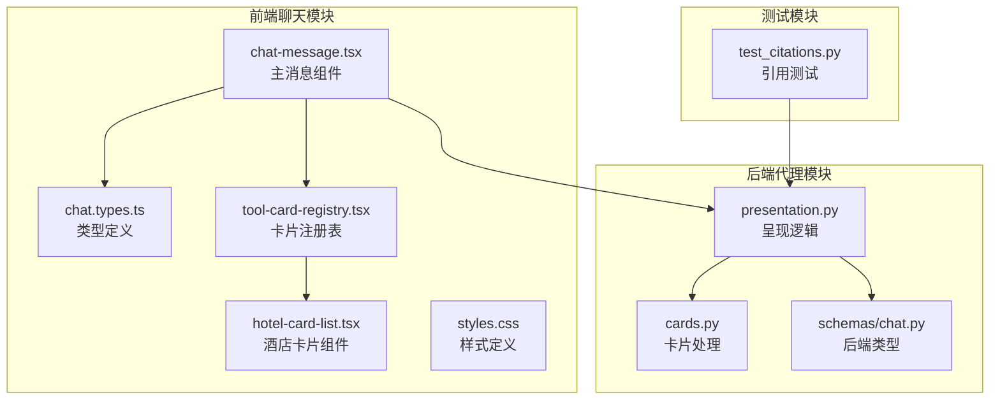
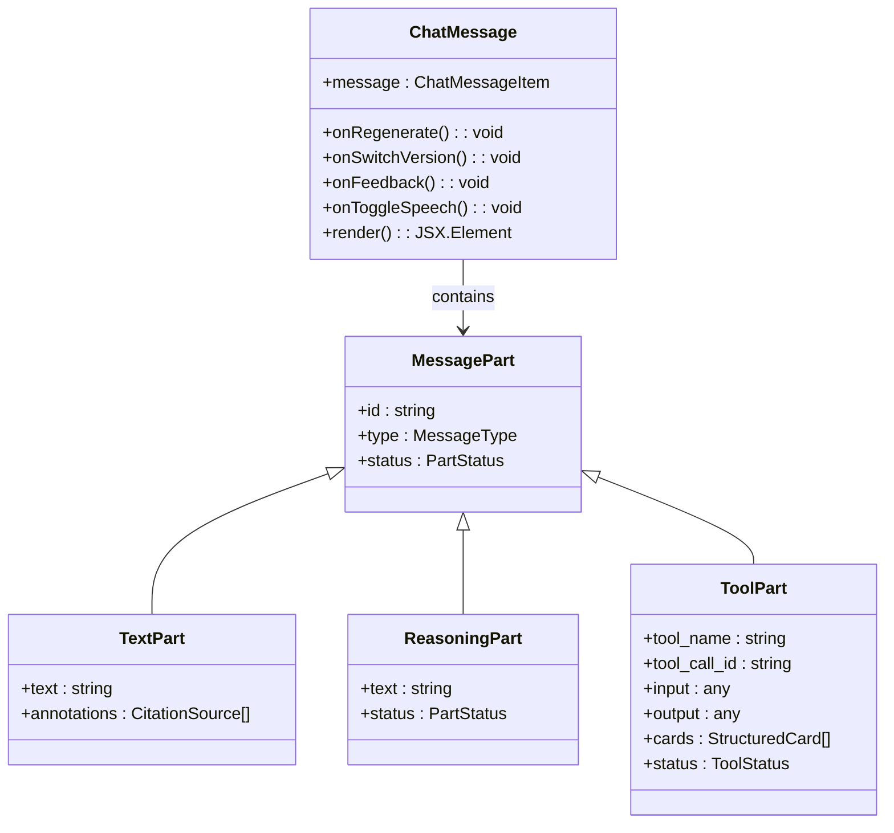
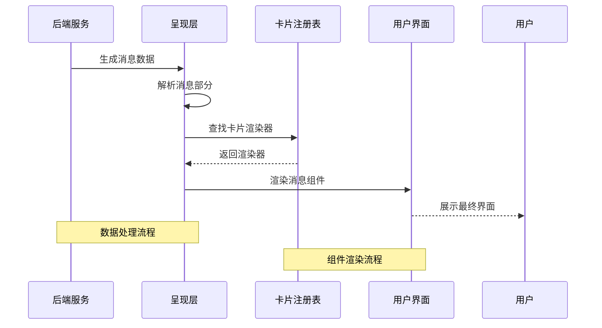
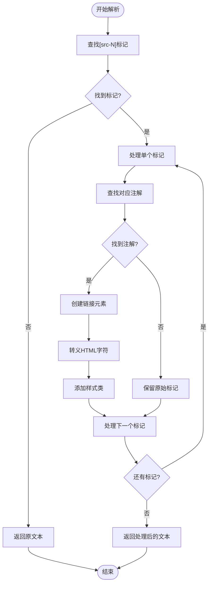
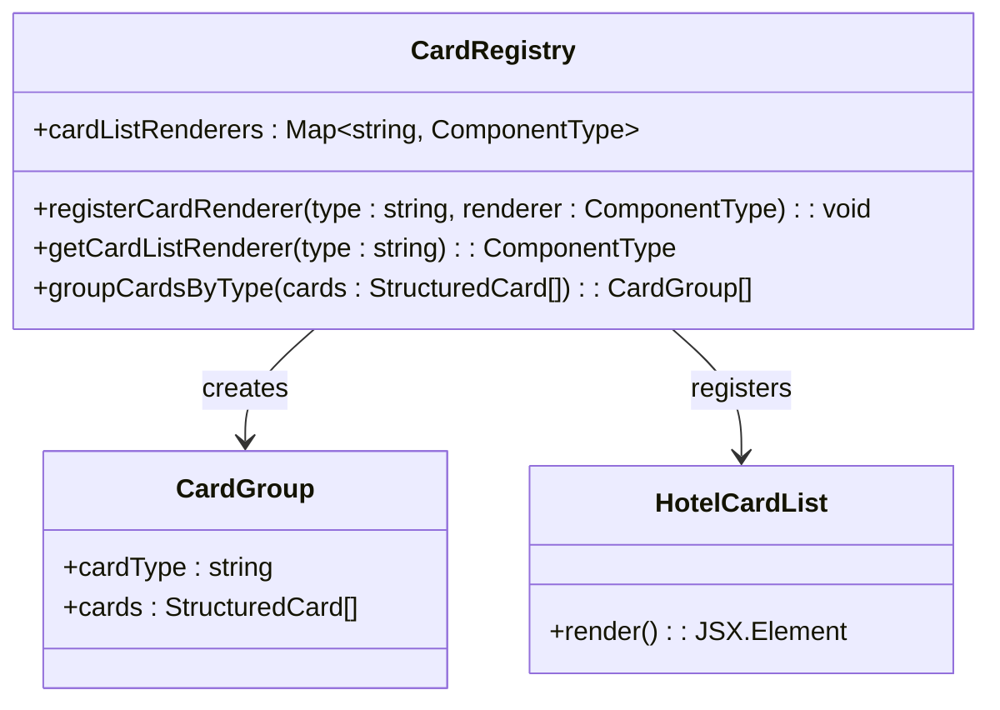
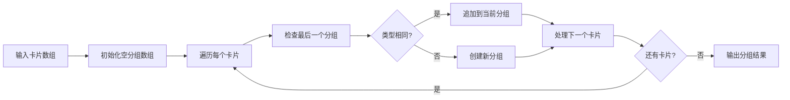
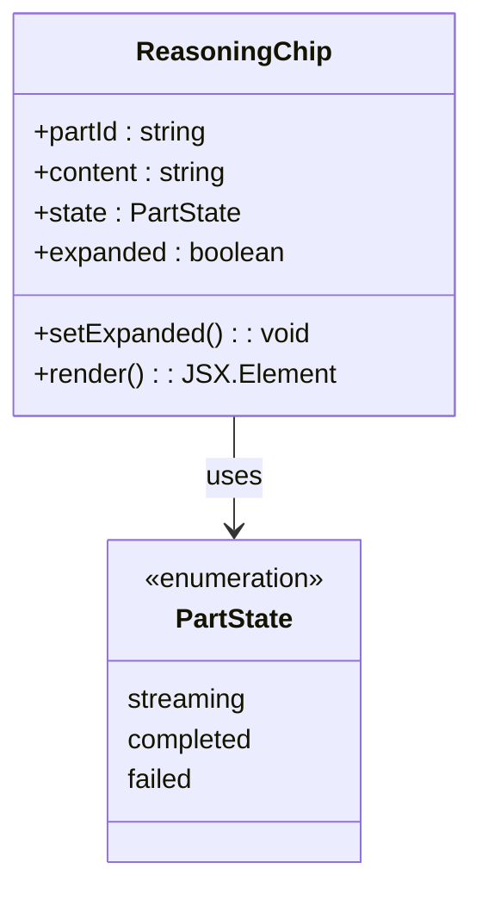
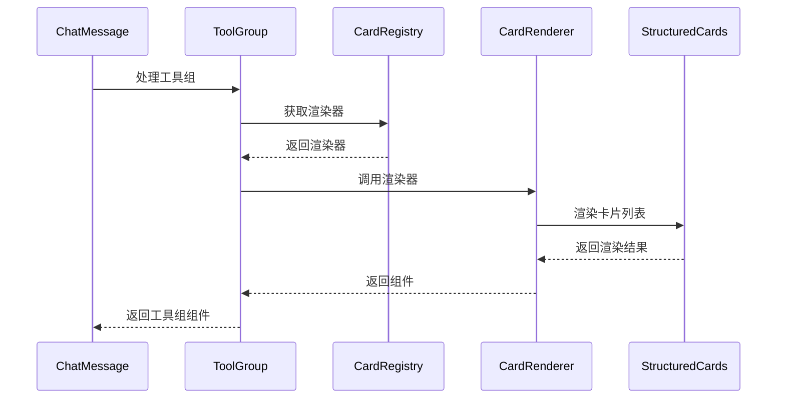
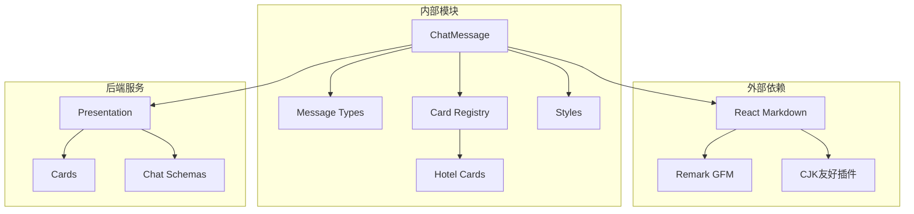
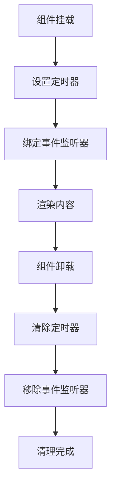

# Agent消息呈现层

<cite>
**本文档引用的文件**
- [chat-message.tsx](file://frontend/src/features/chat/ui/chat-message.tsx)
- [chat.types.ts](file://frontend/src/features/chat/model/chat.types.ts)
- [tool-card-registry.tsx](file://frontend/src/features/chat/model/tool-card-registry.tsx)
- [hotel-card-list.tsx](file://frontend/src/features/chat/ui/hotel-card-list.tsx)
- [styles.css](file://frontend/src/app/styles.css)
- [presentation.py](file://backend/app/agent/presentation.py)
- [cards.py](file://backend/app/agent/cards.py)
- [test_citations.py](file://backend/tests/test_citations.py)
- [chat.types.ts](file://backend/app/schemas/chat.py)
</cite>

## 目录
1. [简介](#简介)
2. [项目结构](#项目结构)
3. [核心组件](#核心组件)
4. [架构概览](#架构概览)
5. [详细组件分析](#详细组件分析)
6. [依赖关系分析](#依赖关系分析)
7. [性能考虑](#性能考虑)
8. [故障排除指南](#故障排除指南)
9. [结论](#结论)
10. [附录](#附录)

## 简介

Agent消息呈现层是AI旅行助手系统中的关键组件，负责将后端生成的智能体响应转换为用户友好的界面展示。该层实现了复杂的消息格式化、结构化卡片渲染、引用注解处理以及消息状态管理等功能。

系统采用前后端分离的设计模式，后端专注于业务逻辑和数据处理，前端负责用户界面的构建和交互。消息呈现层通过清晰的类型系统和模块化设计，确保了良好的可扩展性和维护性。

## 项目结构

消息呈现层主要分布在前端的聊天功能模块中，核心文件组织如下：



**图表来源**
- [chat-message.tsx:1-500](file://frontend/src/features/chat/ui/chat-message.tsx#L1-L500)
- [tool-card-registry.tsx:1-100](file://frontend/src/features/chat/model/tool-card-registry.tsx#L1-L100)
- [presentation.py:1-200](file://backend/app/agent/presentation.py#L1-L200)

**章节来源**
- [chat-message.tsx:1-500](file://frontend/src/features/chat/ui/chat-message.tsx#L1-L500)
- [tool-card-registry.tsx:1-100](file://frontend/src/features/chat/model/tool-card-registry.tsx#L1-L100)

## 核心组件

### ChatMessage 主组件

ChatMessage是消息呈现层的核心组件，负责处理不同类型的消息部分并将其转换为相应的UI元素。该组件支持多种消息类型，包括文本消息、推理消息和工具调用消息。



**图表来源**
- [chat-message.tsx:269-476](file://frontend/src/features/chat/ui/chat-message.tsx#L269-L476)
- [chat.types.ts:1-200](file://frontend/src/features/chat/model/chat.types.ts#L1-L200)

### 类型系统架构

消息呈现层采用了严格的类型系统来确保数据的一致性和安全性。类型系统分为三个层次：

1. **基础消息类型**：定义消息的基本结构和属性
2. **消息部分类型**：描述不同类型的消息组成部分
3. **结构化卡片类型**：处理复杂的结构化数据展示

**章节来源**
- [chat.types.ts:1-300](file://frontend/src/features/chat/model/chat.types.ts#L1-L300)
- [chat.types.ts:1-200](file://backend/app/schemas/chat.py#L1-L200)

## 架构概览

消息呈现层采用分层架构设计，确保各组件职责明确且相互独立：



**图表来源**
- [presentation.py:1-200](file://backend/app/agent/presentation.py#L1-L200)
- [tool-card-registry.tsx:1-100](file://frontend/src/features/chat/model/tool-card-registry.tsx#L1-L100)
- [chat-message.tsx:1-500](file://frontend/src/features/chat/ui/chat-message.tsx#L1-L500)

## 详细组件分析

### 文本内容格式化处理

文本内容格式化是消息呈现层的核心功能之一，负责将原始文本转换为用户友好的格式化内容。

#### 引用注解解析机制

系统实现了智能的引用注解解析功能，能够自动识别文本中的引用标记并转换为可点击的链接：



**图表来源**
- [chat-message.tsx:82-95](file://frontend/src/features/chat/ui/chat-message.tsx#L82-L95)
- [chat-message.tsx:137-176](file://frontend/src/features/chat/ui/chat-message.tsx#L137-L176)

#### Markdown渲染引擎

系统集成了强大的Markdown渲染引擎，支持丰富的文本格式化选项：

| 功能特性 | 支持情况 | 描述 |
|---------|---------|------|
| 链接处理 | ✅ | 自动识别URL并创建可点击链接 |
| 引用注解 | ✅ | 将[src-N]标记转换为引用链接 |
| 代码块 | ✅ | 支持语法高亮 |
| 列表 | ✅ | 支持有序和无序列表 |
| 表格 | ✅ | 支持复杂表格渲染 |
| 加粗斜体 | ✅ | 支持基本文本格式化 |

**章节来源**
- [chat-message.tsx:104-176](file://frontend/src/features/chat/ui/chat-message.tsx#L104-L176)
- [styles.css:144-169](file://frontend/src/app/styles.css#L144-L169)

### 结构化卡片渲染机制

系统支持多种类型的结构化卡片渲染，每种卡片类型都有专门的渲染器负责展示。

#### 卡片注册表设计

卡片注册表采用工厂模式设计，提供了统一的卡片处理接口：



**图表来源**
- [tool-card-registry.tsx:1-100](file://frontend/src/features/chat/model/tool-card-registry.tsx#L1-L100)

#### 卡片分组算法

系统实现了高效的卡片分组算法，能够将连续相同类型的卡片合并为组：



**图表来源**
- [tool-card-registry.tsx:84-98](file://frontend/src/features/chat/model/tool-card-registry.tsx#L84-L98)

**章节来源**
- [tool-card-registry.tsx:1-100](file://frontend/src/features/chat/model/tool-card-registry.tsx#L1-L100)
- [hotel-card-list.tsx:1-200](file://frontend/src/features/chat/ui/hotel-card-list.tsx#L1-L200)

### 推理过程展示

系统提供了完整的推理过程展示功能，允许用户查看AI的思考过程。

#### 推理芯片组件

推理芯片组件提供了折叠式的推理过程展示：



**图表来源**
- [chat-message.tsx:245-267](file://frontend/src/features/chat/ui/chat-message.tsx#L245-L267)

推理过程的展示逻辑：

1. **状态检测**：根据推理部分的状态确定显示方式
2. **内容处理**：处理推理文本的格式化和渲染
3. **交互控制**：提供展开/折叠的用户交互
4. **视觉反馈**：根据状态显示不同的视觉效果

**章节来源**
- [chat-message.tsx:245-267](file://frontend/src/features/chat/ui/chat-message.tsx#L245-L267)
- [chat-message.tsx:392-407](file://frontend/src/features/chat/ui/chat-message.tsx#L392-L407)

### 工具调用消息处理

工具调用消息是Agent消息呈现层的重要组成部分，负责展示各种工具调用的结果。

#### 工具组渲染机制

系统为工具调用消息提供了专门的渲染机制：



**图表来源**
- [chat-message.tsx:420-476](file://frontend/src/features/chat/ui/chat-message.tsx#L420-L476)
- [tool-card-registry.tsx:1-100](file://frontend/src/features/chat/model/tool-card-registry.tsx#L1-L100)

**章节来源**
- [chat-message.tsx:420-476](file://frontend/src/features/chat/ui/chat-message.tsx#L420-L476)

## 依赖关系分析

消息呈现层的依赖关系体现了清晰的分层架构：



**图表来源**
- [chat-message.tsx:104-176](file://frontend/src/features/chat/ui/chat-message.tsx#L104-L176)
- [tool-card-registry.tsx:1-100](file://frontend/src/features/chat/model/tool-card-registry.tsx#L1-L100)

**章节来源**
- [chat-message.tsx:1-500](file://frontend/src/features/chat/ui/chat-message.tsx#L1-L500)
- [tool-card-registry.tsx:1-100](file://frontend/src/features/chat/model/tool-card-registry.tsx#L1-L100)

## 性能考虑

消息呈现层在设计时充分考虑了性能优化：

### 渲染性能优化

1. **虚拟DOM优化**：使用React的key属性确保组件正确更新
2. **条件渲染**：仅在必要时渲染特定组件
3. **懒加载**：卡片组件按需加载
4. **内存管理**：及时清理定时器和事件监听器

### 内存泄漏防护



**图表来源**
- [chat-message.tsx:280-283](file://frontend/src/features/chat/ui/chat-message.tsx#L280-L283)

### 错误边界处理

系统实现了全面的错误处理机制：

| 错误类型 | 处理策略 | 用户反馈 |
|---------|---------|---------|
| 网络错误 | 重试机制 + 友好提示 | 显示重试按钮 |
| 渲染错误 | 错误边界 + 日志记录 | 显示占位符 |
| 数据异常 | 类型验证 + 默认值 | 显示默认内容 |
| 资源加载失败 | 降级方案 + 缓存 | 显示缓存内容 |

**章节来源**
- [chat-message.tsx:445-449](file://frontend/src/features/chat/ui/chat-message.tsx#L445-L449)

## 故障排除指南

### 常见问题诊断

#### 引用注解不显示

**症状**：文本中的[src-N]标记未转换为链接

**排查步骤**：
1. 检查注解数组是否为空
2. 验证标记格式是否正确
3. 确认注解索引的有效性
4. 检查HTML转义是否正确

#### 卡片渲染异常

**症状**：结构化卡片无法正常显示

**排查步骤**：
1. 验证卡片类型注册
2. 检查卡片数据格式
3. 确认渲染器组件可用
4. 查看控制台错误信息

#### 推理过程不显示

**症状**：推理芯片组件不出现

**排查步骤**：
1. 检查消息部分类型
2. 验证状态字段值
3. 确认文本内容存在
4. 查看组件渲染逻辑

**章节来源**
- [chat-message.tsx:82-95](file://frontend/src/features/chat/ui/chat-message.tsx#L82-L95)
- [tool-card-registry.tsx:45-76](file://frontend/src/features/chat/model/tool-card-registry.tsx#L45-L76)

## 结论

Agent消息呈现层通过精心设计的架构和实现，成功地将复杂的AI响应转换为直观易懂的用户界面。系统的主要优势包括：

1. **模块化设计**：清晰的组件分离和职责划分
2. **类型安全**：严格的类型系统确保数据一致性
3. **可扩展性**：灵活的注册表机制支持新功能添加
4. **用户体验**：丰富的交互和视觉反馈
5. **性能优化**：高效的渲染和资源管理

该呈现层为AI旅行助手系统提供了坚实的基础，支持未来功能的持续扩展和改进。

## 附录

### 配置示例

#### 自定义卡片渲染器

```typescript
// 示例：添加新的卡片类型
const customCardRenderer = ({ cards }: { cards: StructuredCard[] }) => {
  return (
    <div className="custom-card-container">
      {cards.map(card => (
        <CustomCard key={card.id} data={card.data} />
      ))}
    </div>
  );
};

// 注册渲染器
cardListRenderers.set('custom-type', customCardRenderer);
```

#### 样式定制

```css
/* 自定义引用芯片样式 */
.custom-citation-chip {
  background: linear-gradient(45deg, #667eea, #764ba2);
  color: white;
  border-radius: 12px;
  padding: 0.25rem 0.5rem;
}

/* 自定义工具组样式 */
.custom-tool-group {
  border-left: 3px solid #667eea;
  margin: 1rem 0;
  padding: 0.5rem 1rem;
}
```

### 扩展指南

#### 添加新的消息类型

1. **定义类型**：在类型定义文件中添加新类型
2. **实现渲染**：创建对应的渲染组件
3. **集成处理**：在主消息组件中添加处理逻辑
4. **测试验证**：编写单元测试确保功能正确

#### 增强用户体验

1. **动画效果**：添加平滑的过渡动画
2. **响应式设计**：优化移动端显示效果
3. **无障碍访问**：添加ARIA标签和键盘导航
4. **性能监控**：集成性能指标收集