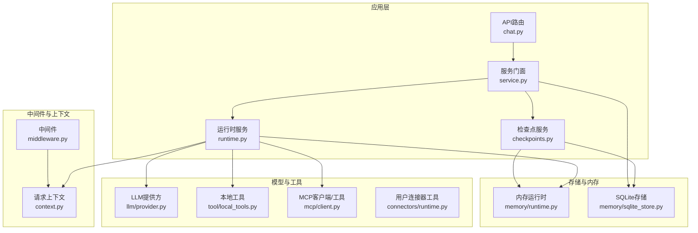
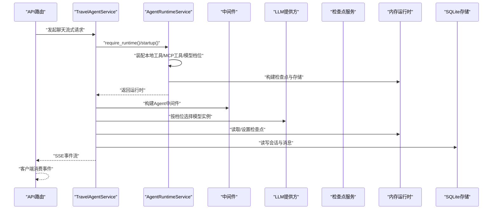
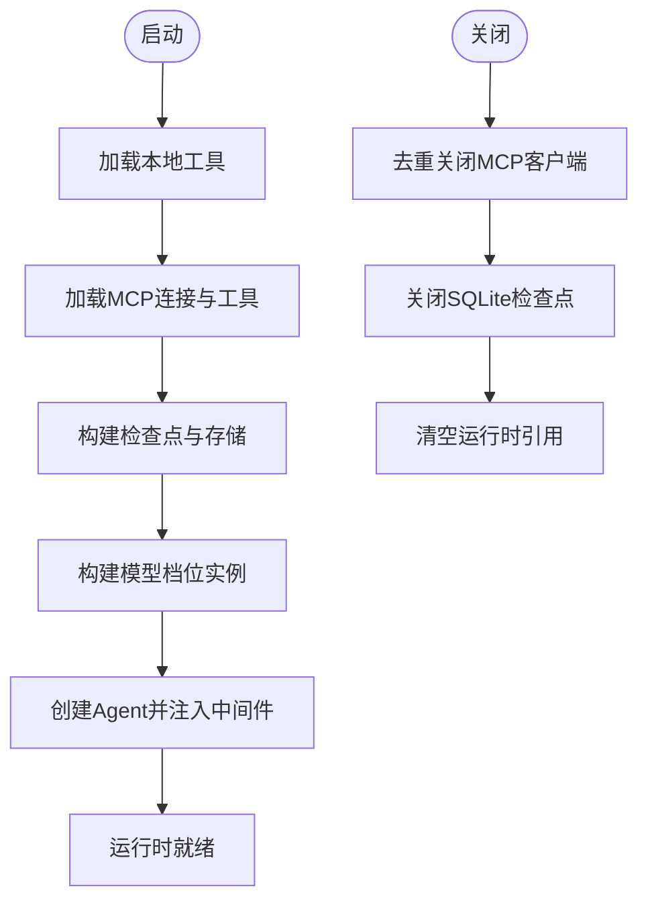
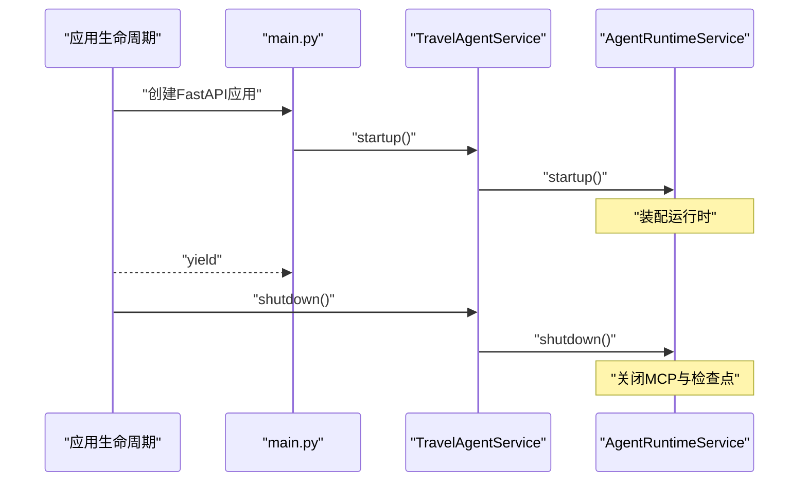
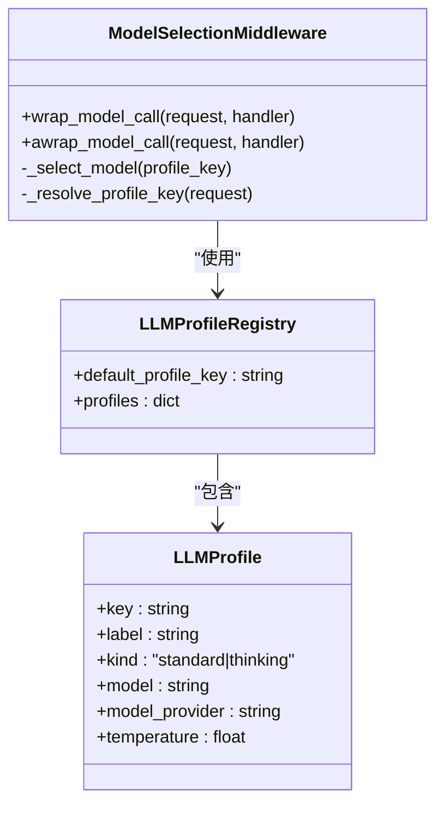
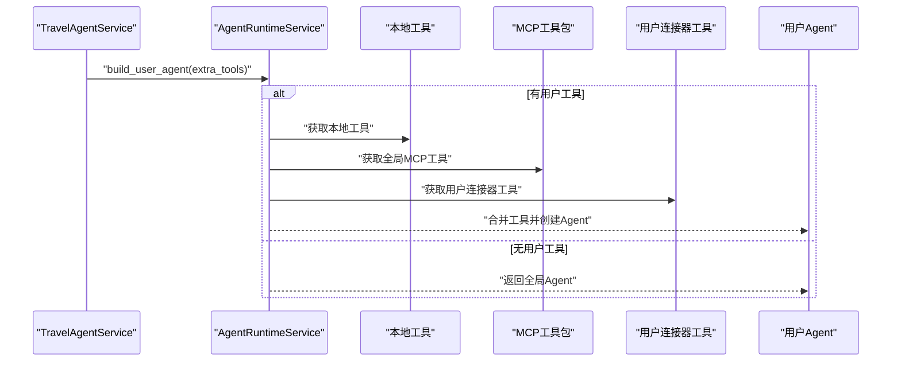
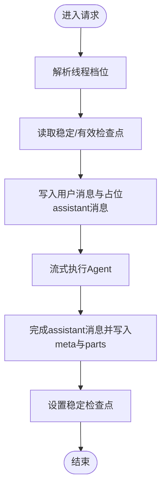
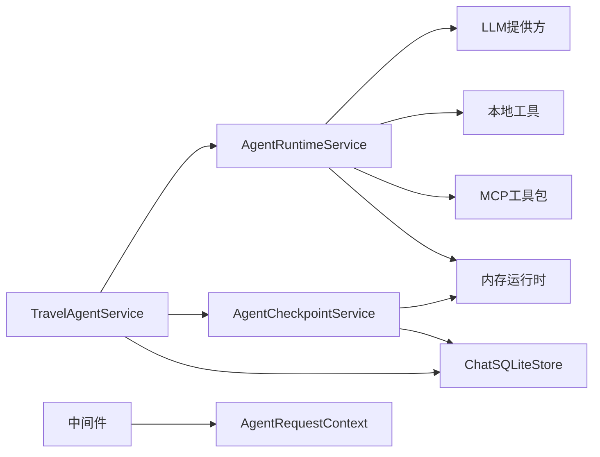

# Agent运行时管理

<cite>
**本文引用的文件**
- [runtime.py](file://backend/app/agent/runtime.py)
- [service.py](file://backend/app/agent/service.py)
- [checkpoints.py](file://backend/app/agent/checkpoints.py)
- [context.py](file://backend/app/agent/context.py)
- [middleware.py](file://backend/app/agent/middleware.py)
- [main.py](file://backend/app/main.py)
- [runtime.py](file://backend/app/memory/runtime.py)
- [sqlite_store.py](file://backend/app/memory/sqlite_store.py)
- [local_tools.py](file://backend/app/tool/local_tools.py)
- [exa_tools.py](file://backend/app/tool/exa_tools.py)
- [client.py](file://backend/app/mcp/client.py)
- [runtime.py](file://backend/app/connectors/runtime.py)
- [chat.py](file://backend/app/api/chat.py)
</cite>

## 目录
1. [简介](#简介)
2. [项目结构](#项目结构)
3. [核心组件](#核心组件)
4. [架构总览](#架构总览)
5. [详细组件分析](#详细组件分析)
6. [依赖分析](#依赖分析)
7. [性能考虑](#性能考虑)
8. [故障排除指南](#故障排除指南)
9. [结论](#结论)
10. [附录](#附录)

## 简介
本文件系统性阐述旅行Agent运行时管理的设计与实现，覆盖以下主题：
- AgentRuntimeService的初始化流程与生命周期管理
- LangGraph运行时的启动与关闭机制
- 运行时状态快照与可观测性
- LLM模型配置与多档位选择
- 工具集成（本地工具、MCP工具、用户级连接器工具）
- 会话上下文与检查点（checkpoint）管理
- 运行时资源管理、性能监控与错误恢复策略
- 运行时配置示例与扩展方法（新增工具与MCP服务）

## 项目结构
后端采用分层架构，Agent运行时位于应用层的核心位置，向上为API路由与服务门面，向下依赖LLM提供方、内存与工具栈。关键目录与职责概览：
- backend/app/agent：运行时、服务门面、中间件、上下文、检查点
- backend/app/llm：LLM提供方与模型档位配置
- backend/app/tool：本地工具与外部工具封装
- backend/app/mcp：MCP客户端与工具打包
- backend/app/connectors：用户连接器工具的按需装配
- backend/app/memory：LangGraph检查点与SQLite存储
- backend/app/api：HTTP接口与SSE流式输出
- backend/app/main.py：应用生命周期与FastAPI集成

**图表来源**
- [chat.py:1-72](file://backend/app/api/chat.py#L1-L72)
- [service.py:97-529](file://backend/app/agent/service.py#L97-L529)
- [runtime.py:61-174](file://backend/app/agent/runtime.py#L61-L174)
- [middleware.py:1-211](file://backend/app/agent/middleware.py#L1-L211)
- [context.py:10-22](file://backend/app/agent/context.py#L10-L22)
- [checkpoints.py:9-106](file://backend/app/agent/checkpoints.py#L9-L106)
- [local_tools.py:1-56](file://backend/app/tool/local_tools.py#L1-L56)
- [client.py:1-69](file://backend/app/mcp/client.py#L1-L69)
- [runtime.py:1-88](file://backend/app/connectors/runtime.py#L1-L88)
- [runtime.py:1-22](file://backend/app/memory/runtime.py#L1-L22)
- [sqlite_store.py:123-800](file://backend/app/memory/sqlite_store.py#L123-L800)

**章节来源**
- [main.py:23-54](file://backend/app/main.py#L23-L54)
- [runtime.py:61-174](file://backend/app/agent/runtime.py#L61-L174)
- [service.py:97-529](file://backend/app/agent/service.py#L97-L529)

## 核心组件
- AgentRuntimeService：负责运行时装配、启动、关闭与状态快照，聚合全局工具、MCP工具包、LLM模型档位、检查点与存储。
- TravelAgentService：服务门面，协调运行时、检查点、流式处理、语音合成与数据库存储。
- AgentCheckpointService：围绕LangGraph检查点进行定位、回滚与裁剪。
- AgentRequestContext：贯穿一次请求的上下文载体，驱动动态提示词与模型档位选择。
- 中间件：动态提示词注入、工具异常边界、模型选择中间件。
- 工具体系：本地工具（如时间查询、Exa搜索）、MCP工具、用户连接器工具。

**章节来源**
- [runtime.py:61-174](file://backend/app/agent/runtime.py#L61-L174)
- [service.py:97-529](file://backend/app/agent/service.py#L97-L529)
- [checkpoints.py:9-106](file://backend/app/agent/checkpoints.py#L9-L106)
- [context.py:10-22](file://backend/app/agent/context.py#L10-L22)
- [middleware.py:133-211](file://backend/app/agent/middleware.py#L133-L211)
- [local_tools.py:49-56](file://backend/app/tool/local_tools.py#L49-L56)
- [client.py:14-69](file://backend/app/mcp/client.py#L14-L69)
- [runtime.py:18-88](file://backend/app/connectors/runtime.py#L18-L88)

## 架构总览
运行时管理以AgentRuntimeService为中心，贯穿以下关键路径：
- 初始化：加载本地工具、MCP连接与工具、构建LLM模型档位字典、建立LangGraph检查点与存储，组装Agent并注入中间件。
- 运行：服务门面按需构建用户级Agent（合并本地工具、全局MCP工具与用户连接器工具），通过流式服务与中间件驱动LangGraph执行。
- 关闭：有序关闭MCP客户端与SQLite检查点连接，释放资源。
- 观测：运行时快照用于健康检查与运维监控。

**图表来源**
- [service.py:373-507](file://backend/app/agent/service.py#L373-L507)
- [runtime.py:80-116](file://backend/app/agent/runtime.py#L80-L116)
- [middleware.py:193-211](file://backend/app/agent/middleware.py#L193-L211)
- [checkpoints.py:32-61](file://backend/app/agent/checkpoints.py#L32-L61)
- [sqlite_store.py:182-279](file://backend/app/memory/sqlite_store.py#L182-L279)

**章节来源**
- [main.py:23-54](file://backend/app/main.py#L23-L54)
- [service.py:116-127](file://backend/app/agent/service.py#L116-L127)

## 详细组件分析

### AgentRuntimeService：初始化、启动与关闭
- 初始化流程
  - 读取本地工具列表与MCP连接配置，异步加载MCP工具并汇总成功连接服务器与错误信息。
  - 构建LangGraph检查点与存储（当前未启用共享store）。
  - 基于LLM提供方注册表构建各档位ChatModel实例，确定默认档位键。
  - 使用默认模型、工具集合、上下文模式、中间件与检查点创建Agent，并封装为AgentRuntime。
- 用户级Agent构建
  - 在已有运行时基础上，按需叠加用户连接器工具，保持中间件与检查点一致。
- 关闭流程
  - 去重关闭MCP客户端（支持单客户端或多客户端），确保异步close被await。
  - 关闭SQLite检查点连接，清空运行时引用。
- 快照
  - 未初始化时返回不可用状态与空列表；已初始化时返回MCP连接服务器、错误、本地工具名与MCP工具名列表。

**图表来源**
- [runtime.py:80-154](file://backend/app/agent/runtime.py#L80-L154)

**章节来源**
- [runtime.py:80-154](file://backend/app/agent/runtime.py#L80-L154)

### LangGraph运行时：启动与关闭机制
- 启动
  - 通过AgentRuntimeService在应用生命周期内一次性初始化，避免重复装配。
  - 服务门面在每次请求前检查运行时存在性，不存在则触发启动。
- 关闭
  - 应用生命周期结束时，服务门面先关闭语音服务，再关闭AgentRuntimeService，确保资源有序释放。

**图表来源**
- [main.py:23-28](file://backend/app/main.py#L23-L28)
- [service.py:120-123](file://backend/app/agent/service.py#L120-L123)
- [runtime.py:134-154](file://backend/app/agent/runtime.py#L134-L154)

**章节来源**
- [main.py:23-28](file://backend/app/main.py#L23-L28)
- [service.py:120-123](file://backend/app/agent/service.py#L120-L123)

### 运行时状态快照功能
- 用途：健康检查与运维监控，快速判断MCP连接状态、工具可用性与本地工具清单。
- 结构：包含ready标志、连接服务器列表、错误列表、本地工具名与MCP工具名列表。
- 未初始化时返回默认不可用快照，避免上游误判。

**章节来源**
- [runtime.py:156-174](file://backend/app/agent/runtime.py#L156-L174)

### LLM模型配置与多档位选择
- 档位注册与默认值
  - 从环境变量读取标准与思考档位的模型名、提供方与温度，构造注册表与默认档位键。
  - 支持百炼/Qwen适配器的特殊参数（如enable_thinking）。
- 运行时选择
  - 中间件根据AgentRequestContext中的model_profile_key动态选择对应ChatModel实例。
  - 若未知档位键，回退到默认档位并记录警告。
- 服务侧交互
  - 服务门面在请求中解析线程当前档位，或回退到请求参数或默认值。

**图表来源**
- [provider.py:40-155](file://backend/app/llm/provider.py#L40-L155)
- [middleware.py:133-191](file://backend/app/agent/middleware.py#L133-L191)

**章节来源**
- [provider.py:102-243](file://backend/app/llm/provider.py#L102-L243)
- [middleware.py:133-191](file://backend/app/agent/middleware.py#L133-L191)
- [service.py:212-220](file://backend/app/agent/service.py#L212-L220)

### 工具集成：本地工具、MCP工具与用户连接器工具
- 本地工具
  - 提供时区时间查询与Exa高级搜索/内容抓取等工具，统一注册到Agent。
- MCP工具
  - 从配置加载多个MCP服务器连接，异步获取工具并汇总连接状态与错误。
- 用户连接器工具
  - 按用户活动连接，动态构建MCP客户端，获取工具并自动关闭。
- 用户级Agent构建
  - 将本地工具、全局MCP工具与用户连接器工具合并，保持中间件与检查点一致。

**图表来源**
- [runtime.py:117-132](file://backend/app/agent/runtime.py#L117-L132)
- [local_tools.py:49-56](file://backend/app/tool/local_tools.py#L49-L56)
- [client.py:32-69](file://backend/app/mcp/client.py#L32-L69)
- [runtime.py:50-88](file://backend/app/connectors/runtime.py#L50-L88)

**章节来源**
- [runtime.py:117-132](file://backend/app/agent/runtime.py#L117-L132)
- [local_tools.py:1-56](file://backend/app/tool/local_tools.py#L1-L56)
- [client.py:1-69](file://backend/app/mcp/client.py#L1-L69)
- [runtime.py:1-88](file://backend/app/connectors/runtime.py#L1-L88)

### 会话上下文与检查点管理
- 上下文
  - AgentRequestContext承载user_id、thread_id、locale、model_profile_key与session_meta，驱动动态提示词与模型选择。
- 检查点
  - 服务门面在请求前后读取/设置稳定检查点，回滚到最近合法检查点并裁剪后续半成品。
  - 检查点服务直接操作LangGraph AsyncSqliteSaver，保证一致性。
- SQLite存储
  - 负责会话、消息、版本、语音资产等持久化，提供会话摘要、详情、重命名、删除与再生目标解析。

**图表来源**
- [service.py:373-507](file://backend/app/agent/service.py#L373-L507)
- [checkpoints.py:32-61](file://backend/app/agent/checkpoints.py#L32-L61)
- [sqlite_store.py:182-279](file://backend/app/memory/sqlite_store.py#L182-L279)

**章节来源**
- [context.py:10-22](file://backend/app/agent/context.py#L10-L22)
- [checkpoints.py:9-106](file://backend/app/agent/checkpoints.py#L9-L106)
- [sqlite_store.py:123-800](file://backend/app/memory/sqlite_store.py#L123-L800)

### 运行时资源管理、性能监控与错误恢复
- 资源管理
  - 应用生命周期统一管理运行时启动与关闭，确保MCP客户端与SQLite连接有序释放。
  - 用户连接器工具在async with中自动关闭，避免泄漏。
- 性能监控
  - 运行时快照用于健康检查，暴露MCP连接状态与工具清单。
  - LangSmith追踪上下文在API层启用，便于端到端观测。
- 错误恢复
  - 工具异常边界统一捕获并返回ToolMessage，保留GraphInterrupt以便人工介入。
  - 流式失败时回滚线程、丢弃临时版本并返回标准化错误消息。

**章节来源**
- [main.py:23-28](file://backend/app/main.py#L23-L28)
- [runtime.py:27-39](file://backend/app/connectors/runtime.py#L27-L39)
- [middleware.py:111-131](file://backend/app/agent/middleware.py#L111-L131)
- [service.py:444-482](file://backend/app/agent/service.py#L444-L482)

## 依赖分析
- 组件耦合
  - TravelAgentService强依赖AgentRuntimeService与AgentCheckpointService，弱依赖SQLite存储与语音服务。
  - AgentRuntimeService聚合本地工具、MCP工具包、LLM模型档位与内存运行时。
  - 中间件依赖LLM提供方注册表与AgentRequestContext。
- 外部依赖
  - LangGraph检查点（AsyncSqliteSaver）、LangChain工具与中间件、MCP适配器、Exa API。
- 循环依赖
  - 未发现循环依赖；模块间通过服务门面与运行时服务解耦。

**图表来源**
- [service.py:97-115](file://backend/app/agent/service.py#L97-L115)
- [runtime.py:61-116](file://backend/app/agent/runtime.py#L61-L116)
- [middleware.py:1-211](file://backend/app/agent/middleware.py#L1-L211)
- [checkpoints.py:9-15](file://backend/app/agent/checkpoints.py#L9-L15)

**章节来源**
- [service.py:97-115](file://backend/app/agent/service.py#L97-L115)
- [runtime.py:61-116](file://backend/app/agent/runtime.py#L61-L116)
- [middleware.py:1-211](file://backend/app/agent/middleware.py#L1-L211)
- [checkpoints.py:9-15](file://backend/app/agent/checkpoints.py#L9-L15)

## 性能考虑
- 模型实例预热：按档位预先构建ChatModel实例，运行时仅做选择，避免重复初始化开销。
- 异步I/O：MCP工具加载与Exa API调用均采用异步，减少阻塞。
- 检查点裁剪：回滚后清理半成品检查点，降低存储膨胀与查询成本。
- SSE流式：前端以SSE接收事件，降低长连接压力与内存占用。

## 故障排除指南
- 运行时未初始化
  - 现象：调用require_runtime或stream接口时报未初始化错误。
  - 处理：确认应用生命周期已调用startup，或在服务层自动触发。
- MCP连接失败
  - 现象：快照中显示错误列表非空，connected_servers为空或部分缺失。
  - 处理：检查MCP服务器URL、鉴权头与网络连通性；查看错误列表定位具体服务器。
- 工具调用异常
  - 现象：工具返回错误消息或GraphInterrupt未生效。
  - 处理：确认工具异常边界已捕获且未吞掉GraphInterrupt；检查工具名称与参数。
- 检查点异常
  - 现象：回滚后消息丢失或版本不一致。
  - 处理：确认稳定检查点设置正确，回滚后裁剪后续半成品检查点。
- 会话与消息问题
  - 现象：会话详情为空或消息缺失。
  - 处理：检查SQLite表是否存在与外键约束；确认线程ID与用户ID匹配。

**章节来源**
- [runtime.py:74-78](file://backend/app/agent/runtime.py#L74-L78)
- [runtime.py:156-174](file://backend/app/agent/runtime.py#L156-L174)
- [middleware.py:111-131](file://backend/app/agent/middleware.py#L111-L131)
- [checkpoints.py:23-31](file://backend/app/agent/checkpoints.py#L23-L31)
- [sqlite_store.py:617-695](file://backend/app/memory/sqlite_store.py#L617-L695)

## 结论
本运行时管理体系以AgentRuntimeService为核心，结合LLM多档位模型、本地与MCP工具、用户连接器工具与LangGraph检查点，实现了可扩展、可观测、可恢复的Agent运行时。通过应用生命周期统一管理资源、中间件驱动动态提示词与模型选择、服务门面协调流式执行与存储，满足旅行Agent在复杂场景下的稳定性与性能要求。

## 附录

### 运行时配置示例（环境变量）
- LLM档位配置
  - LLM_PROFILE_STANDARD_MODEL / LLM_MODEL：标准档位模型名
  - LLM_PROFILE_STANDARD_PROVIDER / LLM_MODEL_PROVIDER：标准档位提供方
  - LLM_PROFILE_STANDARD_TEMPERATURE / LLM_TEMPERATURE：标准档位温度
  - LLM_PROFILE_THINKING_*：思考档位同上
  - LLM_PROFILE_DEFAULT：默认档位键（standard/thinking）
- MCP连接配置
  - 通过MCP配置文件加载多个服务器连接，每项包含transport、url与headers（如Authorization）。
- Exa工具
  - EXA_API_KEY：访问Exa API所需的密钥

**章节来源**
- [provider.py:102-155](file://backend/app/llm/provider.py#L102-L155)
- [client.py:32-69](file://backend/app/mcp/client.py#L32-L69)
- [exa_tools.py:27-28](file://backend/app/tool/exa_tools.py#L27-L28)

### 扩展运行时功能与集成新工具
- 新增本地工具
  - 在本地工具模块中定义工具函数，确保符合LangChain工具签名；在本地工具列表中注册。
- 集成MCP服务
  - 在MCP配置中添加服务器连接项，确保transport与鉴权正确；运行时将自动加载工具并汇总状态。
- 集成用户连接器工具
  - 通过连接器服务列出用户活动连接，动态构建MCP客户端并获取工具；使用上下文管理器确保关闭。
- 新增LLM档位
  - 在环境变量中新增档位配置，运行时将自动构建对应ChatModel实例并参与选择。

**章节来源**
- [local_tools.py:49-56](file://backend/app/tool/local_tools.py#L49-L56)
- [client.py:32-69](file://backend/app/mcp/client.py#L32-L69)
- [runtime.py:50-88](file://backend/app/connectors/runtime.py#L50-L88)
- [provider.py:102-155](file://backend/app/llm/provider.py#L102-L155)