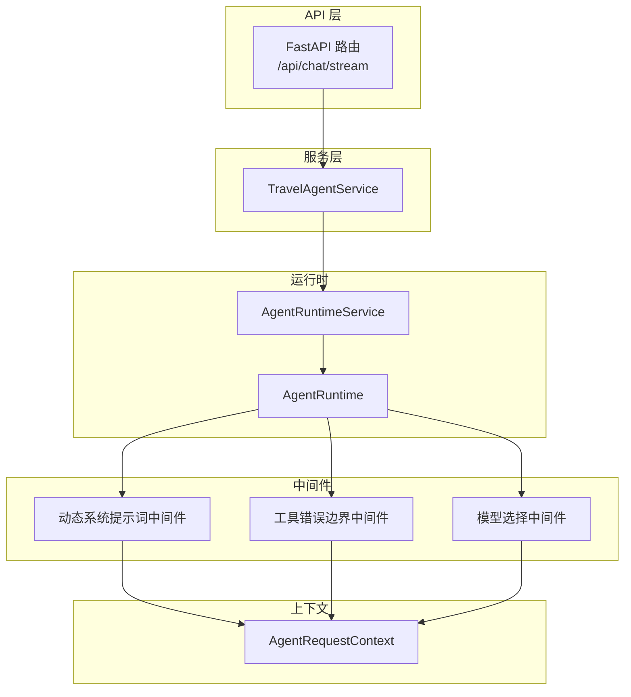
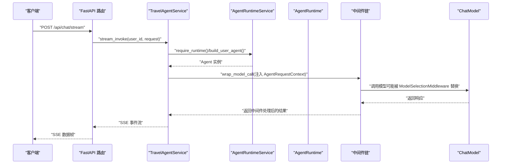
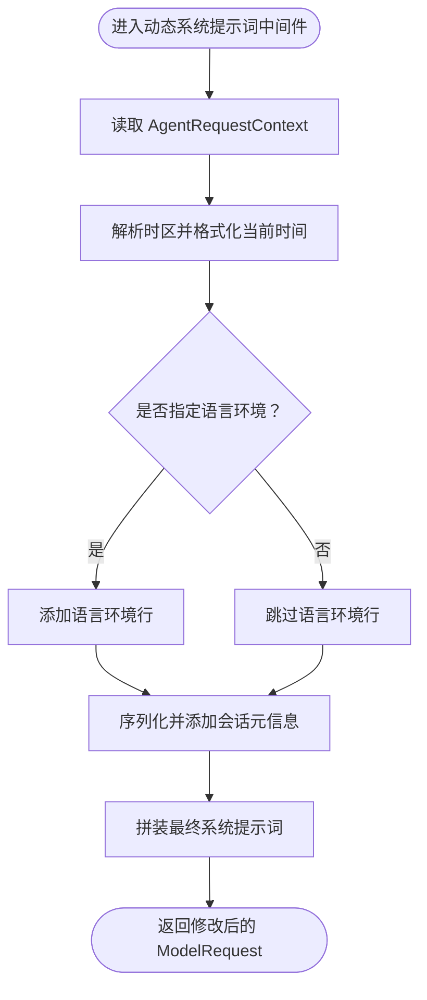
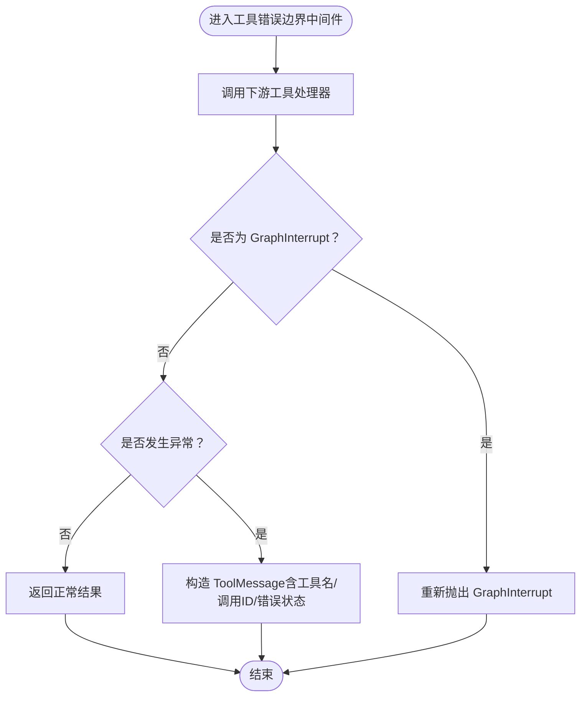
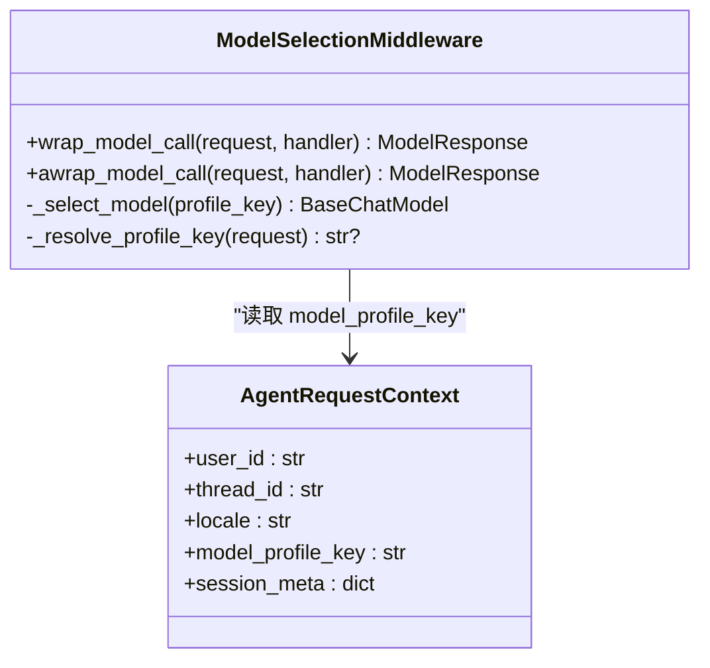
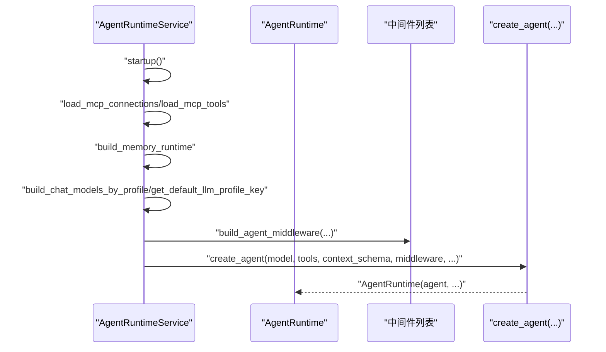
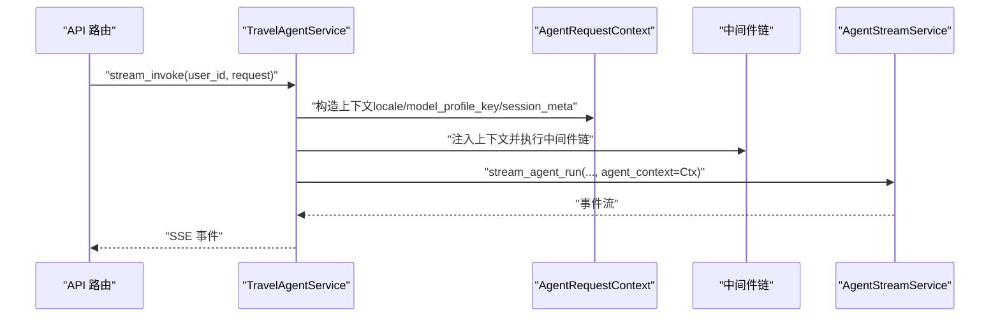
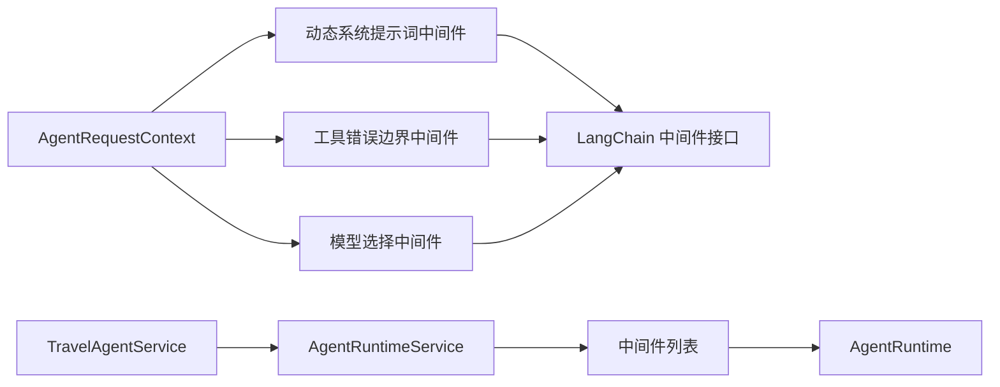

# 中间件与拦截器

<cite>
**本文引用的文件**
- [backend/app/agent/middleware.py](file://backend/app/agent/middleware.py)
- [backend/app/agent/context.py](file://backend/app/agent/context.py)
- [backend/app/agent/runtime.py](file://backend/app/agent/runtime.py)
- [backend/app/agent/service.py](file://backend/app/agent/service.py)
- [backend/app/main.py](file://backend/app/main.py)
- [backend/app/api/chat.py](file://backend/app/api/chat.py)
- [backend/app/observability/langsmith.py](file://backend/app/observability/langsmith.py)
- [backend/tests/test_agent_runtime_features.py](file://backend/tests/test_agent_runtime_features.py)
- [backend/tests/test_agent_service.py](file://backend/tests/test_agent_service.py)
</cite>

## 目录
1. [引言](#引言)
2. [项目结构](#项目结构)
3. [核心组件](#核心组件)
4. [架构总览](#架构总览)
5. [详细组件分析](#详细组件分析)
6. [依赖分析](#依赖分析)
7. [性能考虑](#性能考虑)
8. [故障排查指南](#故障排查指南)
9. [结论](#结论)
10. [附录](#附录)

## 引言
本文件系统性阐述本项目的“Agent 中间件与拦截器”设计与实现，覆盖以下主题：
- Agent 中间件的设计模式与职责边界
- 请求处理流程与响应拦截机制
- 中间件链的执行顺序、上下文传递、异常处理策略
- 自定义中间件开发方法、性能监控与日志记录
- 中间件配置指南、调试技巧与最佳实践
- 如何扩展新的中间件类型与处理逻辑

## 项目结构
围绕 Agent 中间件的关键文件组织如下：
- 上下文定义：AgentRequestContext 提供运行期上下文字段，贯穿中间件与工具链
- 中间件实现：动态系统提示词注入、工具调用错误边界、模型选择中间件
- 运行时装配：AgentRuntimeService 负责创建与挂载中间件、构建 Agent
- 服务层：TravelAgentService 将上下文注入到流式调用中，驱动中间件链
- API 层：/api/chat/stream 将 LangGraph 原生事件以 SSE 形式回传
- 观测性：LangSmith Tracing 包裹关键操作，便于性能与行为追踪

图表来源
- [backend/app/api/chat.py:41-72](file://backend/app/api/chat.py#L41-L72)
- [backend/app/agent/service.py:373-507](file://backend/app/agent/service.py#L373-L507)
- [backend/app/agent/runtime.py:80-116](file://backend/app/agent/runtime.py#L80-L116)
- [backend/app/agent/middleware.py:193-210](file://backend/app/agent/middleware.py#L193-L210)
- [backend/app/agent/context.py:10-22](file://backend/app/agent/context.py#L10-L22)

章节来源
- [backend/app/api/chat.py:1-72](file://backend/app/api/chat.py#L1-L72)
- [backend/app/agent/service.py:1-529](file://backend/app/agent/service.py#L1-L529)
- [backend/app/agent/runtime.py:1-174](file://backend/app/agent/runtime.py#L1-L174)
- [backend/app/agent/middleware.py:1-211](file://backend/app/agent/middleware.py#L1-L211)
- [backend/app/agent/context.py:1-22](file://backend/app/agent/context.py#L1-L22)

## 核心组件
- AgentRequestContext：承载用户标识、线程标识、语言环境、模型档位键、会话元信息等，作为中间件与工具链共享的上下文载体
- 动态系统提示词中间件：按运行时上下文动态拼装系统提示词，确保模型始终具备“当前时间”、“语言环境”、“会话元信息”等实时上下文
- 工具错误边界中间件：捕获工具调用异常，统一转换为 ToolMessage 返回，同时透传 LangGraph 的 GraphInterrupt，保障人类回环中断机制可用
- 模型选择中间件：根据 AgentRequestContext.model_profile_key 选择对应 ChatModel 实例，通过 request.override(model=...) 在中间件链末端生效，避免 bind_tools 后的注入失效
- AgentRuntimeService：负责创建 Agent 并挂载中间件，按需构建带用户级工具的 Agent 实例
- TravelAgentService：将上下文注入到流式调用中，驱动中间件链执行，并在异常时进行回滚与日志记录

章节来源
- [backend/app/agent/context.py:10-22](file://backend/app/agent/context.py#L10-L22)
- [backend/app/agent/middleware.py:66-109](file://backend/app/agent/middleware.py#L66-L109)
- [backend/app/agent/middleware.py:111-131](file://backend/app/agent/middleware.py#L111-L131)
- [backend/app/agent/middleware.py:133-191](file://backend/app/agent/middleware.py#L133-L191)
- [backend/app/agent/runtime.py:61-116](file://backend/app/agent/runtime.py#L61-L116)
- [backend/app/agent/service.py:373-507](file://backend/app/agent/service.py#L373-L507)

## 架构总览
下图展示了从 API 到中间件再到模型调用的完整链路，以及上下文在各环节的传递方式。

图表来源
- [backend/app/api/chat.py:41-72](file://backend/app/api/chat.py#L41-L72)
- [backend/app/agent/service.py:373-507](file://backend/app/agent/service.py#L373-L507)
- [backend/app/agent/runtime.py:117-132](file://backend/app/agent/runtime.py#L117-L132)
- [backend/app/agent/middleware.py:176-190](file://backend/app/agent/middleware.py#L176-L190)

## 详细组件分析

### 动态系统提示词中间件
- 设计要点
  - 使用装饰器将函数包装为中间件，接收 ModelRequest 并可修改 system_prompt
  - 从 AgentRequestContext 中提取时区、语言环境、会话元信息，动态拼装“运行时上下文”
  - 对时区解析提供回退策略，确保在未知时区时仍能输出稳定的当前时间字符串
- 执行顺序
  - 在中间件链中靠前位置执行，确保后续工具与模型调用均能获得最新的系统提示词
- 上下文传递
  - 通过 request.runtime.context 获取 AgentRequestContext，避免硬编码静态提示词
- 异常处理
  - 该中间件本身不捕获异常，专注于提示词拼装；异常由工具错误边界中间件统一处理

图表来源
- [backend/app/agent/middleware.py:66-109](file://backend/app/agent/middleware.py#L66-L109)
- [backend/app/agent/context.py:10-22](file://backend/app/agent/context.py#L10-L22)

章节来源
- [backend/app/agent/middleware.py:66-109](file://backend/app/agent/middleware.py#L66-L109)
- [backend/app/agent/context.py:10-22](file://backend/app/agent/context.py#L10-L22)
- [backend/tests/test_agent_runtime_features.py:83-94](file://backend/tests/test_agent_runtime_features.py#L83-L94)

### 工具错误边界中间件
- 设计要点
  - 使用装饰器包装工具调用处理器，统一捕获异常并转换为 ToolMessage
  - 明确透传 GraphInterrupt，保证人类回环中断机制不被吞掉
  - 为工具调用生成稳定的 tool_call_id，便于追踪与调试
- 执行顺序
  - 在工具调用前执行，作为“拦截器”保护后续工具链
- 异常处理
  - 捕获所有异常并转换为 ToolMessage，避免上游直接暴露内部错误
  - 对 GraphInterrupt 保持原样抛出，确保 LangGraph 的检查点/中断机制正常工作

图表来源
- [backend/app/agent/middleware.py:111-131](file://backend/app/agent/middleware.py#L111-L131)

章节来源
- [backend/app/agent/middleware.py:111-131](file://backend/app/agent/middleware.py#L111-L131)

### 模型选择中间件
- 设计要点
  - 根据 AgentRequestContext.model_profile_key 选择对应 ChatModel 实例
  - 通过 request.override(model=...) 在中间件链末端生效，避免 bind_tools 后注入失效
  - 提供默认档位回退，缺失键时记录警告并使用默认模型
- 执行顺序
  - 通常位于中间件链末尾，确保其他中间件已准备好请求后再替换模型
- 性能与一致性
  - 通过字典映射快速选择模型，开销极低；避免重复绑定带来的副作用

图表来源
- [backend/app/agent/middleware.py:133-191](file://backend/app/agent/middleware.py#L133-L191)
- [backend/app/agent/context.py:10-22](file://backend/app/agent/context.py#L10-L22)

章节来源
- [backend/app/agent/middleware.py:133-191](file://backend/app/agent/middleware.py#L133-L191)
- [backend/app/agent/context.py:10-22](file://backend/app/agent/context.py#L10-L22)
- [backend/tests/test_agent_service.py:456-463](file://backend/tests/test_agent_service.py#L456-L463)

### 中间件装配与运行时
- AgentRuntimeService
  - 初始化本地工具、MCP 工具、内存检查点与 LangGraph store
  - 构建默认 Agent（含全局工具），并在 create_agent 时挂载中间件
  - 提供按用户工具构建 user_agent 的能力，保持中间件一致
- build_agent_middleware
  - 固定包含动态系统提示词与工具错误边界
  - 可选注入 ModelSelectionMiddleware，依据 AgentRequestContext.model_profile_key 切换模型

图表来源
- [backend/app/agent/runtime.py:80-116](file://backend/app/agent/runtime.py#L80-L116)
- [backend/app/agent/middleware.py:193-210](file://backend/app/agent/middleware.py#L193-L210)

章节来源
- [backend/app/agent/runtime.py:61-116](file://backend/app/agent/runtime.py#L61-L116)
- [backend/app/agent/middleware.py:193-210](file://backend/app/agent/middleware.py#L193-L210)

### 服务层与上下文注入
- TravelAgentService
  - 在流式调用前，基于用户与会话信息构造 AgentRequestContext
  - 将上下文注入到中间件链，确保每个中间件均可访问
  - 在异常时记录日志、回滚线程、清理语音任务并返回标准化错误
- API 层
  - /api/chat/stream 以 SSE 形式回传 LangGraph 原生事件，便于前端消费

图表来源
- [backend/app/agent/service.py:373-507](file://backend/app/agent/service.py#L373-L507)
- [backend/app/api/chat.py:41-72](file://backend/app/api/chat.py#L41-L72)

章节来源
- [backend/app/agent/service.py:373-507](file://backend/app/agent/service.py#L373-L507)
- [backend/app/api/chat.py:41-72](file://backend/app/api/chat.py#L41-L72)

## 依赖分析
- 组件耦合
  - 中间件依赖 AgentRequestContext 作为上下文载体
  - 模型选择中间件依赖运行时提供的 chat_models_by_profile 字典
  - 服务层通过 AgentRuntimeService 获取 Agent 实例并注入上下文
- 外部依赖
  - LangChain Agent 中间件接口（AgentMiddleware、ModelRequest、ModelResponse、dynamic_prompt、wrap_tool_call）
  - LangGraph GraphInterrupt 用于人类回环中断
  - FastAPI 路由与 SSE 流式响应

图表来源
- [backend/app/agent/context.py:10-22](file://backend/app/agent/context.py#L10-L22)
- [backend/app/agent/middleware.py:133-210](file://backend/app/agent/middleware.py#L133-L210)
- [backend/app/agent/runtime.py:80-116](file://backend/app/agent/runtime.py#L80-L116)
- [backend/app/agent/service.py:373-507](file://backend/app/agent/service.py#L373-L507)

章节来源
- [backend/app/agent/context.py:10-22](file://backend/app/agent/context.py#L10-L22)
- [backend/app/agent/middleware.py:133-210](file://backend/app/agent/middleware.py#L133-L210)
- [backend/app/agent/runtime.py:80-116](file://backend/app/agent/runtime.py#L80-L116)
- [backend/app/agent/service.py:373-507](file://backend/app/agent/service.py#L373-L507)

## 性能考虑
- 中间件链顺序优化
  - 动态系统提示词中间件靠前执行，避免后续中间件重复计算
  - 模型选择中间件靠后执行，确保 override 生效且避免副作用
- 模型切换成本
  - 模型选择通过字典映射，O(1) 查找；建议在运行时集中构建模型字典，减少重复初始化
- 异常路径短路
  - 工具错误边界中间件快速失败并返回标准化消息，降低异常传播成本
- 观测性开销
  - LangSmith Tracing 可通过环境变量开关；生产环境建议按需开启，避免额外 IO

## 故障排查指南
- 中间件未生效
  - 检查 Agent 是否正确挂载中间件列表；确认 build_agent_middleware 返回值包含所需中间件
  - 章节来源
    - [backend/tests/test_agent_service.py:456-463](file://backend/tests/test_agent_service.py#L456-L463)
- 时区显示异常
  - 确认 AgentRequestContext.session_meta 中的 timezone 字段是否正确设置
  - 章节来源
    - [backend/app/agent/middleware.py:32-55](file://backend/app/agent/middleware.py#L32-L55)
- 工具调用报错
  - 检查工具错误边界中间件是否捕获异常并返回 ToolMessage
  - 若出现 GraphInterrupt，确认未被中间件误捕获
  - 章节来源
    - [backend/app/agent/middleware.py:111-131](file://backend/app/agent/middleware.py#L111-L131)
- 模型未按预期切换
  - 确认 AgentRequestContext.model_profile_key 与 chat_models_by_profile 的键一致
  - 章节来源
    - [backend/app/agent/middleware.py:172-174](file://backend/app/agent/middleware.py#L172-L174)
- 流式响应中断
  - 检查服务层异常分支是否正确记录日志并回滚线程
  - 章节来源
    - [backend/app/agent/service.py:444-482](file://backend/app/agent/service.py#L444-L482)

## 结论
本项目的中间件体系以“上下文驱动 + 明确职责边界”为核心设计原则：动态系统提示词中间件负责提供实时上下文，工具错误边界中间件负责统一异常处理，模型选择中间件负责按档位切换模型。通过 AgentRuntimeService 统一装配与 TravelAgentService 注入上下文，形成清晰、可扩展、可观测的中间件链路。

## 附录

### 中间件链执行顺序与职责
- 动态系统提示词中间件：注入“当前时间/语言环境/会话元信息”
- 工具错误边界中间件：捕获异常并转换为 ToolMessage，透传 GraphInterrupt
- 模型选择中间件：按 AgentRequestContext.model_profile_key 选择 ChatModel 实例

章节来源
- [backend/app/agent/middleware.py:193-210](file://backend/app/agent/middleware.py#L193-L210)

### 自定义中间件开发步骤
- 设计职责
  - 明确中间件在链路中的位置（前置/后置/替换）
  - 决定是否需要读写 AgentRequestContext 或 ModelRequest/ModelResponse
- 实现模式
  - 使用 LangChain 中间件接口（如 AgentMiddleware、dynamic_prompt、wrap_tool_call）
  - 通过 request.runtime.context 访问上下文
- 测试与验证
  - 编写单元测试，验证中间件在链路中的行为与副作用
  - 章节来源
    - [backend/tests/test_agent_runtime_features.py:83-94](file://backend/tests/test_agent_runtime_features.py#L83-L94)

### 性能监控与日志记录
- 观测性
  - 使用 LangSmith Tracing 包裹关键操作，采集标签与元数据
  - 章节来源
    - [backend/app/observability/langsmith.py](file://backend/app/observability/langsmith.py)
- 日志
  - 在服务层异常分支记录关键上下文（用户、线程、模型档位、检查点 ID）
  - 章节来源
    - [backend/app/agent/service.py:250-268](file://backend/app/agent/service.py#L250-L268)

### 中间件配置指南
- 启动与生命周期
  - 应用启动时初始化 AgentRuntimeService；关闭时释放资源
  - 章节来源
    - [backend/app/main.py:23-28](file://backend/app/main.py#L23-L28)
- API 流式接口
  - /api/chat/stream 以 SSE 输出 LangGraph 原生事件
  - 章节来源
    - [backend/app/api/chat.py:41-72](file://backend/app/api/chat.py#L41-L72)

### 调试技巧
- 断点与断言
  - 在 travel_dynamic_prompt 中断言 system_prompt 包含“运行时上下文”片段
  - 章节来源
    - [backend/tests/test_agent_runtime_features.py:83-94](file://backend/tests/test_agent_runtime_features.py#L83-L94)
- 中间件数量校验
  - 确认中间件列表长度与期望一致（固定两项 + 可选模型选择）
  - 章节来源
    - [backend/tests/test_agent_service.py:456-463](file://backend/tests/test_agent_service.py#L456-L463)