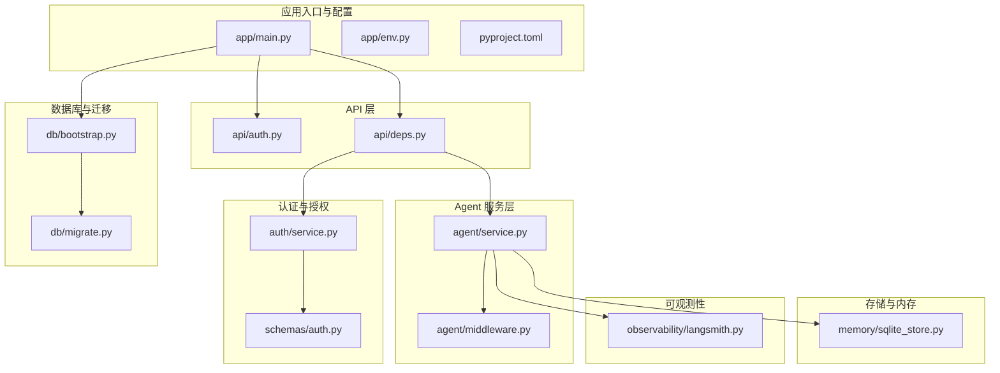
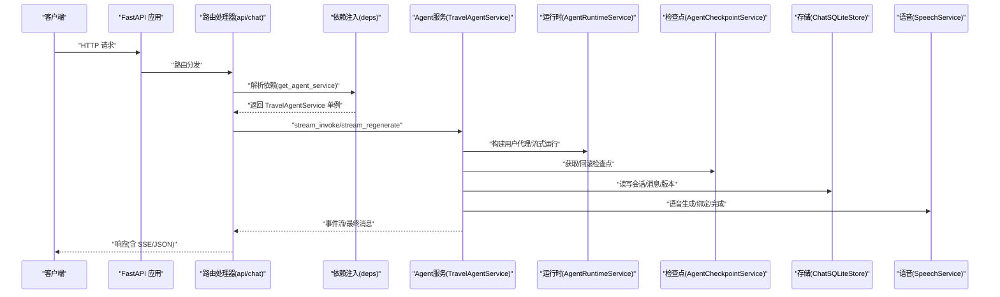
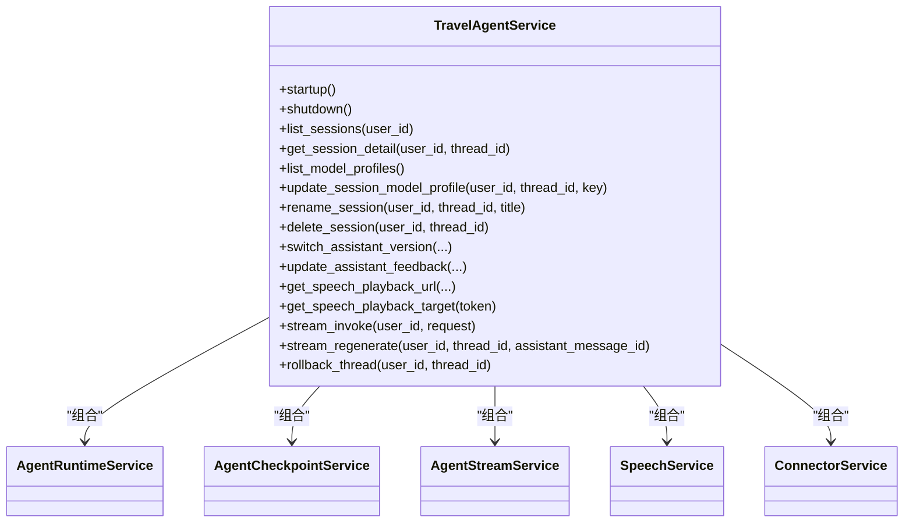
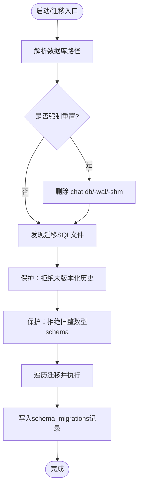
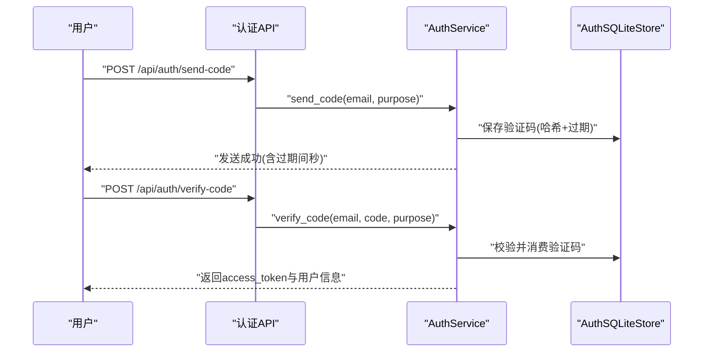
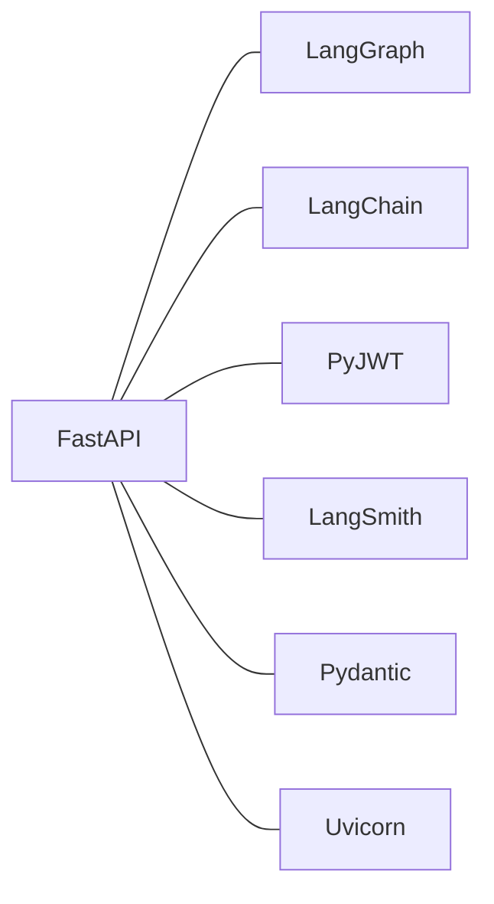

# 后端服务

<cite>
**本文引用的文件**
- [backend/app/main.py](file://backend/app/main.py)
- [backend/pyproject.toml](file://backend/pyproject.toml)
- [backend/app/env.py](file://backend/app/env.py)
- [backend/app/agent/service.py](file://backend/app/agent/service.py)
- [backend/app/api/auth.py](file://backend/app/api/auth.py)
- [backend/app/db/bootstrap.py](file://backend/app/db/bootstrap.py)
- [backend/app/db/migrate.py](file://backend/app/db/migrate.py)
- [backend/app/auth/service.py](file://backend/app/auth/service.py)
- [backend/app/api/deps.py](file://backend/app/api/deps.py)
- [backend/app/schemas/auth.py](file://backend/app/schemas/auth.py)
- [backend/app/agent/middleware.py](file://backend/app/agent/middleware.py)
- [backend/app/memory/sqlite_store.py](file://backend/app/memory/sqlite_store.py)
- [backend/app/observability/langsmith.py](file://backend/app/observability/langsmith.py)
</cite>

## 目录
1. [简介](#简介)
2. [项目结构](#项目结构)
3. [核心组件](#核心组件)
4. [架构总览](#架构总览)
5. [详细组件分析](#详细组件分析)
6. [依赖关系分析](#依赖关系分析)
7. [性能考量](#性能考量)
8. [故障排查指南](#故障排查指南)
9. [结论](#结论)
10. [附录](#附录)

## 简介
本文件面向基于 FastAPI 的 Python 后端服务，系统性梳理应用入口与生命周期管理、Agent 服务层设计模式、API 路由层实现方式、数据库设计与迁移策略、认证授权机制、中间件与拦截器、错误处理与日志、监控集成，以及扩展新 API 端点与服务功能的最佳实践。内容兼顾技术深度与可读性，帮助开发者快速理解并高效迭代。

## 项目结构
后端采用分层组织：入口与生命周期管理位于应用根目录，API 层负责对外接口，Agent 服务层封装智能体运行时与会话管理，数据库层负责 SQLite 初始化与迁移，认证模块提供邮箱验证码登录与 JWT 授权，中间件与拦截器贯穿 LLM 请求链路，内存与存储模块支撑聊天会话持久化，可观测性模块集成 LangSmith 调用追踪。

图表来源
- [backend/app/main.py:31-54](file://backend/app/main.py#L31-L54)
- [backend/app/api/deps.py:18-60](file://backend/app/api/deps.py#L18-L60)
- [backend/app/db/bootstrap.py:213-226](file://backend/app/db/bootstrap.py#L213-L226)

章节来源
- [backend/app/main.py:1-54](file://backend/app/main.py#L1-L54)
- [backend/app/env.py:10-18](file://backend/app/env.py#L10-L18)
- [backend/pyproject.toml:1-42](file://backend/pyproject.toml#L1-L42)

## 核心组件
- 应用入口与生命周期：通过异步生命周期钩子在启动时初始化 Agent，在关闭时释放资源；注册健康检查、认证、聊天、连接器、会话、语音等路由。
- 依赖注入与单例：通过缓存函数提供全局单例的 Agent、认证、连接器服务，确保运行时与 MCP 连接状态共享。
- Agent 服务门面：封装运行时、检查点、流式处理、语音合成、连接器工具、LLM 档位选择等能力，统一对外提供流式聊天、重新生成、会话管理等接口。
- 数据库与迁移：自动发现迁移脚本、执行版本控制、约束历史未版本化与旧 schema，支持重置与增量迁移。
- 认证授权：邮箱验证码登录/注册，JWT 签发与校验，Bearer Token 中间件解析。
- 中间件与拦截器：动态系统提示词注入、工具调用异常边界捕获、模型档位选择中间件。
- 存储与内存：SQLite 聊天会话与消息持久化，支持版本化、反馈、语音资产关联。
- 观测性：LangSmith 调试与追踪开关，按环境变量启用并注入标签与元数据。

章节来源
- [backend/app/main.py:23-54](file://backend/app/main.py#L23-L54)
- [backend/app/api/deps.py:18-60](file://backend/app/api/deps.py#L18-L60)
- [backend/app/agent/service.py:97-529](file://backend/app/agent/service.py#L97-L529)
- [backend/app/db/bootstrap.py:181-226](file://backend/app/db/bootstrap.py#L181-L226)
- [backend/app/auth/service.py:49-312](file://backend/app/auth/service.py#L49-L312)
- [backend/app/agent/middleware.py:94-211](file://backend/app/agent/middleware.py#L94-L211)
- [backend/app/memory/sqlite_store.py:123-800](file://backend/app/memory/sqlite_store.py#L123-L800)
- [backend/app/observability/langsmith.py:24-57](file://backend/app/observability/langsmith.py#L24-L57)

## 架构总览
下图展示了从 HTTP 请求进入，经依赖注入与认证，到 Agent 服务层与数据库/存储交互，再到 LLM 提供商与外部工具的完整链路。

图表来源
- [backend/app/api/deps.py:18-32](file://backend/app/api/deps.py#L18-L32)
- [backend/app/agent/service.py:373-507](file://backend/app/agent/service.py#L373-L507)
- [backend/app/memory/sqlite_store.py:123-409](file://backend/app/memory/sqlite_store.py#L123-L409)

## 详细组件分析

### 应用入口与生命周期管理
- 异步生命周期：在启动阶段调用 Agent 服务 startup，在关闭阶段调用 shutdown，确保运行时与资源有序释放。
- CORS 中间件：从环境变量读取允许来源，支持凭据、通配方法与头。
- 路由注册：集中注册健康检查、认证、聊天、连接器、会话、语音等路由。
- 环境加载：加载后端 .env 文件，避免对密钥值进行 $ 变量展开，保证敏感值安全。

章节来源
- [backend/app/main.py:23-54](file://backend/app/main.py#L23-L54)
- [backend/app/env.py:10-18](file://backend/app/env.py#L10-L18)

### Agent 服务层设计模式
- 门面模式：统一暴露会话管理、模型档位、版本切换、重新生成、语音播放等能力。
- 组合与职责分离：运行时服务、检查点服务、流式服务、语音服务、连接器服务协同工作。
- 流式处理：通过状态对象累积片段、工具追踪、引用注解解析，最终完成消息并写入存储。
- 错误处理：捕获非取消异常，记录流水线失败日志，回滚线程，丢弃版本，抛出上层。

图表来源
- [backend/app/agent/service.py:97-115](file://backend/app/agent/service.py#L97-L115)

章节来源
- [backend/app/agent/service.py:97-529](file://backend/app/agent/service.py#L97-L529)

### API 路由层实现方式
- 认证路由：发送验证码、校验验证码并签发令牌、获取当前用户信息。
- 依赖注入：通过 get_auth_service/get_current_user 获取认证服务与当前用户，实现 Bearer Token 授权。
- 路由组织：每个功能域独立模块，统一前缀与标签，便于扩展与维护。

章节来源
- [backend/app/api/auth.py:14-36](file://backend/app/api/auth.py#L14-L36)
- [backend/app/api/deps.py:52-60](file://backend/app/api/deps.py#L52-L60)

### 数据库设计、迁移策略与 ORM 使用
- 设计要点：会话表、消息表、版本表、语音资产表、schema_migrations 版本表，外键约束开启，支持多版本 assistant 输出与语音资产关联。
- 迁移策略：自动扫描 migrations 目录下的 SQL 文件，按版本顺序执行；禁止未版本化历史与旧整数型 schema；支持重置与增量迁移。
- ORM 使用：未使用 ORM，直接使用 sqlite3 原生连接与事务管理，配合 Pydantic 类型适配器进行 JSON 序列化/反序列化。

图表来源
- [backend/app/db/bootstrap.py:181-226](file://backend/app/db/bootstrap.py#L181-L226)

章节来源
- [backend/app/db/bootstrap.py:181-226](file://backend/app/db/bootstrap.py#L181-L226)
- [backend/app/db/migrate.py:10-22](file://backend/app/db/migrate.py#L10-L22)
- [backend/app/memory/sqlite_store.py:123-409](file://backend/app/memory/sqlite_store.py#L123-L409)

### 认证授权机制
- 邮箱验证码：规范化邮箱、生成 6 位随机码、哈希保存、SMTP 发送（支持 SSL/TLS/starttls），过期与消费控制。
- JWT 登录态：签发带过期时间的访问令牌，解析并校验令牌，获取当前用户。
- Bearer 中间件：统一解析 Authorization 头，缺失或非 Bearer 返回 401。

图表来源
- [backend/app/api/auth.py:14-30](file://backend/app/api/auth.py#L14-L30)
- [backend/app/auth/service.py:251-297](file://backend/app/auth/service.py#L251-L297)
- [backend/app/schemas/auth.py:13-51](file://backend/app/schemas/auth.py#L13-L51)

章节来源
- [backend/app/auth/service.py:49-312](file://backend/app/auth/service.py#L49-L312)
- [backend/app/schemas/auth.py:13-51](file://backend/app/schemas/auth.py#L13-L51)
- [backend/app/api/auth.py:14-36](file://backend/app/api/auth.py#L14-L36)
- [backend/app/api/deps.py:52-60](file://backend/app/api/deps.py#L52-L60)

### 中间件与拦截器
- 动态系统提示词：按请求上下文注入“当前时间”、“语言环境”、“会话元信息”，避免模型猜测。
- 工具异常边界：统一将工具异常包装为 ToolMessage，保留 GraphInterrupt 透传，保障人类中断机制。
- 模型档位选择：根据 AgentRequestContext.model_profile_key 在请求末步覆盖模型实例，确保绑定工具后仍生效。

章节来源
- [backend/app/agent/middleware.py:94-211](file://backend/app/agent/middleware.py#L94-L211)

### 错误处理、日志记录与监控集成
- 错误处理：Agent 流式过程中捕获异常，区分取消与非取消，记录流水线失败日志，回滚线程，丢弃版本，构造“已停止/失败”消息并返回。
- 日志记录：使用标准 logging，异常场景记录关键上下文（用户、线程、模型档位、检查点）。
- 监控集成：LangSmith 追踪开关通过环境变量控制，注入操作名、用户、线程、语言、模型档位等元数据与标签。

章节来源
- [backend/app/agent/service.py:444-482](file://backend/app/agent/service.py#L444-L482)
- [backend/app/agent/service.py:250-267](file://backend/app/agent/service.py#L250-L267)
- [backend/app/observability/langsmith.py:24-57](file://backend/app/observability/langsmith.py#L24-L57)

### 扩展新 API 端点与服务功能
- 新增 API 端点步骤
  - 在 api 目录新增模块（如 app/api/my_feature.py），定义路由与处理器。
  - 在 app/main.py 中 include_router 注册新路由。
  - 如需依赖注入，参考 app/api/deps.py 定义 get_my_service 并使用 Depends。
  - 如需认证，使用 get_current_user 依赖。
- 新增服务功能步骤
  - 在 app/agent/service.py 或新增模块中实现业务逻辑，复用现有存储与运行时。
  - 如需数据库变更，新增 SQL 迁移文件于 migrations 目录，遵循版本命名规范。
  - 如需接入外部工具，参考 ConnectorService 与 user_connector_tools 的使用方式。
- 最佳实践
  - 保持单一职责，服务层只做编排与协调。
  - 对外接口使用 Pydantic 模型进行输入输出约束。
  - 严格区分取消与异常，避免吞掉 GraphInterrupt。
  - 通过 LangSmith 环境变量控制追踪，便于问题定位。

章节来源
- [backend/app/main.py:46-51](file://backend/app/main.py#L46-L51)
- [backend/app/api/deps.py:18-32](file://backend/app/api/deps.py#L18-L32)
- [backend/app/db/bootstrap.py:48-65](file://backend/app/db/bootstrap.py#L48-L65)

## 依赖关系分析
- 运行时依赖：FastAPI、UVicorn、Pydantic、JWT、LangChain/LangGraph、LangSmith、SQLite 检查点等。
- 开发依赖：pytest、pytest-asyncio。
- 包结构：仅包含 app* 子树，测试位于 tests 目录。

图表来源
- [backend/pyproject.toml:6-24](file://backend/pyproject.toml#L6-L24)

章节来源
- [backend/pyproject.toml:1-42](file://backend/pyproject.toml#L1-L42)

## 性能考量
- 连接池与事务：sqlite3 原生连接按需创建与关闭，事务在上下文管理器中提交/回滚，避免长连接占用。
- 缓存与单例：依赖注入使用 LRU 缓存，确保同一进程内共享 Agent/认证/连接器实例，降低初始化成本。
- 流式处理：事件驱动的流式输出，边生成边写入存储，减少一次性内存峰值。
- 迁移效率：按版本增量执行，避免全量重建；重置仅在显式开关或环境变量触发。

## 故障排查指南
- 数据库迁移失败
  - 现象：启动时报未版本化历史或旧 schema。
  - 处理：设置重置开关或删除旧数据库后重启；确认 migrations 目录文件命名与版本唯一性。
- 邮箱发送失败
  - 现象：SMTP 域名解析、认证失败、连接断开、超时。
  - 处理：检查 SMTP_HOST/PORT/USERNAME/PASSWORD/USE_TLS/SSL 端口配置；核对网络与防火墙策略。
- 认证失败
  - 现象：令牌无效、用户不存在、验证码错误/过期/已消费。
  - 处理：确认 JWT_SECRET 配置；检查验证码有效期与消费状态。
- Agent 流式异常
  - 现象：非取消异常导致消息失败、语音未完成。
  - 处理：查看流水线失败日志；确认模型档位与工具可用性；检查中断与取消逻辑。

章节来源
- [backend/app/db/bootstrap.py:112-165](file://backend/app/db/bootstrap.py#L112-L165)
- [backend/app/auth/service.py:102-121](file://backend/app/auth/service.py#L102-L121)
- [backend/app/auth/service.py:271-297](file://backend/app/auth/service.py#L271-L297)
- [backend/app/agent/service.py:444-482](file://backend/app/agent/service.py#L444-L482)

## 结论
本后端以 FastAPI 为基础，结合 LangGraph 与 MCP 实现智能体编排，采用 SQLite 原生存储与受控迁移策略，提供完整的认证授权、中间件拦截、可观测性与错误处理机制。通过依赖注入与门面模式，实现了清晰的分层与高内聚低耦合。建议在扩展新功能时遵循本文最佳实践，确保一致性与可维护性。

## 附录
- 命令行迁移：通过迁移入口脚本执行，支持 --reset 参数删除数据库后执行迁移。
- 环境变量
  - CORS_ALLOW_ORIGINS：CORS 允许来源列表。
  - JWT_EXPIRE_DAYS：JWT 过期天数。
  - AUTH_CODE_EXPIRE_MINUTES：验证码过期间分钟数。
  - SMTP_*：SMTP 发送配置。
  - LANGSMITH_TRACING/LANGCHAIN_TRACING_V2：LangSmith 追踪开关。
  - DEV_RESET_CHAT_DB：开发环境重置聊天数据库。
  - CHAT_SQLITE_PATH：聊天数据库路径。

章节来源
- [backend/app/db/migrate.py:10-18](file://backend/app/db/migrate.py#L10-L18)
- [backend/app/auth/service.py:59-82](file://backend/app/auth/service.py#L59-L82)
- [backend/app/observability/langsmith.py:14-22](file://backend/app/observability/langsmith.py#L14-L22)
- [backend/app/db/bootstrap.py:43-45](file://backend/app/db/bootstrap.py#L43-L45)
- [backend/app/db/bootstrap.py:38-41](file://backend/app/db/bootstrap.py#L38-L41)