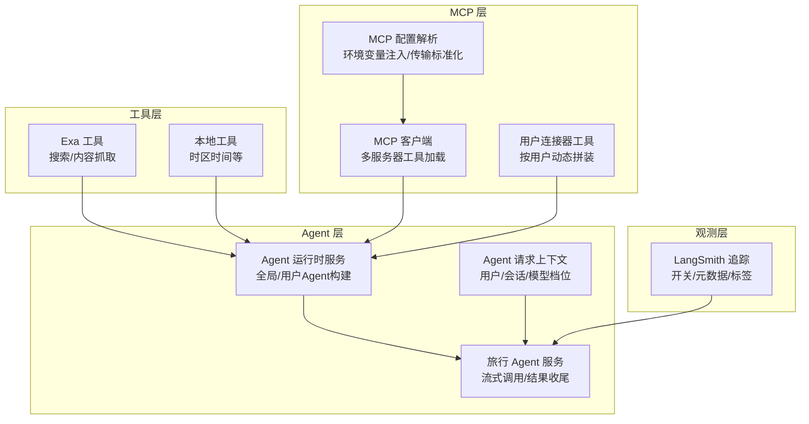
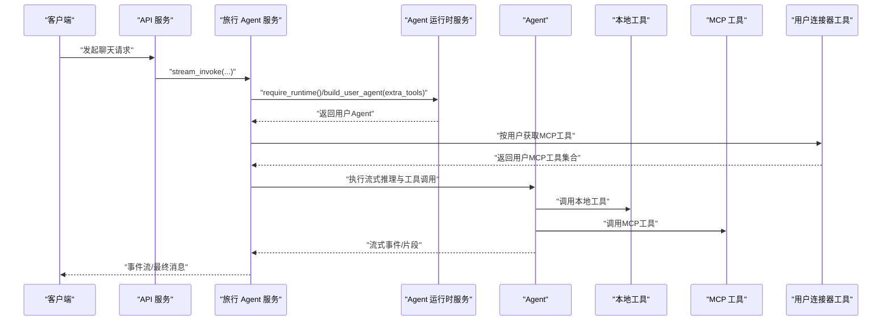
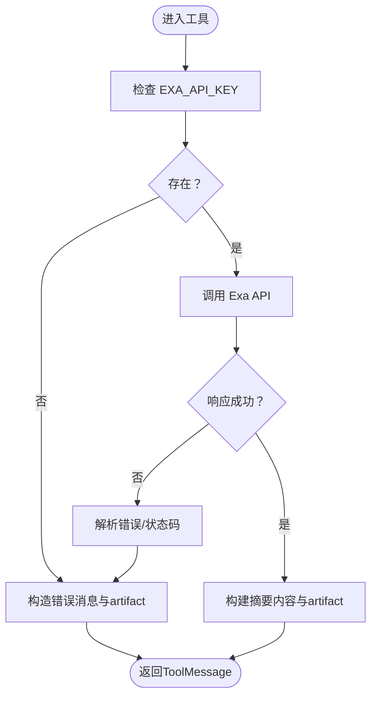
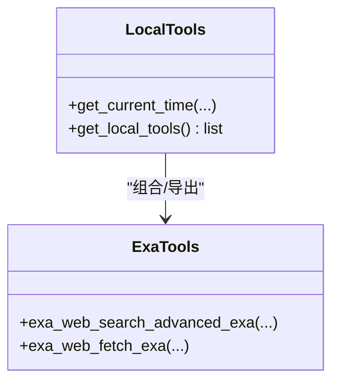
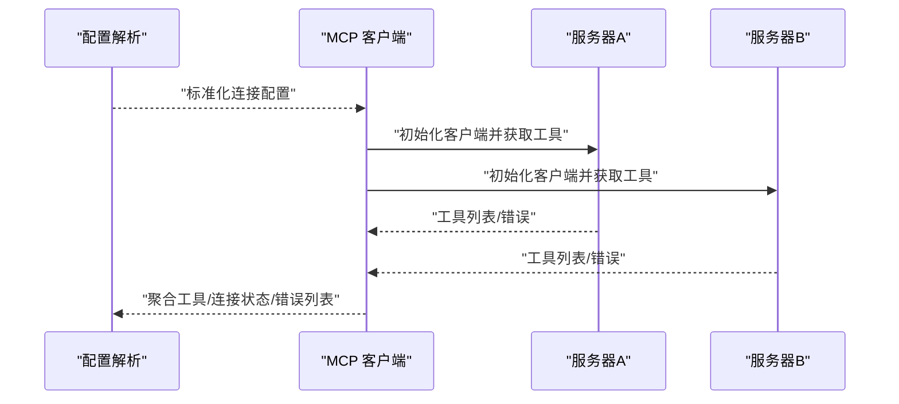
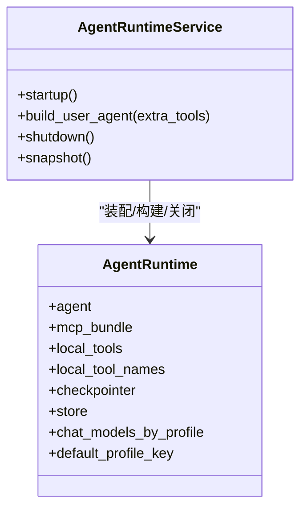
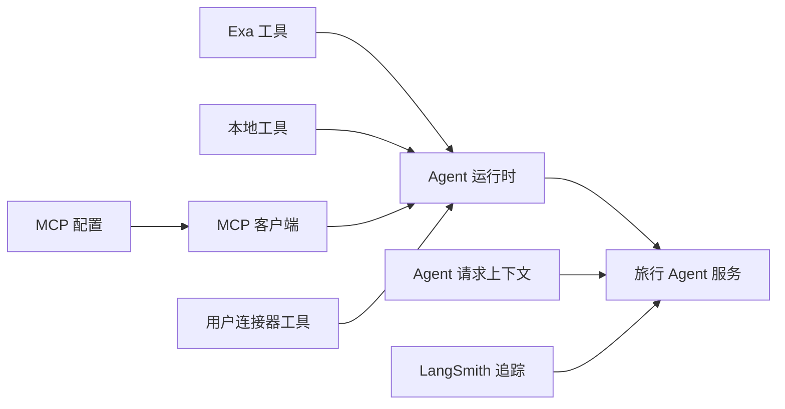

# 工具集成

<cite>
**本文引用的文件**
- [exa_tools.py](file://backend/app/tool/exa_tools.py)
- [local_tools.py](file://backend/app/tool/local_tools.py)
- [client.py](file://backend/app/mcp/client.py)
- [config.py](file://backend/app/mcp/config.py)
- [runtime.py](file://backend/app/agent/runtime.py)
- [service.py](file://backend/app/agent/service.py)
- [context.py](file://backend/app/agent/context.py)
- [runtime.py（连接器）](file://backend/app/connectors/runtime.py)
- [langsmith.py](file://backend/app/observability/langsmith.py)
- [mcp.servers.example.json](file://backend/config/mcp.servers.example.json)
- [connectors.example.json](file://backend/config/connectors.example.json)
- [test_exa_tools.py](file://backend/tests/test_exa_tools.py)
- [test_mcp_client.py](file://backend/tests/test_mcp_client.py)
- [test_local_tools.py](file://backend/tests/test_local_tools.py)
- [main.py](file://backend/app/main.py)
</cite>

## 目录
1. [引言](#引言)
2. [项目结构](#项目结构)
3. [核心组件](#核心组件)
4. [架构总览](#架构总览)
5. [详细组件分析](#详细组件分析)
6. [依赖分析](#依赖分析)
7. [性能考虑](#性能考虑)
8. [故障排查指南](#故障排查指南)
9. [结论](#结论)
10. [附录](#附录)

## 引言
本文件系统性阐述工具集成系统的架构与实现，覆盖本地工具与MCP工具的统一注册与调用编排、结果处理机制、Exa API工具的实现细节、MCP客户端配置与工具发现流程、参数验证与错误处理策略、性能监控与可观测性、以及扩展新工具类型的实践指南。目标是帮助开发者快速理解并安全地扩展工具生态。

## 项目结构
后端采用分层与功能域结合的组织方式：
- 工具层：本地工具与第三方API工具（如Exa）
- MCP层：MCP客户端与配置解析
- Agent层：运行时装配、生命周期管理、用户工具上下文
- 观测层：LangSmith链路追踪
- 配置层：示例配置文件与环境变量注入
- 测试层：针对工具行为与MCP加载的单元测试

图表来源
- [exa_tools.py:1-216](file://backend/app/tool/exa_tools.py#L1-L216)
- [local_tools.py:1-56](file://backend/app/tool/local_tools.py#L1-L56)
- [config.py:1-91](file://backend/app/mcp/config.py#L1-L91)
- [client.py:1-69](file://backend/app/mcp/client.py#L1-L69)
- [runtime.py:1-174](file://backend/app/agent/runtime.py#L1-L174)
- [service.py:1-529](file://backend/app/agent/service.py#L1-L529)
- [context.py:1-22](file://backend/app/agent/context.py#L1-L22)
- [runtime.py（连接器）:1-88](file://backend/app/connectors/runtime.py#L1-L88)
- [langsmith.py:1-57](file://backend/app/observability/langsmith.py#L1-L57)

章节来源
- [main.py:1-54](file://backend/app/main.py#L1-L54)
- [runtime.py:1-174](file://backend/app/agent/runtime.py#L1-L174)
- [service.py:1-529](file://backend/app/agent/service.py#L1-L529)

## 核心组件
- Exa 工具：提供高级搜索与内容抓取能力，封装HTTP请求、错误结构化与结果摘要。
- 本地工具：包含时区时间工具与Exa工具，统一注册到Agent。
- MCP 配置：支持 http/streamable_http/sse 与 stdio 传输，支持环境变量占位符替换与字段标准化。
- MCP 客户端：按配置批量初始化客户端，聚合工具并记录连接状态与错误。
- Agent 运行时：全局共享的Agent与工具集，按用户动态拼装用户级MCP工具。
- 观测与追踪：LangSmith开关控制与上下文注入，便于问题定位与性能分析。

章节来源
- [exa_tools.py:108-216](file://backend/app/tool/exa_tools.py#L108-L216)
- [local_tools.py:16-56](file://backend/app/tool/local_tools.py#L16-L56)
- [config.py:63-91](file://backend/app/mcp/config.py#L63-L91)
- [client.py:32-69](file://backend/app/mcp/client.py#L32-L69)
- [runtime.py:61-174](file://backend/app/agent/runtime.py#L61-L174)
- [langsmith.py:19-57](file://backend/app/observability/langsmith.py#L19-L57)

## 架构总览
系统以Agent为核心，统一调度本地工具与MCP工具。启动时加载本地工具与MCP工具，运行时根据用户上下文动态拼装用户级MCP工具，形成最终工具集。所有工具调用均在LangGraph Agent中执行，支持流式输出与结果收尾。

图表来源
- [service.py:373-507](file://backend/app/agent/service.py#L373-L507)
- [runtime.py:117-132](file://backend/app/agent/runtime.py#L117-L132)
- [runtime.py（连接器）:50-88](file://backend/app/connectors/runtime.py#L50-L88)

## 详细组件分析

### Exa 工具实现
- 功能：高级搜索与内容抓取，返回结构化结果与摘要。
- 参数验证：搜索结果数量范围约束；URL列表去噪与校验。
- 错误处理：统一捕获HTTP状态码与异常，构造结构化错误载体artifact。
- 结果处理：构建简洁摘要，保留原始artifact以便后续分析。

图表来源
- [exa_tools.py:27-78](file://backend/app/tool/exa_tools.py#L27-L78)
- [exa_tools.py:108-144](file://backend/app/tool/exa_tools.py#L108-L144)
- [exa_tools.py:146-187](file://backend/app/tool/exa_tools.py#L146-L187)

章节来源
- [exa_tools.py:18-78](file://backend/app/tool/exa_tools.py#L18-L78)
- [exa_tools.py:108-216](file://backend/app/tool/exa_tools.py#L108-L216)
- [test_exa_tools.py:12-223](file://backend/tests/test_exa_tools.py#L12-L223)

### 本地工具与注册
- 组成：时区时间工具、Exa搜索工具、Exa内容抓取工具。
- 注册：通过统一工厂函数返回工具列表，供Agent运行时装配。

图表来源
- [local_tools.py:16-56](file://backend/app/tool/local_tools.py#L16-L56)
- [exa_tools.py:190-216](file://backend/app/tool/exa_tools.py#L190-L216)

章节来源
- [local_tools.py:16-56](file://backend/app/tool/local_tools.py#L16-L56)
- [test_local_tools.py:6-23](file://backend/tests/test_local_tools.py#L6-L23)

### MCP 客户端与配置
- 配置解析：支持 http/streamable_http/sse 与 stdio 传输；环境变量占位符替换；字段标准化。
- 工具加载：逐服务器初始化客户端，聚合工具并记录连接状态与错误；单个服务器失败不影响其他服务器。
- 用户工具：按用户活跃连接动态拼装，自动关闭连接。

图表来源
- [config.py:63-91](file://backend/app/mcp/config.py#L63-L91)
- [client.py:32-69](file://backend/app/mcp/client.py#L32-L69)
- [runtime.py（连接器）:50-88](file://backend/app/connectors/runtime.py#L50-L88)

章节来源
- [config.py:16-91](file://backend/app/mcp/config.py#L16-L91)
- [client.py:14-69](file://backend/app/mcp/client.py#L14-L69)
- [runtime.py（连接器）:18-88](file://backend/app/connectors/runtime.py#L18-L88)
- [test_mcp_client.py:10-35](file://backend/tests/test_mcp_client.py#L10-L35)

### Agent 运行时与工具编排
- 全局运行时：启动时装配本地工具与MCP工具，创建默认Agent。
- 用户Agent：按需合并用户级MCP工具，形成最终工具集。
- 生命周期：优雅关闭MCP客户端与SQLite检查点连接。
- 快照：提供运行时状态快照，便于健康检查。

图表来源
- [runtime.py:31-174](file://backend/app/agent/runtime.py#L31-L174)

章节来源
- [runtime.py:61-174](file://backend/app/agent/runtime.py#L61-L174)
- [service.py:97-529](file://backend/app/agent/service.py#L97-L529)

### 结果处理与流式输出
- 流式事件：服务层在Agent运行过程中持续产出事件，前端可实时渲染。
- 最终化：构建最终响应，补全UI部件与引用注解，持久化消息与语音资产。
- 失败处理：异常时记录日志、回滚线程、清理语音生成任务并返回稳定状态。

章节来源
- [service.py:373-507](file://backend/app/agent/service.py#L373-L507)
- [service.py:48-95](file://backend/app/agent/service.py#L48-L95)

### 观测与性能监控
- LangSmith追踪：通过环境变量开关，注入操作、用户、会话等元数据与标签。
- 追踪上下文：在关键链路包裹追踪上下文，便于端到端分析。

章节来源
- [langsmith.py:19-57](file://backend/app/observability/langsmith.py#L19-L57)
- [service.py:414-421](file://backend/app/agent/service.py#L414-L421)

## 依赖分析
- 组件耦合：工具层与MCP层通过Agent运行时解耦；MCP层与配置层通过适配器解耦；服务层通过运行时服务与连接器运行时解耦。
- 外部依赖：HTTP客户端、LangChain工具框架、LangSmith追踪、LangChain MCP适配器。
- 循环依赖：未见直接循环依赖；通过接口与工厂模式降低耦合。

图表来源
- [exa_tools.py:1-216](file://backend/app/tool/exa_tools.py#L1-L216)
- [local_tools.py:1-56](file://backend/app/tool/local_tools.py#L1-L56)
- [config.py:1-91](file://backend/app/mcp/config.py#L1-L91)
- [client.py:1-69](file://backend/app/mcp/client.py#L1-L69)
- [runtime.py:1-174](file://backend/app/agent/runtime.py#L1-L174)
- [service.py:1-529](file://backend/app/agent/service.py#L1-L529)
- [context.py:1-22](file://backend/app/agent/context.py#L1-L22)
- [runtime.py（连接器）:1-88](file://backend/app/connectors/runtime.py#L1-L88)
- [langsmith.py:1-57](file://backend/app/observability/langsmith.py#L1-L57)

## 性能考虑
- 异步I/O：Exa工具与MCP客户端均采用异步HTTP调用，减少阻塞。
- 超时控制：HTTP客户端设置超时，避免长时间等待。
- 工具聚合：批量初始化MCP客户端，避免重复握手；失败服务器不影响其他服务器。
- 流式输出：前端可逐步渲染，提升感知性能。
- 缓存与复用：运行时复用LLM模型实例与检查点存储，降低冷启动成本。

## 故障排查指南
- Exa API 错误
  - 现象：工具返回错误状态与结构化artifact。
  - 排查：确认API密钥、网络连通性、服务端状态码与错误体。
  - 参考：测试用例覆盖密钥缺失与HTTP错误场景。

- MCP 工具加载失败
  - 现象：部分服务器工具缺失、连接状态列表包含错误。
  - 排查：检查配置文件、环境变量、传输协议与URL可达性；单服务器失败不影响其他服务器。
  - 参考：测试用例验证失败服务器不影响成功服务器。

- LangSmith 追踪未生效
  - 现象：无链路数据。
  - 排查：确认追踪开关环境变量、项目名与标签；检查代理/网络。

- Agent 运行时快照
  - 用途：健康检查与诊断；查看已连接服务器、错误列表与工具名称。

章节来源
- [test_exa_tools.py:170-223](file://backend/tests/test_exa_tools.py#L170-L223)
- [test_mcp_client.py:10-35](file://backend/tests/test_mcp_client.py#L10-L35)
- [runtime.py:156-174](file://backend/app/agent/runtime.py#L156-L174)
- [langsmith.py:19-57](file://backend/app/observability/langsmith.py#L19-L57)

## 结论
该工具集成系统通过统一的Agent运行时，将本地工具与MCP工具无缝融合，具备良好的扩展性与可观测性。Exa工具提供强大的搜索与内容抓取能力，MCP工具通过配置驱动实现灵活接入。建议在扩展新工具时遵循现有参数验证、错误处理与结果封装规范，并充分利用LangSmith进行性能与行为观测。

## 附录

### 工具开发指南
- 参数验证
  - 使用类型注解与字段约束（如范围限制）。
  - 对外部输入进行清洗与校验（如URL去噪）。
- 错误处理
  - 捕获并结构化错误，保留原始响应以便诊断。
  - 返回ToolMessage并标注状态与工具调用ID。
- 结果封装
  - 提供简洁摘要与完整artifact，兼顾可读性与可分析性。
- 注册与发现
  - 将工具纳入本地工具工厂函数返回列表。
  - 如为MCP工具，提供配置文件与传输协议，确保环境变量注入正确。

章节来源
- [exa_tools.py:18-78](file://backend/app/tool/exa_tools.py#L18-L78)
- [exa_tools.py:108-216](file://backend/app/tool/exa_tools.py#L108-L216)
- [local_tools.py:49-56](file://backend/app/tool/local_tools.py#L49-L56)

### 配置管理
- MCP 服务器配置示例
  - 支持 http/streamable_http/sse 与 stdio 传输。
  - 环境变量占位符在解析阶段被替换。
- 连接器配置示例
  - 描述第三方工作区与MCP服务器URL、作用域与图标等。

章节来源
- [mcp.servers.example.json:1-18](file://backend/config/mcp.servers.example.json#L1-L18)
- [connectors.example.json:1-25](file://backend/config/connectors.example.json#L1-L25)
- [config.py:36-91](file://backend/app/mcp/config.py#L36-L91)

### 调试技巧
- 启用LangSmith追踪：设置追踪开关环境变量，观察元数据与标签。
- 使用运行时快照：检查已连接服务器、错误列表与工具名称。
- 单元测试：参考现有测试用例，模拟外部依赖与异常路径。

章节来源
- [langsmith.py:19-57](file://backend/app/observability/langsmith.py#L19-L57)
- [runtime.py:156-174](file://backend/app/agent/runtime.py#L156-L174)
- [test_exa_tools.py:12-223](file://backend/tests/test_exa_tools.py#L12-L223)
- [test_mcp_client.py:10-35](file://backend/tests/test_mcp_client.py#L10-L35)