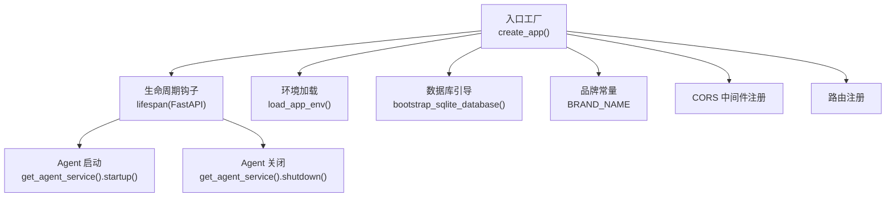
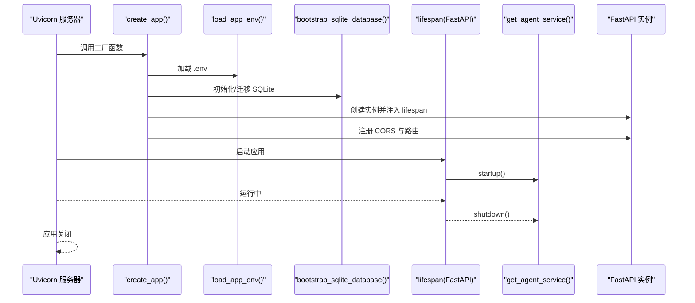
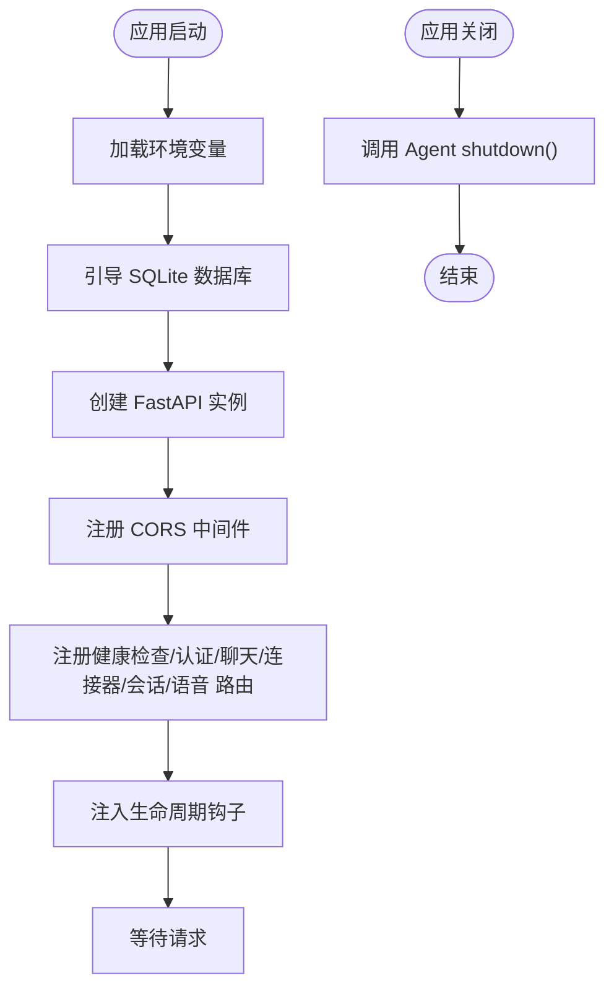
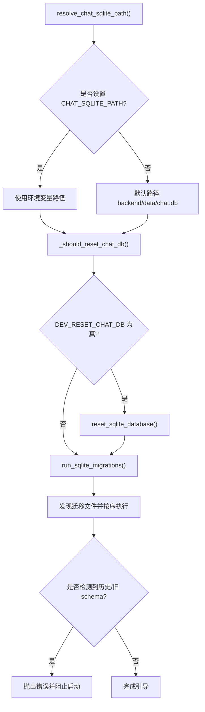
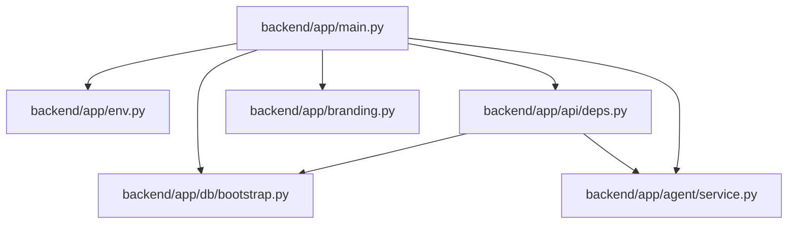

# 应用入口与生命周期

<cite>
**本文引用的文件**
- [backend/app/main.py](file://backend/app/main.py)
- [backend/app/env.py](file://backend/app/env.py)
- [backend/app/branding.py](file://backend/app/branding.py)
- [backend/app/db/bootstrap.py](file://backend/app/db/bootstrap.py)
- [backend/app/api/deps.py](file://backend/app/api/deps.py)
- [backend/app/agent/service.py](file://backend/app/agent/service.py)
- [backend/pyproject.toml](file://backend/pyproject.toml)
- [backend/Dockerfile](file://backend/Dockerfile)
- [docker-compose.aliyun.yml](file://docker-compose.aliyun.yml)
</cite>

## 目录
1. [简介](#简介)
2. [项目结构](#项目结构)
3. [核心组件](#核心组件)
4. [架构总览](#架构总览)
5. [详细组件分析](#详细组件分析)
6. [依赖关系分析](#依赖关系分析)
7. [性能考量](#性能考量)
8. [故障排查指南](#故障排查指南)
9. [结论](#结论)
10. [附录](#附录)

## 简介
本文件聚焦于 FastAPI 应用的入口与生命周期管理，系统性阐述以下主题：
- 应用初始化流程：从入口函数到配置加载、数据库引导、品牌标识设置
- 生命周期钩子：启动与关闭阶段的资源管理与清理
- 环境变量处理与配置验证：dotenv 加载策略、SQLite 路径与迁移校验
- 中间件与依赖注入：CORS 中间件注册、全局服务单例缓存
- 扩展建议：如何在现有生命周期基础上添加新的事件处理

## 项目结构
后端采用“包内工厂 + 生命周期钩子”的组织方式：
- 入口与生命周期：在应用包内定义工厂函数与 lifespan 管理器
- 环境加载：独立模块负责加载 .env
- 数据库引导：独立模块负责 SQLite 路径解析、迁移与安全校验
- 品牌常量：集中管理对外显示的品牌字符串
- 依赖注入：通过 LRU 缓存提供全局单例服务

图表来源
- [backend/app/main.py:31-54](file://backend/app/main.py#L31-L54)
- [backend/app/env.py:10-18](file://backend/app/env.py#L10-L18)
- [backend/app/db/bootstrap.py:213-226](file://backend/app/db/bootstrap.py#L213-L226)
- [backend/app/branding.py:10](file://backend/app/branding.py#L10)

章节来源
- [backend/app/main.py:1-54](file://backend/app/main.py#L1-L54)
- [backend/app/env.py:1-18](file://backend/app/env.py#L1-L18)
- [backend/app/db/bootstrap.py:1-226](file://backend/app/db/bootstrap.py#L1-L226)
- [backend/app/branding.py:1-24](file://backend/app/branding.py#L1-L24)

## 核心组件
- 应用工厂与生命周期
  - 工厂函数负责加载环境、引导数据库、创建 FastAPI 实例、注册中间件与路由，并注入 lifespan 钩子
  - 生命周期钩子在应用启动时初始化 Agent，在关闭时释放资源
- 环境加载
  - 仅在存在 .env 文件时加载，不覆盖已存在的环境变量，且不对值进行 $ 变量展开
- 数据库引导
  - 解析 SQLite 路径，支持强制重置与迁移执行，内置历史数据库与旧 schema 的保护逻辑
- 品牌常量
  - 统一管理对外显示的品牌名、领域名、默认昵称、LangSmith 标签与 OAuth 客户端名后缀
- 依赖注入
  - 通过 LRU 缓存提供 TravelAgentService、AuthService、ConnectorService 的全局单例，确保进程内共享运行时状态

章节来源
- [backend/app/main.py:23-54](file://backend/app/main.py#L23-L54)
- [backend/app/env.py:10-18](file://backend/app/env.py#L10-L18)
- [backend/app/db/bootstrap.py:38-226](file://backend/app/db/bootstrap.py#L38-L226)
- [backend/app/branding.py:10-24](file://backend/app/branding.py#L10-L24)
- [backend/app/api/deps.py:18-60](file://backend/app/api/deps.py#L18-L60)

## 架构总览
下图展示了应用启动的关键调用链与职责划分：

图表来源
- [backend/app/main.py:31-54](file://backend/app/main.py#L31-L54)
- [backend/app/env.py:10-18](file://backend/app/env.py#L10-L18)
- [backend/app/db/bootstrap.py:213-226](file://backend/app/db/bootstrap.py#L213-L226)
- [backend/app/agent/service.py:116-124](file://backend/app/agent/service.py#L116-L124)

## 详细组件分析

### 应用入口与生命周期钩子
- 入口工厂
  - 负责加载环境、引导数据库、创建 FastAPI 实例、注册 CORS 与路由
  - 使用 lifespan 钩子管理 Agent 的启动与关闭
- 生命周期钩子
  - 启动：调用全局 Agent 服务的 startup，确保运行时可用
  - 关闭：调用全局 Agent 服务的 shutdown，释放相关资源
- 依赖注入
  - 通过 get_agent_service 提供全局单例，避免重复初始化

图表来源
- [backend/app/main.py:31-54](file://backend/app/main.py#L31-L54)
- [backend/app/agent/service.py:116-124](file://backend/app/agent/service.py#L116-L124)

章节来源
- [backend/app/main.py:23-54](file://backend/app/main.py#L23-L54)
- [backend/app/agent/service.py:116-124](file://backend/app/agent/service.py#L116-L124)

### 环境变量加载机制与配置验证
- 加载策略
  - 仅在 .env 存在时加载，不覆盖已存在的同名变量，且不对值进行 $ 变量展开
- 配置验证
  - SQLite 路径解析：优先使用环境变量，否则位于 backend/data 下
  - 迁移发现：按文件名前缀序号扫描 SQL 文件，校验重复版本号与文件名格式
  - 历史数据库保护：拒绝运行未版本化的旧业务库
  - 旧 schema 保护：拒绝运行旧的整数型 schema
  - 强制重置：可通过环境变量触发重置并去重（同一路径仅重置一次）

图表来源
- [backend/app/db/bootstrap.py:38-226](file://backend/app/db/bootstrap.py#L38-L226)

章节来源
- [backend/app/env.py:10-18](file://backend/app/env.py#L10-L18)
- [backend/app/db/bootstrap.py:38-226](file://backend/app/db/bootstrap.py#L38-L226)

### 品牌标识设置
- 品牌常量集中管理，包括产品品牌名、领域名、默认昵称、LangSmith 标签与 OAuth 客户端名后缀
- 应用标题使用品牌名与版本号组合，确保对外展示的一致性

章节来源
- [backend/app/branding.py:10-24](file://backend/app/branding.py#L10-L24)
- [backend/app/main.py:35](file://backend/app/main.py#L35)

### 中间件与路由注册
- CORS 中间件
  - 从环境变量读取允许的源，支持多源逗号分隔，自动去除空白字符
  - 允许凭据、方法与头全放行
- 路由注册
  - 包含健康检查、认证、聊天、连接器、会话、语音等路由

章节来源
- [backend/app/main.py:37-51](file://backend/app/main.py#L37-L51)

### 依赖注入与全局服务单例
- 通过 LRU 缓存提供 TravelAgentService、AuthService、ConnectorService 的全局单例
- 保证同一进程内共享 Agent 运行时与 MCP 连接状态，减少重复初始化成本

章节来源
- [backend/app/api/deps.py:18-60](file://backend/app/api/deps.py#L18-L60)

## 依赖关系分析
- 外部依赖
  - FastAPI、Uvicorn、Pydantic、python-dotenv、LangChain/LangGraph、LangSmith、MCP 适配器等
- 内部依赖
  - main.py 依赖 env.py、db/bootstrap.py、branding.py、api/deps.py、agent/service.py
  - api/deps.py 依赖 db/bootstrap.py 与 agent/service.py

图表来源
- [backend/app/main.py:11-20](file://backend/app/main.py#L11-L20)
- [backend/app/api/deps.py:18-46](file://backend/app/api/deps.py#L18-L46)

章节来源
- [backend/app/main.py:11-20](file://backend/app/main.py#L11-L20)
- [backend/app/api/deps.py:18-46](file://backend/app/api/deps.py#L18-L46)
- [backend/pyproject.toml:6-24](file://backend/pyproject.toml#L6-L24)

## 性能考量
- 生命周期钩子
  - 将 Agent 的启动与关闭置于 lifespan 中，避免在请求处理路径上重复初始化
- 依赖注入
  - LRU 缓存确保全局单例复用，降低对象创建与状态同步开销
- 数据库引导
  - 迁移按序执行，避免并发写冲突；强制重置仅对特定路径生效，减少不必要的 IO

## 故障排查指南
- 启动时报错“未找到任何 migration SQL 文件”
  - 检查 migrations 目录是否存在 SQL 文件，文件名格式是否符合“序号_名称.sql”
- 启动时报错“检测到未版本化的历史 chat.db”
  - 设置强制重置环境变量或删除旧数据库后重启
- 启动时报错“检测到旧版整数型聊天 schema”
  - 设置强制重置环境变量或删除旧数据库后重启
- CORS 不生效
  - 检查环境变量中 CORS_ALLOW_ORIGINS 是否正确配置，多个源之间使用逗号分隔
- .env 未生效
  - 确认 .env 文件存在且未被覆盖；注意加载策略不会覆盖已存在的变量且不展开 $ 变量

章节来源
- [backend/app/db/bootstrap.py:48-65](file://backend/app/db/bootstrap.py#L48-L65)
- [backend/app/db/bootstrap.py:112-131](file://backend/app/db/bootstrap.py#L112-L131)
- [backend/app/db/bootstrap.py:142-165](file://backend/app/db/bootstrap.py#L142-L165)
- [backend/app/main.py:37-44](file://backend/app/main.py#L37-L44)
- [backend/app/env.py:14-17](file://backend/app/env.py#L14-L17)

## 结论
该应用通过清晰的入口工厂与生命周期钩子，实现了环境加载、数据库引导、品牌标识与中间件注册的有序衔接。配合 LRU 缓存的全局服务单例，既保证了运行时状态的共享，又简化了资源管理。通过严格的数据库迁移与历史/旧 schema 校验，提升了系统的健壮性与可维护性。

## 附录

### 环境配置示例与最佳实践
- 环境变量
  - CORS_ALLOW_ORIGINS：允许跨域的源列表，逗号分隔
  - CHAT_SQLITE_PATH：聊天数据库文件路径
  - DEV_RESET_CHAT_DB：是否在启动时重置数据库（布尔真值）
- 最佳实践
  - 在开发环境启用强制重置以快速恢复干净状态
  - 生产环境避免直接删除数据库，优先使用迁移升级
  - 将敏感配置放入 .env 并限制其权限
  - 使用容器编排时，通过 env_file 挂载 .env 文件

章节来源
- [backend/app/main.py:37](file://backend/app/main.py#L37)
- [backend/app/db/bootstrap.py:43-45](file://backend/app/db/bootstrap.py#L43-L45)
- [backend/app/db/bootstrap.py:40](file://backend/app/db/bootstrap.py#L40)
- [docker-compose.aliyun.yml:7-8](file://docker-compose.aliyun.yml#L7-L8)

### 扩展应用生命周期事件处理
- 在 lifespan 中添加自定义事件
  - 启动阶段：初始化第三方 SDK、建立长连接、预热缓存
  - 关闭阶段：优雅断开连接、刷新未持久化的状态、清理临时文件
- 注意事项
  - 保持异步与异常处理，避免阻塞 Uvicorn 启停
  - 对外部依赖增加超时与重试策略

章节来源
- [backend/app/main.py:23-28](file://backend/app/main.py#L23-L28)
- [backend/app/agent/service.py:116-124](file://backend/app/agent/service.py#L116-L124)