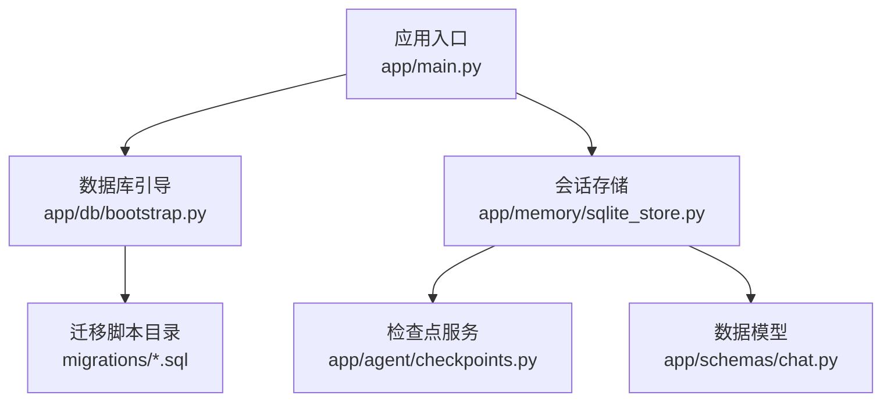
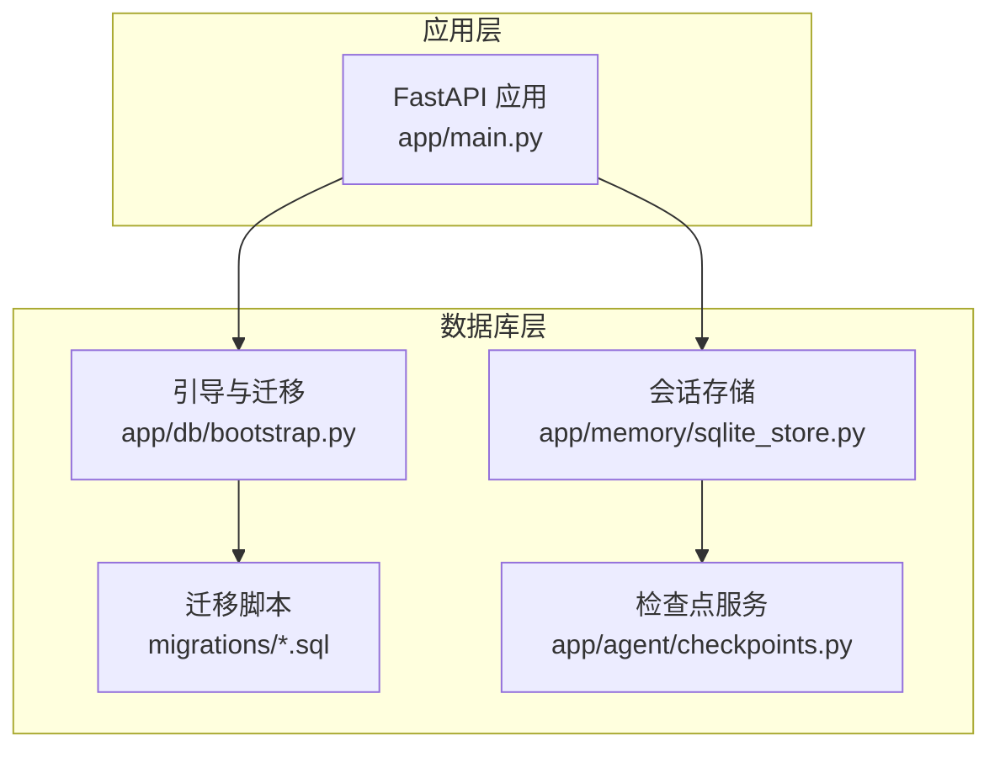
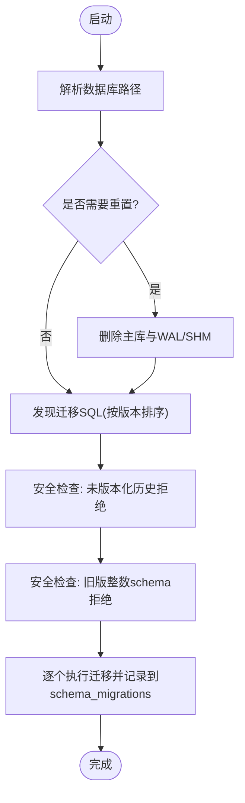
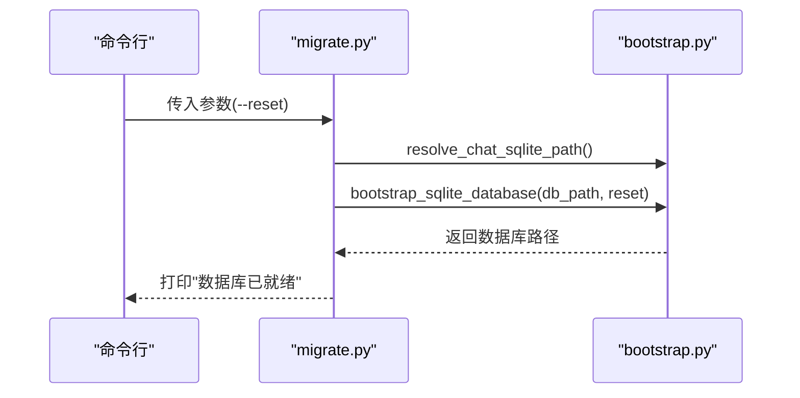
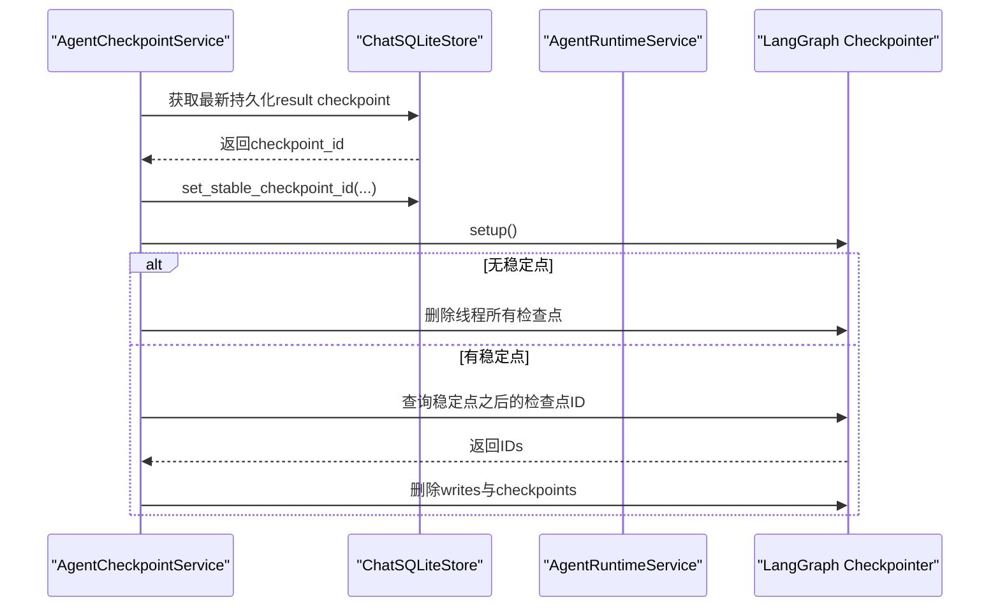
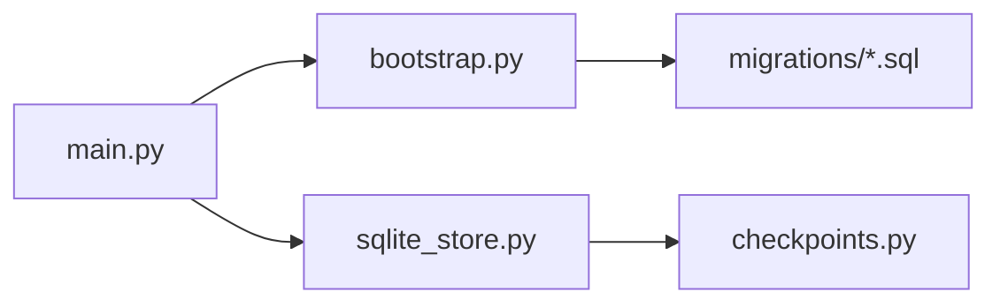

# 数据库管理

<cite>
**本文引用的文件**
- [backend/app/db/bootstrap.py](file://backend/app/db/bootstrap.py)
- [backend/app/db/migrate.py](file://backend/app/db/migrate.py)
- [backend/app/memory/sqlite_store.py](file://backend/app/memory/sqlite_store.py)
- [backend/app/agent/checkpoints.py](file://backend/app/agent/checkpoints.py)
- [backend/app/schemas/chat.py](file://backend/app/schemas/chat.py)
- [backend/app/main.py](file://backend/app/main.py)
- [backend/migrations/001_auth_tables.sql](file://backend/migrations/001_auth_tables.sql)
- [backend/migrations/002_chat_core.sql](file://backend/migrations/002_chat_core.sql)
- [backend/migrations/003_chat_versions.sql](file://backend/migrations/003_chat_versions.sql)
- [backend/migrations/004_chat_speech_assets.sql](file://backend/migrations/004_chat_speech_assets.sql)
- [backend/migrations/005_chat_parts_status.sql](file://backend/migrations/005_chat_parts_status.sql)
- [backend/tests/test_db_migrate.py](file://backend/tests/test_db_migrate.py)
- [backend/tests/test_sqlite_store.py](file://backend/tests/test_sqlite_store.py)
</cite>

## 目录
1. [简介](#简介)
2. [项目结构](#项目结构)
3. [核心组件](#核心组件)
4. [架构总览](#架构总览)
5. [详细组件分析](#详细组件分析)
6. [依赖分析](#依赖分析)
7. [性能考虑](#性能考虑)
8. [故障排查指南](#故障排查指南)
9. [结论](#结论)
10. [附录](#附录)

## 简介
本文件系统性梳理数据库管理子系统，覆盖以下主题：
- SQLite 初始化与迁移：从环境变量解析、迁移发现、幂等执行到安全保护（禁止旧版 schema 继续运行）
- 表结构设计：认证、聊天会话与消息、版本化助手回复、语音资产、索引与约束
- LangGraph 检查点存储：与 SQLite 的协同、稳定检查点定位、清理策略
- 内存管理与会话持久化：消息流式写入、版本化存储、会话预览与标题生成
- 连接池与事务：基于 sqlite3 的连接管理、自动提交/回滚、上下文管理器
- 并发控制：检查点锁与并发清理
- 迁移脚本编写指南、备份恢复策略、性能优化建议
- 扩展新模型与迁移规则的方法论

## 项目结构
数据库相关代码主要分布在以下位置：
- 迁移与引导：backend/app/db/bootstrap.py、backend/app/db/migrate.py、backend/migrations/*.sql
- 会话与消息存储：backend/app/memory/sqlite_store.py
- 检查点服务：backend/app/agent/checkpoints.py
- 数据模型：backend/app/schemas/chat.py
- 应用入口：backend/app/main.py
- 测试：backend/tests/test_db_migrate.py、backend/tests/test_sqlite_store.py

图表来源
- [backend/app/main.py:31-54](file://backend/app/main.py#L31-L54)
- [backend/app/db/bootstrap.py:213-226](file://backend/app/db/bootstrap.py#L213-L226)
- [backend/app/memory/sqlite_store.py:123-149](file://backend/app/memory/sqlite_store.py#L123-L149)
- [backend/app/agent/checkpoints.py:9-15](file://backend/app/agent/checkpoints.py#L9-L15)
- [backend/app/schemas/chat.py:145-220](file://backend/app/schemas/chat.py#L145-L220)

章节来源
- [backend/app/main.py:31-54](file://backend/app/main.py#L31-L54)
- [backend/app/db/bootstrap.py:213-226](file://backend/app/db/bootstrap.py#L213-L226)

## 核心组件
- 数据库引导与迁移
  - 引导函数负责解析数据库路径、可选重置、执行迁移并返回最终路径
  - 迁移发现按文件名前缀排序，确保顺序执行
  - 安全保护：拒绝未版本化的旧数据库与旧版整数主键 schema 继续运行
- 会话与消息存储
  - 提供用户消息追加、助手消息占位与完成、版本化存储、语音资产关联、会话预览与标题、重命名、删除等
  - 支持多版本助手回复（最多 3 个），并记录 parent/result 检查点 ID
- 检查点服务
  - 与 LangGraph 检查点存储协作，定位稳定检查点、清理后续半成品检查点
  - 使用检查点锁与游标进行并发安全的清理
- 数据模型
  - 统一定义消息、版本、会话摘要/详情、部分片段（文本/推理/工具）、元信息等
- 应用入口
  - 启动时调用引导函数，确保数据库可用

章节来源
- [backend/app/db/bootstrap.py:181-226](file://backend/app/db/bootstrap.py#L181-L226)
- [backend/app/memory/sqlite_store.py:123-780](file://backend/app/memory/sqlite_store.py#L123-L780)
- [backend/app/agent/checkpoints.py:9-106](file://backend/app/agent/checkpoints.py#L9-L106)
- [backend/app/schemas/chat.py:145-220](file://backend/app/schemas/chat.py#L145-L220)
- [backend/app/main.py:31-54](file://backend/app/main.py#L31-L54)

## 架构总览
整体架构围绕“引导 → 迁移 → 存储 → 检查点”展开，应用启动即完成数据库准备。

图表来源
- [backend/app/main.py:31-54](file://backend/app/main.py#L31-L54)
- [backend/app/db/bootstrap.py:181-226](file://backend/app/db/bootstrap.py#L181-L226)
- [backend/app/memory/sqlite_store.py:123-149](file://backend/app/memory/sqlite_store.py#L123-L149)
- [backend/app/agent/checkpoints.py:9-15](file://backend/app/agent/checkpoints.py#L9-L15)

## 详细组件分析

### 组件A：数据库引导与迁移（bootstrap.py）
- 关键职责
  - 解析聊天数据库路径（支持环境变量覆盖）
  - 可选重置：删除主库及 WAL/SHM 文件
  - 发现迁移：按文件名前缀排序，校验唯一版本号
  - 执行迁移：幂等插入 schema_migrations 记录
  - 安全保护：拒绝未版本化历史数据库；拒绝旧版整数主键 schema
- 连接与事务
  - 使用上下文管理器封装连接，自动 commit/rollback/close
  - PRAGMA foreign_keys 开启外键约束
- 并发与幂等
  - 已应用版本集合去重，避免重复执行
  - 支持目标版本限制（向前迁移）

图表来源
- [backend/app/db/bootstrap.py:181-226](file://backend/app/db/bootstrap.py#L181-L226)
- [backend/app/db/bootstrap.py:100-165](file://backend/app/db/bootstrap.py#L100-L165)
- [backend/app/db/bootstrap.py:68-87](file://backend/app/db/bootstrap.py#L68-L87)

章节来源
- [backend/app/db/bootstrap.py:181-226](file://backend/app/db/bootstrap.py#L181-L226)
- [backend/app/db/bootstrap.py:100-165](file://backend/app/db/bootstrap.py#L100-L165)
- [backend/app/db/bootstrap.py:68-87](file://backend/app/db/bootstrap.py#L68-L87)

### 组件B：命令行迁移入口（migrate.py）
- 提供 CLI：解析 --reset 参数，调用引导函数
- 输出数据库路径确认

图表来源
- [backend/app/db/migrate.py:10-22](file://backend/app/db/migrate.py#L10-L22)
- [backend/app/db/bootstrap.py:213-226](file://backend/app/db/bootstrap.py#L213-L226)

章节来源
- [backend/app/db/migrate.py:10-22](file://backend/app/db/migrate.py#L10-L22)

### 组件C：会话与消息存储（sqlite_store.py）
- 设计要点
  - 会话：chat_sessions（thread_id 主键、user_id 外键、自动生成标题、会话预览、模型档位、稳定检查点）
  - 消息：chat_messages（role、text、parts_json、status、reply_to_message_id、current_version_id）
  - 版本：assistant_message_versions（version_index 1..3、kind/original/regenerated、parent/result checkpoint、feedback）
  - 语音：assistant_version_speech_assets（status/mime/object_key/error）
  - 索引：会话与消息常用查询列建立索引
- 核心能力
  - 用户消息追加与会话创建/更新
  - 助手消息占位与完成，写入版本与当前版本指针
  - 会话列表、详情加载，版本聚合与语音资产关联
  - 重命名、删除、预览刷新
  - 重生成：最多 3 次，记录 parent/result checkpoint
  - 模型档位读写
- 并发与事务
  - 每次操作使用独立连接，上下文管理器保证提交/回滚/关闭

```mermaid
classDiagram
class ChatSQLiteStore {
+MAX_ASSISTANT_VERSIONS
-_db_path
-_connect()
-_connection()
+append_user_message(...)
+begin_assistant_message(...)
+append_assistant_message(...)
+complete_assistant_message(...)
+update_assistant_message_meta(...)
+list_sessions(...)
+get_session_detail(...)
+rename_session(...)
+delete_session(...)
+get_regeneration_target(...)
+upsert_regenerated_version(...)
+switch_assistant_version(...)
+update_assistant_feedback(...)
+get_session_model_profile_key(...)
+set_session_model_profile_key(...)
}
class AssistantMessageRegenerationTarget {
+message_id
+reply_to_message_id
+user_message_text
+original_version_id
+original_parent_checkpoint_id
+current_version_id
}
class StoredAssistantMessageVersion {
+id
+assistant_message_id
+version_index
+kind
+text
+parts
+status
+meta
+feedback
+parent_checkpoint_id
+result_checkpoint_id
+speech_status
+speech_mime_type
+created_at
}
class StoredAssistantSpeechAsset {
+assistant_message_version_id
+status
+mime_type
+object_key
+error_message
+created_at
+updated_at
}
ChatSQLiteStore --> AssistantMessageRegenerationTarget : "生成重生成目标"
ChatSQLiteStore --> StoredAssistantMessageVersion : "加载/写入版本"
ChatSQLiteStore --> StoredAssistantSpeechAsset : "加载语音资产"
```

图表来源
- [backend/app/memory/sqlite_store.py:123-780](file://backend/app/memory/sqlite_store.py#L123-L780)
- [backend/app/memory/sqlite_store.py:28-71](file://backend/app/memory/sqlite_store.py#L28-L71)

章节来源
- [backend/app/memory/sqlite_store.py:123-780](file://backend/app/memory/sqlite_store.py#L123-L780)

### 组件D：LangGraph 检查点服务（checkpoints.py）
- 职责
  - 定位线程稳定检查点（优先业务已持久化的 result checkpoint，否则根检查点）
  - 将稳定检查点写入会话存储
  - 清理稳定检查点之后的半成品检查点与 writes
- 并发控制
  - 使用检查点锁与游标，确保清理过程串行化

图表来源
- [backend/app/agent/checkpoints.py:23-106](file://backend/app/agent/checkpoints.py#L23-L106)
- [backend/app/memory/sqlite_store.py:150-176](file://backend/app/memory/sqlite_store.py#L150-L176)

章节来源
- [backend/app/agent/checkpoints.py:23-106](file://backend/app/agent/checkpoints.py#L23-L106)

### 组件E：数据模型（schemas/chat.py）
- 统一定义消息、版本、会话摘要/详情、部分片段（文本/推理/工具）、元信息等
- 为 API 层、服务层与测试共享，避免字段漂移

章节来源
- [backend/app/schemas/chat.py:145-220](file://backend/app/schemas/chat.py#L145-L220)

## 依赖分析
- 引导与迁移
  - bootstrap.py 依赖 migrations 目录下的 SQL 文件，按版本顺序执行
  - 迁移入口 migrate.py 仅包装引导逻辑
- 存储与检查点
  - sqlite_store.py 通过 schema_migrations 与各迁移脚本保持一致
  - 检查点服务依赖 LangGraph 检查点存储，同时写回会话存储以标记稳定点
- 应用入口
  - main.py 在启动阶段调用引导函数，确保数据库可用

图表来源
- [backend/app/main.py:31-54](file://backend/app/main.py#L31-L54)
- [backend/app/db/bootstrap.py:181-226](file://backend/app/db/bootstrap.py#L181-L226)
- [backend/app/memory/sqlite_store.py:123-149](file://backend/app/memory/sqlite_store.py#L123-L149)
- [backend/app/agent/checkpoints.py:9-15](file://backend/app/agent/checkpoints.py#L9-L15)

章节来源
- [backend/app/main.py:31-54](file://backend/app/main.py#L31-L54)
- [backend/app/db/bootstrap.py:181-226](file://backend/app/db/bootstrap.py#L181-L226)

## 性能考虑
- 索引与查询
  - 会话按 user_id+updated_at 排序，消息按 thread_id+created_at 排序，减少扫描范围
  - 语音资产按版本 ID 建索引，加速版本到资产的联结
- 写入模式
  - 助手消息采用“占位 + 完成”的两段式写入，降低单事务开销
  - 版本化存储限制最多 3 个版本，控制膨胀
- 连接与事务
  - 每次操作独立连接，避免长事务持有锁
  - 上下文管理器确保异常时回滚，减少脏数据风险
- 清理策略
  - 检查点清理在稳定点之后批量删除，避免碎片积累

## 故障排查指南
- 迁移失败
  - 重复版本号：检查 migrations 目录文件名前缀是否唯一
  - 未版本化历史数据库：设置重置标志或删除旧数据库后重启
  - 旧版整数主键 schema：设置重置标志或删除旧数据库后重启
- 运行期错误
  - 会话不存在：确认 thread_id 与 user_id 匹配
  - 重生成次数超限：版本上限为 3，超过将抛出异常
- 测试验证
  - 使用测试用例验证迁移幂等、重置行为、安全保护与 CRUD 正常

章节来源
- [backend/tests/test_db_migrate.py:12-146](file://backend/tests/test_db_migrate.py#L12-L146)
- [backend/tests/test_sqlite_store.py:12-176](file://backend/tests/test_sqlite_store.py#L12-L176)

## 结论
该数据库管理子系统以“引导 + 迁移 + 存储 + 检查点”为主线，具备：
- 安全可靠的迁移机制与幂等执行
- 面向聊天场景的完整表结构与版本化设计
- 与 LangGraph 检查点的协同与清理策略
- 明确的并发控制与事务边界
配合完善的测试与迁移脚本规范，可支撑业务持续演进与数据稳健增长。

## 附录

### 表结构与迁移概览
- 认证表（001）
  - users、email_login_codes，含索引
- 聊天核心（002）
  - chat_sessions、chat_messages，外键与索引
- 版本与检查点（003）
  - 会话新增 last_message_preview/model_profile_key/stable_checkpoint_id
  - 消息新增 current_version_id
  - assistant_message_versions（版本化助手回复），含唯一约束与索引
- 语音资产（004）
  - assistant_version_speech_assets（状态、MIME、对象键、错误信息）
- 部分状态与状态枚举（005）
  - chat_messages/assistant_message_versions 新增 parts_json 与 status 字段，status 枚举约束

章节来源
- [backend/migrations/001_auth_tables.sql:1-21](file://backend/migrations/001_auth_tables.sql#L1-L21)
- [backend/migrations/002_chat_core.sql:1-28](file://backend/migrations/002_chat_core.sql#L1-L28)
- [backend/migrations/003_chat_versions.sql:1-30](file://backend/migrations/003_chat_versions.sql#L1-L30)
- [backend/migrations/004_chat_speech_assets.sql:1-15](file://backend/migrations/004_chat_speech_assets.sql#L1-L15)
- [backend/migrations/005_chat_parts_status.sql:1-14](file://backend/migrations/005_chat_parts_status.sql#L1-L14)

### 迁移脚本编写指南
- 命名规范
  - 使用固定宽度前缀（如 001_、002_）表示版本号，后跟描述性名称
- 幂等性
  - 使用 IF NOT EXISTS 或 ALTER TABLE ADD COLUMN 默认值
  - 对于索引，可在创建前检查是否存在
- 安全性
  - 不要破坏现有字段类型与主键类型（禁止整数主键 schema）
  - 外键约束开启（PRAGMA foreign_keys = ON）
- 可观测性
  - 在 schema_migrations 中记录版本、名称与应用时间
- 测试
  - 编写测试用例验证幂等、重置、安全保护

章节来源
- [backend/app/db/bootstrap.py:48-65](file://backend/app/db/bootstrap.py#L48-L65)
- [backend/app/db/bootstrap.py:100-109](file://backend/app/db/bootstrap.py#L100-L109)
- [backend/tests/test_db_migrate.py:39-66](file://backend/tests/test_db_migrate.py#L39-L66)

### 数据备份与恢复策略
- 备份
  - 直接复制数据库文件（含 -wal/-shm）
  - 使用 sqlite3 dump 导出 SQL（便于跨平台）
- 恢复
  - 停机状态下替换数据库文件
  - 使用 sqlite3 restore 从备份恢复
- 迁移与回滚
  - 通过 schema_migrations 记录版本，必要时回退到目标版本
  - 若出现不兼容，使用重置选项重建数据库

### 扩展新的数据模型与迁移规则
- 新增表
  - 在 migrations 目录新增 SQL 文件，按顺序编号
  - 在存储层添加对应 CRUD 方法与模型定义
- 修改现有表
  - 使用 ALTER TABLE 添加列或索引，保留默认值与约束
  - 避免删除/重命名关键列，防止破坏历史数据
- 检查点协同
  - 如需持久化检查点元数据，可在会话或消息表中新增字段
  - 更新检查点服务以读写新字段