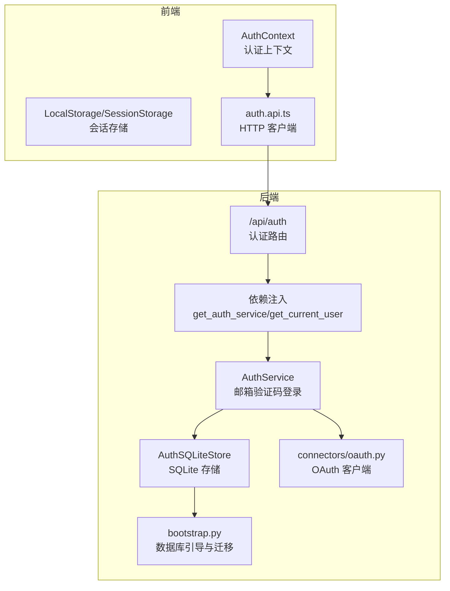
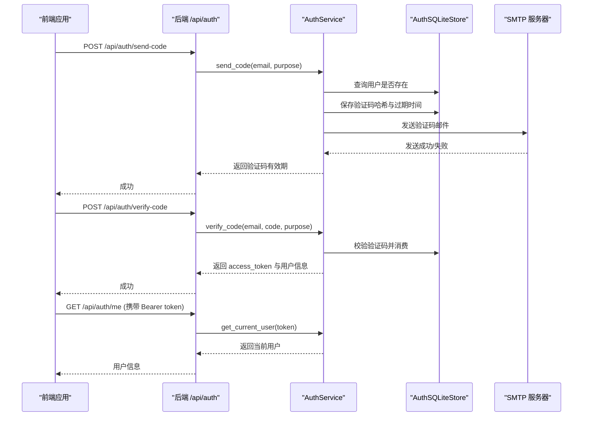
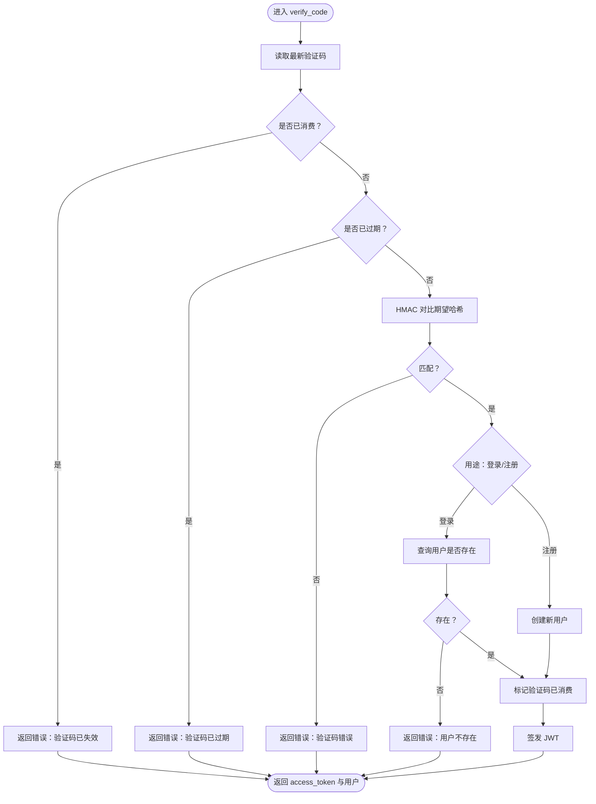
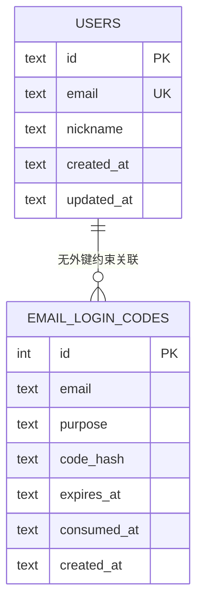
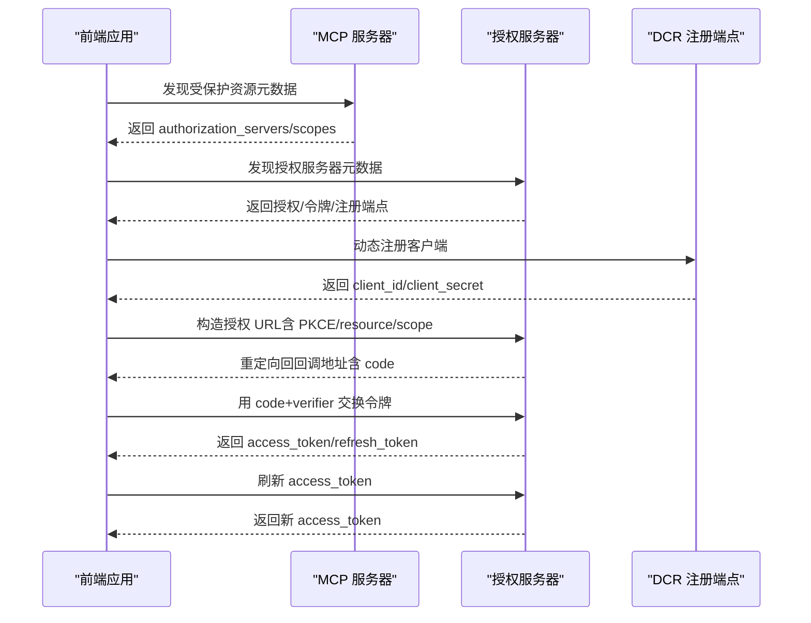
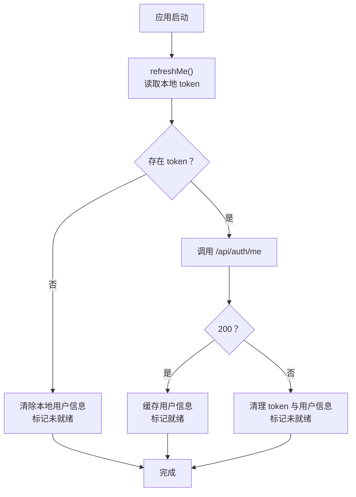
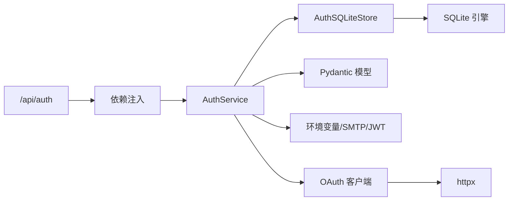

# 认证系统

<cite>
**本文引用的文件**
- [backend/app/auth/service.py](file://backend/app/auth/service.py)
- [backend/app/auth/store.py](file://backend/app/auth/store.py)
- [backend/app/api/auth.py](file://backend/app/api/auth.py)
- [backend/app/api/deps.py](file://backend/app/api/deps.py)
- [backend/app/schemas/auth.py](file://backend/app/schemas/auth.py)
- [backend/app/connectors/oauth.py](file://backend/app/connectors/oauth.py)
- [backend/app/db/bootstrap.py](file://backend/app/db/bootstrap.py)
- [backend/migrations/001_auth_tables.sql](file://backend/migrations/001_auth_tables.sql)
- [frontend/src/features/auth/model/auth.context.tsx](file://frontend/src/features/auth/model/auth.context.tsx)
- [frontend/src/features/auth/model/auth.storage.ts](file://frontend/src/features/auth/model/auth.storage.ts)
- [frontend/src/features/auth/api/auth.api.ts](file://frontend/src/features/auth/api/auth.api.ts)
- [backend/tests/test_auth_api.py](file://backend/tests/test_auth_api.py)
- [backend/tests/test_auth_service.py](file://backend/tests/test_auth_service.py)
</cite>

## 目录
1. [简介](#简介)
2. [项目结构](#项目结构)
3. [核心组件](#核心组件)
4. [架构总览](#架构总览)
5. [详细组件分析](#详细组件分析)
6. [依赖分析](#依赖分析)
7. [性能考虑](#性能考虑)
8. [故障排查指南](#故障排查指南)
9. [结论](#结论)
10. [附录](#附录)

## 简介
本文件系统性阐述认证系统的实现与使用，覆盖以下方面：
- OAuth 认证流程与 MCP 授权服务器对接
- 用户状态管理与权限控制机制
- 认证服务实现原理、令牌管理与会话存储策略
- 用户注册登录、权限验证与安全策略
- 认证中间件配置、错误处理与安全最佳实践
- 如何扩展新的认证方式与权限模型

## 项目结构
认证系统由“后端 API 层 → 认证服务层 → 数据存储层”以及“前端上下文与存储层”组成，并辅以数据库迁移脚本与测试用例保障功能与安全。

图表来源
- [backend/app/api/auth.py:11-36](file://backend/app/api/auth.py#L11-L36)
- [backend/app/api/deps.py:35-60](file://backend/app/api/deps.py#L35-L60)
- [backend/app/auth/service.py:49-312](file://backend/app/auth/service.py#L49-L312)
- [backend/app/auth/store.py:20-152](file://backend/app/auth/store.py#L20-L152)
- [backend/app/db/bootstrap.py:213-226](file://backend/app/db/bootstrap.py#L213-L226)
- [backend/app/connectors/oauth.py:1-419](file://backend/app/connectors/oauth.py#L1-L419)
- [frontend/src/features/auth/model/auth.context.tsx:43-146](file://frontend/src/features/auth/model/auth.context.tsx#L43-L146)
- [frontend/src/features/auth/model/auth.storage.ts:1-87](file://frontend/src/features/auth/model/auth.storage.ts#L1-L87)
- [frontend/src/features/auth/api/auth.api.ts:1-21](file://frontend/src/features/auth/api/auth.api.ts#L1-L21)

章节来源
- [backend/app/api/auth.py:11-36](file://backend/app/api/auth.py#L11-L36)
- [backend/app/api/deps.py:35-60](file://backend/app/api/deps.py#L35-L60)
- [backend/app/auth/service.py:49-312](file://backend/app/auth/service.py#L49-L312)
- [backend/app/auth/store.py:20-152](file://backend/app/auth/store.py#L20-L152)
- [backend/app/db/bootstrap.py:213-226](file://backend/app/db/bootstrap.py#L213-L226)
- [backend/app/connectors/oauth.py:1-419](file://backend/app/connectors/oauth.py#L1-L419)
- [frontend/src/features/auth/model/auth.context.tsx:43-146](file://frontend/src/features/auth/model/auth.context.tsx#L43-L146)
- [frontend/src/features/auth/model/auth.storage.ts:1-87](file://frontend/src/features/auth/model/auth.storage.ts#L1-L87)
- [frontend/src/features/auth/api/auth.api.ts:1-21](file://frontend/src/features/auth/api/auth.api.ts#L1-L21)

## 核心组件
- 认证服务（AuthService）
  - 支持邮箱验证码登录/注册，基于 HS256 的 JWT 令牌签发与校验
  - 邮箱验证码发送与校验，带过期与消费标记
  - SMTP 配置与错误映射，支持 SSL/TLS/STARTTLS 自动选择
- 认证存储（AuthSQLiteStore）
  - 用户表与邮箱验证码表，提供用户查询、创建、验证码保存与消费
- 认证 API（/api/auth）
  - 提供发送验证码、校验验证码换取令牌、获取当前用户信息接口
- 依赖注入与当前用户解析
  - 通过 HTTP Bearer 解析令牌并调用 AuthService 获取用户
- OAuth 客户端（MCP 授权）
  - 实现 RFC 8414/7591/7636/8707 等规范，支持授权服务器发现、动态注册、PKCE、资源指示器等
- 前端认证上下文与存储
  - 本地持久化访问令牌与用户信息，提供登录/登出/刷新能力
- 数据库引导与迁移
  - 初始化 SQLite 并应用认证相关迁移脚本

章节来源
- [backend/app/auth/service.py:49-312](file://backend/app/auth/service.py#L49-L312)
- [backend/app/auth/store.py:20-152](file://backend/app/auth/store.py#L20-L152)
- [backend/app/api/auth.py:11-36](file://backend/app/api/auth.py#L11-L36)
- [backend/app/api/deps.py:49-60](file://backend/app/api/deps.py#L49-L60)
- [backend/app/connectors/oauth.py:1-419](file://backend/app/connectors/oauth.py#L1-L419)
- [frontend/src/features/auth/model/auth.context.tsx:43-146](file://frontend/src/features/auth/model/auth.context.tsx#L43-L146)
- [frontend/src/features/auth/model/auth.storage.ts:1-87](file://frontend/src/features/auth/model/auth.storage.ts#L1-L87)
- [backend/app/db/bootstrap.py:213-226](file://backend/app/db/bootstrap.py#L213-L226)
- [backend/migrations/001_auth_tables.sql:1-21](file://backend/migrations/001_auth_tables.sql#L1-L21)

## 架构总览
认证系统采用“前后端分离 + 后端无状态”的设计：
- 前端负责会话存储与令牌携带，后端仅通过 Bearer 令牌进行鉴权
- 认证服务负责邮箱验证码登录/注册与 JWT 签发，OAuth 客户端负责 MCP 授权流程
- 数据库通过迁移脚本初始化认证相关表，确保一致性

图表来源
- [backend/app/api/auth.py:14-35](file://backend/app/api/auth.py#L14-L35)
- [backend/app/auth/service.py:251-312](file://backend/app/auth/service.py#L251-L312)
- [backend/app/auth/store.py:99-152](file://backend/app/auth/store.py#L99-L152)
- [backend/app/api/deps.py:52-60](file://backend/app/api/deps.py#L52-L60)

## 详细组件分析

### 认证服务（AuthService）
- 功能要点
  - 邮箱规范化与格式校验
  - 验证码生成、哈希存储与过期控制
  - JWT 签发（HS256），包含 sub、email、iat、exp
  - SMTP 配置加载与错误映射（DNS、认证、连接断开、超时）
  - 当前用户解析（Bearer token → JWT 解码 → 用户查询）
- 关键流程
  - 发送验证码：校验目的（登录/注册）→ 生成 6 位随机数 → 哈希存储 → 发送邮件
  - 校验验证码：获取最新验证码 → 校验是否已消费/过期 → HMAC 对比 → 登录/注册用户 → 消费验证码 → 生成 JWT
  - 获取当前用户：校验 Bearer 令牌有效性 → 解析用户 ID → 查询用户是否存在

图表来源
- [backend/app/auth/service.py:271-296](file://backend/app/auth/service.py#L271-L296)
- [backend/app/auth/store.py:118-152](file://backend/app/auth/store.py#L118-L152)

章节来源
- [backend/app/auth/service.py:49-312](file://backend/app/auth/service.py#L49-L312)
- [backend/app/auth/store.py:20-152](file://backend/app/auth/store.py#L20-L152)

### 认证存储（AuthSQLiteStore）
- 用户表（users）与邮箱验证码表（email_login_codes）
- 提供用户按邮箱/ID 查询、创建用户、保存验证码、获取最新验证码、消费验证码
- 使用事务封装，保证并发一致性

图表来源
- [backend/migrations/001_auth_tables.sql:1-21](file://backend/migrations/001_auth_tables.sql#L1-L21)
- [backend/app/auth/store.py:45-83](file://backend/app/auth/store.py#L45-L83)
- [backend/app/auth/store.py:85-97](file://backend/app/auth/store.py#L85-L97)
- [backend/app/auth/store.py:99-152](file://backend/app/auth/store.py#L99-L152)

章节来源
- [backend/app/auth/store.py:20-152](file://backend/app/auth/store.py#L20-L152)
- [backend/migrations/001_auth_tables.sql:1-21](file://backend/migrations/001_auth_tables.sql#L1-L21)

### 认证 API（/api/auth）
- /api/auth/send-code：发送验证码（支持登录/注册目的）
- /api/auth/verify-code：校验验证码并换取 JWT
- /api/auth/me：获取当前登录用户信息（需 Bearer 令牌）

章节来源
- [backend/app/api/auth.py:11-36](file://backend/app/api/auth.py#L11-L36)

### 依赖注入与当前用户解析
- get_auth_service：基于 bootstrap_sqlite_database 获取 SQLite 路径并创建 AuthService 单例
- get_current_user：解析 Authorization: Bearer token，调用 AuthService.get_current_user 获取用户

章节来源
- [backend/app/api/deps.py:18-40](file://backend/app/api/deps.py#L18-L40)
- [backend/app/api/deps.py:52-60](file://backend/app/api/deps.py#L52-L60)
- [backend/app/db/bootstrap.py:213-226](file://backend/app/db/bootstrap.py#L213-L226)

### OAuth 客户端（MCP 授权）
- 支持 RFC 8414（授权服务器元数据）、RFC 7591（动态客户端注册）、RFC 7636（PKCE）、RFC 8707（资源指示器）
- 核心流程：受保护资源发现 → 授权服务器发现 → 动态注册 → 构造授权 URL → 交换令牌 → 刷新令牌
- 提供工具函数：生成 PKCE、state、规范化资源 URI、合并 scope 等

图表来源
- [backend/app/connectors/oauth.py:123-217](file://backend/app/connectors/oauth.py#L123-L217)
- [backend/app/connectors/oauth.py:220-268](file://backend/app/connectors/oauth.py#L220-L268)
- [backend/app/connectors/oauth.py:271-295](file://backend/app/connectors/oauth.py#L271-L295)
- [backend/app/connectors/oauth.py:297-381](file://backend/app/connectors/oauth.py#L297-L381)

章节来源
- [backend/app/connectors/oauth.py:1-419](file://backend/app/connectors/oauth.py#L1-L419)

### 前端认证上下文与存储
- AuthContext：提供登录、登出、刷新用户信息、打开/关闭认证弹窗等能力
- LocalStorage/SessionStorage：持久化 access_token 与用户信息；支持会话消息的临时存储
- 认证 API 封装：统一的 HTTP 客户端调用后端 /api/auth 接口

图表来源
- [frontend/src/features/auth/model/auth.context.tsx:81-110](file://frontend/src/features/auth/model/auth.context.tsx#L81-L110)
- [frontend/src/features/auth/model/auth.storage.ts:7-60](file://frontend/src/features/auth/model/auth.storage.ts#L7-L60)
- [frontend/src/features/auth/api/auth.api.ts:10-20](file://frontend/src/features/auth/api/auth.api.ts#L10-L20)

章节来源
- [frontend/src/features/auth/model/auth.context.tsx:43-146](file://frontend/src/features/auth/model/auth.context.tsx#L43-L146)
- [frontend/src/features/auth/model/auth.storage.ts:1-87](file://frontend/src/features/auth/model/auth.storage.ts#L1-L87)
- [frontend/src/features/auth/api/auth.api.ts:1-21](file://frontend/src/features/auth/api/auth.api.ts#L1-L21)

## 依赖分析
- 组件耦合
  - API 层依赖依赖注入模块获取 AuthService 实例
  - AuthService 依赖 AuthSQLiteStore 与品牌配置、环境变量
  - AuthSQLiteStore 依赖 SQLite 引擎与迁移脚本
  - OAuth 客户端独立于认证服务，面向 MCP 授权服务器
- 外部依赖
  - FastAPI（路由与依赖注入）
  - Pydantic（请求/响应模型）
  - Python-JWT（HS256 签发与解码）
  - httpx（OAuth 客户端异步 HTTP）
  - smtplib（SMTP 发送验证码）

图表来源
- [backend/app/api/auth.py:11-36](file://backend/app/api/auth.py#L11-L36)
- [backend/app/api/deps.py:35-60](file://backend/app/api/deps.py#L35-L60)
- [backend/app/auth/service.py:49-312](file://backend/app/auth/service.py#L49-L312)
- [backend/app/auth/store.py:20-152](file://backend/app/auth/store.py#L20-L152)
- [backend/app/connectors/oauth.py:1-419](file://backend/app/connectors/oauth.py#L1-L419)

章节来源
- [backend/app/api/auth.py:11-36](file://backend/app/api/auth.py#L11-L36)
- [backend/app/api/deps.py:35-60](file://backend/app/api/deps.py#L35-L60)
- [backend/app/auth/service.py:49-312](file://backend/app/auth/service.py#L49-L312)
- [backend/app/auth/store.py:20-152](file://backend/app/auth/store.py#L20-L152)
- [backend/app/connectors/oauth.py:1-419](file://backend/app/connectors/oauth.py#L1-L419)

## 性能考虑
- JWT 签发与校验为内存操作，复杂度低；验证码哈希比较使用常量时间算法，避免时序攻击
- SMTP 发送采用超时控制与连接池复用（httpx AsyncClient 可在 OAuth 场景中复用）
- SQLite 事务与索引（email/purpose/created_at）提升验证码查询效率
- 建议
  - 控制验证码有效期与发送频率，防止滥用
  - 对高频接口启用速率限制
  - 将 JWT 过期时间与刷新策略结合，减少长期持有高权限令牌

## 故障排查指南
- SMTP 发送失败
  - 常见原因：域名解析失败、认证失败、连接断开、超时
  - 映射到具体错误信息，便于快速定位配置问题
- JWT 缺失或无效
  - 检查前端是否正确存储 access_token，后端是否正确解析 Bearer 头
- 验证码问题
  - 未发送即校验、已消费/已过期、错误验证码均返回明确错误
- OAuth 授权失败
  - 检查授权服务器元数据发现、DCR 注册、PKCE verifier/challenge 是否匹配
  - 关注资源 URI 规范化与 scope 合并策略

章节来源
- [backend/app/auth/service.py:102-121](file://backend/app/auth/service.py#L102-L121)
- [backend/app/auth/service.py:271-296](file://backend/app/auth/service.py#L271-L296)
- [backend/app/connectors/oauth.py:123-217](file://backend/app/connectors/oauth.py#L123-L217)
- [backend/tests/test_auth_api.py:59-119](file://backend/tests/test_auth_api.py#L59-L119)
- [backend/tests/test_auth_service.py:149-227](file://backend/tests/test_auth_service.py#L149-L227)

## 结论
本认证系统以“邮箱验证码 + JWT”为核心，结合 OAuth 客户端实现对 MCP 授权服务器的标准化对接。系统通过严格的错误映射、常量时间比较与数据库迁移保障安全性与可维护性。前端提供完善的会话管理与用户状态刷新机制，配合后端中间件与 API，形成完整的认证闭环。

## 附录

### 认证流程与权限控制机制
- 流程
  - 邮箱验证码登录/注册：发送验证码 → 校验验证码 → 签发 JWT → 前端持久化 token
  - 权限验证：所有受保护接口要求 Bearer 令牌，后端解析并校验
- 权限模型
  - 当前系统以用户身份维度为主，未内置细粒度 RBAC；建议在业务实体（如会话、连接器）上扩展角色/权限字段并在路由层增加权限校验

章节来源
- [backend/app/api/auth.py:14-35](file://backend/app/api/auth.py#L14-L35)
- [backend/app/api/deps.py:52-60](file://backend/app/api/deps.py#L52-L60)
- [backend/app/auth/service.py:298-312](file://backend/app/auth/service.py#L298-L312)

### 令牌管理与会话存储策略
- 令牌类型：Bearer JWT（HS256）
- 存储位置：前端 localStorage（access_token），localStorage（用户信息），sessionStorage（一次性消息）
- 刷新策略：前端定期刷新 /api/auth/me，后端 JWT 过期时间由环境变量控制

章节来源
- [backend/app/auth/service.py:132-143](file://backend/app/auth/service.py#L132-L143)
- [frontend/src/features/auth/model/auth.context.tsx:81-110](file://frontend/src/features/auth/model/auth.context.tsx#L81-L110)
- [frontend/src/features/auth/model/auth.storage.ts:7-60](file://frontend/src/features/auth/model/auth.storage.ts#L7-L60)

### 安全最佳实践
- 强制 HTTPS 传输与安全 Cookie（如使用 Cookie 令牌）
- 限制验证码有效期与发送频率，启用速率限制
- 使用常量时间比较防止时序攻击
- 严格校验与记录 SMTP/网络异常，避免敏感信息泄露
- 对 OAuth 授权流程启用 PKCE 与资源指示器，最小化 scope

章节来源
- [backend/app/auth/service.py:128-130](file://backend/app/auth/service.py#L128-L130)
- [backend/app/auth/service.py:102-121](file://backend/app/auth/service.py#L102-L121)
- [backend/app/connectors/oauth.py:82-93](file://backend/app/connectors/oauth.py#L82-L93)

### 扩展新的认证方式与权限模型
- 新增认证方式
  - 在后端新增服务类与路由，遵循现有模型（请求/响应、存储、错误处理）
  - 在前端新增 API 封装与上下文逻辑，保持与现有存储一致
- 权限模型扩展
  - 在用户模型中引入角色/权限字段，结合业务实体（会话、连接器）进行权限校验
  - 在中间件或路由层增加权限装饰器，统一处理权限判定

章节来源
- [backend/app/api/auth.py:11-36](file://backend/app/api/auth.py#L11-L36)
- [backend/app/schemas/auth.py:13-51](file://backend/app/schemas/auth.py#L13-L51)
- [frontend/src/features/auth/api/auth.api.ts:1-21](file://frontend/src/features/auth/api/auth.api.ts#L1-L21)