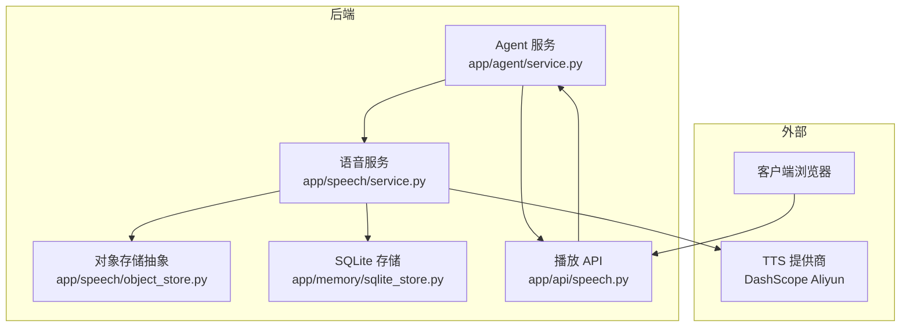
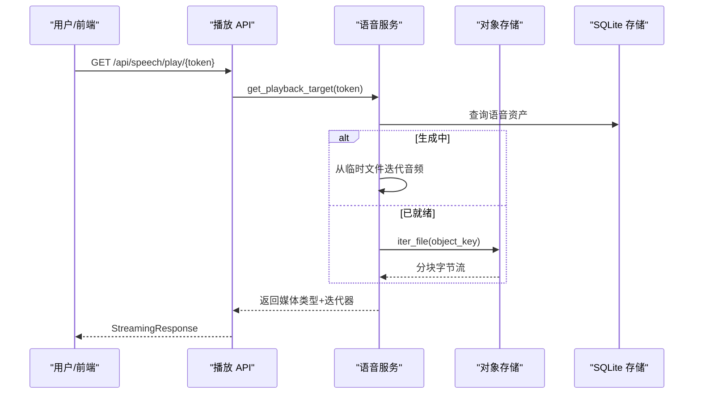
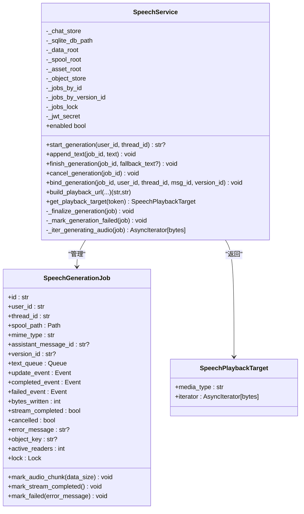
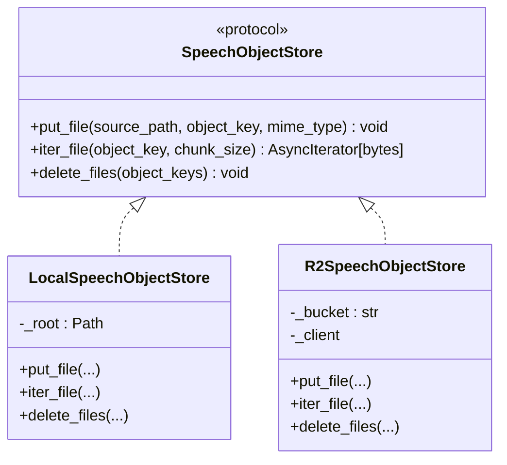
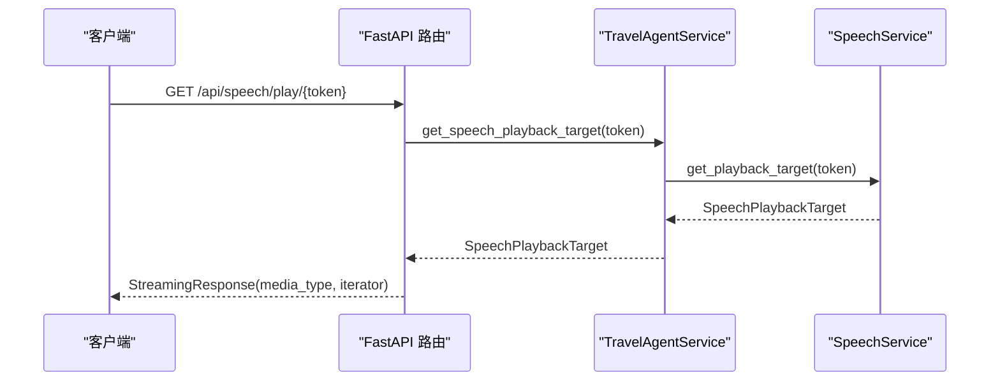
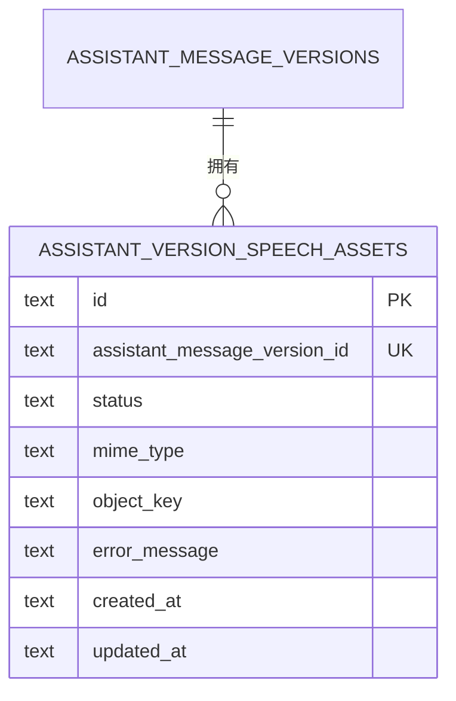
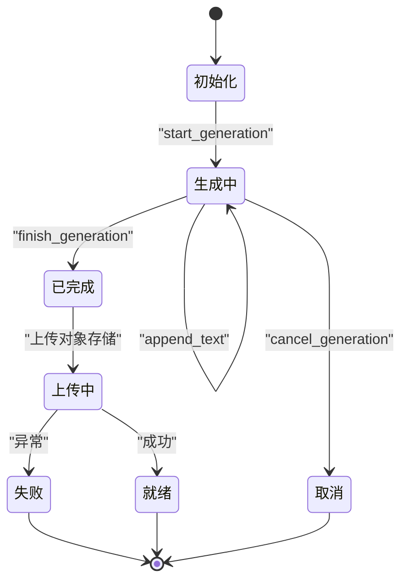
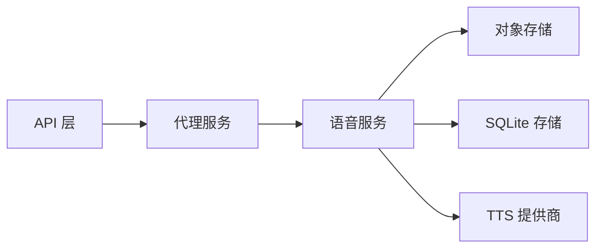

# 语音服务

<cite>
**本文引用的文件**
- [backend/app/speech/service.py](file://backend/app/speech/service.py)
- [backend/app/speech/object_store.py](file://backend/app/speech/object_store.py)
- [backend/app/api/speech.py](file://backend/app/api/speech.py)
- [backend/app/memory/sqlite_store.py](file://backend/app/memory/sqlite_store.py)
- [backend/app/agent/service.py](file://backend/app/agent/service.py)
- [backend/migrations/004_chat_speech_assets.sql](file://backend/migrations/004_chat_speech_assets.sql)
- [backend/tests/test_speech_service.py](file://backend/tests/test_speech_service.py)
</cite>

## 目录
1. [简介](#简介)
2. [项目结构](#项目结构)
3. [核心组件](#核心组件)
4. [架构总览](#架构总览)
5. [详细组件分析](#详细组件分析)
6. [依赖分析](#依赖分析)
7. [性能考虑](#性能考虑)
8. [故障排除指南](#故障排除指南)
9. [结论](#结论)
10. [附录](#附录)

## 简介
本文件系统性阐述语音服务的设计与实现，覆盖语音合成服务的集成架构、音频对象存储、播放控制机制。重点解释语音生成流程、缓存与存储策略、资产生命周期管理、URL 生成与播放状态跟踪，并提供配置、性能优化与错误处理的最佳实践，以及如何集成新的 TTS 服务提供商与扩展现有功能。

## 项目结构
语音服务位于后端模块中，围绕“生成-持久化-播放”三段式流程组织：
- 语音服务：负责生成任务调度、状态跟踪、持久化与播放令牌签发
- 对象存储：抽象本地磁盘与云存储（R2）两种实现
- API 层：对外暴露播放接口，基于短时 JWT 令牌鉴权
- 数据层：通过 SQLite 存储语音资产元数据，支持按会话维度清理
- 代理服务：作为门面，串联 LLM 流水线与语音服务

图表来源
- [backend/app/agent/service.py:97-114](file://backend/app/agent/service.py#L97-L114)
- [backend/app/speech/service.py:90-106](file://backend/app/speech/service.py#L90-L106)
- [backend/app/speech/object_store.py:122-138](file://backend/app/speech/object_store.py#L122-L138)
- [backend/app/api/speech.py:15-34](file://backend/app/api/speech.py#L15-L34)

章节来源
- [backend/app/agent/service.py:97-114](file://backend/app/agent/service.py#L97-L114)
- [backend/app/speech/service.py:90-106](file://backend/app/speech/service.py#L90-L106)
- [backend/app/speech/object_store.py:122-138](file://backend/app/speech/object_store.py#L122-L138)
- [backend/app/api/speech.py:15-34](file://backend/app/api/speech.py#L15-L34)

## 核心组件
- 语音服务（SpeechService）
  - 任务生命周期：启动、追加文本、结束、取消、收尾
  - 生成器：基于 DashScope 的实时 TTS 推流回调
  - 持久化：本地磁盘或 R2 对象存储
  - 播放控制：JWT 短时令牌签发与校验，流式返回音频
- 对象存储（SpeechObjectStore）
  - 协议抽象：put_file、iter_file、delete_files
  - 本地实现：同步复制到目标路径
  - R2 实现：基于 boto3 的上传、分块读取与批量删除
- API 层（/api/speech/play/{token}）
  - 鉴权：校验 JWT 与用途
  - 流式响应：返回媒体类型与字节流
- 数据层（SQLite）
  - 语音资产表：按 assistant 版本维度记录状态、MIME、对象键与错误信息
  - 会话维度：支持按 thread_id 收集与删除语音对象键
- 代理服务（TravelAgentService）
  - 门面：协调 LLM 流水线与语音服务
  - 生命周期：在会话删除时联动清理对象存储

章节来源
- [backend/app/speech/service.py:90-126](file://backend/app/speech/service.py#L90-L126)
- [backend/app/speech/object_store.py:12-21](file://backend/app/speech/object_store.py#L12-L21)
- [backend/app/api/speech.py:15-34](file://backend/app/api/speech.py#L15-L34)
- [backend/app/memory/sqlite_store.py:1155-1205](file://backend/app/memory/sqlite_store.py#L1155-L1205)
- [backend/app/agent/service.py:168-176](file://backend/app/agent/service.py#L168-L176)

## 架构总览
语音服务采用“事件驱动 + 异步 IO”的架构：
- 生成阶段：主线程维护任务队列，工作线程调用 TTS SDK 推流，边写本地临时文件边更新状态
- 持久化阶段：生成完成后异步上传至对象存储，更新资产状态为 ready
- 播放阶段：客户端通过短时令牌访问播放接口，服务端根据状态选择从对象存储或本地临时文件流式返回

图表来源
- [backend/app/api/speech.py:15-34](file://backend/app/api/speech.py#L15-L34)
- [backend/app/speech/service.py:270-296](file://backend/app/speech/service.py#L270-L296)
- [backend/app/speech/object_store.py:40-50](file://backend/app/speech/object_store.py#L40-L50)
- [backend/app/memory/sqlite_store.py:1207-1210](file://backend/app/memory/sqlite_store.py#L1207-L1210)

## 详细组件分析

### 语音服务（SpeechService）
职责与流程
- 启动生成：创建任务、分配 spool 文件、启动工作线程
- 文本追加：将文本片段写入队列，驱动生成器持续推流
- 完成与收尾：触发 streaming_complete，上传对象存储，更新状态为 ready
- 取消与清理：标记失败、清理临时文件、移除内存索引
- 播放控制：签发短期 JWT，校验后返回媒体类型与迭代器

关键数据结构
- 任务对象（SpeechGenerationJob）：线程安全的状态、计数、锁与事件
- 播放目标（SpeechPlaybackTarget）：媒体类型与异步迭代器

图表来源
- [backend/app/speech/service.py:33-87](file://backend/app/speech/service.py#L33-L87)
- [backend/app/speech/service.py:90-126](file://backend/app/speech/service.py#L90-L126)
- [backend/app/speech/service.py:270-296](file://backend/app/speech/service.py#L270-L296)

章节来源
- [backend/app/speech/service.py:145-224](file://backend/app/speech/service.py#L145-L224)
- [backend/app/speech/service.py:298-371](file://backend/app/speech/service.py#L298-L371)
- [backend/app/speech/service.py:387-421](file://backend/app/speech/service.py#L387-L421)
- [backend/app/speech/service.py:422-454](file://backend/app/speech/service.py#L422-L454)
- [backend/app/speech/service.py:461-477](file://backend/app/speech/service.py#L461-L477)

### 对象存储（SpeechObjectStore）
设计要点
- 协议抽象：统一 put/iter/delete 接口，便于替换实现
- 本地实现：直接复制到目标路径，适合开发与小规模部署
- R2 实现：基于 boto3 的上传、分块读取与批量删除，适合生产

图表来源
- [backend/app/speech/object_store.py:12-21](file://backend/app/speech/object_store.py#L12-L21)
- [backend/app/speech/object_store.py:23-61](file://backend/app/speech/object_store.py#L23-L61)
- [backend/app/speech/object_store.py:64-119](file://backend/app/speech/object_store.py#L64-L119)
- [backend/app/speech/object_store.py:122-138](file://backend/app/speech/object_store.py#L122-L138)

章节来源
- [backend/app/speech/object_store.py:12-21](file://backend/app/speech/object_store.py#L12-L21)
- [backend/app/speech/object_store.py:23-61](file://backend/app/speech/object_store.py#L23-L61)
- [backend/app/speech/object_store.py:64-119](file://backend/app/speech/object_store.py#L64-L119)
- [backend/app/speech/object_store.py:122-138](file://backend/app/speech/object_store.py#L122-L138)

### 播放 API（/api/speech/play/{token}）
流程
- 校验 JWT：解码并验证用途、过期时间与签名
- 获取播放目标：根据版本号定位资产或临时文件
- 返回流式响应：设置媒体类型与禁用缓存头

图表来源
- [backend/app/api/speech.py:15-34](file://backend/app/api/speech.py#L15-L34)
- [backend/app/agent/service.py:208-210](file://backend/app/agent/service.py#L208-L210)
- [backend/app/speech/service.py:270-296](file://backend/app/speech/service.py#L270-L296)

章节来源
- [backend/app/api/speech.py:15-34](file://backend/app/api/speech.py#L15-L34)
- [backend/app/agent/service.py:208-210](file://backend/app/agent/service.py#L208-L210)

### 数据模型与生命周期（SQLite）
语音资产表
- 主键：语音资产记录 id
- 外键：assistant_message_versions.id
- 字段：状态（generating/ready/failed）、MIME 类型、对象键、错误信息、时间戳
- 约束：状态枚举校验

图表来源
- [backend/migrations/004_chat_speech_assets.sql:1-11](file://backend/migrations/004_chat_speech_assets.sql#L1-L11)

资产生命周期
- 创建：开始生成时插入状态 generating
- 更新：生成中持续写入，完成后尝试上传对象存储
- 成功：上传成功后状态转 ready，记录对象键
- 失败：生成异常或上传异常，状态转 failed，保留错误信息
- 清理：按会话删除时，先收集对象键再删除数据库记录，最后删除对象存储文件

章节来源
- [backend/migrations/004_chat_speech_assets.sql:1-11](file://backend/migrations/004_chat_speech_assets.sql#L1-L11)
- [backend/app/memory/sqlite_store.py:1155-1205](file://backend/app/memory/sqlite_store.py#L1155-L1205)
- [backend/app/speech/service.py:134-143](file://backend/app/speech/service.py#L134-L143)
- [backend/app/agent/service.py:168-176](file://backend/app/agent/service.py#L168-L176)

### 生成流程与状态机

图表来源
- [backend/app/speech/service.py:145-224](file://backend/app/speech/service.py#L145-L224)
- [backend/app/speech/service.py:387-421](file://backend/app/speech/service.py#L387-L421)

## 依赖分析
- 组件耦合
  - 语音服务依赖对象存储协议与 SQLite 存储
  - API 层依赖代理服务以解耦业务与传输
  - 代理服务作为门面，串联 LLM 与语音服务
- 外部依赖
  - TTS 提供商：DashScope Aliyun（WebSocket 推流）
  - 对象存储：本地磁盘或 Cloudflare R2（boto3）
  - 认证：JWT（HS256）

图表来源
- [backend/app/api/speech.py:15-34](file://backend/app/api/speech.py#L15-L34)
- [backend/app/agent/service.py:97-114](file://backend/app/agent/service.py#L97-L114)
- [backend/app/speech/service.py:90-106](file://backend/app/speech/service.py#L90-L106)

章节来源
- [backend/app/agent/service.py:97-114](file://backend/app/agent/service.py#L97-L114)
- [backend/app/speech/service.py:90-106](file://backend/app/speech/service.py#L90-L106)
- [backend/app/speech/object_store.py:75-84](file://backend/app/speech/object_store.py#L75-L84)

## 性能考虑
- I/O 与并发
  - 使用异步迭代器与线程隔离生成器，避免阻塞事件循环
  - 上传与下载采用分块读取，降低内存峰值
- 缓存与存储
  - 生成期间写入本地 spool 文件，减少内存占用
  - 对象存储优先使用 R2，提升跨地域访问性能
- 任务管理
  - 任务状态事件驱动，避免轮询
  - 播放并发读取时，使用活动读者计数与延迟清理策略
- 配置建议
  - 生产环境启用 R2 并配置合适的 chunk_size
  - 设置合理的 JWT TTL，平衡安全性与可用性
  - 在高并发场景下，适当增加生成器线程池大小（如可行）

## 故障排除指南
常见问题与处理
- 服务不可用
  - 现象：语音服务不可用
  - 原因：缺少 TTS API 密钥或 JWT 密钥
  - 处理：检查环境变量 ALIYUN_TTS_API_KEY 与 JWT_SECRET
- 播放失败
  - 现象：播放接口返回 401/404/409
  - 原因：令牌无效、资产不存在、资产不可用
  - 处理：确认令牌用途与签名、检查资产状态是否为 ready
- 生成异常
  - 现象：状态停留在 generating 或失败
  - 原因：TTS 推流异常、上传失败
  - 处理：查看失败错误信息，重试或回滚版本
- 资源清理
  - 现象：会话删除后仍有残留文件
  - 处理：确保按顺序收集对象键并删除，再删除数据库记录

章节来源
- [backend/tests/test_speech_service.py:7-18](file://backend/tests/test_speech_service.py#L7-L18)
- [backend/app/api/speech.py:21-28](file://backend/app/api/speech.py#L21-L28)
- [backend/app/speech/service.py:373-385](file://backend/app/speech/service.py#L373-L385)
- [backend/app/speech/service.py:461-477](file://backend/app/speech/service.py#L461-L477)

## 结论
该语音服务通过清晰的职责划分与协议抽象，实现了从生成、持久化到播放的完整闭环。其事件驱动与异步 I/O 设计兼顾了实时性与可扩展性，对象存储与数据库的分离使得部署灵活、易于迁移。遵循本文最佳实践，可在保证稳定性的同时平滑扩展新的 TTS 提供商与功能。

## 附录

### 集成新的 TTS 服务提供商
步骤
- 实现生成器接口：参考 DashScope 回调模式，定义 on_data/on_complete/on_error
- 替换或扩展 Runner：在 _create_runner 中注入新提供商的参数与格式
- 配置环境变量：新增必要的密钥与端点
- 测试与验证：覆盖启动、生成、失败与取消等场景

章节来源
- [backend/app/speech/service.py:322-371](file://backend/app/speech/service.py#L322-L371)

### 扩展对象存储实现
步骤
- 实现协议方法：put_file、iter_file、delete_files
- 在工厂函数中注册：在 build_speech_object_store 中添加条件分支
- 配置环境变量：R2 或其他云厂商的凭据
- 验证分块读取与批量删除逻辑

章节来源
- [backend/app/speech/object_store.py:12-21](file://backend/app/speech/object_store.py#L12-L21)
- [backend/app/speech/object_store.py:122-138](file://backend/app/speech/object_store.py#L122-L138)