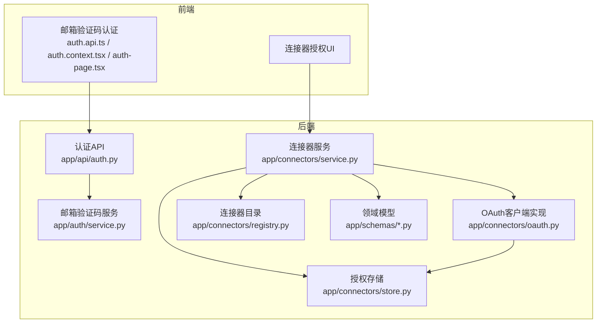
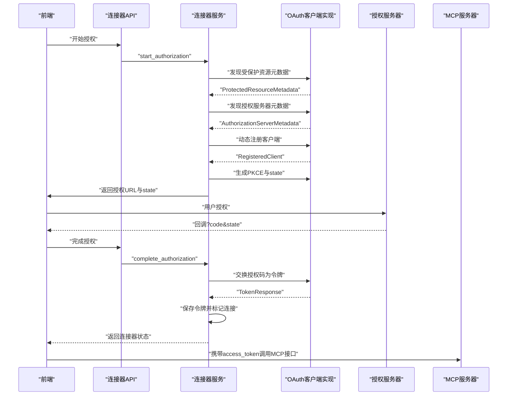
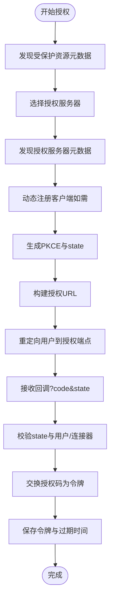
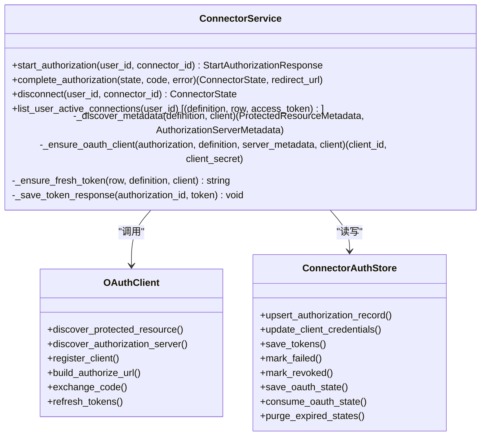
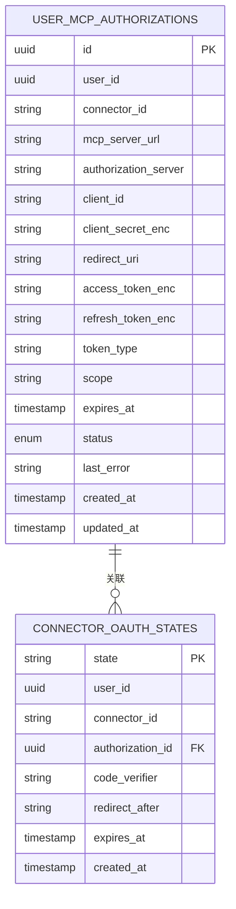
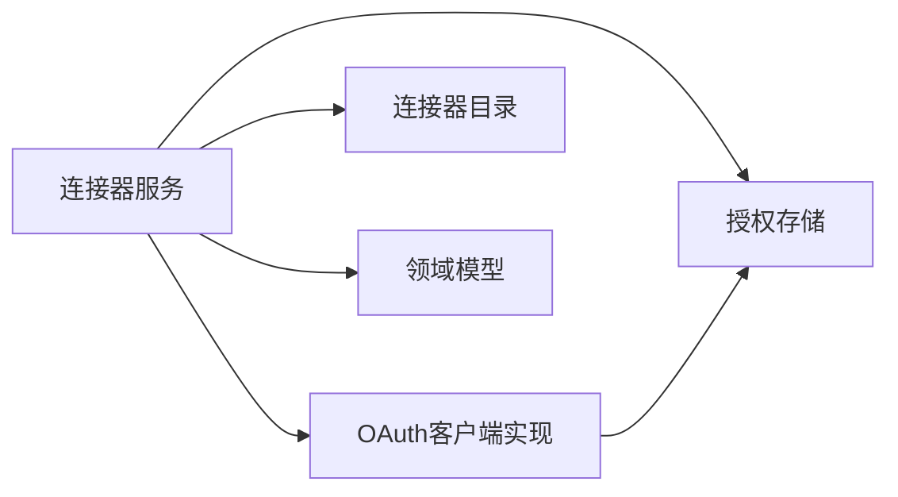

# OAuth认证集成

<cite>
**本文档引用的文件**
- [backend/app/connectors/oauth.py](file://backend/app/connectors/oauth.py)
- [backend/app/connectors/service.py](file://backend/app/connectors/service.py)
- [backend/app/connectors/store.py](file://backend/app/connectors/store.py)
- [backend/app/connectors/registry.py](file://backend/app/connectors/registry.py)
- [backend/app/schemas/connectors.py](file://backend/app/schemas/connectors.py)
- [backend/config/connectors.example.json](file://backend/config/connectors.example.json)
- [docs/oauth流程调研.md](file://docs/oauth流程调研.md)
- [backend/app/api/auth.py](file://backend/app/api/auth.py)
- [backend/app/auth/service.py](file://backend/app/auth/service.py)
- [backend/app/schemas/auth.py](file://backend/app/schemas/auth.py)
- [frontend/src/features/auth/api/auth.api.ts](file://frontend/src/features/auth/api/auth.api.ts)
- [frontend/src/features/auth/model/auth.context.tsx](file://frontend/src/features/auth/model/auth.context.tsx)
- [frontend/src/features/auth/ui/auth-page.tsx](file://frontend/src/features/auth/ui/auth-page.tsx)
</cite>

## 目录
1. [简介](#简介)
2. [项目结构](#项目结构)
3. [核心组件](#核心组件)
4. [架构总览](#架构总览)
5. [详细组件分析](#详细组件分析)
6. [依赖关系分析](#依赖关系分析)
7. [性能考量](#性能考量)
8. [故障排查指南](#故障排查指南)
9. [结论](#结论)
10. [附录](#附录)

## 简介
本文件面向OAuth 2.1与OpenID Connect集成场景，系统性梳理后端OAuth客户端实现、授权服务器发现机制、PKCE安全流程、客户端注册、令牌交换与自动刷新、撤销机制，以及授权URL构建、状态参数管理与回调处理。文档同时提供OAuth配置最佳实践、安全考虑、错误处理策略，并说明如何集成新的OAuth提供商与自定义认证流程。

## 项目结构
后端采用分层设计：
- 协议实现层：OAuth 2.1/OIDC客户端实现（发现、动态注册、授权码、PKCE、令牌交换、刷新）
- 业务编排层：连接器授权流程编排（启动授权、完成授权、自动刷新、断开授权）
- 数据持久层：SQLite存储授权记录与OAuth状态
- 前端集成层：邮箱验证码认证与OAuth授权流程的前端交互

**图表来源**
- [backend/app/connectors/service.py:74-407](file://backend/app/connectors/service.py#L74-L407)
- [backend/app/connectors/oauth.py:1-419](file://backend/app/connectors/oauth.py#L1-L419)
- [backend/app/connectors/store.py:78-349](file://backend/app/connectors/store.py#L78-L349)
- [backend/app/connectors/registry.py:23-62](file://backend/app/connectors/registry.py#L23-L62)
- [backend/app/schemas/connectors.py:1-51](file://backend/app/schemas/connectors.py#L1-L51)
- [backend/app/api/auth.py:1-36](file://backend/app/api/auth.py#L1-L36)
- [backend/app/auth/service.py:49-312](file://backend/app/auth/service.py#L49-L312)
- [frontend/src/features/auth/api/auth.api.ts:1-21](file://frontend/src/features/auth/api/auth.api.ts#L1-L21)
- [frontend/src/features/auth/model/auth.context.tsx:1-155](file://frontend/src/features/auth/model/auth.context.tsx#L1-L155)
- [frontend/src/features/auth/ui/auth-page.tsx:1-233](file://frontend/src/features/auth/ui/auth-page.tsx#L1-L233)

**章节来源**
- [backend/app/connectors/service.py:74-407](file://backend/app/connectors/service.py#L74-L407)
- [backend/app/connectors/oauth.py:1-419](file://backend/app/connectors/oauth.py#L1-L419)
- [backend/app/connectors/store.py:78-349](file://backend/app/connectors/store.py#L78-L349)
- [backend/app/connectors/registry.py:23-62](file://backend/app/connectors/registry.py#L23-L62)
- [backend/app/schemas/connectors.py:1-51](file://backend/app/schemas/connectors.py#L1-L51)
- [backend/app/api/auth.py:1-36](file://backend/app/api/auth.py#L1-L36)
- [backend/app/auth/service.py:49-312](file://backend/app/auth/service.py#L49-L312)
- [frontend/src/features/auth/api/auth.api.ts:1-21](file://frontend/src/features/auth/api/auth.api.ts#L1-L21)
- [frontend/src/features/auth/model/auth.context.tsx:1-155](file://frontend/src/features/auth/model/auth.context.tsx#L1-L155)
- [frontend/src/features/auth/ui/auth-page.tsx:1-233](file://frontend/src/features/auth/ui/auth-page.tsx#L1-L233)

## 核心组件
- OAuth客户端实现：负责授权服务器发现、动态注册、PKCE生成、授权URL构建、授权码交换令牌、刷新令牌、撤销机制等
- 连接器服务：编排OAuth流程，包括启动授权、完成授权、自动刷新、断开授权
- 授权存储：持久化用户授权记录、OAuth状态、令牌与密钥
- 连接器目录：管理员维护的连接器清单与默认Scope
- 领域模型：定义连接器状态、授权状态、响应模型
- 前端认证：邮箱验证码认证与OAuth授权流程的前端交互

**章节来源**
- [backend/app/connectors/oauth.py:1-419](file://backend/app/connectors/oauth.py#L1-L419)
- [backend/app/connectors/service.py:74-407](file://backend/app/connectors/service.py#L74-L407)
- [backend/app/connectors/store.py:78-349](file://backend/app/connectors/store.py#L78-L349)
- [backend/app/connectors/registry.py:23-62](file://backend/app/connectors/registry.py#L23-L62)
- [backend/app/schemas/connectors.py:1-51](file://backend/app/schemas/connectors.py#L1-L51)

## 架构总览
整体流程遵循MCP授权规范，结合OAuth 2.1与OpenID Connect要素，实现从“受保护资源”到“授权服务器”的发现、动态注册、授权码与PKCE交换、令牌刷新与撤销。

**图表来源**
- [backend/app/connectors/service.py:108-230](file://backend/app/connectors/service.py#L108-L230)
- [backend/app/connectors/oauth.py:123-217](file://backend/app/connectors/oauth.py#L123-L217)
- [backend/app/connectors/oauth.py:220-269](file://backend/app/connectors/oauth.py#L220-L269)
- [backend/app/connectors/oauth.py:271-295](file://backend/app/connectors/oauth.py#L271-L295)
- [backend/app/connectors/oauth.py:297-382](file://backend/app/connectors/oauth.py#L297-L382)
- [docs/oauth流程调研.md:1-360](file://docs/oauth流程调研.md#L1-L360)

## 详细组件分析

### OAuth客户端实现（协议与安全）
- 授权服务器发现：支持RFC 9728受保护资源元数据与RFC 8414授权服务器元数据的多种well-known路径
- 动态客户端注册：遵循RFC 7591，支持Basic鉴权与必要字段
- PKCE安全流程：生成verifier/challenge，仅在本地保存verifier，challenge发往授权端点
- 授权URL构建：组装response_type、client_id、redirect_uri、state、code_challenge、resource、scope
- 令牌交换与刷新：支持authorization_code与refresh_token，携带resource绑定令牌
- 令牌响应处理：计算expires_at并保存，支持refresh_token与scope
- 状态参数管理：生成state并持久化，回调时校验state与用户/连接器匹配，防止CSRF与重放攻击

**图表来源**
- [backend/app/connectors/oauth.py:123-217](file://backend/app/connectors/oauth.py#L123-L217)
- [backend/app/connectors/oauth.py:220-269](file://backend/app/connectors/oauth.py#L220-L269)
- [backend/app/connectors/oauth.py:271-295](file://backend/app/connectors/oauth.py#L271-L295)
- [backend/app/connectors/oauth.py:297-382](file://backend/app/connectors/oauth.py#L297-L382)
- [backend/app/connectors/service.py:108-175](file://backend/app/connectors/service.py#L108-L175)
- [backend/app/connectors/service.py:176-230](file://backend/app/connectors/service.py#L176-L230)

**章节来源**
- [backend/app/connectors/oauth.py:1-419](file://backend/app/connectors/oauth.py#L1-L419)
- [docs/oauth流程调研.md:1-360](file://docs/oauth流程调研.md#L1-L360)

### 连接器服务（业务编排）
- 启动授权：发现元数据、确保客户端凭据、生成PKCE与state、构建授权URL、持久化OAuth状态
- 完成授权：消费state、校验回调参数、交换令牌、保存令牌并更新状态
- 自动刷新：根据expires_at判断是否需要刷新，使用refresh_token刷新access_token
- 断开授权：标记授权记录为revoked并清理令牌
- 列表与状态：聚合连接器状态，区分disconnected/connected/expired/failed/revoked

**图表来源**
- [backend/app/connectors/service.py:74-407](file://backend/app/connectors/service.py#L74-L407)
- [backend/app/connectors/oauth.py:1-419](file://backend/app/connectors/oauth.py#L1-L419)
- [backend/app/connectors/store.py:78-349](file://backend/app/connectors/store.py#L78-L349)

**章节来源**
- [backend/app/connectors/service.py:74-407](file://backend/app/connectors/service.py#L74-L407)

### 授权存储（数据模型与持久化）
- 授权记录表：保存用户、连接器、MCP服务器URL、授权服务器、客户端凭据、令牌、作用域、过期时间、状态与错误信息
- OAuth状态表：保存state、用户、连接器、授权记录关联、code_verifier、回调后跳转地址、过期时间
- 关键操作：插入/更新授权记录、保存令牌、标记失败/撤销、保存与消费OAuth状态、清理过期状态

**图表来源**
- [backend/app/connectors/store.py:19-76](file://backend/app/connectors/store.py#L19-L76)
- [backend/app/connectors/store.py:42-54](file://backend/app/connectors/store.py#L42-L54)

**章节来源**
- [backend/app/connectors/store.py:78-349](file://backend/app/connectors/store.py#L78-L349)

### 连接器目录与配置
- 管理员通过JSON配置连接器清单，包含显示名、描述、图标、MCP服务器URL、默认Scope、启用状态
- 运行时加载配置并进行校验，提供按字母序的启用列表

**章节来源**
- [backend/app/connectors/registry.py:23-62](file://backend/app/connectors/registry.py#L23-L62)
- [backend/config/connectors.example.json:1-25](file://backend/config/connectors.example.json#L1-L25)

### 前端认证与OAuth集成
- 邮箱验证码认证：前端通过API发送验证码、校验验证码并获取JWT
- OAuth授权流程：前端触发授权、接收授权URL、处理回调、保存令牌并更新用户状态
- 安全考虑：前端不持有密钥，所有敏感操作在后端完成

**章节来源**
- [frontend/src/features/auth/api/auth.api.ts:1-21](file://frontend/src/features/auth/api/auth.api.ts#L1-L21)
- [frontend/src/features/auth/model/auth.context.tsx:1-155](file://frontend/src/features/auth/model/auth.context.tsx#L1-L155)
- [frontend/src/features/auth/ui/auth-page.tsx:1-233](file://frontend/src/features/auth/ui/auth-page.tsx#L1-L233)
- [backend/app/api/auth.py:1-36](file://backend/app/api/auth.py#L1-L36)
- [backend/app/auth/service.py:49-312](file://backend/app/auth/service.py#L49-L312)

## 依赖关系分析
- 连接器服务依赖OAuth客户端实现、授权存储、连接器目录与领域模型
- OAuth客户端实现依赖HTTP客户端与工具函数（PKCE、state、URI规范化）
- 授权存储提供事务性读写，保证授权状态一致性
- 前端通过API与后端交互，后端内部模块间耦合度低，职责清晰

**图表来源**
- [backend/app/connectors/service.py:14-42](file://backend/app/connectors/service.py#L14-L42)
- [backend/app/connectors/oauth.py:11-25](file://backend/app/connectors/oauth.py#L11-L25)
- [backend/app/connectors/store.py:1-17](file://backend/app/connectors/store.py#L1-L17)

**章节来源**
- [backend/app/connectors/service.py:14-42](file://backend/app/connectors/service.py#L14-L42)
- [backend/app/connectors/oauth.py:11-25](file://backend/app/connectors/oauth.py#L11-L25)
- [backend/app/connectors/store.py:1-17](file://backend/app/connectors/store.py#L1-L17)

## 性能考量
- 异步HTTP客户端：使用httpx异步客户端减少I/O阻塞，提升并发能力
- 令牌刷新策略：在接近过期时自动刷新，避免临界点导致的请求失败
- 状态清理：定期清理过期OAuth状态，降低存储压力
- 缓存与重试：合理设置超时与跟随重定向，平衡可靠性与延迟

[本节为通用指导，无需具体文件引用]

## 故障排查指南
- 授权服务器发现失败：检查MCP服务器的well-known端点可达性与响应格式
- 动态注册失败：确认授权服务器支持DCR且redirect_uris与注册时一致
- 回调state无效：检查state是否被消费、是否与用户/连接器匹配、是否过期
- 令牌交换失败：核对client_id/client_secret、PKCE verifier、redirect_uri与授权时一致
- 刷新失败：确认refresh_token存在且未被撤销，授权服务器支持refresh_token
- 前端认证问题：邮箱验证码发送失败通常与SMTP配置有关，检查主机、端口、TLS模式与凭据

**章节来源**
- [backend/app/connectors/service.py:121-127](file://backend/app/connectors/service.py#L121-L127)
- [backend/app/connectors/service.py:190-197](file://backend/app/connectors/service.py#L190-L197)
- [backend/app/connectors/service.py:221-224](file://backend/app/connectors/service.py#L221-L224)
- [backend/app/connectors/service.py:357-361](file://backend/app/connectors/service.py#L357-L361)
- [backend/app/auth/service.py:102-121](file://backend/app/auth/service.py#L102-L121)

## 结论
该OAuth认证集成方案严格遵循MCP与OAuth 2.1/OIDC规范，实现了从受保护资源到授权服务器的自动化发现、动态注册、PKCE安全授权、令牌交换与自动刷新、撤销机制。通过清晰的模块划分与完善的错误处理，系统具备良好的可维护性与扩展性。建议在生产环境中强化密钥轮换、监控与日志审计，并持续关注OAuth新规范演进。

[本节为总结性内容，无需具体文件引用]

## 附录

### OAuth配置最佳实践
- 环境变量
  - 必填：CONNECTOR_REDIRECT_URL、CONNECTOR_FRONTEND_RETURN_URL
  - 可选：CONNECTOR_CLIENT_URI、CONNECTOR_CLIENT_LOGO_URI、CONNECTOR_CLIENT_NAME_SUFFIX
- 连接器配置
  - 使用connectors.json维护连接器清单，明确MCP服务器URL与默认Scope
  - 启用/禁用连接器由管理员控制
- 安全配置
  - 使用HTTPS与强密码
  - 限制redirect_uris与前端return_url，避免localhost兜底
  - 定期轮换JWT密钥与客户端密钥

**章节来源**
- [backend/app/connectors/service.py:80-84](file://backend/app/connectors/service.py#L80-L84)
- [backend/config/connectors.example.json:1-25](file://backend/config/connectors.example.json#L1-L25)
- [backend/app/auth/service.py:59-64](file://backend/app/auth/service.py#L59-L64)

### 集成新的OAuth提供商步骤
- 确认MCP服务器暴露RFC 9728与RFC 8414端点
- 在connectors.json中添加连接器定义
- 部署时配置CONNECTOR_REDIRECT_URL与CONNECTOR_FRONTEND_RETURN_URL
- 如授权服务器不支持DCR，需预先准备client_id与client_secret
- 前端根据返回的authorize_url引导用户授权

**章节来源**
- [docs/oauth流程调研.md:310-360](file://docs/oauth流程调研.md#L310-L360)
- [backend/app/connectors/registry.py:29-47](file://backend/app/connectors/registry.py#L29-L47)
- [backend/app/connectors/service.py:108-175](file://backend/app/connectors/service.py#L108-L175)

### 自定义认证流程建议
- 若需替代邮箱验证码，可在前端新增认证入口并通过后端API完成登录
- 保持后端认证服务独立于OAuth流程，避免密钥泄露风险
- 扩展领域模型与API以支持多因子认证或第三方SSO

**章节来源**
- [frontend/src/features/auth/api/auth.api.ts:1-21](file://frontend/src/features/auth/api/auth.api.ts#L1-L21)
- [backend/app/api/auth.py:1-36](file://backend/app/api/auth.py#L1-L36)
- [backend/app/auth/service.py:49-312](file://backend/app/auth/service.py#L49-L312)