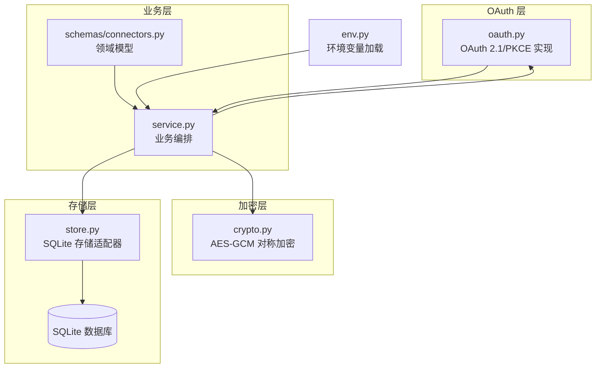
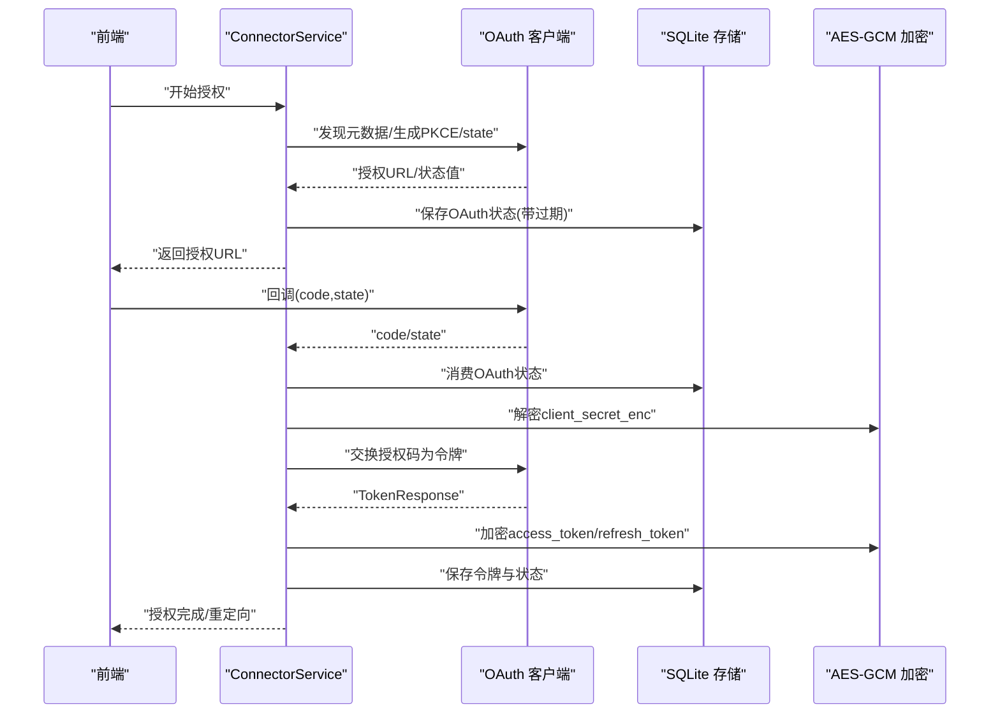
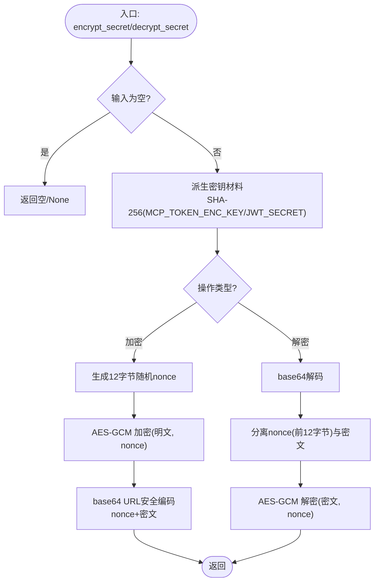
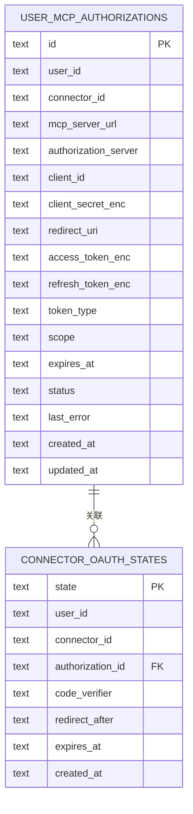
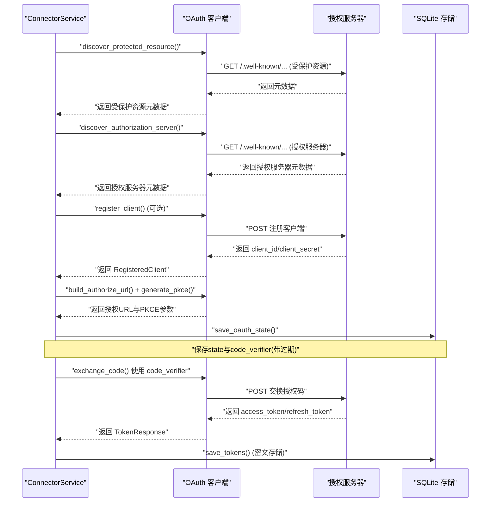
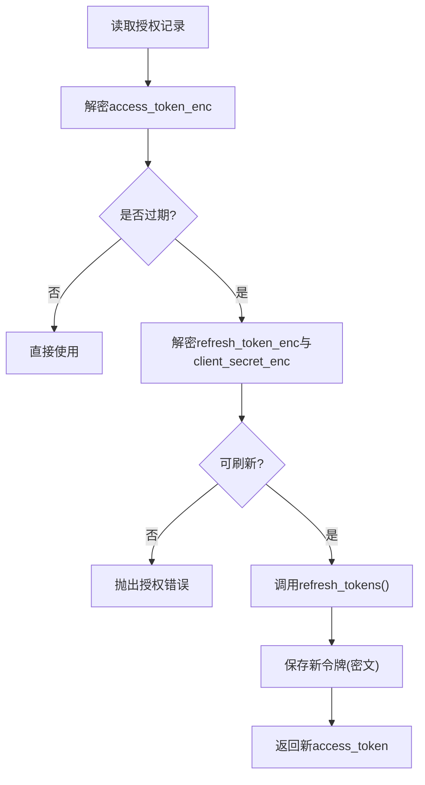
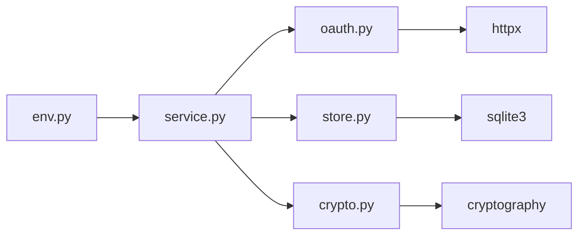

# 加密存储管理

<cite>
**本文档引用的文件**
- [backend/app/connectors/crypto.py](file://backend/app/connectors/crypto.py)
- [backend/app/connectors/store.py](file://backend/app/connectors/store.py)
- [backend/app/connectors/oauth.py](file://backend/app/connectors/oauth.py)
- [backend/app/connectors/service.py](file://backend/app/connectors/service.py)
- [backend/app/schemas/connectors.py](file://backend/app/schemas/connectors.py)
- [backend/migrations/006_user_mcp_authorizations.sql](file://backend/migrations/006_user_mcp_authorizations.sql)
- [backend/tests/test_connectors_crypto.py](file://backend/tests/test_connectors_crypto.py)
- [backend/app/env.py](file://backend/app/env.py)
</cite>

## 目录
1. [简介](#简介)
2. [项目结构](#项目结构)
3. [核心组件](#核心组件)
4. [架构概览](#架构概览)
5. [详细组件分析](#详细组件分析)
6. [依赖关系分析](#依赖关系分析)
7. [性能考虑](#性能考虑)
8. [故障排查指南](#故障排查指南)
9. [结论](#结论)
10. [附录](#附录)

## 简介
本文件面向加密存储管理系统，聚焦以下目标：
- 解释敏感数据加密算法与密钥管理策略
- 说明OAuth客户端密钥、访问令牌、刷新令牌的加密存储方案
- 描述加密/解密流程、密钥轮换、数据完整性验证的实现
- 提供存储配置、性能优化与安全审计方法
- 说明如何扩展加密算法与存储后端

系统采用对称加密保护敏感字段，结合SQLite持久化与OAuth 2.1/PKCE流程，确保凭证在传输与静态存储阶段的安全性。

## 项目结构
围绕加密存储的关键模块如下：
- 加密模块：负责AES-GCM对称加密与密钥派生
- 存储模块：SQLite表结构与CRUD操作封装
- OAuth模块：OAuth 2.1元数据发现、DCR、授权码与令牌刷新
- 业务服务模块：编排加密、存储与OAuth流程
- 数据模型：定义授权状态与连接器状态
- 迁移脚本：定义user_mcp_authorizations与connector_oauth_states表结构
- 测试：覆盖加密/解密往返、密钥回退与错误场景

图表来源
- [backend/app/connectors/crypto.py:1-55](file://backend/app/connectors/crypto.py#L1-L55)
- [backend/app/connectors/store.py:1-349](file://backend/app/connectors/store.py#L1-L349)
- [backend/app/connectors/oauth.py:1-419](file://backend/app/connectors/oauth.py#L1-L419)
- [backend/app/connectors/service.py:1-421](file://backend/app/connectors/service.py#L1-L421)
- [backend/app/schemas/connectors.py:1-54](file://backend/app/schemas/connectors.py#L1-L54)
- [backend/app/env.py:1-18](file://backend/app/env.py#L1-L18)

章节来源
- [backend/app/connectors/crypto.py:1-55](file://backend/app/connectors/crypto.py#L1-L55)
- [backend/app/connectors/store.py:1-349](file://backend/app/connectors/store.py#L1-L349)
- [backend/app/connectors/oauth.py:1-419](file://backend/app/connectors/oauth.py#L1-L419)
- [backend/app/connectors/service.py:1-421](file://backend/app/connectors/service.py#L1-L421)
- [backend/app/schemas/connectors.py:1-54](file://backend/app/schemas/connectors.py#L1-L54)
- [backend/migrations/006_user_mcp_authorizations.sql:1-44](file://backend/migrations/006_user_mcp_authorizations.sql#L1-L44)
- [backend/app/env.py:1-18](file://backend/app/env.py#L1-L18)

## 核心组件
- 对称加密与密钥管理
  - 使用AES-256-GCM进行加密，密钥通过SHA-256从环境变量派生
  - 支持独立密钥轮换：优先使用MCP_TOKEN_ENC_KEY；缺失时回退到JWT_SECRET
  - 密钥材料缓存，避免重复派生
- SQLite存储适配器
  - 提供授权记录与OAuth状态的增删改查
  - 敏感字段均以密文形式存储（client_secret_enc、access_token_enc、refresh_token_enc）
  - 外键约束与索引保证数据一致性与查询效率
- OAuth 2.1编排
  - 自动发现受保护资源与授权服务器元数据
  - 动态客户端注册（DCR）、PKCE、授权码交换与令牌刷新
  - 严格的状态机与错误处理
- 业务服务
  - 协调加密、存储与OAuth流程
  - 按需刷新访问令牌，处理过期与失败场景
  - 返回用户可见的连接器状态

章节来源
- [backend/app/connectors/crypto.py:13-54](file://backend/app/connectors/crypto.py#L13-L54)
- [backend/app/connectors/store.py:78-349](file://backend/app/connectors/store.py#L78-L349)
- [backend/app/connectors/oauth.py:123-418](file://backend/app/connectors/oauth.py#L123-L418)
- [backend/app/connectors/service.py:74-421](file://backend/app/connectors/service.py#L74-L421)

## 架构概览
系统围绕“业务服务”作为编排中心，向上对接OAuth与数据模型，向下依赖加密与存储。敏感数据在进入数据库前必须经过加密，运行时按需解密。

图表来源
- [backend/app/connectors/service.py:108-229](file://backend/app/connectors/service.py#L108-L229)
- [backend/app/connectors/oauth.py:271-381](file://backend/app/connectors/oauth.py#L271-L381)
- [backend/app/connectors/store.py:300-341](file://backend/app/connectors/store.py#L300-L341)
- [backend/app/connectors/crypto.py:35-54](file://backend/app/connectors/crypto.py#L35-L54)

## 详细组件分析

### 加密与密钥管理
- 算法与模式
  - AES-256-GCM：提供机密性与完整性（AEAD）
  - 随机12字节nonce：每次加密随机生成，防止重放与统计分析
- 密钥来源与派生
  - 显式密钥：MCP_TOKEN_ENC_KEY（推荐）
  - 回退密钥：JWT_SECRET（兼容旧系统）
  - 密钥派生：SHA-256哈希，确保固定32字节长度
- 缓存策略
  - 密钥材料使用LRU缓存，减少重复派生成本
- 数据格式
  - 密文为base64 URL安全编码，前缀12字节nonce
  - 空字符串/None安全处理

图表来源
- [backend/app/connectors/crypto.py:13-54](file://backend/app/connectors/crypto.py#L13-L54)

章节来源
- [backend/app/connectors/crypto.py:13-54](file://backend/app/connectors/crypto.py#L13-L54)
- [backend/tests/test_connectors_crypto.py:17-46](file://backend/tests/test_connectors_crypto.py#L17-L46)

### SQLite存储与数据模型
- 表结构
  - user_mcp_authorizations：用户对MCP连接器的授权与令牌
  - connector_oauth_states：OAuth临时状态（state/code_verifier等）
- 敏感字段
  - client_secret_enc、access_token_enc、refresh_token_enc均为密文
- 关键操作
  - upsert_authorization_record：确保记录存在并更新元数据
  - update_client_credentials：写入OAuth客户端凭证（密文）
  - save_tokens：保存访问令牌与刷新令牌（密文），更新状态
  - mark_failed/mark_revoked：失败与撤销状态管理
  - save_oauth_state/consume_oauth_state：OAuth状态的保存与一次性消费
  - purge_expired_states：清理过期状态

图表来源
- [backend/migrations/006_user_mcp_authorizations.sql:2-43](file://backend/migrations/006_user_mcp_authorizations.sql#L2-L43)

章节来源
- [backend/app/connectors/store.py:78-349](file://backend/app/connectors/store.py#L78-L349)
- [backend/migrations/006_user_mcp_authorizations.sql:1-44](file://backend/migrations/006_user_mcp_authorizations.sql#L1-L44)

### OAuth 2.1与令牌管理
- 元数据发现
  - 受保护资源元数据（RFC 9728）
  - 授权服务器元数据（RFC 8414）
- 动态客户端注册（DCR，RFC 7591）
- 授权码流程（RFC 6749）+ PKCE（RFC 7636）
- 令牌刷新（refresh_token）
- 资源指示符（RFC 8707）

图表来源
- [backend/app/connectors/oauth.py:123-381](file://backend/app/connectors/oauth.py#L123-L381)
- [backend/app/connectors/service.py:108-229](file://backend/app/connectors/service.py#L108-L229)
- [backend/app/connectors/store.py:300-341](file://backend/app/connectors/store.py#L300-L341)

章节来源
- [backend/app/connectors/oauth.py:123-418](file://backend/app/connectors/oauth.py#L123-L418)
- [backend/app/connectors/service.py:108-229](file://backend/app/connectors/service.py#L108-L229)

### 业务编排与令牌刷新
- 授权生命周期
  - 开始授权：upsert授权记录、发现元数据、生成PKCE、保存OAuth状态
  - 完成授权：消费OAuth状态、解密client_secret_enc、交换授权码、保存密文令牌
  - 列表与连接：按需刷新access_token，失败标记为expired
  - 断开授权：清空令牌并标记revoked
- 刷新策略
  - 读取expires_at并与当前时间比较，提前阈值触发刷新
  - 使用refresh_token与client_secret_enc向授权服务器刷新
  - 成功后更新密文令牌与状态

图表来源
- [backend/app/connectors/service.py:348-387](file://backend/app/connectors/service.py#L348-L387)

章节来源
- [backend/app/connectors/service.py:241-387](file://backend/app/connectors/service.py#L241-L387)

### 数据模型与状态机
- 授权状态
  - pending：初始状态
  - connected：已建立授权并持有有效令牌
  - expired：令牌过期且无法刷新
  - revoked：用户主动撤销
  - failed：授权过程中发生错误
- 连接器状态
  - 包含显示名称、描述、图标、MCP服务器URL、启用状态、连接状态与错误信息

章节来源
- [backend/app/schemas/connectors.py:10-54](file://backend/app/schemas/connectors.py#L10-L54)

## 依赖关系分析
- 组件耦合
  - ConnectorService依赖OAuth、存储与加密模块，形成清晰的分层
  - 存储层对加密层透明，仅处理密文
  - OAuth层与业务层通过数据类交互，降低紧耦合
- 外部依赖
  - cryptography（AES-GCM）
  - httpx（HTTP客户端）
  - sqlite3（本地存储）
- 环境变量
  - MCP_TOKEN_ENC_KEY：加密密钥（优先）
  - JWT_SECRET：回退密钥
  - CONNECTOR_REDIRECT_URL、CONNECTOR_FRONTEND_RETURN_URL：OAuth重定向配置

图表来源
- [backend/app/connectors/service.py:14-41](file://backend/app/connectors/service.py#L14-L41)
- [backend/app/connectors/store.py:5-10](file://backend/app/connectors/store.py#L5-L10)
- [backend/app/connectors/oauth.py:22-22](file://backend/app/connectors/oauth.py#L22-L22)
- [backend/app/env.py:10-17](file://backend/app/env.py#L10-L17)

章节来源
- [backend/app/connectors/service.py:14-41](file://backend/app/connectors/service.py#L14-L41)
- [backend/app/connectors/store.py:5-10](file://backend/app/connectors/store.py#L5-L10)
- [backend/app/connectors/oauth.py:22-22](file://backend/app/connectors/oauth.py#L22-L22)
- [backend/app/env.py:10-17](file://backend/app/env.py#L10-L17)

## 性能考虑
- 加密性能
  - AES-GCM为硬件加速友好，单次加解密开销低
  - LRU缓存密钥材料，避免重复派生
- 存储性能
  - 为user_mcp_authorizations(status)与connector_oauth_states(user_id)建立索引
  - 使用上下文管理器确保事务提交与回滚，减少锁竞争
- 网络性能
  - 元数据发现与令牌端点请求设置合理超时
  - 异步HTTP客户端减少阻塞
- 缓存与复用
  - OAuth状态短期有效，避免长期驻留内存
  - 刷新令牌按需触发，避免频繁网络请求

## 故障排查指南
- 常见问题与定位
  - 无法初始化加密：检查MCP_TOKEN_ENC_KEY或JWT_SECRET是否设置
  - 解密失败：确认密文格式正确（nonce+密文），密钥未变更
  - 授权失败：查看last_error字段，核对redirect_uri与前端return_url配置
  - 令牌过期：确认expires_at与刷新流程，检查refresh_token是否存在
- 日志与审计
  - 记录授权发现、DCR、令牌交换与刷新的关键步骤
  - 对异常状态（failed/revoked/expired）进行审计
- 测试验证
  - 使用测试用例验证加密/解密往返、密钥回退与错误处理

章节来源
- [backend/tests/test_connectors_crypto.py:17-46](file://backend/tests/test_connectors_crypto.py#L17-L46)
- [backend/app/connectors/store.py:222-250](file://backend/app/connectors/store.py#L222-L250)

## 结论
本系统通过AES-GCM对称加密与SQLite持久化，实现了OAuth客户端密钥、访问令牌与刷新令牌的安全存储。配合OAuth 2.1标准流程与严格的业务编排，确保凭证在全生命周期内的机密性与完整性。通过独立密钥轮换与环境变量配置，满足生产环境的安全与运维需求。建议在部署中优先配置MCP_TOKEN_ENC_KEY，并定期轮换密钥，同时完善日志与审计能力。

## 附录

### 配置清单
- 必填环境变量
  - CONNECTOR_REDIRECT_URL：OAuth重定向URI
  - CONNECTOR_FRONTEND_RETURN_URL：授权完成后前端跳转地址
- 加密密钥
  - MCP_TOKEN_ENC_KEY：推荐的独立加密密钥
  - JWT_SECRET：回退密钥（兼容旧系统）

章节来源
- [backend/app/connectors/service.py:82-83](file://backend/app/connectors/service.py#L82-L83)
- [backend/app/connectors/crypto.py:18-32](file://backend/app/connectors/crypto.py#L18-L32)
- [backend/app/env.py:10-17](file://backend/app/env.py#L10-L17)

### 扩展指南
- 扩展加密算法
  - 在crypto.py中替换AES-GCM为其他AEAD算法，保持相同的接口签名
  - 更新密钥派生逻辑以适配新算法的密钥长度要求
- 扩展存储后端
  - 在store.py中替换SQLite实现为其他数据库（如PostgreSQL/MySQL）
  - 保持敏感字段的密文存储与状态字段的原子更新
- 安全增强
  - 引入密钥封装（KEK）与密钥版本控制
  - 增加密文完整性校验（如HMAC）与审计日志