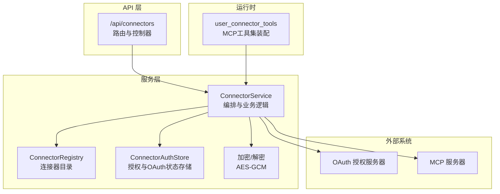
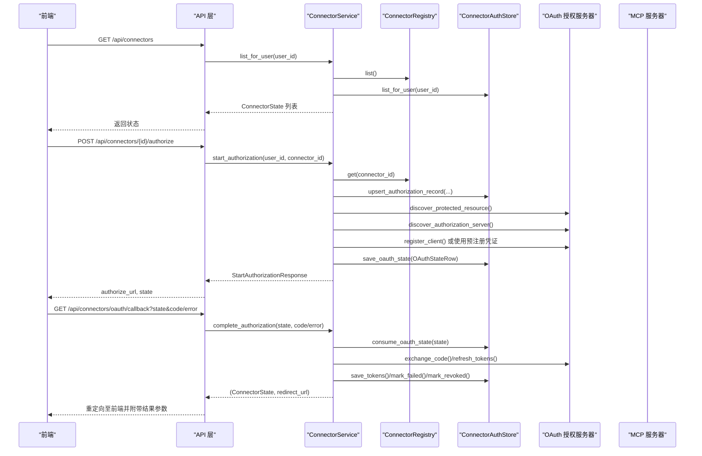
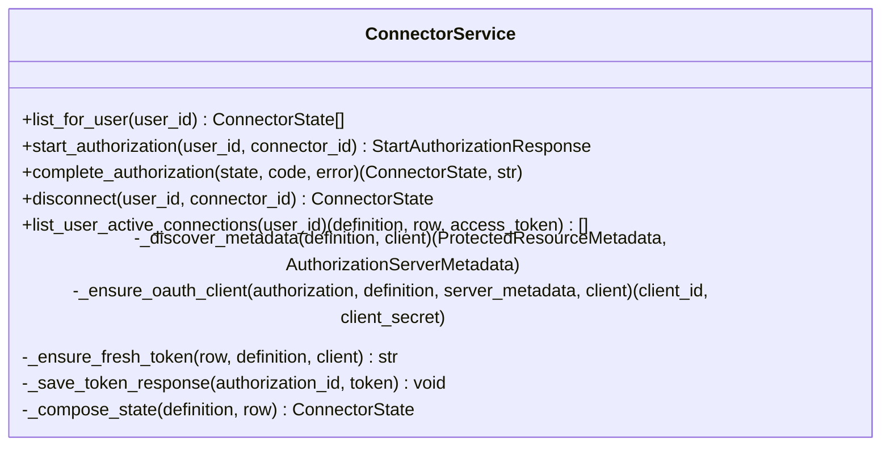
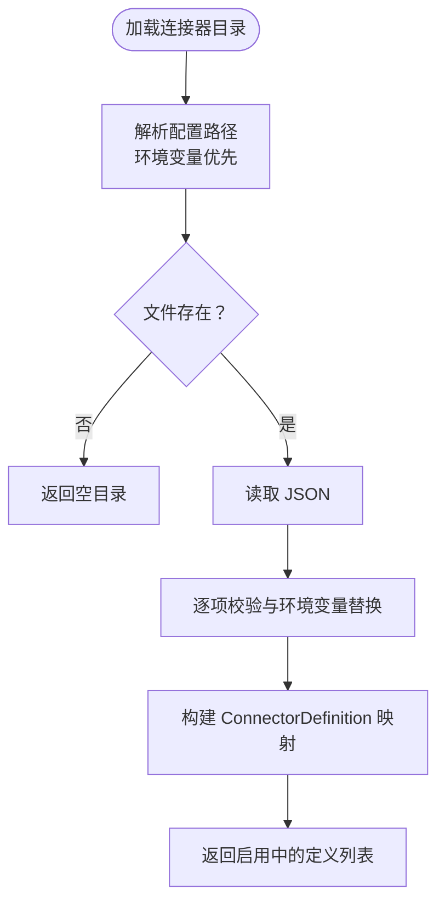
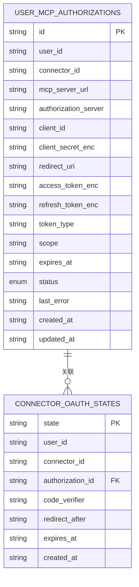
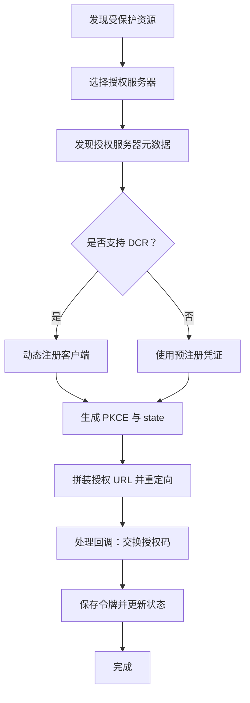
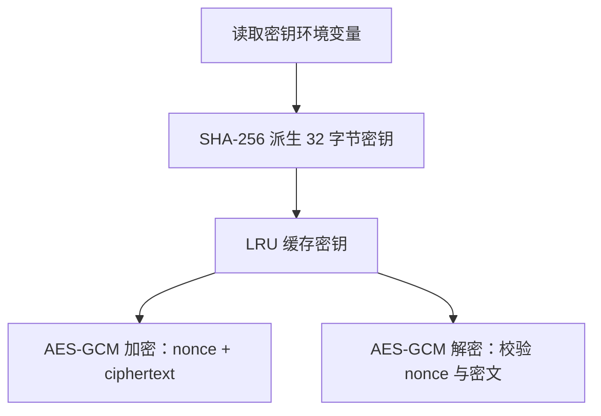
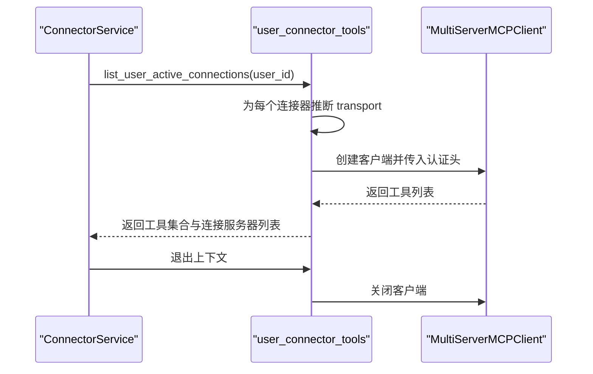
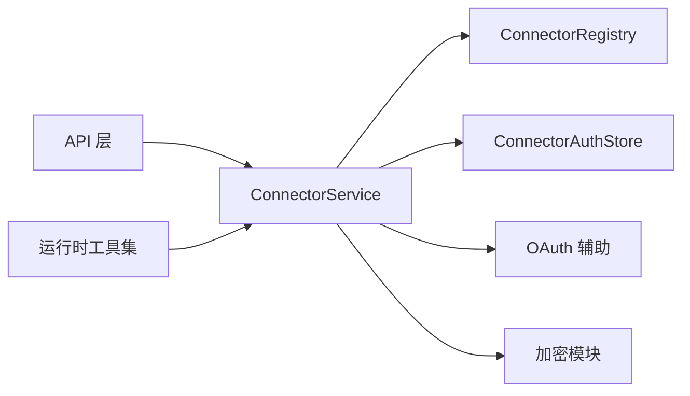
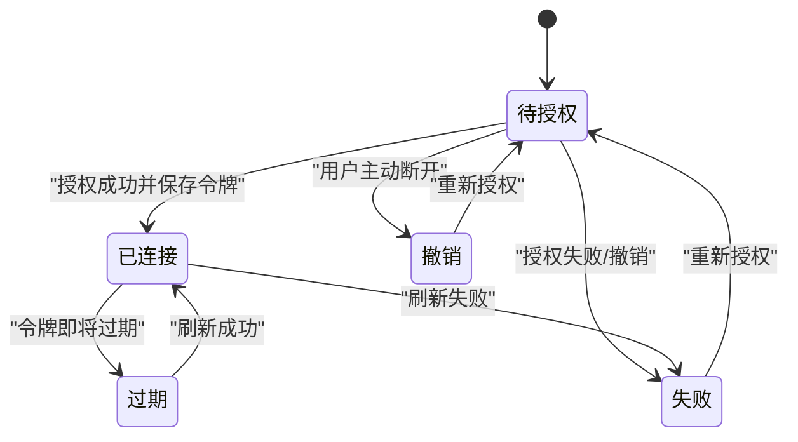

# 连接器服务编排

<cite>
**本文引用的文件**
- [service.py](file://backend/app/connectors/service.py)
- [runtime.py](file://backend/app/connectors/runtime.py)
- [registry.py](file://backend/app/connectors/registry.py)
- [oauth.py](file://backend/app/connectors/oauth.py)
- [store.py](file://backend/app/connectors/store.py)
- [crypto.py](file://backend/app/connectors/crypto.py)
- [connectors.py](file://backend/app/api/connectors.py)
- [connectors.py](file://backend/app/schemas/connectors.py)
- [connectors.example.json](file://backend/config/connectors.example.json)
- [deps.py](file://backend/app/api/deps.py)
- [main.py](file://backend/app/main.py)
- [test_connectors_oauth.py](file://backend/tests/test_connectors_oauth.py)
- [test_connectors_crypto.py](file://backend/tests/test_connectors_crypto.py)
</cite>

## 目录
1. [简介](#简介)
2. [项目结构](#项目结构)
3. [核心组件](#核心组件)
4. [架构总览](#架构总览)
5. [详细组件分析](#详细组件分析)
6. [依赖关系分析](#依赖关系分析)
7. [性能考量](#性能考量)
8. [故障排查指南](#故障排查指南)
9. [结论](#结论)
10. [附录](#附录)

## 简介
本文件系统性阐述连接器服务编排层的设计与实现，覆盖以下主题：
- 连接器业务逻辑编排：从用户授权到工具加载的完整流程
- 用户授权状态管理：授权记录、OAuth state、令牌存储与刷新
- 连接器生命周期协调：从注册表加载、动态客户端注册、令牌刷新到断开
- 连接器状态转换与错误处理策略：失败、过期、撤销等状态的流转与恢复
- 资源清理机制：OAuth state 过期清理、MCP 客户端连接释放
- 用户授权流程：发现授权服务器、PKCE、授权码交换、令牌保存
- 连接器配置管理：管理员维护的连接器目录与环境变量替换
- 批量操作处理：按用户聚合可用连接并批量刷新令牌
- 服务监控、性能调优与故障恢复：超时、重试、降级与日志
- 扩展新连接器类型与自定义业务逻辑：注册表扩展、OAuth 规范兼容

## 项目结构
连接器编排层位于后端 Python 包的 connectors 子模块，围绕“服务层 + 存储层 + OAuth 辅助 + 运行时工具集”组织，配合 API 层提供对外接口，配合依赖注入层提供全局单例服务。

图表来源
- [connectors.py:1-103](file://backend/app/api/connectors.py#L1-L103)
- [service.py:74-421](file://backend/app/connectors/service.py#L74-L421)
- [registry.py:46-87](file://backend/app/connectors/registry.py#L46-L87)
- [store.py:78-349](file://backend/app/connectors/store.py#L78-L349)
- [crypto.py:1-55](file://backend/app/connectors/crypto.py#L1-L55)
- [runtime.py:50-88](file://backend/app/connectors/runtime.py#L50-L88)

章节来源
- [main.py:31-54](file://backend/app/main.py#L31-L54)
- [deps.py:42-47](file://backend/app/api/deps.py#L42-L47)

## 核心组件
- ConnectorService：编排核心，负责授权流程、令牌刷新、状态构建与错误处理
- ConnectorRegistry：管理员维护的连接器目录，支持环境变量替换与启用过滤
- ConnectorAuthStore：SQLite 存储授权记录与 OAuth state，提供 CRUD 与状态更新
- OAuth 辅助模块：OAuth 2.1/OIDC discovery、DCR、PKCE、授权码交换与令牌刷新
- 加密模块：基于 AES-GCM 的敏感数据加解密
- 运行时工具集：按用户聚合 MCP 工具，自动管理 MCP 客户端生命周期
- API 层：对外暴露连接器授权、断开、回调与列表接口

章节来源
- [service.py:74-421](file://backend/app/connectors/service.py#L74-L421)
- [registry.py:46-87](file://backend/app/connectors/registry.py#L46-L87)
- [store.py:78-349](file://backend/app/connectors/store.py#L78-L349)
- [oauth.py:1-419](file://backend/app/connectors/oauth.py#L1-L419)
- [crypto.py:1-55](file://backend/app/connectors/crypto.py#L1-L55)
- [runtime.py:18-88](file://backend/app/connectors/runtime.py#L18-L88)
- [connectors.py:1-103](file://backend/app/api/connectors.py#L1-L103)

## 架构总览
连接器编排采用“服务层编排 + 存储层持久化 + OAuth 规范实现 + 运行时工具装配”的分层设计。服务层统一协调授权服务器发现、动态客户端注册、令牌交换与刷新、状态转换与错误处理；存储层持久化授权记录与 OAuth state；运行时工具集按用户聚合 MCP 工具并管理连接生命周期。

图表来源
- [connectors.py:24-95](file://backend/app/api/connectors.py#L24-L95)
- [service.py:108-229](file://backend/app/connectors/service.py#L108-L229)
- [oauth.py:123-217](file://backend/app/connectors/oauth.py#L123-L217)
- [store.py:105-158](file://backend/app/connectors/store.py#L105-L158)

## 详细组件分析

### ConnectorService：授权编排与生命周期管理
- 主要职责
  - 用户视角连接器状态聚合：结合注册表与存储，构造 ConnectorState
  - 授权流程编排：发现授权服务器、动态注册客户端、生成授权 URL、处理回调
  - 令牌管理：保存令牌、按需刷新、过期检测、失败标记
  - 断开授权：清除令牌并标记状态
  - 按用户聚合可用连接：批量刷新令牌并返回可用三元组
- 关键流程
  - 开始授权：准备授权记录、发现元数据、动态注册或使用预注册凭证、生成 PKCE 与 state、保存 OAuth state、返回授权 URL
  - 完成授权：消费 OAuth state、校验用户与状态、交换授权码为令牌、保存令牌并返回状态与重定向 URL
  - 刷新令牌：检查过期时间，必要时使用 refresh_token 刷新并保存
  - 断开授权：标记状态为 revoked 并清理令牌
- 错误处理
  - 授权服务器发现失败、令牌交换失败、回调参数缺失或无效、用户不匹配等均抛出 ConnectorAuthorizationError，由 API 层转换为 HTTP 400/404
- 性能与并发
  - 异步 HTTP 客户端批量处理，按需刷新令牌，避免重复网络调用
  - OAuth state TTL 限制与过期清理，防止重放攻击与存储膨胀

图表来源
- [service.py:74-421](file://backend/app/connectors/service.py#L74-L421)

章节来源
- [service.py:87-106](file://backend/app/connectors/service.py#L87-L106)
- [service.py:108-174](file://backend/app/connectors/service.py#L108-L174)
- [service.py:176-229](file://backend/app/connectors/service.py#L176-L229)
- [service.py:231-239](file://backend/app/connectors/service.py#L231-L239)
- [service.py:241-271](file://backend/app/connectors/service.py#L241-L271)
- [service.py:348-387](file://backend/app/connectors/service.py#L348-L387)

### ConnectorRegistry：连接器目录与配置管理
- 职责
  - 从 connectors.json 加载连接器定义，支持环境变量占位符替换
  - 提供启用中的连接器列表与按 ID 获取
- 配置示例
  - 支持默认作用域、预注册凭证、图标与描述等元数据
  - 可通过环境变量覆盖 MCP 服务器地址与客户端凭证
- 校验与错误
  - 非法配置项、未设置的环境变量将触发异常

图表来源
- [registry.py:52-87](file://backend/app/connectors/registry.py#L52-L87)
- [connectors.example.json:1-35](file://backend/config/connectors.example.json#L1-L35)

章节来源
- [registry.py:38-44](file://backend/app/connectors/registry.py#L38-L44)
- [registry.py:52-87](file://backend/app/connectors/registry.py#L52-L87)
- [connectors.example.json:24-33](file://backend/config/connectors.example.json#L24-L33)

### ConnectorAuthStore：授权与 OAuth 状态存储
- 职责
  - 授权记录：upsert、更新客户端凭证、保存令牌、标记失败/撤销、查询列表
  - OAuth state：保存 state、消费并删除、过期清理
- 数据模型
  - AuthorizationRow：用户-连接器授权记录，含令牌、过期时间、状态与错误
  - OAuthStateRow：OAuth state，含 code_verifier、重定向地址与过期时间
- 并发与事务
  - 使用上下文管理器封装连接与事务，保证一致性

图表来源
- [store.py:19-75](file://backend/app/connectors/store.py#L19-L75)
- [store.py:42-54](file://backend/app/connectors/store.py#L42-L54)

章节来源
- [store.py:105-158](file://backend/app/connectors/store.py#L105-L158)
- [store.py:193-221](file://backend/app/connectors/store.py#L193-L221)
- [store.py:222-250](file://backend/app/connectors/store.py#L222-L250)
- [store.py:300-342](file://backend/app/connectors/store.py#L300-L342)

### OAuth 辅助模块：发现、注册、交换与刷新
- 功能
  - 发现受保护资源与授权服务器元数据
  - 动态客户端注册（DCR）
  - PKCE 生成与授权 URL 拼装
  - 授权码交换与刷新令牌
  - 资源指示（RFC 8707）
- 规范遵循
  - MCP 授权规范 2025-06-18：RFC 9728、8414、7591、7636、8707
- 超时与错误
  - 明确的发现与令牌端点超时，HTTP 错误记录日志并抛出

图表来源
- [oauth.py:123-217](file://backend/app/connectors/oauth.py#L123-L217)
- [oauth.py:220-269](file://backend/app/connectors/oauth.py#L220-L269)
- [oauth.py:271-295](file://backend/app/connectors/oauth.py#L271-L295)
- [oauth.py:297-340](file://backend/app/connectors/oauth.py#L297-L340)

章节来源
- [oauth.py:123-217](file://backend/app/connectors/oauth.py#L123-L217)
- [oauth.py:220-269](file://backend/app/connectors/oauth.py#L220-L269)
- [oauth.py:271-295](file://backend/app/connectors/oauth.py#L271-L295)
- [oauth.py:297-340](file://backend/app/connectors/oauth.py#L297-L340)

### 加密模块：敏感数据保护
- 职责
  - 基于 AES-GCM 的对称加密与解密
  - 密钥派生：优先 MCP_TOKEN_ENC_KEY，回退 JWT_SECRET
- 安全要点
  - 缓存密钥材料，避免重复派生
  - 密文包含随机 nonce，格式校验严格

图表来源
- [crypto.py:18-33](file://backend/app/connectors/crypto.py#L18-L33)
- [crypto.py:35-55](file://backend/app/connectors/crypto.py#L35-L55)

章节来源
- [crypto.py:18-33](file://backend/app/connectors/crypto.py#L18-L33)
- [crypto.py:35-55](file://backend/app/connectors/crypto.py#L35-L55)

### 运行时工具集：按用户装配 MCP 工具
- 职责
  - 按用户聚合已连接的连接器，推断传输协议（SSE/HTTP），构建 MCP 客户端
  - 自动加载工具并收集错误，退出时释放客户端连接
- 生命周期
  - 使用 async context manager 管理客户端生命周期，确保异常时也能释放资源

图表来源
- [runtime.py:50-88](file://backend/app/connectors/runtime.py#L50-L88)
- [service.py:241-271](file://backend/app/connectors/service.py#L241-L271)

章节来源
- [runtime.py:18-88](file://backend/app/connectors/runtime.py#L18-L88)

### API 层：对外接口与错误映射
- 路由
  - GET /api/connectors：列出用户可授权的连接器状态
  - POST /api/connectors/{id}/authorize：开始授权流程
  - DELETE /api/connectors/{id}：断开授权
  - GET /api/connectors/oauth/callback：OAuth 回调处理并重定向
- 错误映射
  - ConnectorAuthorizationError 映射为 HTTP 400/404，携带友好错误信息

章节来源
- [connectors.py:24-95](file://backend/app/api/connectors.py#L24-L95)

## 依赖关系分析
- 服务层依赖
  - ConnectorService 依赖 ConnectorRegistry、ConnectorAuthStore、OAuth 辅助模块与加密模块
  - 运行时工具集依赖 ConnectorService
- 外部依赖
  - httpx 异步 HTTP 客户端
  - langchain_mcp_adapters.MultiServerMCPClient
- 内聚与耦合
  - 服务层高内聚、低耦合，通过接口清晰分离发现、注册、交换、刷新、存储与运行时装配
  - API 层薄控制器，依赖注入提供服务单例

图表来源
- [connectors.py:1-103](file://backend/app/api/connectors.py#L1-L103)
- [service.py:1-421](file://backend/app/connectors/service.py#L1-L421)
- [runtime.py:1-88](file://backend/app/connectors/runtime.py#L1-L88)

章节来源
- [deps.py:42-47](file://backend/app/api/deps.py#L42-L47)
- [main.py:31-54](file://backend/app/main.py#L31-L54)

## 性能考量
- 异步 I/O 与超时控制
  - 发现与令牌端点分别设置超时，避免阻塞
- 批量与按需处理
  - 按用户聚合可用连接时异步处理，减少等待
  - 仅在接近过期时刷新令牌，降低频繁刷新成本
- 缓存与幂等
  - 加密密钥 LRU 缓存，避免重复派生
  - OAuth state TTL 与过期清理，减少无效状态占用
- 资源释放
  - 运行时工具集使用上下文管理器确保 MCP 客户端释放

章节来源
- [oauth.py:28-29](file://backend/app/connectors/oauth.py#L28-L29)
- [service.py:348-387](file://backend/app/connectors/service.py#L348-L387)
- [crypto.py:18-33](file://backend/app/connectors/crypto.py#L18-L33)
- [runtime.py:27-39](file://backend/app/connectors/runtime.py#L27-L39)

## 故障排查指南
- 授权失败
  - 授权服务器发现失败：检查 MCP 服务器 URL 与网络可达性
  - 回调参数缺失：确认前端 return_url 与 redirect_uri 配置一致
  - 令牌交换失败：检查客户端凭证与授权服务器配置
- 令牌过期
  - 服务端检测到过期时间不足时会尝试刷新；若无 refresh_token 或授权服务器不支持，将报错
- 存储问题
  - OAuth state 过期未清理导致重放：检查定时清理任务
  - 授权记录状态异常：核对 last_error 与状态字段
- 运行时工具加载失败
  - MCP 服务器不可达或工具加载异常：查看运行时工具集的错误收集与日志

章节来源
- [service.py:121-127](file://backend/app/connectors/service.py#L121-L127)
- [service.py:190-197](file://backend/app/connectors/service.py#L190-L197)
- [service.py:261-268](file://backend/app/connectors/service.py#L261-L268)
- [store.py:343-349](file://backend/app/connectors/store.py#L343-L349)
- [runtime.py:72-79](file://backend/app/connectors/runtime.py#L72-L79)

## 结论
连接器服务编排层通过严格的分层设计与 OAuth 规范实现，提供了完整的用户授权生命周期管理与 MCP 工具装配能力。其核心优势在于：
- 明确的状态模型与错误处理策略
- 安全的敏感数据保护与最小权限原则
- 可扩展的连接器目录与动态客户端注册
- 高效的批量处理与资源生命周期管理

## 附录

### 连接器状态转换图

图表来源
- [connectors.py](file://backend/app/schemas/connectors.py#L10)
- [service.py:222-250](file://backend/app/connectors/service.py#L222-L250)

### 扩展新连接器类型与自定义业务逻辑
- 新增连接器
  - 在 connectors.json 中添加新连接器定义，设置 mcp_server_url、默认作用域与可选预注册凭证
  - 如需动态注册，确保授权服务器提供 DCR 端点
- 自定义业务逻辑
  - 在 ConnectorService 中扩展授权流程或状态转换逻辑
  - 在运行时工具集按需调整 MCP 客户端参数与工具加载策略
- 配置管理
  - 使用环境变量替换敏感字段，便于多环境部署与轮换

章节来源
- [registry.py:52-87](file://backend/app/connectors/registry.py#L52-L87)
- [connectors.example.json:1-35](file://backend/config/connectors.example.json#L1-L35)
- [service.py:275-279](file://backend/app/connectors/service.py#L275-L279)
- [runtime.py:50-88](file://backend/app/connectors/runtime.py#L50-L88)