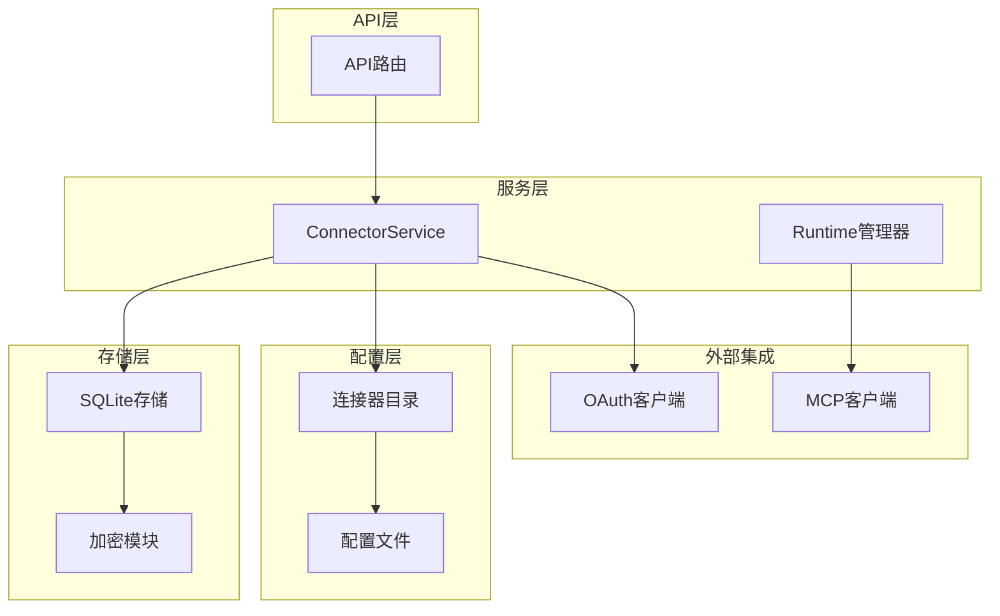
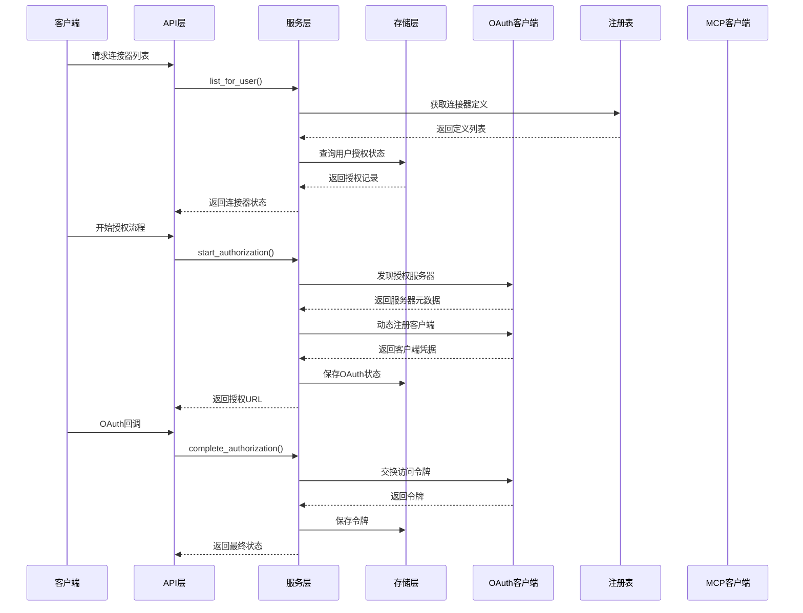
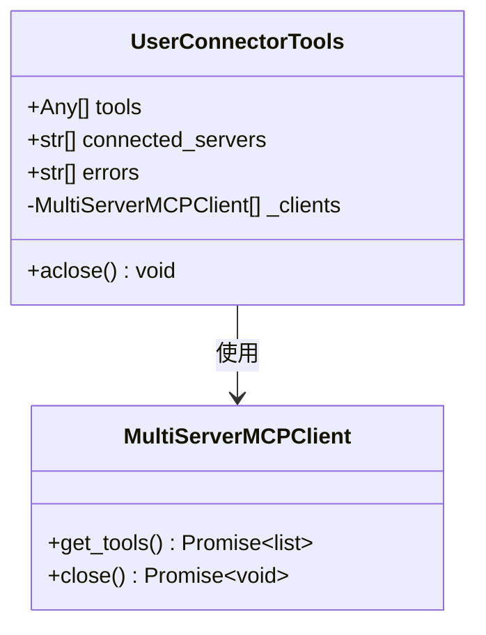
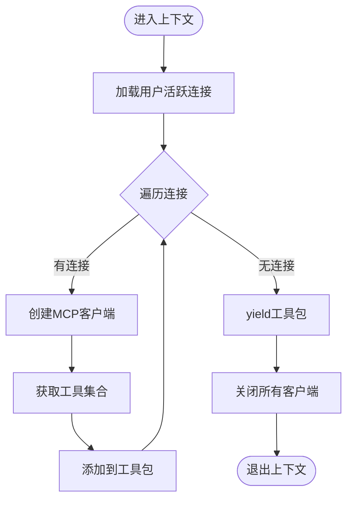
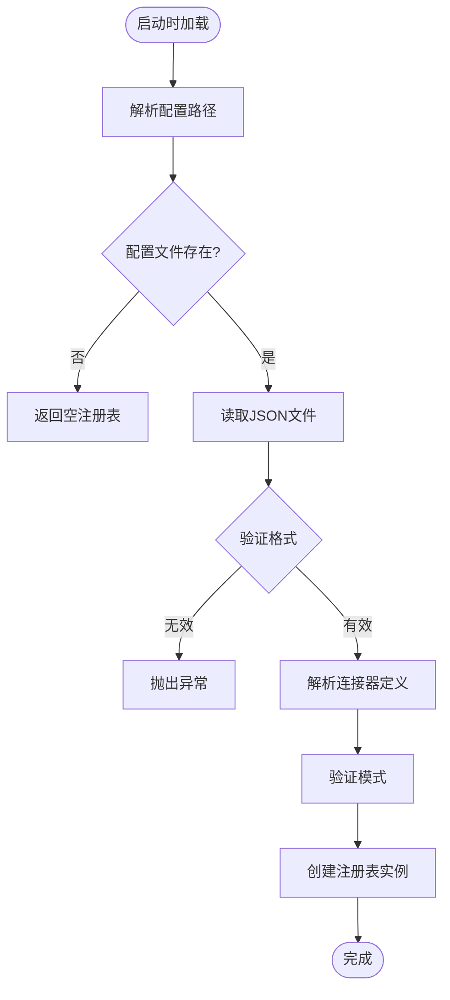
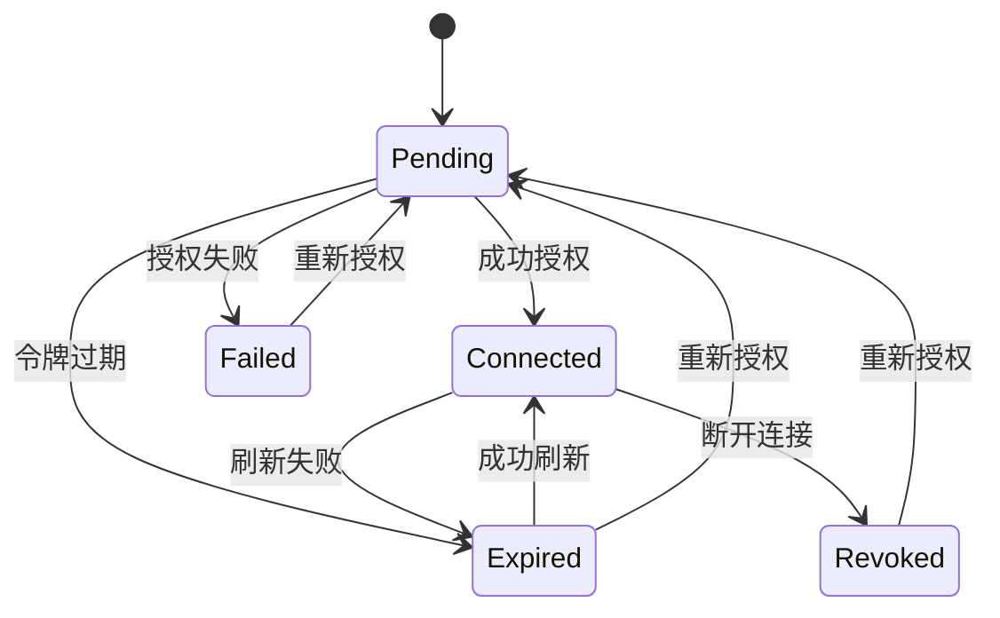
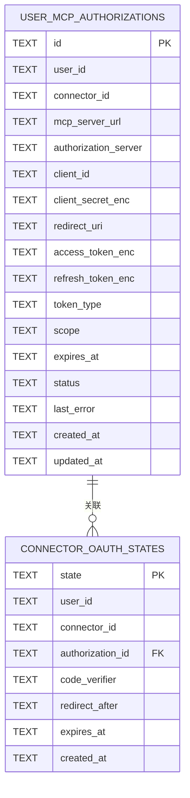
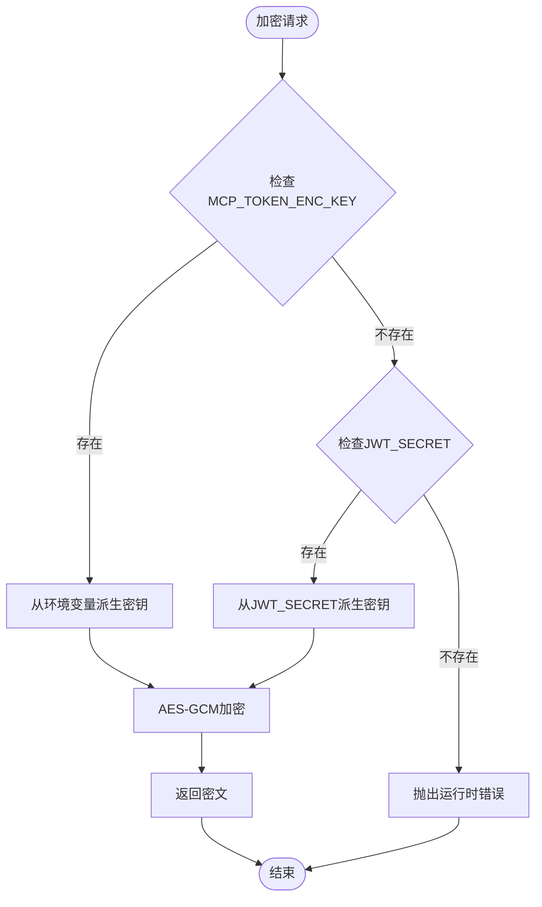
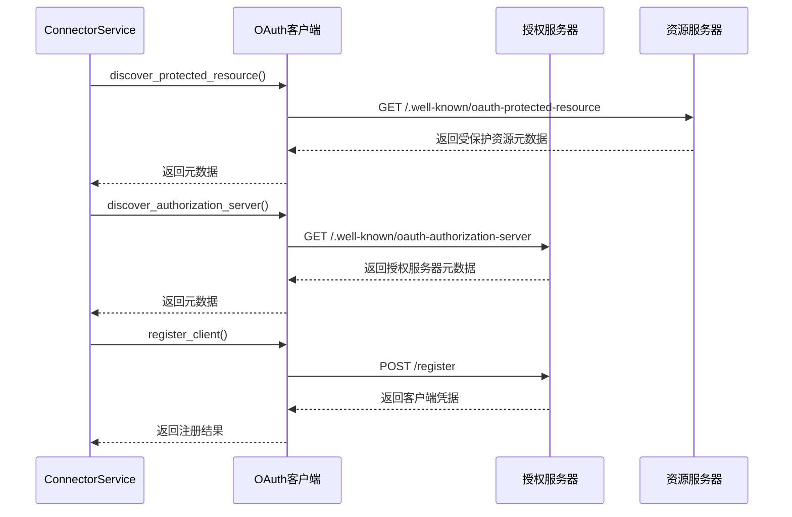
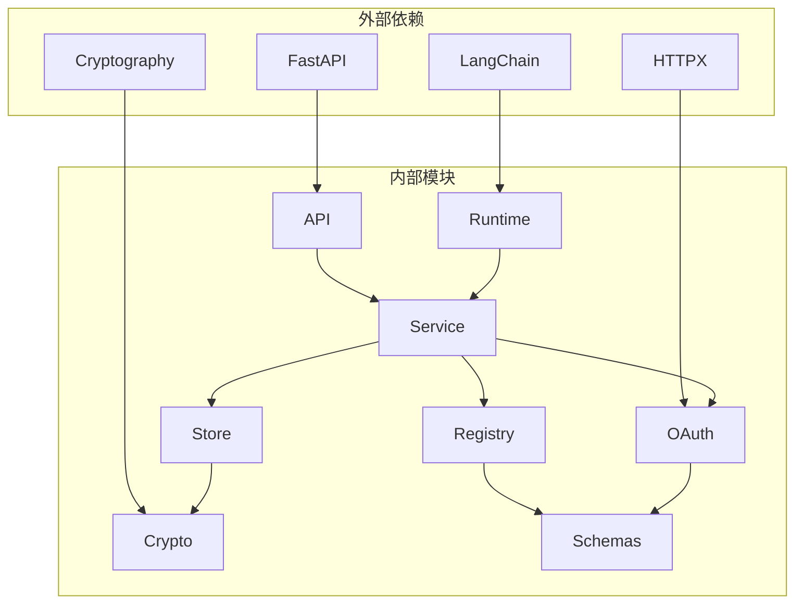

# 连接器运行时管理系统

<cite>
**本文档引用的文件**
- [runtime.py](file://backend/app/connectors/runtime.py)
- [registry.py](file://backend/app/connectors/registry.py)
- [service.py](file://backend/app/connectors/service.py)
- [store.py](file://backend/app/connectors/store.py)
- [crypto.py](file://backend/app/connectors/crypto.py)
- [oauth.py](file://backend/app/connectors/oauth.py)
- [connectors.py](file://backend/app/schemas/connectors.py)
- [connectors.py](file://backend/app/api/connectors.py)
- [connectors.example.json](file://backend/config/connectors.example.json)
- [006_user_mcp_authorizations.sql](file://backend/migrations/006_user_mcp_authorizations.sql)
- [bootstrap.py](file://backend/app/db/bootstrap.py)
- [test_connectors_oauth.py](file://backend/tests/test_connectors_oauth.py)
- [test_connectors_crypto.py](file://backend/tests/test_connectors_crypto.py)
- [pyproject.toml](file://backend/pyproject.toml)
</cite>

## 目录
1. [简介](#简介)
2. [项目结构](#项目结构)
3. [核心组件](#核心组件)
4. [架构概览](#架构概览)
5. [详细组件分析](#详细组件分析)
6. [依赖关系分析](#依赖关系分析)
7. [性能考虑](#性能考虑)
8. [故障排除指南](#故障排除指南)
9. [结论](#结论)
10. [附录](#附录)

## 简介

连接器运行时管理系统是一个基于MCP（Model Context Protocol）协议的OAuth 2.1授权框架，专门设计用于管理第三方应用的连接器。该系统提供了完整的连接器生命周期管理、运行时状态维护、动态注册机制和错误恢复功能。

系统的核心特性包括：
- **OAuth 2.1授权流程**：完整的授权码流程，支持PKCE和动态客户端注册
- **MCP协议集成**：通过langchain-mcp-adapters实现多服务器MCP客户端管理
- **运行时状态管理**：实时跟踪连接器状态和工具集合
- **安全加密存储**：敏感信息的AES-GCM加密存储
- **动态配置管理**：支持运行时更新连接器配置

## 项目结构

连接器系统采用模块化的分层架构，主要分为以下几个层次：

**图表来源**
- [runtime.py:1-88](file://backend/app/connectors/runtime.py#L1-L88)
- [service.py:74-407](file://backend/app/connectors/service.py#L74-L407)
- [store.py:78-349](file://backend/app/connectors/store.py#L78-L349)

**章节来源**
- [runtime.py:1-88](file://backend/app/connectors/runtime.py#L1-L88)
- [service.py:74-407](file://backend/app/connectors/service.py#L74-L407)
- [store.py:78-349](file://backend/app/connectors/store.py#L78-L349)

## 核心组件

### 连接器运行时管理器

运行时管理器负责在用户会话期间动态组装和管理MCP工具集合。它实现了异步上下文管理器模式，确保资源的正确分配和释放。

### 连接器注册表

注册表管理管理员维护的连接器元数据，支持从JSON配置文件动态加载和查询连接器定义。

### 连接器服务

服务层协调连接器目录、用户授权状态与OAuth流程，提供完整的业务逻辑编排。

### 授权存储

基于SQLite的持久化存储，管理用户的OAuth授权记录和临时状态。

**章节来源**
- [runtime.py:18-88](file://backend/app/connectors/runtime.py#L18-L88)
- [registry.py:23-62](file://backend/app/connectors/registry.py#L23-L62)
- [service.py:74-407](file://backend/app/connectors/service.py#L74-L407)
- [store.py:78-349](file://backend/app/connectors/store.py#L78-L349)

## 架构概览

系统采用分层架构设计，各层职责明确，耦合度低，便于扩展和维护。

**图表来源**
- [service.py:108-230](file://backend/app/connectors/service.py#L108-L230)
- [connectors.py:34-95](file://backend/app/api/connectors.py#L34-L95)

## 详细组件分析

### 连接器运行时管理器

运行时管理器是系统的核心组件，负责在用户会话期间动态管理MCP工具集合。

#### 用户连接器工具类

**图表来源**
- [runtime.py:18-39](file://backend/app/connectors/runtime.py#L18-L39)

#### 异步上下文管理器

运行时管理器实现了标准的异步上下文管理器接口，确保资源的正确清理：

**图表来源**
- [runtime.py:50-88](file://backend/app/connectors/runtime.py#L50-L88)

**章节来源**
- [runtime.py:18-88](file://backend/app/connectors/runtime.py#L18-L88)

### 连接器注册表

注册表负责管理管理员维护的连接器元数据，支持动态加载和查询。

#### 配置文件加载机制

**图表来源**
- [registry.py:30-47](file://backend/app/connectors/registry.py#L30-L47)

**章节来源**
- [registry.py:23-62](file://backend/app/connectors/registry.py#L23-L62)
- [connectors.example.json:1-25](file://backend/config/connectors.example.json#L1-L25)

### 连接器服务

连接器服务是系统的核心业务逻辑层，协调整个授权流程。

#### OAuth授权流程

**图表来源**
- [service.py:375-407](file://backend/app/connectors/service.py#L375-L407)

#### 授权状态管理

服务层维护以下状态：
- **pending**：授权请求已创建但未完成
- **connected**：授权成功，令牌有效
- **expired**：令牌过期，需要刷新
- **revoked**：用户主动断开授权
- **failed**：授权过程中发生错误

**章节来源**
- [service.py:74-407](file://backend/app/connectors/service.py#L74-L407)

### 授权存储

存储层基于SQLite实现，提供可靠的持久化存储和事务管理。

#### 数据库表结构

**图表来源**
- [006_user_mcp_authorizations.sql:2-44](file://backend/migrations/006_user_mcp_authorizations.sql#L2-L44)

**章节来源**
- [store.py:78-349](file://backend/app/connectors/store.py#L78-L349)
- [006_user_mcp_authorizations.sql:1-44](file://backend/migrations/006_user_mcp_authorizations.sql#L1-L44)

### 加密模块

系统使用AES-GCM对敏感信息进行加密存储，确保数据安全。

#### 加密密钥管理

**图表来源**
- [crypto.py:18-55](file://backend/app/connectors/crypto.py#L18-L55)

**章节来源**
- [crypto.py:1-55](file://backend/app/connectors/crypto.py#L1-L55)

### OAuth客户端

OAuth客户端实现完整的OAuth 2.1授权流程，遵循MCP规范。

#### 授权发现流程

**图表来源**
- [oauth.py:123-217](file://backend/app/connectors/oauth.py#L123-L217)

**章节来源**
- [oauth.py:1-419](file://backend/app/connectors/oauth.py#L1-L419)

## 依赖关系分析

系统采用松耦合的设计，各组件之间的依赖关系清晰明确。

**图表来源**
- [pyproject.toml:6-24](file://backend/pyproject.toml#L6-L24)
- [service.py:14-31](file://backend/app/connectors/service.py#L14-L31)

**章节来源**
- [pyproject.toml:1-42](file://backend/pyproject.toml#L1-L42)

## 性能考虑

系统在设计时充分考虑了性能优化和资源管理：

### 连接池管理
- 使用异步HTTP客户端减少网络延迟
- 实现客户端连接复用机制
- 优化数据库查询索引

### 缓存策略
- LRU缓存加密密钥材料
- 缓存OAuth状态以避免重复查询
- 连接器元数据的内存缓存

### 错误处理优化
- 实现指数退避算法处理重试
- 异常情况下的快速失败机制
- 资源泄漏防护措施

## 故障排除指南

### 常见问题及解决方案

#### 授权失败
**症状**：用户无法完成授权流程
**可能原因**：
- OAuth服务器配置错误
- 网络连接问题
- 客户端凭据无效

**解决步骤**：
1. 检查OAuth服务器可达性
2. 验证客户端凭据配置
3. 查看授权服务器日志

#### 令牌过期
**症状**：连接器工具不可用
**可能原因**：
- 访问令牌过期
- 刷新令牌无效
- 时间同步问题

**解决步骤**：
1. 检查系统时间同步
2. 验证刷新令牌存储
3. 重新触发授权流程

#### 数据库连接问题
**症状**：授权状态异常
**可能原因**：
- SQLite文件权限问题
- 数据库锁定
- 迁移脚本执行失败

**解决步骤**：
1. 检查数据库文件权限
2. 清理数据库锁文件
3. 重新执行迁移脚本

**章节来源**
- [service.py:221-229](file://backend/app/connectors/service.py#L221-L229)
- [store.py:222-250](file://backend/app/connectors/store.py#L222-L250)

## 结论

连接器运行时管理系统提供了一个完整、安全、可扩展的MCP连接器管理解决方案。系统的主要优势包括：

1. **安全性**：完整的OAuth 2.1实现和敏感数据加密
2. **可靠性**：完善的错误处理和恢复机制
3. **可扩展性**：模块化设计支持新连接器类型
4. **可观测性**：详细的日志记录和状态跟踪

系统适用于需要集成多个第三方MCP服务的企业级应用场景，为用户提供安全、便捷的连接器管理体验。

## 附录

### 扩展新连接器类型

要扩展新的连接器类型，需要：

1. **添加配置定义**：在配置文件中添加新的连接器定义
2. **实现认证逻辑**：根据目标服务的OAuth实现调整认证流程
3. **集成MCP客户端**：配置相应的MCP客户端参数
4. **测试验证**：运行单元测试和集成测试

### 自定义运行时行为

系统支持以下自定义选项：

- **环境变量配置**：通过环境变量调整运行时行为
- **数据库路径定制**：支持自定义SQLite数据库位置
- **加密密钥管理**：支持独立的令牌加密密钥轮换
- **超时参数调整**：可根据网络环境调整超时设置