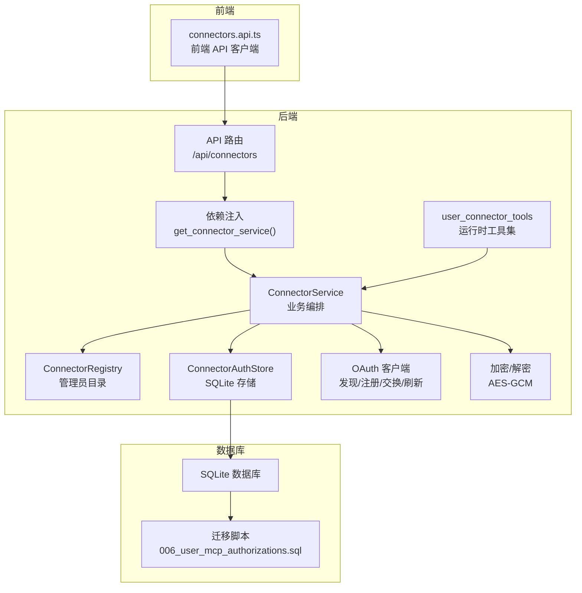
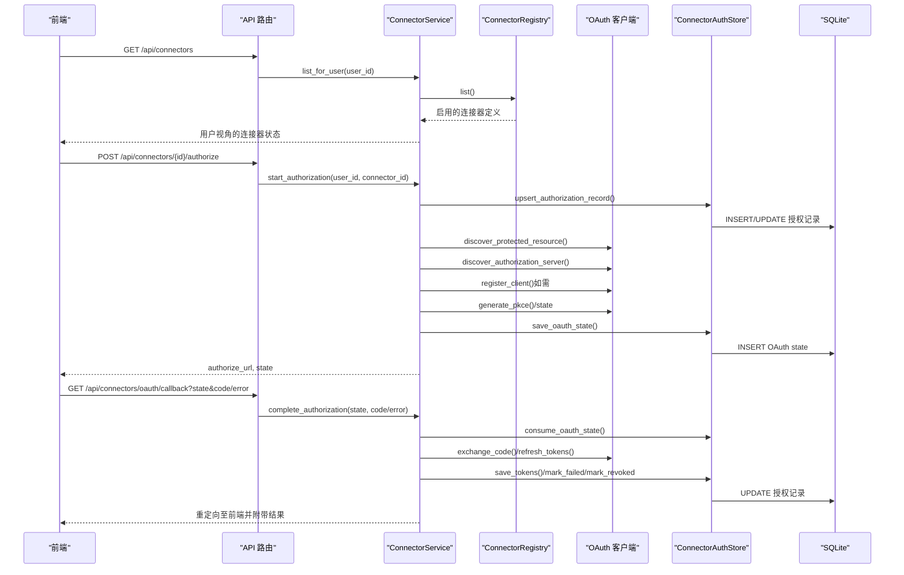
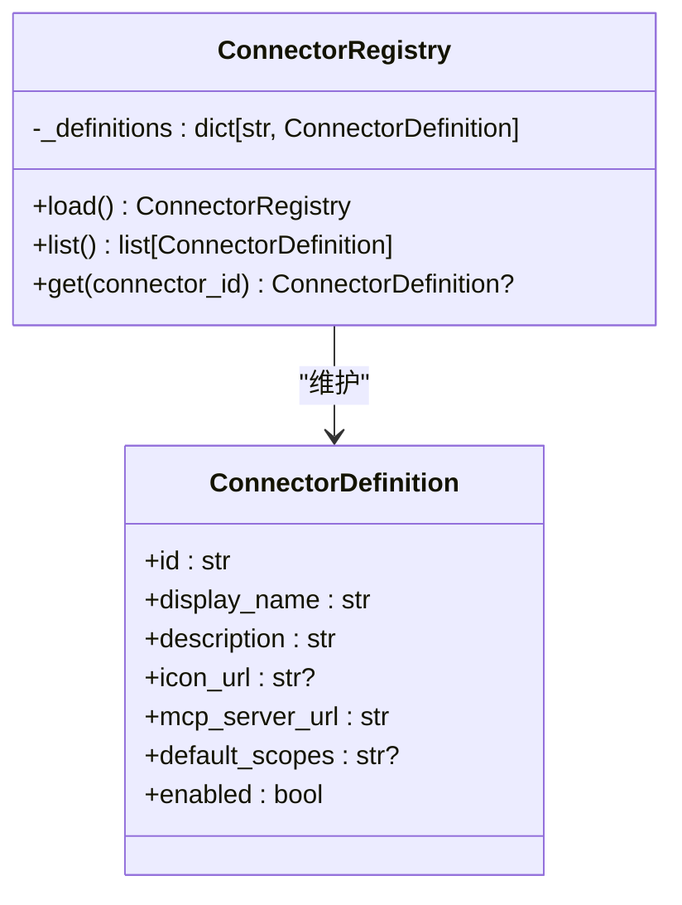
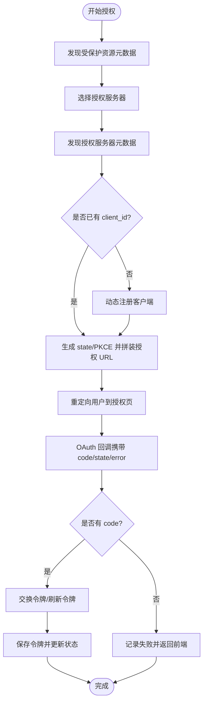
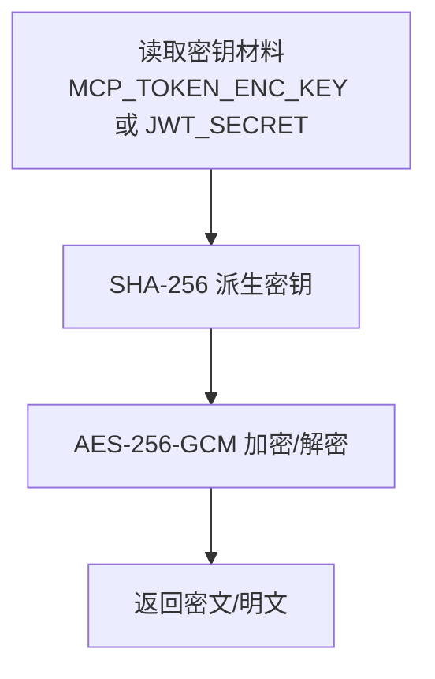
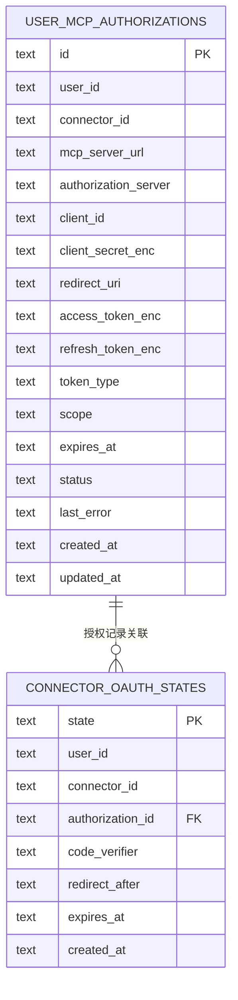
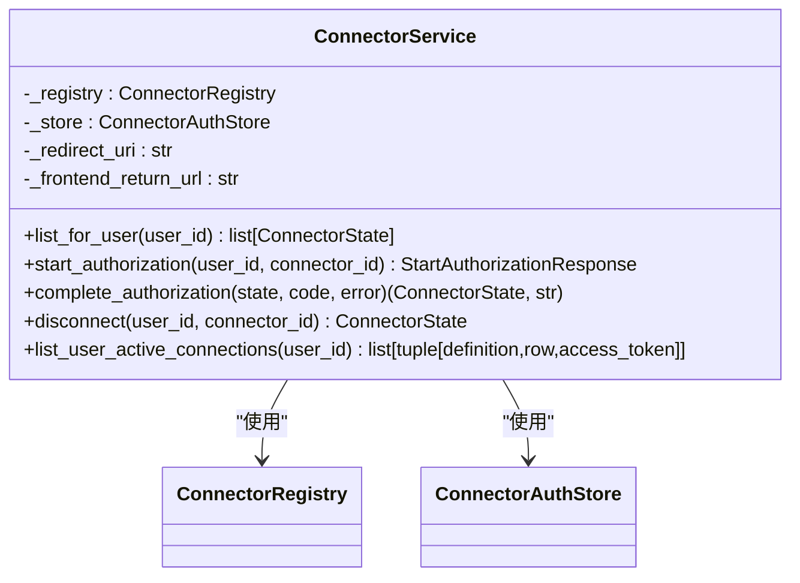
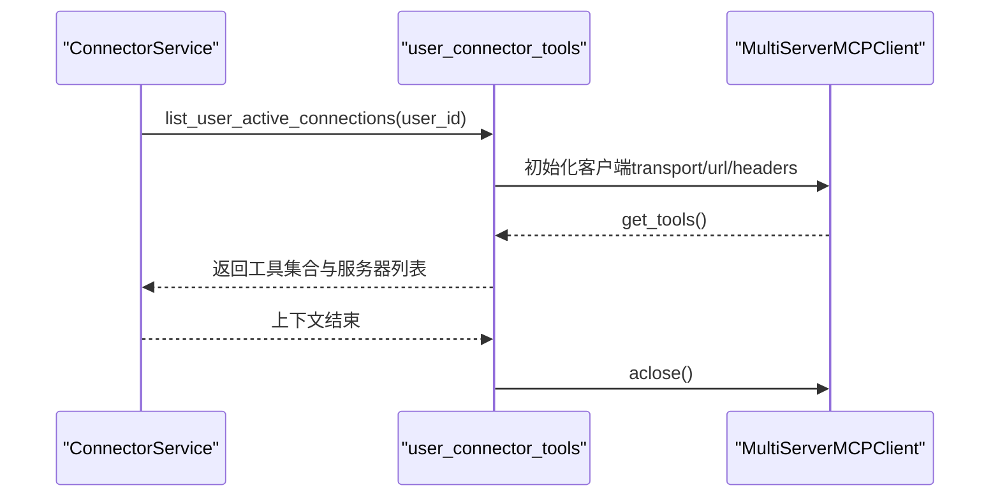
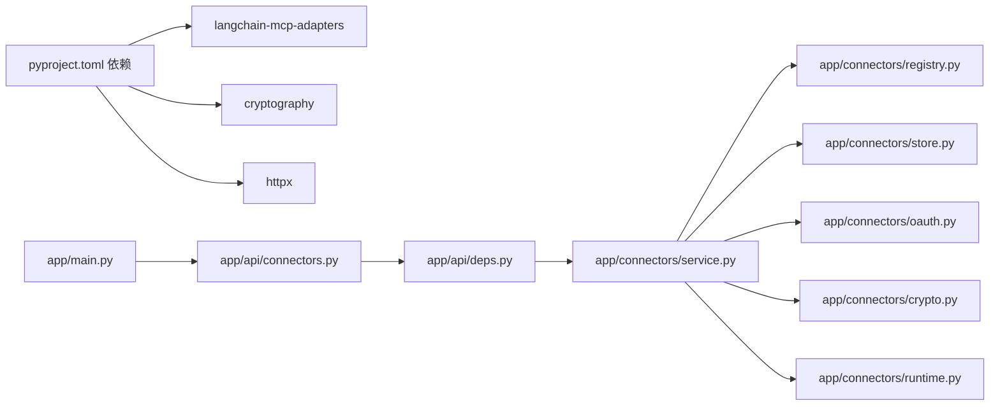
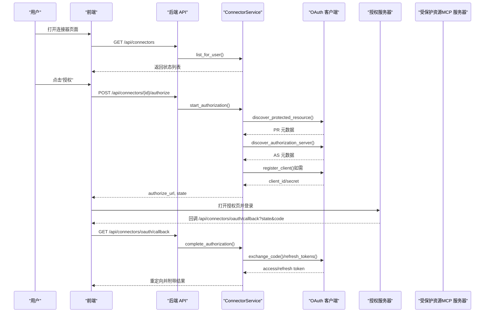

# 连接器集成

<cite>
**本文引用的文件**
- [backend/app/connectors/__init__.py](file://backend/app/connectors/__init__.py)
- [backend/app/connectors/registry.py](file://backend/app/connectors/registry.py)
- [backend/app/connectors/service.py](file://backend/app/connectors/service.py)
- [backend/app/connectors/runtime.py](file://backend/app/connectors/runtime.py)
- [backend/app/connectors/oauth.py](file://backend/app/connectors/oauth.py)
- [backend/app/connectors/crypto.py](file://backend/app/connectors/crypto.py)
- [backend/app/connectors/store.py](file://backend/app/connectors/store.py)
- [backend/app/api/connectors.py](file://backend/app/api/connectors.py)
- [backend/app/api/deps.py](file://backend/app/api/deps.py)
- [backend/app/schemas/connectors.py](file://backend/app/schemas/connectors.py)
- [backend/config/connectors.example.json](file://backend/config/connectors.example.json)
- [backend/app/db/bootstrap.py](file://backend/app/db/bootstrap.py)
- [backend/pyproject.toml](file://backend/pyproject.toml)
- [backend/migrations/006_user_mcp_authorizations.sql](file://backend/migrations/006_user_mcp_authorizations.sql)
- [backend/tests/test_connectors_oauth.py](file://backend/tests/test_connectors_oauth.py)
- [backend/tests/test_connectors_crypto.py](file://backend/tests/test_connectors_crypto.py)
</cite>

## 目录
1. [简介](#简介)
2. [项目结构](#项目结构)
3. [核心组件](#核心组件)
4. [架构总览](#架构总览)
5. [组件详解](#组件详解)
6. [依赖关系分析](#依赖关系分析)
7. [性能考量](#性能考量)
8. [故障排查指南](#故障排查指南)
9. [结论](#结论)
10. [附录](#附录)

## 简介
本文件系统性阐述“连接器集成”子系统的整体设计与实现，覆盖以下主题：
- 外部服务连接器的设计模式与运行时管理
- 管理员维护的连接器目录与用户侧授权状态
- OAuth 2.1 动态客户端注册、授权码流程、PKCE、资源指示与令牌刷新
- 加密存储与密钥管理
- 连接器生命周期管理（发现、注册、授权、连接、断开、刷新）
- 连接器配置、认证管理、错误处理
- 开发新外部服务与自定义连接器的实践指南
- 安全与性能优化建议

## 项目结构
连接器相关代码集中在 backend/app/connectors 及其周边模块，配合 FastAPI 路由、依赖注入、数据库迁移与前端 API 客户端共同构成完整的集成体系。

**图表来源**
- [backend/app/api/connectors.py:21-103](file://backend/app/api/connectors.py#L21-L103)
- [backend/app/api/deps.py:43-46](file://backend/app/api/deps.py#L43-L46)
- [backend/app/connectors/service.py:74-84](file://backend/app/connectors/service.py#L74-L84)
- [backend/app/connectors/registry.py:23-62](file://backend/app/connectors/registry.py#L23-L62)
- [backend/app/connectors/store.py:78-102](file://backend/app/connectors/store.py#L78-L102)
- [backend/app/connectors/runtime.py:50-88](file://backend/app/connectors/runtime.py#L50-L88)
- [backend/app/connectors/oauth.py:28-30](file://backend/app/connectors/oauth.py#L28-L30)
- [backend/app/connectors/crypto.py:18-33](file://backend/app/connectors/crypto.py#L18-L33)
- [backend/migrations/006_user_mcp_authorizations.sql:1-43](file://backend/migrations/006_user_mcp_authorizations.sql#L1-L43)

**章节来源**
- [backend/app/connectors/__init__.py:1-5](file://backend/app/connectors/__init__.py#L1-L5)
- [backend/app/api/connectors.py:21-103](file://backend/app/api/connectors.py#L21-L103)
- [backend/app/api/deps.py:43-46](file://backend/app/api/deps.py#L43-L46)
- [backend/app/connectors/service.py:74-84](file://backend/app/connectors/service.py#L74-L84)
- [backend/app/connectors/registry.py:23-62](file://backend/app/connectors/registry.py#L23-L62)
- [backend/app/connectors/store.py:78-102](file://backend/app/connectors/store.py#L78-L102)
- [backend/app/connectors/runtime.py:50-88](file://backend/app/connectors/runtime.py#L50-L88)
- [backend/app/connectors/oauth.py:28-30](file://backend/app/connectors/oauth.py#L28-L30)
- [backend/app/connectors/crypto.py:18-33](file://backend/app/connectors/crypto.py#L18-L33)
- [backend/migrations/006_user_mcp_authorizations.sql:1-43](file://backend/migrations/006_user_mcp_authorizations.sql#L1-L43)

## 核心组件
- 管理员连接器目录：通过 JSON 文件维护可用连接器清单，包含显示名、图标、MCP 服务器地址、默认作用域等元数据。
- OAuth 客户端：实现 MCP 授权规范，支持受保护资源元数据发现、授权服务器元数据发现、动态客户端注册、PKCE、授权码交换与令牌刷新。
- 加密模块：基于对称加密对敏感凭据进行加密存储，支持独立密钥轮换。
- 授权存储：基于 SQLite 的持久化存储，维护用户对各连接器的授权记录与 OAuth state。
- 业务服务：编排目录、OAuth、存储与运行时工具集，提供用户视角的状态查询、授权启动、回调处理、断开与活跃连接列表。
- 运行时工具集：按用户聚合可用的 MCP 工具，自动管理连接生命周期。
- API 层：暴露连接器列表、授权启动、断开与 OAuth 回调端点。

**章节来源**
- [backend/app/connectors/registry.py:23-62](file://backend/app/connectors/registry.py#L23-L62)
- [backend/app/connectors/oauth.py:32-80](file://backend/app/connectors/oauth.py#L32-L80)
- [backend/app/connectors/crypto.py:35-55](file://backend/app/connectors/crypto.py#L35-L55)
- [backend/app/connectors/store.py:78-349](file://backend/app/connectors/store.py#L78-L349)
- [backend/app/connectors/service.py:74-407](file://backend/app/connectors/service.py#L74-L407)
- [backend/app/connectors/runtime.py:18-88](file://backend/app/connectors/runtime.py#L18-L88)
- [backend/app/api/connectors.py:24-95](file://backend/app/api/connectors.py#L24-L95)

## 架构总览
连接器集成采用“目录 + OAuth + 存储 + 运行时”的分层架构。管理员通过配置文件维护连接器目录，用户通过 API 发起授权，OAuth 客户端完成发现与交换，存储持久化授权状态与凭据，运行时按用户聚合工具供代理使用。

**图表来源**
- [backend/app/api/connectors.py:24-95](file://backend/app/api/connectors.py#L24-L95)
- [backend/app/connectors/service.py:108-230](file://backend/app/connectors/service.py#L108-L230)
- [backend/app/connectors/oauth.py:123-217](file://backend/app/connectors/oauth.py#L123-L217)
- [backend/app/connectors/store.py:105-159](file://backend/app/connectors/store.py#L105-L159)
- [backend/migrations/006_user_mcp_authorizations.sql:1-43](file://backend/migrations/006_user_mcp_authorizations.sql#L1-L43)

## 组件详解

### 管理员连接器目录（ConnectorRegistry）
- 职责：加载管理员维护的连接器清单，提供启用过滤与按 ID 查询。
- 配置来源：默认位于 backend/config/connectors.json，可通过环境变量覆盖路径。
- 数据模型：基于 Pydantic 的 ConnectorDefinition，包含 id、display_name、description、icon_url、mcp_server_url、default_scopes、enabled 等字段。

**图表来源**
- [backend/app/connectors/registry.py:23-62](file://backend/app/connectors/registry.py#L23-L62)
- [backend/app/schemas/connectors.py:13-23](file://backend/app/schemas/connectors.py#L13-L23)

**章节来源**
- [backend/app/connectors/registry.py:15-62](file://backend/app/connectors/registry.py#L15-L62)
- [backend/config/connectors.example.json:1-25](file://backend/config/connectors.example.json#L1-L25)
- [backend/app/schemas/connectors.py:13-23](file://backend/app/schemas/connectors.py#L13-L23)

### OAuth 客户端（OAuth 客户端实现）
- 支持的规范：RFC 9728（受保护资源元数据）、RFC 8414（授权服务器元数据）、RFC 7591（动态客户端注册）、RFC 7636（PKCE）、RFC 8707（资源指示）。
- 关键能力：
  - 受保护资源元数据发现（支持路径与根路径两种位置）
  - 授权服务器元数据发现（支持多种 well-known 路径）
  - 动态客户端注册（DCR），保存 client_id/secret
  - PKCE 生成与授权 URL 拼装
  - 授权码交换与刷新令牌
  - 资源规范化与作用域合并策略

**图表来源**
- [backend/app/connectors/oauth.py:123-217](file://backend/app/connectors/oauth.py#L123-L217)
- [backend/app/connectors/oauth.py:220-269](file://backend/app/connectors/oauth.py#L220-L269)
- [backend/app/connectors/oauth.py:271-295](file://backend/app/connectors/oauth.py#L271-L295)
- [backend/app/connectors/oauth.py:297-340](file://backend/app/connectors/oauth.py#L297-L340)

**章节来源**
- [backend/app/connectors/oauth.py:32-419](file://backend/app/connectors/oauth.py#L32-L419)

### 加密模块（对称加密）
- 密钥来源：优先 MCP_TOKEN_ENC_KEY，其次 JWT_SECRET；任一可用即可。
- 加密算法：AES-256-GCM；密钥经 SHA-256 派生，保证固定长度。
- 明确的安全边界：密文包含 12 字节随机 nonce，避免重放与弱随机。

**图表来源**
- [backend/app/connectors/crypto.py:18-33](file://backend/app/connectors/crypto.py#L18-L33)
- [backend/app/connectors/crypto.py:35-55](file://backend/app/connectors/crypto.py#L35-L55)

**章节来源**
- [backend/app/connectors/crypto.py:13-55](file://backend/app/connectors/crypto.py#L13-L55)
- [backend/tests/test_connectors_crypto.py:17-47](file://backend/tests/test_connectors_crypto.py#L17-L47)

### 授权存储（SQLite）
- 表结构：
  - user_mcp_authorizations：用户对连接器的授权记录，含 client_id/secret、access/refresh token、过期时间、状态与错误信息。
  - connector_oauth_states：OAuth 流程中的 state、verifier、过期时间等。
- 关键操作：upsert、更新客户端凭据、保存令牌、标记失败/撤销、按用户列出、消费 state、清理过期 state。

**图表来源**
- [backend/migrations/006_user_mcp_authorizations.sql:1-43](file://backend/migrations/006_user_mcp_authorizations.sql#L1-L43)
- [backend/app/connectors/store.py:19-54](file://backend/app/connectors/store.py#L19-L54)

**章节来源**
- [backend/app/connectors/store.py:78-349](file://backend/app/connectors/store.py#L78-L349)
- [backend/migrations/006_user_mcp_authorizations.sql:1-43](file://backend/migrations/006_user_mcp_authorizations.sql#L1-L43)

### 业务服务（ConnectorService）
- 职责：协调目录、OAuth、存储与运行时；提供用户视角的连接器状态、授权启动、回调处理、断开与活跃连接列表。
- 关键流程：
  - 启动授权：发现元数据、必要时注册客户端、生成 state/PKCE、保存 OAuth state、返回授权 URL。
  - 完成授权：消费 state、校验用户与错误、交换/刷新令牌、保存并返回状态与重定向 URL。
  - 活跃连接：按需刷新 access token，失败则标记 expired 并排除。
  - 断开授权：清除 token 并标记 revoked。

**图表来源**
- [backend/app/connectors/service.py:74-407](file://backend/app/connectors/service.py#L74-L407)
- [backend/app/connectors/registry.py:23-62](file://backend/app/connectors/registry.py#L23-L62)
- [backend/app/connectors/store.py:78-102](file://backend/app/connectors/store.py#L78-L102)

**章节来源**
- [backend/app/connectors/service.py:74-407](file://backend/app/connectors/service.py#L74-L407)

### 运行时工具集（user_connector_tools）
- 职责：按用户聚合可用的 MCP 工具，自动管理连接生命周期，退出时关闭底层客户端。
- 连接策略：根据 MCP 服务器 URL 推断传输类型（SSE 或 streamable_http），构造连接参数并加载工具。

**图表来源**
- [backend/app/connectors/runtime.py:50-88](file://backend/app/connectors/runtime.py#L50-L88)

**章节来源**
- [backend/app/connectors/runtime.py:18-88](file://backend/app/connectors/runtime.py#L18-L88)

### API 层（/api/connectors）
- 端点：
  - GET /api/connectors：返回用户视角的连接器状态列表
  - POST /api/connectors/{connector_id}/authorize：启动授权，返回授权 URL 与 state
  - DELETE /api/connectors/{connector_id}：断开授权
  - GET /api/connectors/oauth/callback：OAuth 回调，重定向回前端并附带结果
- 错误处理：将业务异常转换为 HTTP 400/404，并在回调中以查询参数形式返回错误信息。

**章节来源**
- [backend/app/api/connectors.py:24-95](file://backend/app/api/connectors.py#L24-L95)

## 依赖关系分析
- 依赖注入：通过 get_connector_service() 提供全局单例，确保同一进程内共享连接器状态。
- 数据库：通过 bootstrap_sqlite_database() 初始化并迁移数据库，确保表结构与数据一致性。
- 外部库：langchain-mcp-adapters 提供 MCP 客户端适配，cryptography 提供对称加密，httpx 提供异步 HTTP 访问。

**图表来源**
- [backend/pyproject.toml:6-24](file://backend/pyproject.toml#L6-L24)
- [backend/app/main.py:14-51](file://backend/app/main.py#L14-L51)
- [backend/app/api/deps.py:43-46](file://backend/app/api/deps.py#L43-L46)

**章节来源**
- [backend/pyproject.toml:6-24](file://backend/pyproject.toml#L6-L24)
- [backend/app/api/deps.py:18-46](file://backend/app/api/deps.py#L18-L46)
- [backend/app/db/bootstrap.py:213-226](file://backend/app/db/bootstrap.py#L213-L226)

## 性能考量
- 异步 I/O：OAuth 元数据发现与令牌交换均使用 httpx.AsyncClient，降低阻塞。
- 连接池与复用：ConnectorService 作为单例在进程内复用，减少重复初始化成本。
- 令牌预刷新：在访问前检查过期时间，临近过期自动刷新，避免频繁失败。
- 连接传输选择：根据 URL 路径推断 SSE 或 streamable_http，提升连接效率。
- 存储事务：SQLite 操作使用上下文管理事务，保证一致性与原子性。

[本节为通用性能建议，无需特定文件引用]

## 故障排查指南
- 授权失败
  - 检查 CONNECTOR_REDIRECT_URL 与 CONNECTOR_FRONTEND_RETURN_URL 是否正确配置且与 MCP 服务器注册一致。
  - 查看回调参数中的错误信息，确认是否为用户拒绝、网络错误或授权服务器不可达。
  - 核对 OAuth state 是否过期或已被消费。
- 令牌刷新失败
  - 确认 refresh_token 是否存在且未过期；检查授权服务器是否支持 refresh_token。
  - 核对资源标识符（resource）与授权服务器支持的作用域。
- 加密初始化失败
  - 确保 MCP_TOKEN_ENC_KEY 或 JWT_SECRET 至少配置其一。
- 数据库问题
  - 确认数据库路径与权限；如历史数据库未迁移，按提示处理或重置。

**章节来源**
- [backend/app/connectors/service.py:64-71](file://backend/app/connectors/service.py#L64-L71)
- [backend/app/connectors/service.py:180-196](file://backend/app/connectors/service.py#L180-L196)
- [backend/app/connectors/service.py:334-373](file://backend/app/connectors/service.py#L334-L373)
- [backend/app/connectors/crypto.py:24-32](file://backend/app/connectors/crypto.py#L24-L32)
- [backend/app/db/bootstrap.py:112-164](file://backend/app/db/bootstrap.py#L112-L164)

## 结论
该连接器集成系统以清晰的分层设计实现了从管理员目录、OAuth 授权、加密存储到运行时工具聚合的完整闭环。通过 MCP 规范化的授权流程与严格的错误处理，系统在安全性与可用性之间取得平衡。建议在生产环境中：
- 明确配置密钥轮换策略（MCP_TOKEN_ENC_KEY）
- 严格校验 redirect_uri 与前端 return_url
- 对授权服务器的元数据发现与 DCR 进行监控
- 持续优化令牌刷新与连接传输策略

[本节为总结性内容，无需特定文件引用]

## 附录

### OAuth 集成流程（端到端）

**图表来源**
- [backend/app/api/connectors.py:60-95](file://backend/app/api/connectors.py#L60-L95)
- [backend/app/connectors/service.py:108-230](file://backend/app/connectors/service.py#L108-L230)
- [backend/app/connectors/oauth.py:123-217](file://backend/app/connectors/oauth.py#L123-L217)

### 连接器开发指南（新增外部服务）
- 步骤
  - 在管理员目录中添加连接器定义（id、display_name、description、icon_url、mcp_server_url、default_scopes、enabled）。
  - 确保 MCP 服务器公开受保护资源与授权服务器元数据端点。
  - 配置 CONNECTOR_REDIRECT_URL 与前端 return URL，使其与 MCP 服务器注册一致。
  - 如授权服务器不支持动态客户端注册，需提前准备 client_id/secret 并在存储中补齐。
  - 启动授权流程，观察回调与日志，定位失败原因。
- 最佳实践
  - 使用 HTTPS 与严格的 CORS 策略
  - 为每个连接器配置独立的作用域，最小化权限
  - 定期轮换密钥与监控授权状态

**章节来源**
- [backend/config/connectors.example.json:1-25](file://backend/config/connectors.example.json#L1-L25)
- [backend/app/connectors/registry.py:23-62](file://backend/app/connectors/registry.py#L23-L62)
- [backend/app/connectors/oauth.py:163-217](file://backend/app/connectors/oauth.py#L163-L217)
- [backend/app/connectors/service.py:80-84](file://backend/app/connectors/service.py#L80-L84)

### 安全考虑
- 密钥管理：使用独立密钥（MCP_TOKEN_ENC_KEY）进行加密，避免与 JWT 密钥混用。
- 传输安全：强制使用 HTTPS；严格校验授权服务器与资源服务器的元数据。
- 令牌安全：避免在前端存储明文 token；仅在运行时按需解密并注入请求头。
- 重放防护：OAuth state 有过期时间与一次性消费机制。

**章节来源**
- [backend/app/connectors/crypto.py:24-32](file://backend/app/connectors/crypto.py#L24-L32)
- [backend/app/connectors/store.py:321-342](file://backend/app/connectors/store.py#L321-L342)
- [backend/app/connectors/oauth.py:95-108](file://backend/app/connectors/oauth.py#L95-L108)

### 单元测试要点
- OAuth 辅助函数：PKCE 配对正确性、URL 规范化、授权 URL 参数完整性、作用域合并策略。
- 加密模块：显式密钥与回退密钥的加解密往返、空值处理、缺失密钥异常。

**章节来源**
- [backend/tests/test_connectors_oauth.py:20-88](file://backend/tests/test_connectors_oauth.py#L20-L88)
- [backend/tests/test_connectors_crypto.py:17-47](file://backend/tests/test_connectors_crypto.py#L17-L47)