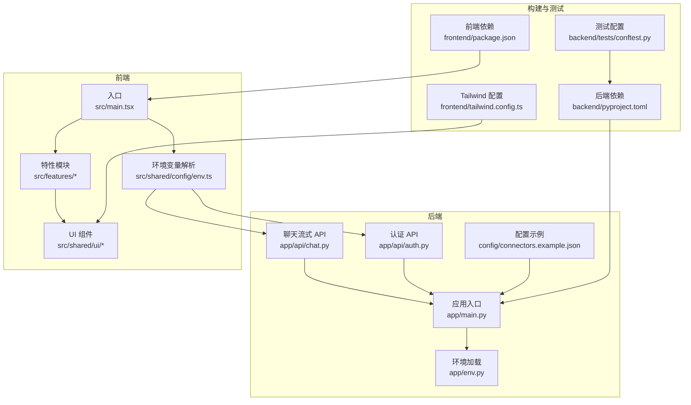
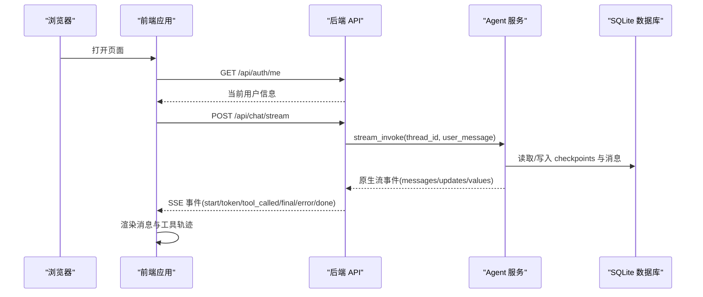
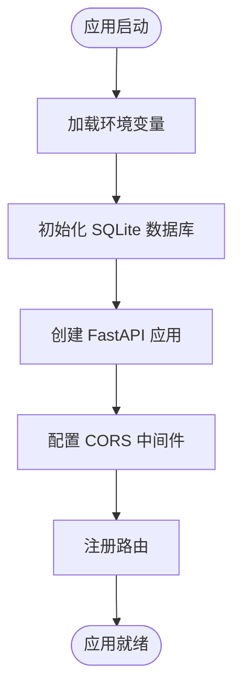
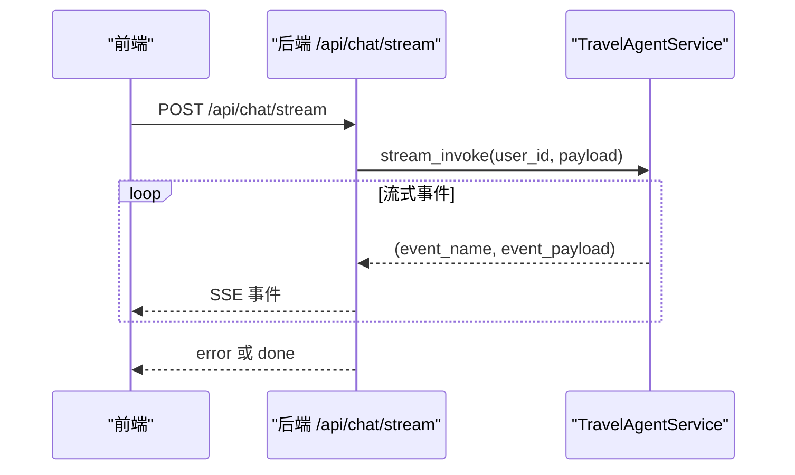
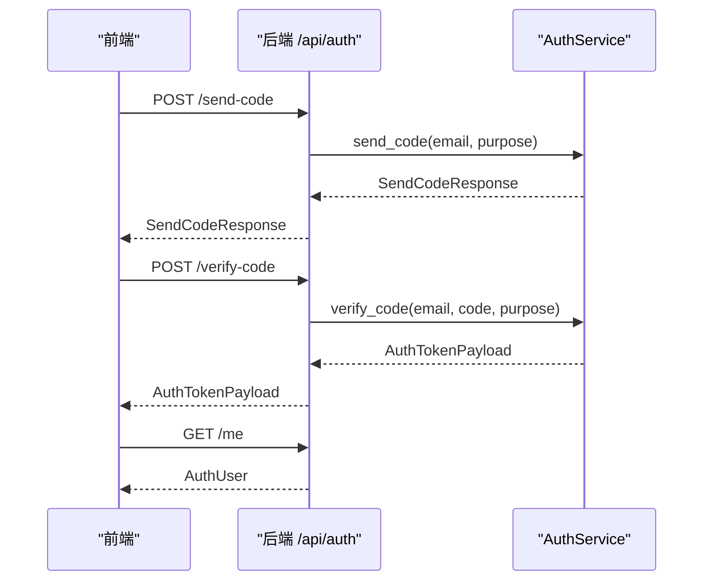
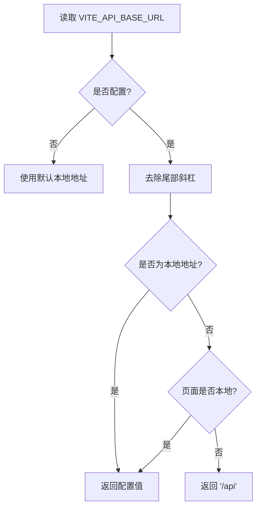
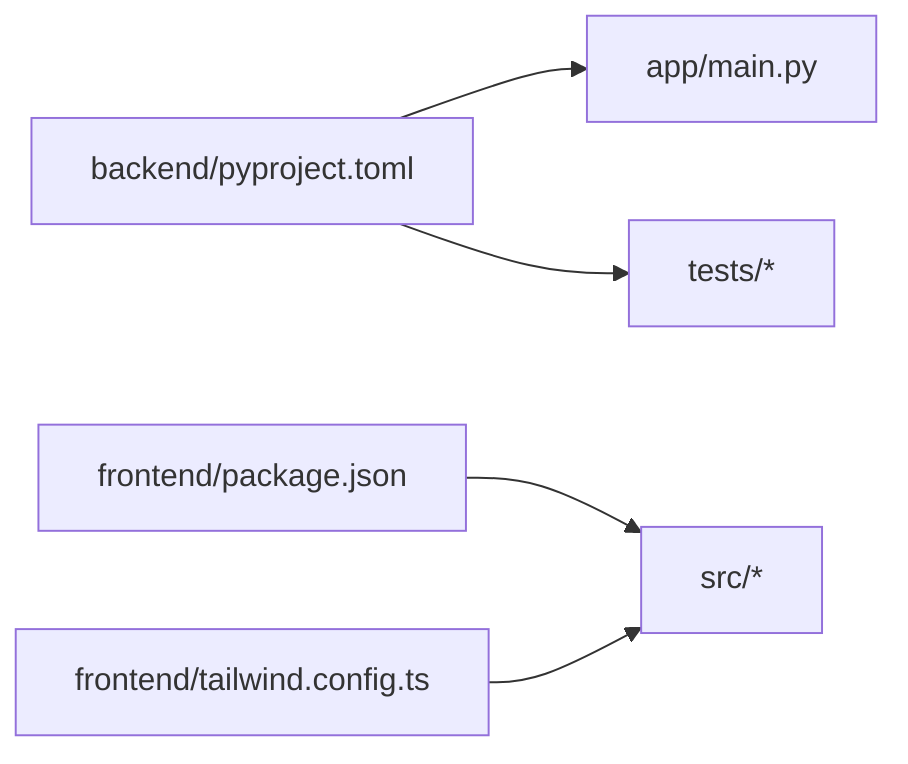

# 开发指南

<cite>
**本文引用的文件**
- [README.md](file://README.md)
- [backend/pyproject.toml](file://backend/pyproject.toml)
- [frontend/package.json](file://frontend/package.json)
- [backend/app/main.py](file://backend/app/main.py)
- [backend/app/env.py](file://backend/app/env.py)
- [frontend/src/shared/config/env.ts](file://frontend/src/shared/config/env.ts)
- [backend/app/api/chat.py](file://backend/app/api/chat.py)
- [backend/app/api/auth.py](file://backend/app/api/auth.py)
- [backend/app/branding.py](file://backend/app/branding.py)
- [backend/config/connectors.example.json](file://backend/config/connectors.example.json)
- [frontend/tailwind.config.ts](file://frontend/tailwind.config.ts)
- [backend/tests/conftest.py](file://backend/tests/conftest.py)
- [docs/agent-implementation-retrospective.md](file://docs/agent-implementation-retrospective.md)
- [.agents/skills/aliyun-1panel-app-deploy/SKILL.md](file://.agents/skills/aliyun-1panel-app-deploy/SKILL.md)
</cite>

## 目录
1. [简介](#简介)
2. [项目结构](#项目结构)
3. [核心组件](#核心组件)
4. [架构总览](#架构总览)
5. [详细组件分析](#详细组件分析)
6. [依赖分析](#依赖分析)
7. [性能考虑](#性能考虑)
8. [故障排查指南](#故障排查指南)
9. [结论](#结论)
10. [附录](#附录)

## 简介
本开发指南面向贡献者，提供从开发环境搭建、代码规范、Git 工作流、Pull Request 流程、模块组织与命名约定，到新功能开发流程、代码审查标准、发布流程、文档与注释规范、常见问题与最佳实践的完整指引。项目采用后端 Python/FastAPI + 前端 React/Vite 的双端架构，结合 LangChain/LangGraph 与 MCP 能力，提供移动端优先的旅行对话体验。

## 项目结构
- 后端 backend
  - 应用入口与生命周期：app/main.py
  - 环境加载：app/env.py
  - API 路由：app/api/*
  - 业务模块：app/agent, app/auth, app/connectors, app/memory, app/tool 等
  - 配置与迁移：config/*, migrations/*
  - 测试：tests/*
- 前端 frontend
  - 应用入口：src/main.tsx
  - 配置：src/shared/config/env.ts
  - 组件与特性：src/features/*
  - UI 组件库：src/shared/ui/*
  - 构建与测试：package.json, vite.config.ts, tailwind.config.ts
- 文档与技能：docs/*, .agents/skills/*

图表来源
- [backend/app/main.py:1-54](file://backend/app/main.py#L1-L54)
- [backend/app/env.py:1-18](file://backend/app/env.py#L1-L18)
- [backend/app/api/chat.py:1-72](file://backend/app/api/chat.py#L1-L72)
- [backend/app/api/auth.py:1-36](file://backend/app/api/auth.py#L1-L36)
- [backend/config/connectors.example.json:1-25](file://backend/config/connectors.example.json#L1-L25)
- [frontend/src/main.tsx:1-12](file://frontend/src/main.tsx#L1-L12)
- [frontend/src/shared/config/env.ts:1-48](file://frontend/src/shared/config/env.ts#L1-L48)
- [backend/pyproject.toml:1-42](file://backend/pyproject.toml#L1-L42)
- [frontend/package.json:1-52](file://frontend/package.json#L1-L52)
- [frontend/tailwind.config.ts:1-99](file://frontend/tailwind.config.ts#L1-L99)
- [backend/tests/conftest.py:1-9](file://backend/tests/conftest.py#L1-L9)

章节来源
- [README.md:19-48](file://README.md#L19-L48)
- [backend/app/main.py:31-54](file://backend/app/main.py#L31-L54)
- [frontend/src/main.tsx:1-12](file://frontend/src/main.tsx#L1-L12)

## 核心组件
- 应用入口与生命周期
  - 后端通过 app/main.py 的 create_app 创建 FastAPI 应用，注册健康检查、认证、聊天、连接器、会话、语音等路由，并在 lifespan 中启动/关闭 Agent 服务与数据库初始化。
- 环境加载
  - app/env.py 负责加载后端 .env，支持不展开 $VAR 的安全加载，避免密钥被错误展开。
- API 层
  - 聊天流式接口以 SSE 传输 LangGraph 原生事件，提供模型档位查询与流式对话。
  - 认证接口提供邮箱验证码发送、校验与当前用户查询。
- 前端环境解析
  - src/shared/config/env.ts 提供 API 基础地址解析、同源反向代理回退、路径规范化等逻辑，确保生产与本地开发场景兼容。
- 品牌与常量
  - app/branding.py 集中管理品牌名、领域名、默认昵称、LangSmith 标签与 OAuth 客户端名后缀，便于统一变更与多品牌部署。

章节来源
- [backend/app/main.py:23-54](file://backend/app/main.py#L23-L54)
- [backend/app/env.py:10-18](file://backend/app/env.py#L10-L18)
- [backend/app/api/chat.py:41-72](file://backend/app/api/chat.py#L41-L72)
- [backend/app/api/auth.py:14-36](file://backend/app/api/auth.py#L14-L36)
- [frontend/src/shared/config/env.ts:1-48](file://frontend/src/shared/config/env.ts#L1-L48)
- [backend/app/branding.py:9-24](file://backend/app/branding.py#L9-L24)

## 架构总览
后端以 FastAPI 为核心，通过 LangGraph 管理 Agent 的多轮对话与工具调用，使用 SSE 将原生流事件推送到前端；前端通过 React 组件与 UI 库渲染对话界面，使用环境变量解析 API 基础地址并进行本地/生产适配。

图表来源
- [backend/app/api/chat.py:41-72](file://backend/app/api/chat.py#L41-L72)
- [backend/app/api/auth.py:32-36](file://backend/app/api/auth.py#L32-L36)
- [frontend/src/shared/config/env.ts:29-48](file://frontend/src/shared/config/env.ts#L29-L48)

## 详细组件分析

### 后端应用入口与生命周期
- 生命周期管理：在 lifespan 中启动 Agent 服务与数据库初始化，确保应用启动与关闭时资源正确释放。
- CORS 配置：根据环境变量动态允许来源，支持凭据、通配方法与头。
- 路由注册：集中注册健康检查、认证、聊天、连接器、会话、语音等路由。

图表来源
- [backend/app/main.py:23-54](file://backend/app/main.py#L23-L54)

章节来源
- [backend/app/main.py:31-54](file://backend/app/main.py#L31-L54)

### 聊天流式 API
- SSE 编码：将事件名与负载序列化为 SSE 文本块。
- 错误处理：捕获取消、参数错误与通用异常，返回标准化错误事件。
- 事件结构：透传 LangGraph 原生事件，便于学习与调试。

图表来源
- [backend/app/api/chat.py:41-72](file://backend/app/api/chat.py#L41-L72)

章节来源
- [backend/app/api/chat.py:25-72](file://backend/app/api/chat.py#L25-L72)

### 认证 API
- 发送验证码：接收邮箱与用途，调用认证服务发送验证码。
- 校验验证码：完成登录或注册，返回令牌。
- 查询当前用户：返回已登录用户信息。

图表来源
- [backend/app/api/auth.py:14-36](file://backend/app/api/auth.py#L14-L36)

章节来源
- [backend/app/api/auth.py:14-36](file://backend/app/api/auth.py#L14-L36)

### 前端环境变量解析
- API 基础地址优先级：VITE_API_BASE_URL > 默认本地地址。
- 生产回退：若页面非本地而 API 基址指向本地，则回退为同源 /api。
- 路径规范化：自动去除尾部斜杠、处理 /api 前缀重复。

图表来源
- [frontend/src/shared/config/env.ts:1-48](file://frontend/src/shared/config/env.ts#L1-L48)

章节来源
- [frontend/src/shared/config/env.ts:1-48](file://frontend/src/shared/config/env.ts#L1-L48)

### 品牌与常量
- 集中管理品牌名、领域名、默认昵称、LangSmith 标签与 OAuth 客户端名后缀，避免分散硬编码。

章节来源
- [backend/app/branding.py:9-24](file://backend/app/branding.py#L9-L24)

### 连接器配置示例
- 示例配置展示 Notion、Linear 等连接器的显示名、图标、MCP 服务器地址、默认作用域、客户端元数据与启用状态。

章节来源
- [backend/config/connectors.example.json:1-25](file://backend/config/connectors.example.json#L1-L25)

### 文档与复盘
- 项目复盘文档梳理了 Agent 架构、命名语义、流式协议、工具调用事务、状态恢复、MCP 配置校验、序列化风险、前端流式展示策略、工程化问题与认证恢复等关键经验。

章节来源
- [docs/agent-implementation-retrospective.md:1-563](file://docs/agent-implementation-retrospective.md#L1-L563)

### 技能文档示例
- 阿里云 1Panel 应用部署技能文档提供了通用部署流程、前提条件、关键规则与常见坑，体现项目对文档化工作流的重视。

章节来源
- [.agents/skills/aliyun-1panel-app-deploy/SKILL.md:1-107](file://.agents/skills/aliyun-1panel-app-deploy/SKILL.md#L1-L107)

## 依赖分析
- 后端依赖
  - 使用 pyproject.toml 管理核心依赖与可选开发依赖，测试通过 pytest 配置。
- 前端依赖
  - 使用 package.json 管理 React、Vite、TypeScript、Tailwind 与测试工具，提供本地后端联调脚本。
- Tailwind 配置
  - 统一品牌色与语义色、圆角、阴影、字体与动画，确保 UI 设计一致性。

图表来源
- [backend/pyproject.toml:1-42](file://backend/pyproject.toml#L1-L42)
- [frontend/package.json:1-52](file://frontend/package.json#L1-L52)
- [frontend/tailwind.config.ts:1-99](file://frontend/tailwind.config.ts#L1-L99)

章节来源
- [backend/pyproject.toml:1-42](file://backend/pyproject.toml#L1-L42)
- [frontend/package.json:1-52](file://frontend/package.json#L1-L52)
- [frontend/tailwind.config.ts:1-99](file://frontend/tailwind.config.ts#L1-L99)

## 性能考虑
- 后端热重载范围收敛：仅监听 app 与 config 目录，避免虚拟环境目录被监控导致反复重启。
- SSE 传输：LangGraph 原生事件直接透传，减少额外封装带来的开销。
- 前端路径解析：避免重复前缀与多余斜杠，减少无效请求与重定向。

章节来源
- [docs/agent-implementation-retrospective.md:440-475](file://docs/agent-implementation-retrospective.md#L440-L475)
- [backend/app/api/chat.py:41-72](file://backend/app/api/chat.py#L41-L72)
- [frontend/src/shared/config/env.ts:29-48](file://frontend/src/shared/config/env.ts#L29-L48)

## 故障排查指南
- 启动与热重载
  - 若出现服务反复重启，检查热重载目录是否包含虚拟环境目录，建议仅监听 app 与 config。
- 认证恢复
  - 前端启动后若误判掉登录，需仅在 401/403 时清理 token，其他失败保留缓存态。
- MCP 配置
  - 配置需显式声明 transport，避免 Pydantic 校验错误；支持 ${ENV_VAR} 注入。
- 前端 API 基址
  - 生产页面误配本地 API 基址时，自动回退为 /api；确保反向代理路径正确。

章节来源
- [docs/agent-implementation-retrospective.md:440-514](file://docs/agent-implementation-retrospective.md#L440-L514)
- [backend/config/connectors.example.json:1-25](file://backend/config/connectors.example.json#L1-L25)
- [frontend/src/shared/config/env.ts:9-27](file://frontend/src/shared/config/env.ts#L9-L27)

## 结论
本指南从项目结构、核心组件、架构与流程、依赖关系、性能与故障排查等方面，为贡献者提供了系统化的开发规范与实践路径。建议在新功能开发中遵循统一的模块组织、命名约定与文档规范，配合严格的代码审查与测试流程，持续优化 Agent 的状态管理、流式展示与工程化体验。

## 附录

### 开发环境配置与 IDE 设置
- 后端
  - 使用 uv 管理 Python 依赖与运行，推荐在 IDE 中配置 Python 解释器指向项目虚拟环境。
  - 启动命令参考 README，确保 .env 文件存在并包含必要变量。
- 前端
  - 使用 npm 安装依赖，推荐 VS Code 并安装 TypeScript、ESLint、Prettier 插件。
  - 启动命令参考 README，如需联调后端可在前端脚本中使用提供的后端启动命令。

章节来源
- [README.md:50-66](file://README.md#L50-L66)
- [backend/pyproject.toml:1-42](file://backend/pyproject.toml#L1-L42)
- [frontend/package.json:6-12](file://frontend/package.json#L6-L12)

### Git 工作流与 Pull Request 流程
- 分支策略
  - 建议采用 feature/分支名、hotfix/分支名等命名，保持主题单一。
- 提交规范
  - 提交信息采用动宾结构，简明描述变更目的与影响范围。
- 代码审查
  - PR 需包含需求说明、变更内容、测试用例与风险评估；至少一名维护者批准。
- 合并策略
  - 优先使用 squash merge 保持提交历史整洁；合并前确保 CI 通过。

### 代码规范与命名约定
- 后端
  - 模块按功能分层：api、agent、auth、connectors、memory、tool 等；路由前缀统一、标签一致。
  - 类型与序列化：使用 Pydantic 模型，避免在 LangGraph checkpoint 中存放自定义类型。
- 前端
  - 组件按功能划分至 features/*，共享 UI 组件置于 shared/ui；使用 Tailwind 统一样式。
  - 环境变量解析集中在 env.ts，避免硬编码。

章节来源
- [backend/app/api/chat.py:21-21](file://backend/app/api/chat.py#L21-L21)
- [backend/app/api/auth.py:11-11](file://backend/app/api/auth.py#L11-L11)
- [frontend/src/shared/config/env.ts:1-48](file://frontend/src/shared/config/env.ts#L1-L48)
- [docs/agent-implementation-retrospective.md:323-354](file://docs/agent-implementation-retrospective.md#L323-L354)

### 新功能开发流程
- 需求评审：明确功能目标、用户故事与验收标准。
- 设计与建模：确定后端路由与模型、前端页面与组件、数据库变更与迁移。
- 开发与测试：遵循模块组织与命名约定，补充单元测试与集成测试。
- 文档与注释：更新相关文档与注释，确保可维护性。
- 代码审查与合并：通过 PR 审查，修复问题后合并。

### 发布流程
- 版本号管理：遵循语义化版本；后端与前端独立发布。
- 构建与打包：后端使用 uv 打包，前端使用 Vite 构建。
- 部署：后端可使用 Dockerfile 与 docker-compose；前端静态部署于反向代理后端。

章节来源
- [backend/pyproject.toml:1-42](file://backend/pyproject.toml#L1-L42)
- [frontend/package.json:9-10](file://frontend/package.json#L9-L10)
- [README.md:69-118](file://README.md#L69-L118)

### 文档编写规范与 API 文档维护
- 文档风格：简洁、结构化、可追溯；示例与截图并重。
- API 文档：以最小可行示例呈现请求与响应，标注事件顺序与错误码。
- 变更追踪：重要变更在复盘文档中沉淀，形成知识资产。

章节来源
- [README.md:78-102](file://README.md#L78-L102)
- [docs/agent-implementation-retrospective.md:1-20](file://docs/agent-implementation-retrospective.md#L1-L20)

### 常见开发问题与最佳实践
- 工具调用事务：使用 LangGraph checkpoint 回滚，避免半完成状态污染线程。
- 流式展示：前端按 LangGraph 原生事件流式渲染，避免将中间过程与最终答案混合。
- MCP 配置：显式声明 transport，使用环境变量注入密钥。
- 品牌与命名：保持产品命名与技术语义一致，避免混淆公开工作文案与私有思考内容。

章节来源
- [docs/agent-implementation-retrospective.md:166-214](file://docs/agent-implementation-retrospective.md#L166-L214)
- [docs/agent-implementation-retrospective.md:357-402](file://docs/agent-implementation-retrospective.md#L357-L402)
- [docs/agent-implementation-retrospective.md:271-321](file://docs/agent-implementation-retrospective.md#L271-L321)
- [docs/agent-implementation-retrospective.md:405-437](file://docs/agent-implementation-retrospective.md#L405-L437)

### 贡献者指南与社区参与
- 社区参与：欢迎通过 Issue/PR 参与讨论与贡献；遵守行为准则与贡献流程。
- 技能文档：通用部署与运维流程可沉淀为技能文档，提升团队协作效率。

章节来源
- [.agents/skills/aliyun-1panel-app-deploy/SKILL.md:1-20](file://.agents/skills/aliyun-1panel-app-deploy/SKILL.md#L1-L20)