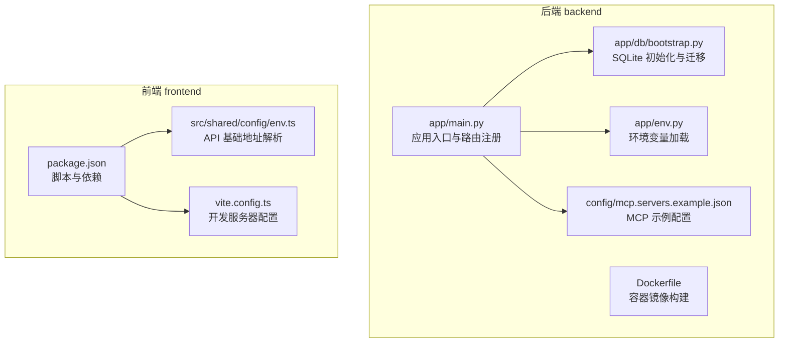
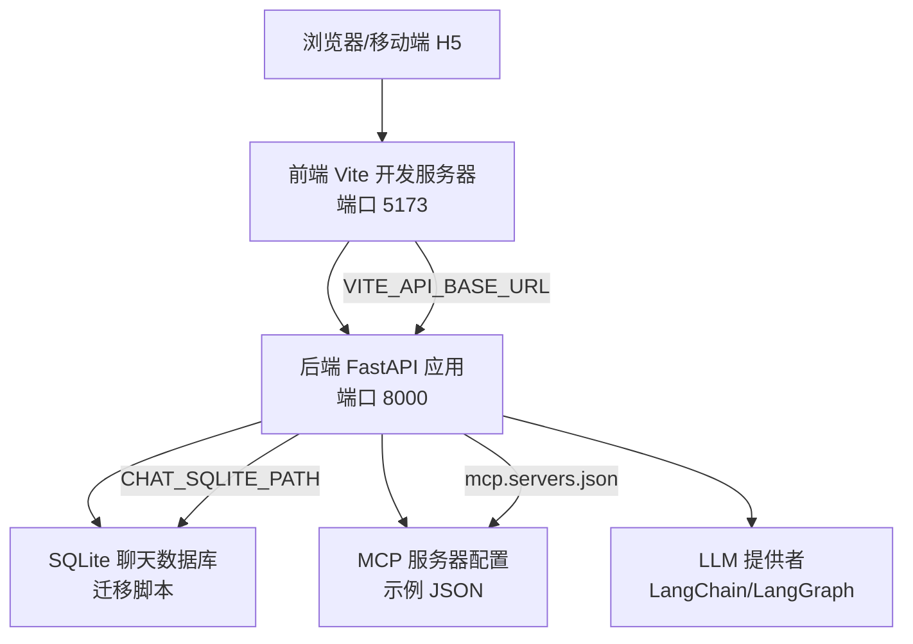
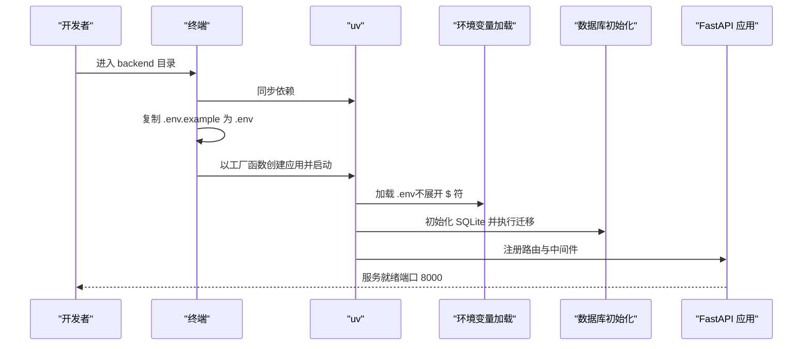
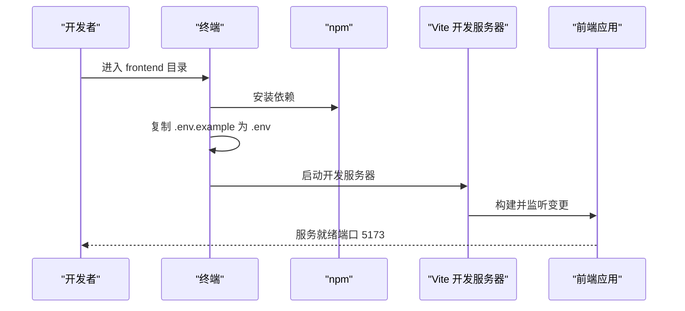
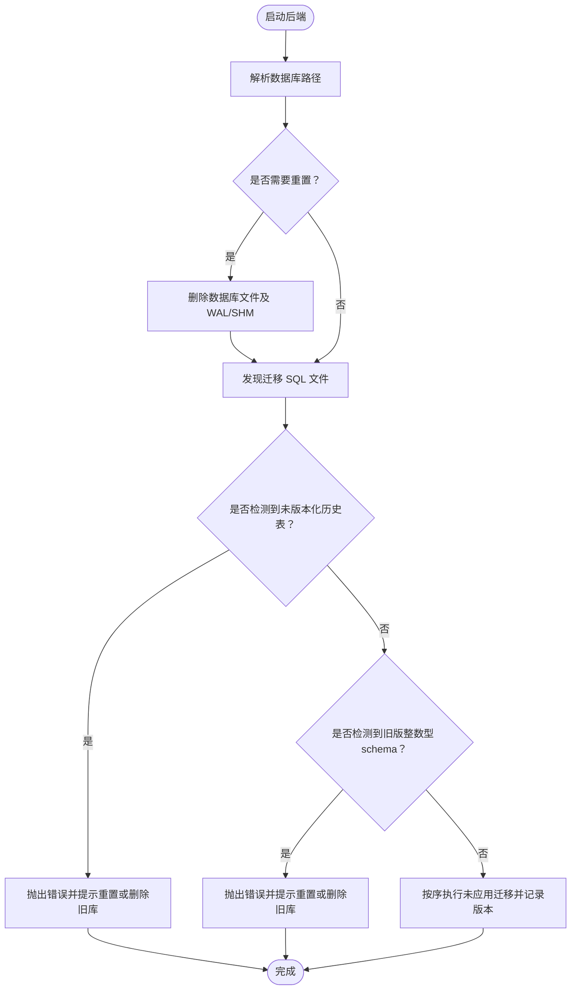
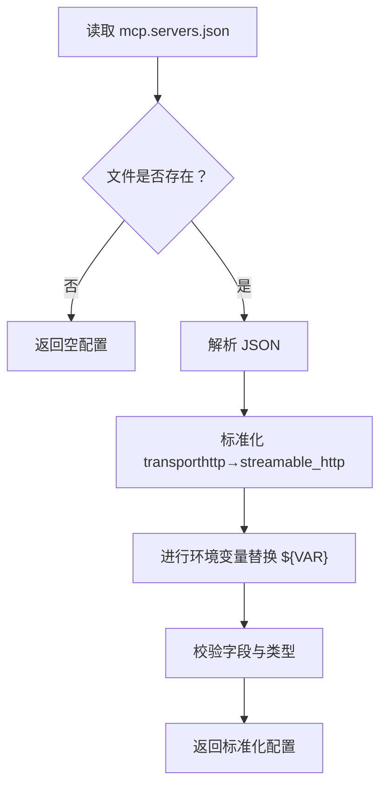
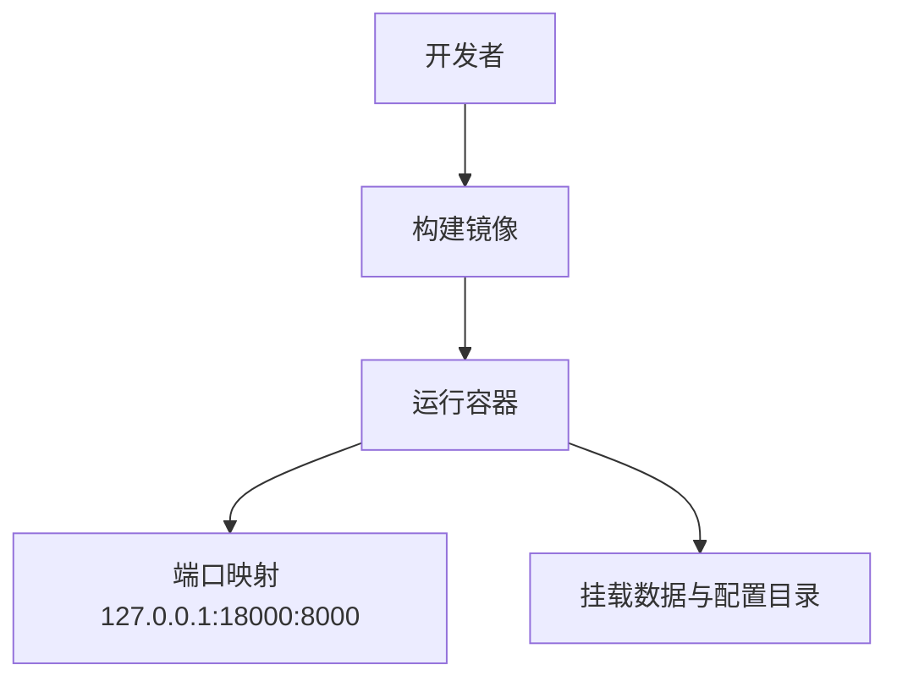
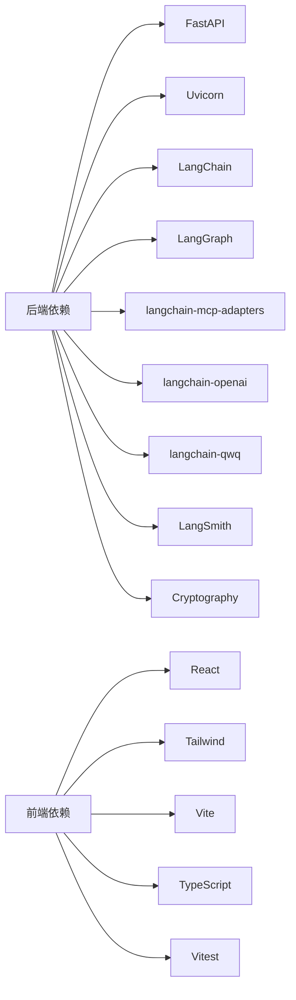

# 快速开始

<cite>
**本文引用的文件**
- [README.md](file://README.md)
- [backend/pyproject.toml](file://backend/pyproject.toml)
- [backend/app/main.py](file://backend/app/main.py)
- [backend/app/env.py](file://backend/app/env.py)
- [backend/app/db/bootstrap.py](file://backend/app/db/bootstrap.py)
- [backend/Dockerfile](file://backend/Dockerfile)
- [docker-compose.aliyun.yml](file://docker-compose.aliyun.yml)
- [backend/config/mcp.servers.example.json](file://backend/config/mcp.servers.example.json)
- [frontend/package.json](file://frontend/package.json)
- [frontend/src/shared/config/env.ts](file://frontend/src/shared/config/env.ts)
- [frontend/vite.config.ts](file://frontend/vite.config.ts)
- [.kiro/settings/mcp.json](file://.kiro/settings/mcp.json)
</cite>

## 目录
1. [简介](#简介)
2. [项目结构](#项目结构)
3. [核心组件](#核心组件)
4. [架构总览](#架构总览)
5. [详细组件分析](#详细组件分析)
6. [依赖关系分析](#依赖关系分析)
7. [性能考虑](#性能考虑)
8. [故障排除指南](#故障排除指南)
9. [结论](#结论)
10. [附录](#附录)

## 简介
本指南面向首次接触 AI 旅行 Agent 项目的开发者，目标是在约 30 分钟内完成环境准备、后端与前端的安装与启动，并理解 MCP 配置的作用与设置方法。项目采用 Python 3.12 + FastAPI 后端、React + Vite + TypeScript 前端，结合 LangChain/LangGraph 与 MCP 实现智能旅行助手能力。

## 项目结构
项目采用前后端分离的目录组织方式，后端位于 backend，前端位于 frontend；另有用于演示的 MCP 配置示例与 Kiro 设置文件。

**图表来源**
- [backend/app/main.py:1-54](file://backend/app/main.py#L1-L54)
- [backend/app/db/bootstrap.py:1-226](file://backend/app/db/bootstrap.py#L1-L226)
- [backend/app/env.py:1-18](file://backend/app/env.py#L1-L18)
- [backend/config/mcp.servers.example.json:1-18](file://backend/config/mcp.servers.example.json#L1-L18)
- [backend/Dockerfile:1-21](file://backend/Dockerfile#L1-L21)
- [frontend/package.json:1-52](file://frontend/package.json#L1-L52)
- [frontend/src/shared/config/env.ts:1-48](file://frontend/src/shared/config/env.ts#L1-L48)
- [frontend/vite.config.ts:1-28](file://frontend/vite.config.ts#L1-L28)

**章节来源**
- [README.md:19-48](file://README.md#L19-L48)
- [backend/app/main.py:1-54](file://backend/app/main.py#L1-L54)
- [frontend/package.json:1-52](file://frontend/package.json#L1-L52)

## 核心组件
- 后端应用入口负责加载环境变量、初始化 SQLite 数据库、注册路由与生命周期事件。
- 数据库模块负责发现并执行迁移脚本，确保表结构与版本一致。
- 环境变量模块以不展开的方式加载 .env，避免敏感值被错误替换。
- 前端通过环境变量解析 API 基础地址，支持本地开发与反向代理部署场景。
- MCP 配置示例展示了如何通过 JSON 描述传输类型、URL、认证头与进程参数等。

**章节来源**
- [backend/app/main.py:31-54](file://backend/app/main.py#L31-L54)
- [backend/app/db/bootstrap.py:181-226](file://backend/app/db/bootstrap.py#L181-L226)
- [backend/app/env.py:10-18](file://backend/app/env.py#L10-L18)
- [frontend/src/shared/config/env.ts:29-48](file://frontend/src/shared/config/env.ts#L29-L48)
- [backend/config/mcp.servers.example.json:1-18](file://backend/config/mcp.servers.example.json#L1-L18)

## 架构总览
下图展示从浏览器到后端 API 再到数据库与 MCP 服务的整体调用链路。

**图表来源**
- [frontend/vite.config.ts:10-14](file://frontend/vite.config.ts#L10-L14)
- [backend/app/main.py:31-54](file://backend/app/main.py#L31-L54)
- [backend/app/db/bootstrap.py:38-41](file://backend/app/db/bootstrap.py#L38-L41)
- [backend/config/mcp.servers.example.json:1-18](file://backend/config/mcp.servers.example.json#L1-L18)

## 详细组件分析

### 后端：环境准备与启动
- Python 版本要求：后端项目要求 Python 3.12 及以上。
- 包管理器：使用 uv 进行依赖同步与运行。
- 启动命令：进入 backend 目录后，先同步依赖，复制示例环境文件为实际 .env，再以工厂函数创建应用并启用热更新模式启动。
- 热更新目录：对 app 与 config 目录启用自动重载，便于开发调试。
- 端口：默认监听 8000 端口。

**图表来源**
- [README.md:50-57](file://README.md#L50-L57)
- [backend/app/env.py:10-18](file://backend/app/env.py#L10-L18)
- [backend/app/db/bootstrap.py:213-226](file://backend/app/db/bootstrap.py#L213-L226)
- [backend/app/main.py:31-54](file://backend/app/main.py#L31-L54)

**章节来源**
- [backend/pyproject.toml:5-24](file://backend/pyproject.toml#L5-L24)
- [README.md:50-57](file://README.md#L50-L57)
- [backend/app/env.py:10-18](file://backend/app/env.py#L10-L18)
- [backend/app/db/bootstrap.py:213-226](file://backend/app/db/bootstrap.py#L213-L226)
- [backend/app/main.py:31-54](file://backend/app/main.py#L31-L54)

### 前端：环境准备与启动
- 依赖安装：使用 npm 安装依赖。
- 启动命令：复制示例环境文件为 .env，然后启动开发服务器。
- 开发服务器端口：默认 5173。
- API 基础地址解析：支持通过 VITE_API_BASE_URL 指定后端地址；若在非本地页面访问且配置指向本地，则自动回退为同源的 /api 路径，适配反向代理部署。

**图表来源**
- [README.md:59-66](file://README.md#L59-L66)
- [frontend/package.json:6-12](file://frontend/package.json#L6-L12)
- [frontend/vite.config.ts:10-14](file://frontend/vite.config.ts#L10-L14)
- [frontend/src/shared/config/env.ts:29-48](file://frontend/src/shared/config/env.ts#L29-L48)

**章节来源**
- [README.md:59-66](file://README.md#L59-L66)
- [frontend/package.json:6-12](file://frontend/package.json#L6-L12)
- [frontend/src/shared/config/env.ts:1-48](file://frontend/src/shared/config/env.ts#L1-L48)
- [frontend/vite.config.ts:1-28](file://frontend/vite.config.ts#L1-L28)

### 数据库初始化与迁移
- 数据库路径：可通过 CHAT_SQLITE_PATH 环境变量指定；默认位于 backend/data/chat.db。
- 迁移发现：扫描 migrations 目录下的 SQL 文件，按版本号顺序执行。
- 版本表：schema_migrations 记录已应用的迁移版本。
- 兼容性保护：对未版本化的旧表与历史整数型 schema 进行保护性检查，必要时提示重置或删除旧数据库。

**图表来源**
- [backend/app/db/bootstrap.py:38-41](file://backend/app/db/bootstrap.py#L38-L41)
- [backend/app/db/bootstrap.py:181-226](file://backend/app/db/bootstrap.py#L181-L226)
- [backend/app/db/bootstrap.py:112-130](file://backend/app/db/bootstrap.py#L112-L130)
- [backend/app/db/bootstrap.py:142-164](file://backend/app/db/bootstrap.py#L142-L164)

**章节来源**
- [backend/app/db/bootstrap.py:181-226](file://backend/app/db/bootstrap.py#L181-L226)
- [backend/app/db/bootstrap.py:112-130](file://backend/app/db/bootstrap.py#L112-L130)
- [backend/app/db/bootstrap.py:142-164](file://backend/app/db/bootstrap.py#L142-L164)

### MCP 配置文件
- 主配置文件：backend/config/mcp.servers.json
- 默认行为：空配置保证可启动；可参考 backend/config/mcp.servers.example.json
- 环境变量注入：支持 ${ENV_VAR} 形式注入
- 传输类型：支持 stdio 与 http；其中 http 将被标准化为 streamable_http
- 示例字段：transport、url、headers、command、args、env 等
- 附加参考：.kiro/settings/mcp.json 展示了另一种 MCP 服务配置风格（如 Amplitude MCP）

**图表来源**
- [backend/config/mcp.servers.example.json:1-18](file://backend/config/mcp.servers.example.json#L1-L18)
- [backend/app/mcp/config.py:63-90](file://backend/app/mcp/config.py#L63-L90)

**章节来源**
- [README.md:68-77](file://README.md#L68-L77)
- [backend/config/mcp.servers.example.json:1-18](file://backend/config/mcp.servers.example.json#L1-L18)
- [.kiro/settings/mcp.json:1-13](file://.kiro/settings/mcp.json#L1-L13)

### 容器化部署（可选）
- 使用 Dockerfile 构建 Python 3.12 slim 镜像，安装 uv 并预装依赖。
- 暴露 8000 端口，默认 CMD 启动 uvicorn。
- docker-compose.aliyun.yml 提供阿里云部署示例，将宿主机端口映射到容器 8000，并挂载数据与配置目录。

**图表来源**
- [backend/Dockerfile:1-21](file://backend/Dockerfile#L1-L21)
- [docker-compose.aliyun.yml:1-14](file://docker-compose.aliyun.yml#L1-L14)

**章节来源**
- [backend/Dockerfile:1-21](file://backend/Dockerfile#L1-L21)
- [docker-compose.aliyun.yml:1-14](file://docker-compose.aliyun.yml#L1-L14)

## 依赖关系分析
- 后端依赖：FastAPI、Uvicorn、Pydantic、Pydantic Settings、dotenv、JWT、DashScope、HTTPX、LangChain、LangGraph、langchain-mcp-adapters、OpenAI/QwQ 提供者、LangSmith、Cryptography 等。
- 前端依赖：React、React DOM、Tailwind、shadcn/ui 风格组件、Vite、TypeScript、测试工具等。
- 开发依赖：pytest、pytest-asyncio（后端），Vitest、Testing Library（前端）。

**图表来源**
- [backend/pyproject.toml:6-24](file://backend/pyproject.toml#L6-L24)
- [frontend/package.json:14-50](file://frontend/package.json#L14-L50)

**章节来源**
- [backend/pyproject.toml:1-42](file://backend/pyproject.toml#L1-L42)
- [frontend/package.json:1-52](file://frontend/package.json#L1-L52)

## 性能考虑
- 启动阶段：数据库迁移与 Agent 初始化在应用生命周期中一次性完成，避免重复开销。
- 热更新：开发模式下对 app 与 config 目录启用自动重载，提升迭代效率。
- 端口与网络：前后端分别使用 8000（后端）与 5173（前端）端口，避免冲突。
- 生产部署：建议通过反向代理将前端静态资源与后端 API 统一对外提供，减少跨域与证书问题。

[本节为通用指导，无需列出具体文件来源]

## 故障排除指南
- 后端无法启动或端口占用
  - 确认 8000 端口未被占用；如需更改，可在启动命令中调整端口。
  - 参考启动命令与端口配置。
  - 章节来源: [README.md:50-57](file://README.md#L50-L57), [backend/app/main.py:31-54](file://backend/app/main.py#L31-L54)

- 前端无法访问后端 API
  - 检查 VITE_API_BASE_URL 是否正确指向后端地址；若部署在生产环境且后端为 /api，请确保前端也使用 /api 基础路径。
  - 章节来源: [frontend/src/shared/config/env.ts:29-48](file://frontend/src/shared/config/env.ts#L29-L48), [frontend/package.json:6-12](file://frontend/package.json#L6-L12)

- 数据库迁移失败或历史表冲突
  - 若出现“未版本化的历史 chat.db”或“旧版整数型 schema”提示，按提示设置 DEV_RESET_CHAT_DB=true 或删除旧数据库后重启。
  - 章节来源: [backend/app/db/bootstrap.py:112-130](file://backend/app/db/bootstrap.py#L112-L130), [backend/app/db/bootstrap.py:142-164](file://backend/app/db/bootstrap.py#L142-L164)

- 环境变量未生效
  - 后端 .env 加载时不展开 $ 符，避免敏感值被错误替换；请确认 .env 文件存在且键名正确。
  - 章节来源: [backend/app/env.py:10-18](file://backend/app/env.py#L10-L18), [README.md:55-56](file://README.md#L55-L56)

- MCP 配置报错
  - 确保 mcp.servers.json 存在且为对象格式；http 传输将被标准化为 streamable_http；缺失的环境变量会在替换阶段报错。
  - 章节来源: [backend/config/mcp.servers.example.json:1-18](file://backend/config/mcp.servers.example.json#L1-L18), [backend/app/mcp/config.py:63-90](file://backend/app/mcp/config.py#L63-L90)

- 容器部署问题
  - 确认镜像构建成功、端口映射正确、数据与配置目录挂载正常；必要时检查日志与权限。
  - 章节来源: [backend/Dockerfile:1-21](file://backend/Dockerfile#L1-L21), [docker-compose.aliyun.yml:1-14](file://docker-compose.aliyun.yml#L1-L14)

## 结论
按照本指南，您可以在 30 分钟内完成从 Python 3.12 与 Node.js 环境准备、后端与前端安装、数据库初始化与启动，以及 MCP 配置的基础设置。遇到问题时，可依据故障排除指南逐项排查。建议在本地开发完成后，结合 docker-compose 进行容器化部署验证。

[本节为总结性内容，无需列出具体文件来源]

## 附录

### 快速命令清单
- 后端启动
  - 进入 backend 目录，同步依赖，复制 .env.example 为 .env，启动后端服务。
  - 参考: [README.md:50-57](file://README.md#L50-L57)
- 前端启动
  - 进入 frontend 目录，安装依赖，复制 .env.example 为 .env，启动前端开发服务器。
  - 参考: [README.md:59-66](file://README.md#L59-L66)
- 数据库初始化
  - 后端启动时自动执行数据库初始化与迁移；如需重置，设置相关环境变量后重启。
  - 参考: [backend/app/db/bootstrap.py:213-226](file://backend/app/db/bootstrap.py#L213-L226)
- MCP 配置
  - 在 backend/config/mcp.servers.json 中添加或修改 MCP 服务器配置；支持 ${ENV_VAR} 注入与 http→streamable_http 标准化。
  - 参考: [README.md:68-77](file://README.md#L68-L77), [backend/config/mcp.servers.example.json:1-18](file://backend/config/mcp.servers.example.json#L1-L18)