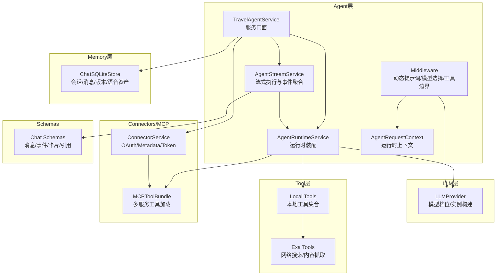
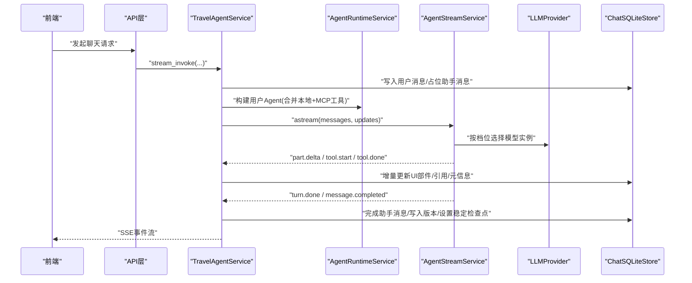
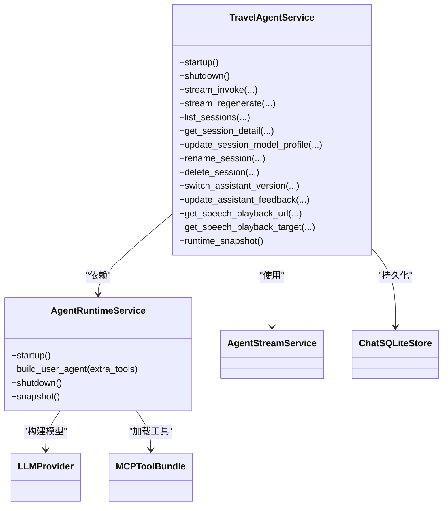
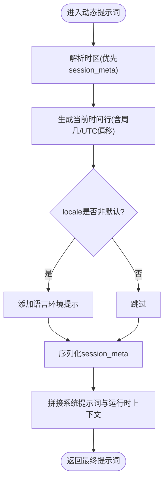
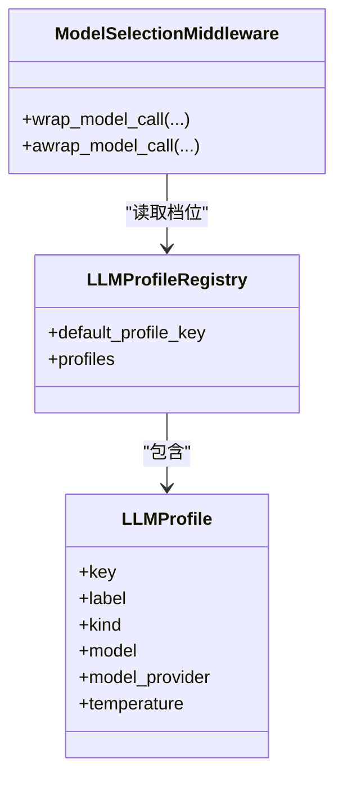
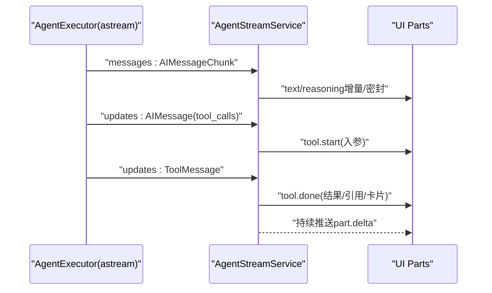
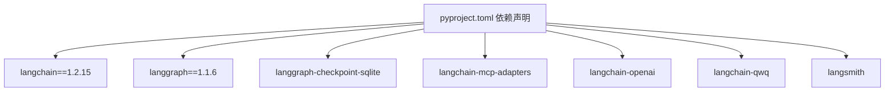

# Agent定制

<cite>
**本文引用的文件**
- [backend/app/agent/service.py](file://backend/app/agent/service.py)
- [backend/app/agent/runtime.py](file://backend/app/agent/runtime.py)
- [backend/app/agent/context.py](file://backend/app/agent/context.py)
- [backend/app/agent/middleware.py](file://backend/app/agent/middleware.py)
- [backend/app/agent/streaming.py](file://backend/app/agent/streaming.py)
- [backend/app/prompt/system.py](file://backend/app/prompt/system.py)
- [backend/app/tool/local_tools.py](file://backend/app/tool/local_tools.py)
- [backend/app/tool/exa_tools.py](file://backend/app/tool/exa_tools.py)
- [backend/app/llm/provider.py](file://backend/app/llm/provider.py)
- [backend/app/memory/sqlite_store.py](file://backend/app/memory/sqlite_store.py)
- [backend/app/connectors/service.py](file://backend/app/connectors/service.py)
- [backend/app/mcp/client.py](file://backend/app/mcp/client.py)
- [backend/app/schemas/chat.py](file://backend/app/schemas/chat.py)
- [backend/pyproject.toml](file://backend/pyproject.toml)
</cite>

## 目录
1. [简介](#简介)
2. [项目结构](#项目结构)
3. [核心组件](#核心组件)
4. [架构总览](#架构总览)
5. [详细组件分析](#详细组件分析)
6. [依赖分析](#依赖分析)
7. [性能考虑](#性能考虑)
8. [故障排查指南](#故障排查指南)
9. [结论](#结论)
10. [附录](#附录)

## 简介
本文件面向需要定制与优化智能旅行Agent的开发者，系统讲解Agent服务层扩展、运行时配置与状态管理、系统提示词定制、LLM提供者切换与模型参数调整、Agent决策流程与工具调用策略优化、响应格式定制、行为测试与性能调优、稳定性保障、监控与日志、调试技巧，以及实际定制案例与最佳实践。

## 项目结构
后端采用分层清晰的Python包结构：
- agent层：服务门面、运行时装配、中间件、流式执行与事件聚合、上下文与提示词集成
- llm层：模型档位与提供者配置、模型实例构建
- memory层：SQLite存储与检查点
- tool层：本地工具与外部工具（如Exa）
- connectors层：OAuth与MCP连接器编排
- schemas层：统一的聊天与事件数据模型
- API层：FastAPI路由（在本仓库中位于app/api目录）

图表来源
- [backend/app/agent/service.py](file://backend/app/agent/service.py)
- [backend/app/agent/runtime.py](file://backend/app/agent/runtime.py)
- [backend/app/agent/middleware.py](file://backend/app/agent/middleware.py)
- [backend/app/agent/streaming.py](file://backend/app/agent/streaming.py)
- [backend/app/llm/provider.py](file://backend/app/llm/provider.py)
- [backend/app/memory/sqlite_store.py](file://backend/app/memory/sqlite_store.py)
- [backend/app/connectors/service.py](file://backend/app/connectors/service.py)
- [backend/app/mcp/client.py](file://backend/app/mcp/client.py)
- [backend/app/schemas/chat.py](file://backend/app/schemas/chat.py)

章节来源
- [backend/app/agent/service.py](file://backend/app/agent/service.py)
- [backend/app/agent/runtime.py](file://backend/app/agent/runtime.py)
- [backend/app/agent/middleware.py](file://backend/app/agent/middleware.py)
- [backend/app/agent/streaming.py](file://backend/app/agent/streaming.py)
- [backend/app/llm/provider.py](file://backend/app/llm/provider.py)
- [backend/app/memory/sqlite_store.py](file://backend/app/memory/sqlite_store.py)
- [backend/app/connectors/service.py](file://backend/app/connectors/service.py)
- [backend/app/mcp/client.py](file://backend/app/mcp/client.py)
- [backend/app/schemas/chat.py](file://backend/app/schemas/chat.py)

## 核心组件
- 服务门面 TravelAgentService：负责会话生命周期、模型档位切换、消息持久化、语音合成、流式事件转发、错误回滚与快照
- 运行时 AgentRuntimeService：装配Agent、合并本地与MCP工具、按档位动态选择模型、生命周期管理与快照
- 中间件 Middleware：动态拼装系统提示词、工具异常边界、按档位选择模型实例
- 流式执行 AgentStreamService：LangGraph事件拆解、文本/思考/工具事件聚合、引用与卡片抽取
- LLM Provider：模型档位注册、实例构建、温度与适配器选择
- 存储 ChatSQLiteStore：消息/版本/会话/语音资产的持久化与查询
- 工具 Local Tools / Exa Tools：本地时间工具与网络搜索/内容抓取工具
- Connectors/MCP：OAuth授权、令牌刷新、MCP工具加载与客户端管理
- Schemas：统一的消息、事件、卡片、引用与元信息模型

章节来源
- [backend/app/agent/service.py](file://backend/app/agent/service.py)
- [backend/app/agent/runtime.py](file://backend/app/agent/runtime.py)
- [backend/app/agent/middleware.py](file://backend/app/agent/middleware.py)
- [backend/app/agent/streaming.py](file://backend/app/agent/streaming.py)
- [backend/app/llm/provider.py](file://backend/app/llm/provider.py)
- [backend/app/memory/sqlite_store.py](file://backend/app/memory/sqlite_store.py)
- [backend/app/tool/local_tools.py](file://backend/app/tool/local_tools.py)
- [backend/app/tool/exa_tools.py](file://backend/app/tool/exa_tools.py)
- [backend/app/connectors/service.py](file://backend/app/connectors/service.py)
- [backend/app/mcp/client.py](file://backend/app/mcp/client.py)
- [backend/app/schemas/chat.py](file://backend/app/schemas/chat.py)

## 架构总览
Agent整体采用LangGraph执行引擎，结合LangChain中间件与工具集，通过服务门面统一调度，支持多模型档位与MCP工具扩展，同时具备完整的流式事件与UI部件聚合能力。

图表来源
- [backend/app/agent/service.py](file://backend/app/agent/service.py)
- [backend/app/agent/runtime.py](file://backend/app/agent/runtime.py)
- [backend/app/agent/streaming.py](file://backend/app/agent/streaming.py)
- [backend/app/llm/provider.py](file://backend/app/llm/provider.py)
- [backend/app/memory/sqlite_store.py](file://backend/app/memory/sqlite_store.py)

## 详细组件分析

### 服务层扩展与运行时配置
- 服务门面 TravelAgentService
  - 会话管理：列出/详情/重命名/删除、模型档位更新、版本切换与反馈
  - 流式执行：stream_invoke与stream_regenerate，封装LangGraph事件并持久化
  - 错误处理：统一记录异常、取消语音生成、回滚线程、清理临时版本
  - 运行时快照：runtime_snapshot用于健康检查
- 运行时 AgentRuntimeService
  - 启动：加载本地工具、MCP工具、检查点、构建Agent与中间件
  - 构建用户Agent：按需合并用户级MCP工具
  - 关闭：释放MCP客户端与SQLite连接
  - 快照：汇总MCP连接状态、工具清单

图表来源
- [backend/app/agent/service.py](file://backend/app/agent/service.py)
- [backend/app/agent/runtime.py](file://backend/app/agent/runtime.py)
- [backend/app/llm/provider.py](file://backend/app/llm/provider.py)
- [backend/app/mcp/client.py](file://backend/app/mcp/client.py)

章节来源
- [backend/app/agent/service.py](file://backend/app/agent/service.py)
- [backend/app/agent/runtime.py](file://backend/app/agent/runtime.py)

### 系统提示词定制与运行时上下文
- 系统提示词 TRAVEL_SYSTEM_PROMPT：角色、输出原则、工具使用与引用规范、推荐写法对比、时间感知、信息收集边界与格式约束
- 动态提示词 travel_dynamic_prompt：基于AgentRequestContext注入“当前时间”、“语言环境”、“会话元信息”，保证模型始终基于运行时上下文生成
- 时区与本地化：_format_runtime_clock与_session_meta序列化，确保跨时区一致性

图表来源
- [backend/app/agent/middleware.py](file://backend/app/agent/middleware.py)
- [backend/app/prompt/system.py](file://backend/app/prompt/system.py)

章节来源
- [backend/app/agent/middleware.py](file://backend/app/agent/middleware.py)
- [backend/app/prompt/system.py](file://backend/app/prompt/system.py)

### LLM提供者切换与模型参数调整
- 模型档位：standard/thinking，分别映射到不同模型名、provider与temperature
- 实例构建：按档位独立实例化ChatModel，运行时通过ModelSelectionMiddleware按context.model_profile_key动态替换
- 适配器：QwQ/Qwen系列特殊处理，支持enable_thinking开关
- 环境变量：LLM_PROFILE_*与LLM_*系列控制模型名、provider、温度与默认档位

图表来源
- [backend/app/llm/provider.py](file://backend/app/llm/provider.py)
- [backend/app/agent/middleware.py](file://backend/app/agent/middleware.py)

章节来源
- [backend/app/llm/provider.py](file://backend/app/llm/provider.py)
- [backend/app/agent/middleware.py](file://backend/app/agent/middleware.py)

### Agent决策流程与工具调用策略
- LangGraph事件拆分：messages通道仅消费AIMessageChunk（LLM token），updates通道消费AIMessage.tool_calls与ToolMessage
- 工具事件去重：基于call_id，避免重复触发tool.start/tool.done
- UI部件聚合：文本/思考/工具三类Part的状态机，跨节点切换时自动密封上一段
- 引用与卡片：从工具trace中抽取引用来源与结构化卡片，支持src-N标注解析

图表来源
- [backend/app/agent/streaming.py](file://backend/app/agent/streaming.py)

章节来源
- [backend/app/agent/streaming.py](file://backend/app/agent/streaming.py)

### 响应格式与UI部件定制
- 文本/思考/工具三类Part：统一的ChatMessagePart模型，支持状态与注解
- 引用注解：src-N标记解析为CitationSource，携带位置索引
- 结构化卡片：通过trace抽取，前端按card_type渲染
- 最终响应：build_final_response聚合累积chunk与工具轨迹，写入meta

章节来源
- [backend/app/agent/streaming.py](file://backend/app/agent/streaming.py)
- [backend/app/schemas/chat.py](file://backend/app/schemas/chat.py)

### 工具扩展与MCP集成
- 本地工具：时间工具、Exa搜索/抓取
- MCP工具：多服务连接、工具批量加载、连接状态与错误收集
- 用户级工具：按用户授权状态动态注入，与全局工具合并

章节来源
- [backend/app/tool/local_tools.py](file://backend/app/tool/local_tools.py)
- [backend/app/tool/exa_tools.py](file://backend/app/tool/exa_tools.py)
- [backend/app/mcp/client.py](file://backend/app/mcp/client.py)
- [backend/app/connectors/service.py](file://backend/app/connectors/service.py)

### 会话与状态管理
- 会话：ChatSQLiteStore负责会话创建、消息写入、版本管理、语音资产与检查点
- 版本：支持原始版本与重新生成版本，最大保留数量限制
- 检查点：LangGraph检查点驱动流式恢复与回滚
- 语音：与TTS集成，流式文本增量同步到语音任务

章节来源
- [backend/app/memory/sqlite_store.py](file://backend/app/memory/sqlite_store.py)
- [backend/app/agent/service.py](file://backend/app/agent/service.py)

## 依赖分析
- 第三方依赖：FastAPI、Uvicorn、LangChain/LangGraph、LangSmith、DashScope/QwQ、HTTPX、Cryptography等
- Agent运行依赖：LangGraph执行器、LangChain中间件、SQLite检查点、MCP客户端

图表来源
- [backend/pyproject.toml](file://backend/pyproject.toml)

章节来源
- [backend/pyproject.toml](file://backend/pyproject.toml)

## 性能考虑
- 模型实例池：按档位预构建ChatModel，运行时仅做实例替换，避免频繁初始化
- 事件流解耦：messages与updates分离，减少状态竞争与重复事件
- UI部件密封：跨节点切换时主动密封，降低前端状态复杂度
- 语音流：文本增量直接喂入TTS，避免二次拼接
- 存储批处理：批量序列化UI部件与元信息，减少IO往返

## 故障排查指南
- 统一异常记录：服务门面在流式执行异常时记录上下文，便于后端排查
- 工具异常边界：中间件将工具异常转换为标准ToolMessage，保留工具名与call_id
- 会话回滚：发生异常时回滚到最近合法检查点，清理临时版本
- MCP连接错误：记录连接失败的服务与错误信息，辅助诊断
- LangSmith追踪：为聊天事件打标签，便于端到端追踪

章节来源
- [backend/app/agent/service.py](file://backend/app/agent/service.py)
- [backend/app/agent/middleware.py](file://backend/app/agent/middleware.py)
- [backend/app/connectors/service.py](file://backend/app/connectors/service.py)

## 结论
通过服务门面、运行时装配、中间件与流式执行的协同，Agent实现了可插拔的工具体系、灵活的模型档位切换与稳定的流式交互体验。依托SQLite检查点与完善的错误回滚机制，系统在复杂旅行场景下具备良好的可靠性与可扩展性。开发者可在不破坏核心流程的前提下，按需定制提示词、工具与响应格式，并通过环境变量与配置文件进行运行时优化。

## 附录

### 定制步骤与最佳实践
- 定制系统提示词
  - 修改系统提示词模板，确保输出原则与工具使用规范符合业务目标
  - 通过动态提示词注入运行时上下文，避免模型使用过期信息
  - 参考路径：[backend/app/prompt/system.py](file://backend/app/prompt/system.py)、[backend/app/agent/middleware.py](file://backend/app/agent/middleware.py)
- 切换LLM提供者与模型参数
  - 通过环境变量配置模型名、provider与温度，支持standard/thinking档位
  - 对QwQ/Qwen系列按需启用enable_thinking
  - 参考路径：[backend/app/llm/provider.py](file://backend/app/llm/provider.py)
- 扩展工具集
  - 新增本地工具：在本地工具集合中注册，随Agent自动可用
  - 新增MCP工具：在MCP配置中添加服务，运行时自动加载
  - 参考路径：[backend/app/tool/local_tools.py](file://backend/app/tool/local_tools.py)、[backend/app/mcp/client.py](file://backend/app/mcp/client.py)
- 优化工具调用策略
  - 在中间件中增加工具调用前置校验与限流
  - 通过工具边界捕获异常并标准化返回
  - 参考路径：[backend/app/agent/middleware.py](file://backend/app/agent/middleware.py)
- 响应格式定制
  - 通过结构化卡片与引用注解增强可解释性
  - 在流式阶段及时密封UI部件，避免前端状态滞留
  - 参考路径：[backend/app/agent/streaming.py](file://backend/app/agent/streaming.py)、[backend/app/schemas/chat.py](file://backend/app/schemas/chat.py)
- 行为测试与性能调优
  - 使用测试用例覆盖Agent流式事件、工具调用与错误分支
  - 通过LangSmith追踪关键路径，定位性能瓶颈
  - 参考路径：[backend/tests/test_agent_streaming.py](file://backend/tests/test_agent_streaming.py)、[backend/tests/test_agent_service.py](file://backend/tests/test_agent_service.py)
- 稳定性保障
  - 启用检查点与回滚机制，异常时自动恢复
  - 记录详细日志与LangSmith追踪，快速定位问题
  - 参考路径：[backend/app/agent/service.py](file://backend/app/agent/service.py)、[backend/app/memory/sqlite_store.py](file://backend/app/memory/sqlite_store.py)
- 监控与日志
  - 使用LangSmith标签与追踪事件，建立端到端可观测性
  - 在服务门面与中间件中埋点关键指标（耗时、错误率、工具调用次数）
  - 参考路径：[backend/app/observability/langsmith.py](file://backend/app/observability/langsmith.py)
- 调试技巧
  - 逐步缩小问题范围：先验证提示词与工具可用性，再检查流式事件与UI部件
  - 使用最小化输入复现问题，结合日志与追踪定位根因
  - 参考路径：[backend/app/agent/streaming.py](file://backend/app/agent/streaming.py)、[backend/app/agent/middleware.py](file://backend/app/agent/middleware.py)