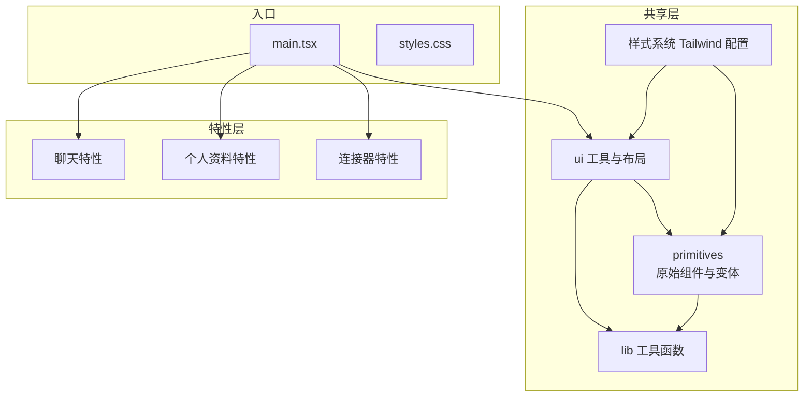
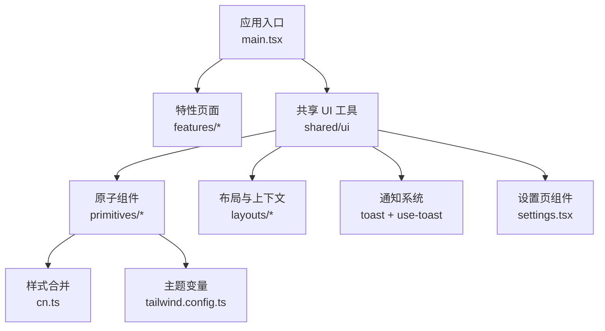
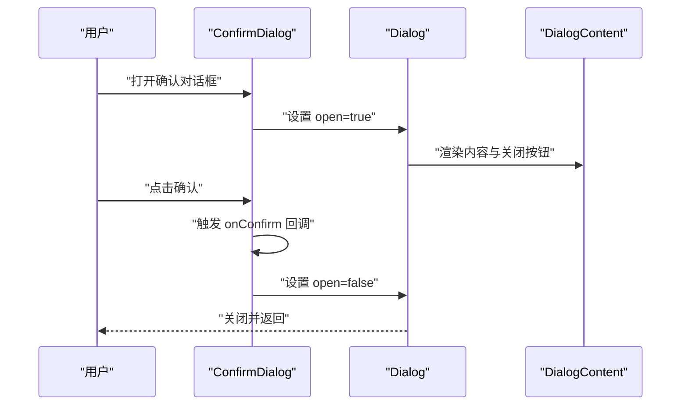
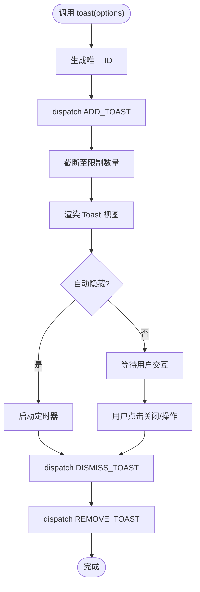
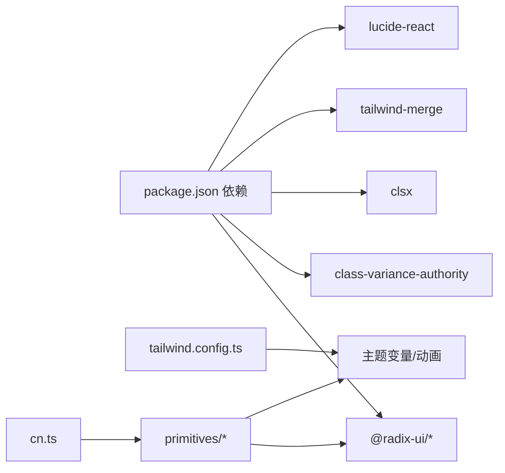

# UI组件扩展

<cite>
**本文引用的文件**
- [package.json](file://frontend/package.json)
- [tailwind.config.ts](file://frontend/tailwind.config.ts)
- [cn.ts](file://frontend/src/shared/lib/cn.ts)
- [index.ts（primitives 导出）](file://frontend/src/shared/ui/primitives/index.ts)
- [button.tsx](file://frontend/src/shared/ui/primitives/button.tsx)
- [card.tsx](file://frontend/src/shared/ui/primitives/card.tsx)
- [input.tsx](file://frontend/src/shared/ui/primitives/input.tsx)
- [textarea.tsx](file://frontend/src/shared/ui/primitives/textarea.tsx)
- [switch.tsx](file://frontend/src/shared/ui/primitives/switch.tsx)
- [badge.tsx](file://frontend/src/shared/ui/primitives/badge.tsx)
- [dialog.tsx](file://frontend/src/shared/ui/primitives/dialog.tsx)
- [dropdown-menu.tsx](file://frontend/src/shared/ui/primitives/dropdown-menu.tsx)
- [flating-input.tsx](file://frontend/src/shared/ui/primitives/flating-input.tsx)
- [toast.tsx](file://frontend/src/shared/ui/primitives/toast.tsx)
- [use-toast.ts](file://frontend/src/shared/ui/primitives/use-toast.ts)
- [settings.tsx](file://frontend/src/shared/ui/settings.tsx)
- [confirm-dialog.tsx](file://frontend/src/shared/ui/confirm-dialog.tsx)
- [app-surface-overlay.tsx](file://frontend/src/shared/layouts/app-surface-overlay.tsx)
- [chat-page.tsx](file://frontend/src/features/chat/ui/chat-page.tsx)
- [hotel-card-list.tsx](file://frontend/src/features/chat/ui/hotel-card-list.tsx)
- [profile-page.tsx](file://frontend/src/features/profile/ui/profile-page.tsx)
- [connectors-page.tsx](file://frontend/src/features/connectors/ui/connectors-page.tsx)
- [chat-message.test.tsx](file://frontend/src/features/chat/ui/chat-message.test.tsx)
- [chat-page.test.tsx](file://frontend/src/features/chat/ui/chat-page.test.tsx)
- [profile-page.test.tsx](file://frontend/src/features/profile/ui/profile-page.test.tsx)
- [tool-card-registry.test.ts](file://frontend/src/features/chat/model/tool-card-registry.test.ts)
</cite>

## 目录
1. [简介](#简介)
2. [项目结构](#项目结构)
3. [核心组件](#核心组件)
4. [架构总览](#架构总览)
5. [组件详解](#组件详解)
6. [依赖关系分析](#依赖关系分析)
7. [性能与可访问性](#性能与可访问性)
8. [测试与质量保障](#测试与质量保障)
9. [版本管理与维护策略](#版本管理与维护策略)
10. [结论](#结论)
11. [附录：扩展示例与设计规范](#附录扩展示例与设计规范)

## 简介
本文件面向前端开发者，系统化讲解如何在旅行 Agent 项目中基于 shadcn/ui 风格的组件体系进行 UI 扩展与定制。内容覆盖：
- 组件库使用与统一导出机制
- 自定义组件开发流程与样式系统扩展
- 布局组件定制、主题变量与响应式实现
- 表单组件扩展、对话框定制与动画效果
- 组件测试方法、性能优化与无障碍支持
- 文档编写、版本管理与维护策略
- 完整的 UI 扩展示例与设计规范

## 项目结构
前端采用“分层+特性”混合组织方式：
- shared 层提供通用 UI 原子与组合组件、工具函数与样式系统
- features 层按业务域组织页面与交互组件
- 根目录入口负责应用装配与全局样式

图示来源
- [tailwind.config.ts:1-99](file://frontend/tailwind.config.ts#L1-L99)
- [index.ts（primitives 导出）:1-32](file://frontend/src/shared/ui/primitives/index.ts#L1-L32)
- [cn.ts:1-7](file://frontend/src/shared/lib/cn.ts#L1-L7)

章节来源
- [tailwind.config.ts:1-99](file://frontend/tailwind.config.ts#L1-L99)
- [index.ts（primitives 导出）:1-32](file://frontend/src/shared/ui/primitives/index.ts#L1-L32)
- [cn.ts:1-7](file://frontend/src/shared/lib/cn.ts#L1-L7)

## 核心组件
- 原子组件与变体：按钮、输入、文本域、开关、徽章、卡片等，均通过 class-variance-authority 提供变体与默认值，统一由 primitives/index.ts 汇总导出，便于集中管理与替换。
- 对话框与下拉菜单：基于 Radix UI，封装动画与无障碍属性，满足移动端与桌面端一致体验。
- Toast 通知：提供 Provider、Viewport、Toast 及 Action/Close/Title/Description 组合，配合 use-toast 实现全局状态与队列控制。
- 设置页组件：SettingsGroup/SettingsRow/SettingsRowButton 提供设置类页面的统一布局与交互模式。
- 浮动标签输入：FlatingInput 在聚焦或有值时将占位标签浮动到输入框上方，提升信息密度与可用性。

章节来源
- [button.tsx:1-55](file://frontend/src/shared/ui/primitives/button.tsx#L1-L55)
- [card.tsx:1-56](file://frontend/src/shared/ui/primitives/card.tsx#L1-L56)
- [input.tsx:1-27](file://frontend/src/shared/ui/primitives/input.tsx#L1-L27)
- [textarea.tsx:1-25](file://frontend/src/shared/ui/primitives/textarea.tsx#L1-L25)
- [switch.tsx:1-24](file://frontend/src/shared/ui/primitives/switch.tsx#L1-L24)
- [badge.tsx:1-36](file://frontend/src/shared/ui/primitives/badge.tsx#L1-L36)
- [dialog.tsx:1-121](file://frontend/src/shared/ui/primitives/dialog.tsx#L1-L121)
- [dropdown-menu.tsx:1-199](file://frontend/src/shared/ui/primitives/dropdown-menu.tsx#L1-L199)
- [toast.tsx:1-127](file://frontend/src/shared/ui/primitives/toast.tsx#L1-L127)
- [use-toast.ts:1-189](file://frontend/src/shared/ui/primitives/use-toast.ts#L1-L189)
- [settings.tsx:1-120](file://frontend/src/shared/ui/settings.tsx#L1-L120)
- [flating-input.tsx:1-127](file://frontend/src/shared/ui/primitives/flating-input.tsx#L1-L127)

## 架构总览
UI 扩展遵循以下架构原则：
- 统一的样式系统：Tailwind 主题变量与 keyframes 动画，结合 cn 合并工具，确保样式一致性与可维护性。
- 组件变体与组合：通过 cva 定义变体，以组合子组件实现复杂 UI 结构，如 Dialog/Toast/Card。
- 上下文与布局：通过上下文传递根容器等布局信息，保证浮层渲染与层级正确。
- 测试与可访问性：为每个交互组件提供可测试的最小行为单元，并内置无障碍标签与键盘可达性。

图示来源
- [tailwind.config.ts:1-99](file://frontend/tailwind.config.ts#L1-L99)
- [cn.ts:1-7](file://frontend/src/shared/lib/cn.ts#L1-L7)
- [index.ts（primitives 导出）:1-32](file://frontend/src/shared/ui/primitives/index.ts#L1-L32)
- [toast.tsx:1-127](file://frontend/src/shared/ui/primitives/toast.tsx#L1-L127)
- [use-toast.ts:1-189](file://frontend/src/shared/ui/primitives/use-toast.ts#L1-L189)
- [settings.tsx:1-120](file://frontend/src/shared/ui/settings.tsx#L1-L120)

## 组件详解

### 原子组件与变体系统
- 设计要点
  - 使用 cva 定义变体与尺寸，集中管理视觉状态与交互反馈
  - 通过 cn 合并类名，避免冲突并保持可读性
  - 为每个组件提供 forwardRef 与 displayName，便于调试与测试
- 典型组件
  - Button：支持 default/secondary/destructive/outline/ghost/link/primary 等变体与 default/sm/lg/hero/icon 尺寸
  - Badge：支持 default/secondary/destructive/outline/subtle 等变体
  - Card：提供 Card/CardHeader/CardTitle/CardDescription/CardContent/CardFooter 组合
  - Input/Textarea：统一边框、内间距、焦点态与禁用态
  - Switch：基于 Radix UI Switch 的可访问性封装
- 扩展建议
  - 新增变体时，优先在现有变体集合中复用，避免过度发散
  - 为复杂组件拆分子组件，保持单一职责

```mermaid
classDiagram
class Button {
+props : ButtonProps
+displayName : string
}
class Badge {
+props : BadgeProps
+displayName : string
}
class Card {
+props : HTMLAttributes
+displayName : string
}
class Input {
+props : ComponentProps<"input">
+displayName : string
}
class Textarea {
+props : ComponentProps<"textarea">
+displayName : string
}
class Switch {
+props : ComponentPropsWithoutRef
+displayName : string
}
class FlatingInput {
+props : FlatingInputProps
+displayName : string
}
class Dialog {
+props : DialogProps
+displayName : string
}
class DropdownMenu {
+props : MenuProps
+displayName : string
}
class Toast {
+props : ToastProps
+displayName : string
}
class SettingsRow {
+props : SettingsRowBaseProps
+displayName : string
}
```

图示来源
- [button.tsx:1-55](file://frontend/src/shared/ui/primitives/button.tsx#L1-L55)
- [badge.tsx:1-36](file://frontend/src/shared/ui/primitives/badge.tsx#L1-L36)
- [card.tsx:1-56](file://frontend/src/shared/ui/primitives/card.tsx#L1-L56)
- [input.tsx:1-27](file://frontend/src/shared/ui/primitives/input.tsx#L1-L27)
- [textarea.tsx:1-25](file://frontend/src/shared/ui/primitives/textarea.tsx#L1-L25)
- [switch.tsx:1-24](file://frontend/src/shared/ui/primitives/switch.tsx#L1-L24)
- [flating-input.tsx:1-127](file://frontend/src/shared/ui/primitives/flating-input.tsx#L1-L127)
- [dialog.tsx:1-121](file://frontend/src/shared/ui/primitives/dialog.tsx#L1-L121)
- [dropdown-menu.tsx:1-199](file://frontend/src/shared/ui/primitives/dropdown-menu.tsx#L1-L199)
- [toast.tsx:1-127](file://frontend/src/shared/ui/primitives/toast.tsx#L1-L127)
- [settings.tsx:1-120](file://frontend/src/shared/ui/settings.tsx#L1-L120)

章节来源
- [button.tsx:1-55](file://frontend/src/shared/ui/primitives/button.tsx#L1-L55)
- [badge.tsx:1-36](file://frontend/src/shared/ui/primitives/badge.tsx#L1-L36)
- [card.tsx:1-56](file://frontend/src/shared/ui/primitives/card.tsx#L1-L56)
- [input.tsx:1-27](file://frontend/src/shared/ui/primitives/input.tsx#L1-L27)
- [textarea.tsx:1-25](file://frontend/src/shared/ui/primitives/textarea.tsx#L1-L25)
- [switch.tsx:1-24](file://frontend/src/shared/ui/primitives/switch.tsx#L1-L24)
- [flating-input.tsx:1-127](file://frontend/src/shared/ui/primitives/flating-input.tsx#L1-L127)
- [dialog.tsx:1-121](file://frontend/src/shared/ui/primitives/dialog.tsx#L1-L121)
- [dropdown-menu.tsx:1-199](file://frontend/src/shared/ui/primitives/dropdown-menu.tsx#L1-L199)
- [toast.tsx:1-127](file://frontend/src/shared/ui/primitives/toast.tsx#L1-L127)
- [settings.tsx:1-120](file://frontend/src/shared/ui/settings.tsx#L1-L120)

### 对话框与确认对话框
- 设计要点
  - 基于 Radix UI 的 Dialog，内置 Portal 渲染、Overlay 动画与关闭按钮
  - ConfirmDialog 聚焦“确认/取消”二元决策场景，提供简洁标题与描述区域
- 扩展建议
  - 为复杂对话框增加 Footer 按钮组与多步骤引导
  - 通过 className 覆盖圆角、边框与背景，适配不同业务风格

图示来源
- [confirm-dialog.tsx:1-61](file://frontend/src/shared/ui/confirm-dialog.tsx#L1-L61)
- [dialog.tsx:1-121](file://frontend/src/shared/ui/primitives/dialog.tsx#L1-L121)

章节来源
- [confirm-dialog.tsx:1-61](file://frontend/src/shared/ui/confirm-dialog.tsx#L1-L61)
- [dialog.tsx:1-121](file://frontend/src/shared/ui/primitives/dialog.tsx#L1-L121)

### 通知系统（Toast）
- 设计要点
  - Provider/Viewport/Toast 组合提供全局通知能力
  - use-toast 提供 toast/dismiss/update 状态管理与去重限制
  - 支持可选操作按钮与自动移除定时器
- 扩展建议
  - 为不同业务类型定义变体，如 success/warning/error
  - 控制最大显示数量与自动消失时间，避免刷屏

图示来源
- [toast.tsx:1-127](file://frontend/src/shared/ui/primitives/toast.tsx#L1-L127)
- [use-toast.ts:1-189](file://frontend/src/shared/ui/primitives/use-toast.ts#L1-L189)

章节来源
- [toast.tsx:1-127](file://frontend/src/shared/ui/primitives/toast.tsx#L1-L127)
- [use-toast.ts:1-189](file://frontend/src/shared/ui/primitives/use-toast.ts#L1-L189)

### 设置页组件
- 设计要点
  - SettingsGroup 包裹设置项，统一圆角与阴影
  - SettingsRow/SettingsRowButton 提供图标、标题、描述与尾部插槽，支持交互态与分隔线
- 扩展建议
  - 为 SettingsRow 增加快捷跳转、开关切换与子菜单入口
  - 通过 className 与变体扩展对齐方式与间距

章节来源
- [settings.tsx:1-120](file://frontend/src/shared/ui/settings.tsx#L1-L120)

### 浮动标签输入（FlatingInput）
- 设计要点
  - 基于 Input，利用 peer/peer-focus 等选择器实现标签浮动动画
  - 支持受控与非受控两种模式，自动判断是否浮动
- 扩展建议
  - 为必填字段添加星标提示与错误态样式
  - 支持前缀图标与后缀操作按钮

章节来源
- [flating-input.tsx:1-127](file://frontend/src/shared/ui/primitives/flating-input.tsx#L1-L127)

### 布局与上下文
- 设计要点
  - AppSurfaceOverlayRootContext 提供浮层渲染根节点，确保 Portal 正确挂载
- 扩展建议
  - 为不同页面场景提供独立 Overlay 根，避免层级冲突

章节来源
- [app-surface-overlay.tsx:1-8](file://frontend/src/shared/layouts/app-surface-overlay.tsx#L1-L8)

## 依赖关系分析
- 样式系统
  - Tailwind 主题变量与 keyframes 定义品牌色、语义色、圆角与阴影
  - cn 工具负责类名合并与冲突修复
- 组件依赖
  - primitives 组件依赖 cn 与 cva
  - Dialog/DropdownMenu/Toast 基于 Radix UI，具备可访问性与动画
- 特性页面
  - chat/profile/connectors 页面通过组合 primitives 与自身逻辑构建功能

图示来源
- [package.json:1-52](file://frontend/package.json#L1-L52)
- [tailwind.config.ts:1-99](file://frontend/tailwind.config.ts#L1-L99)
- [cn.ts:1-7](file://frontend/src/shared/lib/cn.ts#L1-L7)
- [index.ts（primitives 导出）:1-32](file://frontend/src/shared/ui/primitives/index.ts#L1-L32)

章节来源
- [package.json:1-52](file://frontend/package.json#L1-L52)
- [tailwind.config.ts:1-99](file://frontend/tailwind.config.ts#L1-L99)
- [cn.ts:1-7](file://frontend/src/shared/lib/cn.ts#L1-L7)
- [index.ts（primitives 导出）:1-32](file://frontend/src/shared/ui/primitives/index.ts#L1-L32)

## 性能与可访问性
- 性能
  - 使用 React.lazy 与 Suspense 按需加载重型特性模块
  - 通过 cn 合并类名减少无效样式计算
  - Toast 限制最大显示数量，避免 DOM 节点膨胀
- 可访问性
  - 所有交互元素提供键盘可达性与焦点指示
  - Dialog 内置关闭按钮与 sr-only 文本，确保屏幕阅读器友好
  - Switch/Checkbox/Radio 基于 Radix UI，天然具备无障碍语义

## 测试与质量保障
- 单元测试
  - Vitest + React Testing Library 驱动
  - 针对组件行为与渲染快照进行验证
- 示例
  - 聊天页面、消息组件、个人资料页面与工具卡片注册均有对应测试文件
- 建议
  - 为每个交互组件提供最小可测试用例，覆盖默认态、禁用态、错误态
  - 对动画与浮层组件使用 user-event 模拟真实交互

章节来源
- [chat-page.test.tsx](file://frontend/src/features/chat/ui/chat-page.test.tsx)
- [chat-message.test.tsx](file://frontend/src/features/chat/ui/chat-message.test.tsx)
- [profile-page.test.tsx](file://frontend/src/features/profile/ui/profile-page.test.tsx)
- [tool-card-registry.test.ts](file://frontend/src/features/chat/model/tool-card-registry.test.ts)

## 版本管理与维护策略
- 版本策略
  - 前端包版本与功能迭代同步管理，变更日志记录重大 UI 改动
- 维护策略
  - 组件升级遵循向后兼容原则；必要时提供迁移指南
  - 通过 primitives/index.ts 统一导出，降低外部依赖耦合
- 文档
  - 为新增组件补充使用示例与参数说明
  - 保持设计规范与实现的一致性

## 结论
本项目以 Tailwind 与 Radix UI 为基础，结合 cva 变体系统与 cn 类名合并工具，构建了高可定制、可扩展的 UI 组件体系。通过统一的导出与上下文机制，开发者可以快速扩展旅行 Agent 的用户界面，同时保持一致的视觉与交互体验。

## 附录：扩展示例与设计规范

### 扩展新原子组件的流程
- 定义 props 与变体
  - 参考 Button/Badge 的变体定义方式，明确视觉状态与尺寸
- 实现组件
  - 使用 forwardRef 与 displayName，确保调试友好
  - 通过 cn 合并样式，避免硬编码类名
- 导出与测试
  - 在 primitives/index.ts 中统一导出
  - 编写最小测试用例，覆盖关键分支

章节来源
- [button.tsx:1-55](file://frontend/src/shared/ui/primitives/button.tsx#L1-L55)
- [badge.tsx:1-36](file://frontend/src/shared/ui/primitives/badge.tsx#L1-L36)
- [index.ts（primitives 导出）:1-32](file://frontend/src/shared/ui/primitives/index.ts#L1-L32)

### 主题系统与样式扩展
- 主题变量
  - 在 tailwind.config.ts 中扩展颜色、圆角、阴影与字体族
- 动画
  - 通过 keyframes 与 animation 定义过渡与弹出动画
- 样式合并
  - 使用 cn 合并多个类名，避免冲突

章节来源
- [tailwind.config.ts:1-99](file://frontend/tailwind.config.ts#L1-L99)
- [cn.ts:1-7](file://frontend/src/shared/lib/cn.ts#L1-L7)

### 响应式设计
- 移动优先
  - 在组件中使用 sm:/md:/lg: 前缀适配断点
- 弹窗与浮层
  - Dialog/Sheet 在小屏设备上采用全宽与底部弹出策略

章节来源
- [dialog.tsx:1-121](file://frontend/src/shared/ui/primitives/dialog.tsx#L1-L121)

### 表单组件扩展
- 输入类
  - 基于 Input/Textarea/FlatingInput 扩展校验态与辅助文案
- 选择类
  - 基于 DropdownMenu 扩展多选、搜索与分组
- 开关类
  - 基于 Switch 扩展三态开关与禁用态

章节来源
- [input.tsx:1-27](file://frontend/src/shared/ui/primitives/input.tsx#L1-L27)
- [textarea.tsx:1-25](file://frontend/src/shared/ui/primitives/textarea.tsx#L1-L25)
- [flating-input.tsx:1-127](file://frontend/src/shared/ui/primitives/flating-input.tsx#L1-L127)
- [dropdown-menu.tsx:1-199](file://frontend/src/shared/ui/primitives/dropdown-menu.tsx#L1-L199)
- [switch.tsx:1-24](file://frontend/src/shared/ui/primitives/switch.tsx#L1-L24)

### 动画与交互
- 动画源
  - accordion/fade-in/slide-in-from-right 等 keyframes
- 使用建议
  - 在 Dialog/Sheet/Toast 等组件中启用 data-[state] 动画类

章节来源
- [tailwind.config.ts:69-92](file://frontend/tailwind.config.ts#L69-L92)
- [dialog.tsx:15-52](file://frontend/src/shared/ui/primitives/dialog.tsx#L15-L52)
- [toast.tsx:25-39](file://frontend/src/shared/ui/primitives/toast.tsx#L25-L39)

### 布局与上下文
- Overlay 根
  - 通过 AppSurfaceOverlayRootContext 保证浮层渲染正确
- 场景化布局
  - 移动壳层、标签页布局与应用表面覆盖层

章节来源
- [app-surface-overlay.tsx:1-8](file://frontend/src/shared/layouts/app-surface-overlay.tsx#L1-L8)

### 无障碍支持清单
- 必备
  - 为所有交互元素提供可访问名称与状态提示
  - 确保键盘可达与焦点可见
- 推荐
  - 为复杂组件提供 aria-* 属性与 role
  - 为动画元素提供可暂停选项

### 组件使用示例（路径指引）
- 聊天页面
  - [chat-page.tsx](file://frontend/src/features/chat/ui/chat-page.tsx)
- 酒店卡片列表
  - [hotel-card-list.tsx](file://frontend/src/features/chat/ui/hotel-card-list.tsx)
- 个人资料页面
  - [profile-page.tsx](file://frontend/src/features/profile/ui/profile-page.tsx)
- 连接器页面
  - [connectors-page.tsx](file://frontend/src/features/connectors/ui/connectors-page.tsx)